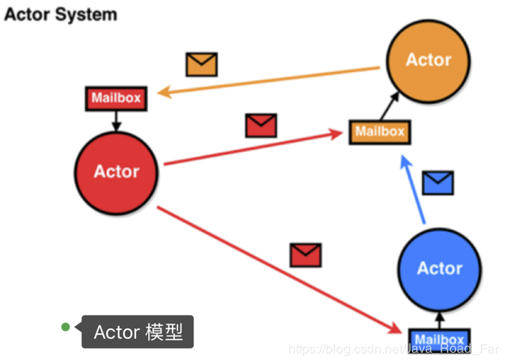
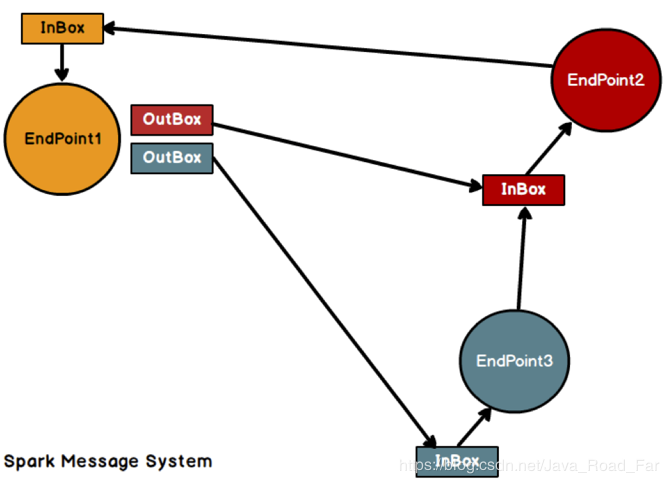
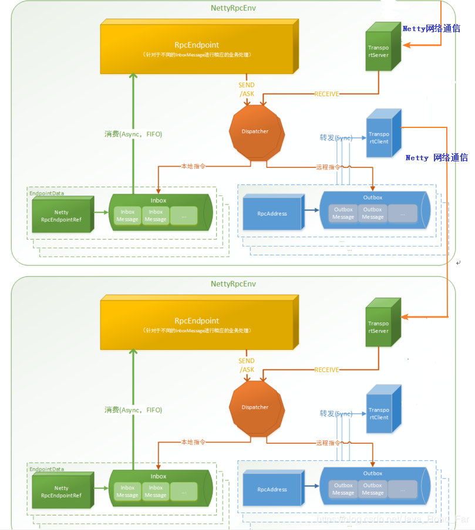
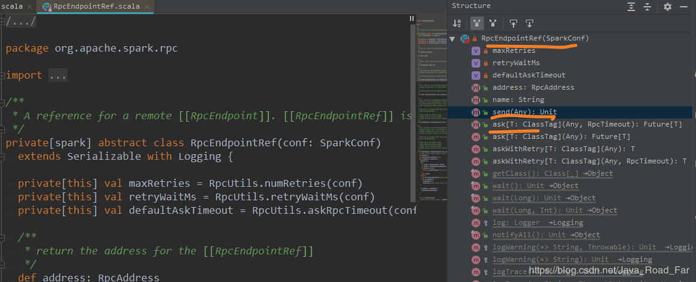
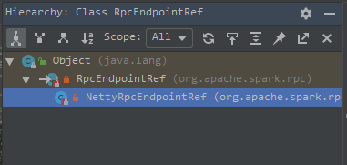
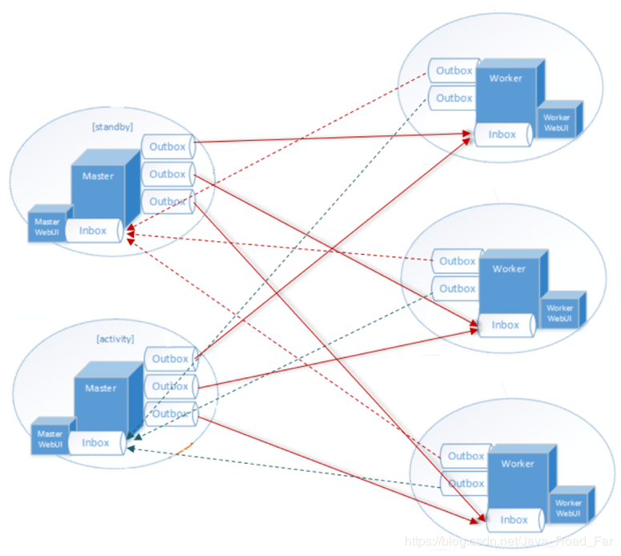

@[toc]

---
**文档说明：分析过程大多在 源码注释中，多看贴出来的代码及注释**

---
# 〇 整体流程图

**说明：** 
1.	start-all.sh脚本，实际是执行java -cp Master和java -cp Worker；
2.	Master启动时首先创建一个RpcEnv对象，负责管理所有通信逻辑；
3.	Master通过RpcEnv对象创建一个Endpoint，Master就是一个Endpoint，Worker可以与其进行通信；
4.	Worker启动时也是创建一个RpcEnv对象；
5.	Worker通过RpcEnv对象创建一个Endpoint；
6.	Worker通过RpcEnv对象建立到Master的连接，获取到一个RpcEndpointRef对象，通过该对象可以与Master通信；
7.	Worker向Master注册，注册内容包括主机名、端口、CPU Core数量、内存数量；
8.	Master接收到Worker的注册，将注册信息维护在内存中的Table中，其中还包含了一个到Worker的RpcEndpointRef对象引用；
9.	Master回复Worker已经接收到注册，告知Worker已经注册成功；
10.	Worker端收到成功注册响应后，开始周期性向Master发送心跳。


---
# ① 启动 master 脚本分析
---
## 一、启动脚本: start-all.sh
```bash
#!/usr/bin/env bash

# 如果配置了 SPARK_HOME 环境变量, 并且你安装了 多个Spark, 
# 那么不管你启动哪一个, 默认都找 配置了环境变量的服务
# 如果不配置, 会从该文件的目录得到 SPARK_HOME 的路径
if [ -z "${SPARK_HOME}" ]; then
  export SPARK_HOME="$(cd "`dirname "$0"`"/..; pwd)"
fi

# 加载 spark-config.sh 配置文件
. "${SPARK_HOME}/sbin/spark-config.sh"

# 启动 Master
"${SPARK_HOME}/sbin"/start-master.sh

# 启动 Workers
"${SPARK_HOME}/sbin"/start-slaves.sh

```
---
### 1.1 start-master.sh Master 脚本分析
```bash
#!/usr/bin/env bash

# 与 start-all.sh 一致
if [ -z "${SPARK_HOME}" ]; then
  export SPARK_HOME="$(cd "`dirname "$0"`"/..; pwd)"
fi

# 声明 CLASS, 后面会传入到 start-daemon.sh, 以守护进程启动 Master
CLASS="org.apache.spark.deploy.master.Master"

# Master Port 默认是: 7077
if [ "$SPARK_MASTER_PORT" = "" ]; then
  SPARK_MASTER_PORT=7077
fi

if [ "$SPARK_MASTER_HOST" = "" ]; then
  case `uname` in
      (SunOS)
	  SPARK_MASTER_HOST="`/usr/sbin/check-hostname | awk '{print $NF}'`"
	  ;;
      (*)
	  SPARK_MASTER_HOST="`hostname -f`"
	  ;;
  esac
fi

# Master WEBUI 端口默认为: 8080
if [ "$SPARK_MASTER_WEBUI_PORT" = "" ]; then
  SPARK_MASTER_WEBUI_PORT=8080
fi

# 执行 spark-daemon.sh, 并指定参数
# CLASS="org.apache.spark.deploy.master.Master"
# 去到 spark-daemon.sh 以 守护进程启动 Master 服务
"${SPARK_HOME}/sbin"/spark-daemon.sh start $CLASS 1 \
  --host $SPARK_MASTER_HOST --port $SPARK_MASTER_PORT --webui-port $SPARK_MASTER_WEBUI_PORT \
  $ORIGINAL_ARGS
```
---
### → 去到脚本: spark-daemon.sh
```bash
#!/usr/bin/env bash

case $option in
	
  # 在上一个脚本: start-master.sh 中传入 start 参数, 
  # 所以进入该处
  (start)
    run_command class "$@"
    ;;

# 调用到此方法
run_command() {
  mode="$1"
  
  mkdir -p "$SPARK_PID_DIR"

  case "$mode" in
    (class)
      execute_command nice -n "$SPARK_NICENESS" "${SPARK_HOME}"/bin/spark-class "$command" "$@"
      ;;
  esac
}

# 调用到此方法
execute_command() {
  if [ -z ${SPARK_NO_DAEMONIZE+set} ]; then
      # 最终以后台守护进程的方式启动 Master
      nohup -- "$@" >> $log 2>&1 < /dev/null &
  fi
}
```
最终以后台守护进程的方式启动的类为:
```bash
# 此前声明的参数如下
CLASS="org.apache.spark.deploy.master.Master"
ORIGINAL_ARGS="$@"

${SPARK_HOME}/sbin"/spark-daemon.sh start $CLASS 1 \
  --ip $SPARK_MASTER_IP --port $SPARK_MASTER_PORT --webui-port $SPARK_MASTER_WEBUI_PORT \
  $ORIGINAL_ARGS

# 最终参数传递后, 详细命令为：
/opt/module/spark-standalone/sbin/spark-daemon.sh start org.apache.spark.deploy.master.Master 1 \
--ip hadoop102 --port 7077 --webui-port 8080
```

---
### 1.2 start-slaves.sh Worker 脚本分析
```bash
#!/usr/bin/env bash

# 与前面的 start-master.sh 一致
if [ -z "${SPARK_HOME}" ]; then
  export SPARK_HOME="$(cd "`dirname "$0"`"/..; pwd)"
fi

# 声明 CLASS, 后面会传入到 start-daemon.sh, 以守护进程启动 Worker
CLASS="org.apache.spark.deploy.worker.Worker"

# 加载配置文件
. "${SPARK_HOME}/sbin/spark-config.sh"
. "${SPARK_HOME}/bin/load-spark-env.sh"

# port 及 host
if [ "$SPARK_MASTER_PORT" = "" ]; then
  SPARK_MASTER_PORT=7077
fi

if [ "$SPARK_MASTER_HOST" = "" ]; then
  case `uname` in
      (SunOS)
	  SPARK_MASTER_HOST="`/usr/sbin/check-hostname | awk '{print $NF}'`"
	  ;;
      (*)
	  SPARK_MASTER_HOST="`hostname -f`"
	  ;;
  esac
fi

# 运行:
"${SPARK_HOME}/sbin/slaves.sh" cd "${SPARK_HOME}" \; "${SPARK_HOME}/sbin/start-slave.sh" "spark://$SPARK_MASTER_HOST:$SPARK_MASTER_PORT"
```
---
### → 去到脚本：start-slave.sh, 最终去到上面列出的 spark-daemon.sh
```bash
#!/usr/bin/env bash

# # 与前面的 start-master.sh 一致
if [ -z "${SPARK_HOME}" ]; then
  export SPARK_HOME="$(cd "`dirname "$0"`"/..; pwd)"
fi

# 加载配置文件
. "${SPARK_HOME}/sbin/spark-config.sh"

. "${SPARK_HOME}/bin/load-spark-env.sh"

# 默认 Port
if [ "$SPARK_WORKER_WEBUI_PORT" = "" ]; then
  SPARK_WORKER_WEBUI_PORT=8081
fi

function start_instance {
  WORKER_NUM=$1
  shift

  if [ "$SPARK_WORKER_PORT" = "" ]; then
    PORT_FLAG=
    PORT_NUM=
  else
    PORT_FLAG="--port"
    PORT_NUM=$(( $SPARK_WORKER_PORT + $WORKER_NUM - 1 ))
  fi
  WEBUI_PORT=$(( $SPARK_WORKER_WEBUI_PORT + $WORKER_NUM - 1 ))

  # 以守护进程启动 Worker 
  "${SPARK_HOME}/sbin"/spark-daemon.sh start $CLASS $WORKER_NUM \
     --webui-port "$WEBUI_PORT" $PORT_FLAG $PORT_NUM $MASTER "$@"

}
```

至此，`start-all.sh` 脚本做的事已经全部做完，`Master`和 `Worker` 的启动，最终在 scala 代码中启动： 
① `org.apache.spark.deploy.master.Master`： 启动 Master 入口
② `org.apache.spark.deploy.worker.Worker`： 启动 Worker 入口

---
---
# ② Spark 通讯架构概述
**Spark 内置 RPC 框架**

----
在 Spark 中, 很多地方都涉及到网络通讯, 比如 Spark 各个组件间的消息互通, 用户文件与 Jar 包的上传, 节点间的 Shuffle 过程, Block 数据的复制与备份等.
1.	在 Spark0.x.x 与 Spark1.x.x 版本中, 组件间的消息通信主要借助于 Akka.
2.	在 Spark1.3 中引入了 Netty 通信框架. Akka要求message发送端和接收端有相同的版本, 所以为了避免 Akka 造成的版本问题，并给用户的应用更大灵活性，决定使用更通用的 RPC 实现，也就是现在的 Netty 来替代 Akka。
3.	Spark1.6 中 Akka 和 Netty 可以配置使用。Netty 完全实现了 Akka 在Spark 中的功能。
4.	从Spark2.0.0, Akka 被移除.

---

**Actor 模型**


---

**Netty 通信架构**

Netty 借鉴了 Akka 的 Actor 模型

Spark通讯框架中各个组件（Client/Master/Worker）可以认为是一个个独立的实体，各个实体之间通过消息来进行通信。
具体各个组件之间的关系图如下：

Endpoint（Client/Master/Worker）有 1 个 InBox 和 N 个 OutBox（N>=1，N取决于当前 Endpoint 与多少其他的 Endpoint 进行通信，一个与其通讯的其他Endpoint 对应一个 OutBox）

Endpoint 接收到的消息被写入 InBox，发送出去的消息写入 OutBox 并被发送到其他 Endpoint 的 InBox 中。

---
---
# ③ Spark Netty 通信架构解析
[Netty 官网](https://netty.io/): https://netty.io/


1.	RpcEndpoint：RPC 端点。
Spark 针对每个节点（Client/Master/Worker）都称之为一个 RpcEndpoint ，且都实现 RpcEndpoint接口，内部根据不同端点的需求，设计不同的消息和不同的业务处理，如果需要发送（询问）则内部调用 Dispatcher 的对应方法；

	说明:
•	RpcEndpoint 是用来接收消息.
•	发送消息的使用RpcEndpointRef

•	RpcEndpointRef的具体实现类是: NettyRpcEndpointRef

2.	RpcEnv: Rpc 上下文(Rpc 环境)
每个RpcEndpoint运行时依赖的上下文环境称为 RpcEnv

3.	Dispatcher：消息分发器
RPC 端点需要发送消息或者从远程 RPC 端点接收到的消息，分发至对应的指令收件箱/发件箱。
•	如果指令接收方是自己则存入收件箱
•	如果指令接收方不是自己则放入发件箱
	```scala
	// org.apache.spark.rpc.netty.NettyRpcEnv 类的 send 方法
	
	private[netty] def send(message: RequestMessage): Unit = {
		// 获取接收者地址信息
	    val remoteAddr = message.receiver.address
	    if (remoteAddr == address) {
	      // Message to a local RPC endpoint.
	      // 把消息发送到本地的 RPC 端点  (发送到收件箱)
	      try {
	        dispatcher.postOneWayMessage(message)
	      } catch {
	        case e: RpcEnvStoppedException => logWarning(e.getMessage)
	      }
	    } else {
	      // Message to a remote RPC endpoint.
	      // 把消息发送到远程的 RPC 端点.  (发送到发件箱)
	      postToOutbox(message.receiver, OneWayOutboxMessage(serialize(message)))
	    }
	  }
	```
4.	Inbox：指令消息收件箱。
一个本地 RpcEndpoint 对应一个收件箱
5.	RpcEndpointRef：RpcEndpointRef 是对远程 RpcEndpoint 的一个引用。
当我们需要向一个具体的 RpcEndpoint 发送消息时，一般我们需要获取到该RpcEndpoint 的引用，然后通过该引用发送消息。
6.	OutBox：指令消息发件箱。
对于当前 RpcEndpoint 来说，一个目标 RpcEndpoint 对应一个当前的发件箱，如果向多个目标 RpcEndpoint 发送信息，则有当前会有多个 OutBox。当消息放入 Outbox 后，紧接着通过 TransportClient 将消息发送出去。消息放入发件箱以及发送过程是在同一个线程中进行；
7.	RpcAddress：表示远程的RpcEndpointRef的地址，Host + Port。
8.	TransportClient：Netty通信客户端
一个 OutBox 对应一个 TransportClient，TransportClient 不断轮询OutBox，根据 OutBox 消息的 receiver 信息，请求对应的远程 TransportServer；
9.	TransportServer：Netty 通信服务端
一个 RpcEndpoint 对应一个 TransportServer，接受远程消息后调用 Dispatcher 分发消息至自己的收件箱,或者对应的发件箱；

---
**高层俯视图**


---
---
# ④ 启动 master 源码分析
## 一、Master伴生对象
从 shell 脚本中知道了，Master 的启动会来到 `org.apache.spark.deploy.master.Master` 类，启动 Master 的主入口为 Master 伴生对象 的 `main `方法

**1.** `org.apache.spark.deploy.master.Master.main`:
```scala
private[deploy] object Master extends Logging {
    val SYSTEM_NAME = "sparkMaster"
    val ENDPOINT_NAME = "Master"
    
    // 启动 Master 的入口函数
    def main(argStrings: Array[String]) {
        Utils.initDaemon(log)
        val conf = new SparkConf
        // 构建用于参数解析的实例   --host hadoop201 --port 7077 --webui-port 8080
        val args = new MasterArguments(argStrings, conf)
        // 启动 RPC 通信环境和 MasterEndPoint(通信终端)
        val (rpcEnv, _, _): (RpcEnv, Int, Option[Int]) = startRpcEnvAndEndpoint(args.host, args.port, args.webUiPort, conf)
        rpcEnv.awaitTermination()
    }
    
    /**
      * Start the Master and return a three tuple of:
      * 启动 Master, 并返回一个三元组
      * (1) The Master RpcEnv
      * (2) The web UI bound port
      * (3) The REST server bound port, if any
      */
    def startRpcEnvAndEndpoint(
                                  host: String,
                                  port: Int,
                                  webUiPort: Int,
                                  conf: SparkConf): (RpcEnv, Int, Option[Int]) = {
        val securityMgr = new SecurityManager(conf)
        // 创建 Master 端的 RpcEnv 环境, 并启动 RpcEnv
        // 参数: sparkMaster hadoop201 7077 conf securityMgr
        // 返回值  的实际类型是: NettyRpcEnv
        val rpcEnv: RpcEnv = RpcEnv.create(SYSTEM_NAME, host, port, conf, securityMgr)
        // 创建 Master对象, 该对象就是一个 RpcEndpoint, 在 RpcEnv 中注册这个 RpcEndpoint
        // 返回该 RpcEndpoint 的引用, 使用该引用来接收信息和发送信息
        val masterEndpoint: RpcEndpointRef = rpcEnv.setupEndpoint(ENDPOINT_NAME,
            new Master(rpcEnv, rpcEnv.address, webUiPort, securityMgr, conf))
        // 向 Master 的通信终端发法请求，获取 BoundPortsResponse 对象
        // BoundPortsResponse 是一个样例类包含三个属性: rpcEndpointPort webUIPort restPort
        val portsResponse: BoundPortsResponse = masterEndpoint.askWithRetry[BoundPortsResponse](BoundPortsRequest)
        (rpcEnv, portsResponse.webUIPort, portsResponse.restPort)
    }
```
---

## 二、RpcEnv的创建
真正的创建是调用 `NettyRpcEnvFactory` 的 `create` 方法创建的.
创建 `NettyRpcEnv` 的时候, 会创建消息分发器, 收件箱和存储远程地址与发件箱的 Map

**`org.apache.spark.rpc.RpcEnv:`**
```scala
def create(
                  name: String,
                  host: String,
                  port: Int,
                  conf: SparkConf,
                  securityManager: SecurityManager,
                  clientMode: Boolean = false): RpcEnv = {
        create(name, host, host, port, conf, securitanager, clientMode)
    }

    def create(
                  name: String,
                  bindAddress: String,
                  advertiseAddress: String,
                  port: Int,
                  conf: SparkConf,
                  securityManager: SecurityManager,
                  clientMode: Boolean): RpcEnv = {
        // 保存 RpcEnv 的配置信息
        val config = RpcEnvConfig(conf, name, bindAddress, advertiseAddress, port, securityManager,
            clientMode)
        // 创建 NettyRpcEvn
        new NettyRpcEnvFactory().create(config)
    }
```

**`org.apache.spark.rpc.netty.NettyRpcEnvFactory:`**
```scala
private[rpc] class NettyRpcEnvFactory extends RpcEnvFactory with Logging {

    def create(config: RpcEnvConfig): RpcEnv = {
        val sparkConf = config.conf
        // Use JavaSerializerInstance in multiple threads is safe. However, if we plan to support
        // KryoSerializer in future, we have to use ThreadLocal to store SerializerInstance
        // 用于 Rpc传输对象时的序列化
        val javaSerializerInstance: JavaSerializerInstance = new JavaSerializer(sparkConf)
            .newInstance()
            .asInstanceOf[JavaSerializerInstance]
        // 实例化 NettyRpcEnv
        val nettyEnv = new NettyRpcEnv(
            sparkConf,
            javaSerializerInstance,
            config.advertiseAddress,
            config.securityManager)
        if (!config.clientMode) {
            // 定义 NettyRpcEnv 的启动函数
            val startNettyRpcEnv: Int => (NettyRpcEnv, Int) = { actualPort =>
                nettyEnv.startServer(config.bindAddress, actualPort)
                (nettyEnv, nettyEnv.address.port)
            }
            try {
                // 启动 NettyRpcEnv
                Utils.startServiceOnPort(config.port, startNettyRpcEnv, sparkConf, config.name)._1
            } catch {
                case NonFatal(e) =>
                    nettyEnv.shutdown()
                    throw e
            }
        }
        nettyEnv
    }
}
```
---
**3.** 至此，NettyRpcEnv 创建完毕，回到  `org.apache.spark.deploy.master.Master.main` 的 `rpcEnv.setupEndpoint` 方法， 该方法的形参中，创建了 Master 对象: `new Master(rpcEnv, rpcEnv.address, webUiPort, securityMgr, conf)`

---

**4.`new Master(rpcEnv, rpcEnv.address, webUiPort, securityMgr, conf): `** 
```scala
private[deploy] class Master(
                                override val rpcEnv: RpcEnv,
                                address: RpcAddress,
                                webUiPort: Int,
                                val securityMgr: SecurityManager,
                                val conf: SparkConf)
    extends ThreadSafeRpcEndpoint with Logging with LeaderElectable {
```
`Master` 继承了 `ThreadSafeRpcEndpoint` ，`ThreadSafeRpcEndpoint ` 继承了 `RpcEndpoint`

`RpcEndpoint` 是一个 特质类(trait)， 看该类的注释：
- 保证按顺序调用“onstart”、“receive”和“onstop”。
- 声明周期为: constructor -> onStart -> receive* -> onStop
```scala
/**
 * An end point for the RPC that defines what functions to trigger given a message.
 *
 * 保证按顺序调用“onstart”、“receive”和“onstop”。
 * It is guaranteed that `onStart`, `receive` and `onStop` will be called in sequence.
 *
 * 声明周期为: constructor -> onStart -> receive* -> onStop
 * The life-cycle of an endpoint is:
 *
 * constructor -> onStart -> receive* -> onStop
 *
 * Note: `receive` can be called concurrently. If you want `receive` to be thread-safe, please use
 * [[ThreadSafeRpcEndpoint]]
 *
 * If any error is thrown from one of [[RpcEndpoint]] methods except `onError`, `onError` will be
 * invoked with the cause. If `onError` throws an error, [[RpcEnv]] will ignore it.
 */
private[spark] trait RpcEndpoint {
```

知道了该类的声明周期，我们回到 Master 类中: 

**onStart() 方法：** 
```scala
override def onStart(): Unit = {
    logInfo("Starting Spark master at " + masterUrl)
    logInfo(s"Running Spark version ${org.apache.spark.SPARK_VERSION}")
    // 创建 WebUI 服务器
    webUi = new MasterWebUI(this, webUiPort)
    webUi.bind()
    masterWebUiUrl = "http://" + masterPublicAddress + ":" + webUi.boundPort
    if (reverseProxy) {
        masterWebUiUrl = conf.get("spark.ui.reverseProxyUrl", masterWebUiUrl)
        logInfo(s"Spark Master is acting as a reverse proxy. Master, Workers and " +
            s"Applications UIs are available at $masterWebUiUrl")
    }
    // 按照固定的频率去启动线程来检查 Worker 是否超时. 其实就是给自己发信息: CheckForWorkerTimeOut
    // 默认是每分钟检查一次.
    checkForWorkerTimeOutTask = forwardMessageThread.scheduleAtFixedRate(new Runnable {
        override def run(): Unit = Utils.tryLogNonFatalError {
        	// 在 receive 方法中对 CheckForWorkerTimeOut 进行处理
            self.send(CheckForWorkerTimeOut)
        }
    }, 0, WORKER_TIMEOUT_MS, TimeUnit.MILLISECONDS)
    
    if (restServerEnabled) {
        val port = conf.getInt("spark.master.rest.port", 6066)
        restServer = Some(new StandaloneRestServer(address.host, port, conf, self, masterUrl))
    }
    
    restServerBoundPort = restServer.map(_.start())
    
    // master 调度器的注册及启动, 此时我们不去关注该 master 调度器
    masterMetricsSystem.registerSource(masterSource)
    masterMetricsSystem.start()
    applicationMetricsSystem.start()
    // Attach the master and app metrics servlet handler to the web ui after the metrics systems are
    // started.
    masterMetricsSystem.getServletHandlers.foreach(webUi.attachHandler)
    applicationMetricsSystem.getServletHandlers.foreach(webUi.attachHandler)
    
    val serializer = new JavaSerializer(conf)
    val (persistenceEngine_, leaderElectionAgent_) = RECOVERY_MODE match {
        case "ZOOKEEPER" =>
            logInfo("Persisting recovery state to ZooKeeper")
            val zkFactory =
                new ZooKeeperRecoveryModeFactory(conf, serializer)
            (zkFactory.createPersistenceEngine(), zkFactory.createLeaderElectionAgent(this))
        case "FILESYSTEM" =>
            val fsFactory =
                new FileSystemRecoveryModeFactory(conf, serializer)
            (fsFactory.createPersistenceEngine(), fsFactory.createLeaderElectionAgent(this))
        case "CUSTOM" =>
            val clazz = Utils.classForName(conf.get("spark.deploy.recoveryMode.factory"))
            val factory = clazz.getConstructor(classOf[SparkConf], classOf[Serializer])
                .newInstance(conf, serializer)
                .asInstanceOf[StandaloneRecoveryModeFactory]
            (factory.createPersistenceEngine(), factory.createLeaderElectionAgent(this))
        case _ =>
            (new BlackHolePersistenceEngine(), new MonarchyLeaderAgent(this))
    }
    persistenceEngine = persistenceEngine_
    leaderElectionAgent = leaderElectionAgent_
}
```

**receive() 方法：**
```scala
override def receive: PartialFunction[Any, Unit] = {
    case ElectedLeader =>
        val (storedApps, storedDrivers, storedWorkers) = persistenceEngine.readPersistedData(rpcEnv)
        state = if (storedApps.isEmpty && storedDrivers.isEmpty && storedWorkers.isEmpty) {
            RecoveryState.ALIVE
        } else {
            RecoveryState.RECOVERING
        }
        logInfo("I have been elected leader! New state: " + state)
        if (state == RecoveryState.RECOVERING) {
            beginRecovery(storedApps, storedDrivers, storedWorkers)
            recoveryCompletionTask = forwardMessageThread.schedule(new Runnable {
                override def run(): Unit = Utils.tryLogNonFatalError {
                    self.send(CompleteRecovery)
                }
            }, WORKER_TIMEOUT_MS, TimeUnit.MILLISECONDS)
        }
    
    case CompleteRecovery => completeRecovery()
    
    case RevokedLeadership =>
        logError("Leadership has been revoked -- master shutting down.")
        System.exit(0)
    
    case RegisterApplication(description, driver) =>
        // TODO Prevent repeated registrations from some driver
        if (state == RecoveryState.STANDBY) {
            // ignore, don't send response
        } else {
            logInfo("Registering app " + description.name)
            val app = createApplication(description, driver)
            registerApplication(app)
            logInfo("Registered app " + description.name + " with ID " + app.id)
            persistenceEngine.addApplication(app)
            driver.send(RegisteredApplication(app.id, self))
            schedule()
        }
    
    case ExecutorStateChanged(appId, execId, state, message, exitStatus) =>
        val execOption = idToApp.get(appId).flatMap(app => app.executors.get(execId))
        execOption match {
            case Some(exec) =>
                val appInfo = idToApp(appId)
                val oldState = exec.state
                exec.state = state
                
                if (state == ExecutorState.RUNNING) {
                    assert(oldState == ExecutorState.LAUNCHING,
                        s"executor $execId state transfer from $oldState to RUNNING is illegal")
                    appInfo.resetRetryCount()
                }
                
                exec.application.driver.send(ExecutorUpdated(execId, state, message, exitStatus, false))
                
                if (ExecutorState.isFinished(state)) {
                    // Remove this executor from the worker and app
                    logInfo(s"Removing executor ${exec.fullId} because it is $state")
                    // If an application has already finished, preserve its
                    // state to display its information properly on the UI
                    if (!appInfo.isFinished) {
                        appInfo.removeExecutor(exec)
                    }
                    exec.worker.removeExecutor(exec)
                    
                    val normalExit = exitStatus == Some(0)
                    // Only retry certain number of times so we don't go into an infinite loop.
                    // Important note: this code path is not exercised by tests, so be very careful when
                    // changing this `if` condition.
                    if (!normalExit
                        && appInfo.incrementRetryCount() >= MAX_EXECUTOR_RETRIES
                        && MAX_EXECUTOR_RETRIES >= 0) { // < 0 disables this application-killing path
                        val execs = appInfo.executors.values
                        if (!execs.exists(_.state == ExecutorState.RUNNING)) {
                            logError(s"Application ${appInfo.desc.name} with ID ${appInfo.id} failed " +
                                s"${appInfo.retryCount} times; removing it")
                            removeApplication(appInfo, ApplicationState.FAILED)
                        }
                    }
                }
                schedule()
            case None =>
                logWarning(s"Got status update for unknown executor $appId/$execId")
        }
    
    case DriverStateChanged(driverId, state, exception) =>
        state match {
            case DriverState.ERROR | DriverState.FINISHED | DriverState.KILLED | DriverState.FAILED =>
                removeDriver(driverId, state, exception)
            case _ =>
                throw new Exception(s"Received unexpected state update for driver $driverId: $state")
        }
    
    case Heartbeat(workerId, worker) =>
        idToWorker.get(workerId) match {
            case Some(workerInfo) =>
                // 记录该 Worker 的最新心跳   每 15秒更新一次
                workerInfo.lastHeartbeat = System.currentTimeMillis()
            case None =>
                if (workers.map(_.id).contains(workerId)) {
                    logWarning(s"Got heartbeat from unregistered worker $workerId." +
                        " Asking it to re-register.")
                    worker.send(ReconnectWorker(masterUrl))
                } else {
                    logWarning(s"Got heartbeat from unregistered worker $workerId." +
                        " This worker was never registered, so ignoring the heartbeat.")
                }
        }
    
    case MasterChangeAcknowledged(appId) =>
        idToApp.get(appId) match {
            case Some(app) =>
                logInfo("Application has been re-registered: " + appId)
                app.state = ApplicationState.WAITING
            case None =>
                logWarning("Master change ack from unknown app: " + appId)
        }
        
        if (canCompleteRecovery) {
            completeRecovery()
        }
    
    case WorkerSchedulerStateResponse(workerId, executors, driverIds) =>
        idToWorker.get(workerId) match {
            case Some(worker) =>
                logInfo("Worker has been re-registered: " + workerId)
                worker.state = WorkerState.ALIVE
                
                val validExecutors = executors.filter(exec => idToApp.get(exec.appId).isDefined)
                for (exec <- validExecutors) {
                    val app = idToApp.get(exec.appId).get
                    val execInfo = app.addExecutor(worker, exec.cores, Some(exec.execId))
                    worker.addExecutor(execInfo)
                    execInfo.copyState(exec)
                }
                
                for (driverId <- driverIds) {
                    drivers.find(_.id == driverId).foreach { driver =>
                        driver.worker = Some(worker)
                        driver.state = DriverState.RUNNING
                        worker.drivers(driverId) = driver
                    }
                }
            case None =>
                logWarning("Scheduler state from unknown worker: " + workerId)
        }
        
        if (canCompleteRecovery) {
            completeRecovery()
        }
    
    case WorkerLatestState(workerId, executors, driverIds) =>
        idToWorker.get(workerId) match {
            case Some(worker) =>
                for (exec <- executors) {
                    val executorMatches = worker.executors.exists {
                        case (_, e) => e.application.id == exec.appId && e.id == exec.execId
                    }
                    if (!executorMatches) {
                        // master doesn't recognize this executor. So just tell worker to kill it.
                        worker.endpoint.send(KillExecutor(masterUrl, exec.appId, exec.execId))
                    }
                }
                
                for (driverId <- driverIds) {
                    val driverMatches = worker.drivers.exists { case (id, _) => id == driverId }
                    if (!driverMatches) {
                        // master doesn't recognize this driver. So just tell worker to kill it.
                        worker.endpoint.send(KillDriver(driverId))
                    }
                }
            case None =>
                logWarning("Worker state from unknown worker: " + workerId)
        }
    
    case UnregisterApplication(applicationId) =>
        logInfo(s"Received unregister request from application $applicationId")
        idToApp.get(applicationId).foreach(finishApplication)
    
    case CheckForWorkerTimeOut =>
        timeOutDeadWorkers()
    
}


/** Check for, and remove, any timed-out workers */
// 处理Worker是否超时的方法:
private def timeOutDeadWorkers() {
    // Copy the workers into an array so we don't modify the hashset while iterating through it
    val currentTime = System.currentTimeMillis()
    //  把超时的 Worker 从 workers 中移除
    val toRemove = workers.filter(_.lastHeartbeat < currentTime - WORKER_TIMEOUT_MS).toArray
    for (worker <- toRemove) {
        // 如果 worker 的状态不是 DEAD
        if (worker.state != WorkerState.DEAD) {
            logWarning("Removing %s because we got no heartbeat in %d seconds".format(
                worker.id, WORKER_TIMEOUT_MS / 1000))
            removeWorker(worker) //
        } else {
            if (worker.lastHeartbeat < currentTime - ((REAPER_ITERATIONS + 1) * WORKER_TIMEOUT_MS)) {
                workers -= worker // we've seen this DEAD worker in the UI, etc. for long enough; cull it
            }
        }
    }
}
```
**onStop() 方法：**
```scala
override def onStop() {
    masterMetricsSystem.report()
    applicationMetricsSystem.report()
    // prevent the CompleteRecovery message sending to restarted master
    if (recoveryCompletionTask != null) {
        recoveryCompletionTask.cancel(true)
    }
    if (checkForWorkerTimeOutTask != null) {
        checkForWorkerTimeOutTask.cancel(true)
    }
    forwardMessageThread.shutdownNow()
    webUi.stop()
    restServer.foreach(_.stop())
    masterMetricsSystem.stop()
    applicationMetricsSystem.stop()
    persistenceEngine.close()
    leaderElectionAgent.stop()
}
```

至此， Master 创建完毕


