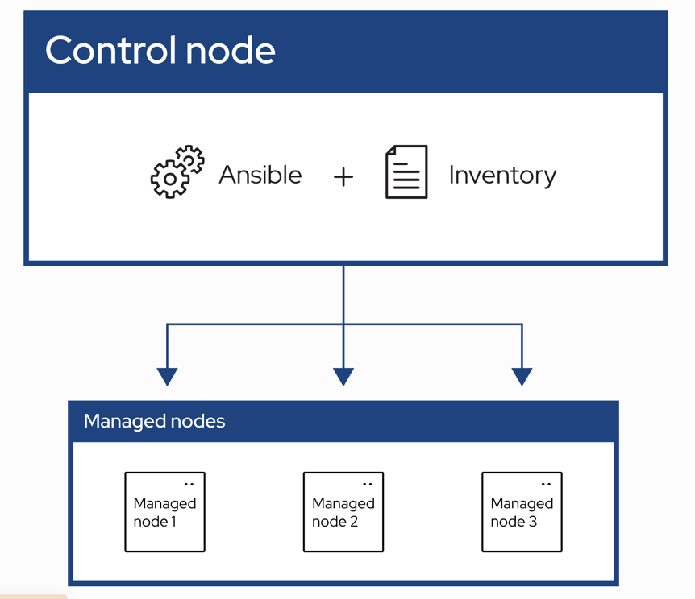

# 一、Ansible 说明


Ansible 有三个重要的组件:
1. Control Node: 安装了 Ansible 的节点. 可以在这个节点执行 `ansible` 或 `ansible-playbook` 等命令. 
2. Inventory: 按逻辑组织起来的被管理的节点列表. 在 Control Node 上创建 Inventory 清单来描述主机.
3. Managed Node: 被管理的节点.


# 二、Ansible 安装
```bash
# pip 安装
$ pip install --no-index --ignore-installed  --find-links=ansible_soft ansible 

# yum(或者其他操作系统) 安装
$ yum -y install ansible 
``` 
安装完成后查看版本
```bash
$ ansible --version
ansible 2.9.27
  config file = /etc/ansible/ansible.cfg
  configured module search path = [u'/root/.ansible/plugins/modules', u'/usr/share/ansible/plugins/modules']
  ansible python module location = /usr/lib/python2.7/site-packages/ansible
  executable location = /usr/bin/ansible
  python version = 2.7.5 (default, Nov 14 2023, 16:14:06) [GCC 4.8.5 20150623 (Red Hat 4.8.5-44)]
```

# 三、Inventory
如果不是用 pip 安装, 那么在 `/etc/ansible` 目录下有如下内容:
```bash
/etc/ansible/
├── ansible.cfg
├── hosts
└── roles
```

## 3.1 Inventory 节点清单配置方式1
修改 `/etc/ansible/hosts` 文件
```bash
$ /etc/ansible/hosts
[custom1]
172.18.207.67
172.18.207.68
172.18.207.69

[custom2]
172.18.207.51
172.18.207.52
172.18.207.53
...
```

## 3.2 Inventory 节点清单配置方式2
也可以不用 `/etc/ansible/hosts` 文件, 直接创建新的
```bash
# yaml 格式
$ vim inventory1
custom1:
  hosts:
    172.18.207.67
    172.18.207.68
    172.18.207.69
custom2:
  hosts:
    172.18.207.51
    172.18.207.52
    172.18.207.53
...

# INI 格式
[custom]
172.18.207.67
172.18.207.68
172.18.207.69

[custom2]
172.18.207.51
172.18.207.52
172.18.207.53
...
```

## 3.3 父子结构的配置
```bash
ungrouped:
  hosts:
    mail.example.com:
webservers:
  hosts:
    foo.example.com:
    bar.example.com:
dbservers:
  hosts:
    one.example.com:
    two.example.com:
    three.example.com:
east:
  hosts:
    foo.example.com:
    one.example.com:
    two.example.com:
west:
  hosts:
    bar.example.com:
    three.example.com:
prod:
  children:
    east:
test:
  children:
    west:
```

## 3.4 范围主机
```bash
# INI 格式
[webservers]
www[01:50:2].example.com  # :2 是步长, 比如 01,03,05..., 不会出现 02,04,06

# yaml 格式
# ...
  webservers:
    hosts:
      www[01:50].example.com:
```

# 二、Ansible Plugins
[Ansible 有很多方便的插件](https://docs.ansible.com/ansible/latest/plugins/plugins.html)


