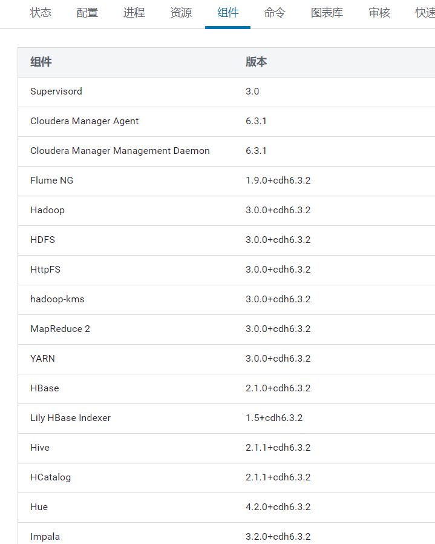
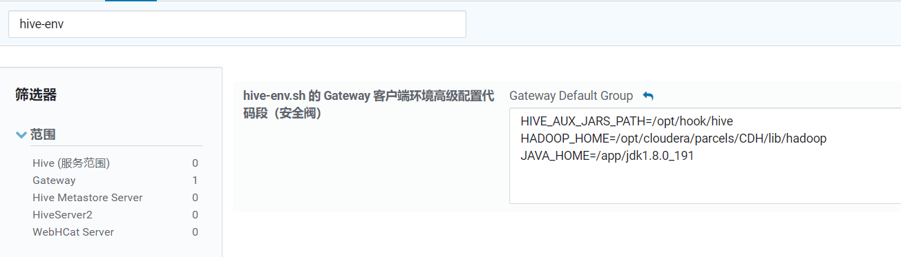
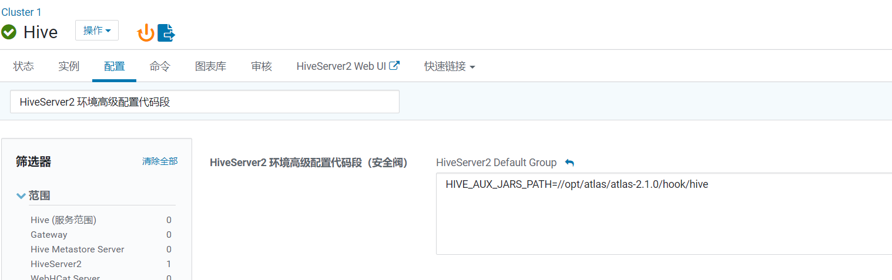

* [一、下载源码包](#%E4%B8%80%E4%B8%8B%E8%BD%BD%E6%BA%90%E7%A0%81%E5%8C%85)
  * [1\.1 修改 pom 文件](#11-%E4%BF%AE%E6%94%B9-pom-%E6%96%87%E4%BB%B6)
  * [1\.2 兼容 Hive2\.1\.1版本](#12-%E5%85%BC%E5%AE%B9-hive211%E7%89%88%E6%9C%AC)
* [二、编译](#%E4%BA%8C%E7%BC%96%E8%AF%91)
* [三、解压](#%E4%B8%89%E8%A7%A3%E5%8E%8B)
* [四、集成外部框架 \- HBase](#%E5%9B%9B%E9%9B%86%E6%88%90%E5%A4%96%E9%83%A8%E6%A1%86%E6%9E%B6---hbase)
  * [4\.1 进入 atlas/conf 目录, 修改配置文件](#41-%E8%BF%9B%E5%85%A5-atlasconf-%E7%9B%AE%E5%BD%95-%E4%BF%AE%E6%94%B9%E9%85%8D%E7%BD%AE%E6%96%87%E4%BB%B6)
  * [4\.2 添加 HBase 配置文件](#42-%E6%B7%BB%E5%8A%A0-hbase-%E9%85%8D%E7%BD%AE%E6%96%87%E4%BB%B6)
  * [4\.3 配置 HBASE\_CONF\_DIR](#43-%E9%85%8D%E7%BD%AE-hbase_conf_dir)
* [五、集成外部框架 \- Solr](#%E4%BA%94%E9%9B%86%E6%88%90%E5%A4%96%E9%83%A8%E6%A1%86%E6%9E%B6---solr)
  * [5\.1 进入 atlas/conf 目录, 修改配置文件](#51-%E8%BF%9B%E5%85%A5-atlasconf-%E7%9B%AE%E5%BD%95-%E4%BF%AE%E6%94%B9%E9%85%8D%E7%BD%AE%E6%96%87%E4%BB%B6)
  * [5\.2 将 Atlas 自带的 Solr 文件拷贝到外部 Solr 集群](#52-%E5%B0%86-atlas-%E8%87%AA%E5%B8%A6%E7%9A%84-solr-%E6%96%87%E4%BB%B6%E6%8B%B7%E8%B4%9D%E5%88%B0%E5%A4%96%E9%83%A8-solr-%E9%9B%86%E7%BE%A4)
  * [5\.3 将拷贝的文件重命名为 atlas\_conf](#53-%E5%B0%86%E6%8B%B7%E8%B4%9D%E7%9A%84%E6%96%87%E4%BB%B6%E9%87%8D%E5%91%BD%E5%90%8D%E4%B8%BA-atlas_conf)
  * [5\.4 修改 /etc/passwd 文件](#54-%E4%BF%AE%E6%94%B9-etcpasswd-%E6%96%87%E4%BB%B6)
  * [5\.5 切换登录用户](#55-%E5%88%87%E6%8D%A2%E7%99%BB%E5%BD%95%E7%94%A8%E6%88%B7)
  * [5\.6 执行如下 3条命令](#56-%E6%89%A7%E8%A1%8C%E5%A6%82%E4%B8%8B-3%E6%9D%A1%E5%91%BD%E4%BB%A4)
  * [5\.7 验证创建collection成功](#57-%E9%AA%8C%E8%AF%81%E5%88%9B%E5%BB%BAcollection%E6%88%90%E5%8A%9F)
* [六、集成外部框架 \- Kafka](#%E5%85%AD%E9%9B%86%E6%88%90%E5%A4%96%E9%83%A8%E6%A1%86%E6%9E%B6---kafka)
  * [修改 atlas\-application\.properties](#%E4%BF%AE%E6%94%B9-atlas-applicationproperties)
  * [6\.1 创建 kafka topic](#61-%E5%88%9B%E5%BB%BA-kafka-topic)
  * [6\.2 查看 topic](#62-%E6%9F%A5%E7%9C%8B-topic)
* [七、Atlas 其他配置](#%E4%B8%83atlas-%E5%85%B6%E4%BB%96%E9%85%8D%E7%BD%AE)
  * [7\.1 修改 atlas\-application\.properties](#71-%E4%BF%AE%E6%94%B9-atlas-applicationproperties)
  * [7\.2 修改 atlas\-log4j\.xml](#72-%E4%BF%AE%E6%94%B9-atlas-log4jxml)
  * [7\.3 分发配置文件](#73-%E5%88%86%E5%8F%91%E9%85%8D%E7%BD%AE%E6%96%87%E4%BB%B6)
  * [7\.4 启动 Atlas](#74-%E5%90%AF%E5%8A%A8-atlas)
* [八、集成外部框架 \- Hive](#%E5%85%AB%E9%9B%86%E6%88%90%E5%A4%96%E9%83%A8%E6%A1%86%E6%9E%B6---hive)
  * [修改配置文件](#%E4%BF%AE%E6%94%B9%E9%85%8D%E7%BD%AE%E6%96%87%E4%BB%B6)
  * [添加相关配置](#%E6%B7%BB%E5%8A%A0%E7%9B%B8%E5%85%B3%E9%85%8D%E7%BD%AE)
  * [重启 Hive](#%E9%87%8D%E5%90%AF-hive)
  * [8\.1 修改 Hive 相关配置文件](#81-%E4%BF%AE%E6%94%B9-hive-%E7%9B%B8%E5%85%B3%E9%85%8D%E7%BD%AE%E6%96%87%E4%BB%B6)
  * [8\.2 将hive元数据导入Atlas](#82-%E5%B0%86hive%E5%85%83%E6%95%B0%E6%8D%AE%E5%AF%BC%E5%85%A5atlas)


---
# 一、下载源码包
[下载地址](https://mirror.bit.edu.cn/apache/atlas/2.1.0/)


## 1.1 修改 pom 文件
下载好之后解压, 然后修改 pom 文件, 在 pom 文件中新增如下内容:
```pom
<repository>
    <id>cloudera</id>
    <url>https://repository.cloudera.com/artifactory/cloudera-repos</url>
    <releases>
        <enabled>true</enabled>
    </releases>
    <snapshots>
        <enabled>false</enabled>
    </snapshots>
</repository>   
```

修改 CDH 组件对应的版本, 组件版本具体信息在 CDH Web UI 中查看, 如下图

```pom
<lucene-solr.version>7.4.0-cdh6.3.2</lucene-solr.version>
<hadoop.version>3.0.0-cdh6.3.2</hadoop.version>
<hbase.version>2.1.0-cdh6.3.2</hbase.version>
<solr.version>7.4.0-cdh6.3.2</solr.version>
<hive.version>2.1.1-cdh6.3.2</hive.version>
<kafka.version>2.2.1-cdh6.3.2</kafka.version>
<kafka.scala.binary.version>2.11</kafka.scala.binary.version>
<calcite.version>1.16.0</calcite.version>
<zookeeper.version>3.4.5-cdh6.3.2</zookeeper.version>
<falcon.version>0.8</falcon.version>
<sqoop.version>1.4.7+cdh6.3.2</sqoop.version>
```

## 1.2 兼容 Hive2.1.1版本
所需修改的项目位置: apache-atlas-sources-2.1.0/addons/hive-bridge
1. org/apache/atlas/hive/bridge/HiveMetaStoreBridge.java 577行
    ```java
    public static String getDatabaseName(Database hiveDB) {
        String dbName      = hiveDB.getName().toLowerCase();
        // String catalogName = hiveDB.getCatalogName() != null ? hiveDB.getCatalogName().toLowerCase() : null;
        String catalogName = null;
    ...
    ```
2. org/apache/atlas/hive/hook/AtlasHiveHookContext.java 81行
```java
HiveHookObjectNamesCache knownObjects,
                        HiveMetastoreHook metastoreHook, ListenerEvent listenerEvent) throws Exception {
this.hook             = hook;
this.hiveOperation    = hiveOperation;
this.hiveContext      = hiveContext;
this.hive             = hiveContext != null ? Hive.get(hiveContext.getConf()) : null;
this.knownObjects     = knownObjects;
this.metastoreHook    = metastoreHook;
this.metastoreEvent   = listenerEvent;
// this.metastoreHandler = (listenerEvent != null) ? metastoreEvent.getIHMSHandler() : null;
this.metastoreHandler = null;
```

# 二、编译
如果使用外部的 HBase和Solr, 则使用如下编译命令
```bash
$ mvn clean -DskipTests package -Pdist
```
如果使用 atlas 自带的 HBase 和 Solr, 则使用如下编译命令
```bash
$ mvn clean -DskipTests package -Pdist,embedded-hbase-solr
```

# 三、解压
```bash
$ tar -zxvf apache-atlas-2.1.0-bin.tar.gz
# 分发到从节点
# scp -r /opt/atlas root@kino2://opt/
# scp -r /opt/atlas root@kino3://opt/
```

# 四、集成外部框架 - HBase
## 4.1 进入 atlas/conf 目录, 修改配置文件
```bash
$ vim atlas-application.properties 
#修改atlas存储数据主机
atlas.graph.storage.backend=hbase
atlas.graph.storage.hbase.table=atlas
atlas.graph.storage.hostname=kino1:2181,kino2:2181,kino3:2181
```
## 4.2 添加 HBase 配置文件
```bash
$ ln -s /etc/hbase/conf/ /opt/atlas-2.1.0/conf/hbase
```
## 4.3 配置 HBASE_CONF_DIR 
```bash
$ vim atlas-env.sh
#添加HBase配置文件路径
export HBASE_CONF_DIR=/etc/hbase/conf
```

# 五、集成外部框架 - Solr
## 5.1 进入 atlas/conf 目录, 修改配置文件
```bash
$ vim atlas-application.properties 
#修改如下配置
atlas.graph.index.search.solr.zookeeper-url=kino1:2181/solr,kino2:2181/solr,kino3:2181/solr
```
## 5.2 将 Atlas 自带的 Solr 文件拷贝到外部 Solr 集群
```bash
$ cp -r solr /opt/cloudera/parcels/CDH/lib/solr/
```
## 5.3 将拷贝的文件重命名为 atlas_conf
```bash
$ cd /opt/cloudera/parcels/CDH/lib/solr/
$ mv solr atlas_conf
# 将 atlas_conf 发送到其他从节点
$ scp -r atlas_conf root@kino2:///opt/cloudera/parcels/CDH/lib/solr/
$ scp -r atlas_conf root@kino3:///opt/cloudera/parcels/CDH/lib/solr/
```
## 5.4 修改 /etc/passwd 文件
```bash
# 将 solr 这一行修改为
$ solr:x:990:988:Solr:/var/lib/solr:/bin/bash # /sbin/nologin -> /bin/bash
```
## 5.5 切换登录用户
```bash
$ su - solr
```
## 5.6 执行如下 3条命令
```bash
$ /opt/cloudera/parcels/CDH/lib/solr/bin/solr create -c vertex_index -d /opt/cloudera/parcels/CDH/lib/solr/atlas_conf -shards 3 -replicationFactor 2
  
$ /opt/cloudera/parcels/CDH/lib/solr/bin/solr create -c edge_index -d /opt/cloudera/parcels/CDH/lib/solr/atlas_conf -shards 3 -replicationFactor 2
  
$ /opt/cloudera/parcels/CDH/lib/solr/bin/solr create -c fulltext_index -d /opt/cloudera/parcels/CDH/lib/solr/atlas_conf -shards 3 -replicationFactor 2
```
- shards 3：表示该集合分片数为3
- replicationFactor 2：表示每个分片数都有2个备份
- vertex_index、edge_index、fulltext_index：表示集合名称

注意：如果需要删除vertex_index、edge_index、fulltext_index等collection可以执行如下命令:
```bash
$ /opt/cloudera/parcels/CDH/lib/solr/bin/solr delete -c ${collection_name}
```
## 5.7 验证创建collection成功
登录solr web控制台: http://kino1:8983/solr/#/~cloud 看到如下图显示: 

# 六、集成外部框架 - Kafka
## 修改 atlas-application.properties 
```bash
$ vim atlas-application.properties 
atlas.notification.embedded=false
atlas.kafka.zookeeper.connect=kino1:2281,kino2:2281,kino3:2281
atlas.kafka.bootstrap.servers=kino1:9092,kino2:9092,kino3:9092
atlas.kafka.zookeeper.session.timeout.ms=4000
atlas.kafka.zookeeper.connection.timeout.ms=2000
atlas.kafka.zookeeper.sync.time.ms=20
atlas.kafka.auto.commit.interval.ms=1000
atlas.kafka.hook.group.id=atlas

atlas.kafka.enable.auto.commit=true
```
## 6.1 创建 kafka topic
```bash
$ kafka-topics --zookeeper kino1:2281,kino2:2281,kino3:2281 --create --replication-factor 3 --partitions 3 --topic _HOATLASOK
$ kafka-topics --zookeeper kino1:2281,kino2:2281,kino3:2281 --create --replication-factor 3 --partitions 3 --topic ATLAS_ENTITIES
$ kafka-topics --zookeeper kino1:2281,kino2:2281,kino3:2281 --create --replication-factor 3 --partitions 3 --topic ATLAS_HOOK
```
## 6.2 查看 topic
```bash
$ kafka-topics --list --zookeeper kino1:2281,kino2:2281,kino3:2281
ATLAS_ENTITIES
ATLAS_HOOK
_HOATLASOK
__consumer_offsets
....
```

# 七、Atlas 其他配置
## 7.1 修改 atlas-application.properties 
```bash
$ vim atlas-application.properties 
# 修改 addrss
atlas.rest.address=http://kino1:21000
# 打开注释
atlas.server.run.setup.on.start=false
# 修改 zookeeper地址
atlas.audit.hbase.zookeeper.quorum=kino1:2281,kino2:2281,kino3:2281
```
## 7.2 修改 atlas-log4j.xml
```bash
$ vim atlas-log4j.xml
#去掉如下代码的注释
<appender name="perf_appender" class="org.apache.log4j.DailyRollingFileAppender">
    <param name="file" value="${atlas.log.dir}/atlas_perf.log" />
    <param name="datePattern" value="'.'yyyy-MM-dd" />
    <param name="append" value="true" />
    <layout class="org.apache.log4j.PatternLayout">
        <param name="ConversionPattern" value="%d|%t|%m%n" />
    </layout>
</appender>

<logger name="org.apache.atlas.perf" additivity="false">
    <level value="debug" />
    <appender-ref ref="perf_appender" />
</logger>
```
## 7.3 分发配置文件
```bash
$ scp atlas-application.properties root@kino2://opt/atlas/conf/
$ scp atlas-application.properties root@kino3://opt/atlas/conf/

$ scp atlas-log4j.xml root@kino2://opt/atlas/conf/
$ scp atlas-log4j.xml root@kino3://opt/atlas/conf/
```
## 7.4 启动 Atlas
```bash
$ cd /opt/atlas/atlas-2.1.0
$ bin/atlas_start.py
starting atlas on host localhost
starting atlas on port 21000

Apache Atlas Server started!!!
```

登录 atlas web控制台: http://kino1:21000 验证是否启动成功！

默认用户名和密码为：admin


# 八、集成外部框架 - Hive
该步骤所有的配置文件及 jar包都需要分发到hive相关的节点
## 修改配置文件
```bash
$ vim atlas-application.properties
# 增加如下内容
######### Hive Hook Configs #######
atlas.hook.hive.synchronous=false
atlas.hook.hive.numRetries=3
atlas.hook.hive.queueSize=10000
atlas.cluster.name=primary
```

## 添加相关配置
将 编译好的 apache-atlas-2.1.0-hive-hook.tar.gz 上传到服务器上
```bash
$ tar -zxvf apache-atlas-2.0.0-hive-hook.tar.gz
```
将 hook和hook-bin 目录到到/app/atlas-2.1.0 文件夹中
```bash
$ cp hook* /app/atlas-2.1.0
```
将 atlas-application.properties 配置文件加入到 atlas-plugin-classloader-2.1.0.jar 中
```bash
$ cd /app/atlas-2.1.0/hook/hive

$ cp /app/atlas-2.1.0/conf/atlas-application.properties ./

$ zip -u atlas-plugin-classloader-2.1.0.jar atlas-application.properties

$ cp /app/atlas-2.1.0/conf/atlas-application.properties /etc/hive/conf/

$ rm -rf ./atlas-application.properties
```
**原因：这个配置不能参照官网，将配置文件考到hive的conf中。参考官网的做法一直读取不到atlas-application.properties配置文件，看了源码发现是在classpath读取的这个配置文件，所以将它压到jar的根目录下面里面。**

## 重启 Hive

## 8.1 修改 Hive 相关配置文件
```bash
修改: hive-site.xml的Hive服务高级代码段(安全阀)
名称: hive.exec.post.hooks
值: org.apache.atlas.hive.hook.HiveHook

修改: hive-site.xml的Hive客户端高级代码段(安全阀)
名称: hive.exec.post.hooks
值: org.apache.atlas.hive.hook.HiveHook

修改: hive-env.sh 的 Gateway 客户端环境高级配置代码段(安全阀)
# HIVE_AUX_JARS_PATH=/opt/hook/hive
HADOOP_HOME=/opt/cloudera/parcels/CDH/lib/hadoop
JAVA_HOME=/app/jdk1.8.0_191

修改: hive-site.xml 的 HiveServer2 高级配置代码段(安全阀)
名称: hive.exec.post.hooks
值: org.apache.atlas.hive.hook.HiveHook

名称: hive.reloadable.aux.jars.path
值: /opt/atlas/atlas-2.1.0/hook/hive

修改: HiveServer2 环境高级配置代码段(安全阀)
HIVE_AUX_JARS_PATH=/opt/atlas/atlas-2.1.0/hook/hive
```







## 8.2 将hive元数据导入Atlas
添加 Hive 环境变量, 如下:
```bash
$ export HIVE_HOME=/opt/cloudera/parcels/CDH/lib/hive
```
导出 Hive 元数据
```bash
$ bin/import-hive.sh 
Using Hive configuration directory [/opt/cloudera/parcels/CDH/lib/hive/conf]
Log file for import is /opt/atlas/atlas-2.1.0/logs/import-hive.log
SLF4J: Class path contains multiple SLF4J bindings.
SLF4J: Found binding in [jar:file:/opt/cloudera/parcels/CDH-6.3.2-1.cdh6.3.2.p0.1605554/jars/log4j-slf4j-impl-2.8.2.jar!/org/slf4j/impl/StaticLoggerBinder.class]
SLF4J: Found binding in [jar:file:/opt/cloudera/parcels/CDH-6.3.2-1.cdh6.3.2.p0.1605554/jars/slf4j-log4j12-1.7.25.jar!/org/slf4j/impl/StaticLoggerBinder.class]
SLF4J: See http://www.slf4j.org/codes.html#multiple_bindings for an explanation.
SLF4J: Actual binding is of type [org.apache.logging.slf4j.Log4jLoggerFactory]
ERROR StatusLogger No log4j2 configuration file found. Using default configuration: logging only errors to the console. Set system property 'org.apache.logging.log4j.simplelog.StatusLogger.level' to TRACE to show Log4j2 internal initialization logging.
17:05:07.839 [main] ERROR org.apache.atlas.hive.bridge.HiveMetaStoreBridge - Import failed
org.apache.atlas.AtlasException: Failed to load application properties
	at org.apache.atlas.ApplicationProperties.get(ApplicationProperties.java:147) ~[atlas-intg-2.1.0.jar:2.1.0]
	at org.apache.atlas.ApplicationProperties.get(ApplicationProperties.java:100) ~[atlas-intg-2.1.0.jar:2.1.0]
	at org.apache.atlas.hive.bridge.HiveMetaStoreBridge.main(HiveMetaStoreBridge.java:123) [hive-bridge-2.1.0.jar:2.1.0]
Caused by: org.apache.commons.configuration.ConfigurationException: Cannot locate configuration source null
	at org.apache.commons.configuration.AbstractFileConfiguration.load(AbstractFileConfiguration.java:259) ~[commons-configuration-1.10.jar:1.10]
	at org.apache.commons.configuration.AbstractFileConfiguration.load(AbstractFileConfiguration.java:238) ~[commons-configuration-1.10.jar:1.10]
	at org.apache.commons.configuration.AbstractFileConfiguration.<init>(AbstractFileConfiguration.java:197) ~[commons-configuration-1.10.jar:1.10]
	at org.apache.commons.configuration.PropertiesConfiguration.<init>(PropertiesConfiguration.java:284) ~[commons-configuration-1.10.jar:1.10]
	at org.apache.atlas.ApplicationProperties.<init>(ApplicationProperties.java:83) ~[atlas-intg-2.1.0.jar:2.1.0]
	at org.apache.atlas.ApplicationProperties.get(ApplicationProperties.java:136) ~[atlas-intg-2.1.0.jar:2.1.0]
	... 2 more
Failed to import Hive Meta Data!!!
```
错误解决: 读取不到atlas-application.properties配置文件，将将<atlas package>/conf/atlas-application.properties复制到<hive package>/conf/
```bash
$ cp conf/atlas-application.properties /etc/hive/conf/
```


