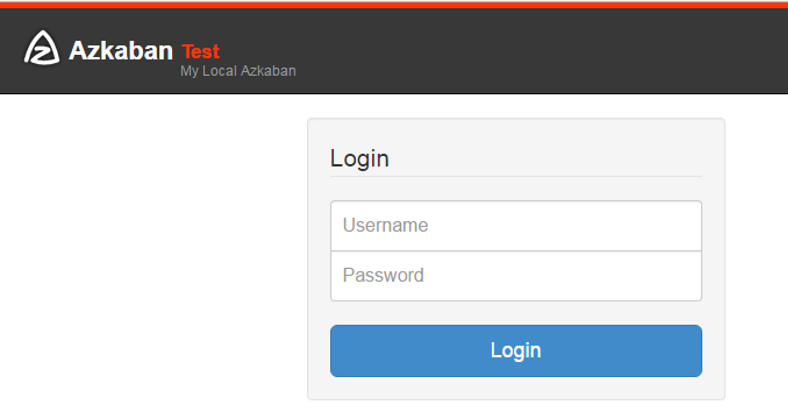
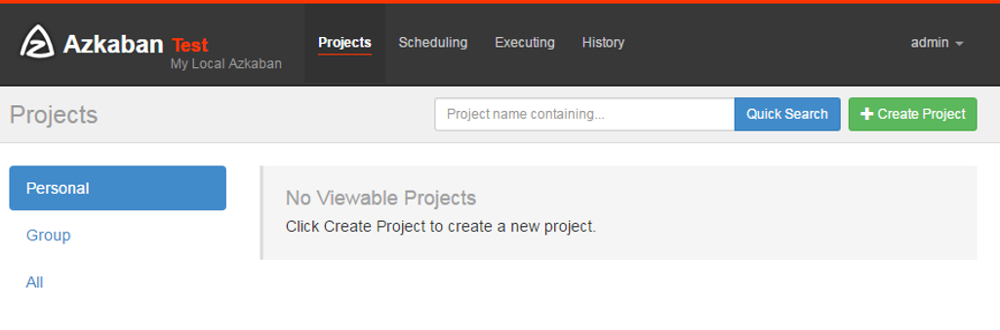

# 一、下载安装包
需要下载的安装包有: 
1. azkaban-web-server-2.5.0.tar.gz
2. azkaban-executor-server-2.5.0.tar.gz
3. azkaban-sql-script-2.5.0.tar.gz
4. mysql-libs.zip


[官方下载地址](http://azkaban.github.io/downloads.html)

或者

[azkaban-executor-server-2.5.0](../../package/azkaban/azkaban-executor-server-2.5.0.tar.gz)

[azkaban-sql-script-2.5.0](../../package/azkaban/azkaban-sql-script-2.5.0.tar.gz)

[azkaban-web-server-2.5.0](../../package/azkaban/azkaban-web-server-2.5.0.tar.gz)

[mysql-libs](../../package/azkaban/mysql-libs.zip)


# 二、上传安装包到服务器
将 Azkaban Web 服务器、Azkaban 执行服务器、Azkaban 的 sql 执行脚本及 MySQL 安装包拷贝到服务器上的指定目录中
```bash
[root@hadoop1 azkaban]# pwd
/opt/software/azkaban
[root@hadoop1 azkaban]# ll
总用量 98600
-rw-r--r--. 1 root root 11157302 10月 29 11:35 azkaban-executor-server-2.5.0.tar.gz
-rw-r--r--. 1 root root     1928 10月 29 11:35 azkaban-sql-script-2.5.0.tar.gz
-rw-r--r--. 1 root root 11989669 10月 29 11:35 azkaban-web-server-2.5.0.tar.gz
-rw-r--r--. 1 root root 77807942 10月 29 11:35 mysql-libs.zip
```

# 三、安装
## 3.1 在 /usr/bigdata/ 目录下创建 azkaban 目录
```bash
[root@hadoop1 azkaban]# mkdir /usr/bigdata/azkaban
```
## 3.2 解压
将 azkaban-web-server-2.5.0.tar.gz、azkaban-executor-server-2.5.0.tar.gz、azkaban-sql-script-2.5.0.tar.gz 解压到 `/usr/bigdata/azkaban` 目录下
```bash
[root@hadoop1 azkaban]# ll
总用量 98600
[root@hadoop1 azkaban]# azkaban-executor-server-2.5.0.tar.gz -C /usr/bigdata/azkaban
[root@hadoop1 azkaban]# azkaban-sql-script-2.5.0.tar.gz -C /usr/bigdata/azkaban
[root@hadoop1 azkaban]# azkaban-web-server-2.5.0.tar.gz -C /usr/bigdata/azkaban
```
## 3.3 对解压后的文件重新命名
```bash
[root@hadoop1 azkaban]# mv azkaban-web-2.5.0/ server
[root@hadoop1 azkaban]# mv azkaban-executor-2.5.0/ executor
```
## 3.4 azkaban 脚本导入
进入 mysql, 创建 azkaban 数据库, 并将解压的脚本导入到azkaban数据库
```mysql-sql
[root@hadoop1 azkaban]# mysql -uroot -p123
mysql> create database azkaban;
mysql> use azkaban;
mysql> source /usr/bigdata/azkaban/azkaban-2.5.0/create-all-sql-2.5.0.sql
```
## 3.5 生成密钥对和证书
Keytool是java数据证书的管理工具，使用户能够管理自己的公/私钥对及相关证书。
- keystore    指定密钥库的名称及位置(产生的各类信息将存在.keystore文件中)
- genkey(或者-genkeypair)      生成密钥对
- alias  为生成的密钥对指定别名，如果没有默认是mykey
- keyalg  指定密钥的算法 RSA/DSA 默认是DSA
### 3.5.1 生成 keystore的密码及相应信息的密钥库
```bash
[root@hadoop1 azkaban]# keytool -keystore keystore -alias jetty -genkey -keyalg RSA
输入密钥库口令:  azkaban
再次输入新口令:  azkaban
您的名字与姓氏是什么?
  [Unknown]:  
您的组织单位名称是什么?
  [Unknown]:  
您的组织名称是什么?
  [Unknown]:  
您所在的城市或区域名称是什么?
  [Unknown]:  
您所在的省/市/自治区名称是什么?
  [Unknown]:  
该单位的双字母国家/地区代码是什么?
  [Unknown]:  
CN=Unknown, OU=Unknown, O=Unknown, L=Unknown, ST=Unknown, C=Unknown是否正确?
  [否]:  y

输入 <jetty> 的密钥口令
        (如果和密钥库口令相同, 按回车):  azkaban
再次输入新口令: azkaban
```
### 3.5.2 将keystore 拷贝到 azkaban web服务器根目录中
[root@hadoop1 azkaban]# mv keystore server/


## 3.6 配置时间同步
1. 如果在/usr/share/zoneinfo/这个目录下不存在时区配置文件Asia/Shanghai，就要用 tzselect 生成。
    ```bash
    [root@hadoop1 azkaban]# tzselect
    Please identify a location so that time zone rules can be set correctly.
    Please select a continent or ocean.
     1) Africa
     2) Americas
     3) Antarctica
     4) Arctic Ocean
     5) Asia  
     6) Atlantic Ocean
     7) Australia
     8) Europe
     9) Indian Ocean
    10) Pacific Ocean
    11) none - I want to specify the time zone using the Posix TZ format.
    #? 5 <-- 填 5
    Please select a country.
     1) Afghanistan           18) Israel                35) Palestine
     2) Armenia               19) Japan                 36) Philippines
     3) Azerbaijan            20) Jordan                37) Qatar
     4) Bahrain               21) Kazakhstan            38) Russia
     5) Bangladesh            22) Korea (North)         39) Saudi Arabia
     6) Bhutan                23) Korea (South)         40) Singapore
     7) Brunei                24) Kuwait                41) Sri Lanka
     8) Cambodia              25) Kyrgyzstan            42) Syria
     9) China                 26) Laos                  43) Taiwan
    10) Cyprus                27) Lebanon               44) Tajikistan
    11) East Timor            28) Macau                 45) Thailand
    12) Georgia               29) Malaysia              46) Turkmenistan
    13) Hong Kong             30) Mongolia              47) United Arab Emirates
    14) India                 31) Myanmar (Burma)       48) Uzbekistan
    15) Indonesia             32) Nepal                 49) Vietnam
    16) Iran                  33) Oman                  50) Yemen
    17) Iraq                  34) Pakistan
    #? 9 <-- 填 9
    Please select one of the following time zone regions.
    1) Beijing Time
    2) Xinjiang Time
    #? 1 <-- 填 1
    
    The following information has been given:
    
            China
            Beijing Time
    
    Therefore TZ='Asia/Shanghai' will be used.
    Local time is now:      Thu Oct 18 16:24:23 CST 2018.
    Universal Time is now:  Thu Oct 18 08:24:23 UTC 2018.
    Is the above information OK?
    1) Yes
    2) No
    #? 1 <-- 填 1
    
    You can make this change permanent for yourself by appending the line
            TZ='Asia/Shanghai'; export TZ
    to the file '.profile' in your home directory; then log out and log in again.
    
    Here is that TZ value again, this time on standard output so that you
    can use the /usr/bin/tzselect command in shell scripts:
    Asia/Shanghai
    ```
2. 拷贝该时区文件，覆盖系统本地时区配置
    ```bash
    [root@hadoop1 azkaban]# cp /usr/share/zoneinfo/Asia/Shanghai /etc/localtime
    ```

## 3.7 配置 Server
1. 进入 azkaban web 服务器安装目录 conf目录，打开azkaban.properties文件
    ```bash
    [root@hadoop1 conf]# pwd
    /usr/bigdata/azkaban/server/conf
    [root@hadoop1 conf]# vim azkaban.properties
    ```
2. 按照如下配置修改 azkaban.properties 文件。
    ```bash
    #Azkaban Personalization Settings
    #服务器UI名称,用于服务器上方显示的名字
    azkaban.name=Test
    #描述
    azkaban.label=My Local Azkaban
    #UI颜色
    azkaban.color=#FF3601
    azkaban.default.servlet.path=/index
    修改 -> #默认web server存放web文件的目录
    修改 -> web.resource.dir=/usr/bigdata/azkaban/server/web/   
    修改 -> #默认时区,已改为亚洲/上海 默认为美国
    修改 -> default.timezone.id=Asia/Shanghai
    
    #Azkaban UserManager class
    user.manager.class=azkaban.user.XmlUserManager
    修改 -> #用户权限管理默认类（绝对路径）
    修改 -> user.manager.xml.file=/usr/bigdata/azkaban/server/conf/azkaban-users.xml
    
    #Loader for projects
    修改 -> #global配置文件所在位置（绝对路径）
    修改 -> executor.global.properties=/usr/bigdata/azkaban/executor/conf/global.properties
    azkaban.project.dir=projects
    
    #数据库类型
    database.type=mysql
    #端口号
    mysql.port=3306
    修改 -> #数据库连接IP
    修改 -> mysql.host=hadoop1
    修改 -> #数据库实例名
    修改 -> mysql.database=azkaban
    修改 -> #数据库用户名
    修改 -> mysql.user=root
    修改 -> #数据库密码
    修改 -> mysql.password=123
    #最大连接数
    mysql.numconnections=100
    
    # Velocity dev mode
    velocity.dev.mode=false
    
    # Azkaban Jetty server properties.
    # Jetty服务器属性.
    #最大线程数
    jetty.maxThreads=25
    #Jetty SSL端口
    jetty.ssl.port=8443
    #Jetty端口
    jetty.port=8081
    修改 -> #SSL文件名（绝对路径）
    修改 -> jetty.keystore=/usr/bigdata/azkaban/server/keystore
    修改 -> #SSL文件密码
    修改 -> jetty.password=azkaban
    修改 -> 修改 -> #Jetty主密码与keystore文件相同
    修改 -> jetty.keypassword=azkaban
    修改 -> #SSL文件名（绝对路径）
    修改 -> jetty.truststore=/usr/bigdata/azkaban/server/keystore
    修改 -> #SSL文件密码
    修改 -> jetty.trustpassword=azkaban
    
    # Azkaban Executor settings
    executor.port=12321
    
    # mail settings
    mail.sender=
    mail.host=
    job.failure.email=
    job.success.email=
    
    lockdown.create.projects=false
    
    cache.directory=cache
    ```
3. web服务器用户配置
在azkaban web服务器安装目录 conf目录，按照如下配置修改azkaban-users.xml 文件，增加管理员用户。

```bash
[root@hadoop1 conf]#vim azkaban-users.xml
<azkaban-users>
	<user username="azkaban" password="azkaban" roles="admin" groups="azkaban" />
	<user username="metrics" password="metrics" roles="metrics"/>
	增加 --> <user username="admin" password="admin" roles="admin,metrics"/>
	<role name="admin" permissions="ADMIN" />
	<role name="metrics" permissions="METRICS"/>
</azkaban-users>
```
## 3.8 配置 executor
1. 进入执行服务器安装目录conf，打开azkaban.properties
    ```bash
    [root@hadoop1 conf]# pwd
    /usr/bigdata/azkaban/executor/conf
    [root@hadoop1 conf]# vim azkaban.properties
    ```
2. 按照如下配置修改azkaban.properties文件。
    ```bash
    #Azkaban
    修改 -> #时区
    修改 -> default.timezone.id=Asia/Shanghai
    
    # Azkaban JobTypes Plugins
    #jobtype 插件所在位置
    azkaban.jobtype.plugin.dir=plugins/jobtypes
    
    #Loader for projects
    修改 -> executor.global.properties=/usr/bigdata/azkaban/executor/conf/global.properties
    修改 -> azkaban.project.dir=projects
    
    database.type=mysql
    mysql.port=3306
    修改 -> mysql.host=hadoop1
    修改 -> mysql.database=azkaban
    修改 -> mysql.user=root
    修改 -> mysql.password=123
    修改 -> mysql.numconnections=100
    
    # Azkaban Executor settings
    #最大线程数
    executor.maxThreads=50
    #端口号(如修改,请与web服务中一致)
    executor.port=12321
    #线程数
    executor.flow.threads=30
    ```

# 四、运行
## 4.1 启动Executor服务器
```bash
[root@hadoop1 executor]# pwd
/usr/bigdata/azkaban/executor
[root@hadoop1 executor]# bin/azkaban-executor-start.sh
```
## 4.2 启动Web服务器
```bash
[root@hadoop1 server]# pwd
/usr/bigdata/azkaban/server
[root@hadoop1 server]# bin/azkaban-web-start.sh
```

jps 查看进程

```bash
[root@hadoop1 server]# jps
11641 AzkabanExecutorServer
5021 Jps
4131 AzkabanWebServer
```

# 五、登录
在浏览器中(https://服务器IP地址:8443)输入刚才在 azkaban-users.xml 文件中新添加的户用名及密码, 点击 login



