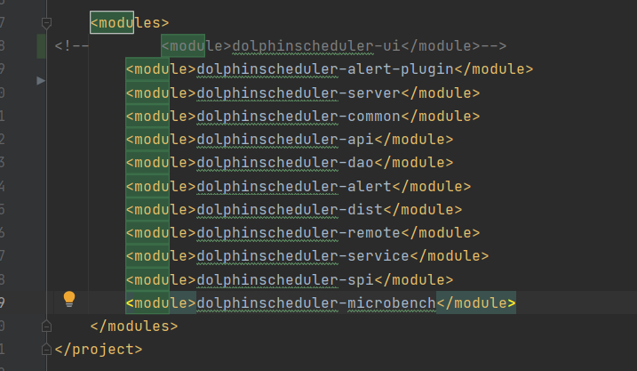
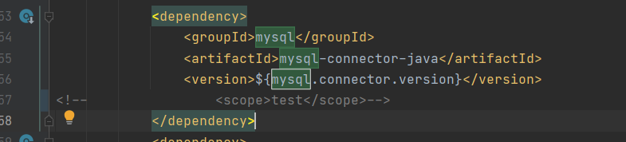
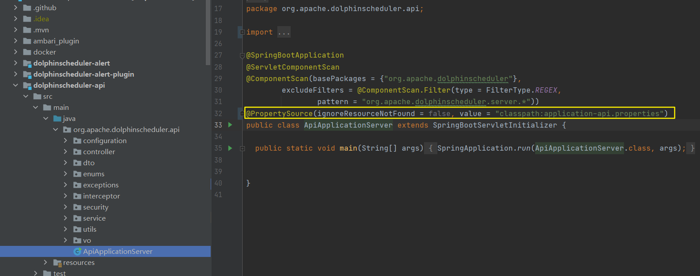
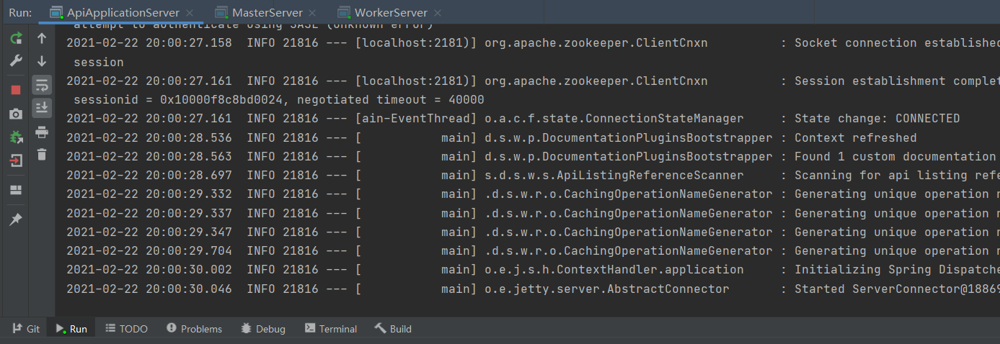
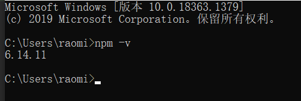
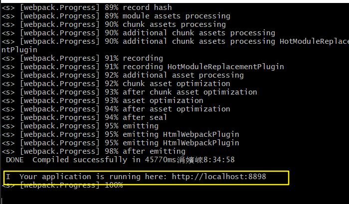

----
为了方便的调试 dolphinschedule, 选择在本地搭建一个可调式的开发环境

# 一、download dolphinschedule
https://github.com/apache/incubator-dolphinscheduler

我选择的是 master 分支

# 二、download zookeeper
http://mirrors.hust.edu.cn/apache/zookeeper/stable/apache-zookeeper-3.5.9-bin.tar.gz

解压, 修改配置文件名
```bash
cp zoo_sample.cfg zoo.cfg
```

修改配置
```bash
vim zoo.cfg
dataDir=D:/dolphinscheduleTest/apache-zookeeper-3.5.9-bin/data
```

启动 server, 双击 zkServer.cmd

启动 client, 双击 zkCli.cmd

# 三、create dolphinschedule database
使用docker 部署mysql

创建 dolphinscheduler 数据库

# 四、edit dolphinschedule conf
## 4.1 注释dolphinscheduler-ui
在pom文件里面，找到 modules，将 dolphinscheduler-ui 注释掉




## 4.2 注释 mysql scope



## 4.3 添加 注解
在apiserver中加入 `@PropertySource(ignoreResourceNotFound = false, value = "classpath:application-api.properties")`



在Dao里面修改 `application.properties` 配置，根据具体数据库修改
```xml
# mysql
spring.datasource.driver-class-name=com.mysql.jdbc.Driver
spring.datasource.url=jdbc:mysql://192.168.1.221:3306/dolphinscheduler?useUnicode=true&characterEncoding=UTF-8
spring.datasource.username=root
spring.datasource.password=123456
```


在service层修改zk地址，如果为本地zk，默认不需要修改


在Server层修改master代码, 添加: `@PropertySource(ignoreResourceNotFound = false, value = "classpath:master.properties")`


修改server的master.properties


在Server层修改worker代码, 添加: `@PropertySource(ignoreResourceNotFound = false, value = "classpath:worker.properties")`


修改server的worker.properties


在WorkerServer的run configuration中设置如下:
```bash
-Dspring.profiles.active=worker -Dlogging.config="dolphinscheduler-server/src/main/resources/logback-worker.xml" 
```


# 五、创建表


# 六、编译
```bash
mvn -U clean package -Prelease -Dmaven.test.skip=true
```


# 七、启动
分别启动API、Master、Worker




# 八、install npm
https://nodejs.org/en/

安装都是 next，安装完成后在cmd中输入: 



安装 cnpm
```bash
npm install cnpm -g --registry=https://registry.npm.taobao.org
```
用 cnpm 安装依赖
```bash
cnpm install
```

# 九、启动 web ui
进入 dolphinscheduler-ui， 执行: `npm run start`




# 十、在浏览器中访问


账号: admin
密码: dolphinscheduler123

