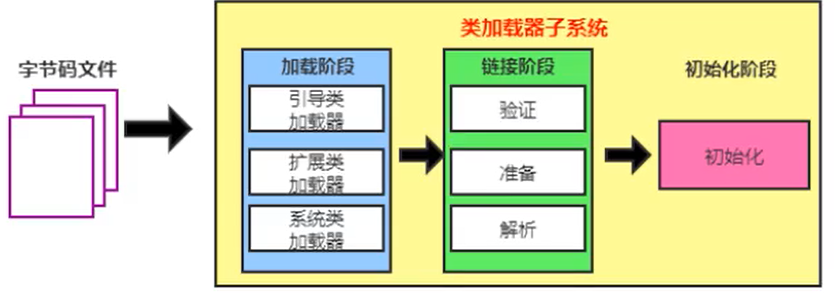
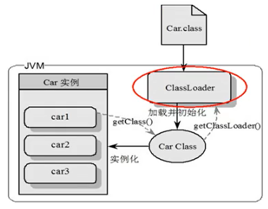
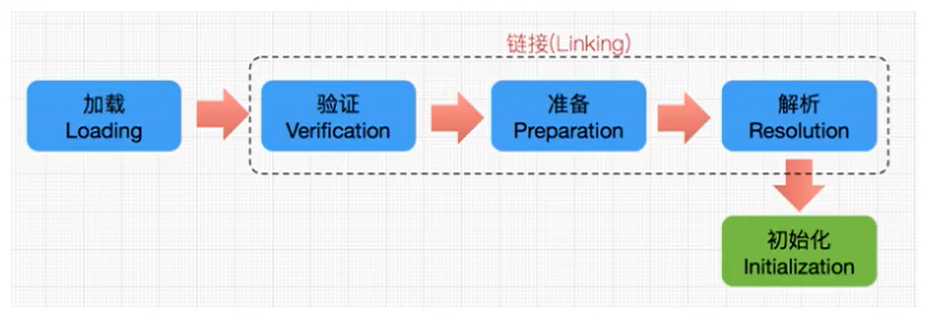
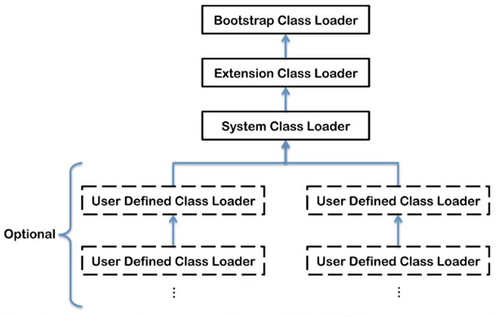
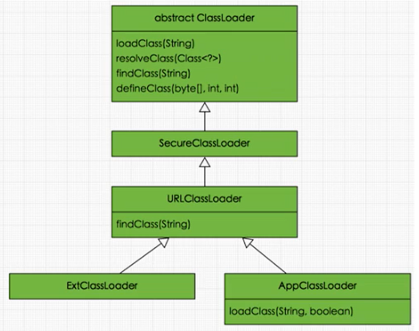
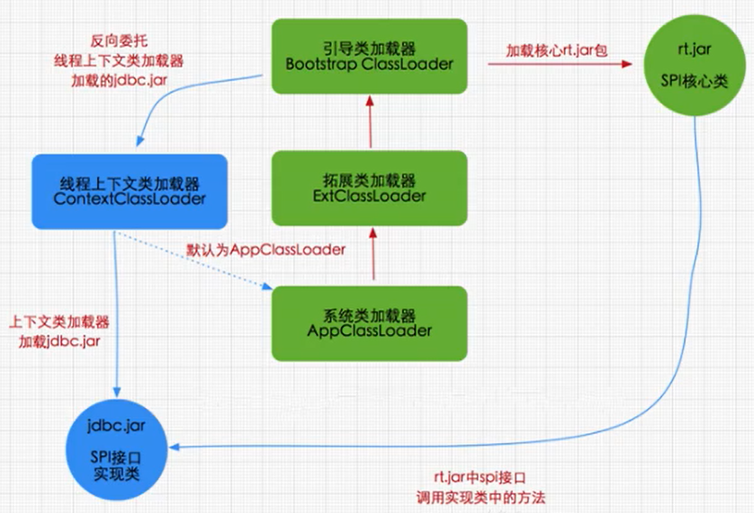

# 一、JVM 内存结构


# 二、类的加载说明
类的加载指的是将 .class 文件(二进制数据) 读取到内存中, 将其放在运行时数据区的方法区内, 然后再堆区创建一个 `java.lang.class` 对象, 用来封装类在方法区内的数据结构。类加载的最终产品是位于堆区的 `Class` 对象, `Class` 对象封装了类在方法区内的数据结构, 并且向 Java 程序员提供了访问方法区内的数据结构的接口。

类加载器并不需要等到某个类被 "首次主动使用" 时再加载, JVM 规范允许类加载器在预料某个类将要被使用时就预先加载它, 如果在预先加载的过程中遇到了 .class 文件缺失或者存在错误, 类加载器必须在程序首次主动使用该类时才报告错误(LinkageError), 如果这个类一直没有被程序主动使用, 那么类加载器就不会报告错误

# 三、加载 .class 的方式
- 从本地系统中直接加载
- 通过网络获取，典型场景： Web Applet
- 从 zip 压缩包中读取，成为日后 jar 、 war 格式的基础
- 运行时计算生成，使用最多的是：动态代理技术
- 由其他文件生成，典型场景： JSP 应用
- 从专有数据库中提取 .class 文件，比较少见从加密文件中获取，典型的防 class 文件被反编译的保护措施

# 四、类加载器子系统


- 类加载器子系统负责从文件系统或者网络中加载 class 文件, class 文件再文件开头有特殊的文件标识。
- ClassLoader 只负责 class 文件的加载, 至于它是否可以运行, 则由 Execution Engine 决定。
- 加载的类信息存放于一块称为方法区的内存空间。除了类的信息外，方法区中还会存放运行时常量池信息，可能包括字符串字面量和数字常量(这部分常量信息是 class 文件中常量池部分的内存映射)


1. Car.class 存在于本地硬盘上, 可以理解为设计师画在纸上的模板, 而最终这个模板在执行的时候是要加载到 JVM 当中来根据这个文件实例化出 n 个一模一样的示例。
2. Car.class 加载到 JVM 中, 被称为 DNA 元数据模板, 放在方法区。
3. 在 Car.class 文件 -> JVM -> 最终成为元数据模板, 此过程中就要一个运输工具(类装载器 ClassLoader).

# 五、类的加载过程



类加载整体分为三个阶段:
1. 加载
2. 链接
   1. 验证
   2. 准备
   3. 解析
3. 初始化

## 5.1 加载
1. 通过一个类的全限定名获取定义此类的二进制字节流
2. 将这个字节流所代表的静态存储结构转化为 方法区 的运行时数据结构
3. 在内存中生成一个代表这个类的 `java.lang.Class` 对象, 作为方法区这个类的各种数据的访问入口

## 5.2 链接
### 5.2.1 验证：确保被加载的类的正确性
此阶段主要目的在于确保 .class 文件的字节流中包含信息复合当前虚拟机要求，保证被加载类的正确性，不会危害虚拟机自身安全

主要包括四种验证：文件格式验证、元数据验证、字节码验证、符号引用验证
- 文件格式验证：验证字节流是否符合 Class 文件格式的规范，例如：是否以 `0xCAFEBABE` 开头、主次版本号是否在当前虚拟机的处理范围之内、常量池中的常量是否有不被支持的类型。
- 元数据验证：对字节码描述的信息进行语义分析, 以保证其描述的信息复合 Java 语言规范的要求。例如：这个类是否有父类，除了 `java.lang.Object` 之外
- 字节码验证：通过数据流和控制流分析，确定程序语义是合法的、符合逻辑的
- 符号引用验证：确保解析动作能正确执行。

验证阶段是非常重要的，但不是必须的，验证对程序运行期间没有影响，如果所引用的类经过反复验证，可以考虑采用 `-Xverifynone` 参数来关闭大部分的类验证措施，以缩短虚拟机类加载的时间。


### 5.2.2 准备: 为类的 `静态变量(类变量)` 分配内存, 并将其初始化为默认值
准备阶段是正式为类变量分配内存并设置类变量初始值的阶段，这些内存都将在方法区中分配。对于该阶段有以下几点需要注意：
1. 这个时候进行内存分配的，仅包括类变量(static)，而不包括实例变量，实例变量会在对象实例化时随着对象一块分配在 堆 中。
2. 这里所设置的初始值，通常情况下是数据类型的默认值(如：0、0L、null、false等)，而不是被 Java 代码中显示的赋予的值。

关于类变量和实例变量
```java
public class Student {
    private String id;  // 实例变量
    String teacher;     // 实例变量
    private int age;    // 实例变量
    private static String classRoom;  // 类变量(静态变量) 
}
```

假设, 一个类变量的定义为: `public static int val = 3;`

那么变量 val 在准备阶段过后的初始值为0，而不是3，因为这个时候尚未开始执行任何 Java 方法，而把 val 赋值为3的 `public static` 指令是在程序编译后，存放于类构造器 `<clinit>()` 方法之中的，所以把 val 赋值为3的动作将在初始化阶段才执行。

> 说明：
>
> 对于基本数据类型来说，对于类变量和全局变量，如果不显示的对其赋值而直接使用，系统会为其赋予默认的零值，而对于局部变量来说，在使用前必须显示的为其赋值，否则编译时不通过。
> 
> 对于同时被 static 和 final 修饰的常量，必须在声明的时候就为其显示的赋值，否则编译不通过；而只被 final 修饰的常量，则既可以在声明时显示的为其赋值，也可以在类初始化时显示的为其赋值，总之，在使用前必须为其显示的赋值，系统不会为其赋予默认零值。
> 
> 如果再数组初始化时没有对数组中的元素赋值，那么其中的元素将根据对应的数据类型而被赋予默认的零值。

假设一个常量定义为: `public static final int val = 3;`

在编译时，javac 将会为 val 生成 ConstantValue 属性，在准备阶段虚拟机就会根据 ConstantValue 的设置将 val 赋值为3。可以理解为被 `static final` 修饰的常量，在编译期就将其结果放入了调用它的类的常量池中。

### 5.2.3 解析：把类中的符号引用转为直接引用
解析阶段就是虚拟机将常量池内的符号引用替换为直接引用的过程，解析动作主要针对类或接口、字段、类方法、接口方法、方法类型、方法句柄和调用限定符7类符号引用进行。

符号引用就是一组符号来描述目标，可以使任何字面量。

直接引用就是直接指向目标的指针、相对偏移量或一个间接定位到目标的句柄。


## 5.3 初始化
- 初始化阶段就是执行`类构造器方法<clinit>()`的过程，`<clinit>()`不需要定义，是 javac 编译器自动收集类中所有类变量和静态代码块的赋值语句合并而来的。
- `类构造器<clinit>()` 中的指令按语句在源文件中出现的顺序执行。
- `类构造器<clinit>()` 不同于类的构造器。
- 若该类具有父类， JVM 会保证子类的 `<clinit>()` 执行前，父类的 `<clinit>()` 已经被执行完毕。虚拟机必须保证一个类的 `<clinit>()` 方法在多线程下被同步加锁。

```java
public class ClassInitTest {
   private static int num = 1;

   static{
       num = 2;
       number = 20;
       System.out.println(num);
       //System.out.println(number);//报错：非法的前向引用。
   }

   private static int number = 10;  //linking之prepare: number = 0 --> initial: 20 --> 10

    public static void main(String[] args) {
        System.out.println(ClassInitTest.num);//2
        System.out.println(ClassInitTest.number);//10
    }
}
```

# 六、类加载器
从 Java 开发人员的角度来看，类加载器大致可以分为一下四类：
1. 启动类加载器(Bootstrap ClassLoader): 负责加载存放在 `$JAVA_HOME/jre/lib` 下，或者被 `-Xbootclasspath` 参数指定的类路径中的，并且能被虚拟机识别的类库(如 rt.jar、resources.jar等 java. 开头的类)。启动类加载器是无法被 Java 程序直接引用的，启动类加载器由 C/C++ 语言实现。启动类加载器处于安全考虑，之家在包名为 java、javax、sun等开头的类。
2. 扩展类加载器(Extension ClassLoader): 扩展加载器由 `sum.misc.Launcher$ExtClassLoader` 实现，它负责加载 `$JAVA_HOME/jre/lib/ext` 目录中，或者由 `java.ext.dirs` 系统变量指定的路径中的所有类库(如 javax. 开头的类)，开发人员可以直接使用扩展类加载器。由 Java 语言编写。
3. 系统类加载器(Application ClassLoader): 系统类加载器由 `sum.misc.Launcher$AppClassLoader` 实现，它负责加载用户类路径(ClassPath) 所指定的类，开发者可以直接使用该类，如果应用程序中没有自定义过的类加载器，一般情况下这个就是程序中的默认加载器。由 Java 语言编写。
4. 自定义类加载器



这里的四者之间的关系是包含关系。不是上层下层，也不是子父类的继承关系。

```java
public class ClassLoaderTest {
   public static void main(String[] args) {

      //获取系统类加载器
      ClassLoader systemClassLoader = ClassLoader.getSystemClassLoader();
      System.out.println(systemClassLoader);//sun.misc.Launcher$AppClassLoader@18b4aac2

      //获取其上层：扩展类加载器
      ClassLoader extClassLoader = systemClassLoader.getParent();
      System.out.println(extClassLoader);//sun.misc.Launcher$ExtClassLoader@4554617c

      //获取其上层：获取不到引导类加载器
      ClassLoader bootstrapClassLoader = extClassLoader.getParent();
      System.out.println(bootstrapClassLoader);//null

      //对于用户自定义类来说：默认使用系统类加载器进行加载
      ClassLoader classLoader = ClassLoaderTest.class.getClassLoader();
      System.out.println(classLoader);//sun.misc.Launcher$AppClassLoader@18b4aac2

      //String类使用引导类加载器进行加载的。---> Java的核心类库都是使用引导类加载器进行加载的。
      ClassLoader classLoader1 = String.class.getClassLoader();
      System.out.println(classLoader1);//null

   }
}
```

```java

public class ClassLoaderTest1 {
   public static void main(String[] args) {
      System.out.println("**********启动类加载器**************");
      //获取BootstrapClassLoader能够加载的api的路径
      URL[] urLs = sun.misc.Launcher.getBootstrapClassPath().getURLs();
      for (URL element : urLs) {
         System.out.println(element.toExternalForm());
      }
      //从上面的路径中随意选择一个类,来看看他的类加载器是什么:引导类加载器
      ClassLoader classLoader = Provider.class.getClassLoader();
      System.out.println(classLoader);

      System.out.println("***********扩展类加载器*************");
      String extDirs = System.getProperty("java.ext.dirs");
      for (String path : extDirs.split(";")) {
         System.out.println(path);
      }

      //从上面的路径中随意选择一个类,来看看他的类加载器是什么:扩展类加载器
      ClassLoader classLoader1 = CurveDB.class.getClassLoader();
      System.out.println(classLoader1);//sun.misc.Launcher$ExtClassLoader@1540e19d

   }
}

**********启动类加载器**************
file:/Library/Java/JavaVirtualMachines/jdk1.8.0_211.jdk/Contents/Home/jre/lib/resources.jar
file:/Library/Java/JavaVirtualMachines/jdk1.8.0_211.jdk/Contents/Home/jre/lib/rt.jar
file:/Library/Java/JavaVirtualMachines/jdk1.8.0_211.jdk/Contents/Home/jre/lib/sunrsasign.jar
file:/Library/Java/JavaVirtualMachines/jdk1.8.0_211.jdk/Contents/Home/jre/lib/jsse.jar
file:/Library/Java/JavaVirtualMachines/jdk1.8.0_211.jdk/Contents/Home/jre/lib/jce.jar
file:/Library/Java/JavaVirtualMachines/jdk1.8.0_211.jdk/Contents/Home/jre/lib/charsets.jar
file:/Library/Java/JavaVirtualMachines/jdk1.8.0_211.jdk/Contents/Home/jre/lib/jfr.jar
file:/Library/Java/JavaVirtualMachines/jdk1.8.0_211.jdk/Contents/Home/jre/classes
null
***********扩展类加载器*************
/Users/kino/Library/Java/Extensions:/Library/Java/JavaVirtualMachines/jdk1.8.0_211.jdk/Contents/Home/jre/lib/ext:/Library/Java/Extensions:/Network/Library/Java/Extensions:/System/Library/Java/Extensions:/usr/lib/java
sun.misc.Launcher$ExtClassLoader@610455d6
```

## 6.1 自定义类加载器
在 Java 的日常开发中，类的加载几乎是上述 3 中类加载器互相配合执行的，但是在很多开源项目中，有自定义类加载器来定制类的加载方式。

自定义类加载器可以做到：
- 隔离加载类
- 修改类加载的方式
- 扩展加载源
- 防止源码泄漏
- 从特定场所取得 java class，例如数据库或者网络中

实现步骤：
1. 继承抽象类 `java.lang.ClassLoader` 来实现自己的类加载器。
2. 在 JDK1.2 之前，自定义类加载器时，总会去继承 `ClassLoader` 类并重写 `loadClass()` 方法，从而实现自定义的类加载器，但是在 JDK1.2 之后，已经不再建议用户去覆盖 `loadClass()` 方法，而是建议把自定义的类加载逻辑写在 `findClass()` 方法中
3. 在编写自定义类加载器时，如果没有过于复杂的需求，可以直接继承 `URLClassLoader` 类，这样就可以避免自己去编写 `findClass()` 方法及其获取字节码流的方式，使自定义类加载器编写更加间接。

示例：
```java 
package com.kino.code.test;

import java.io.ByteArrayOutputStream;
import java.io.File;
import java.io.FileInputStream;
import java.io.IOException;
import java.lang.reflect.Field;

public class MyClassLoader extends ClassLoader{

    private String root;

    @Override
    protected Class<?> findClass(String name) throws ClassNotFoundException {

        byte[] classData = loadClassData(name);
        if (classData == null) {
            throw new ClassNotFoundException();
        } else {
            return defineClass(name, classData, 0, classData.length);
        }
    }

    private byte[] loadClassData(String className) {
        String fileName = root + File.separatorChar
            + className.replace('.', File.separatorChar) + ".class";
        try {
            FileInputStream ins = new FileInputStream(fileName);
            ByteArrayOutputStream baos = new ByteArrayOutputStream();
            int bufferSize = 1024;
            byte[] buffer = new byte[bufferSize];
            int length = 0;
            while ((length = ins.read(buffer)) != -1) {
                baos.write(buffer, 0, length);
            }
            return baos.toByteArray();
        } catch (IOException e) {
            e.printStackTrace();
        }
        return null;
    }

    public String getRoot() {
        return root;
    }

    public void setRoot(String root) {
        this.root = root;
    }

    public static void main(String[] args) {
        MyClassLoader classLoader = new MyClassLoader();
        classLoader.setRoot("/Users/kino/works/kino/DesignMode/out/production/DesignMode");

        Class<?> clazz = null;
        try {
            clazz = classLoader.loadClass("com.kino.design.Test1");
            Object o = clazz.newInstance();
            System.out.println(o.getClass().getClassLoader());
        } catch (ClassNotFoundException e) {
            e.printStackTrace();
        } catch (InstantiationException e) {
            e.printStackTrace();
        } catch (IllegalAccessException e) {
            e.printStackTrace();
        }
    }
}

com.kino.code.test.MyClassLoader@6d6f6e28
```
自定义类加载器的核心在于对字节码文件的获取，如果是加密的字节码则需要在该类中对文件进行解密，这里面有几点需要注意：
1. 这里传递的文件名需要是类的全限定性名称，即 `com.kino.code.test.Test1` 格式的，因为 defineClass 方法是按这种格式进行处理的。
2. 最好不要重写 `loadClass()` 方法，因为这样容易破坏双亲委派模型。
3. 这类 Test 类本身可以被 `Application ClassLoader` 类加载，因此我们不能把 `com.kino.code.test.Test1` 放在类路径下。否则由于双亲委派机制的存在，会直接导致该类由 `Application ClassLoader`加载，而不会通过我们自定义类加载器来加载。 

## 6.2 ClassLoader 的使用说明
ClassLoader 是一个抽象类，其后所有的类加载器都继承自 ClassLoader(不包括启动类加载器)

| 方法名称                   | 描述 |
|------------------------| --- |
| getParent()            | 返回该类加载器的超级类加载器 |
| loadClass(String name) | 加载名称为 name 的类, 返回结果为 `java.lang.Class` 类的实例 |
| findClass(String name) | 查找名称为 name 的类，返回结果为 `java.lang.Class` 类的实例 | 
| findLoadedClass(String name) | 查找名称为 name 且已经被加载过的类，返回结果为 `java.lang.Class` 类的实例 | 
| defineClass(String name, byte b, int off, int len) | 把字节数组 b 中的内容转换为一个 Java 类，返回结果为 `java.lang.Class` 类的实例 |
| resolveClass(Class<?> c) | 连接指定的一个 Java 类 |



## 6.3 JVM 类加载机制
- 全盘负责：当一个类加载器负责加载某个 Class 时，该 Class 所依赖的合引用的其他 Class也将由该类加载器负责载入，除非显示使用另外一个类加载器来加载。
- 父类委托：先让父类加载器视图加载该类，只有在父类加载器无法加载该类时，才会尝试从自己的类路径中加载该类。
- 缓存机制：缓存机制会保证所有加载过的 Class 都会被缓存，当程序中需要使用某个 Class 时，类加载器会从缓存区寻找该 Class，只有缓存区不存在，系统才会读取该类对应的二进制数据，并将其转换成为 Class 对象，存入缓存区。这就是为什么修改了 Class 后，必须重启 JVM，程序的修改才会生效。

## 6.4 类的加载
类加载后三种方式：
1. 命令行启动应用的时候由 JVM 初始化加载
2. 通过 `Class.forname()` 方法动态加载
3. 通过 `ClassLoader.loadClass()` 方法动态加载

```java
package com.kino.code.test;

public class Test3 {
    public static void main(String[] args) throws ClassNotFoundException {
        ClassLoader loader = Test4.class.getClassLoader();
        System.out.println (loader);
        //使用ClassLoader.loadClass()来加载类，不会执行初始化块
        loader.loadClass ("com.kino.code.test.Test4");
        //使用Class.forName()来加载类，默认会执行初始化块
        Class.forName("com.kino.code.test.Test4");
        //使用Class.forName()来加载类，并指定ClassLoader，初始化时不执行静态块
        Class.forName("com.kino.code.test.Test4", false, loader);
    }
}

class Test4 {
    static {
        System.out.println("静态初始化块执行了！");
    }
}

sun.misc.Launcher$AppClassLoader@18b4aac2
静态初始化块执行了！
```
分别切换加载方式，会有不同的输出结果。

Class.forName()和ClassLoader.loadClass()区别
- Class.forName()：将类的.class文件加载到jvm中之外，还会对类进行解释，执行类中的static块；
- ClassLoader.loadClass()：只干一件事情，就是将.class文件加载到jvm中，不会执行static中的内容,只有在newInstance才会去执行static块。
- Class.forName(name,initialize,loader)带参函数也可控制是否加载static块。并且只有调用了newInstance()方法采用调用构造函数，创建类的对象 。

# 七、双亲委派模型
双亲委派模型的工作流程是：如果一个类加载器收到了类加载的请求，它首先不会自己去尝试加载这个类，而是把请求委托给父加载器去完成，依次向上，因此，所有的类加载请求最终都会被传递到顶层的启动类加载器中，只有当父加载器在它的搜索范围中没有找到所需的类的时候，既无法完成该类加载，子加载器才会尝试自己去加载该类

双亲委派机制：
1. 当 `AppClassLoader` 加载一个 Class 时，它首先不会自己去尝试加载这个类，而是把类加载请求委派给父加载器 `ExtClassLoader` 去完成。
2. 当 `ExtClassLoader` 加载一个 Class 时，它首先也不会自己去尝试加载这个类，而是把类加载请求委派给 `BootStrapClassLoader` 去完成。
3. 如果 `BootStrapClassLoader` 加载失败(例如在 $JAVA_HOME/jre/lib 中未查找到该 class)，会使用 `ExtClassLoader` 来尝试加载。
4. 若 `ExtClassLoader` 也加载失败，则会使用 `AppClassLoader` 来加载，如果 `AppClassLoader` 也加载失败，则会报出异常 `ClassNotFoundException`

ClassLoader 源码分析:
```java
public Class<?> loadClass(String name) throws ClassNotFoundException {
   return loadClass(name, false);
}
protected Class<?> loadClass(String name, boolean resolve)
        throws ClassNotFoundException
{
   synchronized (getClassLoadingLock(name)) {
      // First, check if the class has already been loaded
      Class<?> c = findLoadedClass(name);
      if (c == null) {
         long t0 = System.nanoTime();
         try {
            if (parent != null) {
               c = parent.loadClass(name, false);
            } else {
               c = findBootstrapClassOrNull(name);
            }
         } catch (ClassNotFoundException e) {
            // ClassNotFoundException thrown if class not found
            // from the non-null parent class loader
         }

         if (c == null) {
            // If still not found, then invoke findClass in order
            // to find the class.
            long t1 = System.nanoTime();
            c = findClass(name);

            // this is the defining class loader; record the stats
            sun.misc.PerfCounter.getParentDelegationTime().addTime(t1 - t0);
            sun.misc.PerfCounter.getFindClassTime().addElapsedTimeFrom(t1);
            sun.misc.PerfCounter.getFindClasses().increment();
         }
      }
      if (resolve) {
         resolveClass(c);
      }
      return c;
   }
}
```

双亲委派模型意义：
1. 系统类防止内存中出现多份同样的字节码
2. 保证Java程序安全稳定运行

加载 jdbc.jar 的流程图


## 7.1 沙箱安全机制
自定义 String 类，但是在加载自定义 String 类的时候会率先使用引导类加载器加载，而引导类加载器在加载的过程中会先加载 jdk 自带的文件（rt.jar 包中 java\lang\String.class），报错信息说没有 main 方法就是因为加载的是 rt.jar 包中的 String类。这样可以保证对java核心源代码的保护，这就是 沙箱安全机制。

# 八、其他
在 JVM 中表示两个 class 对象是否为同一个类存在两个必要条件：
- 类的完整类名必须一致，包括包名。
- 加载这个类的 ClassLoader （指 ClassLoader 实例对象）必须相同。

换句话说，在 JVM 中，即使这两个类对象（ Class 对象）来源同一个 class 文件，被同一个虚拟机所加载，但只要加载它们的 ClassLoader 实例对象不同，那么这两个类对象也是不相等的。

## 8.1 对加载器的引用

JVM 必须知道一个类型是由启动加载器加载的还是由用户类加载器加载的。如果一个类型是由用户类加载器加载的，那么 JVM 会将这个类加载器的一个引用作为类型信息的一部分保存在方法区中。
当解析一个类型到另一个类型的引用的时候， JVM 需要保证这两个类型的类加载器是相同的。

## 8.2 类的主动使用和被动使用
Java 程序对类的使用方式分为：主动使用和被动使用。

主动使用，又分为七种情况：

- 创建类的实例
- 访问某个类或接口的静态变量，或者对该静态变量赋值
- 调用类的静态方法
- 反射（比如： Class.forName ("com.kino.code.test.Test4") ）
- 初始化一个类的子类
- Java 虚拟机启动时被标明为启动类的类
- JDK 7 开始提供的动态语言支持： 
  - java.lang.invoke.MethodHandle 实例的解析结果
  - REF_getStatic 、 REF_putStatic 、 REF_invokeStatic 句柄对应的类没有初始化，则初始化

除了以上七种情况，其他使用 Java 类的方式都被看作是 对类的被动使用，都不会导致类的初始化（加载过程的初始化阶段）。


