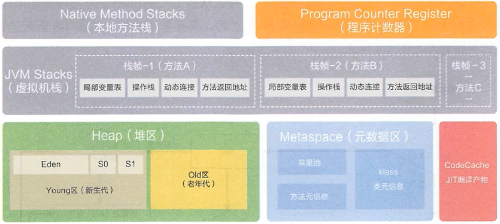
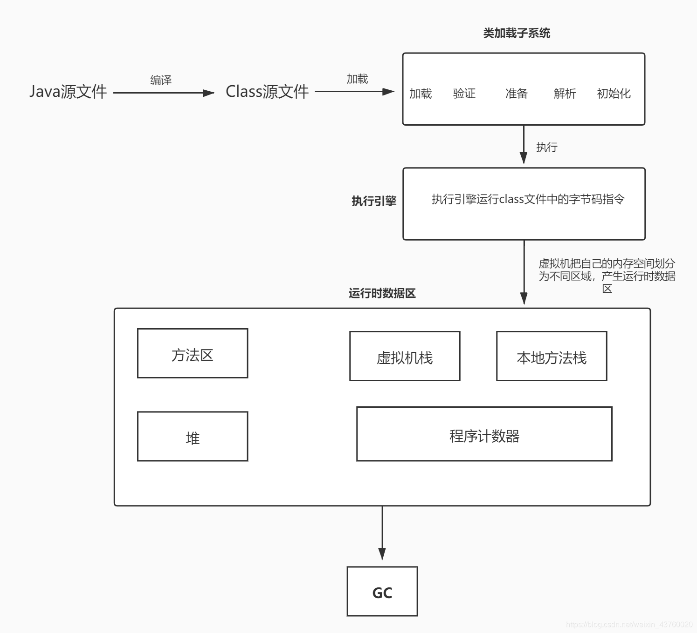
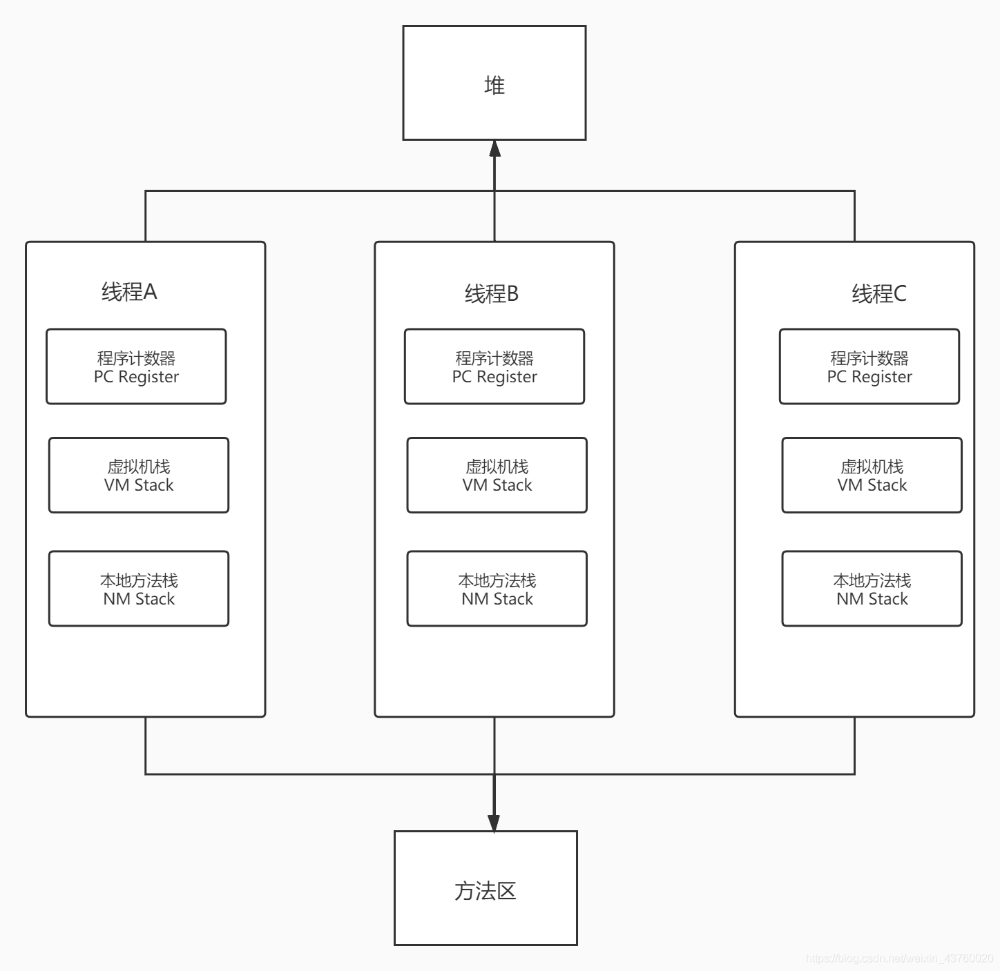
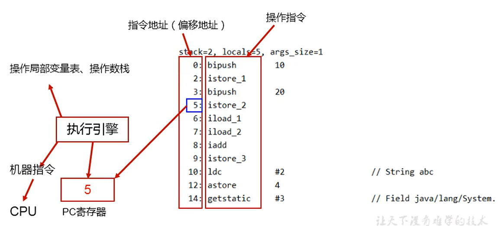

---
# 一、运行时数据区
## 1.1 概述
概述图

经典的JVM内存布局图：

## 1.1 JVM 大致流程

虚拟机在执行 Java 程序的时候，会把它所管理的内存区域划分为不同的数据区域，即运行时数据区。

有些数据区域是线程共享的，即这些区域会随着虚拟机的启动而创建，随着虚拟机的关闭而销毁。

有些数据区域则是与线程对应，属于线程私有的，这些区域会随着线程开始而创建，随着线程结束而销毁。

- 线程共享的：堆、方法区。
- 线程私有的: 程序计数器、Java 虚拟机栈、本地方法栈

## 1.2 线程和JVM系统线程

**线程**

线程是一个程序里的运行单元。 JVM 允许一个应用有多个线程并行的执行。

在 Hostspot JVM 中，每个线程都与操作系统的本地线程直接映射。当 Java 线程准备好执行以后，此时一个操作系统的本地线程也同时创建，Java 线程执行终止后，本地线程也会回收。

操作系统将线程调度到可用的 CPU 上。一旦本地线程初始化成功，它就会调用 Java 线程中的 run() 方法。

**JVM系统线程**

当一个 Java 程序运行起来之后，可以通过 console 或者调试工具，看后台线程，在 Hotspot JVM 里面主要是以下几个：
1. 虚拟机线程：这种线程的操作是需要 JVM 达到安全点オ会出现。这些操作必须在不同的线程中发生的原因是他们都需要 JVM 达到安全点，这样堆才不会变化。这种线程的执行类型包括 "stop-the-world" 的垃圾收集，线程栈收集，线程挂起以及偏向锁撒销。
2. 周期任务线程：一般用于周期性操作的调度执行，是时间周期时间的体现。
3. GC线程：对 JVM 里不同种类的垃圾收集行为提供支持。
4. 编译线程：运行时会将字节码编译成本地代码。
5. 信号调度线程：负责接收信号并发送给 JVM，它在内部通过调用适当方法进行处理。

# 二、程序计数器

JVM 中的程序计数寄存器(Program Counter Register), Register 的命名源于 CPU 的寄存器，寄存器存储指令相关的信息，CPU 只有把数据装在到寄存器才能够运行。这里并非是广义上所指的物理寄存器，或许将其翻译为 PC 计数器(或者指令计数器)会更加贴切(也成为程序钩子)，并且也不容易引起一些不必要的误会。JVM 中的 PC 寄存器是对物理 PC 寄存器的一种抽象模拟。

PC 寄存器用来存储指向下一条指令的地址，即即将要执行的指令代码。由执行引擎读取下一条指令。

## 2.1 程序计数器作用
1. PC 寄存器是一块很小的内存空间，几乎可以忽略不计，也是运行速度最快的存储区域。
2. 在 JVM 规范中，每个线程都有它自己的程序计数器，是线程私有的，生命周期与线程的生命周期保持一样。
3. 任何时候一个线程都只有一个方法在执行，即当前方法。程序计数器会存储当前线程正在执行的 Java 方法的 JVM 指令地址，或者，如果是在执行 native 方法，则是未指定值(undefiend)。
4. 它是程序控制流的指示器，分支、循环、跳转、异常处理、线程恢复等基础功能都需要依赖这个计数器完成。
5. 字节码解释器工作时就是通过改变这个计数器的值来选取下一条需要执行的字节码指令。
6. 它是唯一一个在 Java 虚拟机规范中没有任何 `OutOfMemoryError` 情况的区域。

## 2.2 举例说明

## 2.3 程序计数器常见问题
**1.使用 PC 寄存器存储字节码指令地址有什么用？为什么使用 PC 寄存器记录当前线程的执行地址？**

因为 CPU 需要不停的切换各个线程，来回切换后，需要知道接着从哪开始继续自行。
 
JVM 的字节码解释器需要通过改变 PC 寄存器的值来明确下一条应该执行什么样的字节码指令。

**PC 寄存器为什么是线程私有的？**

我们都知道所谓的多线程在一个特定的时间段内只会执行其中某一个线程的方法， CPU 会不停地做任务切换，这样必然导致经常中断或恢复，如何保证分毫无差呢？为了能够准确地记录各个线程正在执行的当前字节码指令地址，最好的办法自然是为每一个线程都分配一个 PC 寄存器，这样一来各个线程之间便可以进行独立计算，从而不会出现相互干扰的情況。

由于 CPU 时间片轮限制，众多线程在并发执行过程中，任何一个确定的时刻，一个处理器或者多核处理器中的一个内核，只会执行某个线程中的一条指令。

这样必然导致经常中断或恢复，如何保证分毫无差呢？每个线程在创建后，都会产生自己的程序计数器和帧，程序计数器在各个线程之间互不影响。

**CPU 时间片**

CPU 时间片即 CPU 分配给各个程序的时间，每个线程被分配一个时间段，称作它的时间片

在宏观上：我们可以同时打开多个应用程序，每个程序并行不悖，同时运行。

但在微观上：由于只有一个 CPU ，一次只能处理程序要求的一部分，如何处理公平，一种方法就是引入时间片，每个程序轮流执行。

**理解串行、并行、并发**
- 串行：即顺序执行
- 并发（Concurrent），在操作系统中，是指一个时间段中有几个程序都处于已启动运行到运行完毕之间，且这几个程序都是在同一个处理机上运行。
- 并行（Parallel），当系统有一个以上CPU时，当一个CPU执行一个进程时，另一个CPU可以执行另一个进程，两个进程互不抢占CPU资源，可以同时进行，这种方式我们称之为并行(Parallel)。其实决定并行的因素不是CPU的数量，而是CPU的核心数量，比如一个CPU多个核也可以并行。

