学习虚拟机原理有什么用


# 一、栈上的数据存储


> 基本数据类型

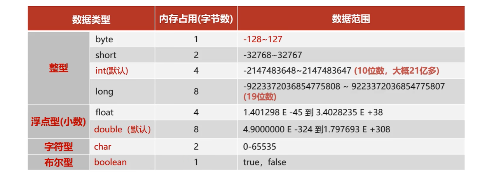


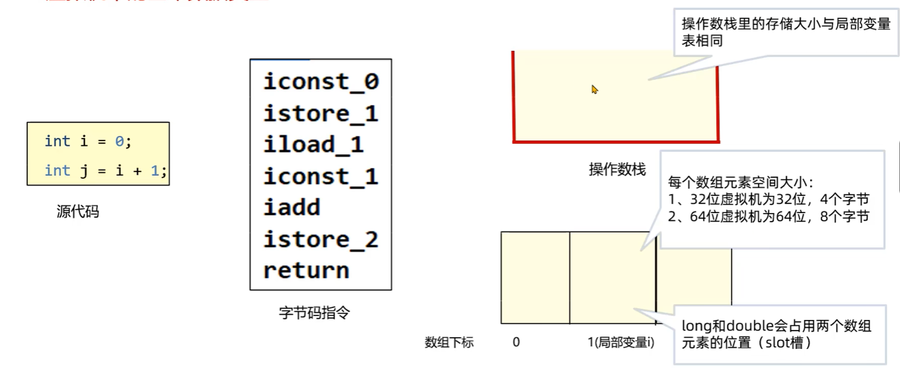

> 8大数据类型再虚拟机的实现

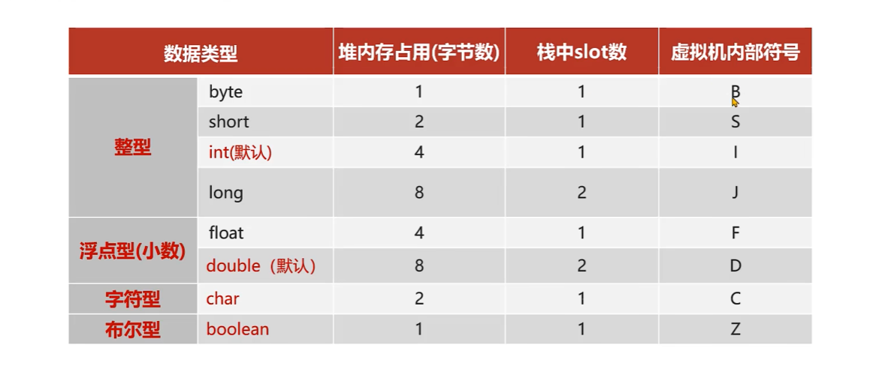


# 

案例：验证boolean在栈上的存储方式

```java
package org.example.stack;

/**
 * @author momoc
 * @version 1.0
 * @className BoleanTest
 * @description
 * @date 2024/4/18 11:03
 */
public class BooleanTest {
    public static void main(String[] args) {
        /**
         * 指令 fconst_1
         * fstore_1
         */
//        float b = 1F;

        /**
         * lconst_1
         * lstore_1
         */
//        long l = 1;
        boolean a = true;
        if (a){
            System.out.println("a为true");
        }else{
            System.out.println("a为 false");
        }

        if (a == true){
            System.out.println("a  true");
        }else{
            System.out.println("a false");
        }
    }

}

```

对应的字节码指令

```sh
 0 iconst_1  0 iconst_2  
 1 istore_1
 // 2-3 将操作数栈上的值和0 相比，相等则跳转到位置17
 2 iload_1 
 3 ifeq 17 (+14)
 6 getstatic #2 <java/lang/System.out : Ljava/io/PrintStream;>
 9 ldc #3 <a为true>
11 invokevirtual #4 <java/io/PrintStream.println : (Ljava/lang/String;)V>
14 goto 25 (+11)
17 getstatic #2 <java/lang/System.out : Ljava/io/PrintStream;>
20 ldc #5 <a为 false>
22 invokevirtual #4 <java/io/PrintStream.println : (Ljava/lang/String;)V>
25 iload_1
26 iconst_1
// 操作数栈上两个值是否相等，不=跳转到41, true操作数栈为内容1
27 if_icmpne 41 (+14) 
30 getstatic #2 <java/lang/System.out : Ljava/io/PrintStream;>
33 ldc #6 <a  true>
35 invokevirtual #4 <java/io/PrintStream.println : (Ljava/lang/String;)V>
38 goto 49 (+11)
41 getstatic #2 <java/lang/System.out : Ljava/io/PrintStream;>
44 ldc #7 <a false>
46 invokevirtual #4 <java/io/PrintStream.println : (Ljava/lang/String;)V>
49 return
```


在Java虚拟机中栈上boolean类型保存方式与int类型相同，所以它的值如果是1代表true，如果是0
代表false。但是我们可以通过修改字节码文件，让它的值超过1。

> 需求2：使用ASM框架修改字节码指令，将iconst1指令修改为iconst2，并测试验证结果。

true操作数栈为内容1, a == true不成立。

> 栈中的数据要保存到堆上或者从堆中加载到栈上时怎么处理？

1、堆中的数据加载到栈上，由于栈上的空间大于或者等于堆上的空间，所以直接
处理但是需要注意下符号位。
boolean、 char为无符号，低位复制，高位补0

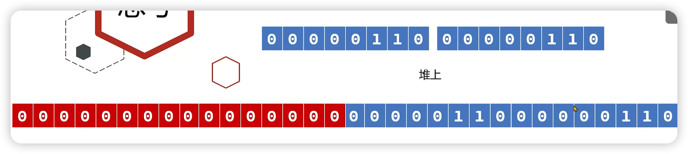


2、byte、 short为有符号，低位复制，高位非负则补0，负则补1


3、boolean比较特殊，**只取低位的最后一位保存**。


验证：使用ASM框架： 将a保存在堆上（使用static），使用ASM框架修改字节码指令，将iconst1指令修改为iconst2和iconst3，并测试验证结果。

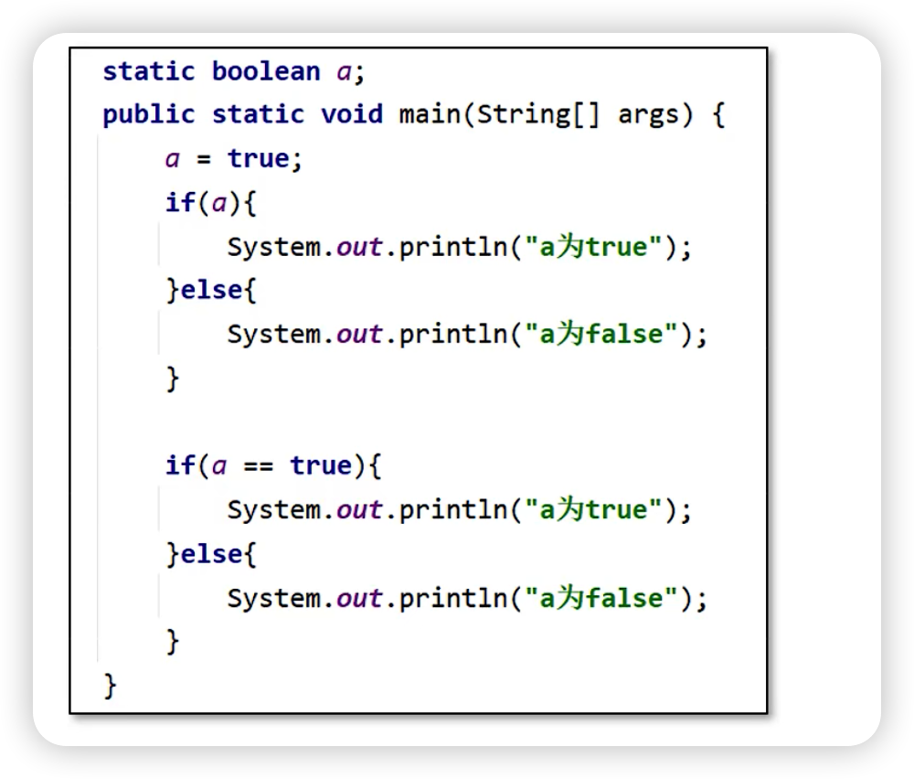

对于iconst2来说

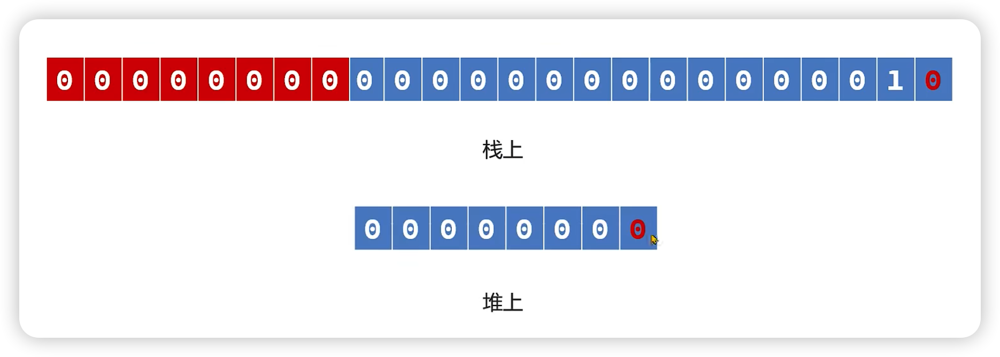


对于iconst3来说

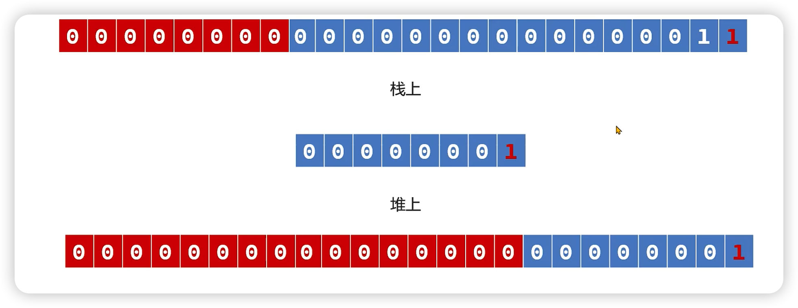


# 二、对象在堆中的内存布局


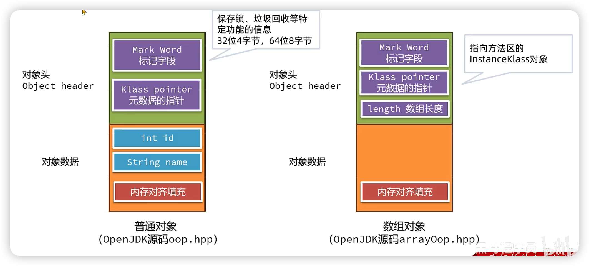


## 标记字段

标记字段相对比较复杂。在不同的对象状态（有无锁、是否处于垃圾回收的标记中）下存放的内容是不同的，
同时在64位（又分为是否开启指针压缩）、32位虚拟机中的布局都不同。以64位开启指针压缩为例：

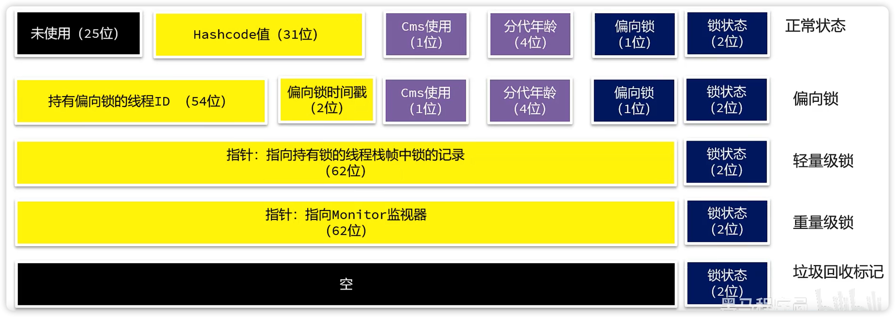

64位不开启指针压缩，只是将Cms使用这部分弃用。


> 打印内存布局


JOL是用于分析JVM 中对象布局的一款专业工具。工具中使用 Unsafe、 JVMTI 和 Serviceability Agent （SA）等虚拟机技术来打印实际的对象内存布局。

JDK默认开启指针压缩，

```
#关闭指针压缩
-XX: -UseCompressedOops
```


1、依赖

```xml
   <dependency>
            <groupId>org.openjdk.jol</groupId>
            <artifactId>jol-core</artifactId>
            <version>0.9</version>
        </dependency>
```

2、使用如下代码打印对象内存布局：

```java
System.out.printiln(ClassLayout.parselnstanc(object.class).toPrintable();
```


## 元数据指针

Klass pointer元数据的指针指向方法区中保存的InstanceKlass对象：

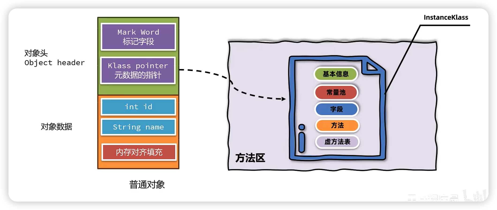


> 指针压缩

在64位的Java虚拟机中，Klass Pointer以及对象数据中的对象引用都需要占用8个字节，为了减少这部分的内存
使用量，64位 Java 虚拟机使用指针压缩技术，将堆中原本 8个字节的 指针压缩成 4个字节，此功能默认开启，
可以使用-XX：-UseCompressedOops关闭。


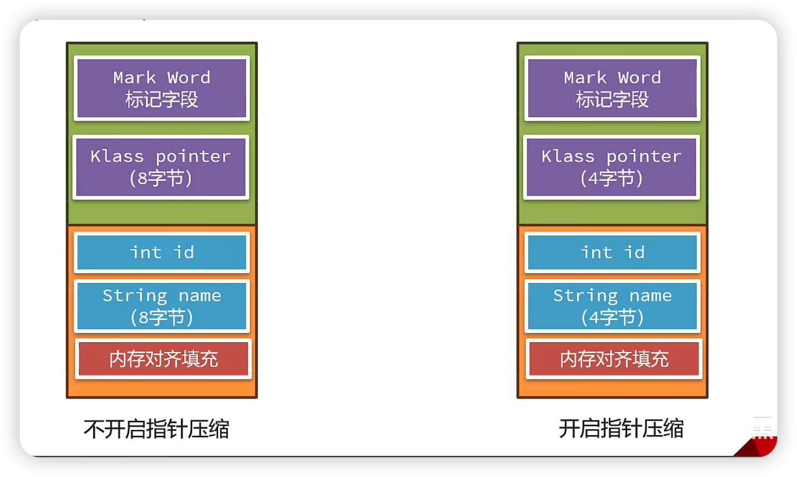


指针压缩的思想是将寻址的单位放大，比如原来按1字节去寻址，现在可以按8字节寻址。如下图所示，原来按1
去寻址，能拿到1字节开始的数据，现在按1去寻址，就可以拿到8个字节开始的数据。


这样将编号当成地址，就可以用更小的内存访问更多的数据。但是这样的做法有两个问题：

- 1、需要进行内存对齐，指的是将对象的内存占用填充至8字节的倍数。存在空间浪费（对于Hotspot来说不存
  在，即便不开启指针压缩，也需要进行內存对齐）

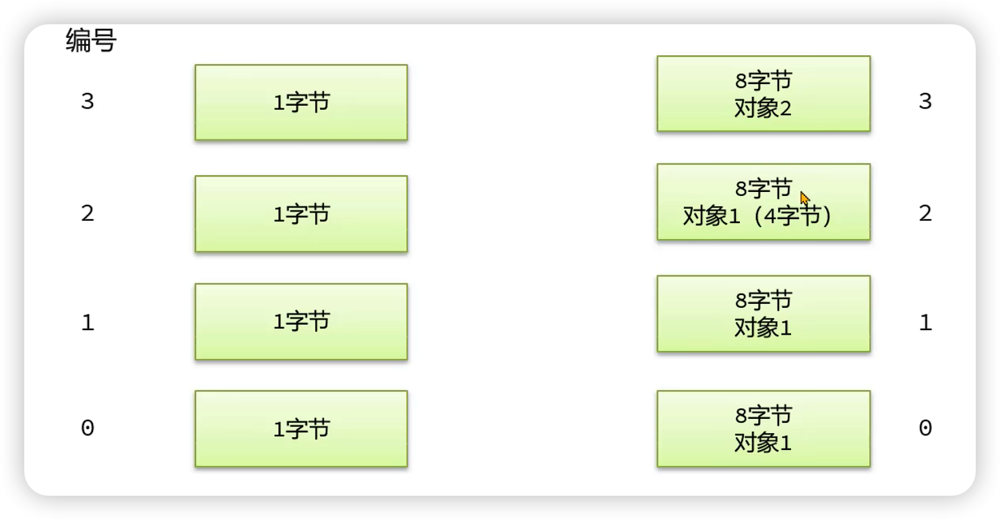

- 2、寻址大小仅仅能支持2的35 次方个字节（32GB，如果超过32GB指针压缩会自动关闭）

  不用压缩指针，应该是2的64次方： -16EB，用了压缩指针就变成了8（字节）
  2的3次方 * 2的32次方 = 2的35次方

> 在hsdb工具中验证klass pointer的正确性

1、使用JOL打印对象的Klass Pointer。
2、使用Klass Pointer的地址，在hsdb工具中使用Inspector找到InstanceKlass对象。
注意：由于使用了小端存储，打印的地址要反着读。

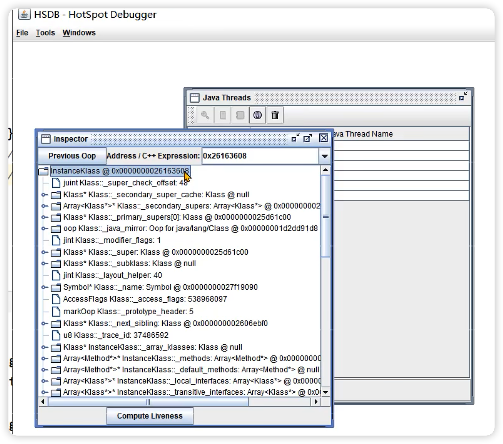

## 对象数据

要保证8的倍数

> 内存对齐

内存对齐主要目的是为了解决并发情况下**CPU缓存失效**的问题：

内存对齐之后，同一个缓存行中不会出现不同对象的属性。在并发情况下，如果让A对象一个缓存行失效，是不
会影响到B对象的缓存行的。

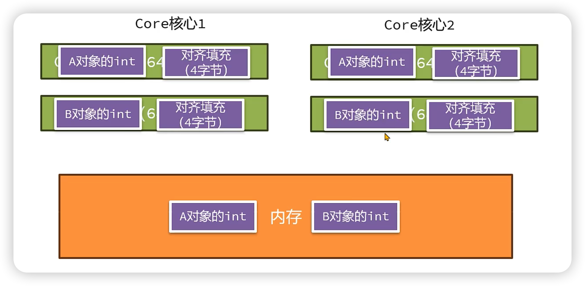


> 字段重排列

在Hotspot中，要求**每个属性的偏移量Offset**（字段地址一起始地址）必须是**字段长度的N倍**。
比如下图中，Student类中的id属性类型为long，那么偏移量就必须是8的倍数。

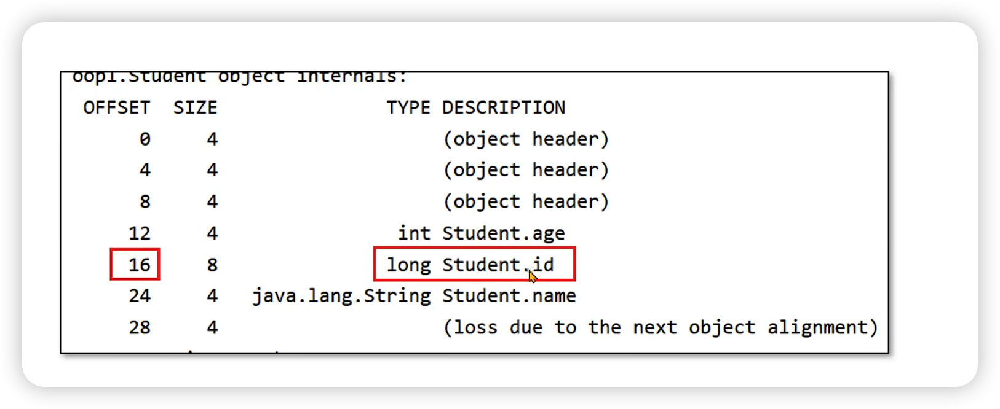

如果不满足要求，会尝试使用内存对齐，通过在属性之间插入一块对齐区域达到目的。
如下图中，n**ame字段是引用占用8个字节**（关闭了指针压缩），所以**Offset必须是8的倍**数，在age和name之
间插入了4个字节的空白区域。

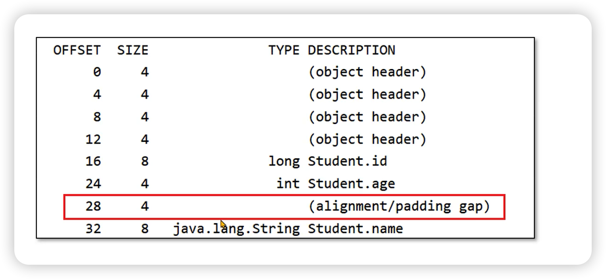


> 案例：子类和父类的偏移量

通过如下代码验证下：子类继承自父类的属性，属性的偏移量和父类是一致的。

```java
class A ｛
  long l；
  int i；
}
class B extends A ｛
  long l；
  int i；
}
```

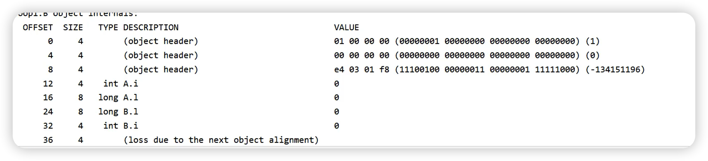

> 总结

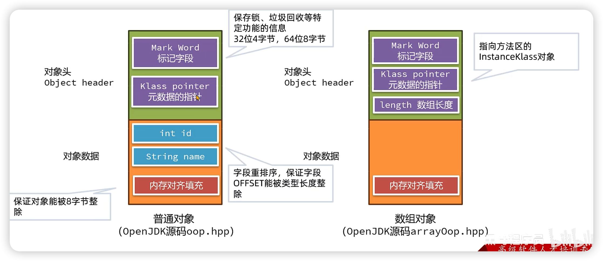


# 三、方法调用的原理

方法调用的本质是通过字节码指令的执行，能在栈上创建栈帧，并执行调用方法中的字节码执行。

方法调用的本质是通过字节码指令的执行，能在栈上创建栈帧，并执行调用方法中的字节码执行。

以**invoke**开头的字节码指令的作用是执行方法的调用。

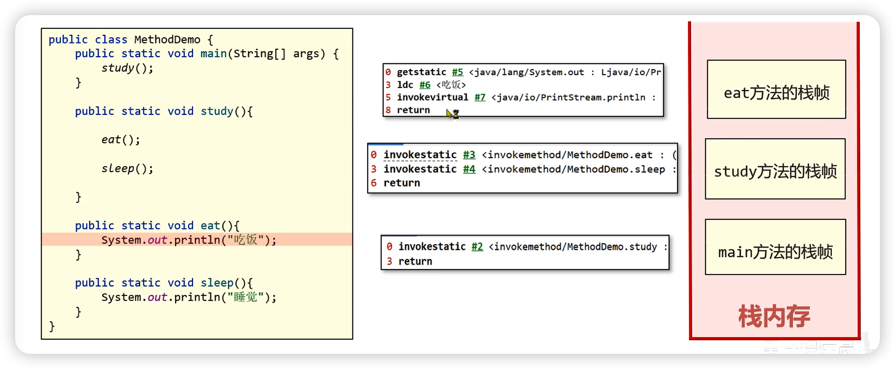


> 方法调用的五种指令

1.  invokestatic：调用静态方法
2. invokespecial：调用对象的private方法、构造方法，以及使用 super 关键字调用父类实例的方法、构造方法，
   以及所实现接口的默认方法。
3. invokevirtual：调用对象的非private方法。
4. invokeinterface：调用接口对象的方法。
5. invokedynamic：用于调用动态方法，主要应用于lambda表达式中，机制极为复杂了解即可。

Invoke方法的核心作用就是找到字节码指令并执行。


Invoke指令执行时，需要找到方法区中instanceklass中保存的方法相关的字节码信息。但是方法区中有很多类，
每一个类又包含很多个方法，怎么精确地定位到方法的位置呢？


## 静态绑定

编译期间，invoke指令会携带一个参数**符号引用**，引用到常量池中的方法定义。方法定义含：类名+方法名＋返回值+参数。
静态绑定： 在方法第一次调用时，这些符号引用就会被替换成内存地址的直接引。

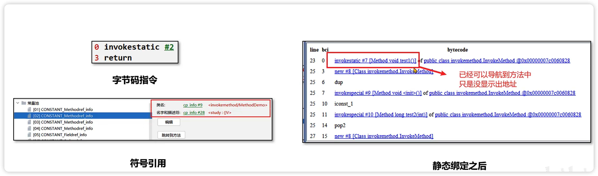

静态绑定适用于处理**静态方法、私有方法、或者使用final修饰**的方法，因为这些方法不能被继承之后重写。

- invokestatic
- invokespecial
- final修饰的invokevirtual

## 动态绑定

对于**非static、非private、非final的方法**，有可能存在子类重写方法，那么就需要通过**动态绑定**来完成方法地址绑定的工作。比如在这段代码中，调用的其实是Cat类对象的eat方法，但是编译完之后虚拟机指令中调用的是Animal类的eat方法，这就需要在运行过程中通过动态绑定找到cat类的eat方法，这样就实现了多态

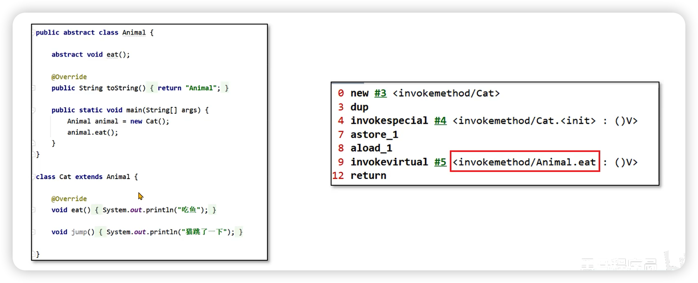

动态绑定：基于方法表来完成的，**invokevirtual**使用了虚方法表 （**vtable**），**invokeinterface**使用了接口方法表
（**itable**），整体思路类似。所以接下来使用invokevirtual和虚方法表来解释整个过程。

- 每个类中都有一个**虚方法表**，本质上它是一个数组，记录了方法的地址。
- 子类方法表中包含父类方法表中的所有方法子类。

- 如果重写了父类方法，则使用自己类中方法的地址进行替换。

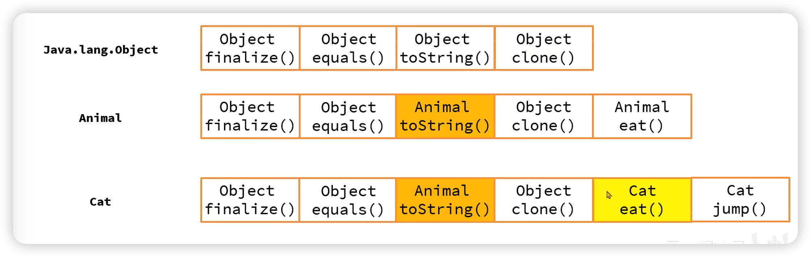


产生**invokevirtual**调用时，先根据对象头中的类型指针找到**方法区中InstanceClass对象，获得虚方法表**。

再根据虚方法表找到对应的对方，获得方法的地址，最后调用方法。

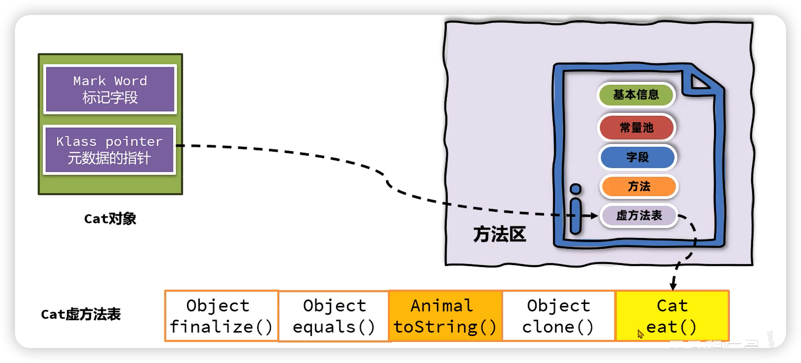


使用HSDB定位虚方法表比较复杂，建议直接查看P100 的视频。

虚方法表地址 = kclass对象地址 + 1B8

> 总结

在JVM中，一共有五个字节码指令可以执行方法调用：
1、invokestatic：调用静态方法。**静态绑定**
2、 invokespecial：调用对象的private方法、构造方法，以及使用 super 关键字调用父类实例的方法、构造方法，
以及所实现接口的默认方法。**静态绑定**

3、invokevirtual：调用对象的非private方法。非final方法使用**动态绑定**，使用虚方法表找到方法的地址，子类
会复制父类的虚方法表，如果子类重写了方法，会替换成重写后方法的地址。
4、invokeinterface：调用接口对象的方法。**动态绑定**，使用接口表找到方法的地址，进行调用。
5、 invokedynamic：用于调用动态方法，主要应用于lambda表达式中，机制极为复杂了解即可。


# 四、异常捕获的原理

异常表在编译期生成，存放的是代码中异常的处理信息，包含了异常捕获的生效范围以及异常发生后跳转到的字节码指令位置。
起始/结束PC：此条异常捕获生效的字节码起始/结束位置。
跳转PC：异常捕获之后，跳转到的字节码位置。


在位置2到4字节码指令执行范围内，如果出现了Exception对象的异常或者子类对象异常，直接跳转到位置7的指令。也就是i=2代码位置。

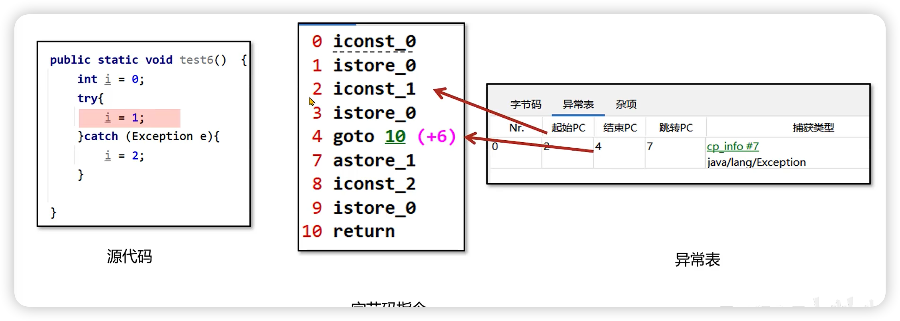


程序运行中触发异常时，java虚拟机会从上至下遍历导常表中的3所有条目。

当触发异常的字**节码索引值在某个异常表条目的监控范围内**，Java虚拟机会判断所抛出的异常和该条目想要捕获的异常是否匹配。

1、 如果匹配，跳转到“跳转PC”对应的字节码位置。

2、如果遍历完都不能匹配，说明异常无法在当前方法执行时被捕获，此方法栈帧直接弹出，在上一层的栈帧中进行异常捕获的查询。


多个catch分支情况下，异常表会从上往下遍历，先捕获RuntimeException， 如果捕获不了，再捕获Exception。

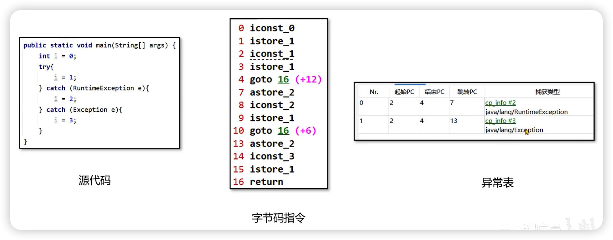


> finally处理方式

1、finally中的字节码指令会插入到try和catch代码块中，保证在try和catch执行之后一定会执行finally中的代码。

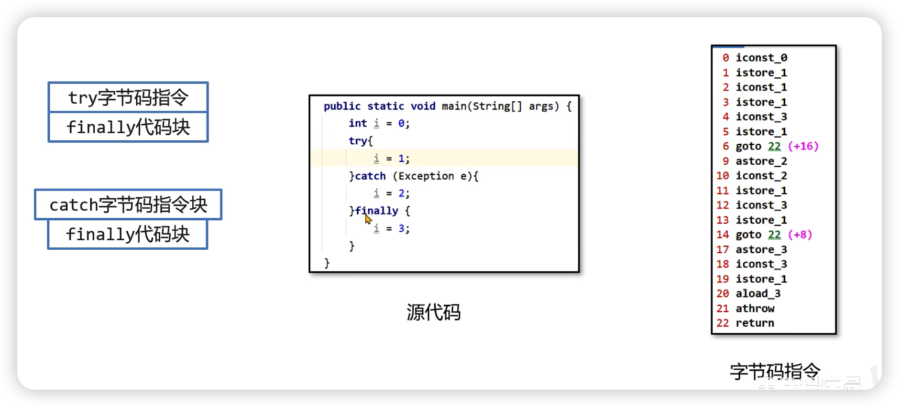

2、如果抛出的异常范围超过了 Exception，比如Error或者Throwable，此时也要执行finally，所以异常表中增加了两
个条目。**覆盖了try和catch两段字节码指令的范围，any代表可以捕获所有种类的异常**。

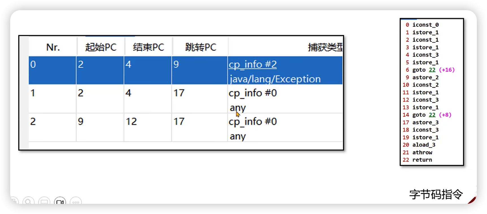

往上层方法抛出的逻辑

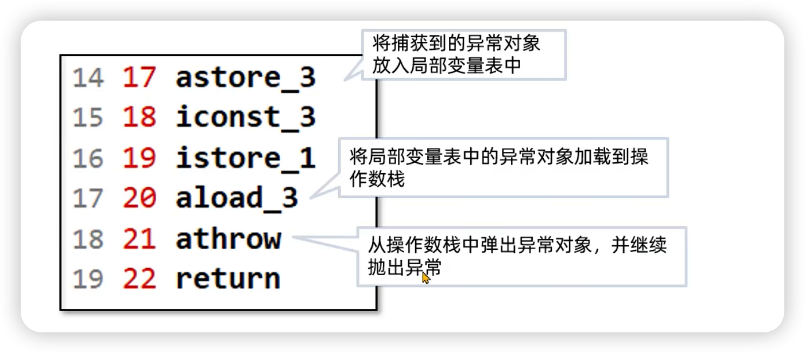


# 五、JIT即时编译器

在Java中，JIT即时编译器是一项用来提升应用程序代码执行效率的技术。字节码指令被 Java 虚拟机解释执行，如
果有一些指令执行频率高，称之为热点代码，这些字节码指令则被J即时编译器编译成机器码同时进行一些优化，
最后保存在内存中，将来执行时直接读取就可以运行在计算机硬件上了。

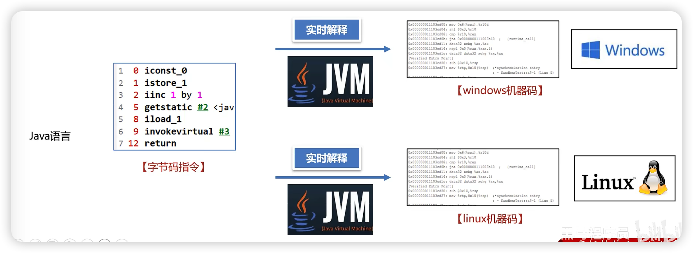


在HotSpot中，有**三款即时编译器，C1、c2和Graal**, 其中Graal在GraalVM章节中已经介绍过。
c1编译效率比c2快，但是优化效果不如C2

-  C1适合优化一些执行时间较短的代码，

- C2适合优化服务端程序中长期执行的代码。

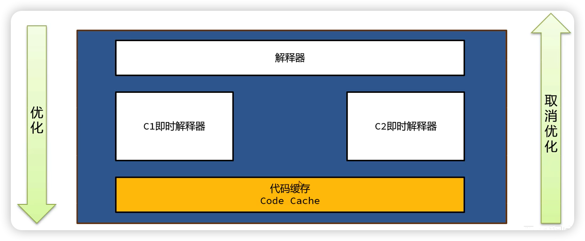


> 分层编译

IDK7之后，采用了分层编译的方式，在VM中C1和C2会一同发挥作用，分层编译将整个优化级别分成了5个等级。

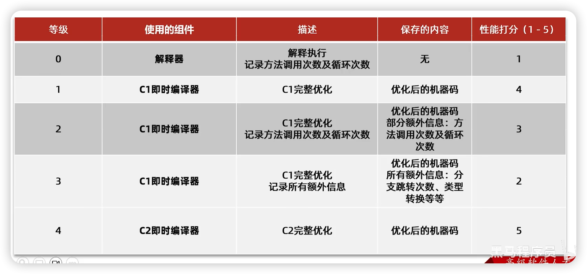

c1即时编译器和c2即时编译器都有**独立的线程**去进行处理，内部会保存一个队列，队列中存放需要编译的任务。
一般即时编译器是针对方法级别来进行优化的，当然也有对循环进行优化的设计。

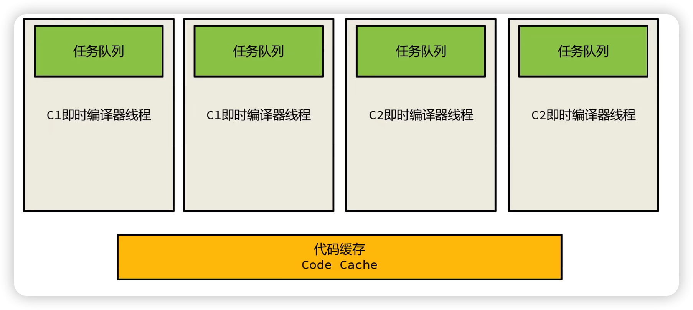

> C1和C2工作流程


1、先由C1执行过程中收集所有运行中的信息，方法执行次数、循环执行次数、分支执行次数等等，然后等待执行次数触发國值 （分层即时编译由JVM动态计算）之后，进入c2即时编译器进行深层次的优化。

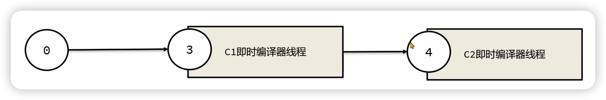

2、方法字节码执行数目过少，先收集信息，JVM判断c1和c2优化性能差不多，那之后转为不收集信息，由c1直接
进行优化。

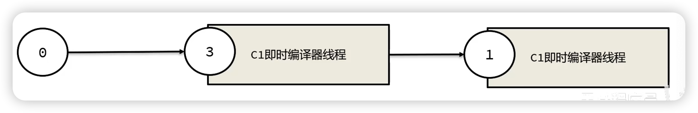

3、C1线程都在忙碌的情况下，直接由c2进行优化。

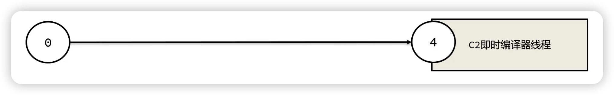


4、c2线程忙碌时，先由2层c1编译收集一些基础信息，多运行一会儿，然后再交由3层c1处理，由于3层c1处理效
率不高，所以尽量减少这一层停留时间（c2忙碌着，一直收集也没有意义），最后c2线程不忙碌了再交由C2进行
处理。

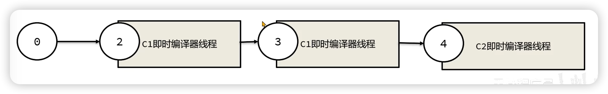

案例：测试JIT优化效果

1、编写JMH案例，代码如下

```java
public int add(int a, int b){
  return a+b;
}
public int jitTets(){
  int sum = 0;
  for(int i = 0;i<1000000;i++){
    sum = add(sum, 100);
  }
}

```

2、分别采用三种不同虚拟机参数测试J优化效果：

- 不加参数（开启完全J「即时编译）  -> 3122466.655 纳秒

- -Xint（关闭）『只使用解释器） -> 2.160 进行了数学层面的优化

- -XX:TieredStopAtLevel=1（分层编译下只使用1层C1进行编译）-> 234017820

## 优化手段

### 方法内联

方法内联（Method Inline）：方法体中的字节码指令直接复制到调用方的字节码指令中，节省了创建栈帧的开销。


方法内联（实际是字节码指令，这里仅仅用源代码更容易理解）

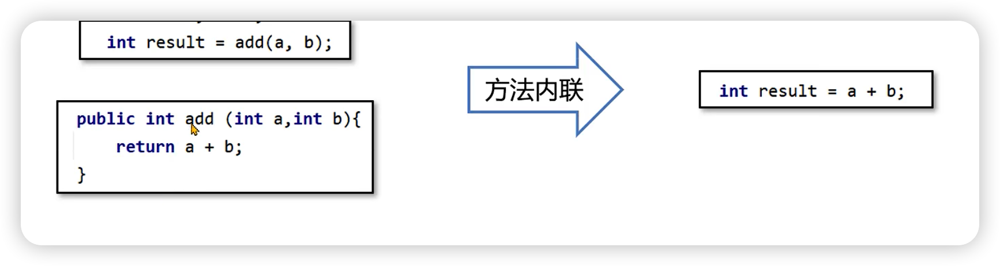

> 内联限制

并不是所有的方法都可以内联，内联有一定的限制：

1、方法编译之后的**字节码指令总大小＜35字节，可以直接内联**。（通过-XX:MaxlinlineSize=值 控制）

2、方法编译之后的**字节码指令总大小＜325字节，并且是一个热方法**。（通过-XX Freqlnline Size=值控制）

3、方法编译生成的**机器码不能大于1000字节**。（通过-xX:nlineSmallCode=值 控制）

4、一个接口的实现心必须小于3个，如果大于三个就不会发生内联。


##### 案例：使用JIT Watch工具查看方法内联的优化结果

1、安装JIT Watch工具，下载源码：https://github.com/AdoptOpenJDK/jitwatch/releases

2、使用资料中提供的脚本文件直接启动。

3、添加源代码目录，点击沙箱环境RUN

4、 通过JIT Watch观察到通过C1调用多次收集信息之后，进入C2优化。C2优化之后的机器码大小非常小。

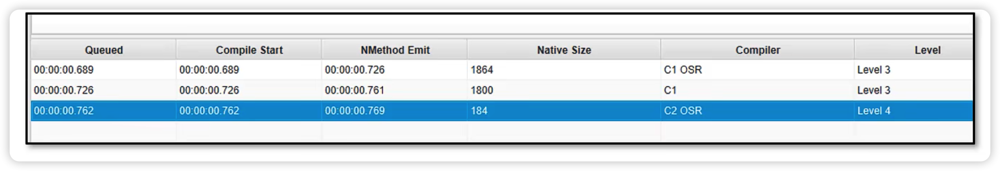

5、方法调用进行了内联优化，汇编代码中直接使用乘法计算出值再进行累加，这样效率更高。

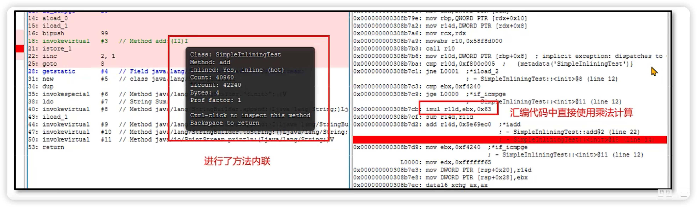

##### 案例：String的toUpperCase方法性能优化

1、String的toUpperCase为了适配很多种不同的语言导致方法编译出来的字节码特别大，通过编写一个方法只处理a-z的大写转换提升性能。

2、通过JT Watch观察方法内联的情况。

### 逃逸分析

```sh
# 关闭逃逸分析
-XX:-DoEscapeAnalysic
#  关闭JIT功能
-Xint
```


逃逸分析指的是如果JT发现在方法内创建的对象不会被外部引用，那么就可以采用锁消除、标量替换等方式进行
优化。

这段代码可以使用逃逸分析进行优化，因为test对象不会被外部引用，只会在方法中使用。

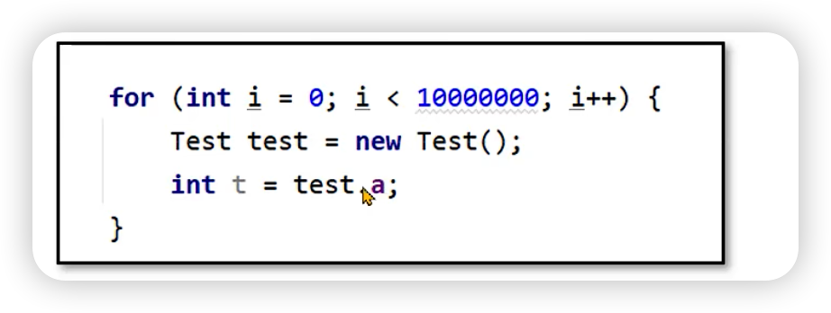

这段代码就会有一定的问题，如果在方法中对象被其他静态变量引|用，那优化就无法进行。

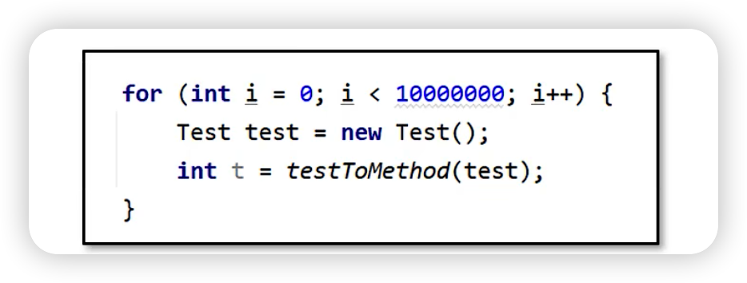


> 锁消除

锁消除指的是如果对象被判断不会逃逸出去，那么在对象就不存在并发访问问题，对象上的锁处理都不会执行，
从而提高性能。比如如下写法

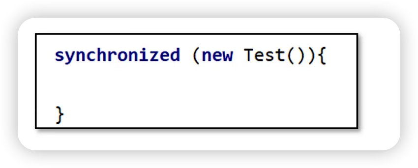

锁消除优化在真正的工作代码中并不常见，一般加锁的对象都是支持多线程去访问的。

> 标量替换


逃逸分析真正对性能优化比较大的方式是标量替换，在Java虚拟机中，对象中的基本数据类型称为标量，引用的其他对象称为聚合量。

标量替换指的是如果方法中的对象不会逃逸，那么其中的标量就可以直接在栈上分配。

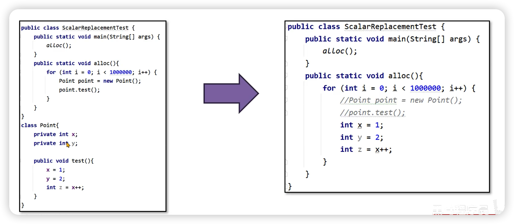

案例：逃逸分析的优化测试

1、编写JMH性能测试案例，测试方法内联和标量替换之后的性能变化。

2、分别使用三种不同虚拟机参数进行测试：

- 开启方法内联和标量替换
- 关闭标量替换
- 关闭所有优化

3、比对测试结果。

### JIT优化几点建议

根据JT即时编器优化代码的特性，在编写代码时注意以下几个事项，可以让代码执行时拥有更好的性能：
1、尽量编写比较小的方法，让方法内联可以生效。

2、高频使用的代码，特别是第三方依赖库甚至是JDK中的，如果内容过度复杂是无法内联的，可以自行实现一个特定的优化版本。

3、注意下接口的实现数量，尽量不要超过2个，否则会影响内联的处理。

4、高频调用的方法中创建对象临时使用，尽量不要让对象逃逸。

# 六、垃圾回收器原理


## G1垃圾回收器原理


关键字：写屏障（用于脏卡队列）、记忆集、卡表

### 年轻代回收


年轻代回收只扫描年轻代对象（Eden + Survivor），所以从GC Root到年轻代的对象或者年轻代对象引用了其他年轻代的对象都很容易扫描出来。

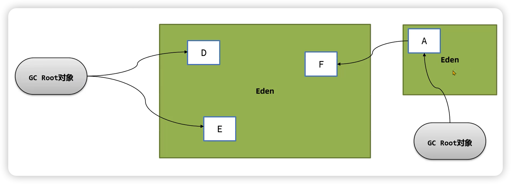

这里就存在一个问题，年轻代回收只扫描年轻代对象 （Eden + Survivor），如果有老年代中的对象引用了年轻代中的对象，我们又如何知道呢？

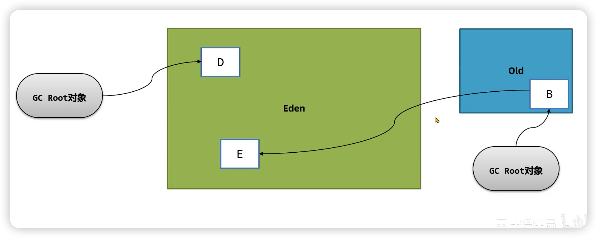

方案1：从GC Root开始，扫描所有对象，如果年轻代对象在引用链上，就标记为存活。不可行，需要遍历引用链上所有对象，效率太低。


方案2：维护一个详细的表，记录哪个对象被哪个老年代引用了。在年轻代中被引用的对象，不进行回收。

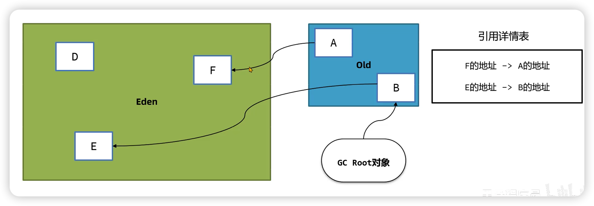

问题：如果对象太多这张表会占用很大的内存空间。存在错标的情况

方案2的第一次优化：只记录Region被哪些对象引用了。这种引用详情表称为**记忆集 RememberedSet**（简称RS或RSet）：是一种记录了从非收集区域对象引用收集区域对象的这些关系的数据结构。扫描时将记忆集中的对象也加
入到GC Root中，就可以根据引用链判断哪些对象需要回收了。

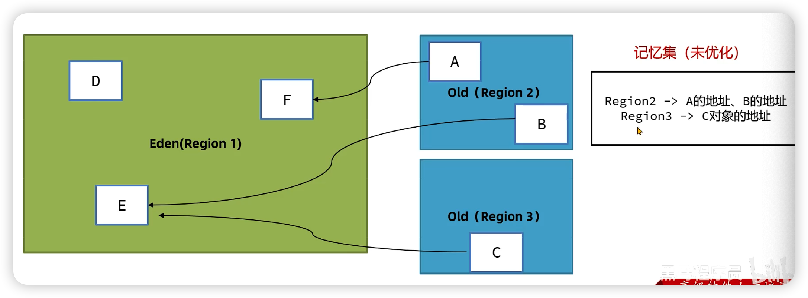

方案2的第二次优化：将所有区域中的内存按—定大小划分成很多个块，每个块进行编号。记忆集中只记录对块的引用关系。如果一个块中有多个对象，只需要引1用一次，减少了内存开销。

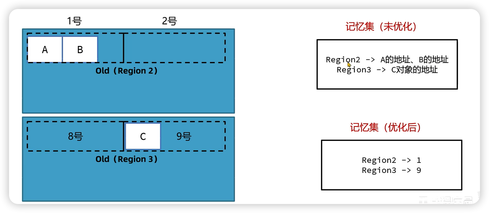


> 卡表（Card Table）

每一个Region都拥有一个自己的卡表，如果产生了跨代引用（老年代引用年轻代），此时这个Region对应的卡表
上就会将字节内容进行修改，JDK8源码中0代表被引用了称为脏卡。这样就可以标记出当前Region被老年代中的哪
些部分引用了。那么要生成记忆集就比较简单了，只需要遍历整个卡表，找到所有脏卡。

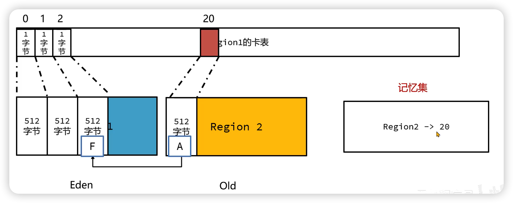

年轻代回收标记时，会将记忆集中的对象也加入到GC Root对象中，进行扫描并标记其引用链上的对象。

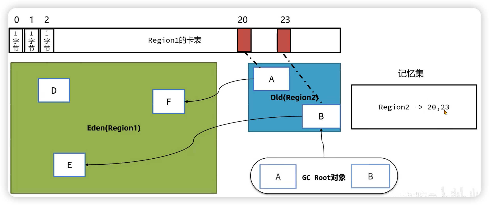

> 写屏障

JVM使用写屏障（write Barrier） 技术，在执行引用关系建立的代码时，可以在代码前和代码后插入一段指令，
从而维护卡表。记忆集中不会记录新生代到新生代的引用，同一个Region中的引用也不会记录。


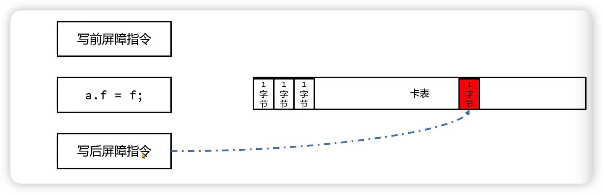


#### 记忆集生成流程

记忆集的生成流程分为以下几个步骤：

1、通过写屏障获得引用变更的信息。

2、将引用关系记录到卡表中，并记录到一个脏卡队列中。

3、JVM中会由Refinement 线程定期从脏卡队列中获取数据，生成记忆集。不直接写入记忆集的原因是避免过多线程并发访问记忆集。

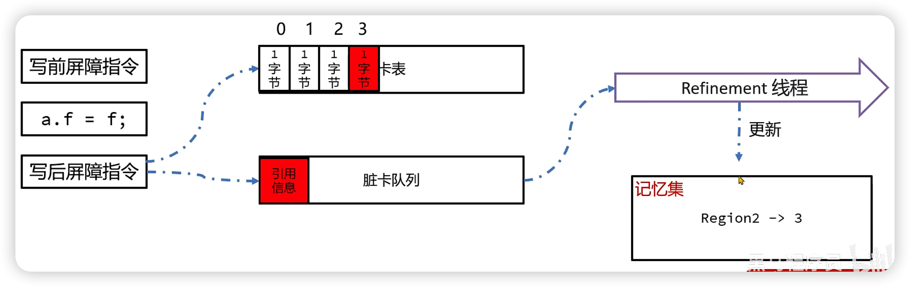

#### 年轻代详细回收流程

STW

1、 Root扫描，将所有的静态变量、局部变量扫描出来。

2、处理脏卡队列中的没有处理完的信息，更新记忆集的数据，此阶段完成后，记忆集中包含了所有老年代对当前Region的引用关系。


3、标记存活对象。记忆集中的对象会加入到GC Root对象集合中，在GC Root引用链上的对象也会被标记为存活对
象。

4、根据设定的最大停顿时间，选择本次收集的区域，称之为回收集合Collection Set。

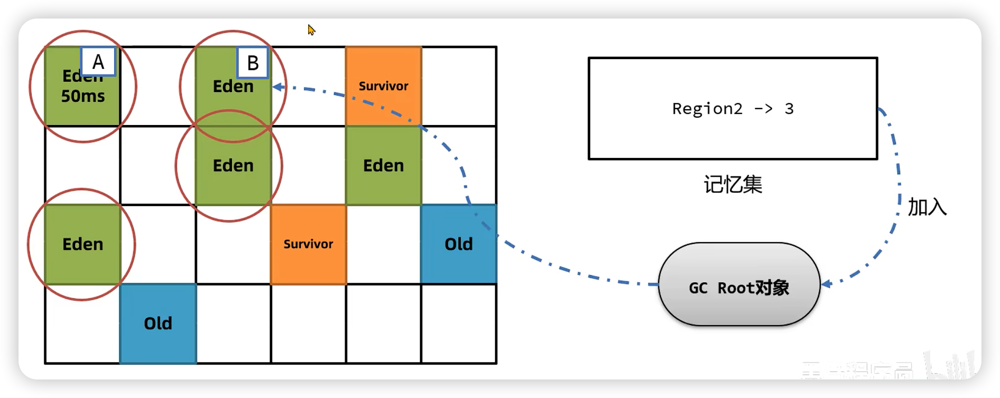

5、复制对象：将标记出来的对象复制到新的区中，将年龄加1，如果年龄到达15则晋升到老年代。老的区域內存直
接清空。
6、 处理软、弱、虚、终结器引用，以及JNI中的弱引用。


> G1年轻代回收核心技术

1、卡表 Card Table

每一个Region都拥有一个自己的卡表，卡表是一个字节数组，如果产生了跨代引用（老年代引用年轻代），G1
会将卡表上引用对象所在的位置字节内容进行修改为0，称为脏卡。卡表的主要作用是生成记忆集。
卡表会占用一定的内存空间，堆大小是1G时，卡表大小为1G = 1024 MB / 512 = 2MB

2、记忆集 RememberedSet （简称RS或RSet）

每—个Region都拥有一个自己的记忆集，如果产生了跨代引用，记忆集中会记录引用对象所在的卡表位置。标记阶段将记忆集中的对象加入GC ROOT集合中一起扫描，就可以将被引用的对象标记为存活。

3、 写屏障 Write Barrier

G1使用写屏障技术，在执行引用关系建立的代码执行后插入一段指令，完成卡表的维护工作。
会损失一部分的性能，大约在5%~10%之间。

### 混合回收

多次回收之后，会出现很多0ld老年代区，此时总堆占有率达到闻值(默认45%)时会触发混合回收MixedGC。混合回收会由年轻代回收之后或者大对象分配之后触发，混合回收会回收 **整个年轻代 + 部分老年代**。
老年代很多时候会有大量对象，要标记出所有存活对象耗时较长，所以整个标记过程要尽量能做到和用户线程并行执行。


#### 1、初始标记


SATB

STW，采用三色标记法标记从GC Root可直达的对象。


三色标记法在原有双色标记(黑1： 代表存活，白0：代表可回收)增加了一种灰色，采用队列的方式保存标记为灰色的对象

黑色:当前对象在GC Root引用链上，同时他引用的其他对象也都已经标记完成

灰色:当前对象在GC Root引用链上，他引用的其他对象还未标记完成,会放入灰色队列用

白色:不在GC Root

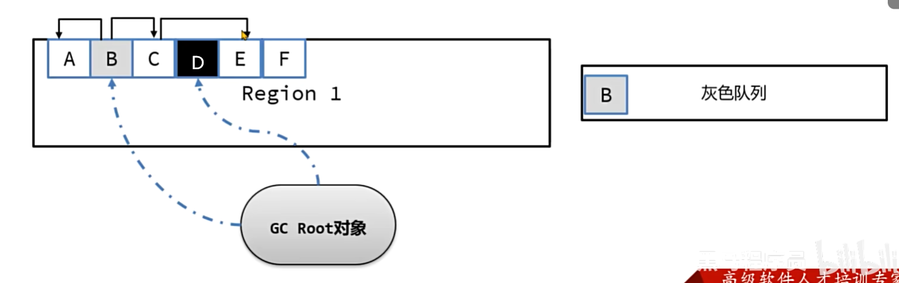

三色标记中的黑色和白色是使用位图(bitmap)来实现的,比如8个字节使用1个bit来标识标记的内容，黑色为1，白色为0，灰色不会体现在位图中，会单独放入一个队列中。如果对象超过8个字节，仅仅使用第一个bit位处理。

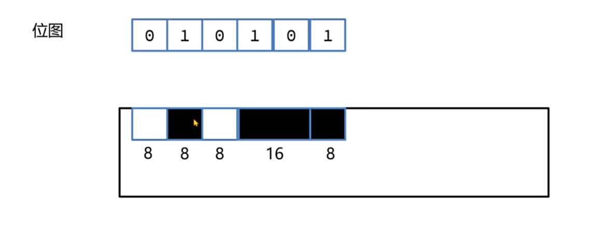


#### 2、并发标记

并发执行，对存活对象进行标记。


继续进行未完成的标记任务。此阶段和用户线程并发执行。

取灰色队列中尚未完成标记的对象B。标记B关联的A和C对象，由于A和C对象并未引用其他对象，可以直接标记成黑色，B完成了所有引用对象的标记，标记为黑色


最后从队列获取C对象，标记为黑色，E也标记为黑色。所以剩余对象F就是白色，可回收

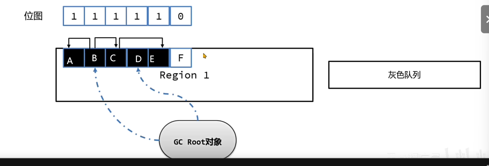


> 三色标记存在的问题

用户线程可能同时在修改对象的引用关系，就会出现错标的情况，比如:当前案例中正常情况下，B和C都会被标记成黑色。

在BC标记前，用户线程执行 B.c=null; A.c = c;  添加了A到的引用。此时会出现严重问题，C是白色可回收一旦回收代码中再去使用对象会造成重大问题。

最终标记结果

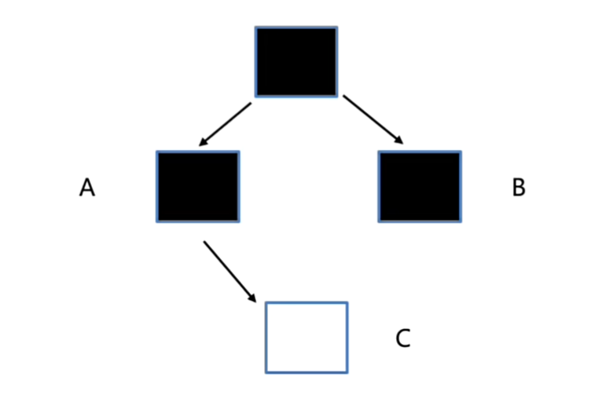


G1为了解决三色标记存在的问题，使用了**SATB技术(Snapshot At The Beginning， 初始快照**)。
SATB技术是这样处理的:

（1）标记开始时创建一个快照，记录当前所有对象，标记过程中新生成的对象直接标记为黑色

（2）采用前置写屏障技术，在引用赋值前比如B.C= null之前，将之前引用的对象放入SATB待处理队列中。SATB队列每个线程都有一个，最终会汇总到一个大的SATB队列中。


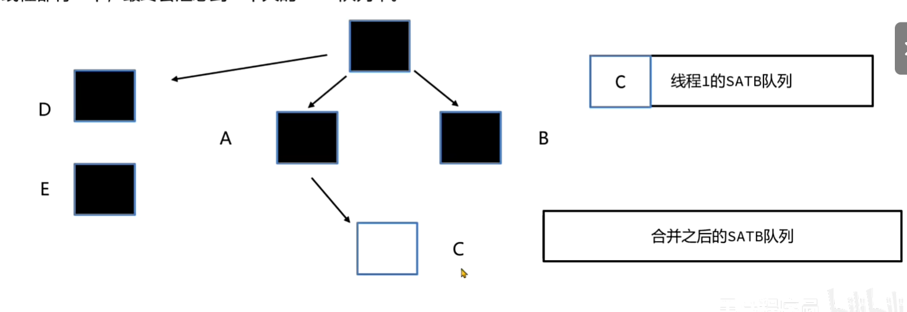


#### 3、最终标记

STW，处理SATB相关的对象标记。


暂停所有用户线程，处理SATB相关的对象标记。这一步中，将所有线程的SATB队列中剩余的数据合并到总的SATB队列中，然后逐一处理。

SATB队列中的对象，默认按照存活处理，同时要处理他们引用的对象

SATB队列中的对象，默认按照存活处理，同时要处理他们引用的对象。SATB的缺点是**在本轮清理时可能会将不存活的对象标记成存活对象，产生了一些所谓的浮动垃圾，等到下一轮清理时才能回收。**

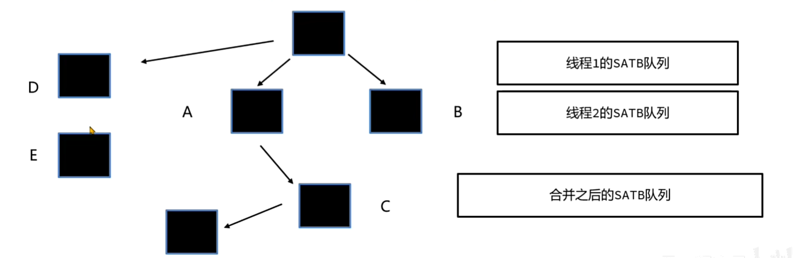


#### 4、清理

STW，如果区域中没有任何存活对象就直接清理


#### 5、转移

将存活对象**复制**到别的区域

（1）、根据最终标记的结果，可以计算出每一个区域的垃圾对象占用内存大小，根据停顿时间，选择转移效率最高(垃圾对象最多)的几个区域。

（2）、转移时先转移GC Root直接引用的对象，然后再转移其他对象

（3）、回收老的区域，如果外部有其他区域对象引用了转移对象，也需要重新设置引用关系


## ZGC原理

关键字：着色指针、读屏障、内存划分（小中大）


ZGC是一种可扩展的低延迟垃圾回收器。ZGC 在垃圾回收过程中，STW的时间不会超过一毫秒，适合需要低延迟的应用。支持几百兆到16TB 的堆大小，堆大小对STW的时间基本没有影响。

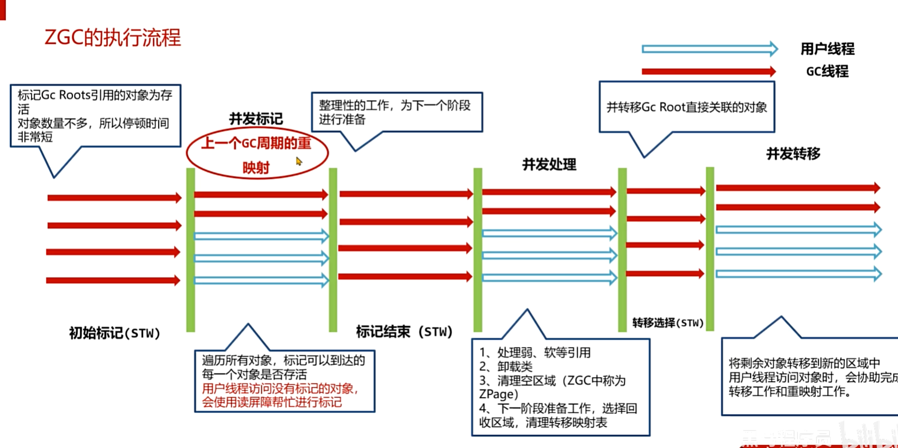

> G1转移时需要停顿的主要原因

在转移时，能不能让用户线程和GC线程同时工作呢?考虑下面的问题:

转移完之后，需要将A对对象的引用更改为新对象的引用。但是在更改前，执行A.c.count = 2，此时更改的是转移前对象中的属性.


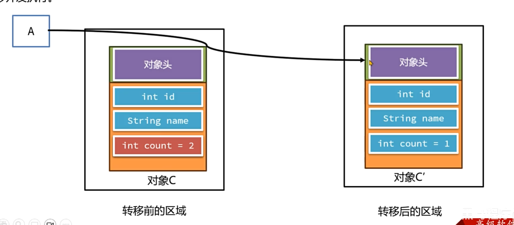


### 读屏障Load Barrier

在ZGC中，使用了读屏障Load Barrier技术，来实现转移后对象的获取。当获取一个对象引用时，会触发读后的屏障指令，如果对象指向的不是转移后的对象，用户线程会将引用指向转移后的对象。

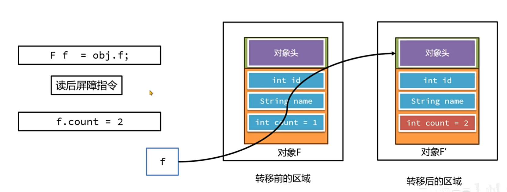

### 着色指针

访问对象引用时，使用的是对象的地址。在64位虚拟机中，是8个字节可以表示接近无限的内存空间。所以一般内存中对象，高几位都是0没有使用。着色指针就是利用了这多余的几位，存储了状态信息。

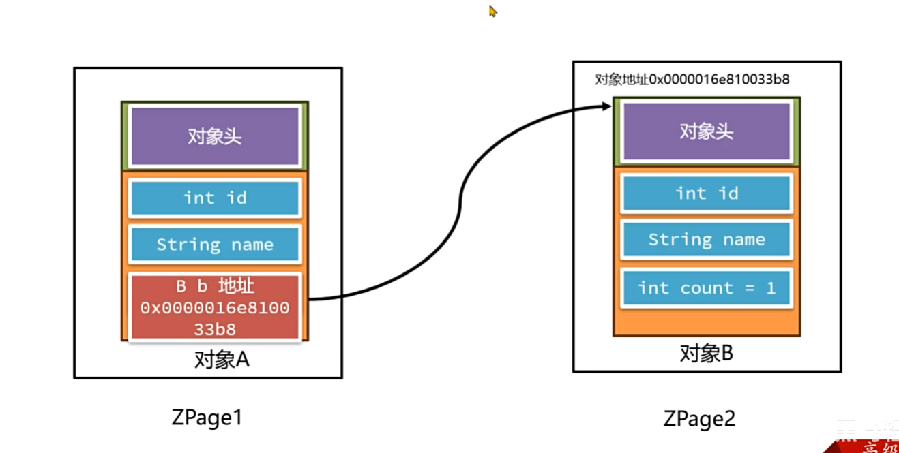


着色指针将原来的8字节保存地址的指针拆分成了三部分

1、最低的44位，用于表示对象的地址，所以最多能表示16TB的内存空间。

2、中间4位是颜色位，每一位只能存放0或者1，并且同一时间只有其中一位是1。

终结位: 只能通过终结器访问

重映射位(Remap):  转移完之后，对象的引用关系已经完成变更

Marked0和Marked1:  标记可达对象


正常应用程序使用8个字节去进行对象的访问，现在只使用了44位，不会产生问题吗?
应用程序使用的对象地址，只是虚拟内存，操作系统会将虚拟内存转换成物理内存。而ZGC通过操作系统更改了这层逻辑。所以不管颜色位变成多少，指针指向的都是同一个对象。

3、16位未使用


### ZGC内存划分

在ZGC中，与G1垃圾回收器一样将堆内存划分成很多个区域，这些内存区域被称之为Zpage。

Zpage分成三类大中小，管控粒度比G1更细，这样更容易去控制停顿时间。

小区域:2M，只能保存256KB内的对象

中区域:32M，保存256KB - 4M的对象

大区域:只保存一个大于4M的对象。


### 初始标记阶段

标记GcRoots引用的对象为存活对象数量不多，所以停顿时间非常短

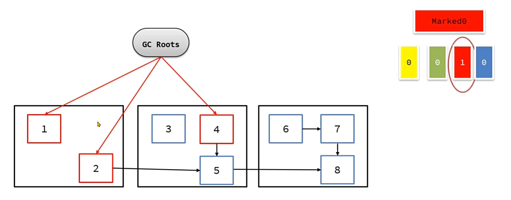

### 并发标记阶段

遍历所有对象标记可以到达的每一个对象是否存活，用户线程使用读屏障，如果发现对象没有完成标记也会帮忙进行标记


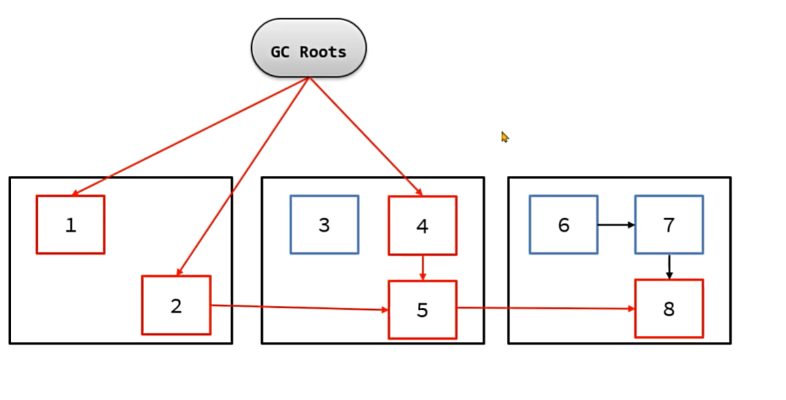

### 并发处理阶段

选择需要转移的Zpage，并创建转移表，用于记录转移前对象和转移后对象地址

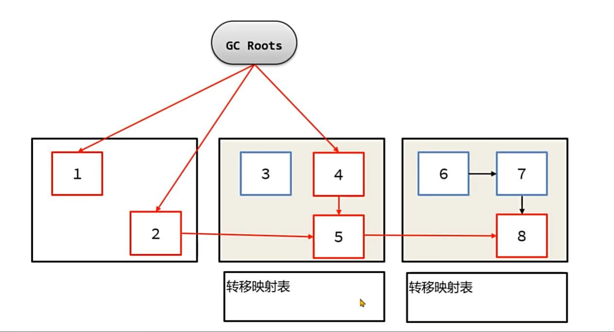

### 转移开始阶段

转移GC Root直接关联的对象，不转移的对象**remapped**值设置成1，避免重复进行判断转移之后将两个对象的地址记入转移映射表。

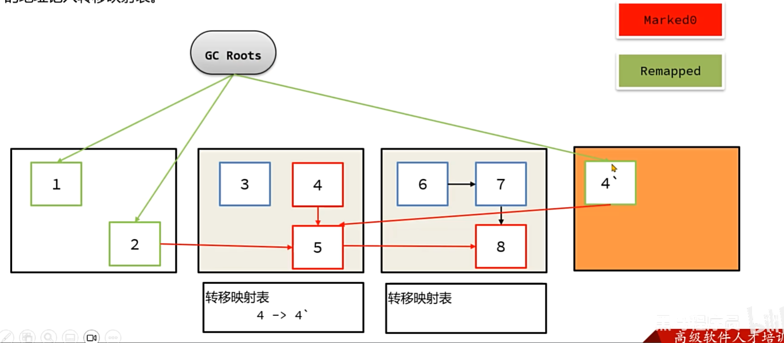

将剩余对象转移到新的ZPage中，转移之后将两个对象的地址记入转移映射表

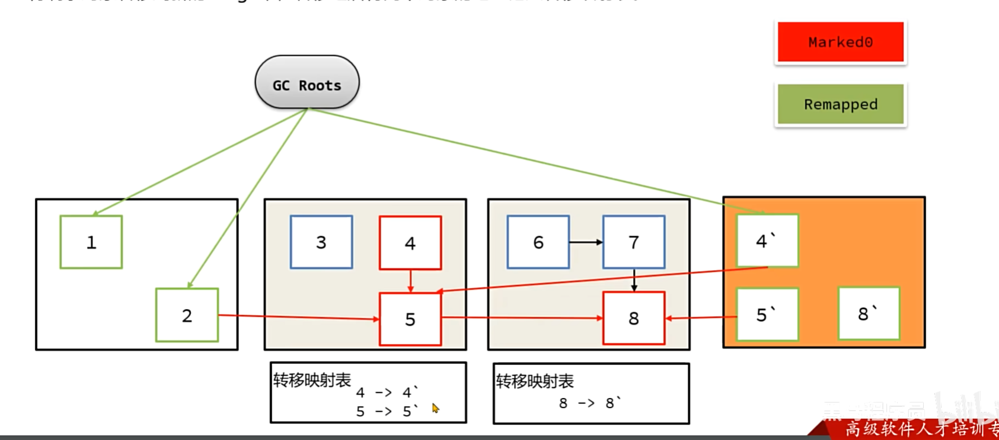

转移完之后，转移前的Zpage就可以清空了，转移表需要保留下来

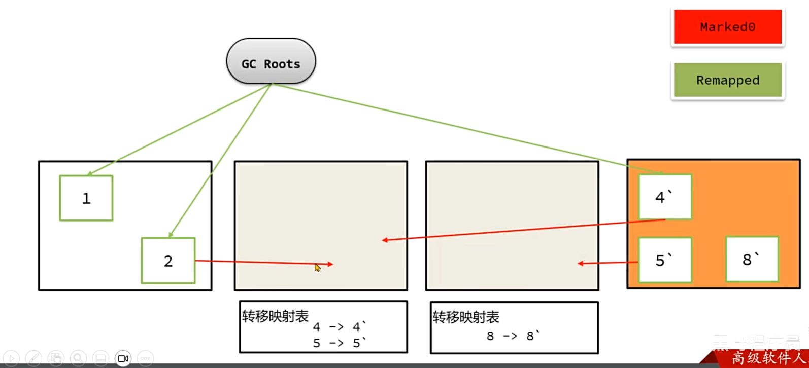


会通过读屏障，将4对5的引用进行重置，修改为对5的引用，同此时，如果用户线程访问4对象引用的5对象，时将remap标记为1代表已经重

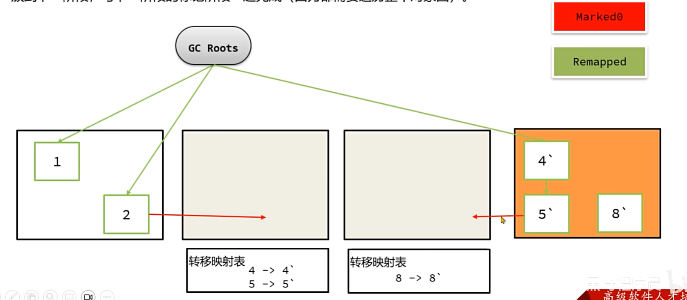


> 并发问题

如果用户线程在帮忙转移时，GC线程也发现这个对象需要复制，那么就会去尝试写入转移映射表，如果发现映射表中已经有相同的老对象，

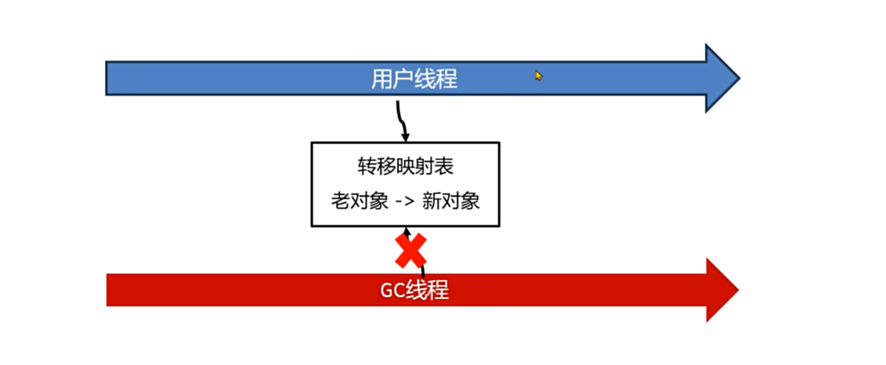

> 第二次垃圾回收初始标记阶段

第二次垃圾回收的初始标记阶段，沿着GCRoot标记对象，采用新的颜色redmark1

如果Marked为1代表上一轮的重映射还没有完成，先完成重映射从转移表中找到老对象转移后的新对象，再进行标记。如果Remap为1，只需要

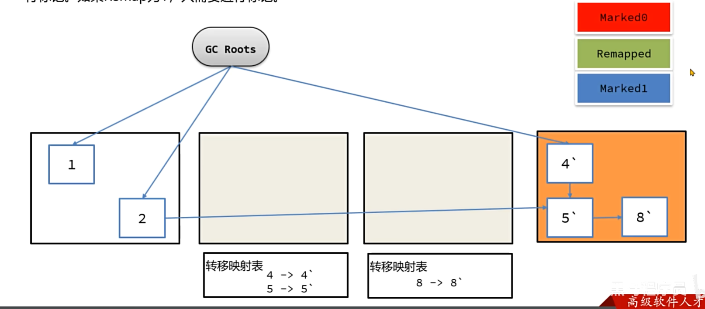

注意marked0 和marked1会交替使用


> 第二次垃圾回收的并发处理阶段

将转移映射表删除，释放内存空间。

### 分代ZGC的设计

在JDK21之后，ZGC设计了年轻代和老年代，这样可以让大部分对象在年轻代回收，减少老年代的扫描次数同样可以提升一定的性能。同时，年轻代和老年代的垃圾回收可以并行执行

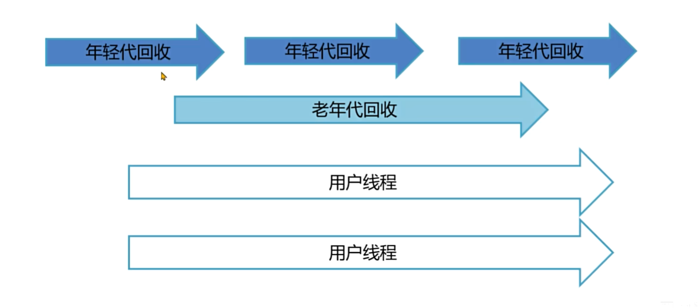

分代之后的着色指针将原来的8字节保存地址的指针拆分成了三部分
1、46位用来表示对象地址，最多可以表示64TB的地址空间。
2、中间的12位为颜色位
3、最低4位和最高2位未使用
整个分代之后的读写屏障、着色指针的移位使用都变的异常复杂，仅作了解即可

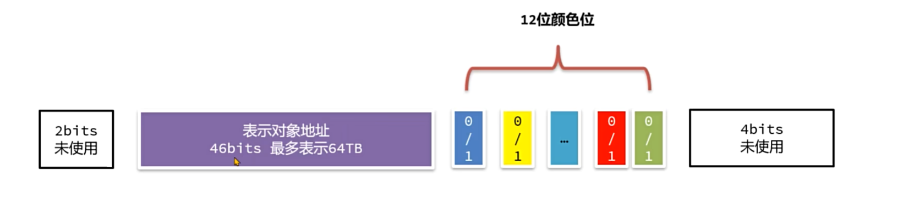


### ZGC核心技术

1、着色指针(Colored Pointers)

着色指针将原来的8字节保存地址的指针拆分成了三部分，不仅能保存对象的地址，还可以保存当前对象所属的状态。

**不支持32位系统、不支持指针压缩**

2、读屏障(Load Barrier)

在获取对象引用前判断对象所属状态，如果所属状态和当前GC阶段的颜色状态不一致，由用户线程完成本阶段的工作。会损失一部分的性能，大约在5%~10%之间。


## shenandoahGC


ShenandoahGC和ZGC不同，ShenandoahGC很多是使用了G1源代码改造而成，所以在很多算法、数据结构的定义上，与G1十分相像，而ZGC是完全重新开发的一套内容

1、ShenandoahGC的区域定义与G1是一样的

2、没有着色指针，通过修改对象头的设计来完成并发转移过程的实现。

3、ShenandoahGC有两个版本，1.0版本存在于JDK8和JDK11中，后续的JDK版本中均使用2.0版本

> 1.0 版本

1.0版本，在对象的前8个字节，增加了一个前向指。

前向指针指向转移之后的对象，如果没有则指向自己


如果转移阶段未完成，此时转移前的对象和转移后的对象都会存活。如果用户去访问数据，需要使用转移后的数据。shenandoahGC使用了**读前屏障**，根据对象的前向指针来获取到转移后的对象

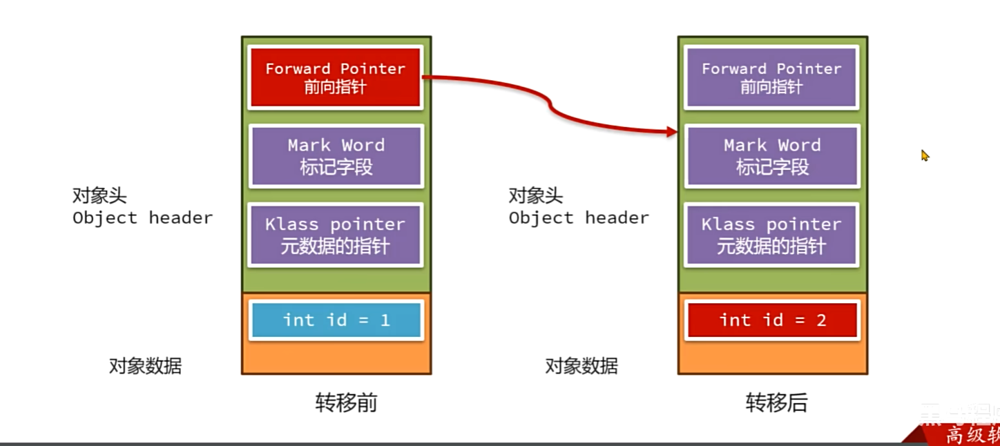

写入数据时，也会使用写前屏障，判断Mark Word中的GC状态，如果GC状态为0证明没有处于GC过程中，直接写入，如果不为0则根据GC状态值确认当前处于垃圾回收的哪个阶段，让用户线程执行垃圾回收相关的任务。

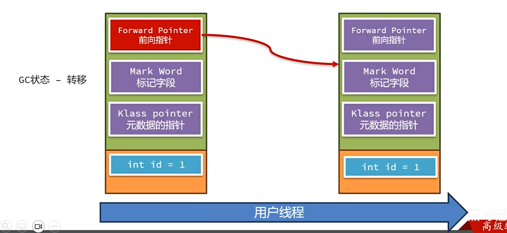


> 2.0版本

1.0版本的缺点

- 对象内存大大增加，每个对象都需要增加8个字节的前向指针，基本上会占用5%- 10%的空间
- 读屏障中加入了复杂的指令，影响使用效率

2.0版本优化了前向指针的位置，仅**转移阶段**将其放入了Mark Word中

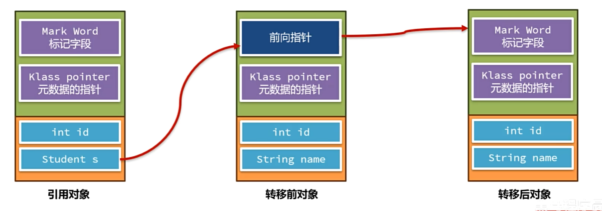


> 执行流程

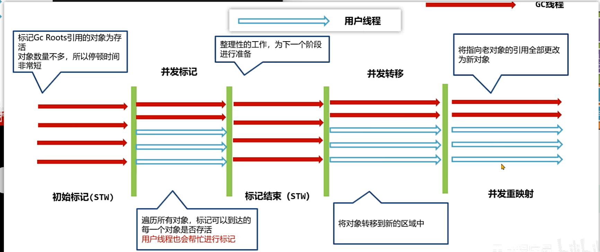


并发转移阶段：并发问题

如果用户线程在帮忙转移时，ShenandoahGC线程也发现这个对象需要复制，那么就会去尝试写入前向指针使用了类似CAS的方式来实现，只有一个线程能成功修改，其他线程会放弃转移的操作。

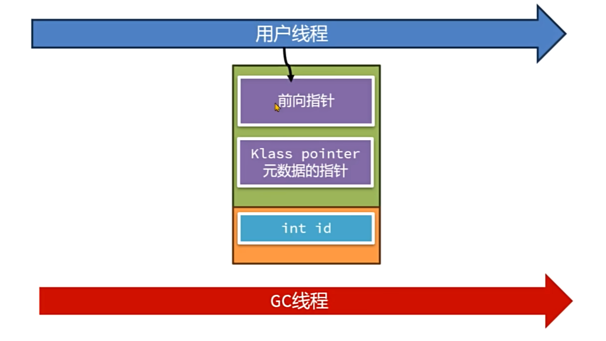


