# 一、初识JVM

解释运行-字节码指令编译成机器码

内存管理

即时编译JIT--热点代码进行优化

支持跨平台特性


## 常见的JVM

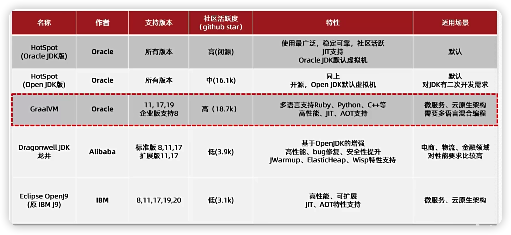


## Hospot发展历程

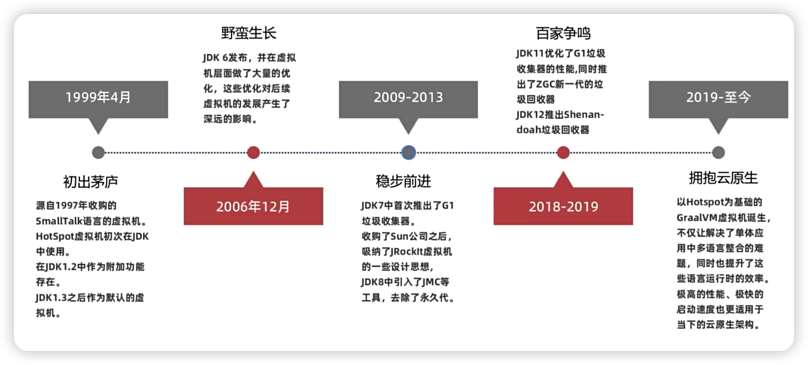

# 二、字节码文件详解

## Java虚拟机的组成

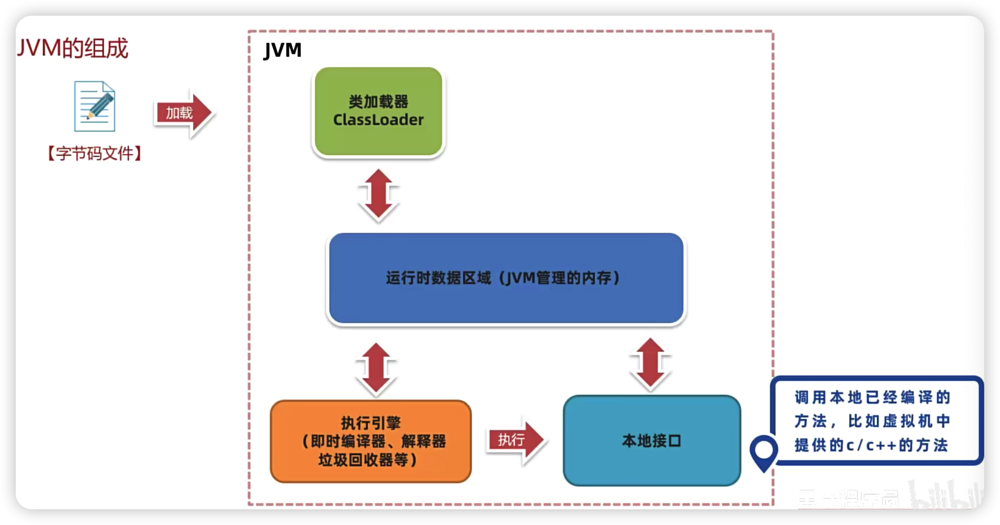


### 字节码文件的组成


> 字节码文件正确的打开姿势


notepad++

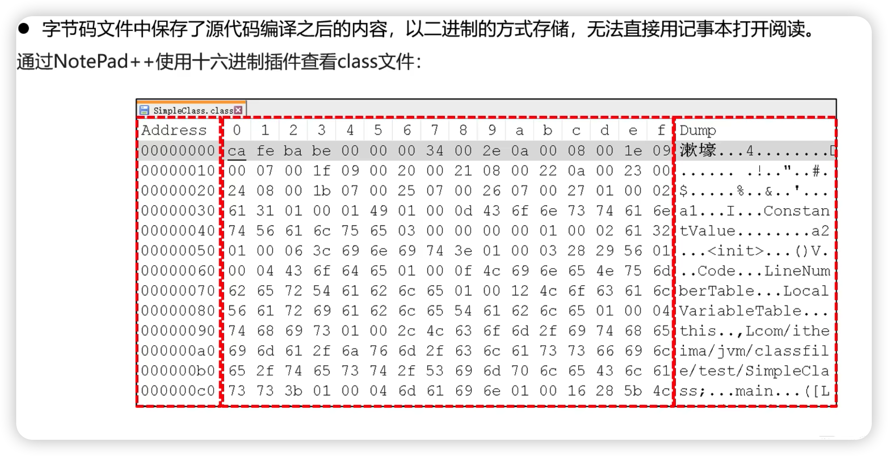

无法查看


jclasslib 专业字节码查看工具


字节码文件组成

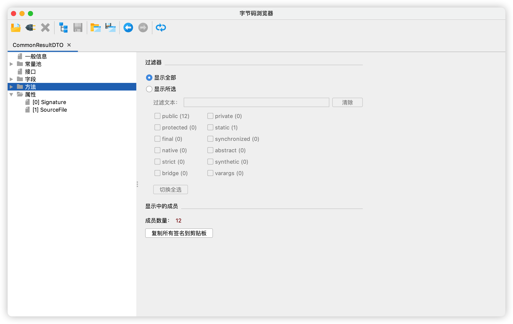


基础信息：魔数、字节码文件对应的Java版本号，访问标识（public final等等），父类和接口

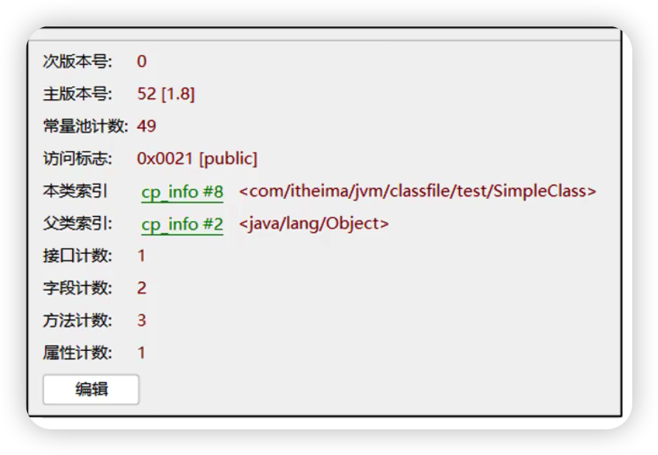

常量池： 保存字符集常量、类或接口名、字段名，主要在字节码指令中使用

字段：当前类或接口声明的字段信息

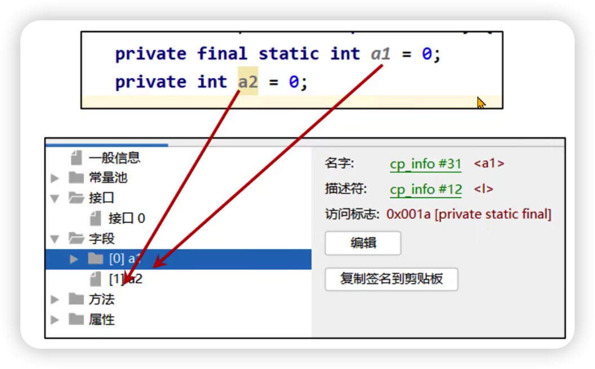

方法：当前类或接口声明的方法信息，字节码指令

属性：类的属性，比如源码的文件名内部类的列表等

> 字节码文件的组成

字节码文件的组成部分_Magic魔数

- 文件是无法通过文件扩展名来确定文件类型的，文件扩展名可以随意修改，不影响文件的内容。
- 软件使用文件的**头几个字节（文件头）去校验文件**的类型，如果软件不支持该种类型就会出错。

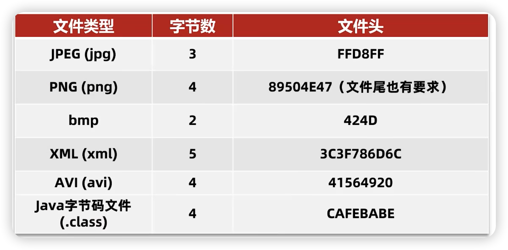

**字节码文件的组成部分-主副版本号**
主副版本号指的是编译字节码文件的JDK版本号，主版本号用来标识大版本号，JDK1.0-1.1使用了
45.0-45.3，JDK1.2是46之后每升级一个大版本就加1；副版本号是当主版本号相同时作为区分不同
版本的标识，一般只需要关心主版本号。

版本号的作用判断**当前字节码版本与运行JDK是否兼容**

1.2 版本计算方法：**主版本号 - 44 如：JDK8 = 52**

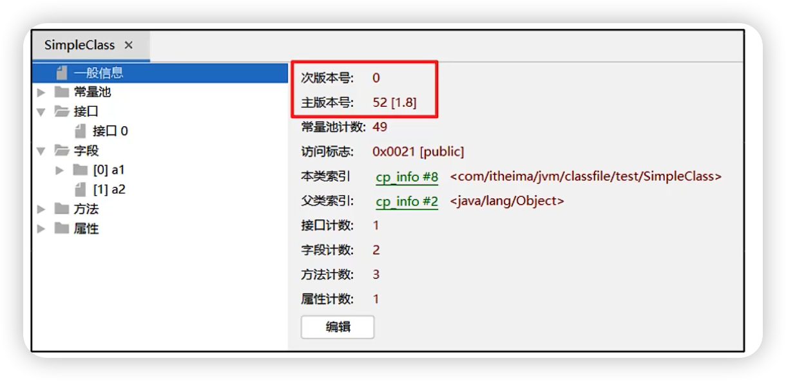


案例

解决以下由于主版本号不兼容导致的错误

类文件具有错误的版本 52.0，应为 50.0
请删除该文件或确保该文件位于正确的类路径子目录中。


两种方案：
1.升级JDK版本
2.将第三方依赖的版本号降低或者更换依赖，以满足JDK版本的要求


#### 基础信息

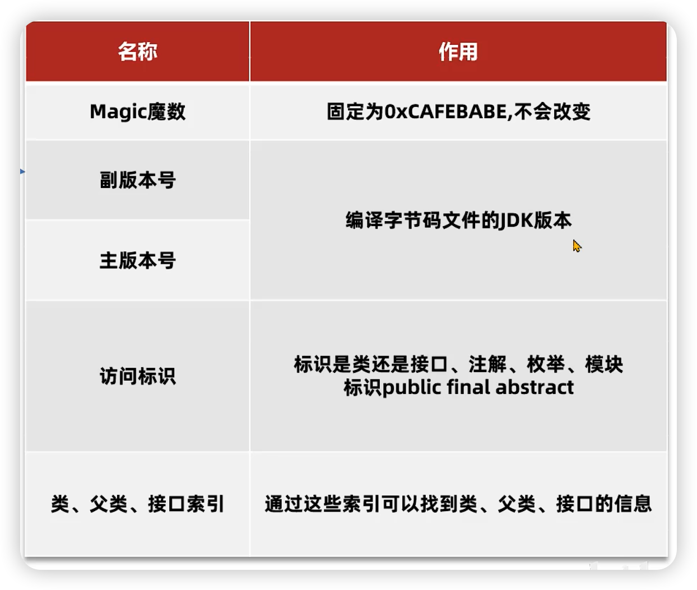

#### 常量池

避免相同内容重复定义，节省空间

- 常量池中的数据都有一个编号，编号从1开始。在字段或者字节码指令中通过编号可以快速的找到对应的数据。
- 字节码指令中通过编号引用到常量池的过程称之为**符号引用**。

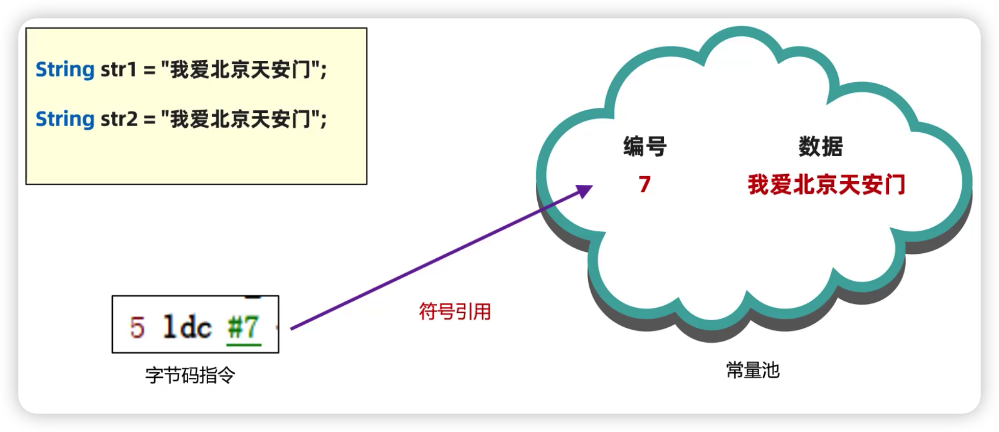

#### 方法

字节码指令位置在Code里面

**操作数栈**是临时存放数据的地方，局部变量表是存放方法中的局部变量的位置。

案例引入：

```java
public class Test {
    public static void main(String[] args) {
        int i = 0;
        int j = i + 1;
    }
}

//对应JVM字节码指令，需要结合下图进行理解
0 iconst_0 //将常量放入[操作数栈]中
1 istore_1 //操作数栈中取出放入到局部变量表1号位置
2 iload_1 //将局部变量表1 中的数据放入操作数栈
3 iconst_1  //将常量1放入操作数栈
4 iadd //操作数栈相加
5 istore_2 //从操作数栈中取出放入局部变量表2号位置
6 return
  
  
public class Test {
    public static void main(String[] args) {
        int i = 0;
        int j = i++;
    }
}

0 iconst_0
1 istore_1
2 iload_1
3 iinc 1 by 1 //将局部变量表位置1增加1，直接操作局部变量表相加
6 istore_1 //取出操作数栈中的值赋值到局部变量1，
7 return
//结果 i = 0
public class Test {
    public static void main(String[] args) {
        int i = 0;
        i = ++i;
    }
}
0 iconst_0
1 istore_1
2 iinc 1 by 1
5 iload_1
6 istore_1
7 return
//结果i = 1


```

第一个代码的理解图：

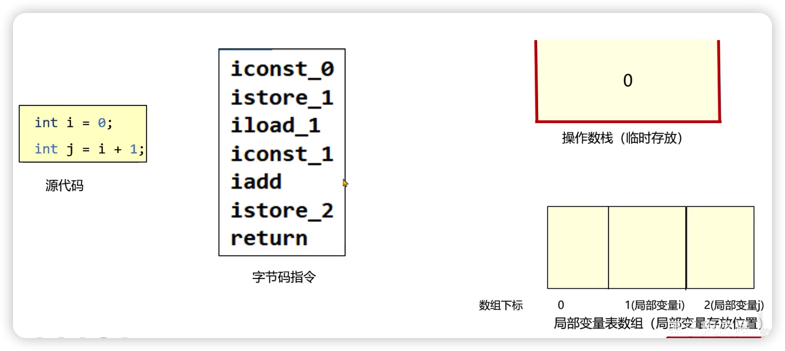


局部变量表对应jclasslib位置

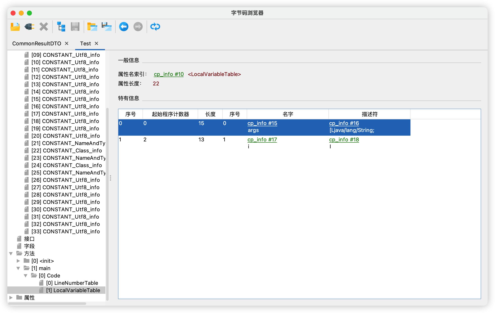


## 字节码常用工具

> 字节码常用工具

### Javap -v命令

jdk自带的工具，使用

```shell
# 解压jar包
jar -xvf 
```

### IDEA 插件 - jclasslib插件

### 阿里云-arthas

Arthas 是一款线上监控诊断产品，通过全局视角实时查看应用 **load、内存、gc、线程的状态信息**，并能在不修改应用代码的情况下，对业务问题进行诊断，大大提升线上问题排查效率。

特性

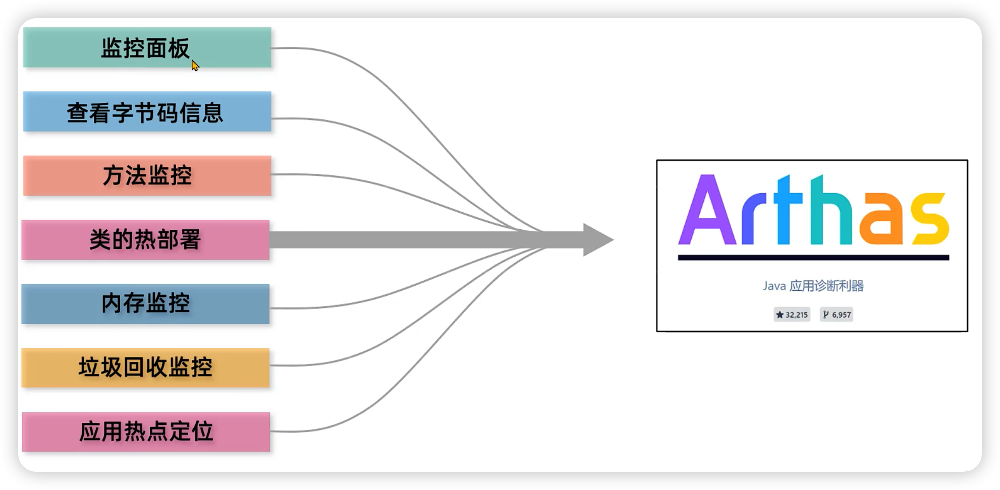

命令：

```shell
# 监控面板  2000ms 一次
dashboard  -i 2000 -n 1
# 导出已加载类的字节码到特定目录
dump -d /Users/momoc/Desktop/ com.ismartgo.wxaadmin.App
# 反编译已加载的类源码
jad com.ismartgo.wxaadmin.App
```

## 类的生命周期

描述一个类加载、使用、卸载的过程


### 生命周期概述

### 加载

1、是类的加载器根据类的全限定名通过不同渠道以二进制的方式获取字节码信息（**本地文件**、**动态代理生成**、**网络传输的类**）

2、加载完类后，java虚拟机会将字节码信息保存到方法区，生产一个**instanceKlass**对象，保存类的所有信息，包含特定功能比如多态

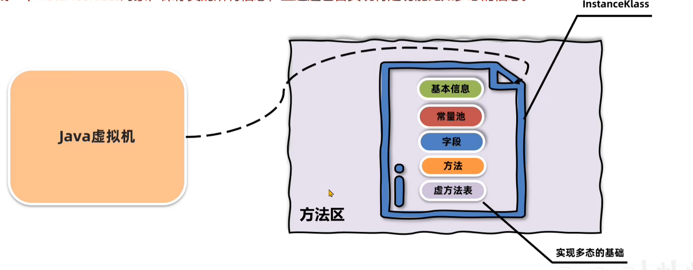

3、同时还会在堆中生成一份与方法区中数据类似的Java.lang.Class对象（在Java代码中获取类的信息以及存储静态字段数据，JDK8之后）

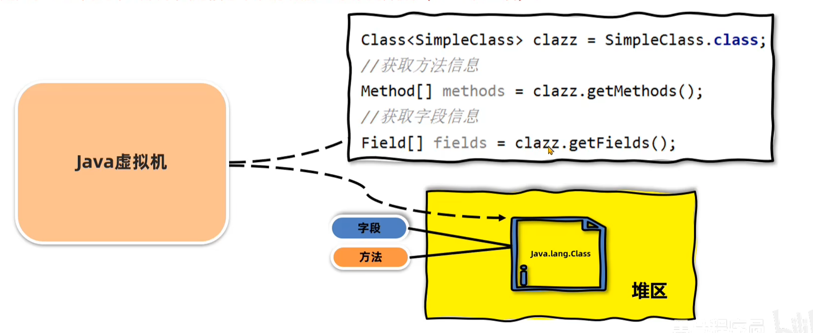

instancekclass对堆区的关联关系


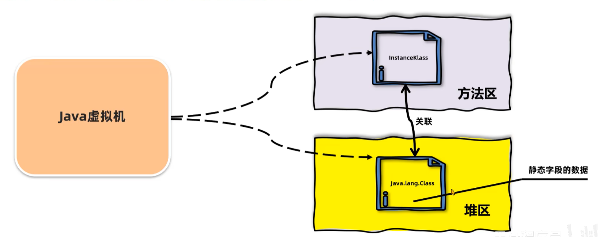

>  查看内存中的对象

推荐使用JDK自带的hsdb工具查看java虚拟机内存信息，JDK下lib文件 sa-jdi.jar

```shell
java -cp sa-jdi.jar sun.jvm.hotspot.HSDB
```


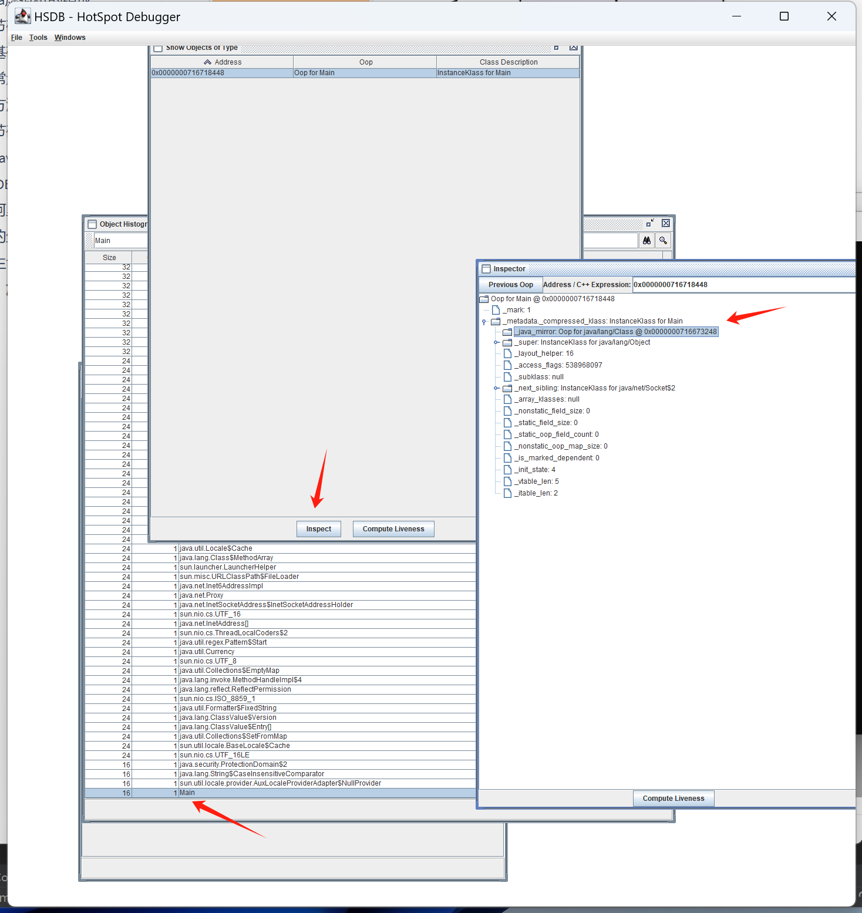


### 连接

> 验证

是否符合《java虚拟机规范》，四部分

1、文件格式检验，魔数 ，主次版本是否满足

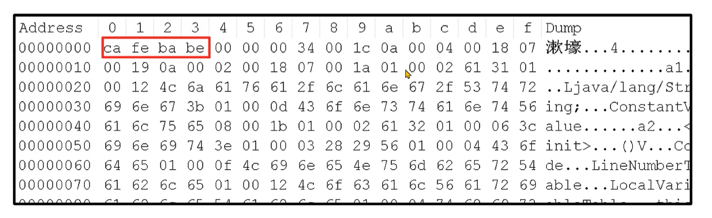

案例

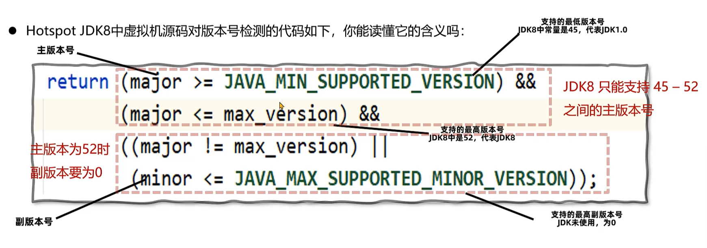


2、元信息验证，如类必须要有父类(super)

3、验证程序执行指令的语义，如果方法内的指令执行中跳转到不正确位置

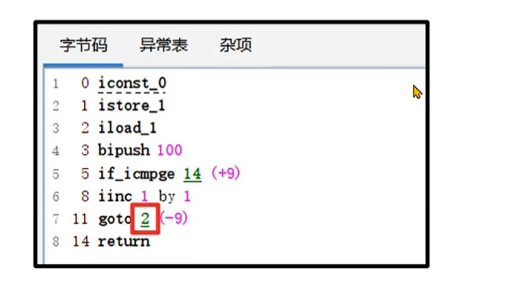


4、符号引用验证，如是否访问了其他类中的private的方法等

>  准备

**JDK8及之后版本**

给静态变量(static)分配内存并设置初始值，如public static int a = 1; 初始值为0，

final修饰的**基本数据**类型静态变量，准备阶段直接赋值为具体值

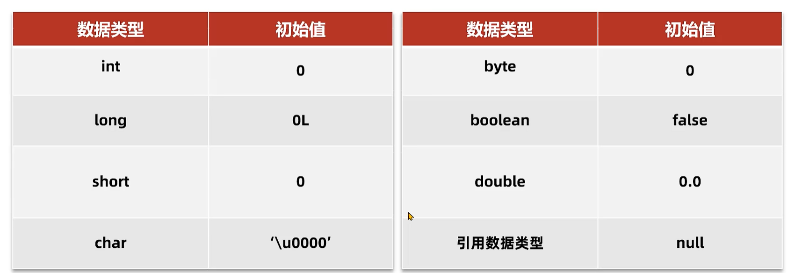


> 解析

将常量池中的符号引用替换成指向内存的直接引用

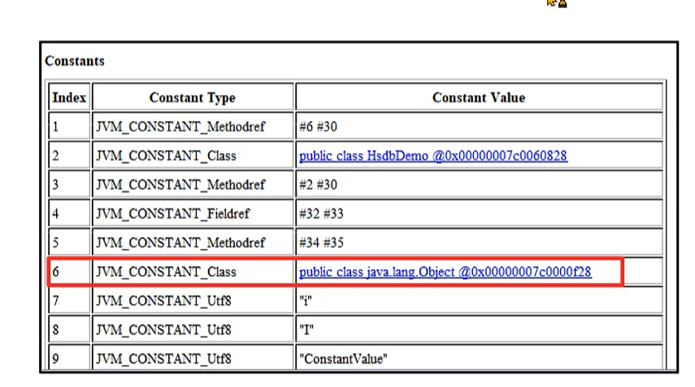


### 初始化

- 执行静态代码块中的代码，并为静态变量赋值
- 执行字节码文件中clinit部分的字节码指令


案例

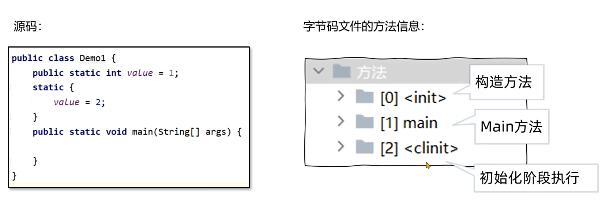


操作过程

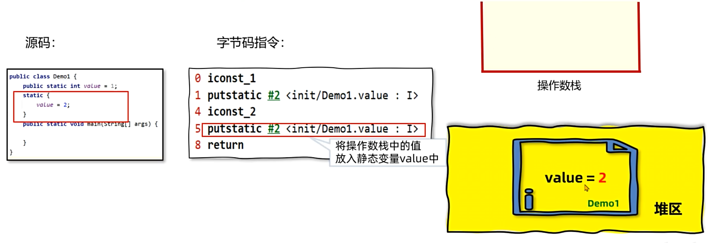

对调后

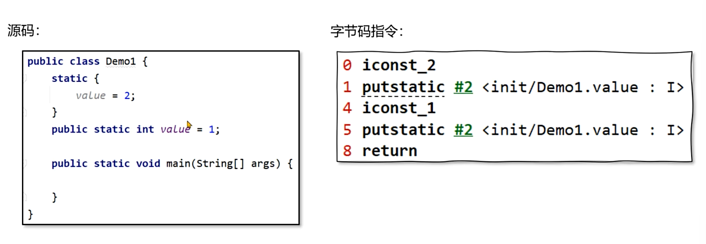

结论：clinit方法中的执行顺序与Java中编写顺序是一致


导致类的初始化,clinit方法

1. 访问一个类的静态变量或者静态方法， final不会触发初始
2. 调用Class.forName(String className)
3. new一个该类的对象
4. 执行Main方法的当前类

```shell
# 打印出加载在并初始化的类
-XX:+TraceClassLoading
```

不会导致类的初始化情况，clinit方法

1. 无静态代码块且无静态变量语句
2. 有静态变量的声明，但是没有赋值语句
3. 静态变量定义使用final，会在准备阶段初始


面试题

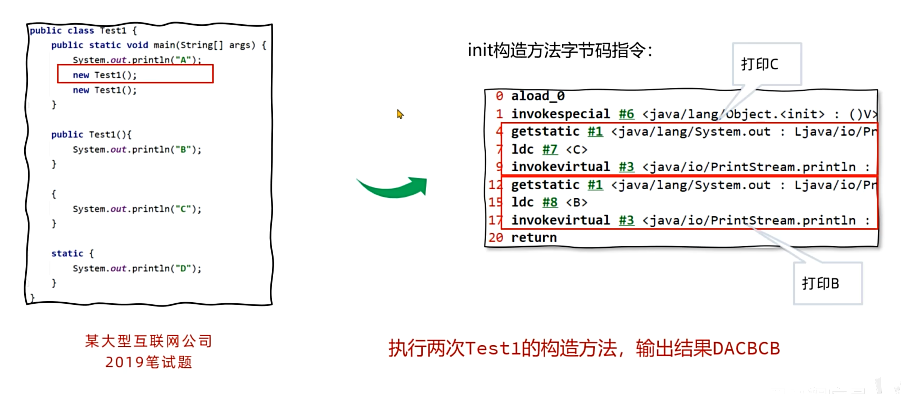

clinit方法，有父类情况

1、子类的初始化clinit调用之前，先初始化父类clinit方法

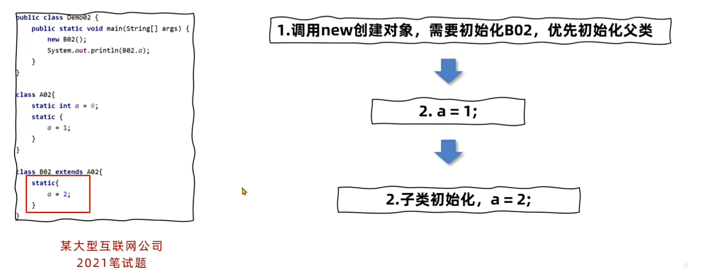

2、直接访问父类的静态变量，不会触发子类的初始化

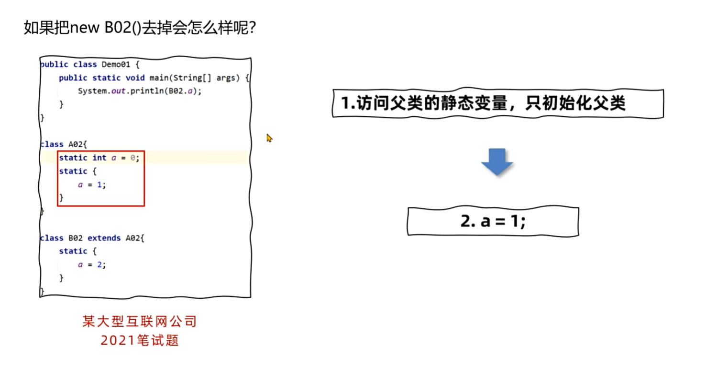

注：类的clinit方法仅初始化一次

### 使用： new

### 卸载：垃圾回收篇中讲解


## 类加载器

- Java虚拟机提供给应用程序去实现获取类和接口字节码数据的技术
- 只参与加载过程中的字节码获取并加载到内存这一部分

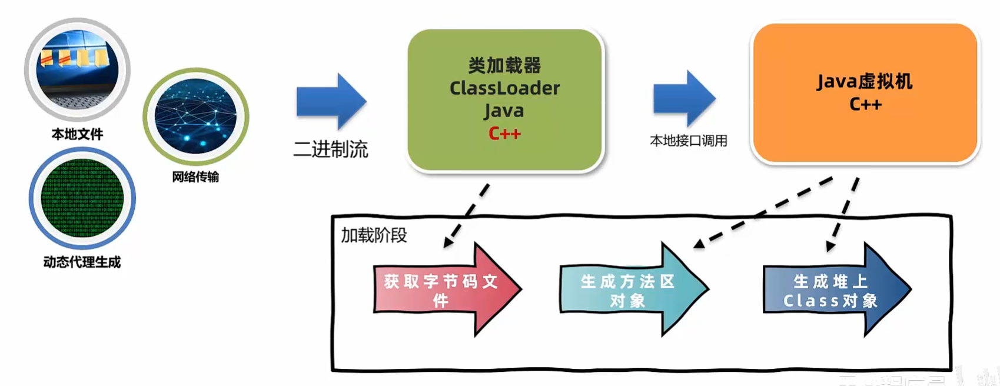

>  使用场景


### 类加载器的分类


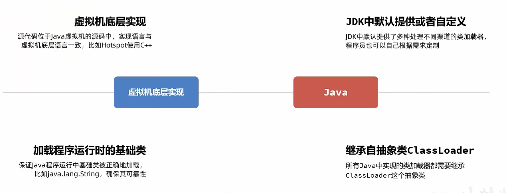


> JDK8及之前版本默认的类加载器

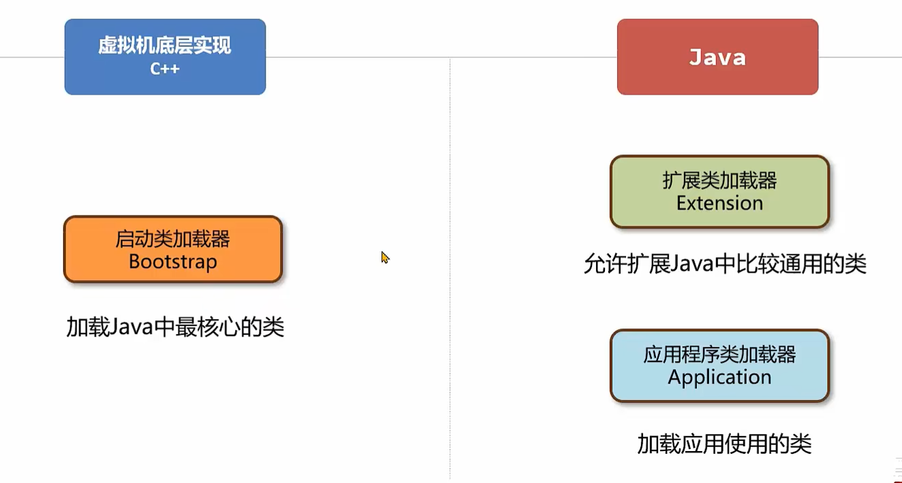

验证，使用Arthas

```shell
# 显示加载器
[arthas@15024]$ classloader
 name                                       numberOfInstances  loadedCountTotal
 # 加载核心类，如String
 BootstrapClassLoader                       1                  2771
 com.taobao.arthas.agent.ArthasClassloader  1                  1351
 # 加载通用的类
 sun.misc.Launcher$ExtClassLoader           1                  66
 #  提升反射性能的加载器
 sun.reflect.DelegatingClassLoader          15                 15
 # 加载第三方和自己编写的的类
 sun.misc.Launcher$AppClassLoader           1                  4
Affect(row-cnt:5) cost in 2 ms.
```

> 启动类加载器 BootstrapClassLoader

1. 由Hotspot提供，使用C++编写
2. 默认加载java安装目录/jre/lib，比如rt.jar，tools.jar,resources.jar等

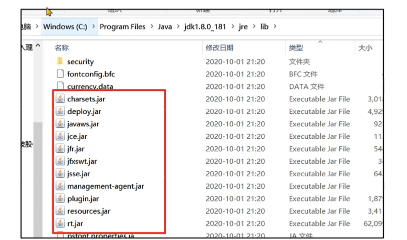


```java
//不允许通过Java代码获取Bootstrap ClassLoader
ClassLoader classLoader = String.class.getClassLoader();
//输出Null
System.out.println(classLoader);
```

使用Arthas验证

```shell
[arthas@20156]$ sc -d java.lang.String
 class-info        java.lang.String
 code-source
 name              java.lang.String
 isInterface       false
 isAnnotation      false
 isEnum            false
 isAnonymousClass  false
 isArray           false
 isLocalClass      false
 isMemberClass     false
 isPrimitive       false
 isSynthetic       false
 simple-name       String
 modifier          final,public
 annotation
 interfaces        java.io.Serializable,java.lang.Comparable,java.lang.CharSequence
 super-class       +-java.lang.Object
 # 启动类加载器
 class-loader
 classLoaderHash   null
```


> 扩展jar包方式

1. 放入jre/lib下进行扩展,不推荐，有校验机制
2. 使用参数进行扩展,- -Xbootclasspath/a:E:/devTools/arthas-bin/arthas-boot.jar


> 扩展类加载器

默认加载Java安装目录/jre/lib/ext下的类文件、

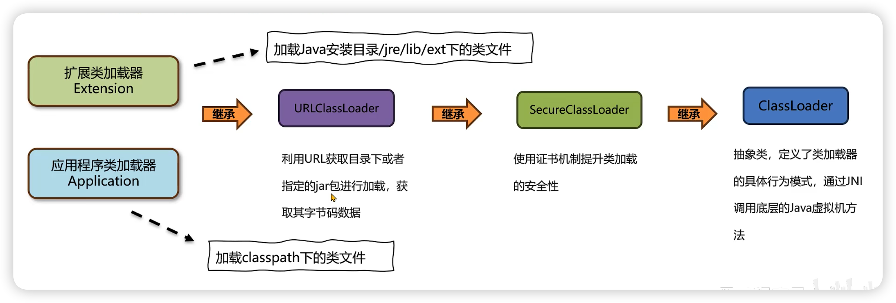


扩展方式：

- 放入/jre/lib/ext下进行扩展
- 使用参数进行扩展, -Djava.ext.dirs=jdk/jre/ext;path/myjar


> arthas 查看类的加载列表

```shell
# 查看当前虚拟机的类加载器
[arthas@6385]$ classloader -l
 name                                                loadedCount  hash      parent                                                  
 BootstrapClassLoader                                2484         null      null                                                    
 com.taobao.arthas.agent.ArthasClassloader@4caa1fea  1374         4caa1fea  sun.misc.Launcher$ExtClassLoader@ca316bd                
 sun.misc.Launcher$AppClassLoader@18b4aac2           226          18b4aac2  sun.misc.Launcher$ExtClassLoader@ca316bd                
 sun.misc.Launcher$ExtClassLoader@ca316bd            0            ca316bd   null                                                    
Affect(row-cnt:4) cost in 7 ms.
[arthas@6385]$ classloader -c 18b4aac2
file:/Users/momoc/Library/Java/JavaVirtualMachines/corretto-1.8.0_292/Contents/Home/jre/lib/charsets.jar                            
file:/Users/momoc/Library/Java/JavaVirtualMachines/corretto-1.8.0_292/Contents/Home/jre/lib/ext/cldrdata.jar                        
....
```


### 双亲委派机制

解决一个类到底由谁加载的问题；保证类加载的安全性，包含核心类库，比如java.lang.String；避免重复加载

含义：类加载器接受到加载类的任务是，自底向上查找是否加载过（父类是否已加载，避免重复加载），再由顶向

下进行加载。


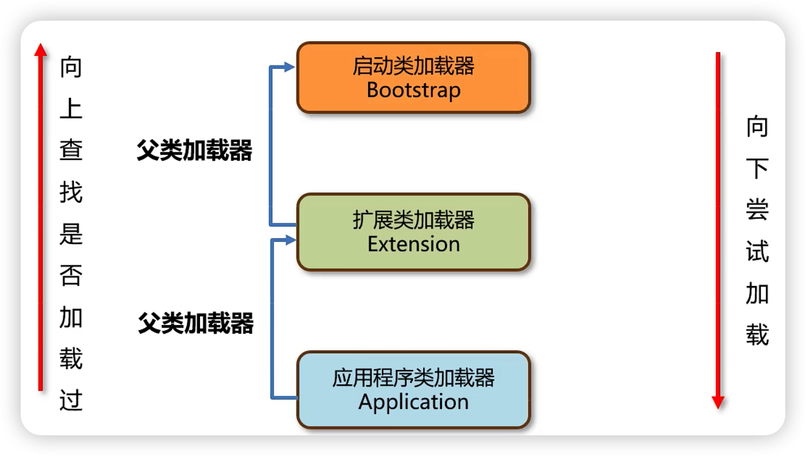

问题：

1、如果一个类重复出现在三个类加载器的加载位置，应该由谁来加载？

启动类加载器加载，根据双亲委派机制，它的优先级是最高的。

2、Java.lang.String能覆盖么？

不能，会返回启动类加载器加载在rt.jar包中的String类


> Java代码主动去加载一个类

方式1：使用Class.forName方法，使用当前类的类加载器去加载指定的类。

方式2：获取到类加载器，通过类加载器的loadClass方法指定某个类加载器加载。


> 父类加载器小细节

应用程序类加载器的parent父类加载器是扩展类加载器，而扩展类加载器的parent是空，但是在代码逻辑上，扩展类加载器依然会把启动类加载器当成父类加载器处理。
启动类加载器使用C++编写，没有父类加载器。

```java
private static native void registerNatives();
    static {
        registerNatives();
    }

    // The parent class loader for delegation
    // Note: VM hardcoded the offset of this field, thus all new fields
    // must be added *after* it.
// 父类加载器
    private final ClassLoader parent;

```


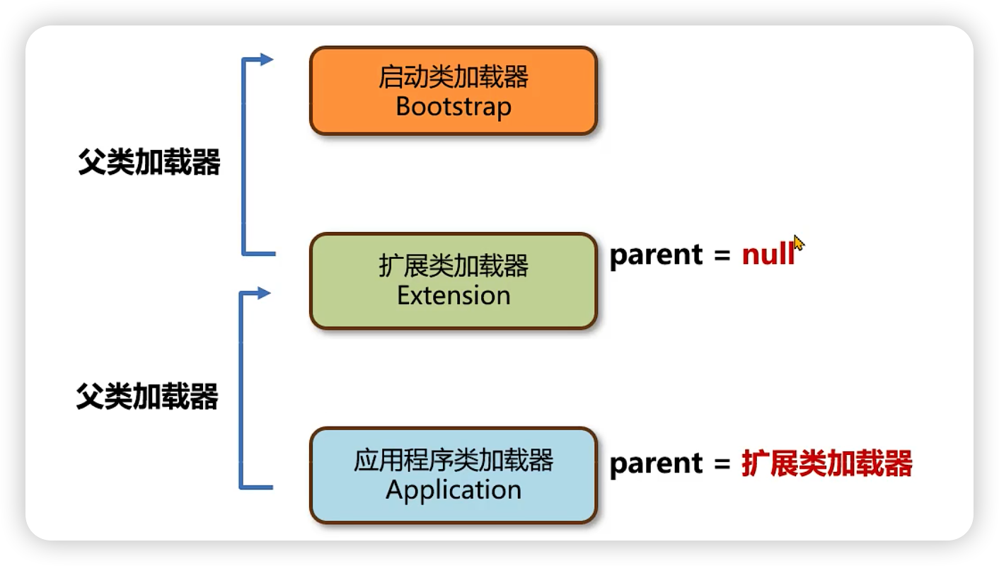


验证

```shell
#  获取类的加载器父子关系
[arthas@6385]$ classloader -t
+-BootstrapClassLoader                                                                                                              
+-sun.misc.Launcher$ExtClassLoader@ca316bd                                                                                          
  +-com.taobao.arthas.agent.ArthasClassloader@4caa1fea                                                                              
  +-sun.misc.Launcher$AppClassLoader@18b4aac2                                                                                       
Affect(row-cnt:4) cost in 5 ms.
```


面试题：类的双亲委派机制是什么？

1、当一个类加载器去加载某个类的时候，会自底向上查找是否加载过，如果加载过就直接返回，如果一直到最顶层的类加载器都没有加载，再由顶向下进行加载。

2、应用程序类加载器的父类加载器是扩展类加载器，扩展类加载器的父类加载器是启动类加载器。

3、双亲委派机制的好处有两点：第一是避免恶意代码替换JDK中的核心类库，比如java.lang.String，确保核心类库的完整性和安全性。第二是避免一个类重复地被加载。

4、classNotFoundException

> 双亲委派机制核心代码

```java
    protected Class<?> loadClass(String name, boolean resolve)
        throws ClassNotFoundException
    {
        synchronized (getClassLoadingLock(name)) {
            // First, check if the class has already been loaded
            Class<?> c = findLoadedClass(name);
            if (c == null) {
                long t0 = System.nanoTime();
                try {
                    if (parent != null) {
                      // 父类加载
                        c = parent.loadClass(name, false);
                    } else {
                      //启动类加载
                        c = findBootstrapClassOrNull(name);
                    }
                } catch (ClassNotFoundException e) {
                    // ClassNotFoundException thrown if class not found
                    // from the non-null parent class loader
                }

              //父类加载不到的情况
                if (c == null) {
                    // If still not found, then invoke findClass in order
                    // to find the class.
                    long t1 = System.nanoTime();
                    c = findClass(name);

                    // this is the defining class loader; record the stats
                    sun.misc.PerfCounter.getParentDelegationTime().addTime(t1 - t0);
                    sun.misc.PerfCounter.getFindClassTime().addElapsedTimeFrom(t1);
                    sun.misc.PerfCounter.getFindClasses().increment();
                }
            }
            if (resolve) {
                resolveClass(c);
            }
            return c;
        }
    }	
```


### 打破双亲委派机制


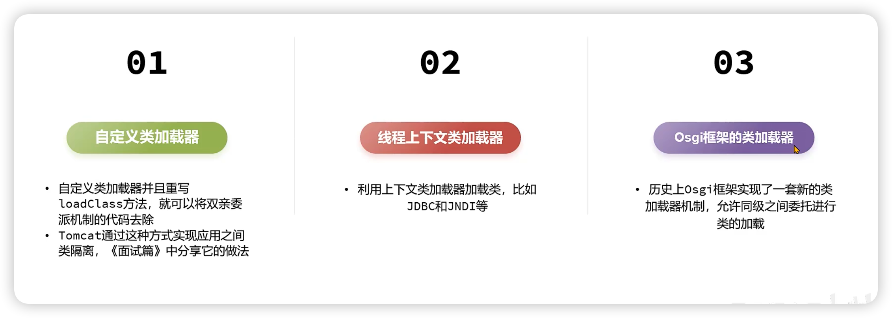


tomcat，每个应用都有自己的独立类加载器，实现应用之间的隔离


> 第一种方法：自定义类加载器


```java
package classloader.broken;//package com.itheima.jvm.chapter02.classloader.broken;

import org.apache.commons.io.IOUtils;

import java.io.File;
import java.io.FileInputStream;
import java.io.IOException;
import java.io.InputStream;
import java.nio.charset.StandardCharsets;
import java.security.ProtectionDomain;
import java.util.regex.Matcher;

/**
 * 打破双亲委派机制 - 自定义类加载器
 */

public class BreakClassLoader1 extends ClassLoader {

    private String basePath;
    private final static String FILE_EXT = ".class";

    public void setBasePath(String basePath) {
        this.basePath = basePath;
    }

    private byte[] loadClassData(String name)  {
        try {
            String tempName = name.replaceAll("\\.", Matcher.quoteReplacement(File.separator));
            FileInputStream fis = new FileInputStream(basePath + tempName + FILE_EXT);
            try {
                return IOUtils.toByteArray(fis);
            } finally {
                IOUtils.closeQuietly(fis);
            }

        } catch (Exception e) {
            System.out.println("自定义类加载器加载失败，错误原因：" + e.getMessage());
            return null;
        }
    }

    @Override
    public Class<?> loadClass(String name) throws ClassNotFoundException {
      //保证java源的加载
        if(name.startsWith("java.")){
            return super.loadClass(name);
        }
        byte[] data = loadClassData(name);
        return defineClass(name, data, 0, data.length);
    }

    public static void main(String[] args) throws ClassNotFoundException, InstantiationException, IllegalAccessException, IOException {
        BreakClassLoader1 classLoader1 = new BreakClassLoader1();
        classLoader1.setBasePath("D:\\lib\\");

        Class<?> clazz1 = classLoader1.loadClass("com.itheima.my.A");

        BreakClassLoader1 classLoader2 = new BreakClassLoader1();
        classLoader2.setBasePath("D:\\lib\\");

        Class<?> clazz2 = classLoader2.loadClass("com.itheima.my.A");

        System.out.println(clazz1 == clazz2);

        Thread.currentThread().setContextClassLoader(classLoader1);

        System.out.println(Thread.currentThread().getContextClassLoader());

        System.in.read();
     }
}

```

默认父类加载器,为AppClassLoader，相关源码

```java
    protected ClassLoader() {
        this(checkCreateClassLoader(), getSystemClassLoader());
    }
```


两个自定义类加载器加载相同限定类名的类，不会冲突，只有**相同类加载器 + 相同限定类名**才会认为为一个类。

arthas 验证命令： sc -d

> 第二种方法： 线程上下文类加载器

JDBC案例 存疑

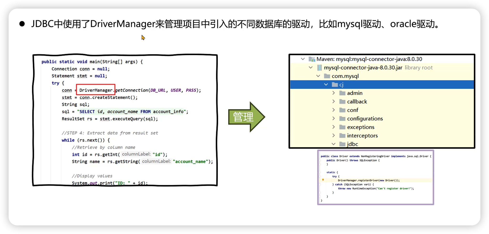


DriverManager属于rt.jar是启动类加载器加载的。而用户jar包中的驱动需要由应用类加载器加载，这就违反了双亲委派机制。

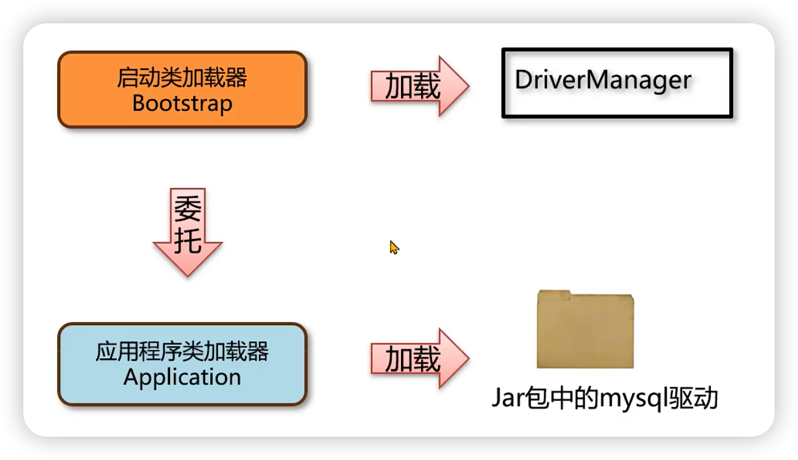


DriverManager使用SPI机制，加载最终jar包对应的驱动类

SPI机制，service Provider Interface，是JDK内置的一种服务提供发现机制

工作原理：

1.在ClassPath路径下的META-INF/services文件夹中，以接口的全限定名来命名文件名，对应的文件里面写该接口的实现。

2.使用ServiceLoader加载实现类

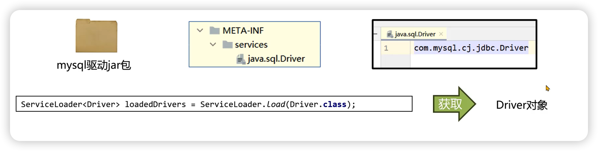


SPI是如何获取到应用程序类加载器的？

```java
//线程创建时默认的类加载器，为AppClassLoader
Thread.currentThread().getContextClassLoader();
```

总结

1、启动类加载器加载DriverManager。
2、在初始化DriverManager时，通过SPI机制加载jar包中的myql驱动。
3、SPI中利用了线程上下文类加载器（应用程序类加载器）去加载类并创建对象。

这种由启动类加载器加载的类，委派应用程序类加载器去加载类的方式，打破了双亲委派机制。

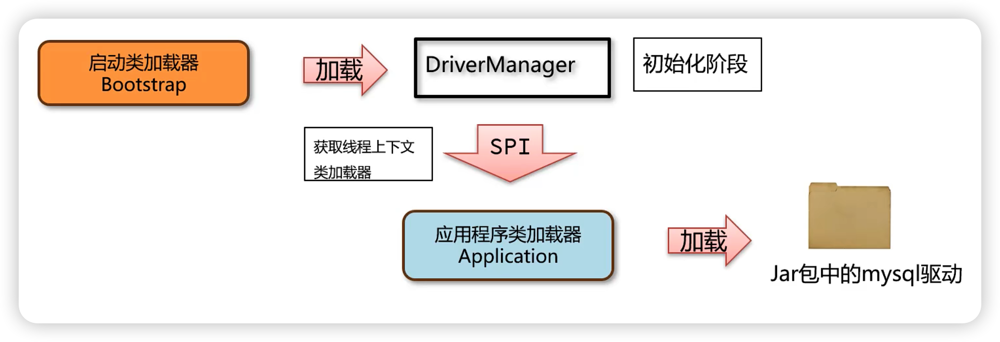


JDBC案例中真的打破了双亲委派机制吗？

整个流程视角：这种由启动类加载器加载的类，委派应用程序类加载器去加载类的方式，打破了双亲委派机制

类加载视角：JDBC只是在DriverManager加载完之后，通过初始化阶段触发了驱动类的加载，类的加载依然遵循双亲委派机制


> 第三种方法： OSGi模块化

- 历史上，OSGi模块化框架。它存在同级之间的类加载器的委托加载。OSG还使用类加载器实现了热部署的
  功能。
- 热部署指的是在服务不停止的情况下，动态地更新字节码文件到内存中。

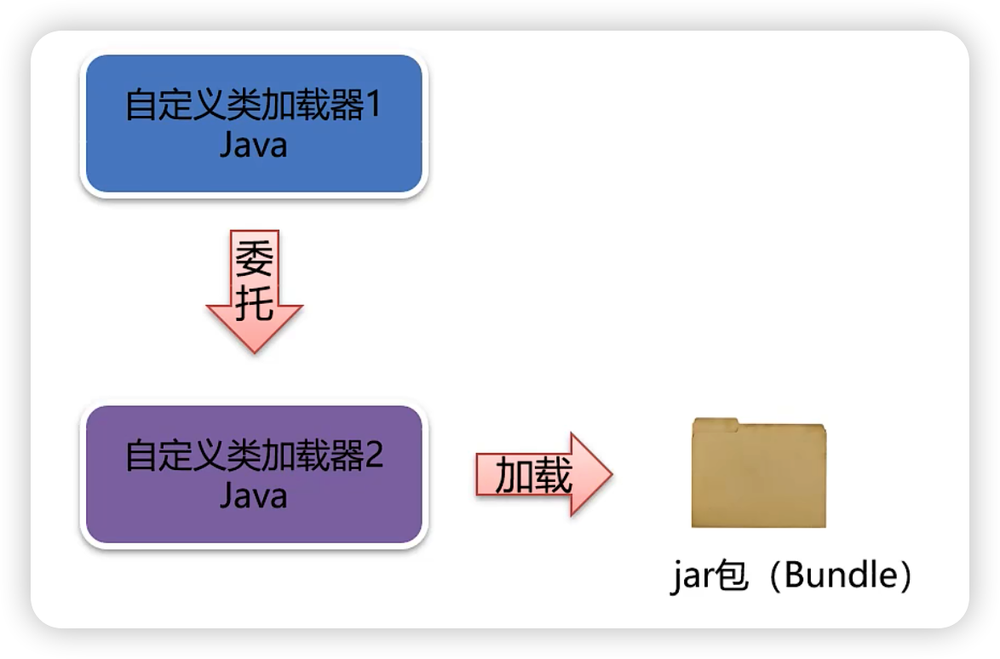


> arthas 热更案例

```shell
# 反编译
[arthas@73971]$ jad --source-only com.ismartgo.brandwxa.controller.ul.UlAppSvShopController > ./UlAppSvShopController.java

# 重新编译新代码，
[arthas@73971]$ mc  -d /Users/momoc/Desktop/yj /Users/momoc/Desktop/yj/UlAppSvShopController.java 
Memory compiler output:
/Users/momoc/Desktop/yj/com/ismartgo/brandwxa/controller/ul/UlAppSvShopController.class
Affect(row-cnt:1) cost in 1349 ms.
# 查看当前类加载器
[arthas@73971]$ classloader -l
 name                                                loadedCount  hash      parent                                                
 BootstrapClassLoader                                3447         null      null                                                  
 com.taobao.arthas.agent.ArthasClassloader@20671dbd  2103         20671dbd  sun.misc.Launcher$ExtClassLoader@3c09711b             
 lombok.launch.ShadowClassLoader@5541cd0f            242          5541cd0f  sun.misc.Launcher$AppClassLoader@18b4aac2             
 sun.misc.Launcher$AppClassLoader@18b4aac2           8548         18b4aac2  sun.misc.Launcher$ExtClassLoader@3c09711b             
 sun.misc.Launcher$ExtClassLoader@3c09711b           88           3c09711b  null                                                  
Affect(row-cnt:5) cost in 9 ms.
# 如果无法编译，则需要指定类加载器
mc -c 18b4aac2 /Users/momoc/Desktop/yj/UlAppSvShopController.java -d /Users/momoc/Desktop/yj/UlAppSvShopController.class
# 热更新文件
[arthas@73971]$ retransform /Users/momoc/Desktop/yj/com/ismartgo/brandwxa/controller/ul/UlAppSvShopController.class
retransform success, size: 1, classes:
com.ismartgo.brandwxa.controller.ul.UlAppSvShopController
```


注意：

1、程序重启之后，字节码文件会恢复，除非将class文件放入jar包中进行更新。
2、使用retransform不能添加方法或者字段，也不能更新正在执行中的方法。


### JDK9之后的类加载器


> JDK8及之前的版本


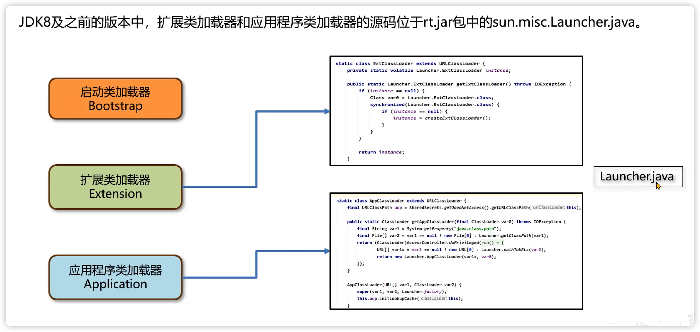

> JDK8之后的类加载器

由于JDK9引入了module的概念，类加载器在设计上发生了很多变化。

1、启动类加载器使用Java编写，位于jdk.internalloader.ClassLoaders类中。

Java中的BootClassLoader继承自BuiltinClassLoader实现从模块中找到要加载的字节码资源文件。
启动类加载器依然无法通过java代码获取到，返回的仍然是null，保持了统一。

2、扩展类加载器被替换成了平台类加载器 （Platform Class Loader）
平台类加载器遵循模块化方式加载字节码文件，所以继承关系从URLClassLoader变成了
BuiltinClassLoader, BuiltinClassLoader实现了从模块中加载字节码文件。平台类加载器的存在更多的是为了与老版本的设计方案兼容，自身没有特殊的逻辑。


## 运行时数据区

运行java程序过程中的管理的内存区域。

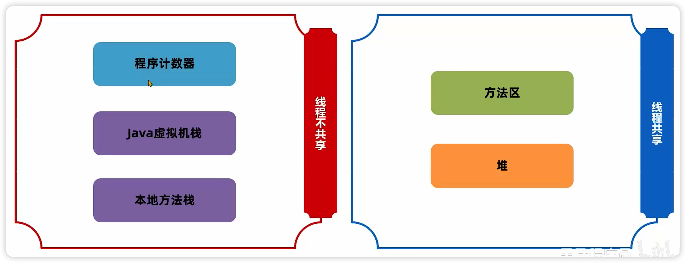


面试题

Java的内存分成几部分？

那些部分内存会溢出？

JDK7和8在内存结构上的区别是什么？


内存调优学习路线

1、了解运行时内存结构

了解JVM运行过程中每一部分的内存结构以及哪些部分容易出现内存溢出

2、掌握内存问题的产生原因
学习代码中常见的几种内存泄漏、性能问题的常见原因

3、掌握内存调优的基本方法
学习内存泄漏、性能问题等常见JVM问题的常规解决方案


### 程序计数器

也叫PC寄存器，每个线程会通过程序计数器记录当前要执行的的字节码指令的地址。

作用：

- 在加载阶段，虚拟机将字节码文件中的指令读取到内存之后，会将原文件中的偏移量转换成内存地址。每一条字节码指令都会拥有一个**内存地址**。如0x000001f248c072c0

- 程序计数器可以控制程序指令的进行，实现**分支、跳转、异常**等逻辑。
- 在多线程执行情况下，Java虚拟机需要通过程序计数器记录cPU切换前解释执行到那一句指令并继续解释运行。

程序计算器案例

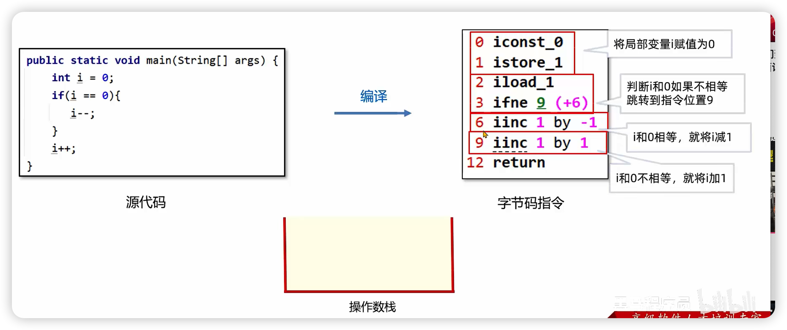


问题：程序计数器在运行中会出现内存溢出吗？

内存溢出：指的是程序在使用某一块内存区域时，存放的数据需要占用的内存大小超过了虚拟机能提供的内存上限。

每个线程只存储一个固定长度的内存地址，程序计数器是不会发生内存溢出的。


### java虚拟机栈（Java Virtual Machine Stack）

- 采用栈的数据结构来**管理方法调用中的基本数据**，先进后出（First In Last Out），每一个**方法的调用使用**一个栈帧（Stack Frame） 来保存。

- 执行该方法就入栈，执行完后出栈。
- Java虚拟机栈随着线程的创建而创建，而回收则会在线程的由于方法可能会在不同线程中执行，每个线程都有自己的虚拟机栈。

> 栈帧组成


栈帧大小：局部变量表的大小 + 操作数栈大小 + 帧数据


1、局部变量表：局部变量表的作用是在运行过程中存放所有的局部变量

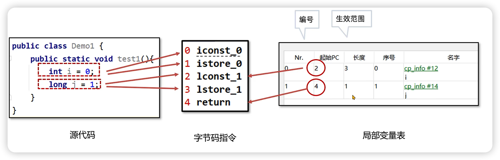


栈帧中的局部变量表是一个数组，数组中每一个位置称之为槽（slot），long和double类型占用两个槽，其他类型占用一个槽。

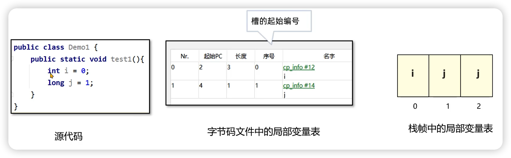


局部变量表保存的内容有：实例方法的this对象（序号为0)，方法的参数，方法体中声明的局部变量。

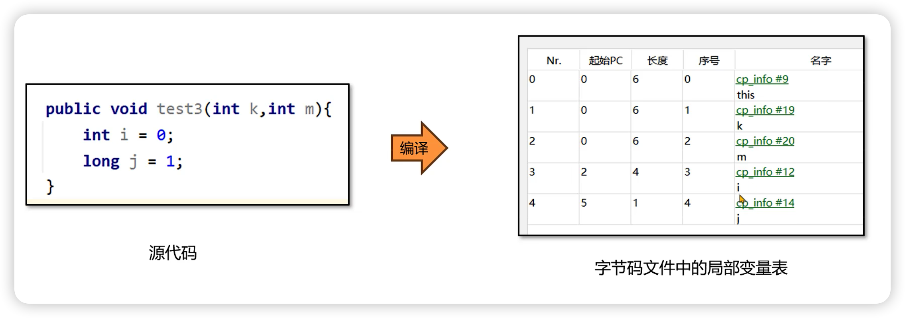

为了节省空间，局部变量表中的槽是可以复用的，一旦某个局部变量不再生效，当前槽就可以再次被使用。

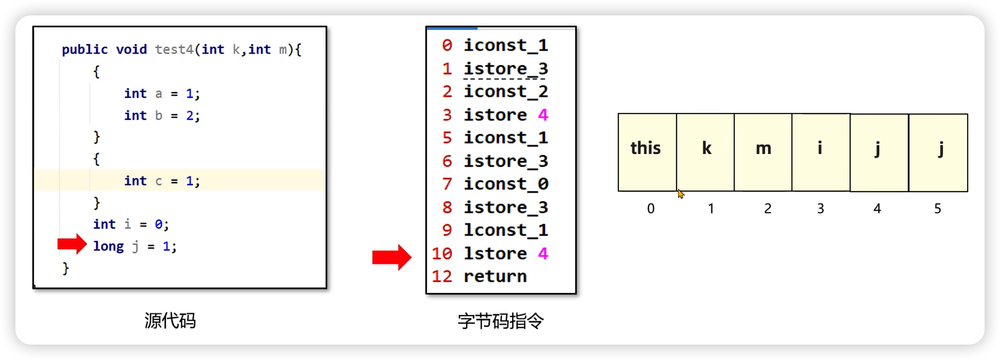

总结：

- 局部变量表可以存放this对象（序号0）、方法参数、方法内的定义的变量
- 一个槽四个字节long、double 占两个槽
- 局部变量不生效时，槽可以复用

2、操作数栈：是栈帧中虚拟机在执行指令过程中用来存放临时数据的一块区域

- 栈帧中虚拟机在执行指令过程中用来存放中间数据的一块区域。他是一种栈式的数据结构，如果一条指令将一个值压入操作数栈，则后面的指令可以弹出并使用该值。

- 在编译期就可以确定操作数栈的最大深度，从而在执行时正确的分配内存大小。

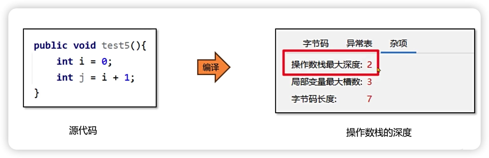

最大深度：操作数栈有多少个数，比如i + 1 需要在操作数栈操作0 + 1。深度为2

3、帧数据：主要包含动态链接、方法出口、异常表的引用

- 当前类的字节码指令引用了其他类的属性或者方法时，需要将**符号引用（编号）转换成对应的运行时常量池中的內存地址**。
- 动态链接就保存了编号到运行时常量池的内存地址的映射关系。

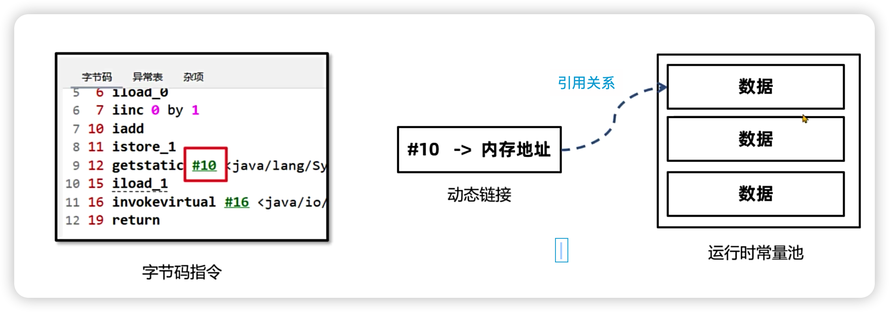


方法出口：是方法在正确或者异常结束时，当前栈帧会被弹出，同时程序计数器应该指向上一个栈帧中的下一条指令的地址。所以在当前栈帧中，需要存储此方法出口的地址。


异常表：存放代码中异常的处理信息，包含了异常捕获的生效范围以及异常发生后跳转到的字节码指令位置。

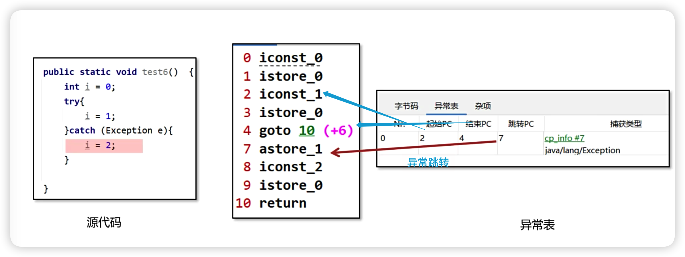


>  栈内存


栈溢出： 栈帧过多，占用内存超过栈内存可以分配的最大大小就会出现內存溢出，也就是调用深度过深。


> 栈内存的默认大小

如果我们不指定栈的大小，JVM 将创建一个具有默认大小的栈。大小取决于操作系统和计算机的体系结构。

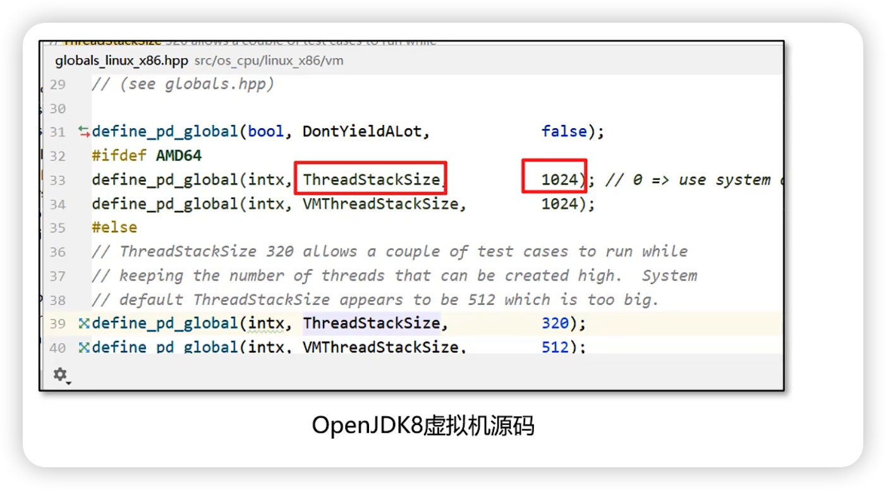

linux： X86（64位）1M，PPC：2M

BSD： 64位 2M

solaris： 64位 1M

windwos：操作系统默认值

> 设置栈内存大小

- 要修改Java虚拟机栈的大小，可以使用虚拟机参数-XSs。
- 语法：-Xss栈大小或-XX:ThreadStackSzie=1024
- 单位：字节（默认，必须是 1024 的倍数）、K或者K（KB）、m或者M（MB）、g或者G（GB）

注意事项

- Hotspot 对栈大小的最大最小值有要求，windows（64）下JDK8 Min:180k,Max:1024m

- 局部变量过多也会影响栈内存的大小


### 本地方法栈

- Java虚拟机栈存储了Java方法调用时的栈帧，而本地方法栈存储的是native本地方法的栈帧。
- 在**Hotspot**虚拟机中，Java虚拟机栈和本地方法栈实现上使用了同一个栈空间。
- 本地方法栈会在栈内存上生成一个栈帧，临时保存方法的参数同时方便出现异常时也把本地方法的栈信息打印出来。

### 堆

- 创建出来的对象都存在于堆上。
- 栈上的局部变量表中，可以存放堆上对象的引用。
- 静态变量也可以存放堆对象的引用，通过静态变量就可以实现对象在线程之间共享。

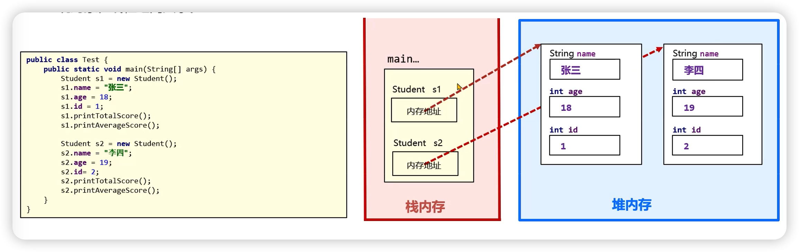


堆内存溢出异常：java.lang.OutOfMemoryError

堆空间有三个需要关注的值，used total max。
used指的是当前已使用的堆内存，total是java虚拟机已经分配的可用堆内存，max是java虚拟机可以分配的最大内存。

arthas中的对内存相关功能

- 堆内存used total max三个值可以通过dashboard命令看到。

- 手动指定刷新频率（不指定默认5秒一次）：dashboard -i 刷新频率（毫秒）或者memory

​

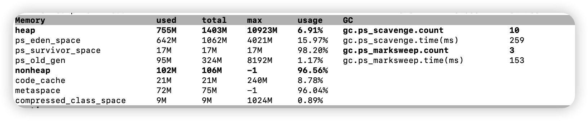


total不够用会自动扩展，但不超过max。

当used=max=total，堆内存是否溢出了？不是，堆内存溢出的判断条件比较复杂，在下一章《垃圾回收器》中会详细介绍。


> 堆大小

默认值：max=1/4,total=1/64

```shell
# 设置堆大小
-Xms6G
-Xms1024M
-Xmx1024M

```


为什么arthas中显示的heap堆大小与设置的值不一样呢？

arthas中的heap堆内存使用了**JMX**技术中内存获取方式，这种方式与垃圾回收器有关，计算的是可以分配对象的内存，而不是整个内存。

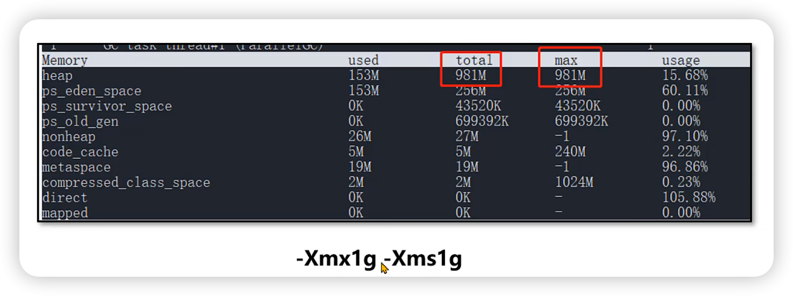

建议设置-Xmx=-Xms，程序启动后可使用总内存就是最大内存，无需向JVM申请。


### 方法区（Method Area）

存放基础信息位置，线程共享，含三大部分

1、类的元信息,保存了所有类的基本信息（ instanceKlass）

2、运行时常量池，保存字节码文件中的常量池内容

字节码文件中通过编号查表的方式找到常量，这种常量池称为**静态常量池**。
当常量池加载到内存中之后，可以通过内存地址快速的定位到常量池中的内容，这种常量池称为**运行时常量池**

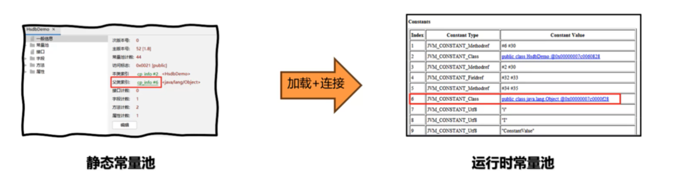

3、字符串常量池(StringTable)

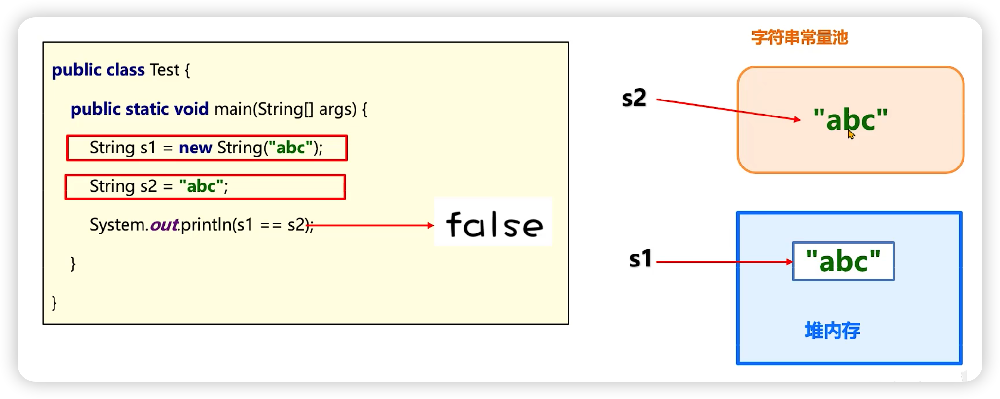


字符串常量池和运行时常量池的关系

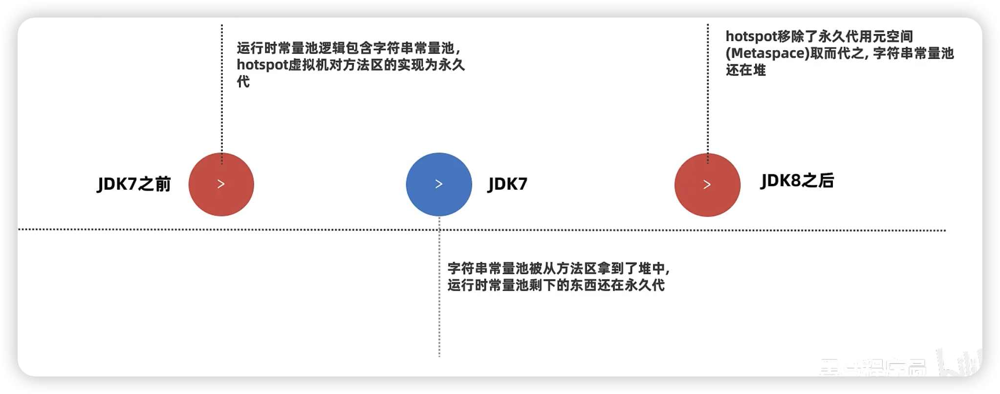

StringTable的练习题1，运行时使用StringBuilder连接

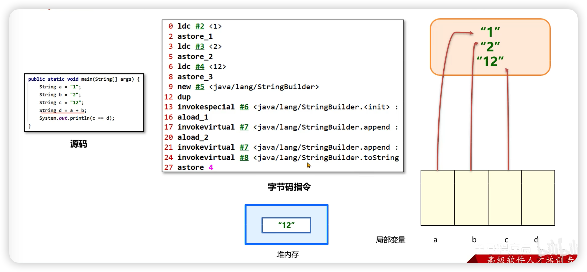

练习题2，常量编译阶段直接连接

```java
public static void main(String[] args){
  String a = "1";
  String b = "2";
  String c = "12";
  String d = "1" + "2";
  // true
  System.out.println(c == d);
}
```

练习3

```java
    public static void main(String[] args) throws ClassNotFoundException, InstantiationException, IllegalAccessException, IOException {


        String s1 = new StringBuilder().append("1").append("2").toString();

        System.out.println(s1.intern() == s1);
        String s2 = new StringBuilder().append("ja").append("va").toString();
        System.out.println(s2.intern() == s2);

     }
```


结果：false，false

JDK6版本中的intern()，由于字符串常量池不在堆中，所以会拷贝一分字符串到方法区中的字符串常量池。

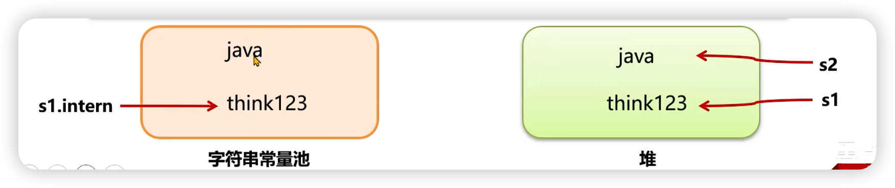


结果：true，false；

JDK7及之后版本中由于**字符串常量池在堆上**，所以intern()方法会把第一次遇到的字符串的**堆内存地址**引用放入字符串常量池。

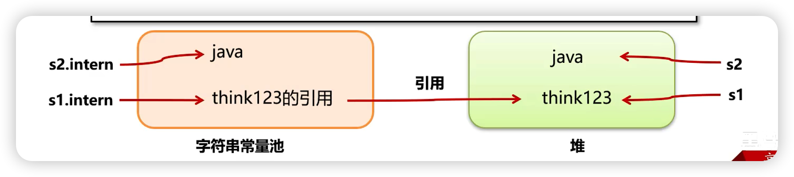

注意：AmazonCorrettoOpenJDk1.8 实现上与上结果不太一致，结果为true true，想了解自行深入


> 方法区JDK7/JDK8的小区别

JDK7及之前的版本将方法区存放在**堆区域中的永久代空间**，堆的大小由虚拟机参数来控制。
JDK8及之后的版本将方法区存放在**元空间**中，元空间位于操作系统维护的直接内存中，默认情况下只要不超过操作系统承受的上限，可以一直分配。

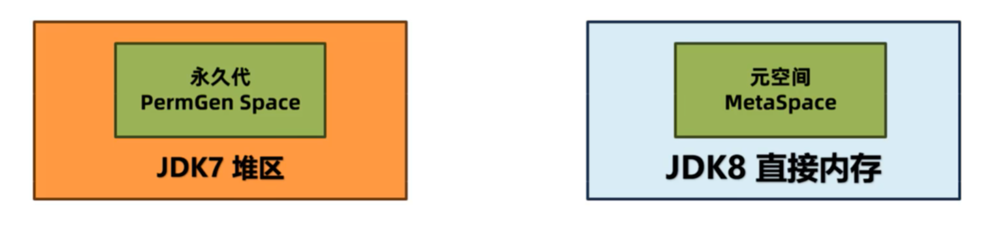

arthas查看方法区

- 使用memory打印出内存情况，JDK7及之前的版本查看ps_perm_gen属性
- JDK8及之后的版本查看metaspace属性。

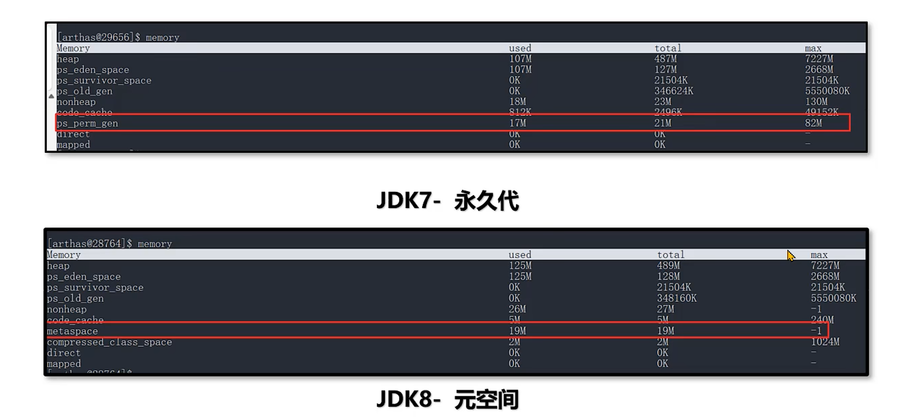


> 实验-模拟方法区的溢出

通过ByteBuddy框架，动态生成字节码数据，加载到内存中。通过死循环不停地加载到方法区，观察方法区是否会出现内存溢出的情况。分别在JDK7和JDK8上运行上述代码。

ByteBuddy基本使用方法

用于操作生成和操作Java字节码

1、引入依赖

```xml
<?xml version="1.0" encoding="UTF-8"?>
<project xmlns="http://maven.apache.org/POM/4.0.0"
         xmlns:xsi="http://www.w3.org/2001/XMLSchema-instance"
         xsi:schemaLocation="http://maven.apache.org/POM/4.0.0 http://maven.apache.org/xsd/maven-4.0.0.xsd">
    <modelVersion>4.0.0</modelVersion>

    <groupId>org.example</groupId>
    <artifactId>ByteBuddy</artifactId>
    <version>1.0-SNAPSHOT</version>

    <properties>
        <maven.compiler.source>8</maven.compiler.source>
        <maven.compiler.target>8</maven.compiler.target>
        <project.build.sourceEncoding>UTF-8</project.build.sourceEncoding>
    </properties>
    <dependencies>
        <dependency>
            <groupId>net.bytebuddy</groupId>
            <artifactId>byte-buddy</artifactId>
            <version>1.12.23</version>
        </dependency>

    </dependencies>

</project>
```


2、创建ClassWriter对象

```java
ClassWriter classWriter = new ClassWriter(0)
```

3、调用visit方法，创建字节码数据

```java
 classWriter.visit(Opcodes.V1_7, Opcodes.ACC_PUBLIC, name, null, "java/lang/Object", null);
```


完整代码,请分别使用JDK1.7和JDK1.8使用

```java
package org.example;

import net.bytebuddy.jar.asm.ClassWriter;
import net.bytebuddy.jar.asm.Opcodes;

import java.io.IOException;


public class Main extends ClassLoader{
    public static void main(String[] args) throws IOException {
        System.in.read();
        Main main = new Main();
        int count = 0;
        while (true){
            String name = "Class" + count;
            ClassWriter classWriter = new ClassWriter(0);
            classWriter.visit(Opcodes.V1_7, Opcodes.ACC_PUBLIC, name, null, "java/lang/Object", null);
            byte[] byteArray = classWriter.toByteArray();
            main.defineClass(name, byteArray, 0 , byteArray.length);
            System.out.println(++count);
        }
    }
}
```

结论

实验发现，JDK7上运行大概十几万次，就出现了错误。在JDK8上运行百万次，程序都没有出现任何错误，但是内存会直线升高。说明JDK7和JDK8在方法区的存放上，采用了不同的设计。

- JDK7将方法区存放在堆区域中的（PermGen Space）永久代空间，堆的大小由虚拟机参数-XX:MaxPermSize=256m。
- JDK8将方法区存放在元空间中，元空间位于操作系统维护的直接内存中，默认情况下只要不超过操作系统承受的上限，可以一直分配。
- -XX:MaxMetaspaceSize=值将元空间最大大小进行限制。


### 直接内存(Direct Memory)

在JDK 1.4 中引入了 NIO 机制，使用了直接内存，主要为了解决以下两个问题：

1、 Java堆中的对象如果不再使用要回收，回收时会影响对象的创建和使用。

2、io操作比如读文件，需要先把文件读入直接内存（缓冲区）再把数据复制到Java堆中。

现在直接入直接内存即可，同时Java堆上维护直接内存的引用，减少了数据复制的开销。写文件也是类似的思路。


创建直接内存，ByteBuffer

```java
ByteBuffer direct = ByteBuffer.allocateDirect(size);

```

Arthas，为direct块

溢出会异常，Java.lang.OutOfMemoryError: Direct buffer memory

> 调整大小

```
-XX:MaxDirectMemorySize=1024m
```


## 自动垃圾回收

### 概述

在C/C++这类没有自动垃圾回收机制的语言中，一个对象如果不再使用，需要手动释放，否则就会出现内存泄漏。我们称这种释放对象的过程为垃圾回收，而需要程序员编写代码进行回收的方式为手动收。

内存泄漏：指的是不再使用的对象在系统中未被回收，内存泄漏的积累可能会导致内存溢出。


> java内存管理（Garbage Collection ： GC）

- 不再使用的对象完成自动的回收，垃圾回收器主要负责对堆上的内存进行回收。

- 是否回收对象由虚拟机来进行判断


> 应用场景

1、解决系统僵死的问题

2、性能优化：对垃圾回收器进行合理的设置可以有效地提升程序的执行性能

3、高配面试：常见垃圾回收期、垃圾回收算法、四中引用


### 方法区的回收

判断一个类可以被卸载需要满足下面三个条件

- 此类所有实例对象都己经被回收，在堆中不存在任何该类的实例对象以及子类对象。

- 加载该类的类加载器已经被回收。
- 该类对应的 java.lang.Class 对象没有在任何地方被引用。


```shell
#类加载
-XX：+TraceClassLoading
# 类卸载
-XX：+TraceClassUnloading
```

> 手动触发回收

调用System.gc（）方法并不一定会立即回收垃圾，仅仅是向Java虚拟机发送一个垃圾回收的请求，体是否需要执行垃圾回收Java虚拟机会自行判断。


```java
System.gc();
```


### 堆回收

#### 引用计数法

引用计数法：为每个对象维护一个引用计数器，当对象被引用时加1，取消引用时减1。

引用内存结构图

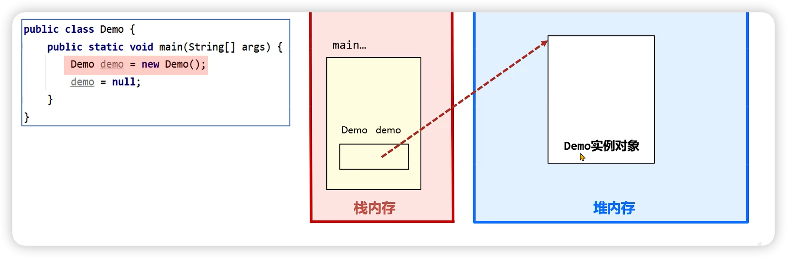


如何判断对象的对象可以回收？

图中的实例对象要回收，有两个引用要去除：1.栈中a1变量到对象的引用  2.B对象到A对象的

引用

a1=null,b1.a=null


如果在main方法中最后执行 a1 = null，b1= null，是否能回收A和B对象呢?

可以回收，方法中已经没有使用引用A和B对象


如何判断堆上的对象没有被引用？引用计数法和可达性分析


缺点：

1. 每次用和取消引用都需要维护计数器，对系统性能会有一定的影响
2.  存在循环引用问题，所谓循环引用就是当A引用B，B同时引用A时会出现对象无法回收


> 查看垃圾回收日志

```shell
-verbose:gc
```

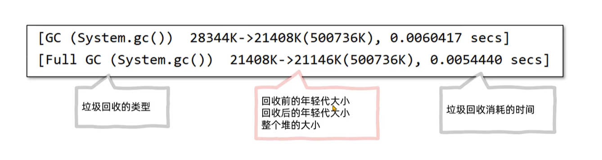

#### 可达性分析法


**可达性分析**：算法来判断对象是否可以被回收。可达性分析将对象分为两类: 垃圾回收的**根对象(GC Root)**和普通对象，对象与对象之间存在引用关系

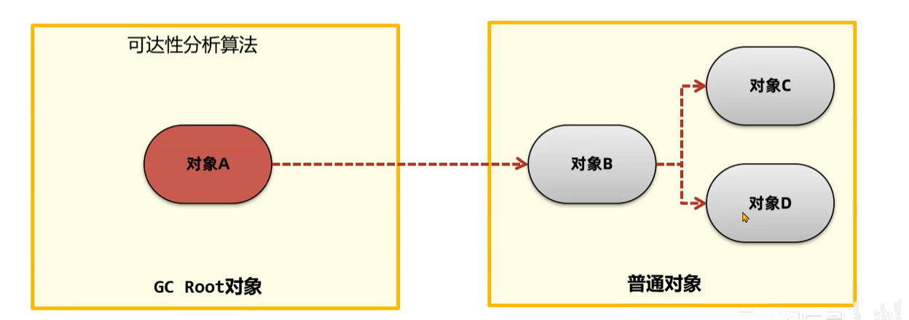


> **GC ROOT 对象:**

（1）线程Thread对象，引用线程栈帧中的方法参数、局部变量等

可达性算法案例分析：分析下面代码中的A实例对象和B示例对象，是如何通过可达性算法判断对象能被回收的?

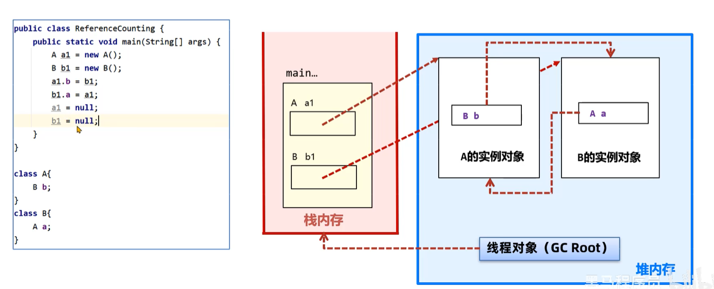

（2）系统类加载器加载的java.lang.Class对象，引用类中的静态变量

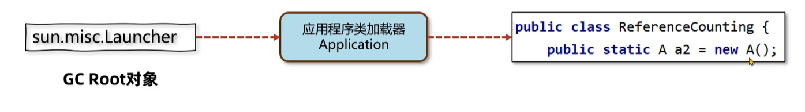


（3）监视器对象，用来保存同步锁synchronized关键字持有的对象

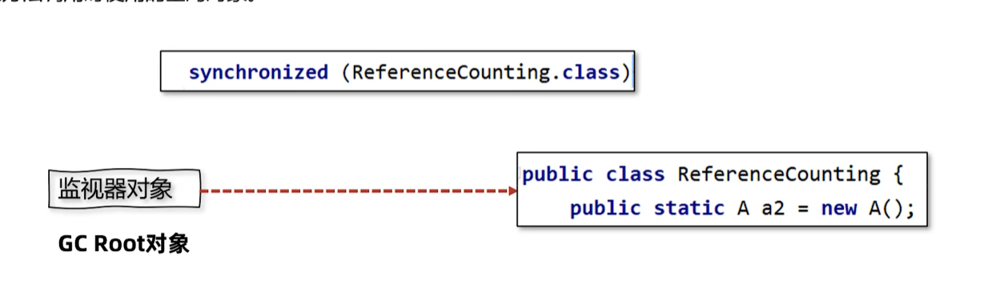


（4）本地方法调用时使用的全局对象


> **使用arthas，查看GC ROOT对象**

（1）heapdump /Users/momoc/test.hprof  将内存快照保存到本地磁盘中

（2）使用MAT工具打开堆内存快照,JDK版本？17？

（3）选择GC ROOT功能查看

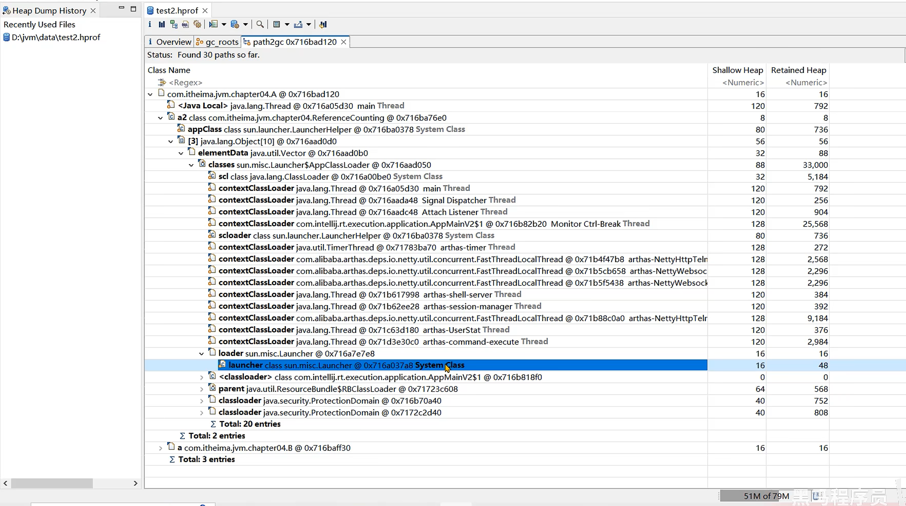


**总结**

- java使用可达性分析算法判断对象是否可以回收
- 四种GC ROOT对象
- 使用MAT打开内存快照方式


#### 五种对象引用

可达性算法中描述的对象引用，一般指的是强引用，即是GCRoot对象对普通对象有引用关系，只要这层关系存在，普通对象就不会被回收。


> 强引用

可达性分析算法判断是否可回收


> 软引用

弱引用关系，如果一个对象只有软引用关联到它，当程序内存不足时，会将软引用中的数据进行回收。
在JDK 1.2版之后提供了**SoftReference**类来实现软引用，软引用常用于缓存中。


无强引用后，即可回收。

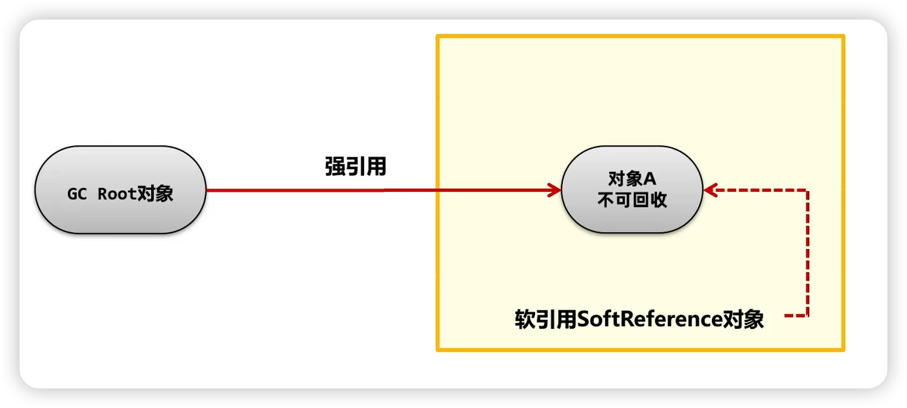

GC ROOT对象与SoftReference存在强引用

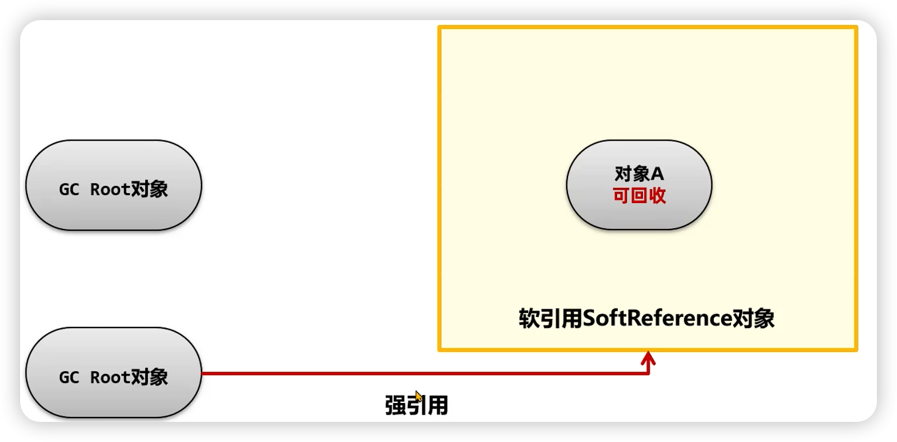

**软引用的执行过程如下：**
1将对象使用软引用包装起来，new SoftReference<对象类型>（对象）。

2.内存不足时，虚拟机尝试进行垃圾回收。

3.如果垃圾回收仍不能解决内存不足的问题，回收软引用中的对象。

4.如果依然内存不足，抛出OutOfMemory异常。


实验,依赖

```xml
<?xml version="1.0" encoding="UTF-8"?>
<project xmlns="http://maven.apache.org/POM/4.0.0"
         xmlns:xsi="http://www.w3.org/2001/XMLSchema-instance"
         xsi:schemaLocation="http://maven.apache.org/POM/4.0.0 http://maven.apache.org/xsd/maven-4.0.0.xsd">
    <modelVersion>4.0.0</modelVersion>

    <groupId>org.example</groupId>
    <artifactId>jvm_study</artifactId>
    <version>1.0-SNAPSHOT</version>

    <properties>
        <maven.compiler.source>8</maven.compiler.source>
        <maven.compiler.target>8</maven.compiler.target>
        <project.build.sourceEncoding>UTF-8</project.build.sourceEncoding>
    </properties>
    <dependencies>
        <dependency>
            <groupId>com.github.ben-manes.caffeine</groupId>
            <artifactId>caffeine</artifactId>
            <version>2.9.3</version>
        </dependency>
    </dependencies>
</project>
```

java代码

```java
package org.example;

import java.lang.ref.SoftReference;

/**
 * @author momoc
 * @version 1.0
 * @className ${NAME}
 * @description
 * @date ${DATE} ${TIME}
 */
public class SoftReferenceDemo {
    public static void main(String[] args) {

        //堆内存要设置为200M
        byte[] bytes = new byte[1024 * 1024 * 100];
        SoftReference<byte[]> softReference = new SoftReference<>(bytes);
        //释放强引用
        bytes = null;

       
        System.out.println(softReference.get());

        byte[] bytes2 = new byte[1024 * 1024 * 100];
        System.out.println(softReference.get());
      /**
      * 结果：
      * [B@61bbe9ba
			* null
      **/
      

    }
}
```


软引用中的对象如果在内存不足时回收，SoftReference对象本身也需要被回收。如何知道哪些

SoftReference对象需要回收呢？

SoftReference提供了一套队列机制：

1、软引用创建时，通过构造器传入引用队列

2、在软引用中包含的对象被回收时，该软引用对象会被放入引用队列

3、通过代码遍历引用队列，将SoftReference的强引用删除

代码实验：

```java
package org.example;

import java.lang.ref.ReferenceQueue;
import java.lang.ref.SoftReference;
import java.util.ArrayList;

/**
 * @author momoc
 * @version 1.0
 * @className ${NAME}
 * @description
 * @date ${DATE} ${TIME}
 */
public class SoftReferenceDemo2 {
    public static void main(String[] args) {

        ArrayList<SoftReference> softReferences = new ArrayList<>();
        ReferenceQueue<byte[]> referenceQueue = new ReferenceQueue<>();

        for (int i = 0; i < 10; i++) {
            byte[] bytes = new byte[1024 * 1024 * 100];
            SoftReference<byte[]> softReference = new SoftReference<>(bytes, referenceQueue);
            softReferences.add(softReference);
        }

        SoftReference<byte[]> ref = null;
        int count = 0;
        while ((ref = (SoftReference<byte[]>) referenceQueue.poll()) != null){
            count++;
        }
      //count = 9
        System.out.println(count);

    }
}
```


> 弱引用


弱引用的整体机制和软引用基本一致，不管内存够不够都会直接被回收。

在JDK 1.2版之后提供了**WeakReference**类来实现弱引用，弱引用主要在**ThreadLocal**中使用。

弱引用对象本身也可以使用引用队列进行回收。


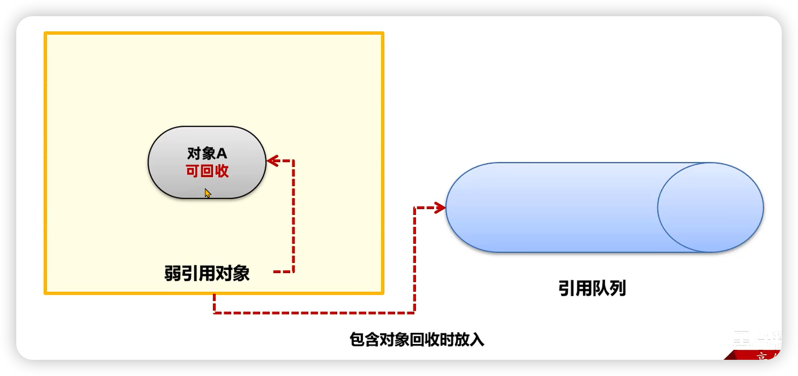


>  虚引用和终结器引用

开发中不会使用！！

**虚引用**：也叫幽灵引用/影引用，不能通过虚引用对象获取到包含的对象，用于直接内存空间

- 虚引用唯一的用途是当对象被垃圾回收器回收时可以接收到对应的通知。

- Java中使用**PhantomReference**实现了虚引用，**直接内存**中为了及时知道直接内存对象不再使用，从而回收内存，使用了虚引用来实现。


**终结器引用**：是在对象需要被回收时，对象将会被放置在Finalizer类中的引用队列中，并在稍后由一条由**FinalizerThread**线程从队列中获取对象，然后执行对象的**finalize方法**。在这个过程中可以在finalize方法中再将自身对象使用强引用关联上，但是不建议这样做，如果耗时过长会影响其他对象的回收。

Finalize 只能救活一次,需要理解下面的案例

```java
package chapter04.finalreference;

/**
 * 终结器引用案例
 */
public class FinalizeReferenceDemo {
    public static FinalizeReferenceDemo reference = null;

    public void alive() {
        System.out.println("当前对象还存活");
    }

    @Override
    protected void finalize() throws Throwable {
        try{
            System.out.println("finalize()执行了...");
            //设置强引用自救
            reference = this;
        }finally {
            super.finalize();
        }
    }

    public static void main(String[] args) throws Throwable {
        reference = new FinalizeReferenceDemo();
       test();

       test();
    }

    private static void test() throws InterruptedException {
        reference = null;
        //回收对象
        System.gc();
        //执行finalize方法的优先级比较低，休眠500ms等待一下
        Thread.sleep(500);
        if (reference != null) {
            reference.alive();
        } else {
            System.out.println("对象已被回收");
        }
    }
}
结果：
  finalize()执行了...
  当前对象还存活
  对象已被回收
```


### 垃圾回收算法

1、找到内存中存活对象

2、释放不再存活对象的内存，使得程序能再次利用这部分空间


垃圾回收由单独的GC线程来完成，但是不管使用哪一种GC算法，都会有部分阶段需要停止所有的用户线程。过程被称之为Stop The World简称STW，如果STW时间过长则会影响用户的使用。

垃圾回收日志参数：-verbose:gc


> 垃圾回收评价标准


1、吞吐量，吞吐量指的是 CPU 用于执行用户代码的时间与 CPU 总执行时间的比值，即吞吐量 =执行用户代码时间/（执行用户代码时间 +GC时间）。吞吐量数值越高，垃圾回收的效率就越高。

2、最大暂停时间STW

3、堆使用效率

不同垃圾回收算法，对堆内存的使用方式是不同的。比如标记清除算法，可以使用完整的堆内存。而复制算法会将堆内存一分为二，每次只能使用一半内存。从堆使用效率上来说，标记清除算法要优于复制算法。


总结：上述三种评价标准：堆使用效率、吞吐量，以及最大暂停时间不可兼得。
一般来说，堆内存越大，最大暂停时间就越长。想要减少最大暂停时间，就会降低吞吐量。不同的垃圾回收算法，适用于不同的场景。


> 常见垃圾回收算法

#### 标记-清除算法

- 标记阶段，将所有存活的对象进行标记。使用**可达性分析算法**，从GC Root开始通过引用链遍历出所有存活对象。
- 清除阶段，从内存中删除没有被标记也就是非存活对象。


优点：实现简单，只需要在第一阶段给每个对象维护标志位，第二阶段删除对象即可。
缺点：

- **碎片化问题**，由于内存是连续的在对象被删除之后，内存中会出现很多细小的可用内存单元。如果我们需要的是一个比较大的空间，很有可能这些内存单元的大小过小无法进行分配。

- **分配速度慢**。由于内存碎片的存在，需要维护一个空闲链表，极有可能发生每次需要遍历到链表的最后才能获得合适的内存空间。


#### 复制算法

- 准备两块空间From空间和To空间，每次在对象分配阶段，只能使用其中一块空间（From空间），
- 在垃圾回收GC阶段，将From中存活对象复制到To空间。

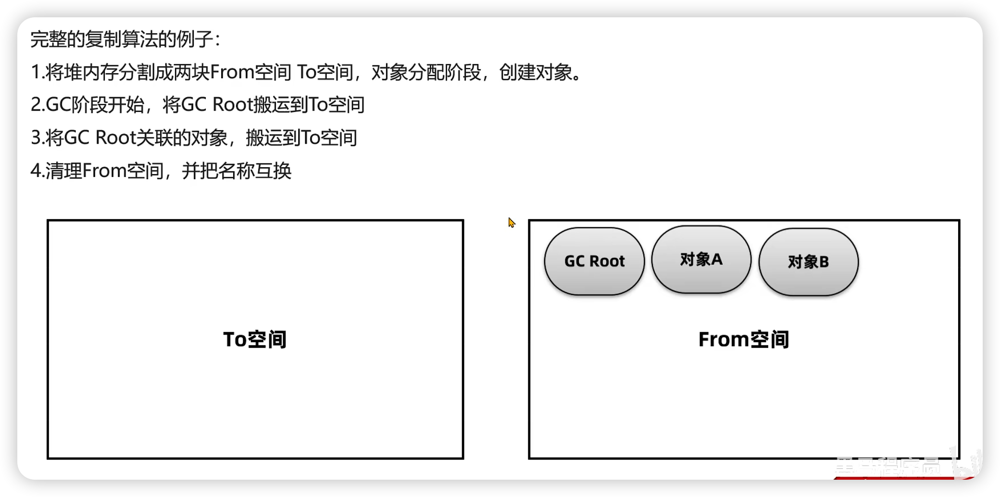


优缺点：吞吐量高、无内存碎片、堆内存使用效率低


#### 标记-整理算法（标记压缩算法）

解决：内存碎片问题

- 标记阶段，将所有存活的对象进行标记。使用可达性分析算法，从GC Root开始通过引用链遍历出所有存活对象。
-  整理阶段，将存活对象移动到堆的一端。清理掉存活对象的内存空间。

优缺点：内存使用效率高、无内存碎片、整理阶段效率不高


#### 分代GC

> 内存区域划分：

- 年轻代

    - Eden区

    - 幸存区/survivor（s0）

    - S1

- 老年代

结构图


> 分代回收算法流程

- 分代回收时，创建出来的对象，首先会被放入Eden伊甸园区。
- 随着对象在Eden区越来越多，如果Eden区满，新创建的对象已经无法放入，就会触发年轻代的GC，称为Minor GC或者Young GC。
- Minor GC会把需要eden中和From需要回收的对象回收，把没有回收的对象放入To区。
- 接下来，S0会变成To区，S1变成From区。 当eden区满时再往里放入对象，依然会发生Minor GC。

注意：

- 每次Minor GC 会为对象记录年龄，初值为0，GC完加1。达到条件后对象会晋升到老年代
- 当老年代中空间不足，无法放入新的对象时，先尝试minor gc，如果不足，就会触发Full GC，Full GC会对整个堆进行垃圾回收。STW停顿时间较长
- 如果Full GC依然无法回收掉老年代的对象，当对象继续放入老年代时，抛出Out Of Memory异常
- eden和survivor区满了，即时不满足年龄也会放入到老年。


>  调整内存区域的大小

启动分代GC参数：-XX: +UseSeriralGC  串行垃圾回收器

打印GC详情：-XX:+PrintGcDetail

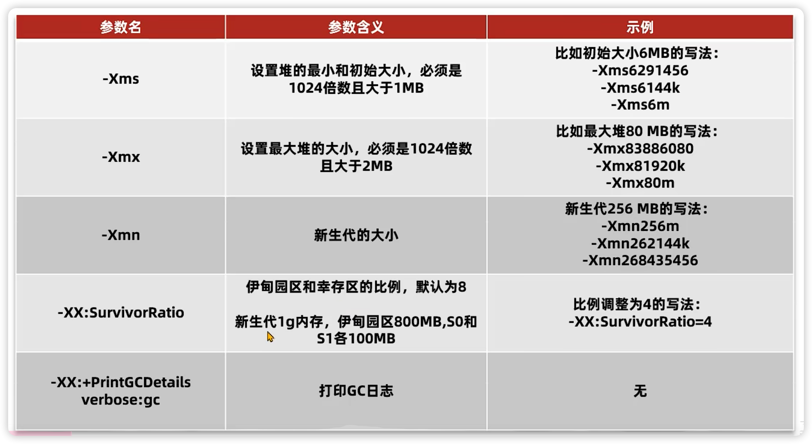

arthas分代情况，memory

为什么分代GC算法要把堆分成年轻代和老年代？

- 系统中的大部分对象，都是创建出来之后很快就不再使用可以被回收，比如用户获取订单数据，订单数据返回给用户之后就可以释放了。
- 老年代中会存放长期存活的对象，比如Spring的大部分bean对象，启动后就不会被回收
- 在虚拟机的默认设置中，新生代大小要远小于老年代的大小。

分代GC算法将堆分成年轻代和老年代主要原因有

1、可以通过调整年轻代和老年代的比例来适应不同类型的应用程序，提高**内存的利用率和性能**。

2、新生代和老年代使用不同的垃圾回收算法，新生代一般选择复制算法，老年代可以选择标记-清除和标记-整理算法，由程序员来选择灵活度较高

3、分代的设计中允许只回收新生代（minorgc），如果能满足对象分配的要求就不需要对整个堆进行回收（fullgc），STW时间就会减少。


### 垃圾回收器


> 垃圾回收器使用组合关系


> 年轻代-Seiral垃圾回收器

是一种单线程串行回收年轻代的垃圾回收器，

使用：复制算法

作用区域：年轻代

优缺点：单核吞吐量出色，多核会让其他线程阻塞等待

使用场景：硬件配置有限

```shell
-XX：+UseSerialGc 
```

> 老年代-SerialOld垃圾回收器

概述：SerialOld是Serial垃圾回收器的老年代版本，

```shell
-XX：+UseSerialGc
```

采用单线程串行回收 新生代、老年代都使用串行回收器。

使用：**标记整理算法**

优缺点：单核吞吐量出色，多核会让其他线程阻塞等待

场景：与Serial垃圾回收器搭配使用，或者在CMS特殊情况下使用


GC是具体的垃圾回收器，该图GC非串行回收器

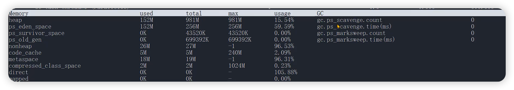


> 年轻代-ParNew垃圾回收器


ParNew垃圾回收器本质上是对Serial在多CPU下的优化.

```shell
-XX：+UseParNewGC
```

使用多线程进行垃圾回收 新生代使用ParNew回收器，老年代使用串行回收器

算法：复制算法

优缺点：多CPU下STW较短，吞吐量和停顿时间不如G1，JDK9后不建议使用

适用：JDK8及之前的版本中，与CMS老年代垃圾回收器搭配使用


> **老年代-CMS（Concurrent Mark Sweep）**

CMS垃圾回收器关注的是系统的暂停时间，允许用户线程和垃圾回收线程在某些步骤中同时执行，减少了用户线程的等待时间。

```shell
-XX：+UseConcMarkSweepGC
# N次FullGC之后，进行内存整理
-XX：CMSFullGCsBeforeCompaction=N
```

使用：标记清除算法

优点：系统由于垃圾回收出现的STW较短，用户体验好

缺点：

- 碎片化：解决使用参数，-XX：CMSFullGCsBeforeCompaction=N，N次FullGC之后，进行内存整理

- 浮动垃圾：无法在清理过程中，清理新生代

- 退化问题：老年代满了无法分配时，会退化成Seriral Old


适用场景：大型的互联网系统中用户请求数据量大、频率高的场景比如订单接口、商品接口等

**执行步骤**

1.初始标记，用极短的时间标记出GC Roots能直接关联到的对象。

2.并发标记，标记所有的对象，用户线程不需要暂停。

3.重新标记，由于并发标记阶段有些对象会发生了变化，存在错标、漏标等情况，需要重新标记。STW

4.并发清理，清理死亡对象，用户线程不需要暂停

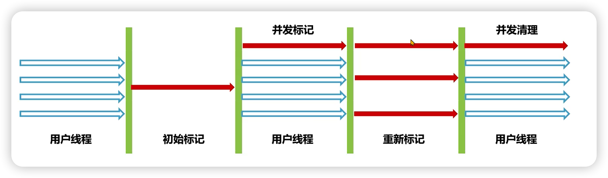


> 年轻代 - Parallel Scavenge 垃圾回收器

Parallel Scavenge是JDK8默认的年轻代垃圾回收器，多线程并行回收，关注的是系统的**吞吐量**。具备省动调整堆内存大小的特点。

```shell
-XX：+UseParallelGC 
# 最大暂停时间
-XX: MaxGCPauseMillis=n
# 设置吞吐量为n（用户线程执行时间= n/n + 1）
-XX:GCTimeRation=n

# 自动调整内存大小
-XX: +UseAdaptiveSizePolicy

# 打印启动参数，验证自动调整功能
-XX: +PrintFlagsFinal
```


算法：复制算法

优点：吞吐量高，而且手动可控。为了提高吞吐量；虚拟机会动态调整堆的参数

缺点：不能保证单次STW时间

适用场景：后台任务，不需要与用户交互，并且容易产生大量的对象，比如：大数据的处理，大文件导出


> 老年代 - Parallel  Old

Parallel Old是为Parallel Scavenge收集器设计的老年代版本，利用多线程并发收集。

```shell
-XX：+UseParallelOldGC
# 最大暂停时间
-XX: MaxGcPauseMillis=n
# 设置吞吐量为n（用户线程执行时间= n/n + 1），JVM会根据这个大小自动调整堆大小，会减少年轻代内存大小
-XX:GCTimeRation=n
# 自动调整内存大小
-XX: +UseAdaptiveSizePolicy
```

算法：标记-整理算法

优点：并行收集，在多核CPU下效率较高

缺点：STW长

适用场景：与Parallel Scavenge配套使用


JDK8默认启动参数，可以看到默认使用PS垃圾回收器

```shell
momoc@Mac-mini java-common-note % java -XX:+PrintCommandLineFlags -version
-XX:InitialHeapSize=805306368 -XX:MaxHeapSize=12884901888 -XX:+PrintCommandLineFlags -XX:+UseCompressedClassPointers -XX:+UseCompressedOops -XX:+UseParallelGC 
java version "1.8.0_271"
Java(TM) SE Runtime Environment (build 1.8.0_271-b09)
Java HotSpot(TM) 64-Bit Server VM (build 25.271-b09, mixed mode)
```

Oracle官方建议在使用这个组合PS时，不要设置堆内存的最大值，垃圾回收器会根据最大暂停时间和吞吐量自动调整内存大小。


> G1垃圾回收器,Garbage FIrst，年轻代和老年代


JDK9之后默认的垃圾回收器是G1 （Garbage First）垃圾回收器。

Parallel Scavenge关注吞吐量，允许用户设置最大暂停时间，但是会减少年轻代可用空间的大小。

CMS关注暂停时间，但是吞吐量方面会下降。

而G1设计目标就是将上述两种垃圾回收器的优点融合：

1.支持巨大的堆空间回收，并有较高的吞吐量。

2.支持多CPU并行垃圾回收。

3.允许用户设置最大暂停时间。


算法：复制算法

优点：

- 堆超过6G的堆回收时，延迟可控

- 不会产生内存碎片

- 并发标记的SATB算法效率高

缺点：JDK8之前不够成熟


相关JVM参数：

```shell
# 指定region大小为32M,Region size必须是2的指数幂，取值范围从1M到32M
-XX:G1HeapRegionSize=32m
# 每次垃圾回收时的最大暂停时间毫秒数,默认200ms
-XX: MaxGcPauseMillis=200
#  堆内存占总45会出发MixedGC
-XX: InitiatingHeapOccupancyPercent=45%
#  打开G1回收器
-XX:+UseG1GC
```


**内存结构：**

G1的堆被划分成多个大小相等的区域，称之为区Region，区域不要求是连续的。分为Eden、Survivor、Old区。

Region=堆空间大小/2048


**回收方式：**

1、年轻代回收（Young GC），回收Eden和Survivor区，导致STW

执行流程：

1、新创建的对象存放在Eden区。当G1判断年轻代区不足（max默认60％），无法分配对象时需要回收时会执行Young GC。

2、标记出Eden和Survivor区域中的存活对象，

3、根据配置的最大暂停时间选择某些区域将存活对象复制到一个新的Survivor区中（年龄+1），清空这些区域。Region存活度较低优先清理

4、后续Young GC时与之前相同，只不过Survivor区中存活对象会被搬运到另一个Survivor区。

5、当某个存活对象的年龄到达國值（默认15），将被放入老年代。

6、部分对象如果大小超过Region的一半，会直接放入老年代，这类老年代被称为Humongous区。

7、多次回收之后，会出现很多Old老年代区，此时总堆占有率达到阈值时（-XX：**InitiatingHeapOccupancyPercent**默认45%）会触发混合回收MixedGC。回收所有年轻代和部分老年代的对象以及大对象Humongous区。采用**复制算法**来完成。


G1在进行Young GC中会去记录每个Eden区和Survivor区的平均耗时，作为下次回收时的参考依据。

如： -XX: MaxGCPauseMillis=n（默认200）

Region回收个数= 200/回收一个Region


2、混合回收（Mixed GC）

混合回收：初始标记（initial mark）、并发标记 （concurrent mark）、最终标记（remark或者FinalizeMarking）、并发清理 （cleanup）
G1对老年代的清理会选择存活度最低的区域来进行回收，这样可以保证回收效率最高

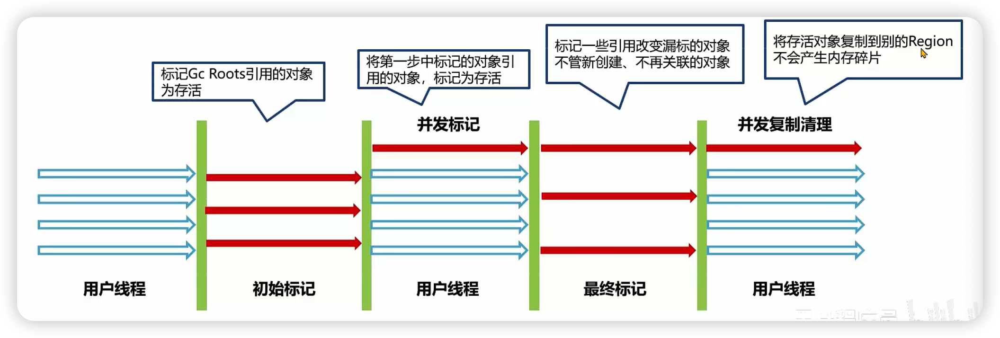


**注意**：如果清理过程中发现没有足够的空Region存放转移的对象，会出现Full GC。单线程执行标记-整理算法，此时会导致用户线程的暂停。所以尽量保证应该用的堆内存有一定多余的空间。


# 三、实战篇章


开拓视野就行

## 内存调优

### 内存泄漏和溢出

**内存泄漏（memory leak**）：不再使用一个对象，该对象依然在GC ROOT的引用链上，这个对象就不会被垃圾回收器回收。内存泄漏绝大多数是由堆内存泄漏引起

内存泄露过多，会导致的结果就是内存溢出。但是产生内存溢出并不是只有内存泄漏这一种原因。


> 解决内存泄漏问题的方法是什么？


1、发现问题，通过监控工具尽可能尽早地发现内存慢慢变大的现象。

2、诊断原因，通过分析内存快照或者在线分析方法调用过程，诊断问题产生的根源，定位到出现问题的源代码

3、修复源代码中的问题，如代码bug、技术方案不合理、业务设计不合理等等

4、在测试环境验证问题是否已经解决，最后发布上线。


### 发现问题

通过监控工具尽可能地发现内存慢慢变大的线程

#### top命令

- top命令是linux下用来查看系统信息的一个命令，它提供给我们去实时地去查看系统的资源，比如执行时的进程、线程和系统参数等信息。

- 进程使用的内存为RES（常驻内存）- SHR（共享内存）

```shell
# 按内存占用排序
top -m
# 查看进程里面的线程，进入后按H
top-p 进程ID
```


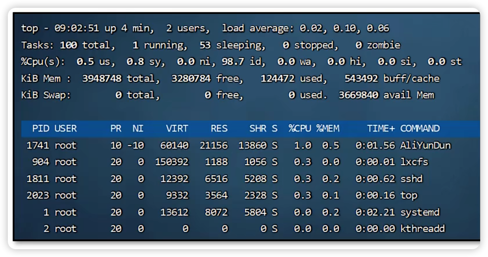


#### VisualVM

VisuaLVM是多功能合一的Java故障排除工具并且他是一款可视化工具，整合了命令行 JDK 工具和轻量级分析功能，功能非常强大。
这款软件在Oracle JDK 6~8 中发布，但是在 Oracle JDK 9 之后不在JDK安装目录下需要单独下载。下载地址：https://visualvm.github.io

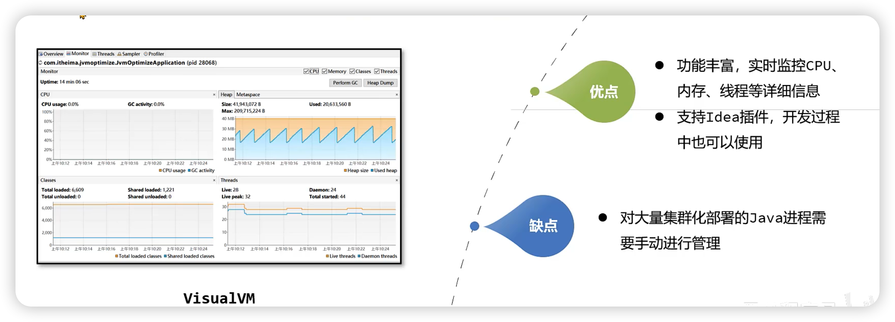


**生产环境禁止使用，一些操作会阻塞用户线程**

> ###### Arthas

Arthas 是一款线上监控诊断产品，通过全局视角实时查看应用 Load、内存、gc、线程的状态信息，并能在不修改应用代码的情况下，对业务问题进行诊断，包括查看方法调用的出入参、异常，监测方法执行耗时，类加载信息等，大大提升线上问题排查效率。


案例：使用arthas tunnel管理所有需要监控的程序

小李的团队已经普及了arthas的使用，但是由于使用了微服务架构，生产环境上的应用数量非常多，使用arthas还得登录到每一台服务器上再去操作非常不方便。他看到官方文档上可以使用tunnel来管理所有需要监控的程序。

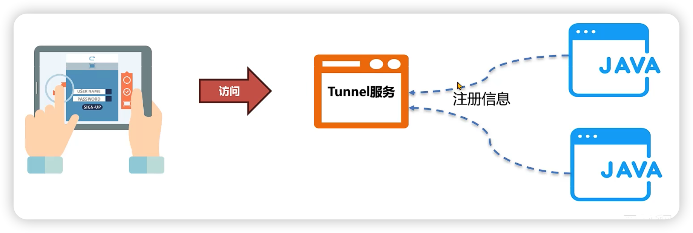

使用：

服务端：需要先启动arthas-tunnel-server-3.7.1.fatjar.jar

```sh
#!/bin/bash

# Set the path of the jar file
JAR_PATH=/root/arthas-tunnel-server/arthas-tunnel-server-3.7.2-fatjar.jar

# Check if the jar file exists
if [ ! -f "$JAR_PATH" ]; then
    echo "Jar file not found at $JAR_PATH"
    exit 1
fi

# Find the running Java process for the jar file
PROCESS_ID=$(/usr/java/openjdk20/jdk-20.0.1/bin/jps -mlv | grep $JAR_PATH | awk '{print $1}')

# Stop the running process if it exists
if [ ! -z "$PROCESS_ID" ]; then
  echo "Stopping process $PROCESS_ID..."
  kill $PROCESS_ID
fi

# Start the Java process
echo "Starting $JAR_PATH..."
nohup java -jar -Dserver.port=8199 -Darthas.enable-detail-pages=true $JAR_PATH  &
```


下面是客户端：

（1）maven依赖

```xml
<!-- https://mvnrepository.com/artifact/com.taobao.arthas/arthas-spring-boot-starter -->
<dependency>
    <groupId>com.taobao.arthas</groupId>
    <artifactId>arthas-spring-boot-starter</artifactId>
    <version>3.7.2</version>
</dependency>

```


（2）配置文件

```yaml
arthas:
  #tunneL她址，目前是部署在同一台服务器，正式坏境需要拆分
  tunnel-server: ws://1ocalhost:7777/ws
  #tunneL显示的应用名称，直接使用应片名
  app-name: ${spring.application.name}
  #arthas http访问的端口和运程连接的端口
  http-port: 8888
  telnet-port: 9999

```


（3）打开tunnel的服务端页面，查看所有的进程列表，并选择进程进行arthas的操作。


#### Prometheus + Grafana

Prometheus+Grafana是企业中运维常用的监控方案，其中Prometheus用来采集系统或者应用的相关数据，同时具备告警功能。Grafana可以将Prometheus采集到的数据以可视化的方式进行展示。

Java程序员要学会如何读懂Grafana展示的Java虚拟机相关的参数。

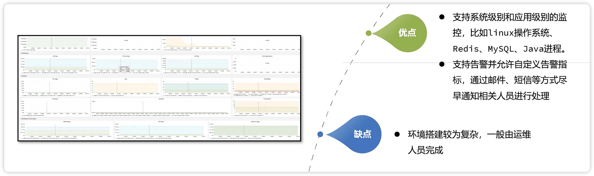

需要：spring-boot-starter-actuator、MicroMeter ，上面的依赖关于在项目会提供监控结果接口访问


通过接口收集，然后通过监控大盘查看

#### heapHero.io


#### 诊断原因和解决方法

通过分析工具诊断问题的产生原因，定位到出现问题的源代码


举例内存溢出原因

（1）equals和hashCode，没有正确重写，体现在Map等容器类

对象如果没有重写HashCode会随机生成数。

（2）内部类引用外部类

非静态内部类案例

```java
//B为非静态内部类
new A().new B();
//解决，更改B为静态内部类即可
new A.B();

```

匿名内部类案例

匿名内部类，创建时，内部类会引用调用方this

```java
package com.example.arthastunnelserver;

import java.util.ArrayList;
import java.util.List;

public class Outer {
    private byte[] bytes=new byte［1024];
  // 改static方法即可
    public List<String> newList(){
        List<String>list=new ArrayList<String>() {{
            add("1");
            add("2");
        }};
        return list;
    }

    public static void main(String[] args) {
        int count = 0;
        ArrayList<Object> objects = new ArrayList<>();

        while (true){
            System.out.println(++count);
            objects.add(new Outer().newList());
        }
    }
}

```

（3）ThreadLocal

线程池没有remove

（4）String.intern()

JDK6中字符串常量池位于堆内存中的Perm Gen永久代中，如果不同字符串的intern方法被大量调用，字符串常量池会不停的变大超过永久代内存上限之后就会产生内存溢出问题。

（5）静态字段保存对象

如果大量的数据在静态变量中被长期引用，数据就不会被释放，如果这些数据不再使用，就成为了内存泄漏。


解决：使用懒加载

（6）资源没有正确关闭

连接和流这些资源会占用内存，如果使用完之后没有关闭，这部分内存不一定会出现内存泄漏，但是会

导致close方法不被执行。

解决方案：

1、为了防止出现这类的资源对象泄漏问题，必须在finally块中关闭不再使用的资源。

2、从 Java 7 开始，使用try-with-resources语法可以用于自动关闭资源。


（7） 并发请求问题

本地模拟：jmeter

请求多，请求时间长，获取对象比较多（保留大量内存数据到内存中）

#### 定位问题方案

##### 生成内存快照分析

优点：通过完整的內存快照准确地判断出问题产生的原因

缺点：
内存较大时，生成内存快照较慢，会停止用户线程

通过MAT分析内存快照，至少要准备1.5 - 2倍大小的内存空间


##### 在线定位问题 arthas/btrace


优点：无需生成内存快照，整个过程对用户的影响较小
缺点：

无法查看到详细的内存信息

需要通过arthas或者btrace工具调测

发现问题产生的原因，需要具备一定的经验


> btrace


BTrace 是一个在Java 平台上执行的追踪工具，可以有效地用于线上运行系统的方法追踪，具有侵入性小、对性
能的影响微乎其微等特点。
项目中可以使用btrace工具，打印出方法被调用的栈信息。
使用方法：
1、下载btrace工具，官方地址：https://github.com/btraceio/btrace/release/latest

2、编写btrace脚本，通常是一个java文件

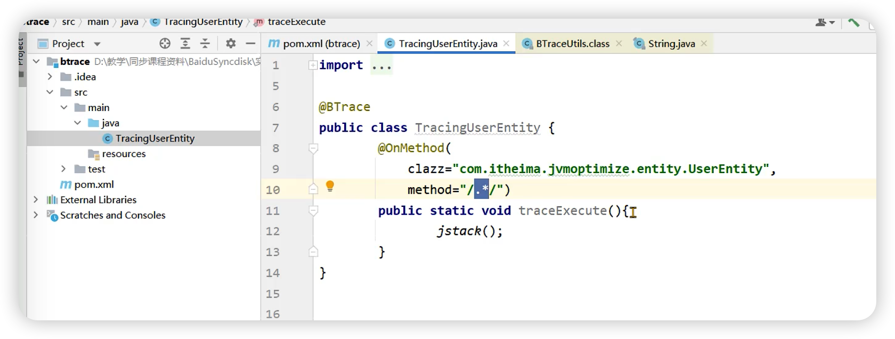


3、将btrace工具和脚本上传到服务器，在服务器上运行 btrace 进程ID 脚本文件名

4、观察执行结果。


>  步骤


1、使用jmap -histo: live 进程ID > 文件名 命令将内存中存活对象以直方图的形式保存到文件中，这个过程会影响用户的时间，但是时间比较短暂。
2、分析内存占用最多的对象，一般这些对象就是造成内存泄漏的原因。

3、使用arthas的stack命令，追踪对象创建的方法被调用的调用路径，找到对象创建的根源。也可以使用btrace工具编写脚本追踪方法执行的过程。

```shell
# arthas 查看对象创建的调用堆栈
stack 类名 -n 2
# bt
btrace 进程ID 脚本文件名

```


#### 


### 使用MAT工具诊断内存

```shell
# 发生OOM，dump -》hprof内存快照
-XX:+HeapDumpOnOutOfMemoryError
-XX:+HeapDumpPath=<path>.hporf
# FullGC之前生成对内存快照
-XX:+HeapDumpBeforeFUllGC
```


MAT内存快照，内存泄露检测报告

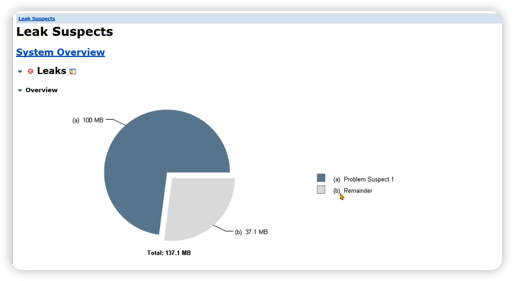

> 内存检测原理

- MAT提供了称为支配树 （Dominator Tree）的对象图。支配树展示的是对象实例间的支配关系。在对象引用图中，所有指向对象B的路径都经过对象A，则认为对象A支配对象B。

- MAT就是根据支配树，从叶子节点向根节点遍历，如果发现深堆的大小超过整个堆内存的一定比例國值，就会将其标记成内存泄漏的“嫌疑对象〞。


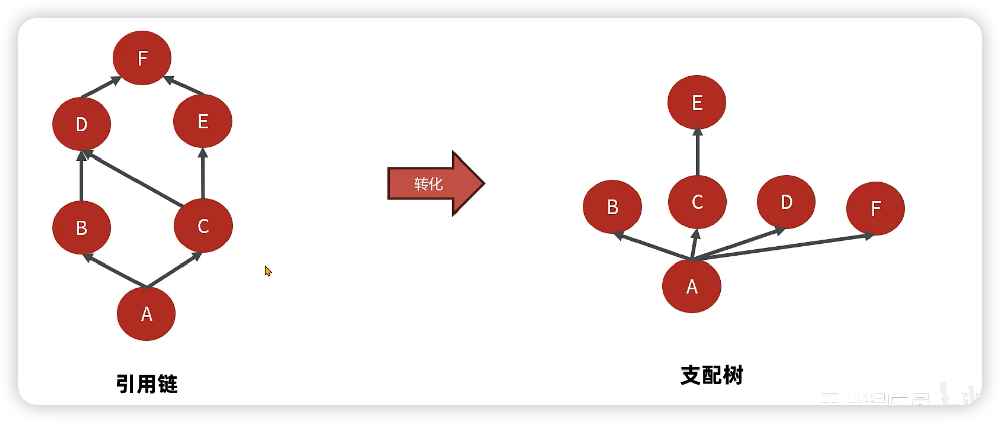


支配树中对象本身占用的空间称之为浅堆（Shallow Heap）.支配树中对象的子树就是所有被该对象支配的内容，这些内容组成了对象的深堆 （Retained Heap），也称之为保留集（Retained Set）。深堆的大小表示该对象如果可以被回收，能释放多大的内存空间。

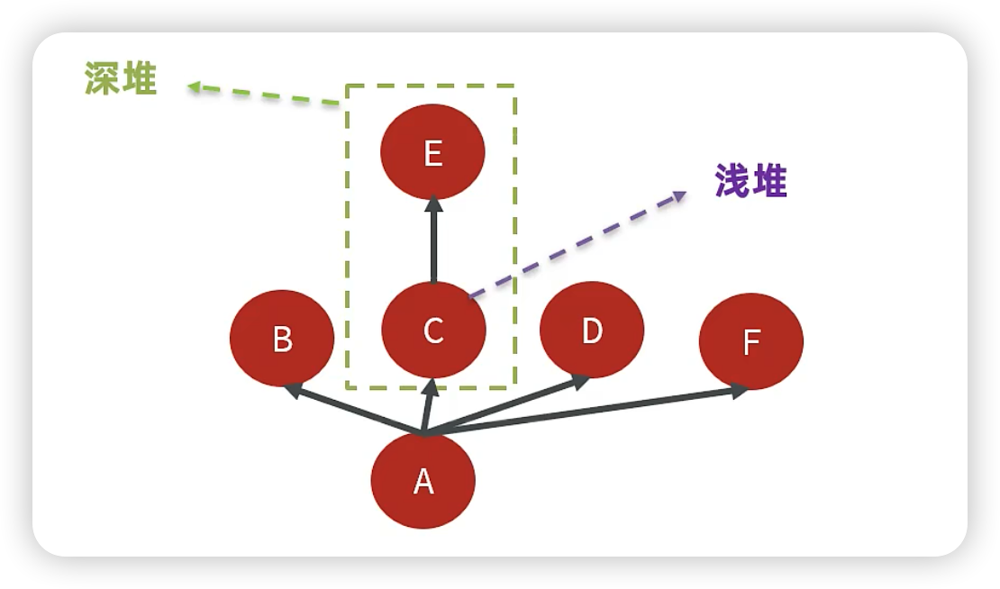

打印用对象的组成和大小

```
  <dependency>
            <groupId>org.openjdk.jol</groupId>
            <artifactId>jol-core</artifactId>
            <version>0.9</version>
        </dependency>
```

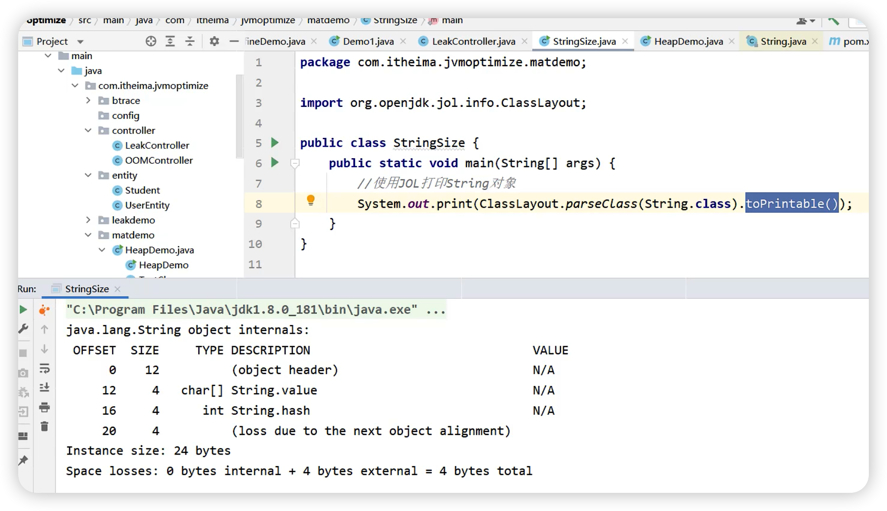

> 导出运行中系统的内存快照并进行分析


- 通过JDK自带的jmap命令导出，格式为：jmap -dump:live,format=b,file=文件路径和文件名进程ID

- 通过arthas的heapdump命令导出，格式为：heapdump --live 文件路径和文件名


> 分析超大堆的内存照


在程序员开发用的机器内存范围之内的快照文件，直接使用MAT打开分析即可。但是经常会遇到服务器上的程序占用的内存达到10G以上，开发机无法正常打开此类内存快照，此时需要下载服务器操作系统对应的MAT。下载地址：https://eclipse.dev/mat/downloads.php
通过MAT中的脚本生成分析报告：

```shell
./ParseHeapDump.sh 快照文件路径 org.eclipse.mat.apisuspects org.eclipse.mat.api:overview org.eclipse.mat.api:top_components
```

注意：默认MAT分析时只使用了1G的堆内存，如果快照文件超过1G，需要修改MAT目录下的
MemoryAnalyzer.ini配置文件调整最大堆内存。


**线上出现OOM内存溢出时，需要增加JVM参数，导出内存快照**

**线上出现OOM内存溢出时，需要增加JVM参数，导出内存快照**

**线上出现OOM内存溢出时，需要增加JVM参数，导出内存快照**


##### 内存溢出案例：Mybatis导致的内存溢出

Mybatis在使用foreach进行sql拼接时，会在内存中创建对象，如果foreach处理的数组或者
集合元素个数过多，会占用大量的内存空间。


##### 内存溢出案例：导出大文件Excel

使用hutools-BigExcelWriter

esayexcel

##### 内存溢出案例 ThreadLocal使用时占用大量内存

很多微服务会选择在拦截器preHandle方法中去解析请求头中的数据，并放入一些数据到ThreadLocal中方便后续使用。在拦截器的afterCompletion方法中，必须要将ThreadLocal中的数据清理掉。

##### 内存溢出案例 ：文章审核

使用MQ，队列

##### 

## GC调优

GC调优指的是对垃圾回收(Garbage Collection)进行调优。GC调优的主要目标是避免由垃圾回收

引起程序性能下降。

GC调优的核心分成三部分:

1、通用JVM参数的设置。

2、特定垃圾回收器的JVM参数的设置

3、解决由频繁的FULLGC引起的程序性能问题


### GC调优核心指标

#### 1、吞吐量(Throughput)

吞吐量分为业务吞吐量和垃圾回收吞吐量

业务吞吐量指的在一段时间内，程序需要完成的业务数量。比如企业中对于吞吐量的要求可能

会是这样的:

- 支持用户每天生成10000笔订单
- 在晚上8点到10点，支持用户查询50000条商品信息


保证高吞吐量的常规手段有两条:

- 优化业务执行性能，减少单次业务的执行时间
- 优化垃圾回收吞吐量

#### 2、延迟

延迟指的是从用户发起一个请求到收到响应这其中经历的时间

- 所有的请求必须在5秒内返回给用户结果

- 延迟 = GC延迟 + 业务执行时间


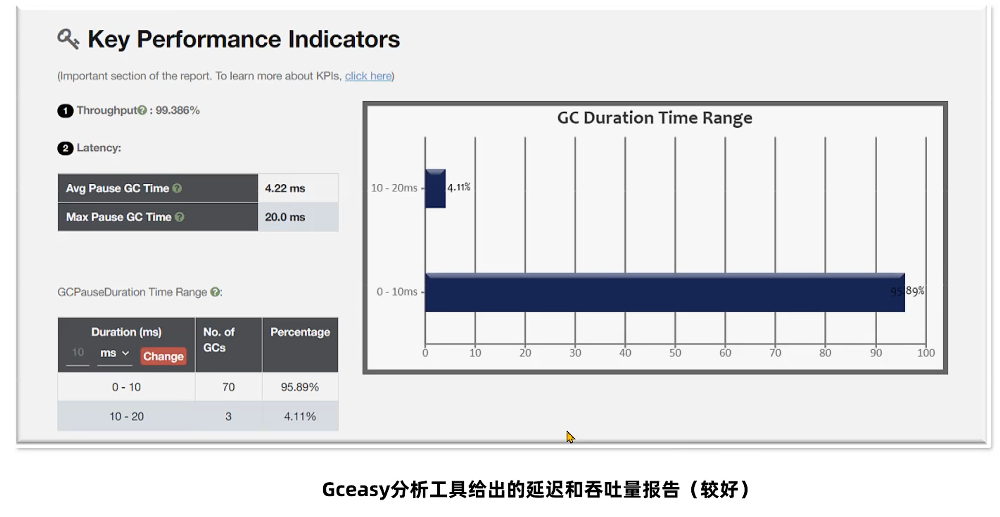

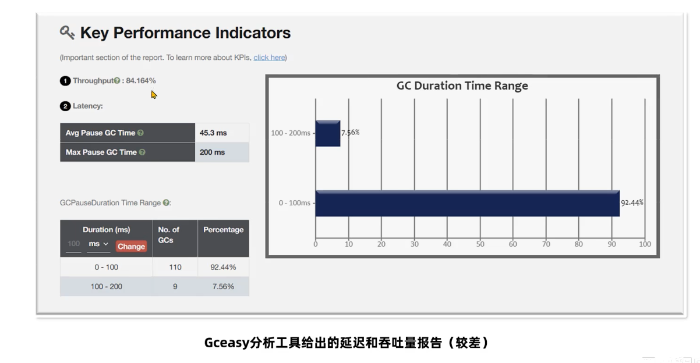

#### 3、内存使用量

指Java应用占用系统内存的最大值，越小越好

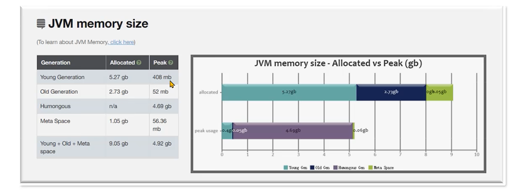

### GC调优方法

#### 发现问题

> 调优步骤

1. 发现问题： 通过监控工具尽可能早地发现GC时间过长、频率过高的现象
2. 诊断问题：通过分析工具，诊断问题的产生原因
3. 修复问题： 调整JVM参数或者修复源代码中的问题
4. 测试验证：在测试环境运行之后获得GC数据，验证问题是否解决

##### jstat工具

- jstat工具是JDK自带的一款监控工具，可以提供各种垃圾回收、类加载、编译信息等不同的数据。
- 命令： jstat -gc 进程ID 每次统计的间隔(毫秒) 统计次数

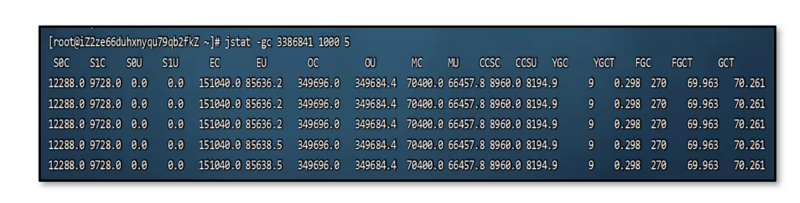

- c 代表capacity容量，U代表Used使用量
- S - 幸存者区，E - 伊园区，0 - 老年代，M - 元空间
- YGC、YGT: 年轻代GC次数和GC耗时 (单位:秒)
- FGC: 次数
- FGCT:耗时
- GCT:  总耗时

##### visual VM

- Visual VM中提供了一款Visual Tool插件，
- 实时监控Java进程的堆内存结构堆内存变化趋势

- 垃圾回收时间的变化趋势。

- 监控对象晋升的直方图


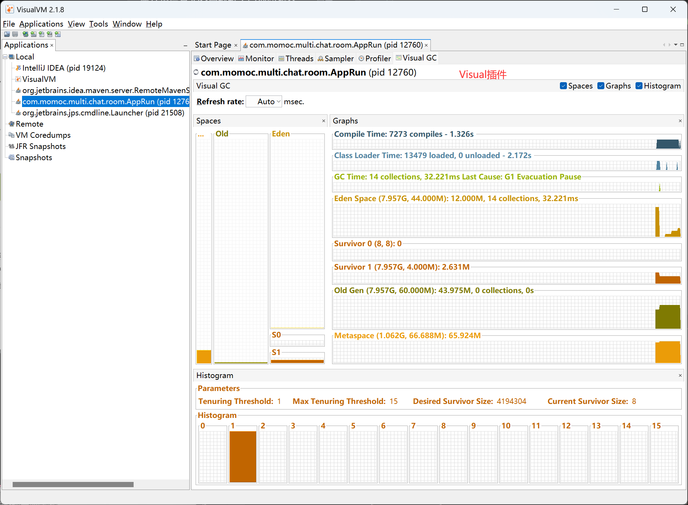

优点: 适合开发使用，能直观的 看到堆内存和GC的变化趋势
缺点: 对程序运行性能有一定影响生产环境程序员一般没有权限进行操作

##### Prometheus + Grafana

前面有简单介绍


#####  GC日志

通过GC日志，可以更好的看到垃圾回收细节上的数据，同时也可以根据每款垃圾回收器的不同特点更好地发现存在的问题

```shell
# JDK 8及以下
-XX:+PrintGCDetails -Xloggc:文件名
# JDK9及之后
-Xlog:gc*:file=文件名
```


> 使用GC View将GC日志转换成可视化图表

https://github.com/chewiebug/GCViewer

使用方法:

``` sh
java -jar gcviewer-1.36.jar E:\devTools\vmlog\chatmvlog.log.2
```

如

```log
[0.004s][info][gc,init] CardTable entry size: 512
[0.004s][info][gc     ] Using G1
[0.005s][info][gc,init] Version: 20.0.1+9-29 (release)
[0.005s][info][gc,init] CPUs: 20 total, 20 available
[0.005s][info][gc,init] Memory: 32581M
[0.005s][info][gc,init] Large Page Support: Disabled
[0.005s][info][gc,init] NUMA Support: Disabled
[0.005s][info][gc,init] Compressed Oops: Enabled (32-bit)
[0.005s][info][gc,init] Heap Region Size: 1M
[0.005s][info][gc,init] Heap Min Capacity: 8M
[0.005s][info][gc,init] Heap Initial Capacity: 100M
[0.005s][info][gc,init] Heap Max Capacity: 100M
[0.005s][info][gc,init] Pre-touch: Disabled
[0.005s][info][gc,init] Parallel Workers: 15
[0.005s][info][gc,init] Concurrent Workers: 4
[0.005s][info][gc,init] Concurrent Refinement Workers: 15
[0.005s][info][gc,init] Periodic GC: Disabled
[0.005s][info][gc,metaspace] CDS archive(s) mapped at: [0x0000000800000000-0x0000000800c60000-0x0000000800c60000), size 12976128, SharedBaseAddress: 0x0000000800000000, ArchiveRelocationMode: 0.
[0.005s][info][gc,metaspace] Compressed class space mapped at: 0x0000000801000000-0x0000000841000000, reserved size: 1073741824
[0.005s][info][gc,metaspace] Narrow klass base: 0x0000000800000000, Narrow klass shift: 0, Narrow klass range: 0x100000000
[0.240s][info][gc,start    ] GC(0) Pause Young (Normal) (G1 Evacuation Pause)
.....

```


##### GCeasy

**AI机器学习技术**在线进行GC分析和诊断的工具。

定位内存泄漏、GC延迟高的问题，提供JVM参数优化建议，支持在线的可视化工具图表展示。

官方网站: https://gceasy.io/


##### 常见的GC模式

1、正常情况

特点：呈现锯齿状，对象创建之后内存上升，一旦发生垃圾回收之后下降到底部，并且每次下降之后的内存大小
接近，存留的对象较少。

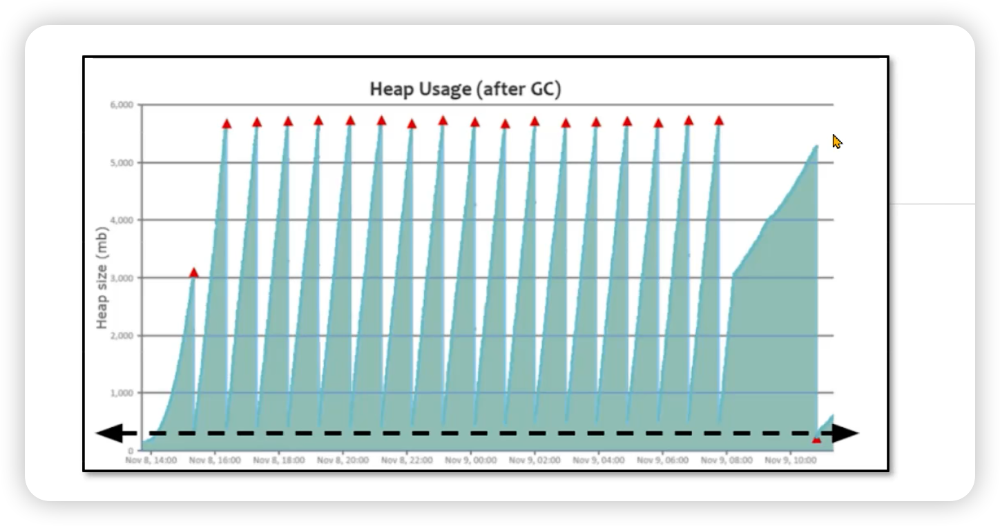

2、缓存对象过多

特点：呈现锯齿状，对象创建之后内存上升，一旦发生垃圾回收之后下降到底部，并且每次下降之后的内存大小

接近，处于比较高的位置。

问题产生原因：

程序中保存了大量的缓存对象，导致GC之后无法释放，可以使用MAT或者HeapHero等工具进行

分析内存占用的原因。

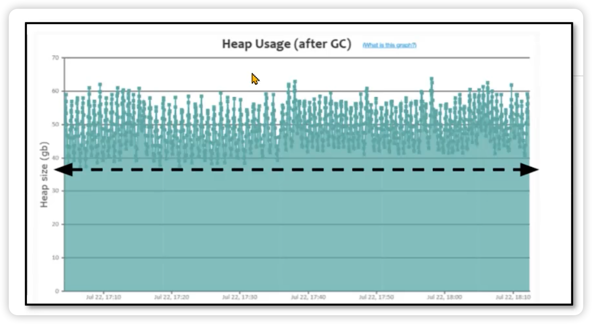

3、内存泄露

特点：呈现锯齿状，每次垃圾回收之后下降到的内存位置越来越高，最后由于垃圾回收无法释放空间导致对象无法分配产生OutofMemory的错误。
问题产生原因：程序中保存了大量的内存泄漏对象，导致GC之后无法释放，可以使用MAT或者HeapHero等工具
进行分析是哪些对象产生了内存泄漏。

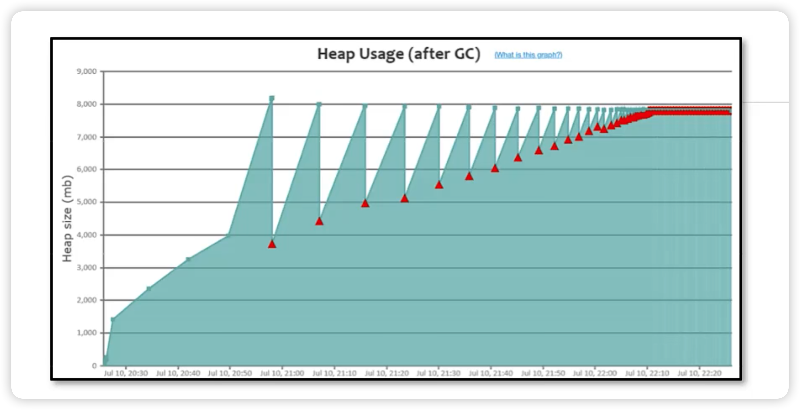

4、持续的FullGC

特点：在某个时间点产生多次FuL1 GC，CPu使用率同时飙高，用户请求基本无法处理。一段时间之后恢复正常。
问题产生原因：在该时间范围请求量激增，程序开始生成更多对象，同时垃圾收集无法跟上对象创建速率，导致
持续地在进行FULL GC。

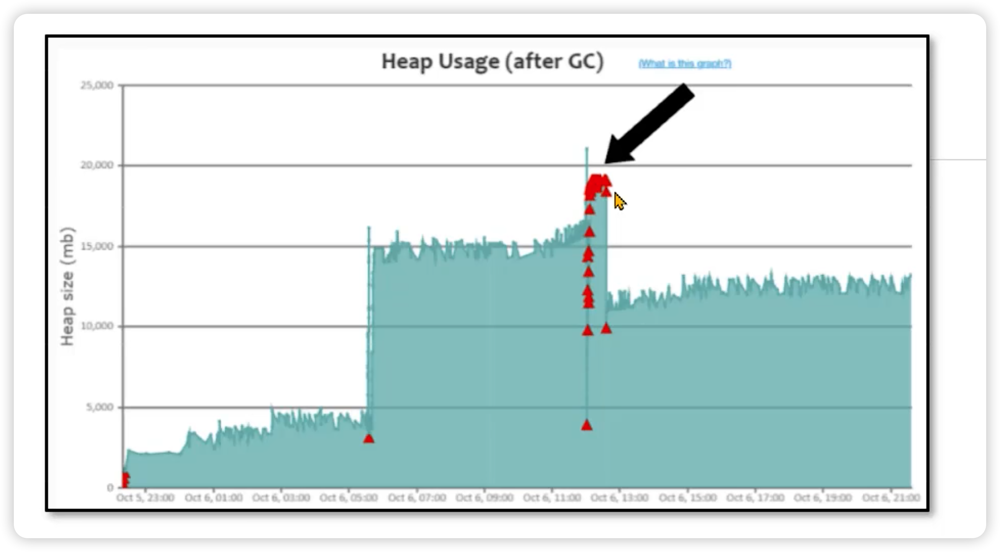

5、元空间不足导致的FullGC

特点：堆内存的大小并不是特别大，但是持续发生FULLGC。
问题产生原因： 元空间大小不足，导致持续FULLGC回收元空间的数据。GC分析报告

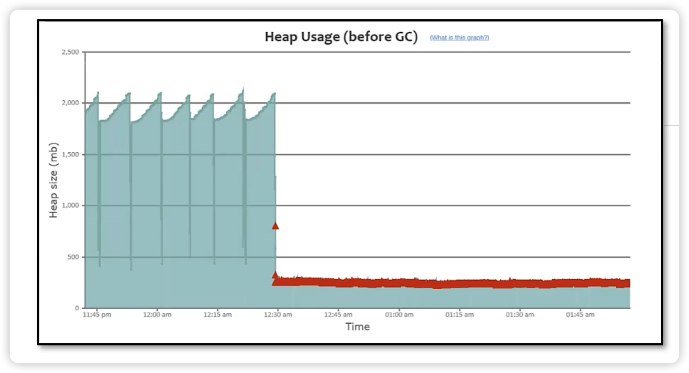


#### 解决GC问题的手段


##### （1）优化基础JVM参数

基础JVM参数的设置不当，会导致频繁FULLGC的产生


> 所有JVM虚拟机参数

https://docs.oracle.com/javase/8/docs/technotes/tools/unix/java.html#BGBCIEFC


> 参数1：- Xmx 和 -Xms

-Xmx参数设置的是最大堆内存，但是由于程序是运行在服务器或者容器上，计算可用内存时，要将元空间、操作

系统、其它软件占用的内存排除掉。

案例：服务器内存4G，操作系统+元空间最大值+其它软件占用1.5G，-Xmx可以设置为2g。

最合理的设置方式应该是根据**最大并发量估算服务器**的配置，然后再根据服务器配置计算最大堆内存的值。


-Xms用来设置初始堆大小，**建议将-Xms设置的和-Xmx一样大**，有以下几点好处：

- 运行时性能更好，堆的扩容是需要向操作系统申请内存的，这样会导致程序性能短期下降。

- 可用性问题，如果在扩容时其他程序正在使用大量内存，很容易因为操作系统内存不足分配失败。
- 启动速度更快，Oracle官方文档的原话：如果初始堆太小，Java 应用程序启动会变得很慢，因为 JVM 被迫频繁执行垃圾收集，直到堆增长到更合理的大小。为了获得最佳启动性能，请将初始堆大小设置为与最大堆大小相同。

> 参数2： -XX: MaxMetaspaceSize  -XX:MetaspaceSize

MAX参数指的是最大元空间大小，默认值比较大，如果出现元空间内存泄漏会让操作系统可用内存不可控，建议根据测试情况设置最大值，一般设置为256m。

-XX：Metaspacesize=值 指：**达到该值之后会触发FULLGC**（网上很多文章的初始元空间大小是错误的），后续什么时候再触发JVM会自行计算。如果设置为和MaxMetaspacesize一样大，就不会FULLGC，但是对象也无法
回收。


> 参数3：-Xss虚拟机栈大小

- 语法：-Xss栈大小或-XX:ThreadStackSzie=1024
- 单位：字节（默认，必须是 1024 的倍数）、K或者K（KB）、m或者M（MB）、g或者G（GB）


> 参数4：不建议手动设置的参数

由于JVM底层设计极为复杂，一个参数的调整也许让某个接口得益，但同样有可能影响其他更多接口。

- -Xmn 年轻代的大小，默认值为整个堆的1/3，可以根据峰值流量计算最大的年轻代大小，尽量让对象只存放在年轻代，不进入老年代。但是实际的场景中，接口的响应时间、创建对象的大小、程序内部还会有一些定时任务等不确定因素都会导致这个值的大小并不能仅凭计算得出，如果设置该值要进行大量的测试。G1垃圾回收器尽量不要设置该值，G1会动态调整年轻代的大小。

- -XX：SurvivorRatio 伊甸园区和幸存者区的大小比例，默认值为8。
- -XX:MaxTenuringThreshold 最大晋升國值，年龄大于此值之后，会进入老年代。
- 另外JVM有动态年龄判断机制：将年龄从小到大的对象占据的空间加起来，如果大于survivor区域的50%，然后把等于或大于该年龄的对象,放入到老年代。

> 其他参数

- -XX：+DisableExplicitGC 禁止在代码中使用System.gc()，System.gc()可能会引起FULLGC，在代码中尽量不要使用。使用DisableExplicitGc参数可以禁止使用System.gc()方法调用。

- -XX：+HeapDumpOnoutofMemoryError：发生OutofMemoryError错误时，自动生成hprof内存快照文件。
- -XX：HeapDumpPath=<path>：指定hprof文件的输出路径。
- 打印GC日志
    - JDK8及之前：-XX：+PrintGCDetails -xX：+PrintGCDatestamps-XLoggc：文件路径
    - JDK9及之后：-xlog：gc*：file=文件路径


> JVM参数模板


```sh
-Xmslg
-Xmxlg
-Xss256k
-XX: MaxMetaspaceSize=512m
-XX:+DisableExplicitGC
-XX:+HeapDumpOnouto fMemoryError
-XX:HeapDumpPath=/opt/Logs /my-service.hprof
-XX:+PrintGCDetails
-XX:+PrintGCDateStamps
-Xloggc：文件路径
```

注意：
JDK9及之后gc日志输出修改为 -XLog:gc*：file=文件名 堆内存大小和栈内存大小根据实际情况灵活调整。


##### （2）减少对象产生

大多数场景下的FULLGC是由于对象产生速度过快导致的，减少对象产生可以有效的缓解FULLGC的发生

##### （3）更换垃圾回收器

选择适合当前业务场景的垃圾回收器，减少延迟、提高吞吐量

> 案例

垃圾回收器的选择
背景：小李负责的程序在高峰期遇到了性能瓶颈，团队从业务代码入手优化了多次也取得了不错的效
果，这次他希望能采用更合理的垃圾回收器优化性能。

思路：

1、编写Jmeter脚本对程序进行压测，同时添加RT响应时间、每秒钟的事务数等指标进行监控。

2、选择不同的垃圾回收器进行测试，并发量分别设置50、 100、 200，观察数据的变化情况。

3、组合测试

- JDK8 下 ParNew + CMS组合：-XX：+UseParNewGC -XX：+UseConcMarkSweepGC

- 默认组合：PS + PO
- JDK8使用G1：-XX：+ UseG1GC
- JDK11 默认G1

机器参数设置：-Xms8g -xss256k. -XX: MetaspaceSize=512m -XX: +DisableExplicaitGC

- ps + po 50并发：260ms 100 并发：474ms 200并发：930ms
- cms  50：157ms  200并发：833ms
- G1 JDK11 200：248ms


##### （4）优化垃圾回收器参数


GC调优没有没有唯一的标准答案

如何调优与硬件、程序本身、使用情况均有关系，重点学习调优的工具和方法


> CMS优化案例

这部分优化效果未必出色，仅当前边的一些手动无效时才考虑。

**CMS的并发模式失败（concurrent mode failure） 现象**

由于CMS的垃圾清理线程和用户线程是并行进行的，如果在并发清理的过程中老年代的空间不足以容纳放入老年代的对象，会产生并发模式失败。并发模式失败会导致Java虚拟机使用**Serial o1d单线程**进行FULLGc回收老年代，出现长时间的停顿。

解决方案：
1.减少对象的产生以及对象的晋升。

2.增加堆内存大小

3.优化垃圾回收器的参数，比如-XX：CMSInitiatingOccupancyFraction=值，当**老年代大小到达该阈值时**，会自动进行CMS垃圾回收，通过控制这个参数提前进行老年代的垃圾回收，减少其大小。

JDK8中默认这个参数值为-1，根据其他几个参数计算出阈值：

（（100 - MinHeapFreeRatio） + （double）（CMSTriggerRatio * MinHeapFreeRatio） ～ 100.0）

该参数设置完是不会生效的，必须开启-XX：+UseCMSInitiatingOccupancyOnly参数。


优化垃圾回收器参数

优化垃圾回收器的参数，能在一定程度上提升GC效率


### 案例实战


背景：小李负责的程序在高峰期经常会出现接口调用时间特别长的现象，他希望能优化程序的性能。
思路：

1、生成GC报告，通过Gceasy工具进行分析，判断是否存在GC问题或者内存问题。

2、存在内存问题，通过jmap或者arthas将堆内存快照保存下来。

3、通过MAT或者在线的heaphero工具分析内存问题的原因。

4、修复问题，并发布上线进行测试。


有大量对象不再GC ROOT引用链上


### 性能调优

##### 性能调优解决的问题

应用程序在运行过程中经常会出现性能问题，比较常见的性能问题现象是：

- 通过top命令查看CPU占用率高，接近100甚至多核CPU下超过100都是有可能的。
- 请求单个服务处理时间特别长，多服务使用skywalking等监控系统来判断是哪一个环节性能低下。
- 程序启动之后运行正常，但是在运行一段时间之后无法处理任何的请求（内存和GC正常）。


##### 性能调优方法


>  线程转储（Thread Dump）

提供了对所有运行中的线程当前状态的快照。线程转储可以通过**jstack、 visualvm**等工具获取。其中包含了**线程名、优先级、线程ID、线程状态、线程栈信息**等等内容，可以用来解决CPu占用率高、死锁等问题。

```shell
# JDK自带
jstack 58457
```


线程转储(Thread Dump)中的几个核心内容

- 名称:线程名称，通过给线程设置合适的名称更容易“见名知意
- 优先级 (prio):  线程的优先级
- Java ID (tid): JVM中线程的唯一ID
- 本地ID(nid):   操作系统分配给线程的唯一ID
- 状态:线程的状态，分为:
    - NEW- 新创建的线程，尚未开始执行
    - RUNNABLE-正在运行或准备执行
    - BLOCKED-等待获取监视器锁以进入或重新进入同步块/方法
    - WAITING-等待其他线程执行特定操作，没有时间限制
    - TIMED_WAITING等待其他线程在指定时间内执行特定操作
    - TERMINATED已完成执行
- 栈追踪:显示整个方法的栈恢信息
- 线程转储的可视化在线分析平台!
    - https://istackreview
    - https://fastthread.io


##### 案例1：CPU占用率高问题解决方案

问题:
监控人员通过prometheus的告警发现CPU占用率一直处于很高的情况，通过top命令看到是由于Java程序引起的，希望能快速定位到是哪一部分代码导致了性能问题


1、top -p

```
# 查看进程里面的线程，进入后按H
top-p 进程ID
```

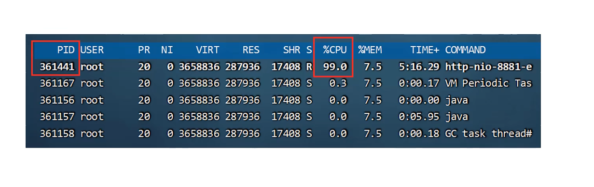

2、摁H，查看线程ID

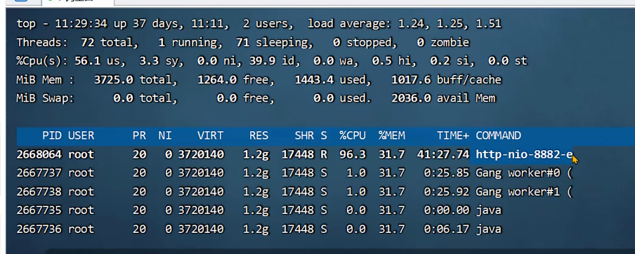


3、保存线程调用栈信息

```shell
jstack 2668064 > test.dump
```


4、找到nid线程ID相同的栈信息，需要将之前记录下的十进制线程号转换成16进制
通过打印%x\n‘线程ID命令直接获得16进制下的线程ID

```shell
# 转换成线程nid
printf '%x\n' 2668064 
```

遗留问题:如果方法中嵌套方法比较多，如何确定栈信息中哪一个方法性能较差?

注意：在定位CPU占用率高的问题时，比较需要关注的是状态为RUNNABLE的线程。但实际上，有一些线程执行本地方法时并不会消耗CPU，而只是在等待。但JVM 仍然会将它们标识成“RUNNABLE”状态。


##### 案例2: 接口响应时间很长的问题

问题:在程序运行过程中，发现有几个接口的响应时间特别长，需要快速定位到是哪一个方法的代码执行过程中出现了性能问题。

解决思路:
已经确定是某个接口性能出现了问题，但是由于方法嵌套比较深，需要借助于arthas定位到具体的方法。


###### Arthas 的 trace命令

使用arthas的trace命令，可以展示出整个方法的调用路径以及每一个方法的执行耗时

命令: trace 类名 方法名

- 添加 --skipJDKMethod false 参数可以输出JDK核心包中的方法及耗时
- 添加“#cost >毫秒值’ 参数，只会显示耗时超过该毫秒值的调用
- 添加-n 数值参数，最多显示该数值条数的数据
- 所有监控都结束之后，输入stop结束监控，重置arthas增强的对象

```shell
trace 全类名路径 -a -skipJDKMethod  false'#cost > 1000' -n 1
```


###### Arthas的watch命令

在使用trace定位到性能较低的方法之后，使用watch命令监控该方法，可以获得更为详细的方法信息。
命令: watch 类名 方法名 ' {params， returnobj} ' #cost>毫秒值' -x 2

-  {params，returnobj} 代表打印参数和返回值
- -x 代表打印的结果中如果有嵌套(比如对象里有属性)，最多只展开2层。允许设置的最大值为4
- 所有监控都结束之后，输入stop结束监控，重置arthas增强的对象


##### 案例3： 定位偏底层的性能问题

问题:有一个接口中使用了for循环向ArrayList中添加数据，但是最终发现执行时间比较长，需要定位是由于什么原因导致的性能低下。

解决思路:  Arthas提供了性能火焰图的功能，可以非常直观地显示所有方法中哪些方法执行时间比较长

###### Arthas的profile命令,生成性能监控的火焰图

命令1: profiler start 开始监控方法执行性能
命令2: profiler stop --format html 以HTML的方式生成火焰图

火焰图中一般找绿色部分Java中栈顶上比较平的部分，很可能就是性能的瓶颈

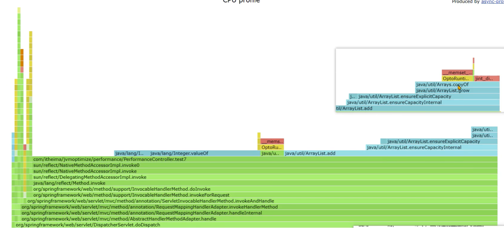

##### 案例4: 线程被耗尽问题

问题:

程序在启动运行一段时间之后，就无法接受任何请求了。将程序重启之后继续运行，依然会出
现相同的情况。
解决思路:
线程耗尽问题，一般是由于执行时间过长，分析方法分成两步

- 1、检测是否有死锁产生，无法自动解除的死锁会将线程永远阻塞
- 2、如果没有死锁，再使用案例1的打印线程栈的方法检测线程正在执行哪个方法，一般这些大量出现的方法就是慢方法

死锁:两个或以上的线程因为争夺资源而造成互相等待的现象


定位方式：

###### 1、jstack -l 进程ID > 文件名

将栈保存到本地

搜索deadlock

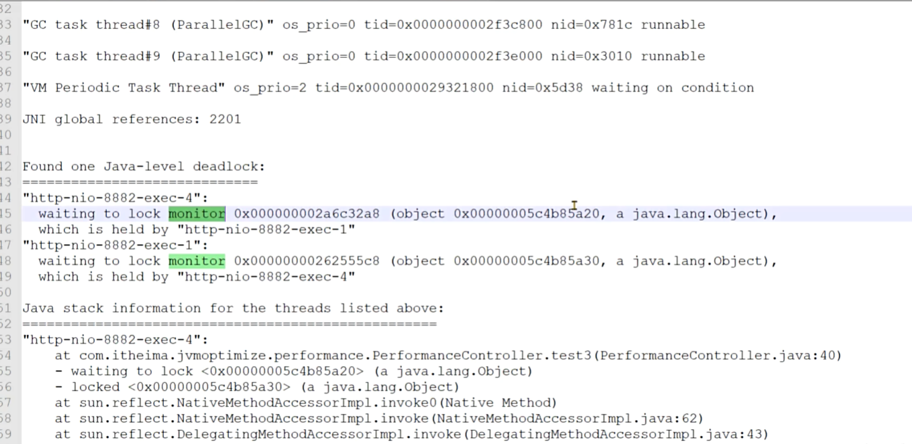

###### 2、开发环境中使用visual vm或者Jconsole工具

可以检测出死锁。使用线程快照生成工具
就可以看到死锁的根源。生产环境的服务一般不会允许使用这两种工具连接

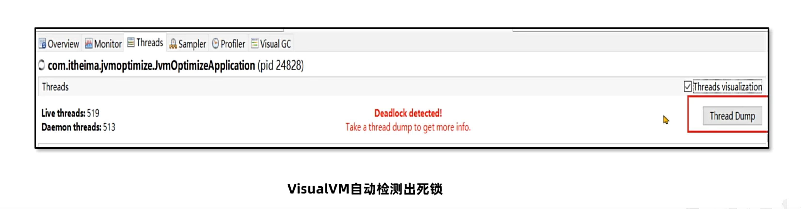

###### 3、fastthread

使用fastthread自动检测线程问题。https://fastthread.io
Fastthread 和 Gceasy类似，是一款在线的自动线程问题检测工具，可以提供线程分析报告
通过报告查看是否存在死锁问题


> JIT对程序性能的影响

Java程序在运行过程中，JIT即时编译器会实时对代码进行性能优化，所以仅凭少量的测试是无法真实反应运行系统最终给用户提供的性能。如下图，随着执行次数的增加，程序性能会逐渐优化。


##### JMH的使用

> 正确地测试代码性能

OpenJDK 中提供了一款叫JMH的工具，可以准确地对Java(Java Microbenchmark Harness) 量化方法的执行性能官网地址: https://github.com/openjdk/jmh

会首先执行预热过程，确果。正的迭代测试，最后输出测试的结JIT对代码进行优化之后再进行真的迭代测试，最后输出测试结果

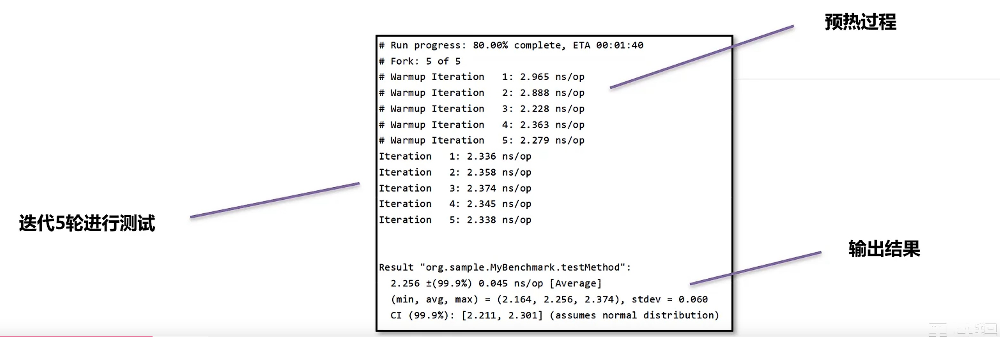


（1）创建maven项目，自动生成代码与目标自行更改jmh版本，目前是1.37版本

```sh
mvn archetype:generate  -DinteractiveMode=false  -DarchetypeGroupId=org.openjdk.jmh   -DarchetypeArtifactId=jmh-java-benchmark-archetype  -DgroupId=org.sample   -DartifactId=test   -Dversion=1.0
```

(2) 编写示例

```java
package org.sample;

import org.openjdk.jmh.annotations.*;

import java.util.concurrent.TimeUnit;


//预热次数 时间
@Warmup(iterations = 5, time = 1)
//启动多少进程,和启动参数
@Fork(value = 1, jvmArgs = {"-Xms1g", "-Xmx1g"})
//指定显示结果
@BenchmarkMode(Mode.AverageTime)
//指定显示结果单位
@OutputTimeUnit(TimeUnit.NANOSECONDS)
//变量共享范围
@State(Scope.Benchmark)
public class MyBenchmark {

    @Benchmark
    public void testMethod() {
        // place your benchmarked code here

        int i =0;
        i++;
        return;
    }
    //直接启动，但是有缺点，无法拿到注解变量
    public static void main(String[] args) throws RunnerException {

        Options build = new OptionsBuilder()
                .include(MyBenchmark.class.getSimpleName())
                .forks(1)
                .build();
        new Runner(build).run();
    }

}


```


编写测试方法，几个需要注意的点:

- 死代码问题
- 黑洞的用法


```java
    //黑洞问题解决方案
	@Benchmark
    public void testMethod(Blackhole bh) {
        // place your benchmarked code here

        int i =0;
        i++;
        //黑洞消费，避免死代码产生
        bh.consume(i);
    }
```


通过maven的verify命令，检测代码问题并打包成jar包。通过java -jar target/benchmarks.jar 命令执行基准测试,

测试结果通过https://jmh.morethan.io/生成可视化的结果。

> 案例：日期格式化方法性能测试

在JDK8中，可以使用Date进行日期的格式化，也可以使用LocalDateTime进行格式化，使用JMH对比这两种格式化的性


1、Date对象使用的SimpleDateFormatter是线程不安全的，所以每次需要重新创建对象或者将对象放入ThreadLocal中进行保存。其中每次重新创建对象性能比较差，将对象放入ThreadLocal之后性能相对还是比较好的。

2、LocalDateTime对象使用的DateTimeFormatter线程安全，并且性能较好，如果能将
DateTimeFormatter对象保存下来，性能可以得到进一步的提升

结论：

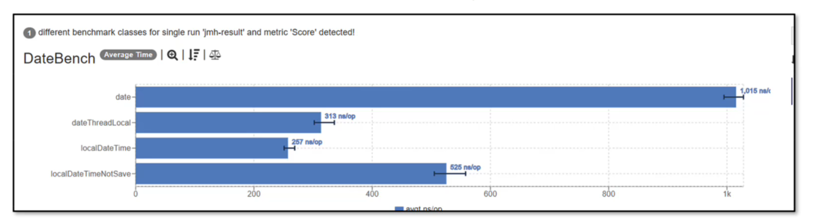

```java
//预热次数 时间
@Warmup(iterations = 5, time = 1)
//启动多少进程,和启动参数
@Fork(value = 1, jvmArgs = {"-Xms1g", "-Xmx1g"})
//指定显示结果
@BenchmarkMode(Mode.AverageTime)
//指定显示结果单位
@OutputTimeUnit(TimeUnit.NANOSECONDS)
//变量共享范围
@State(Scope.Benchmark)
public class DateBenchmark {

    private static String format = "yyyy-MMdd HH:mm:ss";

    private Date date =new Date();

    private LocalDateTime localDateTime = LocalDateTime.now();

    @Benchmark
    public void testDate(Blackhole blackhole){
        String format1 = threadLocal.get().format(date);

        blackhole.consume(format1);
    }

    @Benchmark
    public void testLocalDateTime(Blackhole blackhole){
        String format1 = localDateTime.format(DateTimeFormatter.ofPattern(format));
        blackhole.consume(format1);
    }

    public static ThreadLocal<SimpleDateFormat> threadLocal = new ThreadLocal<SimpleDateFormat>(){
        @Override
        protected SimpleDateFormat initialValue() {
            return new SimpleDateFormat(format);
        }
    };


    public static ThreadLocal<DateTimeFormatter> dateTimeFormatterThreadLocal = new ThreadLocal<DateTimeFormatter>(){
        @Override
        protected DateTimeFormatter initialValue() {
            return DateTimeFormatter.ofPattern(format);
        }
    };

    @Benchmark
    public void testThreadLocalDate(Blackhole blackhole){
        String format1 = threadLocal.get().format(date);

        blackhole.consume(format1);
    }

    @Benchmark
    public void testThreadLocalLocalDateTime(Blackhole blackhole){
        String format1 = localDateTime.format(dateTimeFormatterThreadLocal.get());
        blackhole.consume(format1);
    }


    public static void main(String[] args) throws RunnerException {
        Options build = new OptionsBuilder()
                .include(DateBenchmark.class.getSimpleName())
                .forks(1)
                .resultFormat(ResultFormatType.JSON)
                .build();
        new Runner(build).run();
    }
}
```


##### 实战案例：性能调优综合实战

问题:
小李的项目中有一个获取用户信息的接口性能比较差，他希望能对这个接口在代码中
进行彻底的优化，提升性能。
解决思路:
1、使用trace分析性能瓶颈
2、优化代码，反复使用trace测试性能提升的情况
3、使用JMH在SpringBoot环境中进行测试。
4、比对测试结果


总结：

1、本案例中性能问题产生的原因是两层for循环导致的循环次数过多，处理时间在循
环次数变大的情况下变得非常长，考虑将一层循环拆出去，创建HashMap用来查询
提升性能。
2、使用LocalDateTime替代SimpleDateFormat进行日期的格式化
3、使用stream流改造代码，这一步可能会导致性能下降，主要是为了第四次优化准
4、使用并行流利用多核C

##### 面试题

你是如何判断一个方法需要耗时多少时间的?


回复：我会在方法上打印开始时间和结束时间，他们的差值就是方法的执行耗时。手动通过postman或者jmeter发起一笔请求，在控制台上看输出的时间。

解答：这样做是不准确的，第一测试时有些对象创建是懒加载的，所以会影响第一次的请求时间，第二因为虚拟机中JIT即时编译器会优化你的代码，所以你这个测试得出的时间并不一定是最终用户处理的时间。


走完上面案例得出结论：

我们使用了OpenJDK中的jmh基准测试框架对某些特定的方法比如加密算法进行基准测试，jmh
可以完全模拟运行环境中的Java虚拟机参数，同时支持预热能通过JIT执行优化后的代码获得更为准确的数据。


1、岗位的主要工作内容

2、岗位发展空间

3、领导期待

4、入准

5、部门架构和团队

6、项目进展和技术路线
