# 一、GraalVM


## 介绍

GraalVM是Oracle官方推出的一款高性能JDK，使用它享受比OpenJDK或者OracleJDK更好的性能

GraalVM的官方网址: https://www.graalvm.org/
官方标语: Build faster, smaller, leaner applications，


- 支持Truffle框架运行其他语言

- 更低的CPU、内存使用率


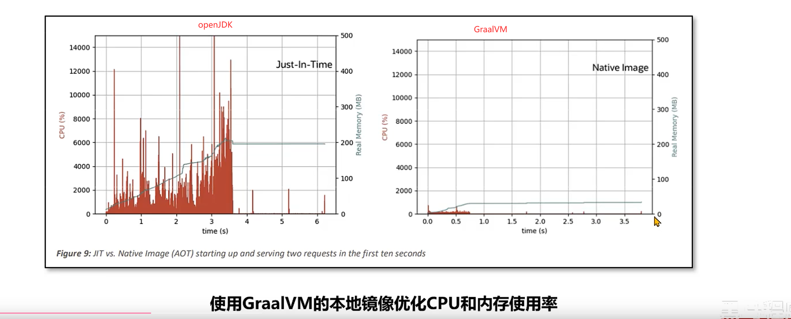

- 更快的启动速度，无需预热

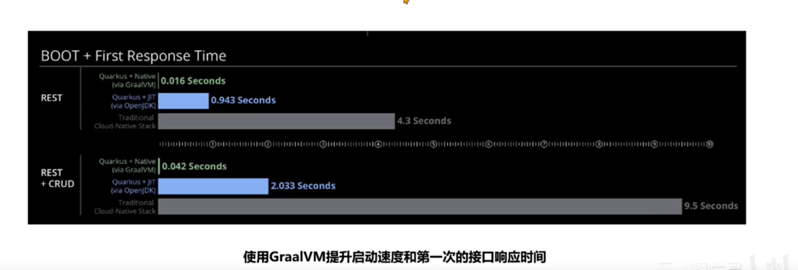

## 两种运行模式


### JIT ( Just-In-Time ) 模式

JIT模式的处理方式与Oracle JDK类似，满足两个特点:

- Write Once,Run Anywhere ->一次编写，到处运行
- 预热之后，通过内置的Graal即时编译器优化热点代码，生成比HotspotJIT更高性能的机器码


```shell
# 关闭graal编译器,JIT
-XX:-UseJVMCiCompiler
```


### AOT(Ahead-Of-Time) 模式

提前编译模式


AOT 编译器通过源代码，为特定平台创建可执行文件。比如，在Windows下编译完成之后，:
会生成exe文件。通过这种方式，达到启动之后获得最高性能的目的。但是不具备跨平台特性，不同平台使用需要单独编译.这种模式生成的文件称之为**Native lmage本地镜像**

> 使用

1、安装Linux环境本地镜像制作需要的依赖库https://www.graalvm.org/latest/reference-manual/native-image/#prerequisites
2、使用 native-image 类名 制作本地镜像。
3、运行本地镜像可执行文件


> 性能对比


社区版的GraalVM使用本地镜像模式性能不如HotspotJVM的JIT模式，但是企业版的性能相对会高很多.

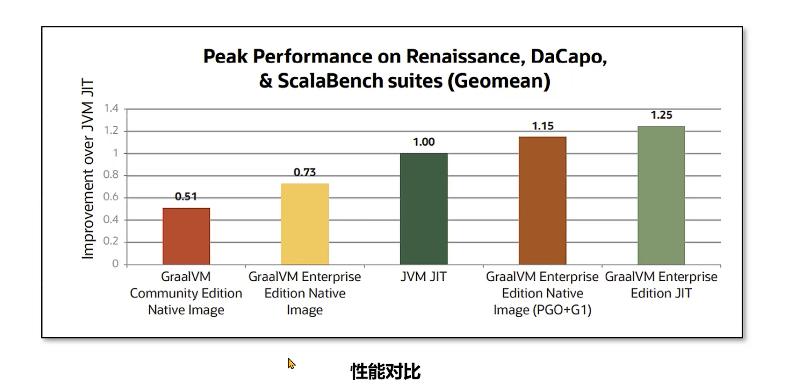


> GraalVM存在的问题


GraalVM的AOT模式虽然在启动速度、内存和CPU开销上非常有优势，但是使用这种技术会带来几个问题

1. 跨平台问题，在不同平台下运行需要编译多次。编译平台的依赖库等环境要与运行平台保持一致。
2. 使用框架之后，编译本地镜像的时间比较长，同时也需要消耗大量的CPU和内存。
3. AOT 编译器在编译时，需要知道运行时所有可访问的所有类。但是Java中有一些技术可以在运行时创建类例如反射、动态代理等。这些技术在很多框架比如Spring中大量使用，所以框架需要对AOT编译器进行适配解决类似的问题。


解决方案:
1、使用公有云的Docker等容器化平台进行在线编译，确保编译环境和运行环境是一致的，同时解决了编译资源问题。
2、使用SpringBoot3等整合了GraalVM AOT模式的框架版本


## 案例

SpringBoot3对GraalVM进行了完整的适配，所以编写GraalVM服务推荐使用SpringBoot3
步骤:
1、使用 https://start.spring.io/ spring提供的在线生成器构建项目
2、编写业务代码
3、执行 mvn -Pnative clean native:compile 命令生成本地镜像.
4、运行本地镜像

## 适用场景

1、对性能要求比较高的场景，可以选择使用收费的企业版提升性能
2、公有云的部分服务是按照CPU和内存使用量进行计费的，使用GraalVM可以
有效地降低费用。

## 参数优化和故障诊断

- 社区版只能使用串行垃圾回收器 (Serial GC)，使用串行垃圾回收器的默认最大 Java 堆大小会设置为物理内存大小的 80%，调整方式为使用 -Xmx最大堆大小。如果希望在编译期就指定该大小，可以在编译时添加参数-R:MaxHeapsize=最大堆大小。

- G1垃圾回收器只能在企业版中使用，开启方式为添加--gc=G1参数，有效降低垃圾回收的延迟。
- 另外提供一个Epsilon GC，开启方式:--gc=epsilon ，它不会产生任何的垃圾回收行为所以没有额的内存、CPU开销。如果在公有云上运行的程序生命周期短暂不产生大量的对象，可以使用该垃圾回收器以节省最大的资源。
  xX:+PrintGc -xX:+VerboseGc 参数打印垃圾回收详细信息


# 二、垃圾回收器的技术演进


## （一）垃圾回收期的技术演进


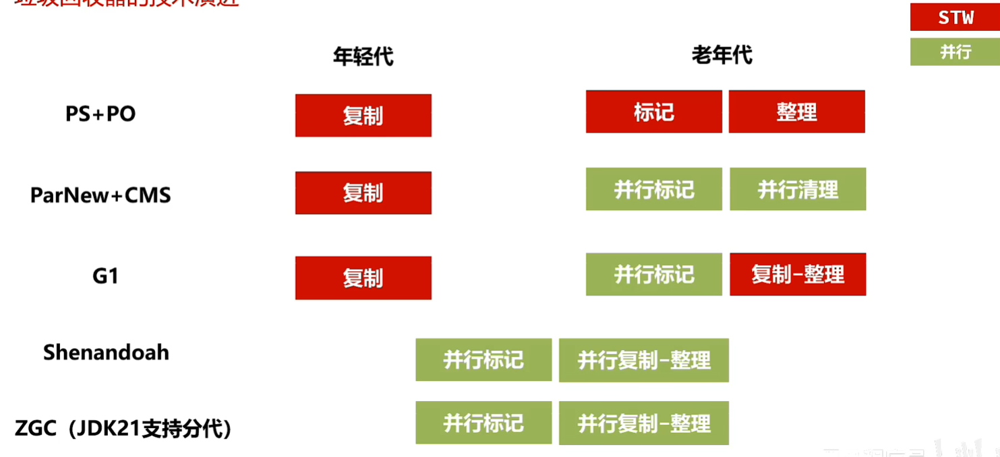


不同的垃圾回收器设计的目标是不同的，如下图所示

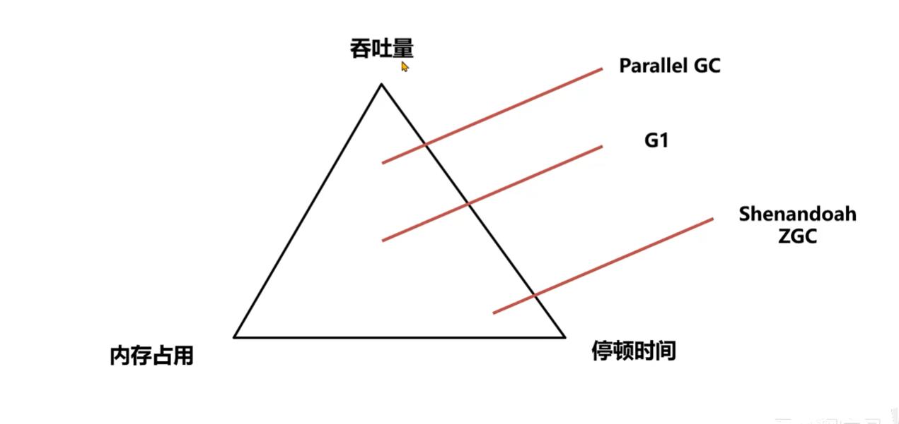

## （二）ShennandoahGC

Shenandoah 是由Red Hat开发的-款低延迟的垃圾收集器，Shenandoah 并发执行大部分GC工作，包括并发的整理，堆大小对STW的时间基本没有影响。

1、下载。Shenandoah只包含在OpenJDK中，默认不包含在内需要单独构建，可以直接下载构建好的。

下载地址: https://builds.shipilev.net/openjdk-jdk-shenandoah/

```shell
# 开启UseShenandoashGC
-XX:+UseShenandoashGC
#日志
Xlog:gc
```


## （三） ZGC


ZGC 是一种可扩展的低延迟垃圾回收器。ZGC 在垃圾回收过程中，STW的时间不会超过一毫秒，适合需要低延迟的应用。支持几百兆到16TB 的堆大小，堆大小对STW的时间基本没有影响。

ZGC降低了停顿时间，能降低接口的最大耗时，提升用户体验。但是吞吐量不佳，所以如果Java服务比较关注QPS(每秒的查询次数)那么G1是比较不错的选择。

### ZCG版本迭代

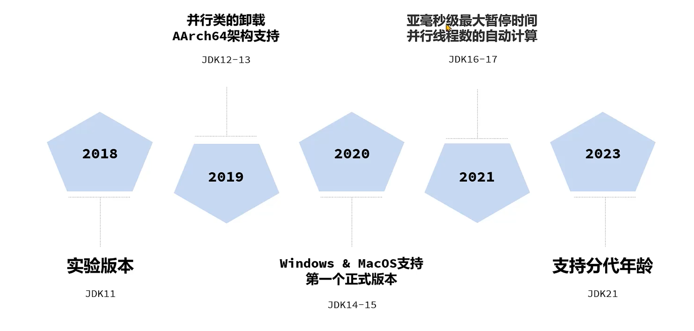

### ZGC使用方法

OracleJDK和OpenJDK中都支持ZGC，阿里的DragonWell龙井JDK也支持ZGC属于其自行对OpenJDK 11的ZGC进行优化的版本。
建议使用JDK17之后的版本，延迟较低同时无需手动配置并行线程数

```shell
#分代ZGC添加如下参数启用 
-XX:+UseZGC -XX:+ZGenerational
# 非分代 ZGC通过命令行选项启用 
-XX:+UseZGC
```

ZGC在设计上做到了自适应，根据运行情况自动调整参数，让用户手动配置的参数最少化

- 自动设置年轻代大小，无需设置-Xmn参数
- 自动晋升闽值(复制中存活多少次才搬运到老年代)，无需设置-XX:TenuringThreshold.
- JDK17之后支持自动的并行线程数，无需设置-XX:ConcGCThreads.

> 需要设置的参数

**Xmx值最大堆内存大小**

这是ZGC最重要的一个参数，必须设置。ZGC在运行过程中会使用一部分内存用来处理垃圾回收，所以尽量保证堆中有足够的空间。设置多少值取决于对象分配的速度，根据测试情况来决定

可以设置的参数:
**XX:SoftMaxHeapSize=**
ZGC会尽量保证堆内存小于该值，这样在内存靠近这个值时会尽早地进行垃圾回收，但是依然有可能会超过该值例如，-Xmx5g -XX:SoftMaxHeapsize=4g 这个参数设置，GC会尽量保证堆内存小于4GB，最多不会超过5GB。

### ZGC的调优

ZGC中可以使用Linux的Huge Page大页技术优化性能，提升吞吐量、降低延迟

注意:安装过程需要root权限，所以ZGC默认没有开启此功能。

操作步骤
1、计算所需页数，Linuxx86架构中大页大小为2MB，根据所需堆内存的大小估算大页数量。比如堆空间需要16G，预留2G (JVM需要额外的一些非堆空间)，那么页数就是18G/2MB = 9216。
2、配置系统的大页池以具有所需的页数(需要root权限):echo X >/svs/kernel/mm/hugepages/hugepages-2048kB/nr_hugepages
3、添加参数-XX:+UseLargePages 启动程序进行测试


## 实战案例：内存不足时的垃圾回收测试

实战篇中的案例完善


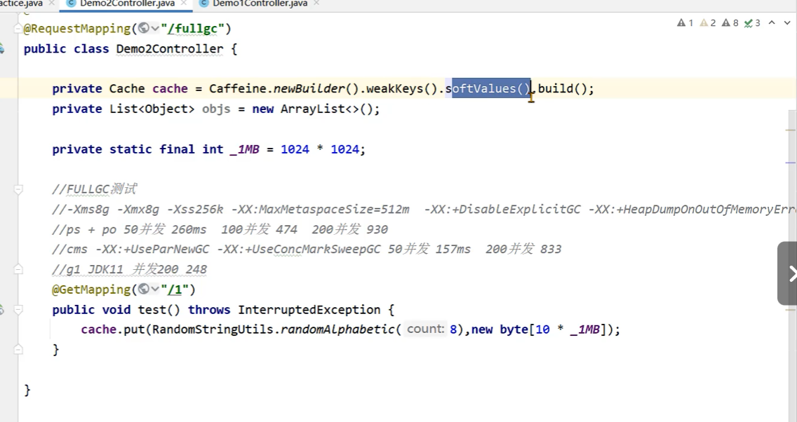

需求
Java服务中存在大量软引用的缓存导致内存不足，测试下g1、Shenandoah、ZGC这三种垃圾收器在这种场景下的回收情况

步骤
1、启动程序，添加不同的虚拟机参数进行测试
2、使用Apache Benchmark测试工具对本机进行压测
3、生成GC日志，使用GcEasy进行分析。
4、对比压测之后的结果


结果

ZGC和Shenandoah设计的目标都是追求较短的停顿时间，他们具体的使用场景如下：

两种垃圾回收器在并行回收时都会使用垃圾回收线程占用CPU资源

- 在内存足够的情况下，ZGC垃圾回收表现的效果会更好，停顿时间更短
- 在内存不是特别充足的情况下，shenandoah GC表现更好，并行垃圾回收的时C间较短，用户请求的执行效率比较高

# 三、Java工具

> 常见的Java工具有以下几类

1、诊断类工具，如Arthas、 VisualVM等.
2、开发类工具，如Idea、Eclipse。
3、APM应用性能监测工具，如skywalking、 Zipkin等
4、热部署工具，如Jrebel等

> 面试题引入

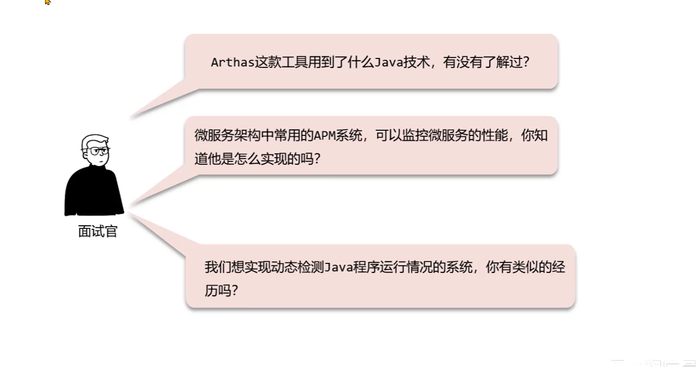

Arthas这款工具用到了什么Java技术，有没有了解过？
回答：
Arthas主要使用了Java Agent技术，这种技术可以让运行中的Java程序执行
Agent中编写代码。
Arthas使用了Agent中的动态加载模式，可以选择让某个特定的Java进程加载
Agent并执行其中的监控代码。监控方面主要使用的就是JMX提供的一些监控指
标，同时使用字节码增强技术，对某些类和某些方法进行增强，从而监控方法的
执行耗时、参数等内容。


APM系统是如何获取到Java程序运行中的性能数据的？
回答：
APM系统比如Skywalking主要使用了Java Agent技术，这种技术可以让运行中的Java程
序执行Agent中编写代码。
Skywalking编写了Java Agent，使用了Agent中的静态加载模式，使用字节码增强技术，
对某些类和某些方法进行增强，从而监控方法的执行耗时、参数等内容。比如对
Controller层方法增强，获取接口调用的时长信息，对数据库连接增强，获取数据库查询
的时长、SQL语句等信息。


## （一）Java Agent技术

Java Agent技术是JDK提供的用来编写Java工具的技术，使用这种技术生成一种特殊的jar包，这种ar包可以让Java程序运行其中的代码。

#### 静态加载模式

静态加载模式可以在程序启动的一开始就执行我们需要执行的代码，适合用APM等性能监测系统从一开始就监控程序的执行性能。静态加载模式需要在JavaAgent的项目中编写一个premain的方法，并打包成jar包。


```java
//1 
public static void premain(String agentArgs, Instrumentation inst);    
//2  启动监控
java -javagent:./agent.jar -jar test.jar
```


#### 动态加载模式

动态加载模式可以随时让java agent代码执行，适用于Arthas等诊断系统。动态加载模式需要在Java Agent的项目中编写一个agentmain的方法，并打包成jar包。

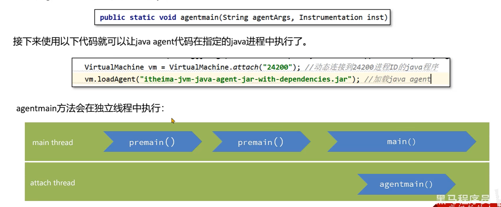

#### 环境配置

> 搭建Java agetn静态加载模式的环境


步骤：
1、创建maven项目，添加maven-assembly-plugin插件，此插件可以打包出java agent的jar包。


```xml
<?xml version="1.0" encoding="UTF-8"?>
<project xmlns="http://maven.apache.org/POM/4.0.0"
         xmlns:xsi="http://www.w3.org/2001/XMLSchema-instance"
         xsi:schemaLocation="http://maven.apache.org/POM/4.0.0 http://maven.apache.org/xsd/maven-4.0.0.xsd">
    <modelVersion>4.0.0</modelVersion>

    <groupId>org.example</groupId>
    <artifactId>testJavaAgent</artifactId>
    <version>1.0</version>

    <properties>
        <maven.compiler.source>8</maven.compiler.source>
        <maven.compiler.target>8</maven.compiler.target>
        <project.build.sourceEncoding>UTF-8</project.build.sourceEncoding>
    </properties>

    <dependencies>

    </dependencies>
    <build>
        <plugins>
            <plugin>
                <groupId>org.apache.maven.plugins</groupId>
                <artifactId>maven-assembl-plugin</artifactId>
                <version>2.4</version>
                <configuration>
                    <descriptorRefs>
                        <descriptorRef>jar-with-dependencies</descriptorRef>
                    </descriptorRefs>
                    <archive>
                        <manifestFile>src/main/resources/MANIFEST.MF</manifestFile>
                    </archive>
                </configuration>
            </plugin>
        </plugins>
    </build>
</project>
```


2、编写类和premain方法，premain方法中打印一行信息。

```java
package org.example;

import java.lang.instrument.Instrumentation;

/**
 * @author momoc
 * @version 1.0
 * @className AgentMain
 * @description
 * @date 2024/4/15 10:22
 */
public class AgentMain {
    public static void premain(String agentArgs, Instrumentation inst){
        System.out.println("premain执行了。。。。");
    }

    public static void agentmain(String agentArgs, Instrumentation inst){
        System.out.println("agentmain run。。。。");
    }
}

```


3、编写MANIFEST.MF文件，此文件主要用于描述java agent的配置属性，比如使用哪一个类的
premain方法。

```yaml
Manifest-Version:  1.0
Premain-Class: org.example.AgentMain
Agent-Class: org.example.AgentMain
Can-Redefine-Classes: true
Can-Retransform-Classes: true
Can-Set-Native-Method-Prefix: true
```


4、使用maven-assembly-plugin进行打包。

5、创建spring boot应用，并静态加载上一步打包完的java agent。

```shell
-Dserver.port=28050 -XX:+UseG1GC  -verbose:gc  -XX:MaxMetaspaceSize=256m -Xms1024m -Xmx1024m -XX:MetaspaceSize=200m -javaagent:/Users/momoc/Desktop/yj/testJavaAgent/target/testJavaAgent-1.0-jar-with-dependencies.jar
```


> 动态加载环境

增加类即可

```java
package org.example;

import com.sun.tools.attach.AgentInitializationException;
import com.sun.tools.attach.AgentLoadException;
import com.sun.tools.attach.AttachNotSupportedException;
import com.sun.tools.attach.VirtualMachine;
import java.io.IOException;

/**
 * @author momoc
 * @version 1.0
 * @className AttachMain
 * @description
 * @date 2024/4/15 10:40
 */
public class AttachMain {
    public static void main(String[] args) throws IOException, AttachNotSupportedException, AgentLoadException, AgentInitializationException {
        //绑定动态进程
        VirtualMachine vm = VirtualMachine.attach("36324");
        vm.loadAgent("/Users/momoc/Desktop/yj/testJavaAgent/target/testJavaAgent-1.0-jar-with-dependencies.jar");

    }
}
```


#### 实战案例1： 简化版Arthas

需求：
编写一个简化版的Arthas程序，具备以下几个功能：

1、查看内存使用情况
2、生成堆内存快照
3、打印栈信息
4、打印类加载器
5、打印类的源码
6、打印方法执行的参数和耗时

该程序是一个独立的Jar包，可以应用于任何Java编写的系统中。具备以下特点：代码无侵入性、操作简单、性能高。


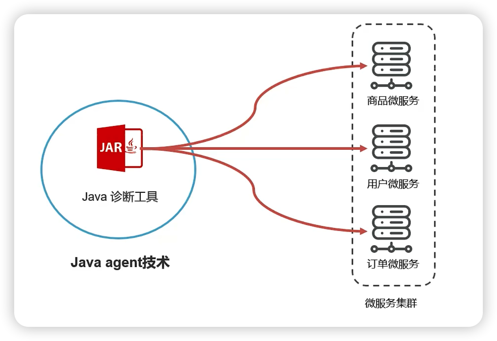


> 获取运行时信息一 JMX技术

JDK从1.5开始提供了Java Management Extensions （IMx） 技术，通过Mbean对象的写入和获取，实现：

- 运行时配置的获取和更改

- 应用程序运行信息的获取（线程栈、内存、类信息等）


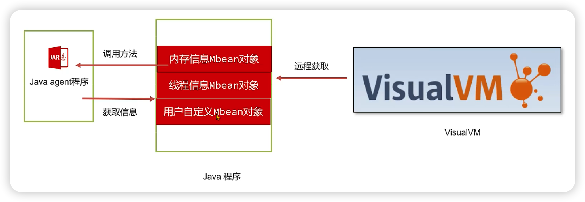


获取JVM默认提供的Mbean可以通过一下方式，如获取内存信息


```java
ManagementFactory.getMemoryManagerMXBeans();

```

ManagementFactory提供了一系列的方法获取各种各样的信息：

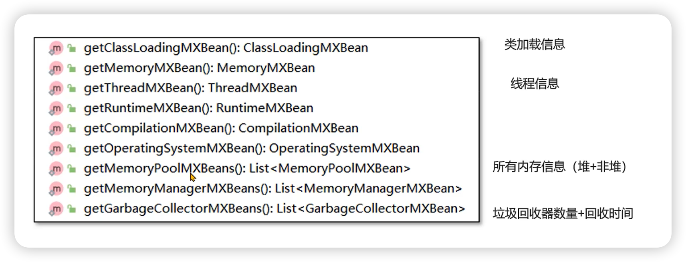


更多的信息可以通过ManagementFactory.getPlatformMXBeans获取，比如：

```java
        List<BufferPoolMXBean> platformMXBeans = ManagementFactory.getPlatformMXBeans(BufferPoolMXBean.class);
```


通过这种方式，获取到了Java虚拟机中分配的直接内存和内存映射缓冲区的大小。

```java
        HotSpotDiagnosticMXBean platformMXBean = ManagementFactory.getPlatformMXBean(HotSpotDiagnosticMXBean.class);
```

获取到虚拟机诊断用的MXBean，通过这个Bean对象可以生成内存快照。


> Instrumentation对象

该对象有以下几个作用：
1、 redefine，重新设置类的字节码信息。
2、 retransform，根据现有类的字节码信息进行增强。
3、获取所有己加载的类信息。

文档：JDK8

https://docs.oracle.com/javase/8/docs/api/java/lang/instrument/Instrumentation.html

> 打印类的源码

打印类的源码需要分为以下几个步骤

1、获得内存中的类的字节码信息。利用instrumentation提供的转换器来获取字节码信息
2、通过反编译工具将字节码信息还原成源代码信息, 使用**JD-core**

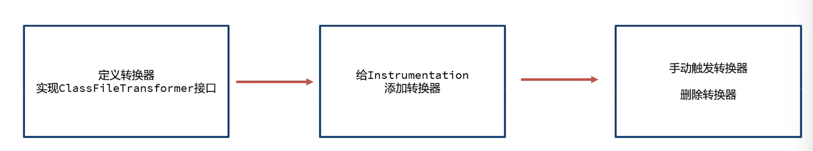


> 打印方法执行的参数和耗时


打印方法执行的参数和耗时需要对原始类的方法进行增强，可以使用类似于Spring AOP这类面向切面编程的方式
但是考虑到并非每个项目都使用了Spring这些框架，所以我们选择的是最基础的字节码增强框架。字节码增强框架是在当前类的字节码信息中插入一部分字节码指令，从而起到增强的作用。

ASM的官方网址: https://asm.ow2.io

1、以来

```xml
<!-- https://mvnrepository.com/artifact/org.ow2.asm/asm -->
<dependency>
    <groupId>org.ow2.asm</groupId>
    <artifactId>asm</artifactId>
    <version>9.7</version>
</dependency>

```

2、创建基础框架，此代码为固定代码

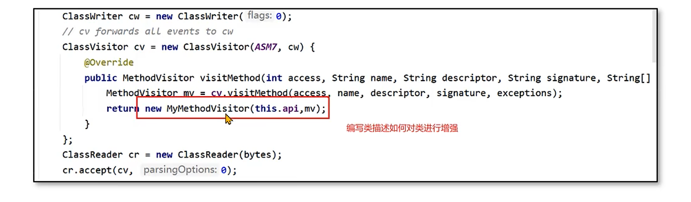


3、编写一个类描述如何去增强类，类需要继承自MethodVisitor

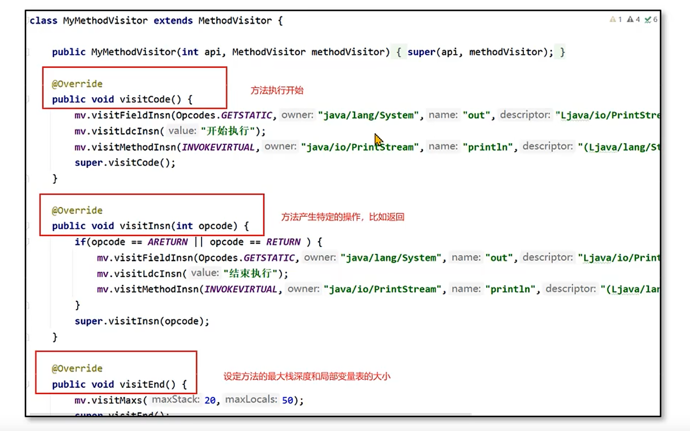

> 打印方法执行的参数和耗时 - Byte Buddy

Byte Buddy 是一个代码生成和操作库，用于在 Java 应用程序运行时创建和修改 Java 类，而无需编译器的帮助。
Byte Buddy底层基于ASM，提供了非常方便的APl。

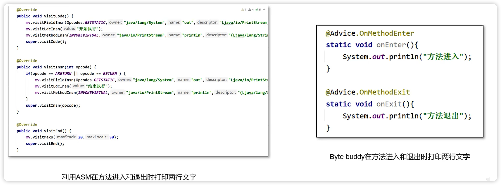

1\使用

```xml
<!-- https://mvnrepository.com/artifact/net.bytebuddy/byte-buddy-agent -->
<dependency>
    <groupId>net.bytebuddy</groupId>
    <artifactId>byte-buddy-agent</artifactId>
    <version>1.14.13</version>
    <scope>test</scope>
</dependency>
<!-- https://mvnrepository.com/artifact/net.bytebuddy/byte-buddy -->
<dependency>
    <groupId>net.bytebuddy</groupId>
    <artifactId>byte-buddy</artifactId>
    <version>1.14.13</version>
</dependency>

```

2、模板代码增强


```java
 public static void enhanceClassByteBuddy(Instrumentation inst) {
        System.out.println("请输入类名:");
        Scanner scanner = new Scanner(System.in);

        String className = scanner.next();
        for (Class<?> allLoadedClass : inst.getAllLoadedClasses()) {
            if (allLoadedClass.getName().equals(className)){

                new AgentBuilder.Default()
                        //禁止byte buddy处理时修改类名
                        .disableClassFormatChanges()
                        //处理时使用retransformation增强
                        .with(AgentBuilder.RedefinitionStrategy.RETRANSFORMATION)
                        //打印错误日志
                        .with(new AgentBuilder.Listener.WithTransformationsOnly(AgentBuilder.Listener.StreamWriting.toSystemOut()))
                        .type(ElementMatchers.named(className))
                        .transform((builder, typeDescription, classLoader, javaModule, protectionDomain) -> {
                            //增强，使用MyAdvice通知，对所有方法增强
                            return builder.visit(Advice.to(MyAdvice.class).on(ElementMatchers.any()));
                        }).installOn(inst); 


            }

        }
    }
```


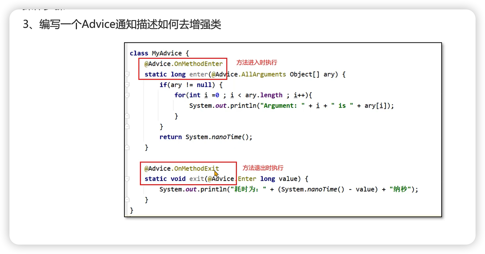

> 打包可启动Jar类

需要用到maven-shade-plugin插件，要指定启动的主方法


### Java Agent参数获取


在Java Agent中，可以通过如下的方式传递参数

```shell
java -javaagent：. /agent.jar=参数 -jar test. jar
java -javaagent：. /agent.jar=param1=valuel,param2=value2 -jar test. jar
```

接下来通过premain参数中的agentArgs字段获取：

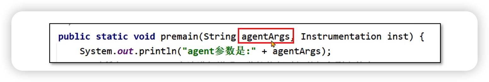

## （二）APM系统


Application performance monitor （APM） 应用程序性能监控系统是采集运行程序的实时数据并使用可视化的方式！使用APM可以确保系统可用性，优化服务性能和响应时间，持续改善用户体验。常用的APM系统有Apache skywalking、Zipkin等。
Skywalking官方网站：https://skywalking.apache.orgl


需求：
编写一个简化版的APM数据采集程序，具备以下几个功能：
1、无侵入性获取spring boot应用中，controller层方法的调用时间。
2、将所有调用时间写入文件中。
问题：

Java agent 采用静态加载模式 还是 动态加载模式？静态

一般程序启动之后就需要持续地进行信息的采集，所以采用静态加载模式。


> Byte Buddy参数的传递


在Java Agent中如果需要传递参数到Byte Buddy，可以采用如下的方式：
1、绑定Key Value， Key是一个自定义注解，Value是参数的值。

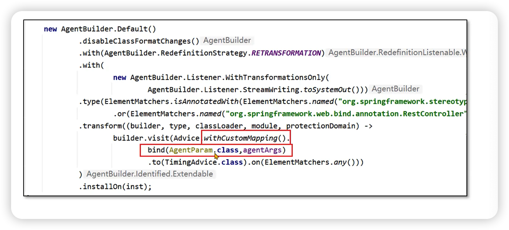

2、自定义注解

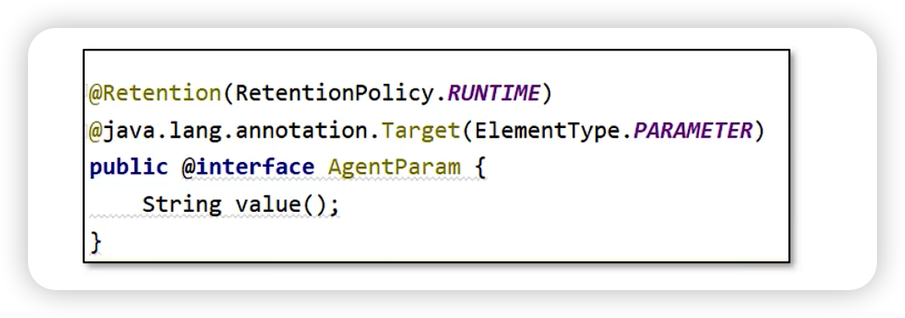

3、通过注解注入


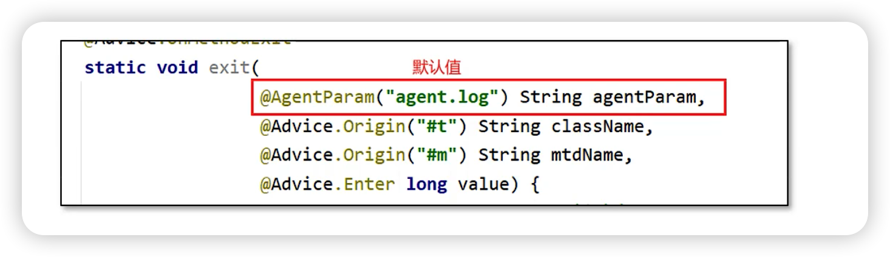


