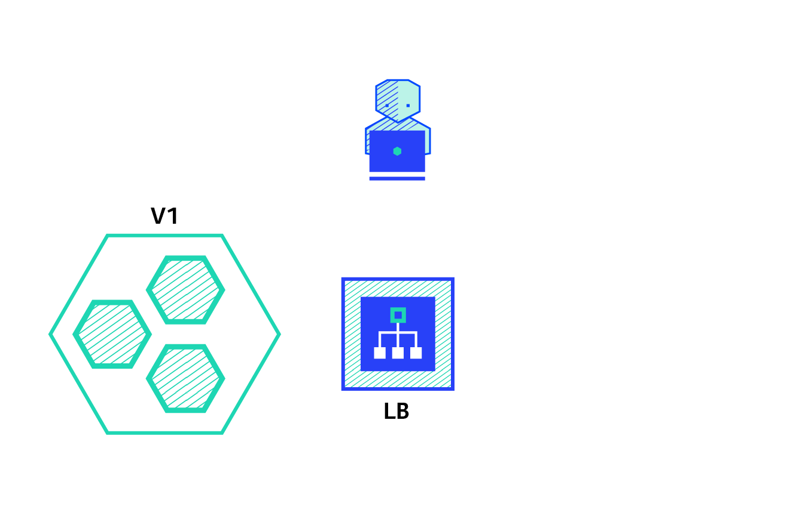

# 一、完整的 Deployment Yaml 文件
```yaml
apiVersion: apps/v1  # 指定api版本，此值必须在kubectl api-versions中  
kind: Deployment  # 指定创建资源的角色/类型   
metadata:  # 资源的元数据/属性 
  name: demo  # 资源的名字，在同一个namespace中必须唯一
  namespace: default # 部署在哪个namespace中
  labels:  # 设定资源的标签
    app: demo
    version: stable
spec: # 资源规范字段
  replicas: 1 # 声明副本数目
  revisionHistoryLimit: 3 # 保留最近 n个 历史版本
  progressDeadlineSeconds: 600   # deployment 部署最长时间(s)
  selector: # 选择器
    matchLabels: # 匹配标签
      app: demo
      version: stable
  strategy: # 策略
    rollingUpdate: # 滚动更新
      maxSurge: 30% # 最大额外可以存在的副本数，可以为百分比，也可以为整数
      maxUnavailable: 30% # 示在更新过程中能够进入不可用状态的 Pod 的最大值，可以为百分比，也可以为整数
    type: RollingUpdate # 滚动更新策略
  template: # 模版
    metadata: # 资源的元数据/属性 
      annotations: # 自定义注解列表
        sidecar.istio.io/inject: "false" # 自定义注解名字
      labels: # 设定资源的标签
        app: demo
        version: stable
    spec: # 资源规范字段
      containers:
      - name: demo # 容器的名字   
        image: demo:v1 # 容器使用的镜像地址   
        imagePullPolicy: IfNotPresent # 每次Pod启动拉取镜像策略，三个选择 Always、Never、IfNotPresent
                                      # Always，每次都检查；Never，每次都不检查（不管本地是否有）；IfNotPresent，如果本地有就不检查，如果没有就拉取 
        resources: # 资源管理
          limits: # 最大使用
            cpu: 300m # CPU，1核心 = 1000m
            memory: 500Mi # 内存，1G = 1024Mi
          requests:  # 容器运行时，最低资源需求，也就是说最少需要多少资源容器才能正常运行
            cpu: 100m
            memory: 100Mi
        livenessProbe: # pod 内部健康检查的设置
          httpGet: # 通过httpget检查健康，返回200-399之间，则认为容器正常
            path: /healthCheck # URI地址
            port: 8080 # 端口
            scheme: HTTP # 协议
            # host: 127.0.0.1 # 主机地址
          initialDelaySeconds: 30 # 表明第一次检测在容器启动后多长时间后开始
          timeoutSeconds: 5 # 检测的超时时间
          periodSeconds: 30 # 检查间隔时间
          successThreshold: 1 # 成功门槛
          failureThreshold: 5 # 失败门槛，连接失败5次，pod杀掉，重启一个新的pod
        readinessProbe: # Pod 准备服务健康检查设置
          httpGet:
            path: /healthCheck
            port: 8080
            scheme: HTTP
          initialDelaySeconds: 30
          timeoutSeconds: 5
          periodSeconds: 10
          successThreshold: 1
          failureThreshold: 5
        #也可以用这种方法   
        #exec: 执行命令的方法进行监测，如果其退出码不为0，则认为容器正常   
        #  command:   
        #    - cat   
        #    - /tmp/health   
        #也可以用这种方法   
        #tcpSocket: # 通过tcpSocket检查健康  
        #  port: number 
        ports:
          - name: http # 名称
            containerPort: 8080 # 容器开发对外的端口 
            protocol: TCP # 协议
      imagePullSecrets: # 镜像仓库拉取密钥
        - name: harbor-certification
      affinity: # 亲和性调试
        nodeAffinity: # 节点亲和力
          requiredDuringSchedulingIgnoredDuringExecution: # pod 必须部署到满足条件的节点上
            nodeSelectorTerms: # 节点满足任何一个条件就可以
            - matchExpressions: # 有多个选项，则只有同时满足这些逻辑选项的节点才能运行 pod
              - key: beta.kubernetes.io/arch
                operator: In
                values:
                - amd64
```


# 二、Deployment 说明
我们需要描述 deployment 期望的目标状态, deployment 可以控制 pod 和 副本数. 

运行一个编写好的 deployment yaml 文件, 会产生三个 工作负载资源:
1. Pod
2. Deployment: 控制 RS
3. ReplicaSet: 控制 Pod 的副本数


# 三、Deployment 更新机制
当 deployment pod 模板(.spec.template) 发生改变时, 例如: 模板的标签或容器镜像被更新, 才会触发 deployment 上线, 其他更新(对deployment扩容) 不会触发上线动作

上线动作原理: 创建新的 rs, 准备就绪后(此时不会删除, 因为 revisionHistoryLimit 指定了保留几个版本), 替换旧的 rs

```yaml
apiVersion: apps/v1
kind: Deployment
metadata:
  name:  deployment-test
  namespace: day11
spec:
  selector:
    matchLabels:
      app: deployment-test
  replicas: 1
  template:
    metadata:
      labels:
        app:  deployment-test
    spec:
      containers:
      - name:  nginx
        image:  nginx:1.19
      restartPolicy: Always
```
部署后查看 pod/deployment/replicaSet
```bash
[root@k8s-master deployment]# kubectl get pod,deployment,rs -n day11
NAME                                   READY   STATUS    RESTARTS   AGE
pod/deployment-test-6f6c84f998-zgxgq   1/1     Running   0          73s

NAME                              READY   UP-TO-DATE   AVAILABLE   AGE
deployment.apps/deployment-test   1/1     1            1           73s

NAME                                         DESIRED   CURRENT   READY   AGE
replicaset.apps/deployment-test-6f6c84f998   1         1         1       73s
```
把 nginx 版本替换成 nginx:1.19-alpine
```yaml
apiVersion: apps/v1
kind: Deployment
metadata:
  name:  deployment-test
  namespace: day11
spec:
  selector:
    matchLabels:
      app: deployment-test
  replicas: 1
  template:
    metadata:
      labels:
        app:  deployment-test
    spec:
      containers:
      - name:  nginx
        image:  nginx:1.19-alpine
      restartPolicy: Always
```
重新部署后再次查看 pod/deployment/replicaSet
```bash
[root@k8s-master deployment]# kubectl get pod,deployment,rs -n day11 
NAME                                   READY   STATUS              RESTARTS   AGE
pod/deployment-test-647cbf5d-g82vt     0/1     ContainerCreating   0          10s
pod/deployment-test-6f6c84f998-zgxgq   1/1     Running             0          3m20s

NAME                              READY   UP-TO-DATE   AVAILABLE   AGE
deployment.apps/deployment-test   1/1     1            1           3m20s

NAME                                         DESIRED   CURRENT   READY   AGE
replicaset.apps/deployment-test-647cbf5d     1         1         0       10s
replicaset.apps/deployment-test-6f6c84f998   1         1         1       3m20s
```
此时可以看见:
 - pod: 有一个正在被创建, 一个正在运行中
 - deployment: 有一个正在准星
 - replicaset: 有两个, 第一个表示应该有一个要启动, 但是没有 ready

过几秒钟再次查看:
```bash
[root@k8s-master deployment]# kubectl get pod,deployment,rs -n day11 
NAME                                 READY   STATUS    RESTARTS   AGE
pod/deployment-test-647cbf5d-g82vt   1/1     Running   0          83s

NAME                              READY   UP-TO-DATE   AVAILABLE   AGE
deployment.apps/deployment-test   1/1     1            1           4m33s

NAME                                         DESIRED   CURRENT   READY   AGE
replicaset.apps/deployment-test-647cbf5d     1         1         1       83s
replicaset.apps/deployment-test-6f6c84f998   0         0         0       4m33s
```
可以看到:
 - pod: 只剩下一个
 - deployment: 有一个
 - replicaset: 有两个, 第一个表示已经是ready状态, 第二个期望有0个 当前有0个 就绪的有0个, 表示没有副本数了

再次更新 nginx 的版本为 nginx:1.19.9-alpine
```bash
[root@k8s-master deployment]# kubectl get pod,deployment,rs -n day11 
NAME                                   READY   STATUS              RESTARTS   AGE
pod/deployment-test-58d8759b45-vmjnw   0/1     ContainerCreating   0          3s
pod/deployment-test-647cbf5d-g82vt     1/1     Running             0          6m3s

NAME                              READY   UP-TO-DATE   AVAILABLE   AGE
deployment.apps/deployment-test   1/1     1            1           9m13s

NAME                                         DESIRED   CURRENT   READY   AGE
replicaset.apps/deployment-test-58d8759b45   1         1         0       3s
replicaset.apps/deployment-test-647cbf5d     1         1         1       6m3s
replicaset.apps/deployment-test-6f6c84f998   0         0         0       9m13s
```
整个更新过程和上面是一致的, 只是每次更新, replicaset 就会多一个。 每个 replicaset 后面都会有一个随机字符串, 这个就会记录每次更新了什么内容, 当有一天要回滚到某次部署时, 就会在那个一replicaset 的副本数设置成对应的副本

例如这里将 nginx 恢复成 nginx:1.19
```bash
apiVersion: apps/v1
kind: Deployment
metadata:
  name:  deployment-test
  namespace: day11
spec:
  revisionHistoryLimit: 15   # 保留最近15个历史版本
  progressDeadlineSeconds: 600   # deployment 部署最长时间(s)
  selector:
    matchLabels:
      app: deployment-test
  replicas: 1
  template:
    metadata:
      labels:
        app:  deployment-test
    spec:
      containers:
      - name:  nginx
        image:  nginx:1.19
      restartPolicy: Always
```
部署完成后, 可以看到, 这次部署 replicaset 没有增加1, 仅仅是将 nginx:1.19 那次的 replicaset 的副本数设置成了1, 最后一次的 nginx:1.19-alpine 的副本数设置成了 0
```bash
[root@k8s-master deployment]# kubectl get pod,deployment,rs -n day11 
NAME                                   READY   STATUS        RESTARTS   AGE
pod/deployment-test-58d8759b45-vmjnw   1/1     Terminating   0          3m57s
pod/deployment-test-6f6c84f998-ckqn7   1/1     Running       0          1s

NAME                              READY   UP-TO-DATE   AVAILABLE   AGE
deployment.apps/deployment-test   1/1     1            1           13m

NAME                                         DESIRED   CURRENT   READY   AGE
replicaset.apps/deployment-test-58d8759b45   0         0         0       3m57s
replicaset.apps/deployment-test-647cbf5d     0         0         0       9m57s
replicaset.apps/deployment-test-6f6c84f998   1         1         1       13m
```

# 四、deployment | rollout
## 4.1 rollout 常用操作
| 子命令| 说明|
|---|---|
| history|查看rollout操作历史|
|pause|将提供的资源设定为暂停状态|
|restart|重启某资源|
|resume|将某资源从暂停状态恢复正常|
|status|查看rollout操作状态|
|undo|回滚前一rollout|


## 4.2 history - 查看 rollout 操作历史
```bash
$ kubectl rollout history deployment deployment-test -n day11
deployment.apps/deployment-test 
REVISION  CHANGE-CAUSE
2         <none>
3         <none>
4         <none>
```
查看指定版本的具体信息
```bash
$ kubectl rollout history deployment deployment-test -n day11 --revision=3
deployment.apps/deployment-test with revision #3
Pod Template:
  Labels:	app=deployment-test
	pod-template-hash=58d8759b45
  Containers:
   nginx:
    Image:	nginx:1.19.9-alpine
    Port:	<none>
    Host Port:	<none>
    Environment:	<none>
    Mounts:	<none>
  Volumes:	<none>
```

我们发现没有更新记录的信息, 原因是因为在创建 deployment 的时候没有配置记录命令, 在创建的时候加上 `--recode` 参数即可

## 4.3 status - 查看 rollout 操作状态
```bash
$ kubectl rollout status deployment deployment-test -n day11
deployment "deployment-test" successfully rolled out
```

## 4.4 pause - 将 rollout 设置为暂停状态
```bash
$ kubectl rollout pause deployment deployment-test -n day11
```
可以通过describe命令确认到Progressing的状态
```bash
$ kubectl describe deployments.apps deployment-test -n day11 | grep Progressing
  Progressing    Unknown  DeploymentPaused
```
此时更新 容器的 image, 不会触发更新
```bash
# 修改image 版本
apiVersion: apps/v1
kind: Deployment
metadata:
  name:  deployment-test
  namespace: day11
spec:
  paused: true               # 暂停 deployment 部署更新
  selector:
    matchLabels:
      app: deployment-test
  replicas: 1
  template:
    metadata:
      labels:
        app:  deployment-test
    spec:
      containers:
      - name:  nginx
        image:  nginx:1.19.8-alpine
      restartPolicy: Always
```

## 4.5 resume - 将 rollout 从暂停状态恢复正常
```bash
$ kubectl rollout resume deployment deployment-test -n day11
```
可以通过describe命令确认到Progressing的状态
```bash
$ kubectl describe deployments.apps deployment-test -n day11 | grep Progressing
  Progressing    True    NewReplicaSetAvailable
```
当 rollout 被恢复后, 上一步修改 image 版本就会被触发
```bash
kubectl get pod -n day11
NAME                               READY   STATUS              RESTARTS   AGE
deployment-test-676fb6497b-tqlj6   0/1     ContainerCreating   0          4s
deployment-test-69bd9887fd-mh5nq   1/1     Running             0          23m
```

## 4.6 restart - 将 rollout 重启
```bash
$ kubectl rollout restart deployment deployment-test -n day11
$ kubectl rollout status deployment deployment-test -n day11
```

## 4.7 undo - 将 rollout 回滚版本
```bash
# 回滚到上一版本
$ kubectl rollout undo deployment deployment-test -n day11
# 回滚到指定版本
$ kubectl rollout undo deployment deployment-test -n day11 -to-revision=1
```

# 五、deployment 更新策略

当升级 deployment 时，可以使用 `.spec.strategy` 指定新 Pod 替换旧 Pod 的策略。

`.spec.strategy.type` 可以是 `Recreate` 或 `RollingUpdate`。`RollingUpdate` 是默认值。


## 5.1 Recreate 重新创建

如果 `.spec.strategy.type==Recreate`，在创建新 Pods 之前，所有现有的 Pods 会被杀死。

## 5.2 RollingUpdate 滚动更新

`.spec.strategy.type==RollingUpdate` 有两个参数:  `maxSurge`, `maxUnavailable`

```yaml
apiVersion: apps/v1
kind: Deployment
metadata:
  name:  my-deployment-03
  namespace: day11
spec:
  selector:
    matchLabels:
      app: my-deployment-03
  replicas: 10
  # 指定 新pod 替换 旧pod 的策略
  strategy:
    # 指定 滚动更新 策略
    rollingUpdate:
      # 一次最多更新多少 pod, 可以是 百分比/数字
      maxSurge: 25%
      # 最大不可用的 pod
      maxUnavailable: 25%
    # RollingUpdate: 滚动更新, 这种方式是保留原来的, 启动新的, 新的启动完成后, 在杀死原来的
    # recreate: 重新创建, 这种方式是杀死原来的, 再创建新的
    type: RollingUpdate
  template:
    metadata:
      labels:
        app:  my-deployment-03
    spec:
      containers:
      - name:  nginx
        image:  nginx
```

# 六、HPA(动态扩容、缩容)
概念：https://kubernetes.io/zh/docs/tasks/run-application/horizontal-pod-autoscale/#scaling-policies

实战：https://kubernetes.io/zh/docs/tasks/run-application/horizontal-pod-autoscale-walkthrough/

当 k8s集群 感知到访问高峰期的时候, 自动扩容, 当高峰期过去后, 自动缩容.

## 6.1 安装 metrics-server
https://github.com/kubernetes-sigs/metrics-server

metrics-server 的 yaml 文件
```yaml
$ vim metrics-server.yaml
apiVersion: v1
kind: ServiceAccount
metadata:
  labels:
    k8s-app: metrics-server
  name: metrics-server
  namespace: kube-system
---
apiVersion: rbac.authorization.k8s.io/v1
kind: ClusterRole
metadata:
  labels:
    k8s-app: metrics-server
    rbac.authorization.k8s.io/aggregate-to-admin: "true"
    rbac.authorization.k8s.io/aggregate-to-edit: "true"
    rbac.authorization.k8s.io/aggregate-to-view: "true"
  name: system:aggregated-metrics-reader
rules:
- apiGroups:
  - metrics.k8s.io
  resources:
  - pods
  - nodes
  verbs:
  - get
  - list
  - watch
---
apiVersion: rbac.authorization.k8s.io/v1
kind: ClusterRole
metadata:
  labels:
    k8s-app: metrics-server
  name: system:metrics-server
rules:
- apiGroups:
  - ""
  resources:
  - pods
  - nodes
  - nodes/stats
  - namespaces
  - configmaps
  verbs:
  - get
  - list
  - watch
---
apiVersion: rbac.authorization.k8s.io/v1
kind: RoleBinding
metadata:
  labels:
    k8s-app: metrics-server
  name: metrics-server-auth-reader
  namespace: kube-system
roleRef:
  apiGroup: rbac.authorization.k8s.io
  kind: Role
  name: extension-apiserver-authentication-reader
subjects:
- kind: ServiceAccount
  name: metrics-server
  namespace: kube-system
---
apiVersion: rbac.authorization.k8s.io/v1
kind: ClusterRoleBinding
metadata:
  labels:
    k8s-app: metrics-server
  name: metrics-server:system:auth-delegator
roleRef:
  apiGroup: rbac.authorization.k8s.io
  kind: ClusterRole
  name: system:auth-delegator
subjects:
- kind: ServiceAccount
  name: metrics-server
  namespace: kube-system
---
apiVersion: rbac.authorization.k8s.io/v1
kind: ClusterRoleBinding
metadata:
  labels:
    k8s-app: metrics-server
  name: system:metrics-server
roleRef:
  apiGroup: rbac.authorization.k8s.io
  kind: ClusterRole
  name: system:metrics-server
subjects:
- kind: ServiceAccount
  name: metrics-server
  namespace: kube-system
---
apiVersion: v1
kind: Service
metadata:
  labels:
    k8s-app: metrics-server
  name: metrics-server
  namespace: kube-system
spec:
  ports:
  - name: https
    port: 443
    protocol: TCP
    targetPort: https
  selector:
    k8s-app: metrics-server
---
apiVersion: apps/v1
kind: Deployment
metadata:
  labels:
    k8s-app: metrics-server
  name: metrics-server
  namespace: kube-system
spec:
  selector:
    matchLabels:
      k8s-app: metrics-server
  strategy:
    rollingUpdate:
      maxUnavailable: 0
  template:
    metadata:
      labels:
        k8s-app: metrics-server
    spec:
      containers:
      - args:
        - --cert-dir=/tmp
        - --kubelet-insecure-tls  # 取消 CA 认证
        - --secure-port=4443
        - --kubelet-preferred-address-types=InternalIP,ExternalIP,Hostname
        - --kubelet-use-node-status-port
        # 官方镜像下载不下来, 切换镜像源
        # image: k8s.gcr.io/metrics-server/metrics-server:v0.4.4
        image: registry.cn-hangzhou.aliyuncs.com/lfy_k8s_images/metrics-server:v0.4.3
        imagePullPolicy: IfNotPresent
        livenessProbe:
          failureThreshold: 3
          httpGet:
            path: /livez
            port: https
            scheme: HTTPS
          periodSeconds: 10
        name: metrics-server
        ports:
        - containerPort: 4443
          name: https
          protocol: TCP
        readinessProbe:
          failureThreshold: 3
          httpGet:
            path: /readyz
            port: https
            scheme: HTTPS
          periodSeconds: 10
        securityContext:
          readOnlyRootFilesystem: true
          runAsNonRoot: true
          runAsUser: 1000
        volumeMounts:
        - mountPath: /tmp
          name: tmp-dir
      nodeSelector:
        kubernetes.io/os: linux
      priorityClassName: system-cluster-critical
      serviceAccountName: metrics-server
      volumes:
      - emptyDir: {}
        name: tmp-dir
---
apiVersion: apiregistration.k8s.io/v1
kind: APIService
metadata:
  labels:
    k8s-app: metrics-server
  name: v1beta1.metrics.k8s.io
spec:
  group: metrics.k8s.io
  groupPriorityMinimum: 100
  insecureSkipTLSVerify: true
  service:
    name: metrics-server
    namespace: kube-system
  version: v1beta1
  versionPriority: 100
```
部署 metrics-server.yaml 
```bash
$ kubectl apply -f metrics-server.yaml
```
查看 metrics-server.yaml 部署情况
```bash
$ kubectl get pod -A | grep metrics
kube-system            metrics-server-5dfcc4f755-rwqc8              0/1     Running   0          62s
```
## 6.2 部署 HPA
为了演示 Horizontal Pod Autoscaler, 官方使用一个基于 php-apache 镜像的 定制 Docker 镜像

Dockerfile 内容如下：
```yaml
FROM php:5-apache
COPY index.php /var/www/html/index.php
RUN chmod a+rx index.php
```
该文件定义了一个 index.php 页面来执行一些 CPU 密集型计算：
```php
<?php
  $x = 0.0001;
  for ($i = 0; $i <= 1000000; $i++) {
    $x += sqrt($x);
  }
  echo "OK!";
?>
```
配置启动一个 Deployment 来运行这个镜像并暴露一个服务
```yaml
$ vim php-apache.yaml
apiVersion: apps/v1
kind: Deployment
metadata:
  name: php-apache
spec:
  selector:
    matchLabels:
      run: php-apache
  replicas: 1
  template:
    metadata:
      labels:
        run: php-apache
    spec:
      containers:
      - name: php-apache
        # image: k8s.gcr.io/hpa-example
        image: registry.cn-hangzhou.aliyuncs.com/lfy_k8s_images/php-hpa:latest
        ports:
        - containerPort: 80
        resources:
          limits:
            cpu: 500m
          requests:
            cpu: 200m
---
apiVersion: v1
kind: Service
metadata:
  name: php-apache
  labels:
    run: php-apache
spec:
  ports:
  - port: 80
  selector:
    run: php-apache
```
apply 运行 
```bash
$ kubectl apply -f php-apache.yaml
```

创建 HPA
```yaml
# 方式一
$ kubectl autoscale deployment php-apache --cpu-percent=50 --min=1 --max=10

# 方式二
$ vim hpa.yaml
apiVersion: autoscaling/v1
kind: HorizontalPodAutoscaler
metadata:
  name: php-apache
spec:
  maxReplicas: 10
  minReplicas: 1
  scaleTargetRef:
    apiVersion: apps/v1
    kind: Deployment
    name: php-apache
  targetCPUUtilizationPercentage: 50
```
apply 运行
```bash
$ kubectl apply -f hpa.yaml
```
查看 Autoscaler 的状态
```bash
$ kubectl get hpa
NAME         REFERENCE               TARGETS   MINPODS   MAXPODS   REPLICAS   AGE
php-apache   Deployment/php-apache   0%/50%    1         10        1          114s
```
注意当前的 CPU 利用率是 0%，这是由于我们尚未发送任何请求到服务器 （CURRENT 列显示了相应 Deployment 所控制的所有 Pod 的平均 CPU 利用率）。

## 6.3 增加负载
```bash
$ kubectl run -i --tty load-generator --rm --image=busybox --restart=Never -- /bin/sh -c "while sleep 0.01; do wget -q -O- http://php-apache; done"
```
分别监控 replicaset、hpa、pod


# 七、Canary(金丝雀部署)
## 7.1 蓝绿部署



## 7.2 金丝雀部署


案例:
```yaml
# k8s-canary-deployment-v1.yaml
$ vim k8s-canary-deployment-v1.yaml
apiVersion: apps/v1
kind: Deployment
metadata:
  name:  k8s-canary-deployment-v1
  namespace: day11
spec:
  selector:
    matchLabels:
      app: canary-nginx
  replicas: 3
  template:
    metadata:
      labels:
        app: canary-nginx
        version: v1
    spec:
      containers:
        - name: nginx-v1
          image: registry.cn-hangzhou.aliyuncs.com/lfy_k8s_images/nginx-test:env-msg
          env:
            - name: msg
              value: v1111111
          ports:
            - containerPort: 80
      restartPolicy: Always


# k8s-canary-deployment-v2.yaml
$ vim k8s-canary-deployment-v2.yaml
apiVersion: apps/v1
kind: Deployment
metadata:
  name:  k8s-canary-deployment-v2
  namespace: day11
spec:
  selector:
    matchLabels:
      app: canary-nginx
  replicas: 1
  template:
    metadata:
      labels:
        app: canary-nginx
        version: v2
    spec:
      containers:
        - name: nginx-v2
          image: nginx
          ports:
            - containerPort: 80
      restartPolicy: Always

# k8s-canary-service.yaml
$ vim k8s-canary-service.yaml
apiVersion: v1
kind: Service
metadata:
  name: canary-test
  namespace: day11
spec:
  selector:
    app: canary-nginx
  type: NodePort   # 浏览器能直接访问
  ports:
    - name: canary-test
      port: 80           # 访问service 的端口
      targetPort: 80     # 访问 pod 的端口
      nodePort: 31118    # 机器上开的端口给浏览器访问
```
依次部署 k8s-canary-deployment-v1.yaml、k8s-canary-deployment-v2.yaml、k8s-canary-service.yaml

在浏览器中访问: http://<ip>:31118  即v1和v2版本的nginx都可以被访问到(以轮询的方式)


# 八、Deployment 排错

https://kubernetes.io/zh/docs/concepts/workloads/controllers/deployment/#deployment-status