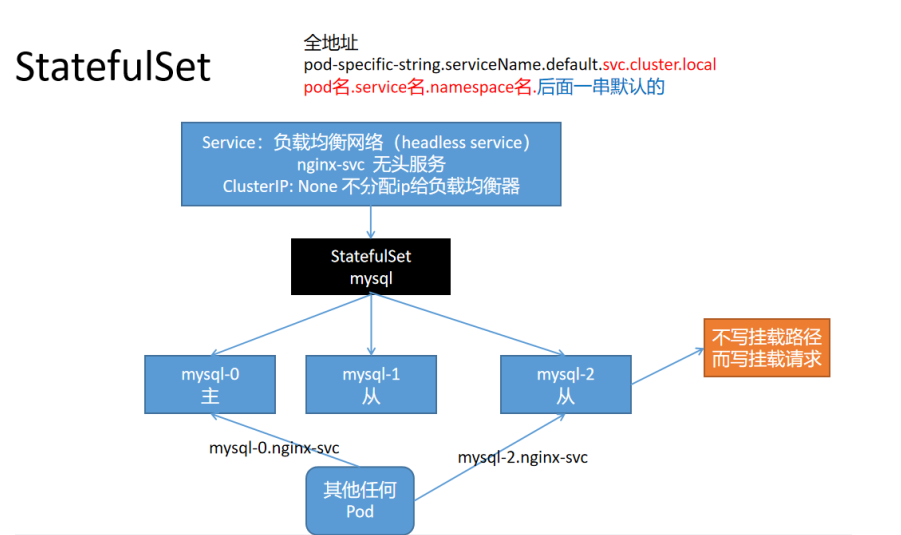
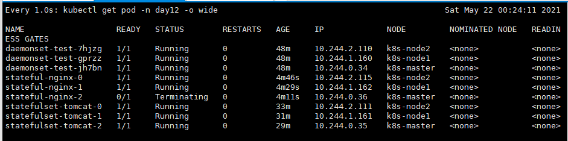

---
# 一、RC、RS
RC: ReplicasController 副本控制器

RS: ReplicaSet 副本集(Deployment 滚动更新特性 默认控制的就是 RS)

RC 是老版, RS 是新版, RS 可以有更复杂的选择器表达式
```bash
$ kubectl explain rs.spec.selector.matchExpressions
   key	<string> -required-
     key is the label key that the selector applies to.

   operator	<string> -required-
     operator represents a key's relationship to a set of values. Valid
     operators are In, NotIn, Exists and DoesNotExist.

   values	<[]string>
     values is an array of string values. If the operator is In or NotIn, the
     values array must be non-empty. If the operator is Exists or DoesNotExist,
     the values array must be empty. This array is replaced during a strategic
     merge patch.

...
  ## RS支持复杂选择器
  matchExpressions:
  - key: pod-name
    value: [aaaa,bbb]
    # In, NotIn, Exists and DoesNotExist
    # In： value: [aaaa,bbb]必须存在，表示key指定的标签的值是这个集合内的
    # NotIn value: [aaaa,bbb]必须存在，表示key指定的标签的值不是这个集合内的
    # Exists # 只要有key指定的标签即可，不用管值是多少
    # DoesNotExist # 只要Pod上没有key指定的标签，不用管值是多少
    operator: DoesNotExist
```

虽然 RS 强大, 但是一般也不直接写 RS, 都是直接写 Deployment 自动产生 RS, Deployment 每次的滚动更新都会产生新的 RS


# 二、DaemonSet
无需指定副本数量, 可以在 Kubernetes 集群的每个机器都运行一个程序(默认master 除外, 因为 master 默认有污点)

DaemonSet 控制器确保所有的(或一部分)节点都运行了一个指定的 Pod 副本
- 每当集群中添加一个节点时, 指定的 Pod 副本也将添加到该节点
- 当节点从集群移除时, Pod 也就被垃圾回收了
- 删除一个 DaemonSet 可以清理所有由其创建的 Pod

```yaml
$ vi daemonset.yaml
apiVersion: apps/v1
kind: DaemonSet
metadata:
  name: daemonset-test
  namespace: day12
  labels:
    app: daemonset-test
spec:
  selector:
    matchLabels:
      app: daemonset-test
  template:
    metadata:
      labels:
        app: daemonset-test
    spec:
      # 设置容忍 master 的污点
      tolerations:
        - key: node-role.kubernetes.io/master
          effect: NoSchedule
      containers:
        - name: logging
          image: nginx
          resources:
            limits:
              memory: 200Mi
            requests:
              cpu: 100m
              memory: 200Mi

$ kubectl apply -f daemonset.yaml
$ kubectl get pod -n day12 -o wide
  NAME                   READY   STATUS    RESTARTS   AGE   IP             NODE         NOMINATED NODE   READINESS GATES
  daemonset-test-7hjzg   1/1     Running   0          46s   10.244.2.110   k8s-node2    <none>           <none>
  daemonset-test-gprzz   1/1     Running   0          46s   10.244.1.160   k8s-node1    <none>           <none>
  daemonset-test-jh7bn   1/1     Running   0          46s   10.244.0.34    k8s-master   <none>           <none>
```

# 三、StatefulSet
Deployment 部署的应用一般称为**无状态应用**

StatefulSet 部署的应用一般称为**有状态应用**

- 无状态应用: 网络可能会变，存储可能会变，顺序可能会变
- 有状态应用: 网络不变，顺序不变


## 3.1 StatefulSet 使用场景
- 稳定、唯一的网络表示(dnsname), 需要配合 Service
- 稳定的、持久的存储
- 有序的、优雅的部署和缩放(按顺序的增加、减少副本, 并在减少副本时执行清理)
- 有序的、自动的滚动更新(按顺序自动的执行滚动更新)

## 3.2 StatefulSet 限制
- 给定 Pod 的存储必须由 PersistentVolume 驱动 基于所请求的 storage class 来提供，或 者由管理员预先提供。
- 删除或者收缩 StatefulSet 并不会 删除它关联的存储卷。 这样做是为了保证数据安全，它通常比自动清除 StatefulSet 所有相关的资源更有价值。
- StatefulSet 当前需要无头服务 来负责 Pod 的网络标识。你需要负责创建此服务。
- 当删除 StatefulSets 时，StatefulSet 不提供任何终止 Pod 的保证。 为了实现 StatefulSet 中的 Pod 可以有序地且体面地终止，可以在删除之前将 StatefulSet 缩放为 0。
- 在默认 Pod 管理策略( OrderedReady ) 时使用 滚动更新，可能进入需要人工干预 才能修复
的损坏状态
  
## 3.3 StatefulSet 示例一: 无头服务
```yaml
$ vi statefulset.yaml

# 定义一个负载均衡网络
apiVersion: v1
kind: Service
metadata:
  name: statefulset-tomcat
  namespace: day12
spec:
  selector:
    app: statefulset-tomcat
  # NodePort: 任意机器IP+NodePort 都能访问
  # ClusterIP: 集群内能用这个IP、Service域名访问
  type: ClusterIP
  # clusterIP: 不要分配集群IP
  clusterIP: None
  ports:
    - name: web
      port: 8123
      targetPort: 8080
      protocol: TCP

---

apiVersion: apps/v1
kind: StatefulSet
metadata:
  name: statefulset-tomcat
  namespace: day12
spec:
  # 扩缩容策略: 
  #    OrderedReady: 顺序
  #    Parallel: 并发
  podManagementPolicy: OrderedReady
  selector:
    matchLabels:
      app: statefulset-tomcat # has to match .spec.template.metadata.labels
  # 需要注意, 一定要有一个 Service 名字叫这个
  # 可以用该域名访问 Pod
  serviceName: "statefulset-tomcat"
  replicas: 3 # by default is 1
  template:
    metadata:
      labels:
        app: statefulset-tomcat # has to match .spec.selector.matchLabels
    spec:
      terminationGracePeriodSeconds: 10
      containers:
        - name: tomcat
          image: tomcat:7
          ports:
            - containerPort: 8080
              name: web

$ kubectl get pod -n day12 -o wide
     NAME                   READY   STATUS    RESTARTS   AGE     IP             NODE         NOMINATED NODE   READINESS GATES
     statefulset-tomcat-0   1/1     Running   0          8m36s   10.244.2.111   k8s-node2    <none>           <none>
     statefulset-tomcat-1   1/1     Running   0          6m34s   10.244.1.161   k8s-node1    <none>           <none>
     statefulset-tomcat-2   1/1     Running   0          4m43s   10.244.0.35    k8s-master   <none>           <none>

# 测试
$ kubectl run -i --tty --namespace day12 --image busybox dns-test --restart=Never --rm /bin/sh
  ping statefulset-tomcat-0.statefulset-tomcat
```
访问 Pod:
- `curl pod名.service名.namespace名`: 负载均衡到 StatefulSet 部署的 Pod 上
- `curl service名`: 直接访问指定的 Pod




## 3.4 StatefulSet 特殊字段 updateStrategy(更新策略)
```yaml
$ kubectl explain sts.spec.updateStrategy
DESCRIPTION:
  updateStrategy indicates the StatefulSetUpdateStrategy that will be
  employed to update Pods in the StatefulSet when a revision is made to
  Template.

  StatefulSetUpdateStrategy indicates the strategy that the StatefulSet
  controller will use to perform updates. It includes any additional
  parameters necessary to perform the update for the indicated strategy.

FIELDS:
  rollingUpdate	<Object>
  RollingUpdate is used to communicate parameters when Type is RollingUpdateStatefulSetStrategyType.

  type	<string>
  Type indicates the type of the StatefulSetUpdateStrategy. Default is RollingUpdate.

$ kubectl explain sts.spec.updateStrategy.rollingUpdate
DESCRIPTION:
  RollingUpdate is used to communicate parameters when Type is
  RollingUpdateStatefulSetStrategyType.

  RollingUpdateStatefulSetStrategy is used to communicate parameter for
  RollingUpdateStatefulSetStrategyType.

FIELDS:
  partition	<integer>: 按分区升级
  Partition indicates the ordinal at which the StatefulSet should be partitioned. Default value is 0.
```
先部署一个 StatefulSet
```yaml
$ vi statefulset-02.yaml
apiVersion: v1
kind: Service
metadata:
  name: stateful-nginx
  namespace: day12
spec:
  selector:
    app: stateful-nginx
  type: ClusterIP
  ports:
    - name: http-web
      port: 80
      targetPort: 80
      protocol: TCP

---

apiVersion: apps/v1
kind: StatefulSet
metadata:
  name: stateful-nginx
  namespace: day12
spec:
  selector:
    matchLabels:
      app: stateful-nginx # has to match .spec.template.metadata.labels
  serviceName: "stateful-nginx"
  replicas: 3 # by default is 1
  template:
    metadata:
      labels:
        app: stateful-nginx # has to match .spec.selector.matchLabels
    spec:
      terminationGracePeriodSeconds: 30
      containers:
        - name: stateful-nginx
          image: nginx
          ports:
            - containerPort: 80
              name: nginx-web
```
再进行分区升级
```yaml
$ vi statefulset-02.yaml
apiVersion: apps/v1
kind: StatefulSet
metadata:
  name: stateful-nginx
  namespace: day12
spec:
  # 所有的 Pod 有序的创建
  podManagementPolicy: OrderedReady
  # 升级策略
  updateStrategy:
    rollingUpdate:
      # 更新大于等于 这个 索引的 Pod
      partition: 1
  selector:
    matchLabels:
      app: stateful-nginx # has to match .spec.template.metadata.labels
  serviceName: "stateful-nginx"
  replicas: 3 # by default is 1
  template:
    metadata:
      labels:
        app: stateful-nginx # has to match .spec.selector.matchLabels
    spec:
      terminationGracePeriodSeconds: 30
      containers:
        - name: stateful-tomcat
          image: tomcat
          ports:
            - containerPort: 8080
              name: nginx-web

$ kubectl apply -f statefulset-02.yaml
```



# 四、Job
Kubernetes 中的 Job 对象将创建一个或多个 Pod, 并确保指定数量的 Pod 可以成功执行到进程正常结束

- 当 Job 创建的 Pod 执行成功并正常结束时, Job 将记录成功结束的 Pod 数量
- 当成功结束的 Pod 达到指定的数量时, Job 将完成执行
- 删除 Job 对象时, 将清理掉由 Job 创建的 Pod

```yaml
$ vi job.yaml
apiVersion: batch/v1
kind: Job
metadata:
  name: my-job-test-01
  namespace: day12
  labels:
    app: my-job-test-01
spec:
  # 任务重试次数, 这里任务四次都没完成, 认为失败
  backoffLimit: 4
  # Job持续时间, 这里总共维持10s, 
  # 一旦 Job 运行超过这个时间, 该 Job 创建的 所有的 Pod 都将被终止(不会被删除)
  # Job 被终止后, 需要手动删除, 或者使用 ttl 进行清理
  activeDeadlineSeconds: 60
  # Job 结束需要运行成功的 Pods, 默认是 1
  completions: 1
  # 除了 CronJob 外, TTL 机制提供了另一种自动清理一结束 Job(状态是 Completed 和 Finished) 的方式
  ttlSecondsAfterFinished:
    # 在 Job 指定完后, 等待 10s在删除, 0 表示执行完立马删除
    ttlSecondsAfterFinished: 10
  template:
    metadata:
      name: my-job-test-01
      labels:
        app: my-job-test-01
    spec:
      containers:
        - name: my-job-test-01
          image: perl
          command: ['perl", "-Mbignum=bpi", "-wle", "print bpi(2000)']
          volumeMounts:
            - name: localtime
              mountPath: /etc/localtime
      volumes:
        - name: localtime
          hostPath:
            path: /usr/share/zoneinfo/Asia/Shanghai
      # kind: Job 时, 不支持 Always
      restartPolicy: OnFailure   # Never
```


# 五、CronJob
CronJob 按照预定的时间计划(schedule)创建 Job(注意: 启动的是 Job 不是 Deployment、RS)

一个 CronJob 对象类似于 Crontab 文件中的一行记录, 该对象根据 Cron 格式定义的时间计划, 周期性的创建 Job 对象

> 所有 CronJob 的 Schedule 中所定义的时间, 都是基于 master 所在的时区来进行计算的

一个 CronJob 在时间计划中的每次执行时刻, 都创建 **大约** 一个对象, 这里用到了 **大约**, 是因为在少数情况下会创建两个 Job 对象, 或者不创建 Job 对象, 尽管 Kubernetes 最大的避免这种情况发生, 但是并不能完全杜绝此现象的发生. 因此 Job 程序必须是 **幂等的** 1min 执行一次

当一下两个条件都满足时, Job 将至少运行一次：
1. `startingDeadlineSeconds` 被设置成一个较大的值, 或者不设置该值(默认值被采纳)
2. `concurrencyPolicy` 被设置成 Allow

各个参数的含义:
```yaml
$ kubectl explain cronjob.spec
  concurrencyPolicy：并发策略
  "Allow" (允许，default):
  "Forbid"(禁止): forbids；前个任务没执行完，要并发下一个的话，下一个会被跳过
  "Replace"(替换): 新任务，替换当前运行的任务


  failedJobsHistoryLimit：记录失败数的上限，Defaults to 1.
  
  
  successfulJobsHistoryLimit： 记录成功任务的上限。 Defaults to 3.
  #指定了 CronJob 应该保留多少个 completed 和 failed 的 Job 记录。将其设置为 0，
  则 CronJob 不会保留已经结束的 Job 的记录。


  jobTemplate： job怎么定义（与前面我们说的job一样定义法）
  
  
  schedule： cron 表达式；
  
  
  startingDeadlineSeconds： 表示如果Job因为某种原因无法按调度准时启动，在 spec.startingDeadlineSeconds时间段之内，CronJob仍然试图重新启动Job，如果在.spec.startingDeadlineSeconds时间之内没有启动成功，则不再试图重新启动。如果 spec.startingDeadlineSeconds的值没有设置，则没有按时启动的任务不会被尝试重新启动。

  suspend 暂停定时任务，对已经执行了的任务，不会生效； Defaults to false.
```


示例:
```yaml
$ vi cronjob.yaml
apiVersion: batch/v1beta1
kind: CronJob
metadata:
  name: hello
  namespace: day12
spec:
  # 分、时、天、月、周
  schedule: "*/1 * * * *"
  jobTemplate:
    spec:
      template:
        spec:
          containers:
            - name: hello
              image: busybox
              args: ['/bin/sh', '-c', 'date; echo Hello from the Kubernetes cluster']
          restartPolicy: OnFailure
```
