---
# 一、Kubernetes 网络

Kubernetes 网络解决了四类问题:

1. 一个 Pod 中的容器之间通过 **本地回路(loopback) 通信**。
2. 集群网络在不同 Pod 之间提供通信, Pod 和 Pod 之间互通
3. Service 资源允许对外暴露 Pod 中运行的应用程序，以支持来自于集群外部的访问(Service 和 Pod互通)。
4. 可以使用 Services 来发布仅供集群内部使用的服务。

## 1.1 Kubernetes 网络架构图


## 1.2 访问流程

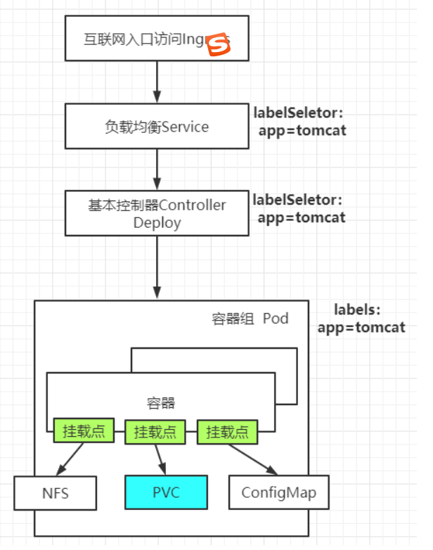

## 1.3 网络连通原理

## 1.3.1 容器 和 容器 互通

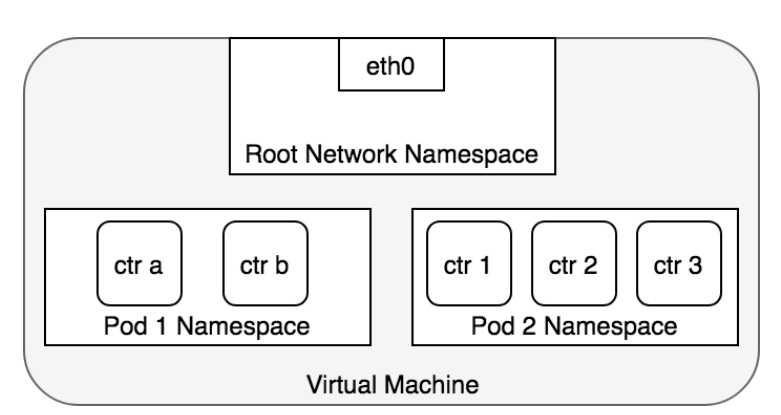

### 1.3.2 Pod 和 Pod 互通

1. 同节点

   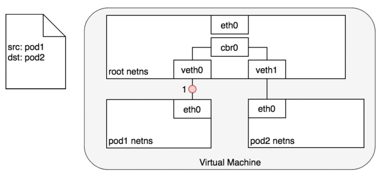

2. 跨节点

   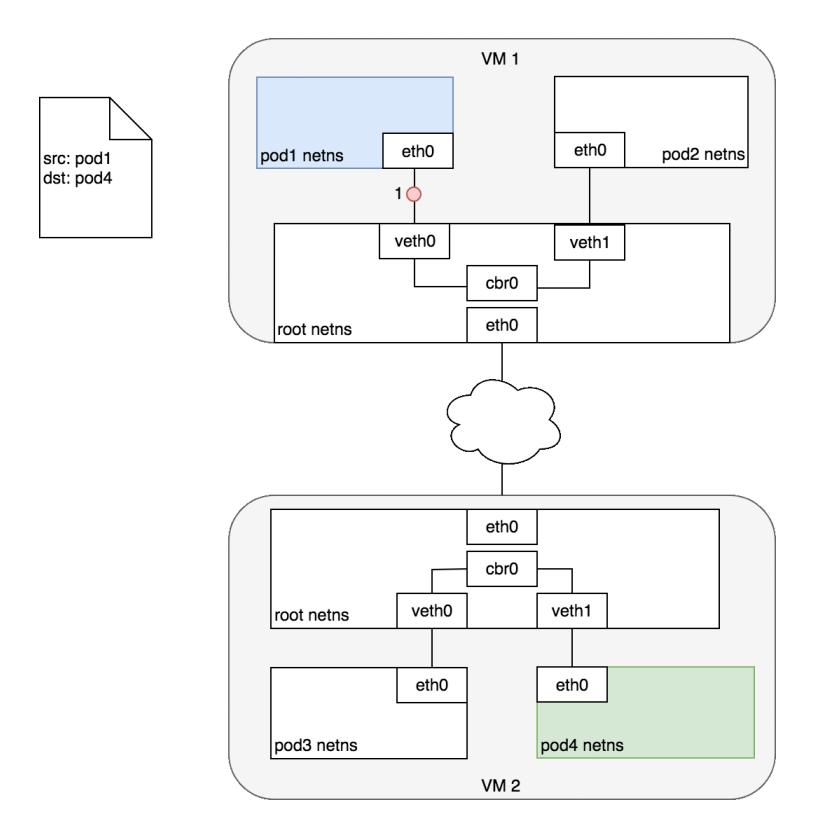

### 1.3.3 Pod 和 Service 通信

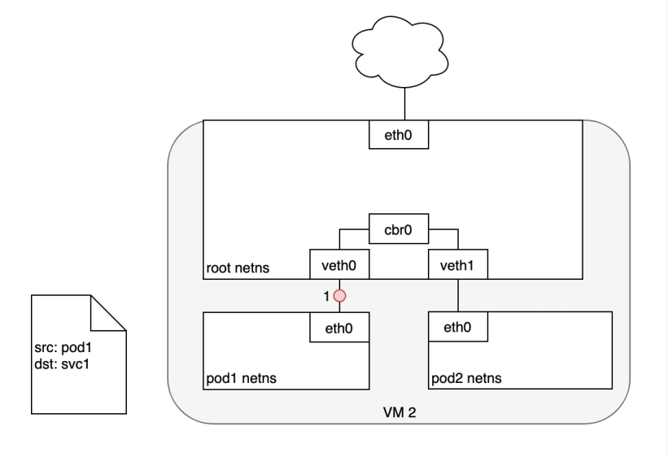

### 1.3.4 service 和 Pod 通信

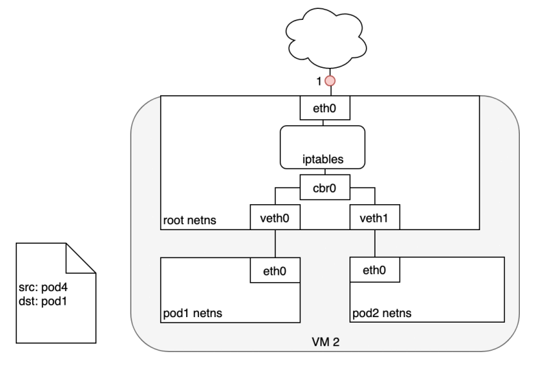

### 1.3.5 Pod 和 Internet

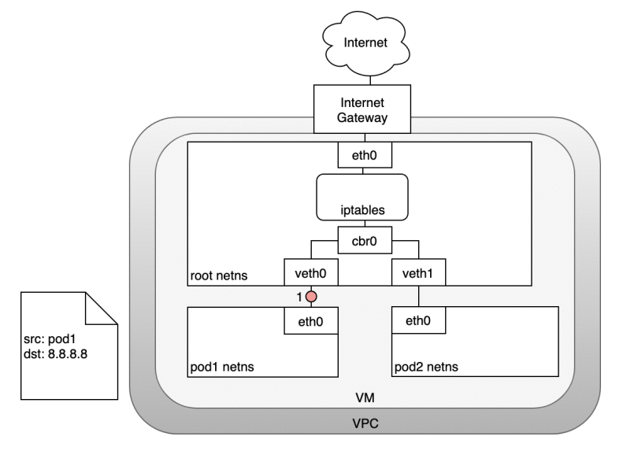

### 1.3.6 Internet 和 Pod（LoadBalancer--四层网络协议）

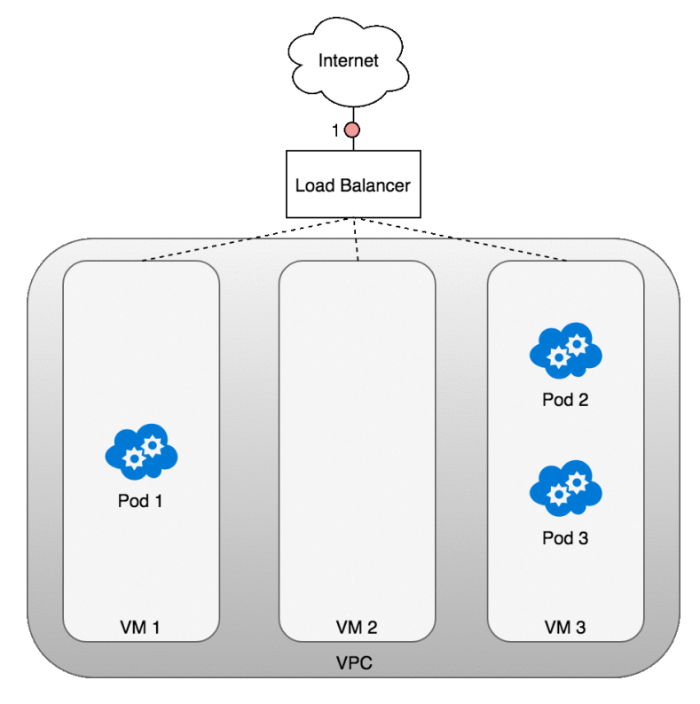

### 1.3.7 Internet 和 Pod（LoadBalancer--七层网络协议）

.png)


# 二、Service

## 2.1 Service 基础概念

- Service 可以让一组 Pod 可以被别人进行服务发现（Service 选择 一组 Pod）。别人只需要访问这个 Service 就可以访问到被选中的 Pod。
- Service 还会基于 Pod 的探针机制(ReadinessProbe: 就绪探针)完成 Pod 的自动剔除和上线工作。
- Service 即使是无头服务，不能通过 Ip 访问，但是还是可以用 Service 名当域名访问。
- Service 的名字还能当成域名被 Pod 解析。

## 2.2 常用 Service 类型

- `ExternalName`：通过返回 `CNAME` 和对应值，可以将服务映射到 `externalName` 字段的内容；(例如: aaa.bar.example.com.cn)。无需创建任何类型的代理；
- `ClusterIP(默认)`: 通过集群的内部Ip 暴露服务，选择该值时，服务只能在集群内部访问；
- `NodePort`: 通过每个节点上的IP 和 静态端口(`NodePort`)暴露服务，`NodePort` 服务会路由到自动创建的 `ClusterIP` 服务。通过请求 `节点IP:节点端口`可以从集群外部访问一个 `NodePort` 服务；
  - NodePort 端口由 kube-proxy 在机器上开
  - 机器ip+暴露的 NodePort 流量先来到 kube-proxy
- `LoadBalancer`: 使用云提供商的负载均衡器向外部暴露服务，外部负载均衡器可以将流量路由到自动创建的 `NodePort` 服务和 `ClusterIP` 服务上；

## 2.3 简单的 Service 案例

```yaml
$ vi service01.yaml
apiVersion: apps/v1
kind: Deployment
metadata:
  name: my-deploy
  namespace: svc
spec:
  selector:
    matchLabels:
      app: my-deploy
  replicas: 1
  strategy:
    rollingUpdate:
      maxSurge: 25%
      maxUnavailable: 25%
    type: RollingUpdate
  template:
    metadata:
      labels:
        app: my-deploy
    spec:
      containers:
      - name: my-deploy
        image: nginx
        ports:
        - containerPort:  80
          name: my-nginx
      - name: my-redis
        image: redis
        ports:
        - containerPort: 6379
          name: my-redis
      restartPolicy: Always
---
apiVersion: v1
kind: Service
metadata:
  name: my-svc
  namespace: svc
spec:
  selector:
    app: my-deploy
  ## type: ClusterIP   # type 很重要, 不写默认是 ClusterIP
  ## type 有四种类型
  ##     ClusterIP & ExternalName & NodePort & LoadBalancer
  type: ClusterIP
  ports:
  # 外部访问 http://serviceIp:80 时, 会访问到这个 service selector 选中的 pod 的 80 端口 
  - name: my-nginx
    protocol: TCP
    port: 80
    targetPort: 80
  # 外部访问 http://serviceIp:81 时, 会访问到这个 service selector 选中的 pod 的 6379 端口 
  - name: my-redis
    protocol: TCP
    port: 81
    targetPort: 6379
  
$ kubectl get pod,svc -n svc
NAME                             READY   STATUS    RESTARTS   AGE     IP             NODE        NOMINATED NODE   READINESS GATES
pod/my-deploy-56d756ddc4-6j972   2/2     Running   0          9m28s   10.233.81.52   k8s-node1   <none>           <none>

NAME             TYPE        CLUSTER-IP      EXTERNAL-IP   PORT(S)         AGE     SELECTOR
service/my-svc   ClusterIP   10.233.16.140   <none>        80/TCP,81/TCP   9m28s   app=my-deploy

$ kubectl describe service/my-svc -n svc
Name:              my-svc
Namespace:         svc
Labels:            <none>
Annotations:       <none>
Selector:          app=my-deploy
Type:              ClusterIP
IP Family Policy:  SingleStack
IP Families:       IPv4
IP:                10.233.16.140
IPs:               10.233.16.140
Port:              my-nginx  80/TCP
TargetPort:        80/TCP
Endpoints:         10.233.81.52:80
Port:              my-redis  81/TCP
TargetPort:        6379/TCP
Endpoints:         10.233.81.52:6379
Session Affinity:  None
Events:            <none>
```

- Service 创建后，会生成一组 EndPoint

  ```yaml
  $ kubectl get ep -n svc
  NAME     ENDPOINTS                           AGE
  my-svc   10.233.81.52:6379,10.233.81.52:80   10m
  
  $ kubectl describe ep/my-svc -n svc
  Name:         my-svc
  Namespace:    svc
  Labels:       <none>
  Annotations:  endpoints.kubernetes.io/last-change-trigger-time: 2022-01-25T17:16:43+08:00
  Subsets:
    Addresses:          10.233.81.52
    NotReadyAddresses:  <none>
    Ports:
      Name      Port  Protocol
      ----      ----  --------
      my-redis  6379  TCP
      my-nginx  80    TCP
  
  Events:  <none>
  ```

- type 有四种类型，每种对应不同的服务发现机制
- Service 可以利用 Pod 的就绪探针机制，只负载就绪了的 Pod，没有就绪的Pod就删除

## 2.4 创建无 Selector 的 Service(EndPoint)

在创建 Service 的时候，可以不指定 Selector，然后手动创建 EndPoint指定一组 Pod 地址。

此场景用于我们负载均衡其他中间件的场景。

```yaml
# 先创建一个 3个副本的 deployment 
$ vim deployment01.yaml
apiVersion: apps/v1
kind: Deployment
metadata:
  name: nginx-deployment
  namespace: day13
spec:
  selector:
    matchLabels:
      app: nginx-deployment
  replicas: 3
  template:
    metadata:
      labels:
        app: nginx-deployment
    spec:
      containers:
      - name: nginx-deployment
        image: nginx
        ports:
        - containerPort: 80
      restartPolicy: Always
      
## 通过 kubectl get pod -n day13 查看创建的 三个 Pod 的IP
## 通过 kubectl exec -it 修改 每个 pod 的nginx 页面:
## echo "nginx11111" > /usr/share/nginx/html/index.html
## echo "nginx22222" > /usr/share/nginx/html/index.html
## echo "nginx33333" > /usr/share/nginx/html/index.html
## echo "nginx44444" > /usr/share/nginx/html/index.html
```

再创建 service 和 EndPoint

```yaml
$ vim service-no-seletor.yaml 
# 创建 selector 的 service
apiVersion: v1
kind: Service
metadata:
  name: my-service-no-selector
  namespace: day13
spec:
  # 在这里不写 selector 选中 Pod, 而是通过下面的 EndPoint 手动指定要访问的 Pod IP
  ports:
  - name: http      # 可以写，也可以不写
    port: 80        # service 的端口
    targetPort: 80  # 目标 Pod 的端口
    protocol: TCP

---
# 创建一个 EndPoint
apiVersion: v1
kind: Endpoints
metadata:
  name: my-service-no-selector   # EndPoint 和 service 绑定规则是: 和 svc 同名且同名称空间, port 同名或通端口
  namespace: day13
subsets:
- addresses:
  - ip: 10.244.2.99
  - ip: 10.244.1.139
  - ip: 10.244.2.97
  ports:   
  - name: http    # service 有 name 的话, 这里一定要有, 并且要和 service 的 ports.name 保持一致
    port: 80
    protocol: TCP
```

## 2.5 ClusterIP

```yaml
# 方式一: 不手动声明 IP 地址, 由 k8s 自动生成
...
type: ClusterIP
...

# 方式二: 手动指定 Cluster 的 IP 地址, 地址必须在合法范围内
...
type: ClusterIP
clusterIP: 10.239.199.88
...

# 方式三: Service 不生成 IP, 通过域名访问该 Service, 或者 Ingress
...
type: ClusterIP
clusterIP: None
...
```

示例: 

```yaml
# 方式一的例子
apiVersion: v1
kind: Service
metadata:
  name: my-service-clusterip-test1
  namespace: svc
spec:
  selector:
    app: my-deploy
  type: ClusterIP
  ports:
  - name: http
    port: 80
    targetPort: 80
    protocol: TCP

$ kubectl get svc -n svc
NAME                                 TYPE        CLUSTER-IP       EXTERNAL-IP   PORT(S)        AGE    SELECTOR
service/my-service-clusterip-test    ClusterIP   10.233.2.214    <none>        80/TCP          3m54s   app=my-deploy


---
# 方式二的例子
apiVersion: v1
kind: Service
metadata:
  name: my-service-clusterip-test2
  namespace: svc
spec:
  selector:
    app: my-deploy
  type: ClusterIP
  clusterIP: 10.233.199.140   ## 手动指定 Cluster 的 IP 地址, 地址必须在合法范围内
  ports:
  - name: http
    port: 80
    targetPort: 80
    protocol: TCP
    
$ kubectl get svc -n svc
NAME                                 TYPE        CLUSTER-IP       EXTERNAL-IP   PORT(S)        AGE    SELECTOR
service/my-service-clusterip-test2    ClusterIP   10.233.16.88    <none>        80/TCP          3m54s   app=my-deploy

---
# 方式三的例子
apiVersion: v1
kind: Service
metadata:
  name: my-service-clusterip-test3
  namespace: svc
spec:
  selector:
    app: my-deploy
  type: ClusterIP
  clusterIP: None
  ports:
  - name: http
    port: 80
    targetPort: 80
    protocol: TCP
    
$ kubectl get svc -n svc
NAME                                 TYPE        CLUSTER-IP       EXTERNAL-IP   PORT(S)        AGE    SELECTOR
service/my-service-clusterip-test3   ClusterIP   None            <none>        80/TCP          6s      app=my-deploy
```

## 2.6 NodePort

```yaml
apiVersion: v1
kind: Service
metadata:
  name: my-service-nodeport-test01
  namespace: day13
spec:
  selector:
    app: nginx-deployment
  type: NodePort      ## 在每一台机器都为这个 service 分配一个指定的端口
  ports:
  - name: http
    port: 80
    targetPort: 80
    protocol: TCP
    nodePort: 31180   ## 如果不指定，系统会在 30000-32765 之间随机分配
```

## 2.7 ExternalName 和 LoadBalancer

```yaml
apiVersion: v1
kind: Service
metadata:
  name: my-service-externalname-test
  namespace: day13
spec:
  type: ExternalName
  externalName: www.json.cn  # 只能写 域名    注意跨域问题
  # 如果是无 selector, 得自己写 EP

# ---
# apiVersion: v1
# kind: Service
# metadata:
#   name: service-externalname-test
#   namespace: default
# spec:
#   selector: 
#      app: nginx
#   type: LoadBalancer  ## 负载均衡，开放给云平台实现，阿里云、百度云
#   ports:
#      port: 80
#      target: 888
## k8s自动请求云平台，分配一个负载均衡器
```

# 三、Ingress
## 3.1 说明
[K8s Ingress github](https://github.com/kubernetes/ingress-nginx)

需要注意的是，README 中有 Ingress 和 K8s 对应的版本信息。

Support Versions table

| Ingress-NGINX version | k8s supported version        | Alpine Version | Nginx Version |
| --------------------- | ---------------------------- | -------------- | ------------- |
| v1.4.0                | 1.25, 1.24, 1.23, 1.22       | 3.16.2         | 1.19.10†      |
| v1.3.1                | 1.24, 1.23, 1.22, 1.21, 1.20 | 3.16.2         | 1.19.10†      |
| v1.3.0                | 1.24, 1.23, 1.22, 1.21, 1.20 | 3.16.0         | 1.19.10†      |
| v1.2.1                | 1.23, 1.22, 1.21, 1.20, 1.19 | 3.14.6         | 1.19.10†      |
| v1.1.3                | 1.23, 1.22, 1.21, 1.20, 1.19 | 3.14.4         | 1.19.10†      |
| v1.1.2                | 1.23, 1.22, 1.21, 1.20, 1.19 | 3.14.2         | 1.19.9†       |
| v1.1.1                | 1.23, 1.22, 1.21, 1.20, 1.19 | 3.14.2         | 1.19.9†       |
| v1.1.0                | 1.22, 1.21, 1.20, 1.19       | 3.14.2         | 1.19.9†       |
| v1.0.5                | 1.22, 1.21, 1.20, 1.19       | 3.14.2         | 1.19.9†       |
| v1.0.4                | 1.22, 1.21, 1.20, 1.19       | 3.14.2         | 1.19.9†       |
| v1.0.3                | 1.22, 1.21, 1.20, 1.19       | 3.14.2         | 1.19.9†       |
| v1.0.2                | 1.22, 1.21, 1.20, 1.19       | 3.14.2         | 1.19.9†       |
| v1.0.1                | 1.22, 1.21, 1.20, 1.19       | 3.14.2         | 1.19.9†       |
| v1.0.0                | 1.22, 1.21, 1.20, 1.19       | 3.13.5         | 1.20.1        |

例如我现在的 K8s 版本为: `v1.20.9`, 那么 Ingress 就只能选择 v1.3.1 及以下。

[K8s 官方文档](https://kubernetes.io/zh-cn/docs/concepts/services-networking/ingress/#what-is-ingress)

[Ingress nginx 官方文档 ](https://kubernetes.github.io/ingress-nginx/deploy/#bare-metal-clusters)

## 3.2 Ingress 安装部署

文档中的 apply 如下

```bash
$ kubectl apply -f https://raw.githubusercontent.com/kubernetes/ingress-nginx/controller-v1.2.0/deploy/static/provider/baremetal/deploy.yaml
```

因为官方deploy.yaml 中的镜像在国内很难下载下来，所以需要修改镜像，并且做一些额外的配置修改

```yaml
# 下载
$ wgeet https://raw.githubusercontent.com/kubernetes/ingress-nginx/controller-v1.2.0/deploy/static/provider/baremetal/deploy.yaml
# 修改
$ vim deploy.yaml
apiVersion: v1
kind: Namespace
metadata:
  labels:
    app.kubernetes.io/instance: ingress-nginx
    app.kubernetes.io/name: ingress-nginx
  name: ingress-nginx
---
apiVersion: v1
automountServiceAccountToken: true
kind: ServiceAccount
metadata:
  labels:
    app.kubernetes.io/component: controller
    app.kubernetes.io/instance: ingress-nginx
    app.kubernetes.io/name: ingress-nginx
    app.kubernetes.io/part-of: ingress-nginx
    app.kubernetes.io/version: 1.2.0
  name: ingress-nginx
  namespace: ingress-nginx
---
apiVersion: v1
kind: ServiceAccount
metadata:
  labels:
    app.kubernetes.io/component: admission-webhook
    app.kubernetes.io/instance: ingress-nginx
    app.kubernetes.io/name: ingress-nginx
    app.kubernetes.io/part-of: ingress-nginx
    app.kubernetes.io/version: 1.2.0
  name: ingress-nginx-admission
  namespace: ingress-nginx
---
apiVersion: rbac.authorization.k8s.io/v1
kind: Role
metadata:
  labels:
    app.kubernetes.io/component: controller
    app.kubernetes.io/instance: ingress-nginx
    app.kubernetes.io/name: ingress-nginx
    app.kubernetes.io/part-of: ingress-nginx
    app.kubernetes.io/version: 1.2.0
  name: ingress-nginx
  namespace: ingress-nginx
rules:
- apiGroups:
  - ""
  resources:
  - namespaces
  verbs:
  - get
- apiGroups:
  - ""
  resources:
  - configmaps
  - pods
  - secrets
  - endpoints
  verbs:
  - get
  - list
  - watch
- apiGroups:
  - ""
  resources:
  - services
  verbs:
  - get
  - list
  - watch
- apiGroups:
  - networking.k8s.io
  resources:
  - ingresses
  verbs:
  - get
  - list
  - watch
- apiGroups:
  - networking.k8s.io
  resources:
  - ingresses/status
  verbs:
  - update
- apiGroups:
  - networking.k8s.io
  resources:
  - ingressclasses
  verbs:
  - get
  - list
  - watch
- apiGroups:
  - ""
  resourceNames:
  - ingress-controller-leader
  resources:
  - configmaps
  verbs:
  - get
  - update
- apiGroups:
  - ""
  resources:
  - configmaps
  verbs:
  - create
- apiGroups:
  - ""
  resources:
  - events
  verbs:
  - create
  - patch
---
apiVersion: rbac.authorization.k8s.io/v1
kind: Role
metadata:
  labels:
    app.kubernetes.io/component: admission-webhook
    app.kubernetes.io/instance: ingress-nginx
    app.kubernetes.io/name: ingress-nginx
    app.kubernetes.io/part-of: ingress-nginx
    app.kubernetes.io/version: 1.2.0
  name: ingress-nginx-admission
  namespace: ingress-nginx
rules:
- apiGroups:
  - ""
  resources:
  - secrets
  verbs:
  - get
  - create
---
apiVersion: rbac.authorization.k8s.io/v1
kind: ClusterRole
metadata:
  labels:
    app.kubernetes.io/instance: ingress-nginx
    app.kubernetes.io/name: ingress-nginx
    app.kubernetes.io/part-of: ingress-nginx
    app.kubernetes.io/version: 1.2.0
  name: ingress-nginx
rules:
- apiGroups:
  - ""
  resources:
  - configmaps
  - endpoints
  - nodes
  - pods
  - secrets
  - namespaces
  verbs:
  - list
  - watch
- apiGroups:
  - ""
  resources:
  - nodes
  verbs:
  - get
- apiGroups:
  - ""
  resources:
  - services
  verbs:
  - get
  - list
  - watch
- apiGroups:
  - networking.k8s.io
  resources:
  - ingresses
  verbs:
  - get
  - list
  - watch
- apiGroups:
  - ""
  resources:
  - events
  verbs:
  - create
  - patch
- apiGroups:
  - networking.k8s.io
  resources:
  - ingresses/status
  verbs:
  - update
- apiGroups:
  - networking.k8s.io
  resources:
  - ingressclasses
  verbs:
  - get
  - list
  - watch
---
apiVersion: rbac.authorization.k8s.io/v1
kind: ClusterRole
metadata:
  labels:
    app.kubernetes.io/component: admission-webhook
    app.kubernetes.io/instance: ingress-nginx
    app.kubernetes.io/name: ingress-nginx
    app.kubernetes.io/part-of: ingress-nginx
    app.kubernetes.io/version: 1.2.0
  name: ingress-nginx-admission
rules:
- apiGroups:
  - admissionregistration.k8s.io
  resources:
  - validatingwebhookconfigurations
  verbs:
  - get
  - update
---
apiVersion: rbac.authorization.k8s.io/v1
kind: RoleBinding
metadata:
  labels:
    app.kubernetes.io/component: controller
    app.kubernetes.io/instance: ingress-nginx
    app.kubernetes.io/name: ingress-nginx
    app.kubernetes.io/part-of: ingress-nginx
    app.kubernetes.io/version: 1.2.0
  name: ingress-nginx
  namespace: ingress-nginx
roleRef:
  apiGroup: rbac.authorization.k8s.io
  kind: Role
  name: ingress-nginx
subjects:
- kind: ServiceAccount
  name: ingress-nginx
  namespace: ingress-nginx
---
apiVersion: rbac.authorization.k8s.io/v1
kind: RoleBinding
metadata:
  labels:
    app.kubernetes.io/component: admission-webhook
    app.kubernetes.io/instance: ingress-nginx
    app.kubernetes.io/name: ingress-nginx
    app.kubernetes.io/part-of: ingress-nginx
    app.kubernetes.io/version: 1.2.0
  name: ingress-nginx-admission
  namespace: ingress-nginx
roleRef:
  apiGroup: rbac.authorization.k8s.io
  kind: Role
  name: ingress-nginx-admission
subjects:
- kind: ServiceAccount
  name: ingress-nginx-admission
  namespace: ingress-nginx
---
apiVersion: rbac.authorization.k8s.io/v1
kind: ClusterRoleBinding
metadata:
  labels:
    app.kubernetes.io/instance: ingress-nginx
    app.kubernetes.io/name: ingress-nginx
    app.kubernetes.io/part-of: ingress-nginx
    app.kubernetes.io/version: 1.2.0
  name: ingress-nginx
roleRef:
  apiGroup: rbac.authorization.k8s.io
  kind: ClusterRole
  name: ingress-nginx
subjects:
- kind: ServiceAccount
  name: ingress-nginx
  namespace: ingress-nginx
---
apiVersion: rbac.authorization.k8s.io/v1
kind: ClusterRoleBinding
metadata:
  labels:
    app.kubernetes.io/component: admission-webhook
    app.kubernetes.io/instance: ingress-nginx
    app.kubernetes.io/name: ingress-nginx
    app.kubernetes.io/part-of: ingress-nginx
    app.kubernetes.io/version: 1.2.0
  name: ingress-nginx-admission
roleRef:
  apiGroup: rbac.authorization.k8s.io
  kind: ClusterRole
  name: ingress-nginx-admission
subjects:
- kind: ServiceAccount
  name: ingress-nginx-admission
  namespace: ingress-nginx
---
apiVersion: v1
data:
  allow-snippet-annotations: "true"
kind: ConfigMap
metadata:
  labels:
    app.kubernetes.io/component: controller
    app.kubernetes.io/instance: ingress-nginx
    app.kubernetes.io/name: ingress-nginx
    app.kubernetes.io/part-of: ingress-nginx
    app.kubernetes.io/version: 1.2.0
  name: ingress-nginx-controller
  namespace: ingress-nginx
---
apiVersion: v1
kind: Service
metadata:
  labels:
    app.kubernetes.io/component: controller
    app.kubernetes.io/instance: ingress-nginx
    app.kubernetes.io/name: ingress-nginx
    app.kubernetes.io/part-of: ingress-nginx
    app.kubernetes.io/version: 1.2.0
  name: ingress-nginx-controller
  namespace: ingress-nginx
spec:
  ports:
  - appProtocol: http
    name: http
    port: 80
    protocol: TCP
    targetPort: http
  - appProtocol: https
    name: https
    port: 443
    protocol: TCP
    targetPort: https
  selector:
    app.kubernetes.io/component: controller
    app.kubernetes.io/instance: ingress-nginx
    app.kubernetes.io/name: ingress-nginx
  type: ClusterIP  ## 从 NodePort 改成 ClusterIP
---
apiVersion: v1
kind: Service
metadata:
  labels:
    app.kubernetes.io/component: controller
    app.kubernetes.io/instance: ingress-nginx
    app.kubernetes.io/name: ingress-nginx
    app.kubernetes.io/part-of: ingress-nginx
    app.kubernetes.io/version: 1.2.0
  name: ingress-nginx-controller-admission
  namespace: ingress-nginx
spec:
  ports:
  - appProtocol: https
    name: https-webhook
    port: 443
    targetPort: webhook
  selector:
    app.kubernetes.io/component: controller
    app.kubernetes.io/instance: ingress-nginx
    app.kubernetes.io/name: ingress-nginx
  type: ClusterIP
---
apiVersion: apps/v1
kind: DaemonSet   # 从 Deployment 改成 DaemonSet
metadata:
  labels:
    app.kubernetes.io/component: controller
    app.kubernetes.io/instance: ingress-nginx
    app.kubernetes.io/name: ingress-nginx
    app.kubernetes.io/part-of: ingress-nginx
    app.kubernetes.io/version: 1.2.0
  name: ingress-nginx-controller
  namespace: ingress-nginx
spec:
  minReadySeconds: 0
  revisionHistoryLimit: 10
  selector:
    matchLabels:
      app.kubernetes.io/component: controller
      app.kubernetes.io/instance: ingress-nginx
      app.kubernetes.io/name: ingress-nginx
  template:
    metadata:
      labels:
        app.kubernetes.io/component: controller
        app.kubernetes.io/instance: ingress-nginx
        app.kubernetes.io/name: ingress-nginx
    spec:
      hostNetwork: true   ## 直接让nginx占用本机80端口和443端口，所以使用主机网络
      dnsPolicy: ClusterFirstWithHostNet   ## dns对应调整为主机网络
      containers:
      - args:
        - /nginx-ingress-controller
        - --election-id=ingress-controller-leader
        - --controller-class=k8s.io/ingress-nginx
        - --ingress-class=nginx
        - --configmap=$(POD_NAMESPACE)/ingress-nginx-controller
        - --validating-webhook=:8443
        - --validating-webhook-certificate=/usr/local/certificates/cert
        - --validating-webhook-key=/usr/local/certificates/key
        env:
        - name: POD_NAME
          valueFrom:
            fieldRef:
              fieldPath: metadata.name
        - name: POD_NAMESPACE
          valueFrom:
            fieldRef:
              fieldPath: metadata.namespace
        - name: LD_PRELOAD
          value: /usr/local/lib/libmimalloc.so
        # image: k8s.gcr.io/ingress-nginx/controller:v1.2.0@sha256:d8196e3bc1e72547c5dec66d6556c0ff92a23f6d0919b206be170bc90d5f9185
        image: opsdockerimage/ingress-nginx-controller:v1.2.1   ## 替换镜像
        imagePullPolicy: IfNotPresent
        lifecycle:
          preStop:
            exec:
              command:
              - /wait-shutdown
        livenessProbe:
          failureThreshold: 5
          httpGet:
            path: /healthz
            port: 10254
            scheme: HTTP
          initialDelaySeconds: 10
          periodSeconds: 10
          successThreshold: 1
          timeoutSeconds: 1
        name: controller
        ports:
        - containerPort: 80
          name: http
          protocol: TCP
        - containerPort: 443
          name: https
          protocol: TCP
        - containerPort: 8443
          name: webhook
          protocol: TCP
        readinessProbe:
          failureThreshold: 3
          httpGet:
            path: /healthz
            port: 10254
            scheme: HTTP
          initialDelaySeconds: 10
          periodSeconds: 10
          successThreshold: 1
          timeoutSeconds: 1
        resources:
          requests:
            cpu: 100m
            memory: 90Mi
        securityContext:
          allowPrivilegeEscalation: true
          capabilities:
            add:
            - NET_BIND_SERVICE
            drop:
            - ALL
          runAsUser: 101
        volumeMounts:
        - mountPath: /usr/local/certificates/
          name: webhook-cert
          readOnly: true
      dnsPolicy: ClusterFirst
      nodeSelector:
        # kubernetes.io/os: linux   ## 注释原来的选择器
        node-role: ingress          ## 修改为选择 node 上有 label标签为: node-role=ingress
      serviceAccountName: ingress-nginx
      terminationGracePeriodSeconds: 300
      volumes:
      - name: webhook-cert
        secret:
          secretName: ingress-nginx-admission
---
apiVersion: batch/v1
kind: Job
metadata:
  labels:
    app.kubernetes.io/component: admission-webhook
    app.kubernetes.io/instance: ingress-nginx
    app.kubernetes.io/name: ingress-nginx
    app.kubernetes.io/part-of: ingress-nginx
    app.kubernetes.io/version: 1.2.0
  name: ingress-nginx-admission-create
  namespace: ingress-nginx
spec:
  template:
    metadata:
      labels:
        app.kubernetes.io/component: admission-webhook
        app.kubernetes.io/instance: ingress-nginx
        app.kubernetes.io/name: ingress-nginx
        app.kubernetes.io/part-of: ingress-nginx
        app.kubernetes.io/version: 1.2.0
      name: ingress-nginx-admission-create
    spec:
      containers:
      - args:
        - create
        - --host=ingress-nginx-controller-admission,ingress-nginx-controller-admission.$(POD_NAMESPACE).svc
        - --namespace=$(POD_NAMESPACE)
        - --secret-name=ingress-nginx-admission
        env:
        - name: POD_NAMESPACE
          valueFrom:
            fieldRef:
              fieldPath: metadata.namespace
        # image: k8s.gcr.io/ingress-nginx/kube-webhook-certgen:v1.1.1@sha256:64d8c73dca984af206adf9d6d7e46aa550362b1d7a01f3a0a91b20cc67868660  ## 注释掉原来的
        image: wangshun1024/kube-webhook-certgen:v1.1.1     ## 替换镜像
        imagePullPolicy: IfNotPresent
        name: create
        securityContext:
          allowPrivilegeEscalation: false
      nodeSelector:
        kubernetes.io/os: linux
      restartPolicy: OnFailure
      securityContext:
        fsGroup: 2000
        runAsNonRoot: true
        runAsUser: 2000
      serviceAccountName: ingress-nginx-admission
---
apiVersion: batch/v1
kind: Job
metadata:
  labels:
    app.kubernetes.io/component: admission-webhook
    app.kubernetes.io/instance: ingress-nginx
    app.kubernetes.io/name: ingress-nginx
    app.kubernetes.io/part-of: ingress-nginx
    app.kubernetes.io/version: 1.2.0
  name: ingress-nginx-admission-patch
  namespace: ingress-nginx
spec:
  template:
    metadata:
      labels:
        app.kubernetes.io/component: admission-webhook
        app.kubernetes.io/instance: ingress-nginx
        app.kubernetes.io/name: ingress-nginx
        app.kubernetes.io/part-of: ingress-nginx
        app.kubernetes.io/version: 1.2.0
      name: ingress-nginx-admission-patch
    spec:
      containers:
      - args:
        - patch
        - --webhook-name=ingress-nginx-admission
        - --namespace=$(POD_NAMESPACE)
        - --patch-mutating=false
        - --secret-name=ingress-nginx-admission
        - --patch-failure-policy=Fail
        env:
        - name: POD_NAMESPACE
          valueFrom:
            fieldRef:
              fieldPath: metadata.namespace
        # image: k8s.gcr.io/ingress-nginx/kube-webhook-certgen:v1.1.1@sha256:64d8c73dca984af206adf9d6d7e46aa550362b1d7a01f3a0a91b20cc67868660  ## 注释掉原来的
        image: wangshun1024/kube-webhook-certgen:v1.1.1     ## 替换镜像
        imagePullPolicy: IfNotPresent
        name: patch
        securityContext:
          allowPrivilegeEscalation: false
      nodeSelector:
        kubernetes.io/os: linux
      restartPolicy: OnFailure
      securityContext:
        fsGroup: 2000
        runAsNonRoot: true
        runAsUser: 2000
      serviceAccountName: ingress-nginx-admission
---
apiVersion: networking.k8s.io/v1
kind: IngressClass
metadata:
  labels:
    app.kubernetes.io/component: controller
    app.kubernetes.io/instance: ingress-nginx
    app.kubernetes.io/name: ingress-nginx
    app.kubernetes.io/part-of: ingress-nginx
    app.kubernetes.io/version: 1.2.0
  name: nginx
spec:
  controller: k8s.io/ingress-nginx
---
apiVersion: admissionregistration.k8s.io/v1
kind: ValidatingWebhookConfiguration
metadata:
  labels:
    app.kubernetes.io/component: admission-webhook
    app.kubernetes.io/instance: ingress-nginx
    app.kubernetes.io/name: ingress-nginx
    app.kubernetes.io/part-of: ingress-nginx
    app.kubernetes.io/version: 1.2.0
  name: ingress-nginx-admission
webhooks:
- admissionReviewVersions:
  - v1
  clientConfig:
    service:
      name: ingress-nginx-controller-admission
      namespace: ingress-nginx
      path: /networking/v1/ingresses
  failurePolicy: Fail
  matchPolicy: Equivalent
  name: validate.nginx.ingress.kubernetes.io
  rules:
  - apiGroups:
    - networking.k8s.io
    apiVersions:
    - v1
    operations:
    - CREATE
    - UPDATE
    resources:
    - ingresses
  sideEffects: None

# apply
$ kubectl apply -f deploy.yaml
```

部署完成之后

```bash
[root@etl-k8s01 app]# kubectl get all -n ingress-nginx
NAME                                       READY   STATUS      RESTARTS   AGE
pod/ingress-nginx-admission-create-59f4d   0/1     Completed   0          32m
pod/ingress-nginx-admission-patch-5wxtb    0/1     Completed   0          32m
pod/ingress-nginx-controller-fl6lc         1/1     Running     0          32m

NAME                                         TYPE        CLUSTER-IP      EXTERNAL-IP   PORT(S)          AGE
service/ingress-nginx-controller             ClusterIP   10.96.91.32     <none>        80/TCP,443/TCP   32m
service/ingress-nginx-controller-admission   ClusterIP   10.109.170.60   <none>        443/TCP          32m

NAME                                      DESIRED   CURRENT   READY   UP-TO-DATE   AVAILABLE   NODE SELECTOR       AGE
daemonset.apps/ingress-nginx-controller   1         1         1       1            1           node-role=ingress   32m

NAME                                       COMPLETIONS   DURATION   AGE
job.batch/ingress-nginx-admission-create   1/1           16s        32m
job.batch/ingress-nginx-admission-patch    1/1           16s        32m
```


## 3.2 ingress 案例
### 3.2.1 基本配置
```yaml
---
apiVersion: networking.k8s.io/v1
kind: Ingress
metadata:
  name: ingress01
  namespace: ingress
spec:
  rules:
  - host: kino.com
    http:
      paths:
      - path: /
        pathType: Prefix
        backend:  ## 指定需要响应的后端服务
          service:
            name: my-nginx-svc  ## kubernetes集群的svc名称
            port:
              number: 80  ## service的端口号
```

- [pathType 详细](https://kubernetes.io/zh/docs/concepts/services-networking/ingress/#path-types)：
  - `Prefix`：基于以 `/` 分隔的 URL 路径前缀匹配。匹配区分大小写，并且对路径中的元素逐个完成。 路径元素指的是由 `/` 分隔符分隔的路径中的标签列表。 如果每个 *p* 都是请求路径 *p* 的元素前缀，则请求与路径 *p* 匹配。
  - `Exact`：精确匹配 URL 路径，且区分大小写。
  - `ImplementationSpecific`：对于这种路径类型，匹配方法取决于 IngressClass。 具体实现可以将其作为单独的 `pathType` 处理或者与 `Prefix` 或 `Exact` 类型作相同处理。


### 3.2.2 defaultBackend
```yaml
apiVersion: networking.k8s.io/v1
kind: Ingress
metadata:
  name: ingress02
  namespace: ingress
spec:
  defaultBackend:  ## 指定所有未匹配的默认后端
    service:
      name: php-apache
      port: 
        number: 80
  rules:
  - host: kino.com
    http:
      paths:
      - path: /abc
        pathType: Prefix
        backend:
          service:
            name: my-nginx-svc
            port:
              number: 80
```

### 3.2.3 rewrite
> Rewrite 功能，经常被用于前后分离的场景
> 
> - 前端给服务器发送 / 请求映射前端地址。
> - 后端给服务器发送 /api 请求来到对应的服务。但是后端服务没有 /api的起始路径，所以需要ingress-controller自动截串

https://kubernetes.github.io/ingress-nginx/examples/rewrite/

```yaml
apiVersion: networking.k8s.io/v1
kind: Ingress
metadata:
  annotations:  ## 写好annotion
  #https://kubernetes.github.io/ingress-nginx/user-guide/nginx-configuration/annotations/
    nginx.ingress.kubernetes.io/rewrite-target: /$2  ### 只保留哪一部分
  name: ingress03
  namespace: ingress
spec:
  rules:  ## 写好规则
  - host: kino.com
    http:
      paths:
      - backend:
          service: 
            name: php-apache
            port: 
              number: 80
        path: /api(/|$)(.*)
        pathType: Prefix
```

### 3.2.4 SSL
https://kubernetes.github.io/ingress-nginx/user-guide/tls/

生成证书
```yaml
$ openssl req -x509 -nodes -days 365 -newkey rsa:2048 -keyout ${KEY_FILE:tls.key} -out ${CERT_FILE:tls.cert} -subj "/CN=${HOST:kino.com}/O=${HOST:kino.com}"

$ kubectl create secret tls ${CERT_NAME:kino-tls} --key ${KEY_FILE:tls.key} --cert ${CERT_FILE:tls.cert}


## 示例命令如下
$ openssl req -x509 -nodes -days 365 -newkey rsa:2048 -keyout tls.key -out tls.cert -subj "/CN=kino.com/O=kino.com"

$ kubectl create secret tls kino-tls --key tls.key --cert tls.cert
```
配置域名使用证书
```yaml
apiVersion: networking.k8s.io/v1
kind: Ingress
metadata:
  name: ingress-04
  namespace: ingress
spec:
  tls:
   - hosts:
     - kino.com
     secretName: kino-tls
  rules:
  - host: kino.com
    http:
      paths:
      - path: /
        pathType: Prefix
        backend:
          service:
            name: my-nginx-svc
            port:
              number: 80
```


### 3.2.5 Rate Limiting(限速)
https://kubernetes.github.io/ingress-nginx/user-guide/nginx-configuration/annotations/#rate-limiting
```yaml
apiVersion: networking.k8s.io/v1
kind: Ingress
metadata:
  name: ingress-05
  namespace: ingress
  annotations:  ##注解
    nginx.ingress.kubernetes.io/limit-rps: "1"   ### 限流的配置
spec:
  defaultBackend: ## 只要未指定的映射路径
    service:
      name: php-apache
      port:
        number: 80
  rules:
  - host: kino.com
    http:
      paths:
      - path: /action
        pathType: Prefix
        backend:
          service:
            name: nginx-svc
            port:
              number: 80
```

### 3.2.6 Canary
https://kubernetes.github.io/ingress-nginx/user-guide/nginx-configuration/annotations/#canary

service 版本的金丝雀流程

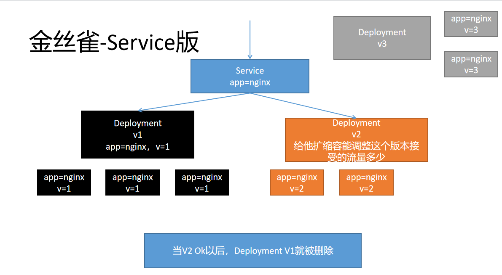

缺点：
- 不能自定义灰度逻辑，比如指定用户进行灰度

ingress 版本的金丝雀流程

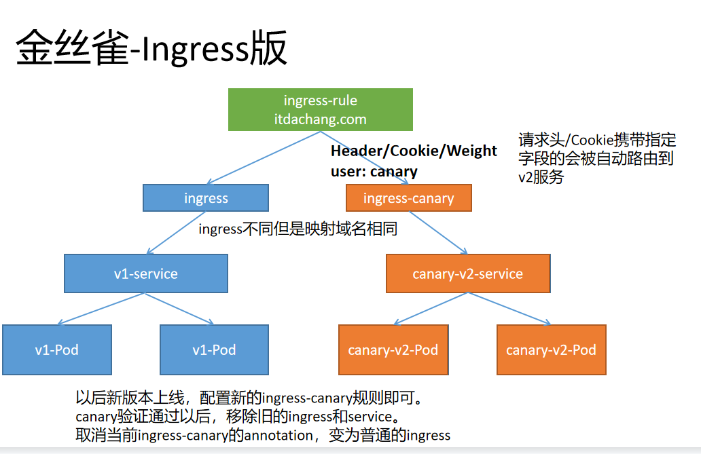

```yaml
## 使用如下文件部署两个service版本。v1版本返回nginx默认页，v2版本返回 11111
apiVersion: v1
kind: Service
metadata:
  name: v1-service
  namespace: ingress
spec:
  selector:
    app: v1-pod
  type: ClusterIP
  ports:
  - name: http
    port: 80
    targetPort: 80
    protocol: TCP
---
apiVersion: apps/v1
kind: Deployment
metadata:
  name:  v1-deploy
  namespace: ingress
  labels:
    app:  v1-deploy
spec:
  selector:
    matchLabels:
      app: v1-pod
  replicas: 1
  template:
    metadata:
      labels:
        app:  v1-pod
    spec:
      containers:
      - name:  nginx
        image:  nginx
---
apiVersion: v1
kind: Service
metadata:
  name: canary-v2-service
  namespace: ingress
spec:
  selector:
    app: canary-v2-pod
  type: ClusterIP
  ports:
  - name: http
    port: 80
    targetPort: 80
    protocol: TCP
---
apiVersion: apps/v1
kind: Deployment
metadata:
  name:  canary-v2-deploy
  namespace: ingress
  labels:
    app:  canary-v2-deploy
spec:
  selector:
    matchLabels:
      app: canary-v2-pod
  replicas: 1
  template:
    metadata:
      labels:
        app:  canary-v2-pod
    spec:
      containers:
      - name:  nginx
        image:  registry.cn-hangzhou.aliyuncs.com/lfy_k8s_images/nginx-test:env-msg
```


### 3.2.7 Session Affinity
https://kubernetes.github.io/ingress-nginx/user-guide/nginx-configuration/annotations/#session-affinity

> Cookie affinity
>
> 第一次访问，ingress-nginx会返回给浏览器一个Cookie，以后浏览器带着这个Cookie，保证访问总是抵达之前的Pod；
  ```yaml
  ## 部署一个三个Pod的Deployment并设置Service
  apiVersion: v1
  kind: Service
  metadata:
    name: session-affinity
    namespace: ingress
  spec:
    selector:
      app: session-affinity
    type: ClusterIP
    ports:
    - name: session-affinity
      port: 80
      targetPort: 80
      protocol: TCP
  ---
  apiVersion: apps/v1
  kind: Deployment
  metadata:
    name:  session-affinity
    namespace: ingress
    labels:
      app:  session-affinity
  spec:
    selector:
      matchLabels:
        app: session-affinity
    replicas: 3
    template:
      metadata:
        labels:
          app:  session-affinity
      spec:
        containers:
        - name:  session-affinity
          image:  nginx

### 利用每次请求携带同样的cookie，来标识是否是同一个会话
```bash
apiVersion: networking.k8s.io/v1
kind: Ingress
metadata:
  name: session-test
  namespace: ingress
  annotations:
    nginx.ingress.kubernetes.io/affinity: "cookie"
    nginx.ingress.kubernetes.io/session-cookie-name: "kino-session"
spec:
  rules:
  - host: kino.com
    http:
      paths:
      - path: /   ### 如果以前这个域名下的这个路径相同的功能有配置过，以最后一次生效
        pathType: Prefix
        backend:
          service:
            name: session-affinity   ###
            port:
              number: 80
```


# 四、NetworkPolicy

https://kubernetes.io/zh/docs/concepts/services-networking/network-policies/

在 k8s 中, 不同 namespace 之间, 网络默认是互通的, NetworkPolicy 可以指定 Pod 之间的隔离策略。

Pod 之间互通，是通过如下三个标识符的组合来辩识的：

1. 其他被允许的 Pods（例外：Pod 无法阻塞对自身的访问）
2. 被允许的名称空间
3. IP 组块（例外：与 Pod 运行所在的节点的通信总是被允许的， 无论 Pod 或节点的 IP 地址）

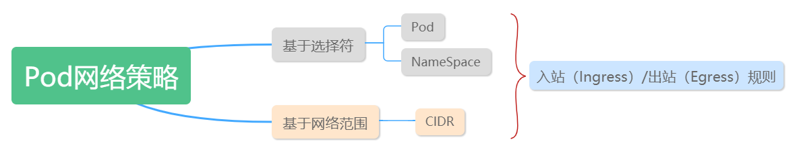

## 4.1 Pod 的隔离和非隔离
- 默认情况下，Pod网络都是非隔离的（non-isolated），可以接受来自任何请求方的网络请求。

- 如果一个 NetworkPolicy 的标签选择器选中了某个 Pod，则该 Pod 将变成隔离的（isolated），并将拒绝任何不被 NetworkPolicy 许可的网络连接。

## 4.2 示例
```yaml
apiVersion: networking.k8s.io/v1
kind: NetworkPolicy
metadata:
  name: test-network-policy
  namespace: networkpolicy
spec:
  podSelector:  ## 选中指定Pod
    matchLabels:
      role: db
  policyTypes:  ## 定义上面Pod的入站出站规则
  - Ingress
  - Egress
  ingress:    ## 定义入站白名单
  - from:   
    # 此选择器将选择特定的 IP CIDR 范围以用作入站流量来源或出站流量目的地。 这些应该是集群外部 IP，因为 Pod IP 存在时间短暂的且随机产生。
    - ipBlock:  
        cidr: 172.17.0.0/16
        except:
        - 172.17.1.0/24
    # 此选择器将选择特定的名字空间，应将所有 Pod 用作其 入站流量来源或出站流量目的地。
    - namespaceSelector:
        matchLabels:
          project: myproject
    # 此选择器将在与 NetworkPolicy 相同的名字空间中选择特定的 Pod，应将其允许作为入站流量来源或出站流量目的地。
    - podSelector:
        matchLabels:
          role: frontend
    ports:
    - protocol: TCP
      port: 6379
  egress:  ## 定义出站白名单
  - to: 
    - ipBlock: 
        cidr: 10.0.0.0/24
    ports:
    - protocol: TCP
      port: 5978
```

- **基本信息：** 同其他的 Kubernetes 对象一样，`NetworkPolicy` 需要 `apiVersion`、`kind`、`metadata` 字段
- spec：`NetworkPolicy`的spec字段包含了定义网络策略的主要信息：
  - **podSelector：** 同名称空间中，符合此标签选择器 `.spec.podSelector` 的 Pod 都将应用这个 `NetworkPolicy`。上面的 Example中的 podSelector 选择了 `role=db` 的 Pod。如果该字段为空，则将对名称空间中所有的 Pod 应用这个 `NetworkPolicy`
  - **policyTypes：** `.spec.policyTypes` 是一个数组类型的字段，该数组中可以包含 `Ingress`、`Egress` 中的一个，也可能两个都包含。该字段标识了此 `NetworkPolicy` 是否应用到 入方向的网络流量、出方向的网络流量、或者两者都有。如果不指定 `policyTypes` 字段，该字段默认将始终包含 `Ingress`，当 `NetworkPolicy` 中包含出方向的规则时，`Egress` 也将被添加到默认值。
  - ingress：ingress是一个数组，代表入方向的白名单规则。每一条规则都将允许与`from`和`ports`匹配的入方向的网络流量发生。例子中的`ingress`包含了一条规则，允许的入方向网络流量必须符合如下条件：
    - Pod 的监听端口为 `6379`
    - 请求方可以是如下三种来源当中的任意一种：
      - ipBlock 为 `172.17.0.0/16` 网段，但是不包括 `172.17.1.0/24` 网段
      - namespaceSelector 标签选择器，匹配标签为 `project=myproject`
      - podSelector 标签选择器，匹配标签为 `role=frontend`
  - egress：`egress`是一个数组，代表出方向的白名单规则。每一条规则都将允许与`to`和`ports`匹配的出方向的网络流量发生。例子中的`egress`允许的出方向网络流量必须符合如下条件：
    - 目标端口为 `5978`
    - 目标 ipBlock 为 `10.0.0.0/24` 网段

因此，例子中的 `NetworkPolicy` 对网络流量做了如下限制：

1. 隔离了 `default` 名称空间中带有 `role=db` 标签的所有 Pod 的入方向网络流量和出方向网络流量
2. Ingress规则（入方向白名单规则）：
   - 当请求方是如下三种来源当中的任意一种时，允许访问`default`名称空间中所有带`role=db`标签的 Pod 的6379端口：
     - ipBlock 为 `172.17.0.0/16` 网段，但是不包括 `172.17.1.0/24` 网段
     - namespaceSelector 标签选择器，匹配标签为 `project=myproject`
     - podSelector 标签选择器，匹配标签为 `role=frontend`
3. Egress规则（出方向白名单规则）：
   - 当如下条件满足时，允许出方向的网络流量：
     - 目标端口为 `5978`
     - 目标 ipBlock 为 `10.0.0.0/24` 网段

## 4.3 to 和 from 选择器的行为

NetworkPolicy 的 `.spec.ingress.from` 和 `.spec.egress.to` 字段中，可以指定 4 种类型的标签选择器：

- **podSelector** 选择与 `NetworkPolicy` 同名称空间中的 Pod 作为入方向访问控制规则的源或者出方向访问控制规则的目标
- **namespaceSelector** 选择某个名称空间（其中所有的Pod）作为入方向访问控制规则的源或者出方向访问控制规则的目标
- **namespaceSelector** 和 **podSelector** 在一个 `to` / `from` 条目中同时包含 `namespaceSelector` 和 `podSelector` 将选中指定名称空间中的指定 Pod。此时请特别留意 YAML 的写法，如下所示：

```yaml
 ...
  ingress:
  - from:
    - namespaceSelector:
        matchLabels:
          user: alice
      podSelector:
        matchLabels:
          role: client
  ...
```
该例子中，podSelector 前面没有 `-` 减号，namespaceSelector 和 podSelector 是同一个 from 元素的两个字段，将选中带 `user=alice` 标签的名称空间中所有带 `role=client` 标签的 Pod。但是，下面的这个 NetworkPolicy 含义是不一样的：

```yaml
  ...
  ingress:
  - from:
    - namespaceSelector:
        matchLabels:
          user: alice
    - podSelector:
        matchLabels:
          role: client
  ...
```
后者，podSelector 前面带 `-` 减号，说明 namespaceSelector 和 podSelector 是 from 数组中的两个元素，他们将选中 NetworkPolicy 同名称空间中带 `role=client` 标签的对象，以及带 `user=alice` 标签的名称空间的所有 Pod。
> 前者是交集关系（且），后者是并集关系（或）

- ipBlock** 可选择 IP CIDR 范围作为入方向访问控制规则的源或者出方向访问控制规则的目标。这里应该指定的是集群外部的 IP，因为集群内部 Pod 的 IP 地址是临时分配的，且不可预测。

集群的入方向和出方向网络机制通常需要重写网络报文的 source 或者 destination IP。kubernetes 并未定义应该在处理 `NetworkPolicy` 之前还是之后再修改 source / destination IP，因此，在不同的云供应商、使用不同的网络插件时，最终的行为都可能不一样。这意味着：

- 对于入方向的网络流量，某些情况下，你可以基于实际的源 IP 地址过滤流入的报文；在另外一些情况下，NetworkPolicy 所处理的 "source IP" 可能是 LoadBalancer 的 IP 地址，或者其他地址
- 对于出方向的网络流量，**基于 ipBlock 的策略可能有效，也可能无效**