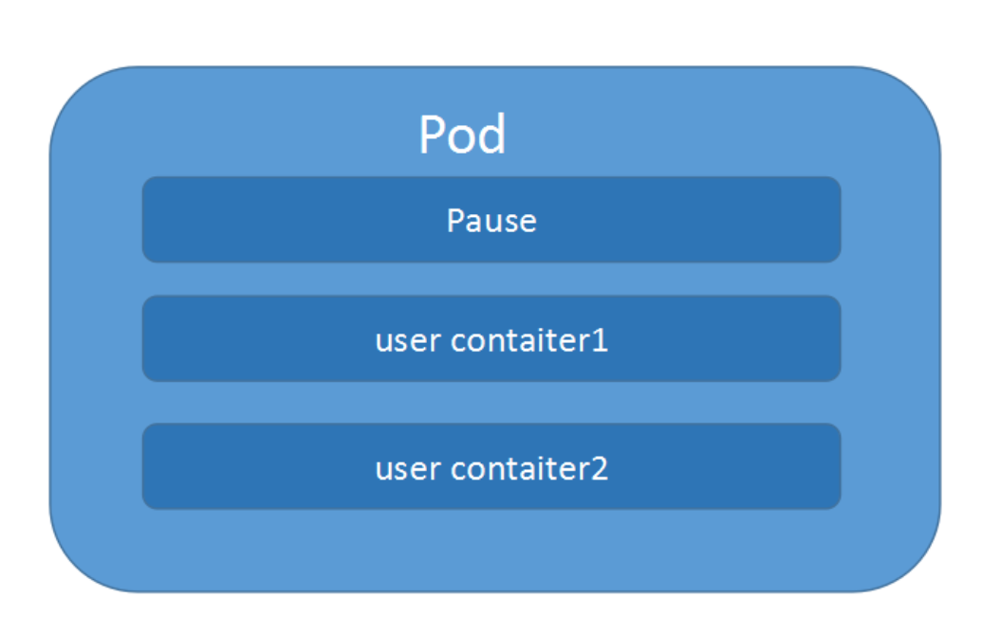
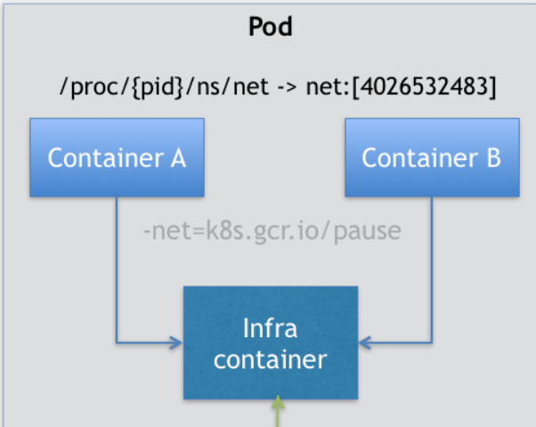
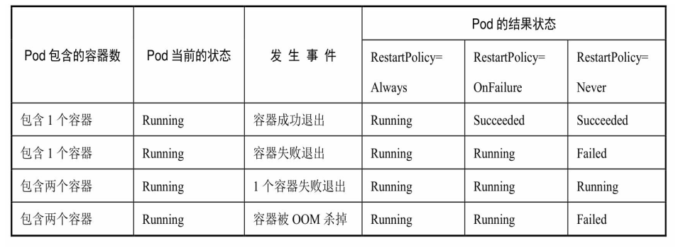
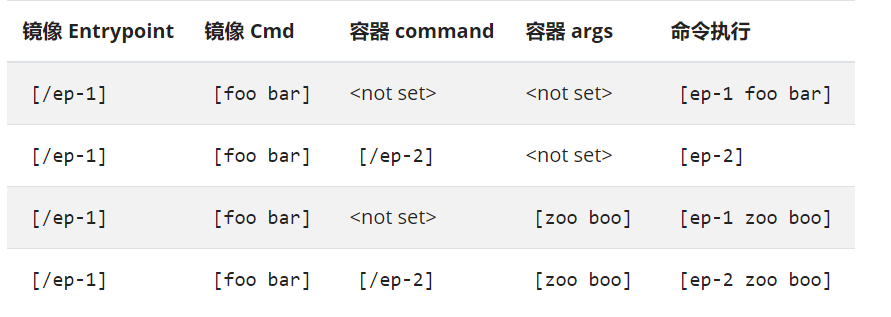

---
# 一、Pod 是什么
Kubernetes 中的一切都可以理解成一种资源对象, Pod、rc、service 等都可以理解成一种资源对象

Pod 是 k8s 中可以创建和管理的最小单元

Pod 是在 k8s 上运行容器化应用的资源对象, 其他的资源对象都是用来支撑或者扩展 Pod 对象功能的, 例如:
- 控制器对象是用来管控 Pod 对象的
- Service 或者 Ingress 资源对象是用来暴露 Pod 引用对象的
- PersistentVolume 资源对象是用来为 Pod 提供存储

k8s 不会直接处理容器本身, 而是处理 Pod

Pod 是由一个或多个 container 组成的


# 二、Pod存在的意义
假设我们的 k8s 集群上有两个几点: node1 有 3G 可用内存, node2 有 2.5G 可用内存, 这是需要用 Docker Swarm 来运行一个程序(包含3个容器, 每个都需要1G 内存, 3个容器互相依赖, 且必须运行在同一台机器上), 当这三个容器进入 Swarm 的调度队列, 然后这三个容器先后被调度到 node2 上(完全有可能的, 因为 第1个容器仅需要1G内存), 当最后一个容器被调度时, 集群上的可用内存仅有 0.5G 了, 但是这个程序中的3个容器存在互相依赖的约束

在 k8s 中, 会将这三个容器组成一个 Pod, k8s 在调度的时候, 自然就会去选择可用内存等于 3G 的 node1 节点进行绑定, 根本不会考虑 node2


# 三、Pod实现机制
Pod 中的所有容器, 会共享同一个 network namespace, 并且可以声明共享一个 volume  

在 k8s 中, Pod 的实现需要使用一个中间容器, 这个容器叫做: Infra容器. 在这个 Pod 中, Infra 容器永远都是第一个被创建的容器, 而其他用户定义的容器, 则通过 Join NetWork NameSpace 的方式, 与 Infra 容器关联在一起, 关系如下图:





如图中所示, 这个 Pod 中有两个用户容器 A 和 B, 还有一个 Infra 容器, 在 k8s 中, Infra 容器永远处于 "暂停状态", 且占用极少的资源

在 Infra 容器初始了 Network NameSpace 之后, 用户容器就可以加入到 Infra 容器的 Network NameSpace 当中, 这也就意味着, 对于 Pod 里的容器 A 和 容器B来说:
1. 他们可以直接用 localhost 来进行通信
2. 他们看到的网络设备跟 Infra 容器看到的完全一样
3. 一个 Pod 只有一个 IP 地址, 也就是这个 Pod 的 Network NameSpace 对应的 IP 地址
4. 其他的所有网络资源, 都是一个 Pod 一份, 并且被该 Pod 中的所有容器共享
5. Pod 的生命周期只跟 Infra 容器一致, 而与 容器A 和 容器B 无关

对于容一个 Pod 里的所有用户容器来说, 他们的进出流量, 也可以认为都是通过 Infra 容器完成的。

# 四、完整的 Pod Yaml 文件
```yaml
apiVersion: v1            //版本
kind: pod                 //类型，pod
metadata:                 //元数据
  name: String            //元数据，pod的名字
  namespace: String       //元数据，pod的命名空间
  labels:                 //元数据，标签列表
    - name: String        //元数据，标签的名字
  annotations:            //元数据,自定义注解列表
    - name: String        //元数据,自定义注解名字
spec:                     //pod中容器的详细定义
  containers:             //pod中的容器列表，可以有多个容器
  - name: String
    image: String         //容器中的镜像
    imagesPullPolicy: [Always|Never|IfNotPresent]//获取镜像的策略
    command: [String]     //容器的启动命令列表（不配置的话使用镜像内部的命令）
    args: [String]        //启动参数列表
    workingDir: String    //容器的工作目录
    volumeMounts:         //挂载到到容器内部的存储卷设置
    - name: String
      mountPath: String
      readOnly: boolean
    ports:                //容器需要暴露的端口号列表
    - name: String
      containerPort: int  //容器要暴露的端口
      hostPort: int       //容器所在主机监听的端口（容器暴露端口映射到宿主机的端口）
      protocol: String
    env:                  //容器运行前要设置的环境列表
    - name: String
      value: String
    resources:            //资源限制
      limits:
        cpu: Srting
        memory: String
      requeste:
        cpu: String
        memory: String
    livenessProbe:         //pod内容器健康检查的设置
      exec:
        command: [String]
      httpGet:             //通过httpget检查健康
        path: String
        port: number
        host: String
        scheme: Srtring
        httpHeaders:
        - name: Stirng
          value: String 
      tcpSocket:           //通过tcpSocket检查健康
        port: number
      initialDelaySeconds: 0//首次检查时间
      timeoutSeconds: 0     //检查超时时间
      periodSeconds: 0      //检查间隔时间
      successThreshold: 0
      failureThreshold: 0
      securityContext:      //安全配置
        privileged: falae
    restartPolicy: [Always|Never|OnFailure]//重启策略
    nodeSelector: object    //节点选择
    imagePullSecrets:
    - name: String
    hostNetwork: false      //是否使用主机网络模式，默认否
  volumes:                  //在该pod上定义共享存储卷
  - name: String
    meptyDir: {}
    hostPath:
      path: string
    secret:                 //类型为secret的存储卷
      secretName: String
      item:
      - key: String
        path: String
    configMap:             //类型为configMap的存储卷
      name: String
      items:
      - key: String
        path: String
```

# 五、Pod 容器共享 Volume
```yaml
apiVersion: v1
kind: Pod
metadata:
  name: first-pod-volume
spec:
  # 声明一个 volume
  volumes:
  # volume 的名字是: first-pod-volume-logs
  - name: first-pod-volume-logs
    # volume 的类型为 emptyDir(还可以设置其他类型)
    emptyDir: {}
  containers:
  - name: tomact
    image: tomcat
    ports:
    - containerPort: 8080
    # 挂载 volume
    volumeMounts:
    # 选择 first-pod-volume-logs volume 挂载
    - name: first-pod-volume-logs
      # 挂载到 tomcat 容器内的 /opt/tomcat/logs
      mountPath: /opt/tomcat/logs
```
上面声明的是一个 emptyDir volume, 还有其他几种声明 volume 的方式
```yaml
volumes:
- name: first-pod-volume-logs
  emptyDir: {}

volumes:
- name: first-pod-volume-logs
  hostPath:
    path: "/data"

volumes:
- name: first-pod-volume-logs
  gcePersistenDisk:
    pdName: my-data-disk # my-data-disk 需要提前创建好
    fsType: ext4
```
1. emptyDir 是 Pod 分配到 Node 后创建的, 他的初始内容是空的, pod 在 Node 上移除以后就自动被销毁了
2. hostPath 是 该挂载到宿主机上的目录, 比较适用于需要永久保存的数据
3. gcePersistenDisk 表示实用谷歌公有云提供的磁盘


# 六、Pod 的生命周期和重启策略

Pod 的 生命周期: Pod 一共有四种状态
| 状态值 | 描述 |
| --- | ---|
| Pending    | API Server 已经创建该 Pod, 但 Pod 内有一个或多个容器的镜像还未创建, 可能还在下载镜像中    |
| Running    | Pod 内所有的容器已经创建, 且至少有一个容器处于运行状态、正在启动状态、正在重启状态   |
| Succeeded | Pod 内所有的容器均成功执行后退出, 且不会在重启 |
| Failed    | Pod 内所有的容器都已经退出, 其中至少有一个容器退出失败   |
| Unknown    | 由于某种原因无法获取 Pod 的装填, 比如网络不通    |

Pod 的 重启策略(restartPolicy): 当某个**容器***异常退出*或者*健康检查*失败时, kubeclet 将根据 restartPolicy 的设置进行相应的操作

| 重启策略 | 描述 |
| ---- | --- |
| Always | 当**容器**失效时, 自动重启 | 
| OnFailure | 当容器终止运行且退出码不为0时(异常退出), 自动重启 | 
| Never | 不论如何, 永不重启 | 
```yaml
apiVersion: v1
....
spec:
....
  # 设置 Pod 的重启策略
  restartPolicy: Never
```

**容器重启的小细节:**

kubelet 重启失效容器的时间间隔以 sync-frequency 乘以2n来计算, 例如1、 2、 4、 8倍等， 最长延时5min， 并且在成功重启后的10min后重置该时间

Pod 的重启策略与控制方式息息相关, 当前可以用于管理 Pod 的控制器包括: ReplicationController、Job、DaemonSet 和 直接通过 kubelet 管理(静态 Pod), 每种控制器对 Pod 的重启策略要求如下:
- RC 和 DaemonSet: 必须设置为 Always, 需要保证该容器持续运行
- Job: OnFailure 和 Never, 确保容器执行完成后不再重启
- kubelet: 在 Pod 失效时自动重启它, 不论将 restartPolicy 设置为什么值, 也不会对 Pod 进行健康检查

一些常见的状态转换场景:




# 七、Lifecycle(钩子)
Lifecycle(Container Lifecycle Hooks) 的作用: 在容器状态发生变化时触发一系列 "钩子"

先看个官方例子:
```yaml
apiVersion: v1
kind: Pod
metadata:
  name: lifecycle-demo
spec:
  containers:
  - name: lifecycle-demo-container
    image: nginx
    lifecycle:
      postStart:
        exec:
          command: ["/bin/sh", "-c", "echo Hello from the postStart handler > /usr/share/message"]
      preStop:
        exec:
          command: ["/usr/sbin/nginx","-s","quit"]
```
这个 yaml 文件定义了一个 nginx 镜, 在 lifecycle 配置了如下两个参数:
- postStart: 容器启动后, 立即执行一个指定的操作
- preStop: 容器被杀死之前, 立即执行一个指定的操作, 直到这个操作执行完成, 才允许容器被杀死

这个yaml中, 在容器启动后, 执行 echo 输出了一句话, 在容器被杀死之前, 指定 nginx 的退出命令, 然后杀死容器, 实现了容器的 "优雅退出"

# 八、Pod 健康检查(探针)

Kubernetes 中, 有 3 种 探针, 实现了对 Pod 的健康检查：

- 启动探针(startupProbe 探针): 判断容器是否启动(start)， 控制容器在启动后再进行就绪、存活检查。**启动探针为一次性的**。
- 就绪探针(livenessProbe 探针): 判断容器是否准备好接受请求流量, 在未准备好时, 会从 Service 的负载均衡器中剔除，在就绪探针失败时，会重启容器。
- 存活探针(readinessProbe 探针): 用于判断容器是否启动完成(ready)，如果捕捉到死锁，会重启容器。

**以上三种探针, 在探测失败后, 都会重启容器。**

Probe 支持三种检查方式:
- httpGet: 发送 Http 请求, 返回 200-400 范围状态码为成功
- exec: 执行 Shell 命令返回状态码是 0 为成功
- tcpSocket: 发起 TCP Socket 建立成功

## 8.1 httpGet 的方式:

```yaml
$ vim livenessProbe-httpGet.yaml
apiVersion: v1
kind: Pod
metadata:
  name: liveness-http-get
spec:
  volumes:
  - name: first-pod-volume-logs
    emptyDir: {}
  containers:
  - name: nginx
    image: nginx:1.7.9
    ports:
    - containerPort: 80
    volumeMounts:
    - name: first-pod-volume-logs
      mountPath: /opt/tomcat/logs
    livenessProbe:
      httpGet:
        # 定时发送请求到 localhost:80/index.html 来进行容器应用的健康检查
        path: index.html  # 请求路径
        port: 80
      initialDelaySeconds: 5 # 在容器启动 5s 后开始执行
      periodSeconds: 2       # 每 5s 执行一次
      timeoutSeconds: 1      # 超时时间为 1s
  restartPolicy: Always
```

## 8.2 exec 的方式:

```yaml
$ vim livenessProbe-exec.yaml
apiVersion: v1
kind: Pod
metadata:
  name: liveness-exec
spec:
  volumes: 
  - name: first-pod-volume-logs
    emptyDir: {}
  containers:
  - name: nginx
    image: nginx:1.7.9
    ports:
    - containerPort: 80
    volumeMounts:
    - name: first-pod-volume-logs
      mountPath: /opt/tomcat/logs
    args:
    - /bin/sh
    - -c 
    - echo ok > /tmp/healthy; sleep 30; rm -rf /tmp/healthy
    livenessProbe:
      exec:
        command: 
        - cat 
        - /tmp/healthy
      initialDelaySeconds: 5  # 在容器启动后 5s 开始执行
      periodSeconds: 2         # 每 2s 执行一次
      timeoutSeconds: 1      # 超时时间为 1s
  restartPolicy: Always
```

## 8.3 tcpSocket 的方式:

```yaml
$ vim livenessProbe-tcp.yaml
apiVersion: v1
kind: Pod
metadata:
  name: liveness-tcp
spec: 
  volumes:
  - name: first-pod-volume-logs
    emptyDir: {}
  containers:
  - name: nginx
    image: nginx:1.7.9
    ports:
    - containerPort: 80
    volumeMounts:
    - name: first-pod-volume-logs
      mountPath: /opt/tomcat/logs
    livenessProbe:
      tcpSocket:
        port: 80
    initialDelaySeconds: 5
    periodSeconds: 2
    timeoutSeconds: 2
  restartPolicy: Always
```


对于 volume 的共享, K8s 只需要把所有的 volume 的定义都设计在 Pod 层级即可, 例如下面的例子:
```yaml
apiVersion: v1
kind: Pod
metadata:
  name: two-containers
spec:
  volumes:
  - name: shared-data
    hostPath:      
      path: /data
  containers:
  - name: nginx-container
    image: nginx
    volumeMounts:
    - name: shared-data
      mountPath: /usr/share/nginx/html
  - name: debian-container
    image: debian
    volumeMounts:
    - name: shared-data
      mountPath: /pod-data
    command: ["/bin/sh"]
    args: ["-c", "echo Hello from the debian container > /pod-data/index.html"]
  restartPolicy: Never
```
在这个例子中, nginx-container 和 debian-container 都声明挂载了 shared-data 这个 volume, 而 shared-data 是 hostPath 类型, 所以, 它对应宿主机上的目录就是 /data, 而这个目录, 就同时被绑定进了这两个容器中, 这样的话 nginx-container 容器就可以从 /usr/share/nginx/html 目录中读取到 debian-container 生成的 index.html 文件了


对于 HTTP 或者 TCP 存活检测可以使用命名的 [ContainerPort](https://kubernetes.io/docs/reference/generated/kubernetes-api/v1.23/#containerport-v1-core)

```bash
ports:
- name: liveness-port
  containerPort: 8080
  hostPort: 8080

livenessProbe:
  httpGet:
    path: /healthz
    port: liveness-port
```


# 九、Pod 的镜像拉取策略
```yaml
$ vim pod-imagePollPolicy.yaml
apiVersion: v1
kind: Pod
metadata: 
  name: pod-image-pull-policy
spec:
  # 定义一个共享存储数据卷
  volumes:
  # 共享存储数据卷的名字是: first-pod-volume-logs
  - name: first-pod-volume-logs
    # 共享存储数据卷的类型是: emptyDir
    emptyDir: {}
  # 定义 container 相关的内容
  containers:
  # container 的名称
  - name: image-pull-policy
    # container 的 image 及 版本
    image: tomcat:7.0-alpine
    # 容器需要暴露的端口号列表
    ports:
    # 容器要暴露的端口
    - containerPort: 8080
      # 容器所在主机监听的端口（容器暴露端口映射到宿主机的端口）
      hostPort: 8080
    # 指定 container 的拉取策略
    imagePullPolicy: IfNotPresent   # 如果镜像不存在就拉取
    # container 使用共享存储数据卷
    volumeMounts:
    - name: first-pod-volume-logs
      # 将数据卷挂载到 容器的 /var/log/tomcat 目录中
      mountPath: /var/log/tomcat
    # 指定 Pod 的 LivenessProbe探针(httpGet), 判断是否存活
    livenessProbe:
      # 探针的类型是: httpGet
      httpGet:
        # 探测 localhost:8080/index.jsp 是否存在
        path: /index.jsp
        port: 8080
      # 探针在容器启动 5s 后开始执行
      initialDelaySeconds: 5
      # 探测每 3s 执行一次
      periodSeconds: 3
      # 探测的 超时时间 为 5s
      timeoutSeconds: 5
  # 指定 Pod 的重启策略
  restartPolicy: OnFailure # 容器异常退出时, 自动重启
```
imagePullPolicy有三个参数可选:
- IfNotPresent: 默认值, 镜像在宿主机上不存在时才拉取
- Always: 每次创建 pod 都会重新拉取一次镜像
- Never: Pod 永远不会主动拉取这个镜像, 只使用本地镜像

当 imagePullPolicy 是 Always 时, 查看 初始化过程:
```bash
[root@k8s-master k8s]# kubectl describe pod/pod-image-pull-policy
...
Events:
  Type     Reason     Age                 From                Message
  ----     ------     ----                ----                -------
  Normal   Scheduled  <unknown>           default-scheduler   Successfully assigned default/pod-image-pull-policy to k8s-node1
  Normal   Pulling    4m30s               kubelet, k8s-node1  Pulling image "tomcat:7.0-alpine"
  Normal   Pulled     112s                kubelet, k8s-node1  Successfully pulled image "tomcat:7.0-alpine"
  Normal   Created    74s (x4 over 111s)  kubelet, k8s-node1  Created container image-pull-policy
  Normal   Started    74s (x4 over 111s)  kubelet, k8s-node1  Started container image-pull-policy
  Warning  Unhealthy  74s (x9 over 104s)  kubelet, k8s-node1  Liveness probe failed: HTTP probe failed with statuscode: 404
```
可以看到, 当 imagePullPolicy 为 IfNotPresent 时, 第一次初始化过程中是有 Pulling image 的;

此时 delete 掉, 重新启动, 查看 初始化过程:
```bash
...
Events:
  Type     Reason     Age              From                Message
  ----     ------     ----             ----                -------
  Normal   Scheduled  <unknown>        default-scheduler   Successfully assigned default/pod-image-pull-policy to k8s-node1
  Normal   Pulled     11s              kubelet, k8s-node1  Container image "tomcat:7.0-alpine" already present on machine
  Normal   Created    11s              kubelet, k8s-node1  Created container image-pull-policy
  Normal   Started    11s              kubelet, k8s-node1  Started container image-pull-policy
  Warning  Unhealthy  2s (x2 over 5s)  kubelet, k8s-node1  Liveness probe failed: HTTP probe failed with statuscode: 404
```
可以看到, 此时的初始化过程并没有去 Pulling image 了, 因为 本地已经有了 tomcat 容器;

**需要注意的是: 如果 image 的 tag 标签 被省略掉 或者为 latest 时, 策略走的还是 Always, 反之则为 IfNotPresent;**

# 十、Pod 资源限制
在 Kubernetes 中, 可以使用 resources 来设置各个 container 需要的最小资源;
```yaml
$ vim pod-resources.yaml
apiVersion: v1
kind: Pod
metadata: 
  name: pod-resources
spec:
  # 定义一个共享存储数据卷
  volumes:
  # 共享存储数据卷的名字是: first-pod-volume-logs
  - name: first-pod-volume-logs
    # 共享存储数据卷的类型是: emptyDir
    emptyDir: {}
  # 定义 container 相关的内容
  containers:
  # container 的名称
  - name: pod-resources
    # container 的 image 及 版本
    image: tomcat:7.0-alpine
    # 容器需要暴露的端口号列表
    ports:
    # 容器要暴露的端口
    - containerPort: 8080
      # 容器所在主机监听的端口（容器暴露端口映射到宿主机的端口）
      hostPort: 8080
    # 指定 container 的拉取策略
    imagePullPolicy: IfNotPresent   # 如果镜像不存在就拉取
    # container 使用共享存储数据卷
    volumeMounts:
    - name: first-pod-volume-logs
      # 将数据卷挂载到 容器的 /var/log/tomcat 目录中
      mountPath: /var/log/tomcat
    # 指定 Pod 的 LivenessProbe探针(httpGet), 判断是否存活
    livenessProbe:
      # 探针的类型是: httpGet
      httpGet:
        # 探测 localhost:8080/index.jsp 是否存在
        path: /index.jsp
        port: 8080
      # 探针在容器启动 5s 后开始执行
      initialDelaySeconds: 5
      # 探测每 3s 执行一次
      periodSeconds: 3
      # 探测的 超时时间 为 5s
      timeoutSeconds: 5
    # 设置 container 的资源限制
    resources: 
      # 要求 container 的 内存 和 cpu 最小有这么大
      requests: 
        memory: "64Mi"
        cpu: "250m"
      # 要求 container 的内存最大为这么大
      limits:
        memory: "128Mi"
        cpu: "500m"
  # 指定 Pod 的重启策略
  restartPolicy: OnFailure # 容器异常退出时, 自动重启
```

# 十一、Pod | label 对 Pod 的影响
在默认情况下, Kubernetes 会将 Pod 调度到所有可用的 Node, 不过有些情况下, 希望能将 Pod 部署到指定的 Node 上, 比如将有大量磁盘 I/O 的 Pod 部署到 配置了 SSD 的 Node; 或者 Pod 需要 GPU, 需要运行在配置了 GPU 的节点上.

Kubernetes 通过 label 来实现这个功能

[Kubernetes label](note/Kubernetes/k8s-label.md)

1. 给 k8s-node1 打上一个 ssd 的 label
```yaml
$ kubectl label node k8s-node1 disktype=ssd
```
2. 查看 label
```yaml
$ kubectl get node --show-labels
```
3. 指定 Pod 在 k8s-node1 中运行
```yaml
$ vim pod-label.yaml
apiVersion: apps/v1
kind: Deployment
metadata:
  name: tomcat-deployment
spec:
  replicas: 5
  selector:
    matchLabels:
      app: tomcat
  template:
    metadata:
      labels:
        app: tomcat
    spec:
      nodeSelector:
        disktype: ssd
      containers:
      - name: tomcat
        image: tomcat:7.0-alpine
        ports:
        - containerPort: 8080
```
4. 验证
```bash
$ kubectl get pod -o wide
NAME                                 READY   STATUS    RESTARTS   AGE   IP            NODE        NOMINATED NODE   READINESS GATES
tomcat-deployment-54b4ff8c57-546bv   1/1     Running   0          52s   10.244.1.81   k8s-node1   <none>           <none>
tomcat-deployment-54b4ff8c57-56r99   1/1     Running   0          52s   10.244.1.84   k8s-node1   <none>           <none>
tomcat-deployment-54b4ff8c57-76f6d   1/1     Running   0          52s   10.244.1.82   k8s-node1   <none>           <none>
tomcat-deployment-54b4ff8c57-t7cxb   1/1     Running   0          52s   10.244.1.83   k8s-node1   <none>           <none>
tomcat-deployment-54b4ff8c57-wfmpl   1/1     Running   0          52s   10.244.1.80   k8s-node1   <none>           <none>
```
注意: 删除掉 node 上的 disktype=ssd 标签, 并不会重新部署, 所有的 Pod依旧是在 k8s-node1 上

如果删掉 disktype=ssd 之后, 想要 k8s-node2 也加入工作负载中, 必须删掉当前的 deployment, 并且删除或者注释掉 nodeSelector 配置


# 十二、command/args 的作用和影响
https://kubernetes.io/zh/docs/tasks/inject-data-application/define-command-argument-container/
```yaml
apiVersion: v1
kind: Pod
metadata:
  name: my-command-test
  namespace: day10
spec:
  containers:
  - name: command-test
    image: nginx
    command: ["/bin/bash"] # 直接覆盖容器的默认命令
    args: ["-c", "while true; do echo $(msg); sleep 1; done"]
    env: 
    - name: msg
      value: "hello msg"
    workingDir: "/opt"
  restartPolicy: Always
```
command 会覆盖容器的默认命令




# 十三、Pod资源限制
```yaml
apiVersion: v1
kind: Pod
metadata:
  name: frontend
spec:
  containers:
  - name: db
    image: mysql
    env:
    - name: MYSQL_ROOT_PASSWORD
      value: "password"
    resources:
      requests:
        memory: "64Mi"
        cpu: "250m"
      limits:
        memory: "128Mi"
        cpu: "500m"
```
- resources.requests:  要求Container的内存和cpu必须有这么大
- resources.limits: 要求Container的内存最大为这么大

# 十四、节点亲和性
```yaml
apiVersion: v1
kind: Pod
metadata:
  name: with-node-affinity
spec:
  affinity:
    nodeAffinity:
      requiredDuringSchedulingIgnoredDuringExecution:
        nodeSelectorTerms:
        - matchExpressions:
          - key: env_role
            operator: In
            values:
            - dev
            - test
      preferredDuringSchedulingIgnoredDuringExecution:
        - weight: 1
          preference: 
            matchExpressions:
            - key: group
              operator: In
              values:
              - otherprod
  containers:
  - name: webdemo
    image: nginx
```
- requiredDuringSchedulingIgnoredDuringExecution: 硬亲和性, 约束条件必须满足, 否则一直等待到条件满足
- preferredDuringSchedulingIgnoredDuringExecution: 软亲和性, 尝试满足, 不保证约束条件满足
  - weight: 权重
  - operator: 操作符
    - In
    - NotIn
    - Exists
    - Gt
    - Lt
    - DoesNotExists


# 十五、NodeName(强制约束pod节点)
pod.spec.nodeName 用于强制约束将Pod调度到指定的Node节点上, 一旦 Pod 的这个字段被赋值, k8s 就会认为这个 Pod 已经经过了调度, 调度的结果就是赋值的节点名字, 所以这个字段一般由调度器负责设置, 但是用户也可以设置它来 骗过 调度器, 这里说是“调度”，但其实指定了nodeName的Pod会直接跳过Scheduler的调度逻辑，直接写入PodList列表，该匹配规则是强制匹配。

```yaml
$ vim nodeName.yaml
apiVersion: apps/v1              #当前配置格式版本
kind: Deployment                                #创建资源类型
metadata:                                       #资源元数据，name是必须项
  name: tomcat7-deployment
spec:                                           #资源规格说明
  replicas: 3                                   #副本数量
  selector:
    matchLabels:
      k8s-app: web-tomcat7
  template:                                 #定义pod模板
    metadata:                                   #pod元数据，至少一个label
      labels:
        k8s-app: web-tomcat7
    spec:                                       #pod规格说明
      nodeName: k8s-node1
      containers:
      - name: tomcat7
        image: tomcat:8.0
        ports:
        - containerPort: 8080

---
apiVersion: v1
kind: Service
metadata:
  name: tomcat7-deployment
spec:
  ports:
  - nodePort: 31348
    port: 8080
    protocol: TCP
    targetPort: 8080
  selector:
    k8s-app: web-tomcat7
  type: NodePort
```
查看 pod
```bash
$ kubectl get pod -o wide
NAME                                  READY   STATUS    RESTARTS   AGE   IP            NODE        NOMINATED NODE   READINESS GATES
tomcat7-deployment-66cc45dd88-fpql8   1/1     Running   0          19s   10.244.1.28   k8s-node1   <none>           <none>
tomcat7-deployment-66cc45dd88-lnxzz   1/1     Running   0          19s   10.244.1.27   k8s-node1   <none>           <none>
tomcat7-deployment-66cc45dd88-m76xw   1/1     Running   0          19s   10.244.1.29   k8s-node1   <none>           <none>
```
还可以在浏览器中通过 `masterIP:31348` 访问tomcat


# 十六、hostAliases(容器hosts文件)
定义了 Pod 的 hosts 文件(如 /etc/hosts) 里的内容
```yaml
$ vim hostAliases.yaml
apiVersion: apps/v1
kind: Deployment
metadata:
  name: tomcat7-deployment
spec:
  replicas: 3
  selector:
    matchLabels:
      k8s-app: web-tomcat7
  template:
    metadata:
      labels:
        k8s-app: web-tomcat7
    spec:
      hostAliases:
      - ip: "10.1.2.3"
        hostnames:
        - "foo.remote"
        - "bar.remote"
      nodeName: k8s-node1
      containers:
      - name: tomcat7
        image: tomcat:8.0
        ports:
        - containerPort: 8080

---
apiVersion: v1
kind: Service
metadata:
  name: tomcat7-deployment
spec:
  ports:
  - nodePort: 31348
    port: 8080
    protocol: TCP
    targetPort: 8080
  selector:
    k8s-app: web-tomcat7
  type: NodePort

$ kubectl apply -f hostAliases.yaml

$ kubectl get pod 
NAME                                  READY   STATUS    RESTARTS   AGE
tomcat7-deployment-76744f6846-7v5lr   1/1     Running   0          2m37s
tomcat7-deployment-76744f6846-hxd88   1/1     Running   0          2m37s
tomcat7-deployment-76744f6846-vv47b   1/1     Running   0          2m37s

$ kubectl exec -it tomcat7-deployment-76744f6846-7v5lr bash

root@tomcat7-deployment-76744f6846-7v5lr:/usr/local/tomcat# cat /etc/hosts
# Kubernetes-managed hosts file.
127.0.0.1	localhost
::1	localhost ip6-localhost ip6-loopback
fe00::0	ip6-localnet
fe00::0	ip6-mcastprefix
fe00::1	ip6-allnodes
fe00::2	ip6-allrouters
10.244.1.32	tomcat7-deployment-76744f6846-7v5lr

# Entries added by HostAliases.
10.1.2.3	foo.remote	bar.remote
```
如果要在k8s中设置 hosts 文件中的内容, 一定要通过这种方式, 否则直接修改hosts 文件的话, 在 Pod 被删除重建后, k8s 会自动覆盖掉被修改的内容


# 十七、污点和污点容忍
污点(Taint): 节点不做普通分配调度, 是node属性

和 `九、label 对Pod调度的影响`、 `八、节点亲和性` 类似

## 17.1 查看节点污染情况

① 方式一
```bash
$ kubectl get nodes <nodename> -o go-template={{.spec.taints}}
$ kubectl get nodes k8s-node1 -o go-template={{.spec.taints}}
[map[effect:NoSchedule key:foo value:bar]]
```
② 方式二
```bash
$ kubectl describe node master | grep Taint
Taints:             node.kubernetes.io/unreachable:NoExecute
```
污点值有如下三个:
- NoSchedule: 一定不被调度
- PreferNoSchedule: 尽量不被调度
- NoExecute: 不会调度, 并且会驱除 Node 已有 Pod

## 17.2 为节点添加污点
```bash
# 添加污点
$ kubectl taint node k8s-master <key>=<value>:<effect>
$ kubectl taint node k8s-master kino=test:NoSchedule
node/k8s-master tainted

# 查看污点
$ kubectl describe node k8s-master | grep Taint
Taints:             kino=test:NoSchedule
```

## 17.3 删除污点
① 删除所有污点
```bash
[root@k8s-master ~]# kubectl patch nodes k8s-node1 -p '{"spec":{"taints":[]}}'
```
② 删除指定key的污点
```bash
[root@k8s-master ~]# kubectl taint nodes --all foo-
[root@k8s-master ~]# kubectl taint nodes --all node-type-
```
③ 删除指定key, 指定value的污点
```bash
[root@k8s-master ~]# kubectl taint nodes --all foo:NoSchedule-
[root@k8s-master ~]# kubectl taint nodes --all node-type:NoSchedule-
```


## 17.3 污点容忍
### ① 等值判断
```yaml
tolerations:
- key: "key1"
  operator: "Equal" #判断条件为 Equal
  value: "value1"
  effect: "NoExecute"
  tolerationSeconds: 3600
```
### ② 存在性判断
```yaml
tolerations: 
- key: "key1"
  operator: "Exists"#存在性判断，只要污点键存在，就可以匹配
  effect: "NoExecute"
  tolerationSeconds: 3600
apiVersion: v1
kind: Deployment
metadata: 
  name: myapp-deploy
  namespace: default
spec:
  replicas: 3
  selector: 
    matchLabels: 
      app: myapp
      release: canary
  template:
    metadata:
      labels:
        app: myapp
        release: canary
    spec:
      containers:
      - name: myapp
      image: ikubernetes/myapp:v1
      ports:
      - name: http
        containerPort: 80
      tolerations:
      - key: "node-type"
        operator: "Equal"
        value:"production":
        effect: "NoExecute"
        tolerationSeconds: 3600
```