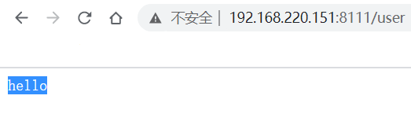
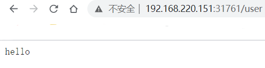

* [一、步骤总览](#%E4%B8%80%E6%AD%A5%E9%AA%A4%E6%80%BB%E8%A7%88)
* [二、步骤一](#%E4%BA%8C%E6%AD%A5%E9%AA%A4%E4%B8%80)
* [三、步骤二](#%E4%B8%89%E6%AD%A5%E9%AA%A4%E4%BA%8C)
  * [3\.1 编写 Dockerfile 文件](#31-%E7%BC%96%E5%86%99-dockerfile-%E6%96%87%E4%BB%B6)
  * [3\.2 docker build](#32-docker-build)
  * [3\.3 docker images](#33-docker-images)
  * [3\.4 docker run](#34-docker-run)
  * [3\.5 访问](#35-%E8%AE%BF%E9%97%AE)
* [四、步骤三: 上传到 阿里云](#%E5%9B%9B%E6%AD%A5%E9%AA%A4%E4%B8%89-%E4%B8%8A%E4%BC%A0%E5%88%B0-%E9%98%BF%E9%87%8C%E4%BA%91)
* [五、步骤四: 部署镜像, 暴露应用](#%E4%BA%94%E6%AD%A5%E9%AA%A4%E5%9B%9B-%E9%83%A8%E7%BD%B2%E9%95%9C%E5%83%8F-%E6%9A%B4%E9%9C%B2%E5%BA%94%E7%94%A8)


---
# 一、步骤总览
1. 准备 Java 项目, 把 Java 进行打包(jar包 或者 war包)
2. 制作镜像
3. 上传到 阿里云
4. 部署镜像, 暴露应用

# 二、步骤一
准备 Java 项目, 这里我准备了一个打包好的 jar包

[点击下载](../../package/k8s/k8s部署java项目/demojenkins.jar) 

# 三、步骤二
## 3.1 编写 Dockerfile 文件
```bash
$ vim Dockerfile
FROM openjdk:8-jdk-alpine
VOLUME /tmp
ADD demojenkins.jar demojenkins.jar
ENTRYPOINT ["java","-jar","/demojenkins.jar","&"]
```
## 3.2 docker build
```bash
$ docker build -t java-demo-01:latest .
Sending build context to Docker daemon  17.57MB
Step 1/4 : FROM openjdk:8-jdk-alpine
8-jdk-alpine: Pulling from library/openjdk
...
```

## 3.3 docker images
```bash
$ docker images
REPOSITORY                                                        TAG                 IMAGE ID            CREATED             SIZE
java-demo-01                                                      latest              9a2447a2c0ca        15 seconds ago      122MB
```

## 3.4 docker run
```bash
$ docker run -d -p 8111:8111 java-demo-01:latest -t
27ecdf7f084eaddfcc94cc78b83336a5ef760e87890ea94cf0e314774bb11de8
```

## 3.5 访问
在浏览器中输入: IP:8111/user 即可返回 hello


停止该容器
```bash
$ docker stop 27ecdf7f084eaddfcc94cc78b83336a5ef760e87890ea94cf0e314774bb11de8
```

# 四、步骤三: 上传到 阿里云
* [Docker 本地镜像发布到阿里云](note/docker/Docker本地镜像发布到阿里云.md)

# 五、步骤四: 部署镜像, 暴露应用
```bash
$ kubectl create deployment javademo1 --image=registry.cn-hangzhou.aliyuncs.com/kino-k8s/java-demo-01:1.0.0 --dry-run -o yaml > javamode.yaml
$ kubectl apply -f javamode.yaml
$ kubectl expose deployment javademo1 --port=8111 --target-port=8111 --type=NodePort
$ kubectl get pod,svc
NAME                            READY   STATUS    RESTARTS   AGE
pod/javademo1-ccbbb4b96-sg84z   1/1     Running   0          2m17s
pod/pod-vol-pvc                 1/1     Running   0          67m

NAME                 TYPE        CLUSTER-IP     EXTERNAL-IP   PORT(S)          AGE
service/javademo1    NodePort    10.103.59.83   <none>        8111:31761/TCP   87s
service/kubernetes   ClusterIP   10.96.0.1      <none>        443/TCP          155m

```
在浏览器中输入: IP:31761/user 即可返回 hello
