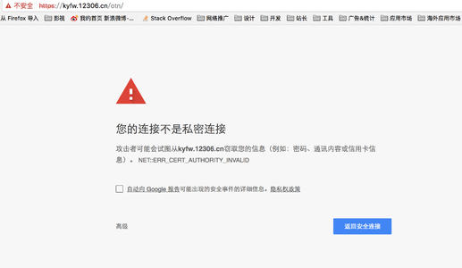
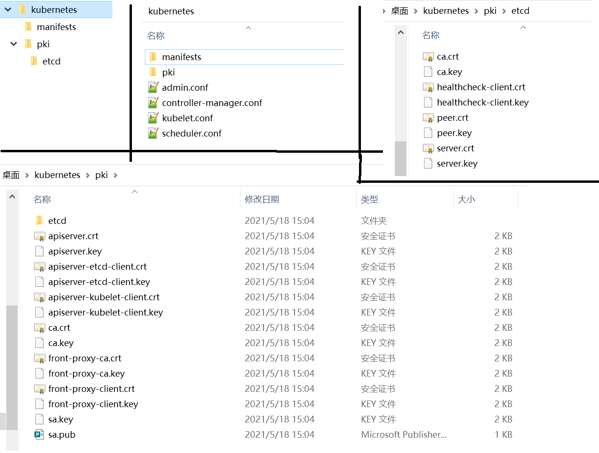

# 一、前置概念与操作

## 1、内核升级

> 3.10内核在大规模集群具有不稳定性
>
> 内核升级到4.19+

```sh
# 查看内核版本
uname -sr 
# 0、升级软件包，不升级内核
yum update -y --exclude=kernel*

# 1、下载公钥
rpm --import https://www.elrepo.org/RPM-GPG-KEY-elrepo.org
rpm -Uvh https://www.elrepo.org/elrepo-release-7.el7.elrepo.noarch.rpm
# 安装镜像加速
yum install -y yum-plugin-fastestmirror
# 3、仓库启用后，列出可用的内核相关包：
yum --disablerepo="*" --enablerepo="elrepo-kernel" list available 

kernel-lt： long term support：长期支持版
kernel-ml： mainline stable： 主线稳定版

# 4、选择自己的版本进行安装 5.4.119-1.el7.elrepo
yum --enablerepo=elrepo-kernel install -y kernel-lt

# 5、查看内核
uname -sr
#查看内核位置
awk -F\' '$1=="menuentry " {print $2}' /etc/grub2.cfg
CentOS Linux 7 Rescue 0a87210b6f6337e79a6611c512e524ce (5.4.119-1.el7.elrepo.x86_64) #第0个
CentOS Linux (5.4.119-1.el7.elrepo.x86_64) 7 (Core)  ##我们的在第1个
CentOS Linux (3.10.0-1160.el7.x86_64) 7 (Core)
CentOS Linux (0-rescue-cc2c86fe566741e6a2ff6d399c5d5daa) 7 (Core)

# 6、重新创建内核配置。
grub2-mkconfig -o /boot/grub2/grub.cfg
# 确认内核的位置，修改默认内核即可

# 7、修改使用默认内核
vi /etc/default/grub
# 将 GRUB_DEFAULT 设置为 0，代表  GRUB 初始化页面的第一个内核将作为默认内核
# 再重新整理下内核
grub2-mkconfig -o /boot/grub2/grub.cfg
# 8、重开机
reboot

# 9、检查
uname -r
```

在内核4.19+版本nf_conntrack_ipv4已经改为nf_conntrack， 4.18以下使用nf_conntrack_ipv4即可：

sysctl -a。可以查看所有的内核参数

## 2、k8s集群架构

https://kubernetes.io/zh/docs/tasks/administer-cluster/highly-available-master/


k8s集群架构：

master+node

- master：一旦宕机，k8s集群就是不可用状态。但是可能node节点上其他已经运行的Pod还在运行。一般还能提供服务
- **所有数据是保存到etcd（有状态）**（存储数据的键值库。保CP）类似ZK。etcd可能会取代zk
- CAP：C一致性（6个redis，访问任何一个redis都能得到一样的数据）： A可用性；**P分区容错**。
- Raft：一致性协议
  - 中文动画： http://www.kailing.pub/raft/index.html
  - 领导选举：Leader Election
  - Log Replication*日志复制。
  - 一个raft一致性的集群最多允许挂  n/2（不管余数） 台机器  6/2 = 3 （大多数存活【n/2+1】）
  - 奇数个机器（很快就成功投票）。leader可以多选几轮就能选择出来
  - 心跳的速度决定集群的一致性速度。50ms
  - 只要大多数节点，直接告诉leader，节点日志已经生成了。leader认为此次操作成功
  - P分区容错
    - 一旦分区，就产生脑裂问题。出现多个领导
    - 会听从多数节点服从的领导


k8s集群里面除了**etcd**都是无状态的。

## 3、cfssl使用

> CFSSL是CloudFlare开源的一款PKI/TLS工具。 CFSSL 包含一个命令行工具 和一个用于 签名，验证并且捆绑TLS证书的 HTTP API 服务。 使用Go语言编写。

Github 地址： https://github.com/cloudflare/cfssl
官网地址： https://pkg.cfssl.org/

浏览器访问 ： qingcl0uld.com： 用下面人的证书。真正的qingcloud.com证书是被CA机构签名了的。直接加密了一个字段，这个证书是那个网站的。浏览器用这个CA机构的公钥解密这个证书，看能访问那个网站，证书说能访问qingcloud.com；



qingcloud.com：

1、假冒网站直接用qingcloud.com证书。浏览器会按照此**CA机构**给世界暴露的公钥（验钞机（公钥））解密证书看是哪个网站的，如果不符合直接打回

2、自造证书： 浏览器直接提示不安全。（没有注册，联系不到法人）

3、 xxx ，没任何办法。


证书颁发机构：CA机构（私钥+公钥）

 以下的证书  （证书key：私钥   +  证书：公钥：） 加密整个通信过程；

需要使用ca机构的公钥解密证书相关的信息； 

是哪个机构给谁颁发的证书。


### 1、集群相关证书类型

- **client certificate**： 用于服务端认证客户端,例如etcdctl、etcd proxy、fleetctl、docker客户端
- **server certificate**: 服务端使用，客户端以此验证服务端身份,例如docker服务端、kube-apiserver
- **peer certificate**: 双向证书，用于etcd集群成员间通信

根据认证对象可以将证书分成三类：

- 服务器证书`server cert`，
- 客户端证书`client cert`，
- 对等证书`peer cert`(表示既是`server cert`又是`client cert`


在kubernetes 集群中需要的证书种类如下：

-  `etcd` 节点需要标识自己服务的server cert，也需要client cert与etcd集群其他节点交互，当然可以分别指定2个证书，也可以使用一个对等证书
-  `master` 节点需要标识 apiserver服务的server cert，也需要client cert连接etcd集群，这里也使用一个对等证书
-  `kubectl` `calico` `kube-proxy` 只需要`client cert`，因此证书请求中 hosts 字段可以为空
-  `kubelet`证书比较特殊，不是手动生成，它由node节点`TLS BootStrap`向`apiserver`请求，由`master`节点的`controller-manager` 自动签发，包含一个`client cert` 和一个`server cert`


### 2、简单使用

#### 1、创建CA配置文件

配置证书生成策略，规定CA可以颁发那种类型的证书

```yaml
vim /opt/ssl/k8sca/ca-config.json
{
  "signing": {
    "default": {
      "expiry": "87600h" 
    },
    "profiles": {
      "kubernetes": {
        "usages": [
            "signing",
            "key encipherment",
            "server auth",
            "client auth"
        ],
        "expiry": "87600h"
      }
    }
  }
}
```


#### 2、创建CA证书签名请求

```yaml
vim /opt/ssl/k8sca/ ca-csr.json
{
"CN": "kubernetes",
"key": {
    "algo": "rsa",
    "size": 2048
},
"names": [
    {
        "C": "CN",
        "L": "BeiJing",
        "O": "kubernetes",
        "ST": "BeiJing",            
        "OU": "kubernetes"
    }    ]
}
```

#### 3、生成CA和私钥

生成CA所必需的文件ca-key.pem（私钥）和ca.pem（证书），还会生成ca.csr（证书签名请求），用于交叉签名或重新签名。

```sh
$ cd /opt/ssl/k8sca/
$ cfssl gencert -initca ca-csr.json | cfssljson -bare ca
$ ls
ca-config.json  ca.csr  ca-csr.json  ca-key.pem  ca.pem
```


### 3、cfssl使用

CFSSL 组成:

- 自定义构建 TLS PKI 工具
- the `cfssl` program, which is the canonical command line utility using the CFSSL packages.
- the `multirootca` program, which is a certificate authority server that can use multiple signing keys.
- the `mkbundle` program is used to build certificate pool bundles.
- the `cfssljson` program, which takes the JSON output from the `cfssl` and `multirootca` programs and writes certificates, keys, CSRs, and bundles to disk.


安装：去官网下载`cfssl-certinfo_linux-amd64`  `cfssljson_linux-amd64`  `cfssl_linux-amd64`这三个组件

```sh
# 下载核心组件
wget https://github.com/cloudflare/cfssl/releases/download/v1.5.0/cfssl-certinfo_1.5.0_linux_amd64
wget https://github.com/cloudflare/cfssl/releases/download/v1.5.0/cfssl_1.5.0_linux_amd64
wget https://github.com/cloudflare/cfssl/releases/download/v1.5.0/cfssljson_1.5.0_linux_amd64

#授予执行权限
chmod +x cfssl*

#批量重命名
for name in `ls cfssl*`; do mv $name ${name%_1.5.0_linux_amd64};  done

#移动到文件
mv cfssl* /usr/bin
```


### 4、证书规划

参照图片


### 5、证书生成

**生成ca配置**

- client certificate： 用于服务端认证客户端,例如etcdctl、etcd proxy、fleetctl、docker客户端
- server certificate:   服务端使用，客户端以此验证服务端身份,例如docker服务端、kube-apiserver
- peer certificate:      双向证书，用于etcd集群成员间通信 

**创建ca配置文件 (ca-config.json)**

- 相当于证书颁发机构的工作规章制度

- "ca-config.json"：可以定义多个 profiles，分别指定不同的过期时间、使用场景等参数；后续在签名证书时使用某个 profile；
- "signing"：表示该证书可用于签名其它证书；生成的 ca.pem 证书中 CA=TRUE；
- "server auth"：表示client可以用该 CA 对server提供的证书进行验证；
- "client auth"：表示server可以用该CA对client提供的证书进行验证；


```json
vi ca-config.json

{
    "signing": {
        "default": {
            "expiry": "43800h"
        },
        "profiles": {
            "server": {
                "expiry": "43800h",
                "usages": [
                    "signing",
                    "key encipherment",
                    "server auth"
                ]
            },
            "client": {
                "expiry": "43800h",
                "usages": [
                    "signing",
                    "key encipherment",
                    "client auth"
                ]
            },
            "peer": {
                "expiry": "43800h",
                "usages": [
                    "signing",
                    "key encipherment",
                    "server auth",
                    "client auth"
                ]
            },
            "kubernetes": {
                "expiry": "43800h",
                "usages": [
                    "signing",
                    "key encipherment",
                    "server auth",
                    "client auth"
                ]
            },
            "etcd": {
                "expiry": "43800h",
                "usages": [
                    "signing",
                    "key encipherment",
                    "server auth",
                    "client auth"
                ]
            }
        }
    }
}
```

**csr.json**

- 我们自己准备一个证书申请请求书。证书机构就会根据我们请求签发证书

```json
cfssl print-defaults
cfssl print-defaults csr  #使用这个命令打印模板

{
    "CN": "example.net", //浏览器验证该字段是否合法，一般写域名，非常重要.
    "hosts": [
        "example.net",
        "www.example.net"
    ],
    "key": {
        "algo": "ecdsa",
        "size": 256
    },
    "names": [
        {
            "C": "US",
            "ST": "CA",
            "L": "San Francisco"
        }
    ]
}
```


**创建ca证书签名(ca-csr.json)**

- "CN"：
  - Common Name，从证书中提取该字段作为请求的用户名 (User Name)；浏览器使用该字段验证网站是否合法；
- "O"：
  - Organization，从证书中提取该字段作为请求用户所属的组 (Group)；
    这两个参数在后面的kubernetes启用RBAC模式中很重要，因为需要设置kubelet、admin等角色权限，那么在配置证书的时候就必须配置对了，具体后面在部署kubernetes的时候会进行讲解。
  - "在etcd这两个参数没太大的重要意义，跟着配置就好。"

```json
vi ca-csr.json
{
    "CN": "SelfSignedCa",
    "key": {
        "algo": "rsa",
        "size": 2048
    },
    "names": [
        {
            "C": "CN",
            "L": "shanghai",
            "O": "cfssl",
            "ST": "shanghai",
            "OU": "System"
        }
    ]
}

```


**生成ca证书和私钥**

```sh
cfssl gencert -initca ca-csr.json | cfssljson -bare ca -

# ca.csr ca.pem(ca公钥) ca-key.pem(ca私钥,妥善保管)
```


**创建etcd证书签名(etcd-csr.json)**

```sh
vi etcd-csr.json
```

```json
{
    "CN": "etcd",
    "key": {
        "algo": "rsa",
        "size": 2048
    },
    "names": [
        {
            "C": "CN",
            "L": "shanghai",
            "O": "etcd",
            "ST": "shanghai",
            "OU": "System"
        }
    ]
}
```

```sh
# 生成etcd证书
cfssl gencert -ca=ca.pem -ca-key=ca-key.pem -config=ca-config.json -profile=etcd etcd-csr.json | cfssljson -bare etcd

#etcd.csr  etcd-csr.json  etcd-key.pem(etcd私钥)  etcd.pem(etcd公钥)
```


**创建kubernetes证书签名(kubernetes-csr.json)**

```sh
vi kubernetes-csr.json
```

```json
{
    "CN": "kubernetes",
    "key": {
        "algo": "rsa",
        "size": 2048
    },
    "names": [
        {
            "C": "CN",
            "L": "shanghai",
            "O": "kubernetes",
            "ST": "shanghai",
            "OU": "System"
        }
    ]
}
```

```sh
# 生成k8s证书
cfssl gencert -ca=ca.pem -ca-key=ca-key.pem -config=ca-config.json -profile=kubernetes kubernetes-csr.json | cfssljson -bare kubernetes

# kubernetes.csr  kubernetes-key.pem kubernetes.pem
```


**最后校验证书是否合适**

```sh
openssl x509 -in ca.pem -text -noout 
openssl x509 -in etcd.pem -text -noout 
openssl x509 -in kubernetes.pem -text -noout
```


# 二、集群搭建

## 2.1、所有节点基础环境

> 192.168.0.x  ：  为机器的网段
>
> 10.96.0.0/16:    为Service网段
>
> 196.16.0.0/16:  为Pod网段


### 2.1.1、环境准备与内核升级

```sh
## 先升级所有机器内核
```


```sh
#我的机器版本
cat /etc/redhat-release 
# CentOS Linux release 7.9.2009 (Core)
#修改域名，一定不是localhost
hostnamectl set-hostname k8s-xxx


#集群规划
k8s-master1  k8s-master2  k8s-master3 k8s-master-lb k8s-node01  k8s-node02 ... k8s-nodeN

# 每个机器准备域名
vi /etc/hosts
192.168.0.10 k8s-master1
192.168.0.11 k8s-master2
192.168.0.12 k8s-master3
192.168.0.13 k8s-node1
192.168.0.14 k8s-node2
192.168.0.15 k8s-node3
192.168.0.250 k8s-master-lb # 非高可用，可以不用这个。这个使用keepalive配置

```


```sh
# 关闭selinux
setenforce 0
sed -i 's#SELINUX=enforcing#SELINUX=disabled#g' /etc/sysconfig/selinux
sed -i 's#SELINUX=enforcing#SELINUX=disabled#g' /etc/selinux/config
```


```sh
# 关闭swap
swapoff -a && sysctl -w vm.swappiness=0
sed -ri 's/.*swap.*/#&/' /etc/fstab
```


```sh
#修改limit
ulimit -SHn 65535
vi /etc/security/limits.conf

# 末尾添加如下内容
* soft nofile 655360
* hard nofile 131072
* soft nproc 655350
* hard nproc 655350
* soft memlock unlimited
* hard memlock unlimited
```


```sh
#为了方便以后操作配置ssh免密连接，master1运行
ssh-keygen -t rsa

for i in k8s-master1 k8s-master2 k8s-master3 k8s-node1 k8s-node2 k8s-node3;do ssh-copy-id -i .ssh/id_rsa.pub $i;done
#
```


```sh
#安装后续用的一些工具
yum install wget git jq psmisc net-tools yum-utils device-mapper-persistent-data lvm2  -y
```


```sh
# 所有节点
# 安装ipvs工具,方便以后操作ipvs，ipset，conntrack等
yum install ipvsadm ipset sysstat conntrack libseccomp -y
# 所有节点配置ipvs模块,执行以下命令，在内核4.19+版本改为nf_conntrack， 4.18下改为nf_conntrack_ipv4
modprobe -- ip_vs
modprobe -- ip_vs_rr
modprobe -- ip_vs_wrr
modprobe -- ip_vs_sh
modprobe -- nf_conntrack

#修改ipvs配置，加入以下内容
vi /etc/modules-load.d/ipvs.conf
i
ip_vs
ip_vs_lc
ip_vs_wlc
ip_vs_rr
ip_vs_wrr
ip_vs_lblc
ip_vs_lblcr
ip_vs_dh
ip_vs_sh
ip_vs_fo
ip_vs_nq
ip_vs_sed
ip_vs_ftp
ip_vs_sh
nf_conntrack
ip_tables
ip_set
xt_set
ipt_set
ipt_rpfilter
ipt_REJECT
ipip

# 执行命令
systemctl enable --now systemd-modules-load.service  #--now = enable+start

#检测是否加载
lsmod | grep -e ip_vs -e nf_conntrack
```


```sh
## 所有节点
cat <<EOF > /etc/sysctl.d/k8s.conf
net.ipv4.ip_forward = 1
net.bridge.bridge-nf-call-iptables = 1
net.bridge.bridge-nf-call-ip6tables = 1
fs.may_detach_mounts = 1
vm.overcommit_memory=1
net.ipv4.conf.all.route_localnet = 1

vm.panic_on_oom=0
fs.inotify.max_user_watches=89100
fs.file-max=52706963
fs.nr_open=52706963
net.netfilter.nf_conntrack_max=2310720

net.ipv4.tcp_keepalive_time = 600
net.ipv4.tcp_keepalive_probes = 3
net.ipv4.tcp_keepalive_intvl =15
net.ipv4.tcp_max_tw_buckets = 36000
net.ipv4.tcp_tw_reuse = 1
net.ipv4.tcp_max_orphans = 327680
net.ipv4.tcp_orphan_retries = 3
net.ipv4.tcp_syncookies = 1
net.ipv4.tcp_max_syn_backlog = 16768
net.ipv4.ip_conntrack_max = 65536
net.ipv4.tcp_timestamps = 0
net.core.somaxconn = 16768
EOF
sysctl --system
```


```sh
# 所有节点配置完内核后，重启服务器，保证重启后内核依旧加载
reboot
lsmod | grep -e ip_vs -e nf_conntrack
```


### 2.1.2、安装Docker

```sh
# 安装docker
yum remove docker*
yum install -y yum-utils
yum-config-manager --add-repo http://mirrors.aliyun.com/docker-ce/linux/centos/docker-ce.repo
yum install -y docker-ce-19.03.9  docker-ce-cli-19.03.9 containerd.io-1.4.4
```


```sh
# 修改docker配置,新版kubelet建议使用systemd，所以可以把docker的CgroupDriver改成systemd
mkdir /etc/docker
cat > /etc/docker/daemon.json <<EOF
{
  "exec-opts": ["native.cgroupdriver=systemd"],
  "registry-mirrors": ["https://82m9ar63.mirror.aliyuncs.com"]
}
EOF
systemctl daemon-reload && systemctl enable --now docker
```


```sh
#也可以自己下载rpm离线包进行安装
http://mirrors.aliyun.com/docker-ce/linux/centos/7.9/x86_64/stable/Packages/
yum localinstall xxxx
```


## 2、PKI

[https://baike.baidu.com/item/%E5%85%AC%E9%92%A5%E5%9F%BA%E7%A1%80%E8%AE%BE%E6%96%BD/10881894](https://baike.baidu.com/item/公钥基础设施/10881894)

Kubernetes 需要 PKI 才能执行以下操作：

- Kubelet 的客户端证书，用于 API 服务器身份验证
- API 服务器端点的证书
- 集群管理员的客户端证书，用于 API 服务器身份认证
- API 服务器的客户端证书，用于和 Kubelet 的会话
- API 服务器的客户端证书，用于和 etcd 的会话
- 控制器管理器的客户端证书/kubeconfig，用于和 API 服务器的会话
- 调度器的客户端证书/kubeconfig，用于和 API 服务器的会话
- [前端代理](https://kubernetes.io/zh/docs/tasks/extend-kubernetes/configure-aggregation-layer/) 的客户端及服务端证书

> **说明：** 只有当你运行 kube-proxy 并要支持 [扩展 API 服务器](https://kubernetes.io/zh/docs/tasks/extend-kubernetes/setup-extension-api-server/) 时，才需要 `front-proxy` 证书

etcd 还实现了双向 TLS 来对客户端和对其他对等节点进行身份验证

https://kubernetes.io/zh/docs/setup/best-practices/certificates/#%E9%9B%86%E7%BE%A4%E6%98%AF%E5%A6%82%E4%BD%95%E4%BD%BF%E7%94%A8%E8%AF%81%E4%B9%A6%E7%9A%84


学习证书： https://www.cnblogs.com/technology178/p/14094375.html

## 3、证书工具准备


```sh
# 准备文件夹存放所有证书信息。看看kubeadm 如何组织有序的结构的
# 三个节点都执行
mkdir -p /etc/kubernetes/pki
```




### 1、下载证书工具

```sh
# 下载cfssl核心组件
wget https://github.com/cloudflare/cfssl/releases/download/v1.5.0/cfssl-certinfo_1.5.0_linux_amd64
wget https://github.com/cloudflare/cfssl/releases/download/v1.5.0/cfssl_1.5.0_linux_amd64
wget https://github.com/cloudflare/cfssl/releases/download/v1.5.0/cfssljson_1.5.0_linux_amd64

#授予执行权限
chmod +x cfssl*

#批量重命名
for name in `ls cfssl*`; do mv $name ${name%_1.5.0_linux_amd64};  done

#移动到文件
mv cfssl* /usr/bin
```


### 2、ca根配置

**ca-config.json**

```json
mkdir -p /etc/kubernetes/pki
cd /etc/kubernetes/pki
vi ca-config.json
{
    "signing": {
        "default": {
            "expiry": "87600h"
        },
        "profiles": {
            "server": {
                "expiry": "87600h",
                "usages": [
                    "signing",
                    "key encipherment",
                    "server auth"
                ]
            },
            "client": {
                "expiry": "87600h",
                "usages": [
                    "signing",
                    "key encipherment",
                    "client auth"
                ]
            },
            "peer": {
                "expiry": "87600h",
                "usages": [
                    "signing",
                    "key encipherment",
                    "server auth",
                    "client auth"
                ]
            },
            "kubernetes": {
                "expiry": "87600h",
                "usages": [
                    "signing",
                    "key encipherment",
                    "server auth",
                    "client auth"
                ]
            },
            "etcd": {
                "expiry": "87600h",
                "usages": [
                    "signing",
                    "key encipherment",
                    "server auth",
                    "client auth"
                ]
            }
        }
    }
}
```


### 3、ca签名请求

CSR是Certificate Signing Request的英文缩写，即证书签名请求文件

**ca-csr.json**

```json
vi /etc/kubernetes/pki/ca-csr.json
{
  "CN": "kubernetes",
  "key": {
    "algo": "rsa",
    "size": 2048
  },
  "names": [
    {
      "C": "CN",
      "ST": "Beijing",
      "L": "Beijing",
      "O": "Kubernetes",
      "OU": "Kubernetes"
    }
  ],
  "ca": {
    "expiry": "87600h"
  }
}
```

- **CN(Common Name)**: 
  - 公用名（Common Name）必须填写，一般可以是网站域
- **O(Organization)**: 
  - Organization（组织名）是必须填写的，如果申请的是OV、EV型证书，组织名称必须严格和企业在政府登记名称一致，一般需要和营业执照上的名称完全一致。不可以使用缩写或者商标。如果需要使用英文名称，需要有DUNS编码或者律师信证明。
- **OU(Organization Unit)**
  - OU单位部门，这里一般没有太多限制，可以直接填写IT DEPT等皆可。
- **C(City)**
  - City是指申请单位所在的城市。
- **ST(State/Province)**
  - ST是指申请单位所在的省份。
- **C(Country Name）**
  - C是指国家名称，这里用的是两位大写的国家代码，中国是CN。

### 4、生成证书

**生成ca证书和私钥**

```sh
cfssl gencert -initca ca-csr.json | cfssljson -bare ca -
# ca.csr ca.pem(ca公钥) ca-key.pem(ca私钥,妥善保管)
```


### 5、预习 - k8s集群是如何使用证书的

https://kubernetes.io/zh/docs/setup/best-practices/certificates/#集群是如何使用证书的


## 4、etcd高可用搭建

### 4.1、etcd文档

etcd示例：https://etcd.io/docs/v3.4/demo/      参照示例学习etcd使用

etcd构建：https://etcd.io/docs/v3.4/dl-build/   参照etcd-k8s集群量规划指南。大家参照这个标准建立集群

etcd部署：https://etcd.io/docs/v3.4/op-guide/  参照部署手册，学习etcd配置和集群部署

### 4.2、下载etcd

```sh
# 给所有master节点，发送etcd包准备部署etcd高可用
wget https://github.com/etcd-io/etcd/releases/download/v3.4.16/etcd-v3.4.16-linux-amd64.tar.gz

## 复制到其他节点
for i in k8s-master1 k8s-master2 k8s-master3;do scp etcd-* root@$i:/root/;done


## 解压到 /usr/local/bin
tar -zxvf etcd-v3.4.16-linux-amd64.tar.gz --strip-components=1 -C /usr/local/bin etcd-v3.4.16-linux-amd64/etcd{,ctl}


##验证
etcdctl #只要有打印就ok
```


### 4.3、etcd证书

https://etcd.io/docs/next/op-guide/hardware/#small-cluster  安装参考

```sh
#生成etcd证书
```

**etcd-ca-csr.json**

```json
{
  "CN": "etcd",
  "key": {
    "algo": "rsa",
    "size": 2048
  },
  "names": [
    {
      "C": "CN",
      "ST": "Beijing",
      "L": "Beijing",
      "O": "etcd",
      "OU": "etcd"
    }
  ],
  "ca": {
    "expiry": "87600h"
  }
}
```


```sh
# 生成etcd根ca证书
cfssl gencert -initca etcd-ca-csr.json | cfssljson -bare /etc/kubernetes/pki/etcd/ca -
```


**etcd-itdachang-csr.json**

```json
{
    "CN": "etcd-itdachang",
    "key": {
        "algo": "rsa",
        "size": 2048
    },
    "hosts": [  
        "127.0.0.1",
        "k8s-master1",
        "k8s-master2",
        "k8s-master3",
        "192.168.0.10",
        "192.168.0.11",
        "192.168.0.12"
    ],
    "names": [
        {
            "C": "CN",
            "L": "beijing",
            "O": "etcd",
            "ST": "beijing",
            "OU": "System"
        }
    ]
}

// 注意：hosts用自己的主机名和ip
// 也可以在签发的时候再加上 -hostname=127.0.0.1,k8s-master1,k8s-master2,k8s-master3,
// 可以指定受信的主机列表
//    "hosts": [
//        "k8s-master1",
//        "www.example.net"
//    ],
```

```sh
# 签发itdachang的etcd证书
cfssl gencert \
   -ca=/etc/kubernetes/pki/etcd/ca.pem \
   -ca-key=/etc/kubernetes/pki/etcd/ca-key.pem \
   -config=/etc/kubernetes/pki/ca-config.json \
   -profile=etcd \
   etcd-itdachang-csr.json | cfssljson -bare /etc/kubernetes/pki/etcd/etcd
```


> 把生成的etcd证书，复制给其他机器
>
> for i in k8s-master2 k8s-master3;do scp -r /etc/kubernetes/pki/etcd root@$i:/etc/kubernetes/pki;done


### 4.4、etcd高可用安装

etcd配置文件示例： https://etcd.io/docs/v3.4/op-guide/configuration/

etcd高可用安装示例： https://etcd.io/docs/v3.4/op-guide/clustering/

> 为了保证启动配置一致性，我们编写etcd配置文件，并将etcd做成service启动

```yaml
# etcd yaml示例。
# This is the configuration file for the etcd server.

# Human-readable name for this member.
name: 'default'
# Path to the data directory.
data-dir:
# Path to the dedicated wal directory.
wal-dir:
# Number of committed transactions to trigger a snapshot to disk.
snapshot-count: 10000
# Time (in milliseconds) of a heartbeat interval.
heartbeat-interval: 100
# Time (in milliseconds) for an election to timeout.
election-timeout: 1000
# Raise alarms when backend size exceeds the given quota. 0 means use the
# default quota.
quota-backend-bytes: 0
# List of comma separated URLs to listen on for peer traffic.
listen-peer-urls: http://localhost:2380
# List of comma separated URLs to listen on for client traffic.
listen-client-urls: http://localhost:2379
# Maximum number of snapshot files to retain (0 is unlimited).
max-snapshots: 5
# Maximum number of wal files to retain (0 is unlimited).
max-wals: 5
# Comma-separated white list of origins for CORS (cross-origin resource sharing).
cors:
# List of this member's peer URLs to advertise to the rest of the cluster.
# The URLs needed to be a comma-separated list.
initial-advertise-peer-urls: http://localhost:2380
# List of this member's client URLs to advertise to the public.
# The URLs needed to be a comma-separated list.
advertise-client-urls: http://localhost:2379
# Discovery URL used to bootstrap the cluster.
discovery:
# Valid values include 'exit', 'proxy'
discovery-fallback: 'proxy'
# HTTP proxy to use for traffic to discovery service.
discovery-proxy:
# DNS domain used to bootstrap initial cluster.
discovery-srv:
# Initial cluster configuration for bootstrapping.
initial-cluster:
# Initial cluster token for the etcd cluster during bootstrap.
initial-cluster-token: 'etcd-cluster'
# Initial cluster state ('new' or 'existing').
initial-cluster-state: 'new'
# Reject reconfiguration requests that would cause quorum loss.
strict-reconfig-check: false
# Accept etcd V2 client requests
enable-v2: true
# Enable runtime profiling data via HTTP server
enable-pprof: true
# Valid values include 'on', 'readonly', 'off'
proxy: 'off'
# Time (in milliseconds) an endpoint will be held in a failed state.
proxy-failure-wait: 5000
# Time (in milliseconds) of the endpoints refresh interval.
proxy-refresh-interval: 30000
# Time (in milliseconds) for a dial to timeout.
proxy-dial-timeout: 1000
# Time (in milliseconds) for a write to timeout.
proxy-write-timeout: 5000
# Time (in milliseconds) for a read to timeout.
proxy-read-timeout: 0
client-transport-security:
  # Path to the client server TLS cert file.
  cert-file:
  # Path to the client server TLS key file.
  key-file:
  # Enable client cert authentication.
  client-cert-auth: false
  # Path to the client server TLS trusted CA cert file.
  trusted-ca-file:
  # Client TLS using generated certificates
  auto-tls: false
peer-transport-security:
  # Path to the peer server TLS cert file.
  cert-file:
  # Path to the peer server TLS key file.
  key-file:
  # Enable peer client cert authentication.
  client-cert-auth: false
  # Path to the peer server TLS trusted CA cert file.
  trusted-ca-file:
  # Peer TLS using generated certificates.
  auto-tls: false
# Enable debug-level logging for etcd.
debug: false
logger: zap
# Specify 'stdout' or 'stderr' to skip journald logging even when running under systemd.
log-outputs: [stderr]
# Force to create a new one member cluster.
force-new-cluster: false
auto-compaction-mode: periodic
auto-compaction-retention: "1"
```


> 三个etcd机器都创建  /etc/etcd  目录，准备存储etcd配置信息

```sh
#三个master执行
mkdir -p /etc/etcd
```


```yaml
vi /etc/etcd/etcd.yaml
# 我们的yaml
name: 'etcd-master3'  #每个机器可以写自己的域名,不能重复
data-dir: /var/lib/etcd
wal-dir: /var/lib/etcd/wal
snapshot-count: 5000
heartbeat-interval: 100
election-timeout: 1000
quota-backend-bytes: 0
listen-peer-urls: 'https://192.168.0.12:2380'  # 本机ip+2380端口，代表和集群通信
listen-client-urls: 'https://192.168.0.12:2379,http://127.0.0.1:2379' #改为自己的
max-snapshots: 3
max-wals: 5
cors:
initial-advertise-peer-urls: 'https://192.168.0.12:2380' #自己的ip
advertise-client-urls: 'https://192.168.0.12:2379'  #自己的ip
discovery:
discovery-fallback: 'proxy'
discovery-proxy:
discovery-srv:
initial-cluster: 'etcd-master1=https://192.168.0.10:2380,etcd-master2=https://192.168.0.11:2380,etcd-master3=https://192.168.0.12:2380' #这里不一样
initial-cluster-token: 'etcd-k8s-cluster'
initial-cluster-state: 'new'
strict-reconfig-check: false
enable-v2: true
enable-pprof: true
proxy: 'off'
proxy-failure-wait: 5000
proxy-refresh-interval: 30000
proxy-dial-timeout: 1000
proxy-write-timeout: 5000
proxy-read-timeout: 0
client-transport-security:
  cert-file: '/etc/kubernetes/pki/etcd/etcd.pem'
  key-file: '/etc/kubernetes/pki/etcd/etcd-key.pem'
  client-cert-auth: true
  trusted-ca-file: '/etc/kubernetes/pki/etcd/ca.pem'
  auto-tls: true
peer-transport-security:
  cert-file: '/etc/kubernetes/pki/etcd/etcd.pem'
  key-file: '/etc/kubernetes/pki/etcd/etcd-key.pem'
  peer-client-cert-auth: true
  trusted-ca-file: '/etc/kubernetes/pki/etcd/ca.pem'
  auto-tls: true
debug: false
log-package-levels:
log-outputs: [default]
force-new-cluster: false
```


> 三台机器的etcd做成service，开机启动

```sh
vi /usr/lib/systemd/system/etcd.service
i
[Unit]
Description=Etcd Service
Documentation=https://etcd.io/docs/v3.4/op-guide/clustering/
After=network.target

[Service]
Type=notify
ExecStart=/usr/local/bin/etcd --config-file=/etc/etcd/etcd.yaml
Restart=on-failure
RestartSec=10
LimitNOFILE=65536

[Install]
WantedBy=multi-user.target
Alias=etcd3.service
```


```sh
# 加载&开机启动
systemctl daemon-reload
systemctl enable --now etcd

# 启动有问题,使用journalctl -u 服务名排查
journalctl -u etcd
```


> 测试etcd访问

```sh
# 查看etcd集群状态
etcdctl --endpoints="192.168.0.10:2379,192.168.0.11:2379,192.168.0.12:2379" --cacert=/etc/kubernetes/pki/etcd/ca.pem --cert=/etc/kubernetes/pki/etcd/etcd.pem --key=/etc/kubernetes/pki/etcd/etcd-key.pem  endpoint status --write-out=table

# 以后测试命令
export ETCDCTL_API=3
HOST_1=192.168.0.10
HOST_2=192.168.0.11
HOST_3=192.168.0.12
ENDPOINTS=$HOST_1:2379,$HOST_2:2379,$HOST_3:2379

## 导出环境变量，方便测试，参照https://github.com/etcd-io/etcd/tree/main/etcdctl
export ETCDCTL_DIAL_TIMEOUT=3s
export ETCDCTL_CACERT=/etc/kubernetes/pki/etcd/ca.pem
export ETCDCTL_CERT=/etc/kubernetes/pki/etcd/etcd.pem
export ETCDCTL_KEY=/etc/kubernetes/pki/etcd/etcd-key.pem
export ETCDCTL_ENDPOINTS=$HOST_1:2379,$HOST_2:2379,$HOST_3:2379
# 自动用环境变量定义的证书位置
etcdctl  member list --write-out=table

#如果没有环境变量就需要如下方式调用
etcdctl --endpoints=$ENDPOINTS --cacert=/etc/kubernetes/pki/etcd/ca.pem --cert=/etc/kubernetes/pki/etcd/etcd.pem --key=/etc/kubernetes/pki/etcd/etcd-key.pem member list --write-out=table


## 更多etcdctl命令，https://etcd.io/docs/v3.4/demo/#access-etcd
```


## 5、k8s组件与证书

### 5.1、K8s离线安装包

https://github.com/kubernetes/kubernetes  找到changelog对应版本


```sh
# 下载k8s包
wget https://dl.k8s.io/v1.21.1/kubernetes-server-linux-amd64.tar.gz
```


### 5.2、master节点准备

```sh
# 把kubernetes把复制给master所有节点
for i in k8s-master1 k8s-master2 k8s-master3  k8s-node1 k8s-node2 k8s-node3;do scp kubernetes-server-* root@$i:/root/;done
```

```sh
#所有master节点解压kubelet，kubectl等到 /usr/local/bin。
tar -xvf kubernetes-server-linux-amd64.tar.gz  --strip-components=3 -C /usr/local/bin kubernetes/server/bin/kube{let,ctl,-apiserver,-controller-manager,-scheduler,-proxy}


#master需要全部组件，node节点只需要 /usr/local/bin kubelet、kube-proxy
```


### 5.3、apiserver 证书生成

#### 5.3.1、apiserver-csr.json 

```json
//10.96.0. 为service网段。可以自定义 如： 66.66.0.1
// 192.168.0.250： 是我准备的负载均衡器地址（负载均衡可以自己搭建，也可以购买云厂商lb。）
{
    "CN": "kube-apiserver",
    "hosts": [
      "10.96.0.1",
      "127.0.0.1",
      "192.168.0.250",
      "192.168.0.10",
      "192.168.0.11",
      "192.168.0.12",
      "192.168.0.13",
      "192.168.0.14",
      "192.168.0.15",
      "192.168.0.16",
      "kubernetes",
      "kubernetes.default",
      "kubernetes.default.svc",
      "kubernetes.default.svc.cluster",
      "kubernetes.default.svc.cluster.local"
    ],
    "key": {
        "algo": "rsa",
        "size": 2048
    },
    "names": [
        {
            "C": "CN",
            "L": "BeiJing",
            "ST": "BeiJing",
            "O": "Kubernetes",
            "OU": "Kubernetes"
        }
    ]
}

```


#### 5.3.2、生成apiserver证书

```sh
# 192.168.0.是k8s service的网段，如果说需要更改k8s service网段，那就需要更改192.168.0.1，
# 如果不是高可用集群，10.103.236.236为Master01的IP
#先生成CA机构
vi ca-csr.json
{
  "CN": "kubernetes",
  "key": {
    "algo": "rsa",
    "size": 2048
  },
  "names": [
    {
      "C": "CN",
      "ST": "Beijing",
      "L": "Beijing",
      "O": "Kubernetes",
      "OU": "Kubernetes"
    }
  ],
  "ca": {
    "expiry": "87600h"
  }
}


cfssl gencert -initca ca-csr.json | cfssljson -bare ca -

cfssl gencert   -ca=/etc/kubernetes/pki/ca.pem   -ca-key=/etc/kubernetes/pki/ca-key.pem   -config=/etc/kubernetes/pki/ca-config.json   -profile=kubernetes   apiserver-csr.json | cfssljson -bare /etc/kubernetes/pki/apiserver
```


### 5.4、front-proxy证书生成

https://kubernetes.io/zh/docs/tasks/extend-kubernetes/configure-aggregation-layer/

他是apiserver聚合层，后来支持CRD(自定义的资源文件)的

apiVersion: xxx

kind: HelloDaChang  --- CRD --- front-proxy

> 注意：front-proxy不建议用新的CA机构签发证书，可能导致通过他代理的组件如metrics-server权限不可用。
>
> 如果用新的，api-server配置添加 --requestheader-allowed-names=front-proxy-client

#### 1、front-proxy-ca-csr.json

front-proxy根ca

```json
vi front-proxy-ca-csr.json
{
  "CN": "kubernetes",
  "key": {
     "algo": "rsa",
     "size": 2048
  }
}
```

```sh
#front-proxy 根ca生成
cfssl gencert   -initca front-proxy-ca-csr.json | cfssljson -bare /etc/kubernetes/pki/front-proxy-ca
```


#### 2、front-proxy-client证书

```json
vi  front-proxy-client-csr.json  #准备申请client客户端

{
  "CN": "front-proxy-client",
  "key": {
     "algo": "rsa",
     "size": 2048
  }
}
```


```sh
#生成front-proxy-client 证书
cfssl gencert   -ca=/etc/kubernetes/pki/front-proxy-ca.pem   -ca-key=/etc/kubernetes/pki/front-proxy-ca-key.pem   -config=ca-config.json   -profile=kubernetes   front-proxy-client-csr.json | cfssljson -bare /etc/kubernetes/pki/front-proxy-client

#忽略警告，毕竟我们不是给网站生成的
```


### 5.5、controller-manage证书生成与配置

#### 5.5.1、controller-manager-csr.json

```json
vi controller-manager-csr.json

{
  "CN": "system:kube-controller-manager",
  "key": {
    "algo": "rsa",
    "size": 2048
  },
  "names": [
    {
      "C": "CN",
      "ST": "Beijing",
      "L": "Beijing",
      "O": "system:kube-controller-manager",
      "OU": "Kubernetes"
    }
  ]
}
```

#### 5.5.2、生成证书

```sh
cfssl gencert \
   -ca=/etc/kubernetes/pki/ca.pem \
   -ca-key=/etc/kubernetes/pki/ca-key.pem \
   -config=ca-config.json \
   -profile=kubernetes \
  controller-manager-csr.json | cfssljson -bare /etc/kubernetes/pki/controller-manager
```


#### 5.5.3、生成配置

```sh
# 注意，如果不是高可用集群，192.168.0.250:6443改为master01的地址，6443为apiserver的默认端口
# set-cluster：设置一个集群项，
kubectl config set-cluster kubernetes \
     --certificate-authority=/etc/kubernetes/pki/ca.pem \
     --embed-certs=true \
     --server=https://192.168.0.250:6443 \
     --kubeconfig=/etc/kubernetes/controller-manager.conf

# 设置一个环境项，一个上下文
kubectl config set-context system:kube-controller-manager@kubernetes \
    --cluster=kubernetes \
    --user=system:kube-controller-manager \
    --kubeconfig=/etc/kubernetes/controller-manager.conf

# set-credentials 设置一个用户项

kubectl config set-credentials system:kube-controller-manager \
     --client-certificate=/etc/kubernetes/pki/controller-manager.pem \
     --client-key=/etc/kubernetes/pki/controller-manager-key.pem \
     --embed-certs=true \
     --kubeconfig=/etc/kubernetes/controller-manager.conf


# 使用某个环境当做默认环境

kubectl config use-context system:kube-controller-manager@kubernetes \
     --kubeconfig=/etc/kubernetes/controller-manager.conf
     
     
# 后来也用来自动批复kubelet证书
```

### 5.6、scheduler证书生成与配置

#### 5.6.1、scheduler-csr.json

```json
vi scheduler-csr.json

{
  "CN": "system:kube-scheduler",
  "key": {
    "algo": "rsa",
    "size": 2048
  },
  "names": [
    {
      "C": "CN",
      "ST": "Beijing",
      "L": "Beijing",
      "O": "system:kube-scheduler",
      "OU": "Kubernetes"
    }
  ]
}
```


#### 5.6.2、签发证书

```sh
cfssl gencert \
   -ca=/etc/kubernetes/pki/ca.pem \
   -ca-key=/etc/kubernetes/pki/ca-key.pem \
   -config=/etc/kubernetes/pki/ca-config.json \
   -profile=kubernetes \
   scheduler-csr.json | cfssljson -bare /etc/kubernetes/pki/scheduler
```

#### 5.6.3、生成配置

```sh
# 注意，如果不是高可用集群，192.168.0.250:6443 改为master01的地址，6443是api-server默认端口

kubectl config set-cluster kubernetes \
     --certificate-authority=/etc/kubernetes/pki/ca.pem \
     --embed-certs=true \
     --server=https://192.168.0.250:6443 \
     --kubeconfig=/etc/kubernetes/scheduler.conf


kubectl config set-credentials system:kube-scheduler \
     --client-certificate=/etc/kubernetes/pki/scheduler.pem \
     --client-key=/etc/kubernetes/pki/scheduler-key.pem \
     --embed-certs=true \
     --kubeconfig=/etc/kubernetes/scheduler.conf

kubectl config set-context system:kube-scheduler@kubernetes \
     --cluster=kubernetes \
     --user=system:kube-scheduler \
     --kubeconfig=/etc/kubernetes/scheduler.conf


kubectl config use-context system:kube-scheduler@kubernetes \
     --kubeconfig=/etc/kubernetes/scheduler.conf

#k8s集群安全操作相关
```


### 5.7、admin证书生成与配置

#### 5.7.1、admin-csr.json

```json
vi admin-csr.json
{
  "CN": "admin",
  "key": {
    "algo": "rsa",
    "size": 2048
  },
  "names": [
    {
      "C": "CN",
      "ST": "Beijing",
      "L": "Beijing",
      "O": "system:masters",
      "OU": "Kubernetes"
    }
  ]
}
```

#### 5.7.2、生成证书

```sh
cfssl gencert \
   -ca=/etc/kubernetes/pki/ca.pem \
   -ca-key=/etc/kubernetes/pki/ca-key.pem \
   -config=/etc/kubernetes/pki/ca-config.json \
   -profile=kubernetes \
   admin-csr.json | cfssljson -bare /etc/kubernetes/pki/admin
```


#### 5.7.3、生成配置

```sh
# 注意，如果不是高可用集群，192.168.0.250:6443改为master01的地址，6443为apiserver的默认端口
kubectl config set-cluster kubernetes \
--certificate-authority=/etc/kubernetes/pki/ca.pem \
--embed-certs=true \
--server=https://192.168.0.250:6443 \
--kubeconfig=/etc/kubernetes/admin.conf


kubectl config set-credentials kubernetes-admin \
--client-certificate=/etc/kubernetes/pki/admin.pem \
--client-key=/etc/kubernetes/pki/admin-key.pem \
--embed-certs=true \
--kubeconfig=/etc/kubernetes/admin.conf


kubectl config set-context kubernetes-admin@kubernetes \
--cluster=kubernetes \
--user=kubernetes-admin \
--kubeconfig=/etc/kubernetes/admin.conf

kubectl config use-context kubernetes-admin@kubernetes \
--kubeconfig=/etc/kubernetes/admin.conf
```


> kubelet将使用 bootstrap 引导机制，自动颁发证书，所以我们不用配置了。要不然，1万台机器，一个万kubelet，证书配置到明年去。。。

### 5.8、ServiceAccount Key生成

k8s底层，每创建一个ServiceAccount，都会分配一个Secret，而Secret里面有秘钥，秘钥就是由我们接下来的sa生成的。所以我们提前创建出sa信息

```sh
openssl genrsa -out /etc/kubernetes/pki/sa.key 2048

openssl rsa -in /etc/kubernetes/pki/sa.key -pubout -out /etc/kubernetes/pki/sa.pub
```


### 5.9、发送证书到其他节点

```sh
# 在master1上执行
for NODE in k8s-master2 k8s-master3
do
	for FILE in admin.conf controller-manager.conf scheduler.conf
	do
	scp /etc/kubernetes/${FILE} $NODE:/etc/kubernetes/${FILE}
	done
done
```


## 6、高可用配置

## 6.1 nginx 安装
需要注意的是, nginx 需要加上 --with-stream --with-http_ssl_module 模块
[nginx安装](../../note/nginx/nginx.md)

## 6.2 nginx 配置
```bash
# 编辑配置文件
$ vim k8s-ha.conf
error_log stderr notice;

worker_processes auto;
events {
  multi_accept on;
  use epoll;
  worker_connections 1024;
}

stream {
    upstream kube_apiserver {
        least_conn;
        server 192.168.220.181:6443;
        server 192.168.220.182:6443;
        server 192.168.220.183:6443;
    }

    server {
        listen        0.0.0.0:6443;
        proxy_pass    kube_apiserver;
        proxy_timeout 10m;
        proxy_connect_timeout 1s;
    }
}
```

## 6.3 启动nginx
```bash
$ ./sbin/nginx -c k8s-ha.conf
```

## 6.4 检查 nginx 端口
```bash
$ netstat -tunlp | grep nginx
tcp        0      0 0.0.0.0:6443            0.0.0.0:*               LISTEN      73542/nginx: master
```


## 7、组件启动

### 7.1、所有master执行

```yaml
mkdir -p /etc/kubernetes/manifests/ /etc/systemd/system/kubelet.service.d /var/lib/kubelet /var/log/kubernetes


#三个master节点kube-xx相关的程序都在 /usr/local/bin
for NODE in k8s-master2 k8s-master3
do
	scp -r /etc/kubernetes/* root@$NODE:/etc/kubernetes/
done
```


> 接下来把master1生成的所有证书全部发给master2,master3


### 7.2、配置apiserver服务

#### 7.2.1、配置

所有Master节点创建`kube-apiserver.service`，

>  注意，如果不是高可用集群，192.168.0.250改为master01的地址
>
>  以下文档使用的k8s service网段为`10.96.0.0/16`，该网段不能和宿主机的网段、Pod网段的重复
>
>  特别注意：docker的网桥默认为 `172.17.0.1/16`。不要使用这个网段

```sh
# 每个master节点都需要执行以下内容
# --advertise-address： 需要改为本master节点的ip
# --service-cluster-ip-range=10.96.0.0/16： 需要改为自己规划的service网段
# --etcd-servers： 改为自己etcd-server的所有地址

vi /usr/lib/systemd/system/kube-apiserver.service

[Unit]
Description=Kubernetes API Server
Documentation=https://github.com/kubernetes/kubernetes
After=network.target

[Service]
ExecStart=/usr/local/bin/kube-apiserver \
      --v=2  \
      --logtostderr=true  \
      --allow-privileged=true  \
      --bind-address=0.0.0.0  \
      --secure-port=6443  \
      --insecure-port=0  \
      --advertise-address=192.168.0.10 \
      --service-cluster-ip-range=10.96.0.0/16  \
      --service-node-port-range=30000-32767  \
      --etcd-servers=https://192.168.0.10:2379,https://192.168.0.11:2379,https://192.168.0.12:2379 \
      --etcd-cafile=/etc/kubernetes/pki/etcd/ca.pem  \
      --etcd-certfile=/etc/kubernetes/pki/etcd/etcd.pem  \
      --etcd-keyfile=/etc/kubernetes/pki/etcd/etcd-key.pem  \
      --client-ca-file=/etc/kubernetes/pki/ca.pem  \
      --tls-cert-file=/etc/kubernetes/pki/apiserver.pem  \
      --tls-private-key-file=/etc/kubernetes/pki/apiserver-key.pem  \
      --kubelet-client-certificate=/etc/kubernetes/pki/apiserver.pem  \
      --kubelet-client-key=/etc/kubernetes/pki/apiserver-key.pem  \
      --service-account-key-file=/etc/kubernetes/pki/sa.pub  \
      --service-account-signing-key-file=/etc/kubernetes/pki/sa.key  \
      --service-account-issuer=https://kubernetes.default.svc.cluster.local \
      --kubelet-preferred-address-types=InternalIP,ExternalIP,Hostname  \
      --enable-admission-plugins=NamespaceLifecycle,LimitRanger,ServiceAccount,DefaultStorageClass,DefaultTolerationSeconds,NodeRestriction,ResourceQuota  \
      --authorization-mode=Node,RBAC  \
      --enable-bootstrap-token-auth=true  \
      --requestheader-client-ca-file=/etc/kubernetes/pki/front-proxy-ca.pem  \
      --proxy-client-cert-file=/etc/kubernetes/pki/front-proxy-client.pem  \
      --proxy-client-key-file=/etc/kubernetes/pki/front-proxy-client-key.pem  \
      --requestheader-allowed-names=aggregator,front-proxy-client  \
      --requestheader-group-headers=X-Remote-Group  \
      --requestheader-extra-headers-prefix=X-Remote-Extra-  \
      --requestheader-username-headers=X-Remote-User
      # --token-auth-file=/etc/kubernetes/token.csv

Restart=on-failure
RestartSec=10s
LimitNOFILE=65535

[Install]
WantedBy=multi-user.target
```


#### 7.2.2、启动apiserver服务

```sh
systemctl daemon-reload && systemctl enable --now kube-apiserver


#查看状态
systemctl status kube-apiserver
```


### 7.3、配置controller-manager服务

#### 7.3.1、配置

所有Master节点配置kube-controller-manager.service

> 文档使用的k8s Pod网段为`196.16.0.0/16`，该网段不能和宿主机的网段、k8s Service网段的重复，请按需修改;
>
> 特别注意：docker的网桥默认为 `172.17.0.1/16`。不要使用这个网段


```sh
# 所有节点执行
vi /usr/lib/systemd/system/kube-controller-manager.service
i
## --cluster-cidr=196.16.0.0/16 ： 为Pod的网段。修改成自己想规划的网段

[Unit]
Description=Kubernetes Controller Manager
Documentation=https://github.com/kubernetes/kubernetes
After=network.target

[Service]
ExecStart=/usr/local/bin/kube-controller-manager \
      --v=2 \
      --logtostderr=true \
      --address=127.0.0.1 \
      --root-ca-file=/etc/kubernetes/pki/ca.pem \
      --cluster-signing-cert-file=/etc/kubernetes/pki/ca.pem \
      --cluster-signing-key-file=/etc/kubernetes/pki/ca-key.pem \
      --service-account-private-key-file=/etc/kubernetes/pki/sa.key \
      --kubeconfig=/etc/kubernetes/controller-manager.conf \
      --leader-elect=true \
      --use-service-account-credentials=true \
      --node-monitor-grace-period=40s \
      --node-monitor-period=5s \
      --pod-eviction-timeout=2m0s \
      --controllers=*,bootstrapsigner,tokencleaner \
      --allocate-node-cidrs=true \
      --cluster-cidr=196.16.0.0/16 \
      --requestheader-client-ca-file=/etc/kubernetes/pki/front-proxy-ca.pem \
      --node-cidr-mask-size=24
      
Restart=always
RestartSec=10s

[Install]
WantedBy=multi-user.target
```


#### 7.3.2、启动

```sh
# 所有master节点执行
systemctl daemon-reload

systemctl daemon-reload && systemctl enable --now kube-controller-manager

systemctl status kube-controller-manager
```


### 7.4、配置scheduler

#### 7.4.1、配置

所有Master节点配置kube-scheduler.service

```sh
vi /usr/lib/systemd/system/kube-scheduler.service 


[Unit]
Description=Kubernetes Scheduler
Documentation=https://github.com/kubernetes/kubernetes
After=network.target

[Service]
ExecStart=/usr/local/bin/kube-scheduler \
      --v=2 \
      --logtostderr=true \
      --address=127.0.0.1 \
      --leader-elect=true \
      --kubeconfig=/etc/kubernetes/scheduler.conf

Restart=always
RestartSec=10s

[Install]
WantedBy=multi-user.target
```


#### 7.4.2、启动

```sh
systemctl daemon-reload

systemctl daemon-reload && systemctl enable --now kube-scheduler

systemctl status kube-scheduler
```


## 8、TLS与引导启动原理

TLS Bootstrapping原理参照:  https://kubernetes.io/zh/docs/reference/command-line-tools-reference/kubelet-tls-bootstrapping/

### 1、master1配置bootstrap

> 注意，如果不是高可用集群，`192.168.0.250:6443`改为master1的地址，6443为apiserver的默认端口

```sh
#准备一个随机token。但是我们只需要16个字符
head -c 16 /dev/urandom | od -An -t x | tr -d ' '
# 值如下： 737b177d9823531a433e368fcdb16f5f

# 生成16个字符的
head -c 8 /dev/urandom | od -An -t x | tr -d ' '
# d683399b7a553977
```


```sh
#设置集群
kubectl config set-cluster kubernetes \
--certificate-authority=/etc/kubernetes/pki/ca.pem \
--embed-certs=true \
--server=https://192.168.0.250:6443 \
--kubeconfig=/etc/kubernetes/bootstrap-kubelet.conf

#设置秘钥
kubectl config set-credentials tls-bootstrap-token-user \
--token=l6fy8c.d683399b7a553977 \
--kubeconfig=/etc/kubernetes/bootstrap-kubelet.conf 

#设置上下文
kubectl config set-context tls-bootstrap-token-user@kubernetes \
--cluster=kubernetes \
--user=tls-bootstrap-token-user \
--kubeconfig=/etc/kubernetes/bootstrap-kubelet.conf

#使用设置
kubectl config use-context tls-bootstrap-token-user@kubernetes \
--kubeconfig=/etc/kubernetes/bootstrap-kubelet.conf
```


### 2、master1设置kubectl执行权限

> kubectl 能不能操作集群是看 /root/.kube 下有没有config文件，而config就是我们之前生成的admin.conf，具有操作权限的

```sh
# 只在master1生成，因为生产集群，我们只能让一台机器具有操作集群的权限，这样好控制

mkdir -p /root/.kube ;
cp /etc/kubernetes/admin.conf /root/.kube/config
```

```sh
#验证
kubectl get nodes

# 应该在网络里面开放负载均衡器的6443端口;默认应该不要配置的
[root@k8s-master1 ~]# kubectl get nodes
No resources found
#说明已经可以连接apiserver并获取资源
```


### 3、创建集群引导权限文件


```yaml
# master准备这个文件 
vi  /etc/kubernetes/bootstrap.secret.yaml


apiVersion: v1
kind: Secret
metadata:
  name: bootstrap-token-l6fy8c
  namespace: kube-system
type: bootstrap.kubernetes.io/token
stringData:
  description: "The default bootstrap token generated by 'kubelet '."
  token-id: l6fy8c
  token-secret: d683399b7a553977
  usage-bootstrap-authentication: "true"
  usage-bootstrap-signing: "true"
  auth-extra-groups:  system:bootstrappers:default-node-token,system:bootstrappers:worker,system:bootstrappers:ingress
 
---
apiVersion: rbac.authorization.k8s.io/v1
kind: ClusterRoleBinding
metadata:
  name: kubelet-bootstrap
roleRef:
  apiGroup: rbac.authorization.k8s.io
  kind: ClusterRole
  name: system:node-bootstrapper
subjects:
- apiGroup: rbac.authorization.k8s.io
  kind: Group
  name: system:bootstrappers:default-node-token
---
apiVersion: rbac.authorization.k8s.io/v1
kind: ClusterRoleBinding
metadata:
  name: node-autoapprove-bootstrap
roleRef:
  apiGroup: rbac.authorization.k8s.io
  kind: ClusterRole
  name: system:certificates.k8s.io:certificatesigningrequests:nodeclient
subjects:
- apiGroup: rbac.authorization.k8s.io
  kind: Group
  name: system:bootstrappers:default-node-token
---
apiVersion: rbac.authorization.k8s.io/v1
kind: ClusterRoleBinding
metadata:
  name: node-autoapprove-certificate-rotation
roleRef:
  apiGroup: rbac.authorization.k8s.io
  kind: ClusterRole
  name: system:certificates.k8s.io:certificatesigningrequests:selfnodeclient
subjects:
- apiGroup: rbac.authorization.k8s.io
  kind: Group
  name: system:nodes
---
apiVersion: rbac.authorization.k8s.io/v1
kind: ClusterRole
metadata:
  annotations:
    rbac.authorization.kubernetes.io/autoupdate: "true"
  labels:
    kubernetes.io/bootstrapping: rbac-defaults
  name: system:kube-apiserver-to-kubelet
rules:
  - apiGroups:
      - ""
    resources:
      - nodes/proxy
      - nodes/stats
      - nodes/log
      - nodes/spec
      - nodes/metrics
    verbs:
      - "*"
---
apiVersion: rbac.authorization.k8s.io/v1
kind: ClusterRoleBinding
metadata:
  name: system:kube-apiserver
  namespace: ""
roleRef:
  apiGroup: rbac.authorization.k8s.io
  kind: ClusterRole
  name: system:kube-apiserver-to-kubelet
subjects:
  - apiGroup: rbac.authorization.k8s.io
    kind: User
    name: kube-apiserver
```


```sh
# 应用此文件资源内容
kubectl create -f /etc/kubernetes/bootstrap.secret.yaml
```


## 9、引导Node节点启动

> 所有节点的kubelet需要我们引导启动

### 9.1、发送核心证书到节点

master1节点把核心证书发送到其他节点

```sh
cd /etc/kubernetes/  #查看所有信息

#执行复制所有令牌操作

for NODE in k8s-master2 k8s-master3 k8s-node1 k8s-node2; do
     ssh $NODE mkdir -p /etc/kubernetes/pki/etcd
     for FILE in ca.pem etcd.pem etcd-key.pem; do
       scp /etc/kubernetes/pki/etcd/$FILE $NODE:/etc/kubernetes/pki/etcd/
     done
     for FILE in pki/ca.pem pki/ca-key.pem pki/front-proxy-ca.pem bootstrap-kubelet.conf; do
       scp /etc/kubernetes/$FILE $NODE:/etc/kubernetes/${FILE}
 done
 done
```


### 9.2、所有节点配置kubelet

```sh
# 所有节点创建相关目录
mkdir -p /var/lib/kubelet /var/log/kubernetes /etc/systemd/system/kubelet.service.d /etc/kubernetes/manifests/

## 所有node节点必须有 kubelet kube-proxy
for NODE in k8s-master2 k8s-master3 k8s-node3 k8s-node1 k8s-node2; do
     scp -r /etc/kubernetes/* root@$NODE:/etc/kubernetes/
 done
```


#### 1、创建kubelet.service

```sh
#所有节点，配置kubelet服务

vi  /usr/lib/systemd/system/kubelet.service
i
[Unit]
Description=Kubernetes Kubelet
Documentation=https://github.com/kubernetes/kubernetes
After=docker.service
Requires=docker.service

[Service]
ExecStart=/usr/local/bin/kubelet

Restart=always
StartLimitInterval=0
RestartSec=10

[Install]
WantedBy=multi-user.target
```


```sh
# 所有节点配置kubelet service配置文件
vi /etc/systemd/system/kubelet.service.d/10-kubelet.conf
i
[Service]
Environment="KUBELET_KUBECONFIG_ARGS=--bootstrap-kubeconfig=/etc/kubernetes/bootstrap-kubelet.conf --kubeconfig=/etc/kubernetes/kubelet.conf"
Environment="KUBELET_SYSTEM_ARGS=--network-plugin=cni --cni-conf-dir=/etc/cni/net.d --cni-bin-dir=/opt/cni/bin"
Environment="KUBELET_CONFIG_ARGS=--config=/etc/kubernetes/kubelet-conf.yml --pod-infra-container-image=registry.cn-hangzhou.aliyuncs.com/lfy_k8s_images/pause:3.4.1"
Environment="KUBELET_EXTRA_ARGS=--node-labels=node.kubernetes.io/node='' "
ExecStart=
ExecStart=/usr/local/bin/kubelet $KUBELET_KUBECONFIG_ARGS $KUBELET_CONFIG_ARGS $KUBELET_SYSTEM_ARGS $KUBELET_EXTRA_ARGS
```


#### 2、创建kubelet-conf.yml文件

```sh
#所有节点，配置kubelet-conf文件
vi /etc/kubernetes/kubelet-conf.yml
# clusterDNS 为service网络的第10个ip值,改成自己的。如：10.96.0.10
```


```yaml
apiVersion: kubelet.config.k8s.io/v1beta1
kind: KubeletConfiguration
address: 0.0.0.0
port: 10250
readOnlyPort: 10255
authentication:
  anonymous:
    enabled: false
  webhook:
    cacheTTL: 2m0s
    enabled: true
  x509:
    clientCAFile: /etc/kubernetes/pki/ca.pem
authorization:
  mode: Webhook
  webhook:
    cacheAuthorizedTTL: 5m0s
    cacheUnauthorizedTTL: 30s
cgroupDriver: systemd
cgroupsPerQOS: true
clusterDNS:
- 10.96.0.10
clusterDomain: cluster.local
containerLogMaxFiles: 5
containerLogMaxSize: 10Mi
contentType: application/vnd.kubernetes.protobuf
cpuCFSQuota: true
cpuManagerPolicy: none
cpuManagerReconcilePeriod: 10s
enableControllerAttachDetach: true
enableDebuggingHandlers: true
enforceNodeAllocatable:
- pods
eventBurst: 10
eventRecordQPS: 5
evictionHard:
  imagefs.available: 15%
  memory.available: 100Mi
  nodefs.available: 10%
  nodefs.inodesFree: 5%
evictionPressureTransitionPeriod: 5m0s  #缩小相应的配置
failSwapOn: true
fileCheckFrequency: 20s
hairpinMode: promiscuous-bridge
healthzBindAddress: 127.0.0.1
healthzPort: 10248
httpCheckFrequency: 20s
imageGCHighThresholdPercent: 85
imageGCLowThresholdPercent: 80
imageMinimumGCAge: 2m0s
iptablesDropBit: 15
iptablesMasqueradeBit: 14
kubeAPIBurst: 10
kubeAPIQPS: 5
makeIPTablesUtilChains: true
maxOpenFiles: 1000000
maxPods: 110
nodeStatusUpdateFrequency: 10s
oomScoreAdj: -999
podPidsLimit: -1
registryBurst: 10
registryPullQPS: 5
resolvConf: /etc/resolv.conf
rotateCertificates: true
runtimeRequestTimeout: 2m0s
serializeImagePulls: true
staticPodPath: /etc/kubernetes/manifests
streamingConnectionIdleTimeout: 4h0m0s
syncFrequency: 1m0s
volumeStatsAggPeriod: 1m0s
```

#### 3、所有节点启动kubelet

```sh
systemctl daemon-reload && systemctl enable --now kubelet


systemctl status kubelet
```


> 会提示 "Unable to update cni config"。
>
> 接下来配置cni网络即可


### 9.3、kube-proxy配置

>  注意，如果不是高可用集群，`192.168.0.250:6443`改为master1的地址，6443改为apiserver的默认端口

#### 9.3.1、生成kube-proxy.conf

以下操作在master1执行

```sh
#创建kube-proxy的sa
kubectl -n kube-system create serviceaccount kube-proxy

#创建角色绑定
kubectl create clusterrolebinding system:kube-proxy \
--clusterrole system:node-proxier \
--serviceaccount kube-system:kube-proxy

#导出变量，方便后面使用
SECRET=$(kubectl -n kube-system get sa/kube-proxy --output=jsonpath='{.secrets[0].name}')
JWT_TOKEN=$(kubectl -n kube-system get secret/$SECRET --output=jsonpath='{.data.token}' | base64 -d)
PKI_DIR=/etc/kubernetes/pki
K8S_DIR=/etc/kubernetes

# 生成kube-proxy配置
# --server: 指定自己的apiserver地址或者lb地址
kubectl config set-cluster kubernetes \
--certificate-authority=/etc/kubernetes/pki/ca.pem \
--embed-certs=true \
--server=https://192.168.0.250:6443 \
--kubeconfig=${K8S_DIR}/kube-proxy.conf

# kube-proxy秘钥设置
kubectl config set-credentials kubernetes \
--token=${JWT_TOKEN} \
--kubeconfig=/etc/kubernetes/kube-proxy.conf


kubectl config set-context kubernetes \
--cluster=kubernetes \
--user=kubernetes \
--kubeconfig=/etc/kubernetes/kube-proxy.conf


kubectl config use-context kubernetes \
--kubeconfig=/etc/kubernetes/kube-proxy.conf
```


```sh
#把生成的 kube-proxy.conf 传给每个节点
for NODE in k8s-master2 k8s-master3 k8s-node1 k8s-node2 k8s-node3; do
      scp /etc/kubernetes/kube-proxy.conf $NODE:/etc/kubernetes/
 done
```


#### 9.3.2、配置kube-proxy.service

```sh
# 所有节点配置 kube-proxy.service 服务，一会儿设置为开机启动
vi /usr/lib/systemd/system/kube-proxy.service
i
[Unit]
Description=Kubernetes Kube Proxy
Documentation=https://github.com/kubernetes/kubernetes
After=network.target

[Service]
ExecStart=/usr/local/bin/kube-proxy \
  --config=/etc/kubernetes/kube-proxy.yaml \
  --v=2

Restart=always
RestartSec=10s

[Install]
WantedBy=multi-user.target
```


#### 9.3.3、准备kube-proxy.yaml

一定注意修改自己的Pod网段范围

```yaml
# 所有机器执行
vi /etc/kubernetes/kube-proxy.yaml
i
apiVersion: kubeproxy.config.k8s.io/v1alpha1
bindAddress: 0.0.0.0
clientConnection:
  acceptContentTypes: ""
  burst: 10
  contentType: application/vnd.kubernetes.protobuf
  kubeconfig: /etc/kubernetes/kube-proxy.conf   #kube-proxy引导文件
  qps: 5
clusterCIDR: 196.16.0.0/16  #修改为自己的Pod-CIDR
configSyncPeriod: 15m0s
conntrack:
  max: null
  maxPerCore: 32768
  min: 131072
  tcpCloseWaitTimeout: 1h0m0s
  tcpEstablishedTimeout: 24h0m0s
enableProfiling: false
healthzBindAddress: 0.0.0.0:10256
hostnameOverride: ""
iptables:
  masqueradeAll: false
  masqueradeBit: 14
  minSyncPeriod: 0s
  syncPeriod: 30s
ipvs:
  masqueradeAll: true
  minSyncPeriod: 5s
  scheduler: "rr"
  syncPeriod: 30s
kind: KubeProxyConfiguration
metricsBindAddress: 127.0.0.1:10249
mode: "ipvs"
nodePortAddresses: null
oomScoreAdj: -999
portRange: ""
udpIdleTimeout: 250ms
```


#### 9.3.4、启动kube-proxy

所有节点启动

```sh
systemctl daemon-reload && systemctl enable --now kube-proxy
systemctl status kube-proxy
```


## 10、部署calico

**可以参照calico私有云部署指南**

```sh
# 下载官网calico
curl https://docs.projectcalico.org/manifests/calico-etcd.yaml -o calico.yaml
## 把这个镜像修改成国内镜像


# 修改一些我们自定义的. 修改etcd集群地址
sed -i 's#etcd_endpoints: "http://<ETCD_IP>:<ETCD_PORT>"#etcd_endpoints: "https://192.168.0.10:2379,https://192.168.0.11:2379,https://192.168.0.12:2379"#g' calico.yaml


# etcd的证书内容，需要base64编码设置到yaml中
ETCD_CA=`cat /etc/kubernetes/pki/etcd/ca.pem | base64 -w 0 `
ETCD_CERT=`cat /etc/kubernetes/pki/etcd/etcd.pem | base64 -w 0 `
ETCD_KEY=`cat /etc/kubernetes/pki/etcd/etcd-key.pem | base64 -w 0 `

# 替换etcd中的证书base64编码后的内容
sed -i "s@# etcd-key: null@etcd-key: ${ETCD_KEY}@g; s@# etcd-cert: null@etcd-cert: ${ETCD_CERT}@g; s@# etcd-ca: null@etcd-ca: ${ETCD_CA}@g" calico.yaml


#打开 etcd_ca 等默认设置（calico启动后自己生成）。
sed -i 's#etcd_ca: ""#etcd_ca: "/calico-secrets/etcd-ca"#g; s#etcd_cert: ""#etcd_cert: "/calico-secrets/etcd-cert"#g; s#etcd_key: "" #etcd_key: "/calico-secrets/etcd-key" #g' calico.yaml

# 修改自己的Pod网段 196.16.0.0/16
POD_SUBNET="196.16.0.0/16"
sed -i 's@# - name: CALICO_IPV4POOL_CIDR@- name: CALICO_IPV4POOL_CIDR@g; s@#   value: "192.168.0.0/16"@  value: '"${POD_SUBNET}"'@g' calico.yaml
# 一定确定自己是否修改好了

#确认calico是否修改好
grep "CALICO_IPV4POOL_CIDR" calico.yaml -A 1
```


```sh
# 应用calico配置
kubectl apply -f calico.yaml
```


## 11、部署coreDNS

```sh
git clone https://github.com/coredns/deployment.git
cd deployment/kubernetes

#10.96.0.10 改为 service 网段的 第 10 个ip
./deploy.sh -s -i 10.96.0.10 | kubectl apply -f -
```


## 12、给机器打上role标签

```sh
kubectl label node k8s-master1 node-role.kubernetes.io/master=''
kubectl label node k8s-master2 node-role.kubernetes.io/master=''
kubectl label node k8s-master3 node-role.kubernetes.io/master=''

kubectl taints node k8s-master1 
```


## 13、集群验证

> - 验证Pod网络可访问性
>   - 同名称空间，不同名称空间可以使用 ip 互相访问
>   - 跨机器部署的Pod也可以互相访问
> - 验证Service网络可访问性
>   - 集群机器使用serviceIp可以负载均衡访问
>   - pod内部可以访问service域名  serviceName.namespace
>   - pod可以访问跨名称空间的service

```yaml
# 部署以下内容进行测试

apiVersion: apps/v1
kind: Deployment
metadata:
  name:  nginx-01
  namespace: default
  labels:
    app:  nginx-01
spec:
  selector:
    matchLabels:
      app: nginx-01
  replicas: 1
  template:
    metadata:
      labels:
        app:  nginx-01
    spec:
      containers:
      - name:  nginx-01
        image:  nginx
---
apiVersion: v1
kind: Service
metadata:
  name: nginx-svc
  namespace: default
spec:
  selector:
    app:  nginx-01
  type: ClusterIP
  ports:
  - name: nginx-svc
    port: 80
    targetPort: 80
    protocol: TCP
---
apiVersion: v1
kind: Namespace
metadata:
  name: hello
spec: {}
---
apiVersion: apps/v1
kind: Deployment
metadata:
  name:  nginx-hello
  namespace: hello
  labels:
    app:  nginx-hello
spec:
  selector:
    matchLabels:
      app: nginx-hello
  replicas: 1
  template:
    metadata:
      labels:
        app:  nginx-hello
    spec:
      containers:
      - name:  nginx-hello
        image:  nginx
---
apiVersion: v1
kind: Service
metadata:
  name: nginx-svc-hello
  namespace: hello
spec:
  selector:
    app:  nginx-hello
  type: ClusterIP
  ports:
  - name: nginx-svc-hello
    port: 80
    targetPort: 80
    protocol: TCP
```


```sh
# 给两个master标识为worker
kubectl label node k8s-node3 node-role.kubernetes.io/worker=''
kubectl label node k8s-master3 node-role.kubernetes.io/worker=''
kubectl label node k8s-node1 node-role.kubernetes.io/worker=''
kubectl label node k8s-node2 node-role.kubernetes.io/worker=''

# 给master1打上污点。二进制部署的集群，默认master是没有污点的，可以任意调度。我们最好给一个master打上污点，保证master最小可用
kubectl label node k8s-master3 node-role.kubernetes.io/master=''
kubectl taint nodes k8s-master1 node-role.kubernetes.io/master=:NoSchedule
```


## 14、接下来

请继续参照，云原生周边整合相关文档继续整合其他项

# 三、集群优化

## 3.1、docker配置优化

```json
# 所有节点执行
// max-concurrent-downloads： 最大并发下载
// "max-concurrent-uploads": 最大并发上传
// log-opts: 日志设置，单文件最大，最大几个文件
// 容器的日志都在 /var/lib/docker/containers/容器名/xxx.log
// "live-restore"： 停机保活
vi /etc/docker/daemon.json  

{
 "registry-mirrors": [
    "https://82m9ar63.mirror.aliyuncs.com"
  ],
 "exec-opts": ["native.cgroupdriver=systemd"],
 "max-concurrent-downloads": 10,
 "max-concurrent-uploads": 5,
 "log-opts": {
   "max-size": "300m",
   "max-file": "2"
 },
 "live-restore": true
}
```


## 3.2、优化kubelet

更多参照： https://kubernetes.io/zh/docs/reference/config-api/kubelet-config.v1beta1/

```yaml
vi /etc/kubernetes/kubelet-conf.yml

# kubeReserved： kubelet预留资源
kubeReserved:
  cpu: "500m"
  memory: 300m
  ephemeral-storage: 3Gi
systemReserved:
  cpu: "200m"
  memory: 500m
  ephemeral-storage: 3Gi
```


验证集群kube-proxy使用ipvs模式工作； 10249是每个节点kube-proxy的metrics信息端口，可以访问/proxyMode或者/metrics等

`curl 127.0.0.1:10249/proxyMode`


## 3.3、恶心的时区问题

很多应用镜像时区都是UTC，而不是本机时间（当然，前提是本机时间是对的，云服务器不存在这个问题）

我们不用每一个Pod都设置挂载本地时间

```yaml
apiVersion: settings.k8s.io/v1alpha1
kind: PodPreset
metadata:
  name: allow-localtime
  namespace: spinnaker
spec:
  selector:
    matchLabels:
  volumeMounts:
    - mountPath: /etc/localtime
      name: localtime
  volumes:
    - name: localtime
      hostPath:
        path: etc/localtime
```


这个需要开启特性门控

```yaml
vi /usr/lib/systemd/system/kube-apiserver.service


# 1、添加 --runtime-config=settings.k8s.io/v1alpha1=true
# 2、添加 --enable-admission-plugins中加入 PodPreset

systemctl daemon-reload && systemctl restart kube-apiserver
```

> 可惜此特性在 1.20以后废弃了。
>
> PodPreset（Pod 预设置）的功能从 `v1.11` 版本开始出现，但是又在 `v1.20` 版本取消。


> 所以以后，使用Pod标准模板。挂载时区


