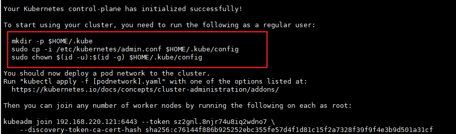
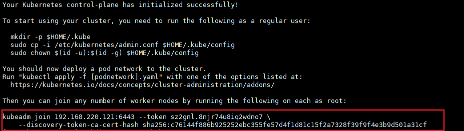
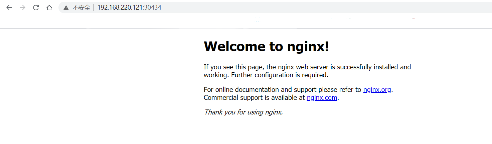

kubeadm是官方社区推出的一个用于快速部署kubernetes集群的工具。

这个工具能通过两条指令完成一个kubernetes集群的部署：

```
# 创建一个 Master 节点
$ kubeadm init

# 将一个 Node 节点加入到当前集群中
$ kubeadm join <Master节点的IP和端口 >
```

## 1. 安装要求

在开始之前，部署Kubernetes集群机器需要满足以下几个条件：

- 一台或多台机器，操作系统 CentOS7.x-86_x64
- 硬件配置：2GB或更多RAM，2个CPU或更多CPU，硬盘30GB或更多
- 可以访问外网，需要拉取镜像，如果服务器不能上网，需要提前下载镜像并导入节点
- 禁止swap分区

## 2. 准备环境

| 角色   | IP           |
| ------ | ------------ |
| k8s-master | 192.168.220.121 |
| k8s-node1  | 192.168.220.122 |
| k8s-node2  | 192.168.220.123 |

```
# 关闭防火墙
systemctl stop firewalld
systemctl disable firewalld

# 关闭selinux
sed -i 's/enforcing/disabled/' /etc/selinux/config  # 永久
setenforce 0  # 临时

# 关闭swap
swapoff -a  # 临时
sed -ri 's/.*swap.*/#&/' /etc/fstab    # 永久

# 根据规划设置主机名
hostnamectl set-hostname <hostname>

# 在master添加hosts
cat >> /etc/hosts << EOF
192.168.220.121 k8s-master
192.168.220.122 k8s-node1
192.168.220.123 k8s-node2
EOF

# 将桥接的IPv4流量传递到iptables的链
cat > /etc/sysctl.d/k8s.conf << EOF
net.bridge.bridge-nf-call-ip6tables = 1
net.bridge.bridge-nf-call-iptables = 1
EOF
sysctl --system  # 生效

# 时间同步
yum install ntpdate -y
ntpdate time.windows.com
```

## 3. 所有节点安装Docker/kubeadm/kubelet

Kubernetes默认CRI（容器运行时）为Docker，因此先安装Docker。

### 3.1 安装Docker
[CentOS7安装Docker](../docker/CentOS7安装Docker.md)

### 3.2 添加阿里云YUM软件源

```
$ cat > /etc/yum.repos.d/kubernetes.repo << EOF
[kubernetes]
name=Kubernetes
baseurl=https://mirrors.aliyun.com/kubernetes/yum/repos/kubernetes-el7-x86_64
enabled=1
gpgcheck=0
repo_gpgcheck=0
gpgkey=https://mirrors.aliyun.com/kubernetes/yum/doc/yum-key.gpg https://mirrors.aliyun.com/kubernetes/yum/doc/rpm-package-key.gpg
EOF
```

### 3.3 安装kubeadm，kubelet和kubectl

由于版本更新频繁，这里指定版本号部署：

```
$ yum install -y kubelet-1.18.0 kubeadm-1.18.0 kubectl-1.18.0
$ systemctl enable kubelet
```

## 4. 部署Kubernetes Master

在192.168.220.121（Master）执行。

```
$ kubeadm init \
  --apiserver-advertise-address=192.168.220.121 \
  --image-repository registry.aliyuncs.com/google_containers \
  --kubernetes-version v1.18.0 \
  --service-cidr=10.96.0.0/12 \
  --pod-network-cidr=10.244.0.0/16
```

由于默认拉取镜像地址k8s.gcr.io国内无法访问，这里指定阿里云镜像仓库地址。

使用kubectl工具（上一步安装成功后提示的内容复制运行即可）：

```bash
mkdir -p $HOME/.kube
sudo cp -i /etc/kubernetes/admin.conf $HOME/.kube/config
sudo chown $(id -u):$(id -g) $HOME/.kube/config
$ kubectl get nodes
```



> 可能会遇到的问题
> ```bash
> 6月 21 23:10:10 k8s-master099 kubelet[4163]: : [failed to find plugin "flannel" in path [/opt/cni/bin]]
> 6月 21 23:10:10 k8s-master099 kubelet[4163]: W0621 23:10:10.731341    4163 cni.go:239] Unable to update cni config: no valid networks found in /etc/cni
> 6月 21 23:10:12 k8s-master099 kubelet[4163]: E0621 23:10:12.123430    4163 kubelet.go:2183] Container runtime network not ready: NetworkReady=false rea
> 6月 21 23:10:17 k8s-master099 systemd[1]: Stopping kubelet: The Kubernetes Node Agent...
> 6月 21 23:10:17 k8s-master099 systemd[1]: Stopped kubelet: The Kubernetes Node Agent.
> 6月 21 23:10:17 k8s-master099 systemd[1]: Started kubelet: The Kubernetes Node Agent.
> 6月 21 23:10:17 k8s-master099 kubelet[5904]: I0621 23:10:17.595869    5904 server.go:416] Version: v1.20.15
> 6月 21 23:10:17 k8s-master099 kubelet[5904]: I0621 23:10:17.596086    5904 server.go:837] Client rotation is on, will bootstrap in background
> ```
> 解决办法: 
> $ wget https://github.com/containernetworking/plugins/releases/download/v0.8.6/cni-plugins-linux-amd64-v0.8.6.tgz
> $ tar -zxvf cni-plugins-linux-amd64-v0.8.6.tgz
> $ cp flannel /opt/cni/bin
> $ kubectl restart kubelet

## 5. 加入Kubernetes Node

在 192.168.220.122/123（Node）执行。

向集群添加新节点，执行在kubeadm init输出的kubeadm join命令（第4步master初始化提示的内容）：

```
$ kubeadm join 192.168.220.121:6443 --token sz2gnl.8njr74u8iq2wdno7 \
      --discovery-token-ca-cert-hash sha256:c76144f886b925252ebc355fe57d4f1d81c15f2a7328f39f9f4e3b9d501a31cf 
```



默认token有效期为24小时，当过期之后，该token就不可用了。这时就需要重新创建token，操作如下：

```
kubeadm token create --print-join-command
```

## 补充: 加入Kubernetes master
在 当前master 节点执行
```bash
$ kubectl -n kube-system edit cm kubeadm-config
...
clusterName: kubernetes
controlPlaneEndpoint: 172.28.88.209:6443 ## 添加 当前master 的ip
...

$ kubeadm init phase upload-certs --upload-certs
$ kubeadm token create --print-join-command
# 将两条结果合并，如下, 然后在待加入k8s的节点执行此命令: https://blog.csdn.net/qq_31677507/article/details/104847892
kubeadm join 172.28.88.209:6443 --token 9f9vs9.hs733pej2xtymmpp     --discovery-token-ca-cert-hash sha256:7e4110b51f90e46b8818b3f3d2115ac6b2dc9660ae61c939efea1dfee430233e \
--control-plane --certificate-key e3fd58c2b170bb50f08c92123347ffd7ac1538be0205dc8e0e9c119dccc83967

## 显示 master 
## kubectl label nodes k8s-master1 node-role.kubernetes.io/master=""
```


## 6. 部署CNI网络插件

```
wget https://raw.githubusercontent.com/coreos/flannel/master/Documentation/kube-flannel.yml
```

默认镜像地址无法访问，sed命令修改为docker hub镜像仓库。

```
kubectl apply -f https://raw.githubusercontent.com/coreos/flannel/master/Documentation/kube-flannel.yml

kubectl get pods -n kube-system
NAME                          READY   STATUS    RESTARTS   AGE
kube-flannel-ds-amd64-2pc95   1/1     Running   0          72s
```

如果一直失败的同学, 可以在本地创建 kube-flannel.yml, 文件执行以下命令
```bash
$ vim kube-flannel.yml
---
apiVersion: policy/v1beta1
kind: PodSecurityPolicy
metadata:
  name: psp.flannel.unprivileged
  annotations:
    seccomp.security.alpha.kubernetes.io/allowedProfileNames: docker/default
    seccomp.security.alpha.kubernetes.io/defaultProfileName: docker/default
    apparmor.security.beta.kubernetes.io/allowedProfileNames: runtime/default
    apparmor.security.beta.kubernetes.io/defaultProfileName: runtime/default
spec:
  privileged: false
  volumes:
  - configMap
  - secret
  - emptyDir
  - hostPath
  allowedHostPaths:
  - pathPrefix: "/etc/cni/net.d"
  - pathPrefix: "/etc/kube-flannel"
  - pathPrefix: "/run/flannel"
  readOnlyRootFilesystem: false
  # Users and groups
  runAsUser:
    rule: RunAsAny
  supplementalGroups:
    rule: RunAsAny
  fsGroup:
    rule: RunAsAny
  # Privilege Escalation
  allowPrivilegeEscalation: false
  defaultAllowPrivilegeEscalation: false
  # Capabilities
  allowedCapabilities: ['NET_ADMIN', 'NET_RAW']
  defaultAddCapabilities: []
  requiredDropCapabilities: []
  # Host namespaces
  hostPID: false
  hostIPC: false
  hostNetwork: true
  hostPorts:
  - min: 0
    max: 65535
  # SELinux
  seLinux:
    # SELinux is unused in CaaSP
    rule: 'RunAsAny'
---
kind: ClusterRole
apiVersion: rbac.authorization.k8s.io/v1
metadata:
  name: flannel
rules:
- apiGroups: ['extensions']
  resources: ['podsecuritypolicies']
  verbs: ['use']
  resourceNames: ['psp.flannel.unprivileged']
- apiGroups:
  - ""
  resources:
  - pods
  verbs:
  - get
- apiGroups:
  - ""
  resources:
  - nodes
  verbs:
  - list
  - watch
- apiGroups:
  - ""
  resources:
  - nodes/status
  verbs:
  - patch
---
kind: ClusterRoleBinding
apiVersion: rbac.authorization.k8s.io/v1
metadata:
  name: flannel
roleRef:
  apiGroup: rbac.authorization.k8s.io
  kind: ClusterRole
  name: flannel
subjects:
- kind: ServiceAccount
  name: flannel
  namespace: kube-system
---
apiVersion: v1
kind: ServiceAccount
metadata:
  name: flannel
  namespace: kube-system
---
kind: ConfigMap
apiVersion: v1
metadata:
  name: kube-flannel-cfg
  namespace: kube-system
  labels:
    tier: node
    app: flannel
data:
  cni-conf.json: |
    {
      "name": "cbr0",
      "cniVersion": "0.3.1",
      "plugins": [
        {
          "type": "flannel",
          "delegate": {
            "hairpinMode": true,
            "isDefaultGateway": true
          }
        },
        {
          "type": "portmap",
          "capabilities": {
            "portMappings": true
          }
        }
      ]
    }
  net-conf.json: |
    {
      "Network": "10.244.0.0/16",
      "Backend": {
        "Type": "vxlan"
      }
    }
---
apiVersion: apps/v1
kind: DaemonSet
metadata:
  name: kube-flannel-ds
  namespace: kube-system
  labels:
    tier: node
    app: flannel
spec:
  selector:
    matchLabels:
      app: flannel
  template:
    metadata:
      labels:
        tier: node
        app: flannel
    spec:
      affinity:
        nodeAffinity:
          requiredDuringSchedulingIgnoredDuringExecution:
            nodeSelectorTerms:
            - matchExpressions:
              - key: kubernetes.io/os
                operator: In
                values:
                - linux
      hostNetwork: true
      priorityClassName: system-node-critical
      tolerations:
      - operator: Exists
        effect: NoSchedule
      serviceAccountName: flannel
      initContainers:
      - name: install-cni
        image: quay.io/coreos/flannel:v0.13.0
        command:
        - cp
        args:
        - -f
        - /etc/kube-flannel/cni-conf.json
        - /etc/cni/net.d/10-flannel.conflist
        volumeMounts:
        - name: cni
          mountPath: /etc/cni/net.d
        - name: flannel-cfg
          mountPath: /etc/kube-flannel/
      containers:
      - name: kube-flannel
        image: quay.io/coreos/flannel:v0.13.0
        command:
        - /opt/bin/flanneld
        args:
        - --ip-masq
        - --kube-subnet-mgr
        resources:
          requests:
            cpu: "100m"
            memory: "50Mi"
          limits:
            cpu: "100m"
            memory: "50Mi"
        securityContext:
          privileged: false
          capabilities:
            add: ["NET_ADMIN", "NET_RAW"]
        env:
        - name: POD_NAME
          valueFrom:
            fieldRef:
              fieldPath: metadata.name
        - name: POD_NAMESPACE
          valueFrom:
            fieldRef:
              fieldPath: metadata.namespace
        volumeMounts:
        - name: run
          mountPath: /run/flannel
        - name: flannel-cfg
          mountPath: /etc/kube-flannel/
      volumes:
      - name: run
        hostPath:
          path: /run/flannel
      - name: cni
        hostPath:
          path: /etc/cni/net.d
      - name: flannel-cfg
        configMap:
          name: kube-flannel-cfg
```
安装:
```bash
[root@k8s-master ~]# kubectl apply -f kube-flannel.yml 
podsecuritypolicy.policy/psp.flannel.unprivileged created
clusterrole.rbac.authorization.k8s.io/flannel created
clusterrolebinding.rbac.authorization.k8s.io/flannel created
serviceaccount/flannel created
configmap/kube-flannel-cfg created
daemonset.apps/kube-flannel-ds created
```

## 7. 测试kubernetes集群

在Kubernetes集群中创建一个pod，验证是否正常运行：

```
$ kubectl create deployment nginx --image=nginx
$ kubectl expose deployment nginx --port=80 --type=NodePort
$ kubectl get pod,svc
```

访问地址：http://NodeIP:Port  



https://blog.csdn.net/a749227859/article/details/118732605