---

# 1. 概述

锁是计算机协调多个进程或线程并发访问某一资源的机制。在程序开发中会存在多线程同步的问题，当多个线程并发访问某个数据的时候，尤其是针对一些敏感的数据（比如订单、金额等)，我们就需要保证这个数据在任何时刻最多只有一个线程在访问，保证数据的完整性和一致性。在开发过程中加锁是为了保证数据的一致性，这个思想在数据库领域中同样很重要。

在数据库中，除传统的计算资源（如CPU、RAM、I/O等）的争用以外，数据也是一种供许多用户共享的
资源。为保证数据的一致性，需要对 并发操作进行控制 ，因此产生了 锁 。同时 锁机制 也为实现MySQL
的各个隔离级别提供了保证。 锁冲突 也是影响数据库 并发访问性能 的一个重要因素。所以锁对数据库而
言显得尤其重要，也更加复杂。

# 2. MySQL并发事务访问相同记录

并发事务访问相同记录的情况大致可以划分为3种：

## 2.1 读-读情况

读-读 情况，即并发事务相继 读取相同的记录 。读取操作本身不会对记录有任何影响，并不会引起什么
问题，所以允许这种情况的发生。

## 2.2 写-写情况

写-写 情况，即并发事务相继对相同的记录做出改动。

在这种情况下会发生 脏写 的问题，任何一种隔离级别都不允许这种问题的发生。所以在多个未提交事务
相继对一条记录做改动时，需要让它们 排队执行 ，这个排队的过程其实是通过 锁 来实现的。这个所谓
的锁其实是一个 内存中的结构 ，在事务执行前本来是没有锁的，也就是说一开始是没有 锁结构 和记录进
行关联的，如图所示：


当一个事务想对这条记录做改动时，首先会看看内存中有没有与这条记录关联的 锁结构 ，当没有的时候
就会在内存中生成一个 锁结构 与之关联。比如，事务 T1 要对这条记录做改动，就需要生成一个 锁结构
与之关联：

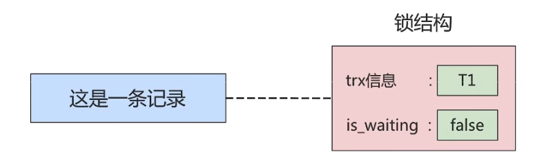

在锁结构里有很多信息，为了简化理解，只把两个比较重要的属性拿了出来:

- trx信息︰代表这个锁结构是哪个事务生成的。
- is_waiting :代表当前事务是否在等待。

当事务T1改动了这条记录后，就生成了一个锁结构与该记录关联，因为之前没有别的事务为这条记录加锁，所以is_waiting属性就是false，我们把这个场景就称之为获取锁成功，或者加锁成功，然后就可以继续执行操作了。

在事务T1提交之前，另一个事务T2也想对该记录做改动，那么先看看有没有锁结构与这条记录关联，发现有一个锁结构与之关联后，然后也生成了一个锁结构与这条记录关联，不过锁结构的is_waiting属性值为true表示当前事务需要等待，我们把这个场景就称之为获取锁失败，或者加锁失败，图示

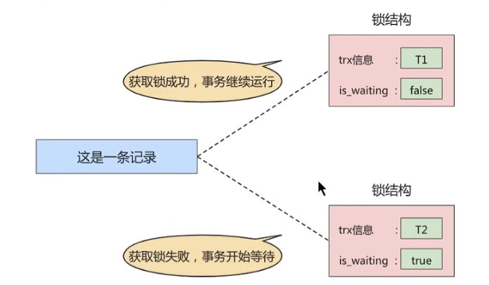

在事务T1提交之后，就会把该事务生成的锁结构释放掉，然后看看还有没有别的事务在等待获取锁，发现了事务T2还在等待获取锁，所以把事务T2对应的锁结构的is_waiting属性设置为false，然后把该事务对应的线程唤醒，让它继续执行，此时事务T2就算获取到锁了。效果图就是这样:

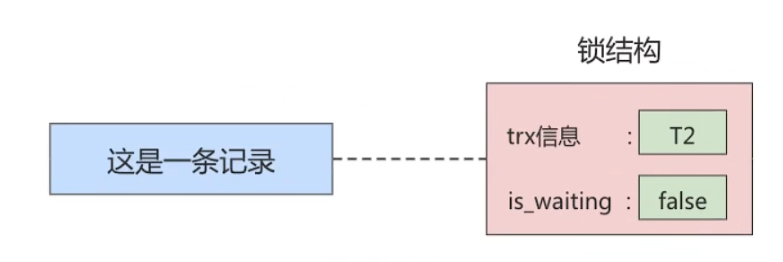

小结几种说法：

- 不加锁

意思就是不需要在内存中生成对应的 锁结构 ，可以直接执行操作。

- 获取锁成功，或者加锁成功

意思就是在内存中生成了对应的 锁结构 ，而且锁结构的 is_waiting 属性为 false ，也就是事务可以继续执行操作。

- 获取锁失败，或者加锁失败，或者没有获取到锁

意思就是在内存中生成了对应的 锁结构 ，不过锁结构的 is_waiting 属性为 true ，也就是事务
需要等待，不可以继续执行操作。

## 2.3 读-写或写-读情况

读-写 或 写-读 ，即一个事务进行读取操作，另一个进行改动操作。这种情况下可能发生 脏读 、 不可重 复读 、 幻读 的问题。

各个数据库厂商对 SQL标准 的支持都可能不一样。比如MySQL在 REPEATABLE READ 隔离级别上就已经解决了 幻读 问题。

## 2.4 并发问题的解决方案

怎么解决 脏读 、 不可重复读 、 幻读 这些问题呢？其实有两种可选的解决方案：

- 方案一：读操作利用多版本并发控制（ MVCC ，下章讲解），写操作进行 加锁 。

所谓的MVCC，就是生成一个ReadView，通过ReadView找到符合条件的记录版本（历史版本由undo日志构建)。查询语句只能读到在生成ReadView之前已提交事务所做的更改，在生成ReadView之前未提交的事务或者之后才开启的事务所做的更改是看不到的。而写操作肯定针对的是最新版本的记录，读记录的历史版本和改动记录的最新版本本身并不冲突，也就是采用MVCC时，读-写操作并不冲突。

> 普通的SELECT语句在READ COMMITTED和REPEATABLE READ隔离级别下会使用到MVCC读取记录。
>
> - 在 READ COMMITTED 隔离级别下，一个事务在执行过程中每次执行SELECT操作时都会生成一
>   个ReadView，ReadView的存在本身就保证了 事务不可以读取到未提交的事务所做的更改 ，也就
>   是避免了脏读现象；
> - 在 REPEATABLE READ 隔离级别下，一个事务在执行过程中只有 第一次执行SELECT操作 才会
>   生成一个ReadView，之后的SELECT操作都 复用 这个ReadView，这样也就避免了不可重复读
>   和幻读的问题。

- 方案二：读、写操作都采用 加锁 的方式。

如果我们的一些业务场景不允许读取记录的旧版本，而是每次都必须去读取记录的最新版本。比如，在银行存款的事务中，你需要先把账户的余额读出来，然后将其加上本次存款的数额，最后再写到数据库中。在将账户余额读取出来后，就不想让别的事务再访问该余额，直到本次存款事务执行完成，其他事务才可以访问账户的余额。这样在读取记录的时候就需要对其进行加锁操作，这样也就意味着读操作和写操作也像写-写操作那样排队执行。

脏读的产生是因为当前事务读取了另一个未提交事务写的一条记录，如果另一个事务在写记录的时候就给这条记录加锁，那么当前事务就无法继续读取该记录了，所以也就不会有脏读问题的产生了。

不可重复读的产生是因为当前事务先读取一条记录，另外一个事务对该记录做了改动之后并提交之后，当前事务再次读取时会获得不同的值，如果在当前事务读取记录时就给该记录加锁，那么另一个事务就无法修改该记录，自然也不会发生不可重复读了。

幻读问题的产生是因为当前事务读取了一个范围的记录，然后另外的事务向该范围内插入了新记录，当前事务再次读取该范围的记录时发现了新插入的新记录。采用加锁的方式解决幻读问题就有一些麻烦，因为当前事务在第一次读取记录时幻影记录并不存在，所以读取的时候加锁就有点尴尬（因为你并不知道给谁加锁)。

- 小结对比发现：
  - 采用 MVCC 方式的话， 读-写 操作彼此并不冲突， 性能更高 。
  - 采用 加锁 方式的话， 读-写 操作彼此需要 排队执行 ，影响性能。

一般情况下我们当然愿意采用 MVCC 来解决 读-写 操作并发执行的问题，但是业务在某些特殊情况
下，要求必须采用 加锁 的方式执行。下面就讲解下MySQL中不同类别的锁。

# 3. 锁的不同角度分类

锁的分类图，如下：

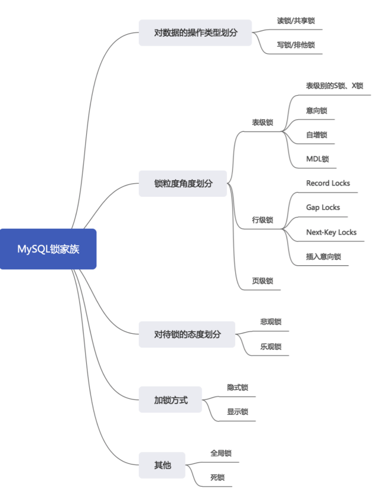


## 3.1 从数据操作的类型划分：读锁、写锁

对于数据库中并发事务的读-读情况并不会引起什么问题。对于写-写、读-写或写-读这些情况可能会引起一些问题，需要使用MVCC或者加锁的方式来解决它们。在使用加锁的方式解决问题时，由于既要允许读-读情况不受影响，又要使写-写、读-写或写-读情况中的操作相互阻塞，所以MySQL实现一个由两种类型的锁组成的锁系统来解决。这两种类型的锁通常被称为共享锁(Shared Lock，SLock)和排他锁(Exclusive Lock，X Lock)也叫读锁(readlock)和写锁(write lock)。

- 读锁 ：也称为 共享锁 、英文用 S 表示。针对同一份数据，多个事务的读操作可以同时进行而不会
  互相影响，相互不阻塞的。
- 写锁 ：也称为 排他锁 、英文用 X 表示。当前写操作没有完成前，它会阻断其他写锁和读锁。这样
  就能确保在给定的时间里，只有一个事务能执行写入，并防止其他用户读取正在写入的同一资源。

**需要注意的是对于InnoDB引擎来说，读锁和写锁可以加在表上，也可以加在行上。**

举例（行级读写锁)︰如果一个事务T1已经获得了某个行r的读锁，那么此时另外的一个事务T2是可以去获得这个行r的读锁的，因为读取操作并没有改变行r的数据;但是，如果某个事务T3想获得行r的写锁，则它必须等待事务T1、T2释放掉行r上的读锁才行。

总结:这里的兼容是指对同一张表或记录的锁的兼容性情况。

|      | X锁    | S锁    |
| ---- | ------ | ------ |
| X锁  | 不兼容 | 不兼容 |
| S锁  | 不兼容 | 兼容   |

### 1.锁定读

在采用加锁方式解决脏读、不可重复读、幻读这些问题时，读取一条记录时需要获取该记录的S锁，其实是不严谨的，有时候需要在读取记录时就获取记录的x锁，来禁止别的事务读写该记录，为此MySQL提出了两种比较特殊的SELECT语句格式:

- 对读取的记录加S锁︰

```
SELECT ... LOCK IN SHARE MODE;

#或

SELECT ... FOR SHARE;#(8.0新增语法)

mysql
```

在普通的SELECT语句后边加LOCK IN SHARE MODE，如果当前事务执行了该语句，那么它会为读取到的记录加s锁，这样允许别的事务继续获取这些记录的S锁(比方说别的事务也使用SELECT … LOCK IN SHAREMODE语句来读取这些记录)，但是不能获取这些记录的X锁(比如使用SELECT … FOR UPDATE语句来读取这些记录，或者直接修改这些记录)。如果别的事务想要获取这些记录的X锁，那么它们会阻塞，直到当前事务提交之后将这些记录上的S锁释放掉。

- 对读取的记录加X锁:

```
SELECT ... FOR UPDATE;
mysql
```

在普通的SELECT语句后边加FOR UPDATE，如果当前事务执行了该语句，那么它会为读取到的记录加X锁，这样既不允许别的事务获取这些记录的S锁(比方说别的事务使用SELECT … LOCK IN SHARE MODE语句来读取这些记录)，也不允许获取这些记录的X锁(比如使用SELECT … FOR UPDATE语句来读取这些记录，或者直接修改这些记录)。如果别的事务想要获取这些记录的s锁或者X锁，那么它们会阻塞，直到当前事务提交之后将这些记录上的X锁释放掉。

**MySQL8.0新特性:**

在5.7及之前的版本，SELECT…FOR UPDATE，如果获取不到锁，会一直等待，直到
innodb_lock_wait_timeout超时。在8.0版本中，SELECT …FOR UPDATE，SELECT …FOR SHARE添加NOWAIT、SKIP LOCKED语法，跳过锁等待，或者跳过锁定。

- 通过添加NOWAIT、SKIP LOCKED语法，能够立即返回。如果查询的行已经加锁:
  - 那么NOWAIT会立即报错返回
  - 而SKIP LOCKED也会立即返回，只是返回的结果中不包含被锁定的行。

```sql
# session 1
mysql> begin;
mysql> select * from t1 where c1 = 2 for update;

# session 2
mysql> select * from t1 where c1 = 2 for update nowait;

mysql> select * from t1 where c1 = 2 for update skip locked;
```

### 2.写操作

平常所用到的写操作无非是DELETE、UPDATE、INSERT这三种:

- DELETE:

对一条记录做DELETE操作的过程其实是先在B+树中定位到这条记录的位置，然后获取这条记录的X锁，再执行delete mark 操作。我们也可以把这个定位待删除记录在B+树中位置的过程看成是一个获取x锁的锁定读。

- UPDATE:在对一条记录做UPDATE操作时分为三种情况:
  - 情况1:未修改该记录的键值，并且被更新的列占用的存储空间在修改前后未发生变化。
    则先在B+树中定位到这条记录的位置，然后再获取一下记录的X锁，最后在原记录的位置进行修改操作。我们也可以把这个定位待修改记录在B+树中位置的过程看成是一个获取X锁的锁定读。
  - 情况2∶未修改该记录的键值，并且至少有一个被更新的列占用的存储空间在修改前后发生变化。
    则先在B+树中定位到这条记录的位置，然后获取一下记录的X锁，将该记录彻底删除掉（就是把记录彻底移入垃圾链表)，最后再插入一条新记录。这个定位待修改记录在B+树中位置的过程看成是一个获取×锁的锁定读，新插入的记录由INSERT操作提供的隐式锁进行保护。
  - 情况3∶修改了该记录的键值，则相当于在原记录上做DELETE操作之后再来一次INSERT操作，加锁操作就需要按照DELETE 和INSERT的规则进行了。
- INSERT:

一般情况下，新插入一条记录的操作并不加锁，通过一种称之为隐式锁的结构来保护这条新插入的记录在本事务提交前不被别的事务访问。

## 3.2 从数据操作的粒度划分：表级锁、页级锁、行锁

为了尽可能提高数据库的并发度，每次锁定的数据范围越小越好，理论上每次只锁定当前操作的数据的方案会得到最大的并发度，但是管理锁是很耗资源的事情（涉及获取、检查、释放锁等动作)。因此数据库系统需要在高并发响应和系统性能两方面进行平衡，这样就产生了“锁粒度(Lock granularity)”的概念。

对一条记录加锁影响的也只是这条记录而已，我们就说这个锁的粒度比较细;其实一个事务也可以在表级别进行加锁，自然就被称之为表级锁或者表锁，对一个表加锁影响整个表中的记录，我们就说这个锁的粒度比较粗

锁的粒度主要分为表级锁、页级锁和行锁。

### 1. 表锁（Table Lock）

该锁会锁定整张表，它是MySQL中最基本的锁策略，并不依赖于存储引擎(不管你是MySQL的什么存储引擎，对于表锁的策略都是一样的)，并且表锁是开销最小的策略（因为粒度比较大)。由于表级锁一次会将整个表锁定，所以可以很好的避免死锁问题。当然，锁的粒度大所带来最大的负面影响就是出现锁资源争用的概率也会最高，导致并发率大打折扣。

#### ① 表级别的S锁、X锁

在对某个表执行SELECT、INSERT、DELETE、UPDATE语句时，InnoDB存储引擎是不会为这个表添加表级
别的 S锁 或者 X锁 的。在对某个表执行一些诸如 ALTER TABLE 、 DROP TABLE 这类的 DDL 语句时，其
他事务对这个表并发执行诸如SELECT、INSERT、DELETE、UPDATE的语句会发生阻塞。同理，某个事务
中对某个表执行SELECT、INSERT、DELETE、UPDATE语句时，在其他会话中对这个表执行 DDL 语句也会
发生阻塞。这个过程其实是通过在 server层 使用一种称之为 元数据锁 （英文名： Metadata Locks ，
简称 MDL ）结构来实现的。

一般情况下，不会使用InnoDB存储引擎提供的表级别的 S锁 和 X锁 。只会在一些特殊情况下，比方说 崩 溃恢复 过程中用到。比如，在系统变量 autocommit=0，innodb_table_locks = 1 时， 手动 获取
InnoDB存储引擎提供的表t 的 S锁 或者 X锁 可以这么写：

- LOCK TABLES t READ ：InnoDB存储引擎会对表 t 加表级别的 S锁 。
- LOCK TABLES t WRITE ：InnoDB存储引擎会对表 t 加表级别的 X锁 。

不过尽量避免在使用InnoDB存储引擎的表上使用 LOCK TABLES 这样的手动锁表语句，它们并不会提供
什么额外的保护，只是会降低并发能力而已。InnoDB的厉害之处还是实现了更细粒度的 行锁 ，关于
InnoDB表级别的 S锁 和 X锁 大家了解一下就可以了。

举例:下面我们讲解MylSAM引擎下的表锁。

**步骤1:创建表并添加数据**

```
CREATE TABLE mylock(
`id` INT NOT NULL PRIMARY KEY auto_increment,
NAME VARCHAR(20)
)ENGINE myisam;#存储引擎使用InnoDB也可以，只是不建议
#插入一条数据
INSERT INTO mylock(NAME) VALUES( 'a ' ) ;

#查询表中所有的数据
SELECT * FROM mylock ;
+----+------+
| id | NAME |
+----+------+
|  1 | a    |
+----+------+
1 row in set (0.00 sec)

mysql
```

**步骤2:查看表上加过的锁**

```
SHOW OPEN TABLES;#主要关注In_use字段的值

#或者
SHOW OPEN TABLES where In_use > 0 ;
mysql
mysql> SHOW OPEN TABLES;
+--------------------+------------------------------------------------------+--------+-------------+
| Database           | Table                                                | In_use | Name_locked |
+--------------------+------------------------------------------------------+--------+-------------+
| yygh_user          | ware_sku                                             |      0 |           0 |
| yygh_user          | ware_order_task_detail                               |      0 |           0 |
| yygh_user          | ware_order_task                                      |      0 |           0 |
| yygh_user          | ware_info                                            |      0 |           0 |
| yygh_user          | tenant_info                                          |      0 |           0 |
| yygh_user          | tenant_capacity                                      |      0 |           0 |
| yygh_user          | spu_sale_attr                                        |      0 |           0 |
| yygh_user          | spu_info                                             |      0 |           0 |
| yygh_user          | sku_sale_attr_value                                  |      0 |           0 |
| yygh_user          | sku_info                                             |      0 |           0 |
| yygh_user          | roles                                                |      0 |           0 |
| yygh_user          | payment_info                                         |      0 |           0 |
| yygh_user          | order_status_log                                     |      0 |           0 |
| yygh_user          | order_refund_info                                    |      0 |           0 |
| yygh_user          | order_detail_activity                                |      0 |           0 |
| yygh_user          | group_capacity                                       |      0 |           0 |
| yygh_user          | coupon_range                                         |      0 |           0 |
| yygh_user          | coupon_info                                          |      0 |           0 |
| yygh_user          | sku_image                                            |      0 |           0 |
| yygh_user          | config_tags_relation                                 |      0 |           0 |
| yygh_user          | config_info_tag                                      |      0 |           0 |
| yygh_user          | config_info_aggr                                     |      0 |           0 |
| yygh_user          | base_sale_attr                                       |      0 |           0 |
| yygh_user          | base_category3                                       |      0 |           0 |
| yygh_user          | base_category1                                       |      0 |           0 |
| yygh_user          | base_attr_info                                       |      0 |           0 |
| yygh_user          | activity_info                                        |      0 |           0 |
| yygh_user          | user_login_record                                    |      0 |           0 |
| yygh_order         | payment_info                                         |      0 |           0 |
| yygh_order         | order_info                                           |      0 |           0 |
| yeb                | t_salary_adjust                                      |      0 |           0 |
| yygh_user          | cart_info                                            |      0 |           0 |
| yeb                | t_salary                                             |      0 |           0 |
| yeb                | t_role                                               |      0 |           0 |
| yeb                | t_position                                           |      0 |           0 |
| yeb                | t_menu                                               |      0 |           0 |
| yeb                | t_mail_log                                           |      0 |           0 |
| yeb                | t_employee_remove                                    |      0 |           0 |
| yeb                | t_employee_ec                                        |      0 |           0 |
| yeb                | t_admin_role                                         |      0 |           0 |
| yeb                | t_admin                                              |      0 |           0 |
| yygh_user          | config_info_beta                                     |      0 |           0 |
| yami_shops         | tz_user_collection                                   |      0 |           0 |
| yami_shops         | tz_user_addr_order                                   |      0 |           0 |
| yeb                | t_sys_msg_content                                    |      0 |           0 |
| yami_shops         | tz_transport                                         |      0 |           0 |
| yami_shops         | tz_transfee                                          |      0 |           0 |
| yami_shops         | tz_sys_user_role                                     |      0 |           0 |
| yami_shops         | tz_sys_user                                          |      0 |           0 |
| yami_shops         | tz_sys_role_menu                                     |      0 |           0 |
| yami_shops         | tz_sys_role                                          |      0 |           0 |
| yami_shops         | tz_sys_log                                           |      0 |           0 |
| yami_shops         | tz_sku                                               |      0 |           0 |
| yami_shops         | tz_prod_tag_reference                                |      0 |           0 |
| yami_shops         | tz_prod_comm                                         |      0 |           0 |
| yygh_user          | spu_poster                                           |      0 |           0 |
| yami_shops         | tz_prod                                              |      0 |           0 |
| yami_shops         | tz_order_refund                                      |      0 |           0 |
| yami_shops         | tz_order                                             |      0 |           0 |
| yami_shops         | tz_message                                           |      0 |           0 |
| yami_shops         | tz_prod_prop_value                                   |      0 |           0 |
| yami_shops         | tz_login_hist                                        |      0 |           0 |
| yami_shops         | tz_delivery                                          |      0 |           0 |
| yami_shops         | tz_category_brand                                    |      0 |           0 |
| yami_shops         | tz_basket                                            |      0 |           0 |
| yami_shops         | tz_area                                              |      0 |           0 |
| yami_shops         | qrtz_simple_triggers                                 |      0 |           0 |
| yami_shops         | qrtz_scheduler_state                                 |      0 |           0 |
| yeb                | t_department                                         |      0 |           0 |
| yami_shops         | qrtz_paused_trigger_grps                             |      0 |           0 |
| yami_shops         | qrtz_locks                                           |      0 |           0 |
| yami_shops         | tz_sms_log                                           |      0 |           0 |
| yami_shops         | qrtz_job_details                                     |      0 |           0 |
| yami_shops         | qrtz_fired_triggers                                  |      0 |           0 |
| yami_shops         | qrtz_calendars                                       |      0 |           0 |
| xmusic             | xmusic                                               |      0 |           0 |
| xmusic             | user                                                 |      0 |           0 |
| xmusic             | favorite                                             |      0 |           0 |
| sys                | x$waits_global_by_latency                            |      0 |           0 |
| sys                | x$waits_by_host_by_latency                           |      0 |           0 |
+--------------------+------------------------------------------------------+--------+-------------+
650 rows in set (0.09 sec)
mysql
mysql> SHOW OPEN TABLES where In_use > 0 ;
Empty set (0.14 sec)

mysql
```

上面的结果表明，当前数据库中没有被锁定的表。

#### 步骤3:手动增加表锁命令

```
LOCK TABLES t READ:#存储引擎会对表t加表级别的共享锁。共享锁也叫读锁或S锁（Share的缩写)
LOCK TABLES t WRITE:#存储引擎会对表t加表级别的排他锁。排它锁也叫独占锁、写锁或×锁〈是eXclusive的缩写)
mysql
```

比如:

```
mysql> lock tables mylock write;
Query 0K， rows affected (0.0日秒)

mysql> SHOW OPEN TABLES where In_use > 0;
+------------+--------+--------+-------------+
| Database   | Table  | In_use | Name_locked |
+------------+--------+--------+-------------+
| atguigudb1 | mylock |      1 |           0 |
+------------+--------+--------+-------------+
1 row in set (0.14 sec)

mysql
```

**步骤4∶释放表锁**

```
UNLOCK TABLES;#使用此命令解锁当前加锁的表
mysql
```

比如:

```
mysql> unlock tables ;
Query 0K，0 rows affected (0.01秒)
mysql
#可以看到已经没有In_use>0的数据了
mysql> SHOW OPEN TABLES where In_use > 0 ;
Empty set (0.04 sec)
mysql
```

**步骤5:加读锁**
我们为mylock表加read锁(读阻塞写)，观察阻塞的情况，流程如下:

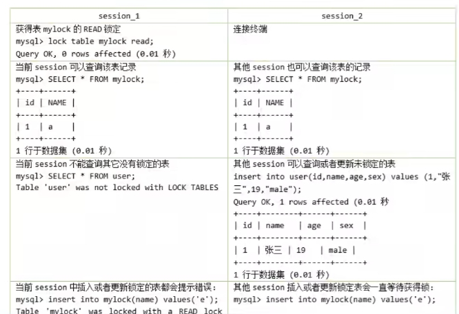

**步骤6:加写锁**
为mylock表加write锁，观察阻塞的情况，流程如下:

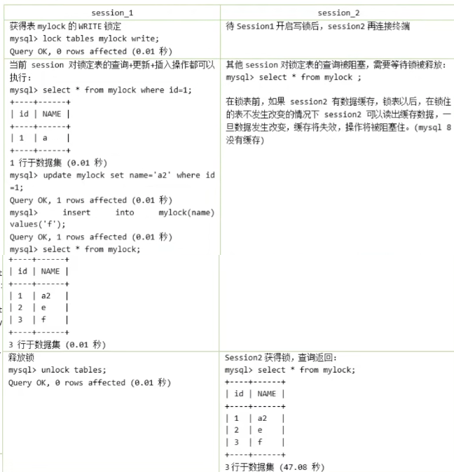

总结:

**MyISAM在执行查询语句（SELECT)前，会给涉及的所有表加读锁，在执行增删改操作前，会给涉及的表加写锁。InnoDB存储引擎是不会为这个表添加表级别的读锁或者写锁的。**

MySQL的表级锁有两种模式：（以MyISAM表进行操作的演示）

- 表共享读锁（Table Read Lock）
- 表独占写锁（Table Write Lock）

| 锁类型 | 自己可读 | 自己可写 | 自己可操作其他表 | 他人可读 | 他人可写 |
| ------ | -------- | -------- | ---------------- | -------- | -------- |
| 读锁   | 是       | 否       | 否               | 是       | 否，等   |
| 写锁   | 是       | 是       | 否               | 否，等   | 否，等   |

#### ② 意向锁 （intention lock）

InnoDB 支持 多粒度锁（multiple granularity locking） ，它允许 行级锁 与 表级锁 共存，而意向
锁就是其中的一种 表锁 。

1、意向锁的存在是为了协调行锁和表锁的关系，支持多粒度(表锁与行锁)的锁并存。

2、意向锁是一种不与行级锁冲突表级锁，这一点非常重要。

3、表明“某个事务正在某些行持有了锁或该事务准备去持有锁”

意向锁分为两种：

- 意向共享锁（intention shared lock, IS）：事务有意向对表中的某些行加共享锁（S锁）

```
-- 事务要获取某些行的 S 锁，必须先获得表的 IS 锁。 

SELECT column FROM table ... LOCK IN SHARE MODE;
mysql
```

- 意向排他锁（intention exclusive lock, IX）：事务有意向对表中的某些行加排他锁（X锁）

```
-- 事务要获取某些行的 X 锁，必须先获得表的 IX 锁。 

SELECT column FROM table ... FOR UPDATE;
mysql
```

即：意向锁是由存储引擎 自己维护的 ，用户无法手动操作意向锁，在为数据行加共享 / 排他锁之前，
InooDB 会先获取该数据行 所在数据表的对应意向锁 。

**1.意向锁要解决的问题**

现在有两个事务，分别是T1和T2，其中T2试图在该表级别上应用共享或排它锁，如果没有意向锁存在，那么T2就需要去检查各个页或行是否存在锁;如果存在意向锁，那么此时就会受到由T1控制的表级别意向锁的阻塞。T2在锁定该表前不必检查各个页或行锁，而只需检查表上的意向锁。简单来说就是给更大一级别的空间示意里面是否已经上过锁。

在数据表的场景中，如果我们给某一行数据加上了排它锁，数据库会自动给更大一级的空间，比如数据页或数据表加上意向锁，告诉其他人这个数据页或数据表已经有人上过排它锁了，这样当其他人想要获取数据表排它锁的时候，只需要了解是否有人已经获取了这个数据表的意向排他锁即可。

- 如果事务想要获得数据表中某些记录的共享锁，就需要在数据表上添加意向共享锁。
- 如果事务想要获得数据表中某些记录的排他锁，就需要在数据表上添加意向排他锁。

这时，意向锁会告诉其他事务已经有人锁定了表中的某些记录。

举例: 创建 teacher 表，插入6条记录，事务的隔离级别默认为 Repeatable_Read 

```sql
create table teacher(
  id int not null,
  name varchar(255) not null
) engine = innodb default charset=utf8mb4 collate=utf8mb4_0900_ai_ci;

insert into teacher values
(1, 'zhangsan'),
(2, 'lisi'),
(3, 'wangwu'),
(4, 'maliu'),
(5, 'tianqi'),
(6, 'zhaoba');

select @@transaction_isolation;

# 假设事务A 获取了某一行的排它锁，并为提交，语句如下
begin;
select * from teacher where id = 6 for update;

# 事务B 想要获取 teacher 表的表读锁，语句如下
begin;
lock tables teacher read;
```

因为共享锁与排它锁互斥，所以事务B 在视图对 teacher 表加共享锁的时候，必须满足两个条件
1. 当前没有其他事务持有 teacher 表的排它锁。
2. 当前没有其他事务持有 teacher 表中任意一行的排它锁。

为了检测是否满足第二个条件，事务B必须在确保 teacher 表不存在任何排它锁的前提下，去检测表中的每一行是否存在排它锁。很明显这是一个效率很差的做法，但是有了意向锁之后，情况就不一样了。

意向锁是怎么解决这个问题的呢？首先，我们需要知道意向锁之间的兼容互斥性，如下所示:

|                | 意向共享锁(IS) | 意向排它锁 (IX) |
| -------------- | -------------- | --------------- |
| 意向共享锁(IS) | 兼容           | 兼容            |
| 意向排他锁(IX) | 兼容           | 兼容            |

即意向锁之间是互相兼容的，虽然意向锁和自家兄弟互相兼容，但是他会与普通的排他/共享锁互斥。

|           | 意向共享锁 (IS) | 意向排它锁 (IX) |
| --------- | --------------- | --------------- |
| 共享锁(S) | 兼容            | 互斥            |

注意，这里的排它/共享锁指的都是表锁，意向锁不会与行级的共享/排它锁互斥。回到刚才 teacher 表的例子。

事务A 获取了某一行的排它锁，并且未提交

```sql
begin;
select * from teacher where id = 6 for update;
```

此时，teacher 表存在两把锁: teacher 表上的意向排他锁与id为6的数据行上的排它锁。事务B想要获取 teacher 表的共享锁

```sql
begin;
lock tables teacher read;
```

此时事务B检测事务A持有 teacher 表的意向排它锁，就可以得知事务A必然持有该表中某些数据行的排它锁，那么事务B对teacher表的加锁请求就会被排斥(阻塞)，而无需去检测表中的每一行数据是否存在排它锁。


**意向锁的并发性**

意向锁不会与行级的共享 / 排他锁互斥！正因为如此，意向锁并不会影响到多个事务对不同数据行加排
他锁时的并发性。（不然我们直接用普通的表锁就行了）

我们扩展一下上面 teacher表的例子来概括一下意向锁的作用（一条数据从被锁定到被释放的过程中，可
能存在多种不同锁，但是这里我们只着重表现意向锁）。

事务A先获取了某一行的排他锁，并未提交:

```
BEGIN ;
SELECT * FROM teacher WHERE id = 6 FOR UPDATE;
mysql
```

事务A获取了teacher表上的意向排他锁，事务A获取了id为6的数据行上的排他锁。之后事务B想要获取teacher表的共享锁。

```
BEGIN;
LOCK TABLES teacher READ ;
mysql
```

事务B检测到事务A持有teacher表的意向排他锁。事务B对teacher表的加锁请求被阻塞（排斥)。最后事务C也想获取teacher表中某一行的排他锁。

```
BEGIN ;
SELECT * FROM teacher WHERE id = 5 FOR UPDATE;
mysql
```

事务c申请teacher表的意向排他锁。事务c检测到事务A持有teacher表的意向排他锁。因为意向锁之间并不互斥，所以事务c获取到了teacher表的意向排他锁。因为id为5的数据行上不存在任何排他锁，最终事务C成功获取到了该数据行上的排他锁。

**从上面的案例可以得到如下结论：**

1. InnoDB 支持 多粒度锁 ，特定场景下，行级锁可以与表级锁共存。
2. 意向锁之间互不排斥，但除了 IS 与 S 兼容外， 意向锁会与 共享锁 / 排他锁 互斥 。
3. IX，IS是表级锁，不会和行级的X，S锁发生冲突。只会和表级的X，S发生冲突。
4. 意向锁在保证并发性的前提下，实现了 行锁和表锁共存 且 满足事务隔离性 的要求。

#### ③ 自增锁（AUTO-INC锁）

在使用MySQL过程中，我们可以为表的某个列添加 AUTO_INCREMENT 属性。举例：

```
CREATE TABLE `teacher` ( 
	`id` int NOT NULL AUTO_INCREMENT, 
	`name` varchar(255) NOT NULL, 
	PRIMARY KEY (`id`) 
) ENGINE=InnoDB DEFAULT CHARSET=utf8mb4 COLLATE=utf8mb4_0900_ai_ci;
mysql
```

由于这个表的id字段声明了AUTO_INCREMENT，意味着在书写插入语句时不需要为其赋值，SQL语句修改
如下所示。

```
INSERT INTO `teacher` (name) VALUES ('zhangsan'), ('lisi');
mysql
```

上边的插入语句并没有为id列显式赋值，所以系统会自动为它赋上递增的值，结果如下所示。

```
mysql> select * from teacher; 
+----+----------+
| id |    name  | 
+----+----------+
|  1 | zhangsan | 
|  2 |     lisi | 
+----+----------+
2 rows in set (0.00 sec)
mysql
```

现在我们看到的上面插入数据只是一种简单的插入模式，所有插入数据的方式总共分为三类，分别是
“ Simple inserts ”，“ Bulk inserts ”和“ Mixed-mode inserts ”。

**1. “Simple inserts” （简单插入）**

可以 预先确定要插入的行数 （当语句被初始处理时）的语句。包括没有嵌套子查询的单行和多行
INSERT…VALUES() 和 REPLACE 语句。比如我们上面举的例子就属于该类插入，已经确定要插入的行
数。

**2. “Bulk inserts” （批量插入）**

事先不知道要插入的行数 （和所需自动递增值的数量）的语句。比如 INSERT … SELECT ， REPLACE … SELECT 和 LOAD DATA 语句，但不包括纯INSERT。 InnoDB在每处理一行，为AUTO_INCREMENT列
分配一个新值。

**3. “Mixed-mode inserts” （混合模式插入）**

这些是“Simple inserts”语句但是指定部分新行的自动递增值。例如 INSERT INTO teacher (id,name) VALUES (1,‘a’), (NULL,‘b’), (5,‘c’), (NULL,‘d’); 只是指定了部分id的值。另一种类型的“混合模式插入”是 INSERT … ON DUPLICATE KEY UPDATE 。

对于上面数据插入的案例，MySQL中采用了自增锁的方式来实现，AUTO-INC锁是当向使用含有AUTO_INCREMENT列的表中插入数据时需要获取的一种特殊的表级锁，在执行插入语句时就在表级别加一个AUTO-INC锁，然后为每条待插入记录的AUTO_INCREMENT修饰的列分配递增的值，在该语句执行结束后，再把AUTO-INC锁释放掉。一个事务在持有AUTO-INC锁的过程中，其他事务的插入语句都要被阻塞，可以保证一个语句中分配的递增值是连续的。也正因为此，其并发性显然并不高，当我们向一个有AUTO_INCREMENT关键字的主键插入值的时候，每条语句都要对这个表锁进行竞争，这样的并发潜力其实是很低下的，所以innodb通过innodb_autoinc_lock_mode的不同取值来提供不同的锁定机制，来显著提高SQL语句的可伸缩性和性能。

innodb_autoinc_lock_mode有三种取值，分别对应与不同锁定模式：

**（1）innodb_autoinc_lock_mode = 0(“传统”锁定模式)**

在此锁定模式下，所有类型的insert语句都会获得一个特殊的表级AUTO-INC锁，用于插入具有
AUTO_INCREMENT列的表。这种模式其实就如我们上面的例子，即每当执行insert的时候，都会得到一个
表级锁(AUTO-INC锁)，使得语句中生成的auto_increment为顺序，且在binlog中重放的时候，可以保证
master与slave中数据的auto_increment是相同的。因为是表级锁，当在同一时间多个事务中执行insert的
时候，对于AUTO-INC锁的争夺会 限制并发 能力。

**（2）innodb_autoinc_lock_mode = 1(“连续”锁定模式)**

在 MySQL 8.0 之前，连续锁定模式是 默认 的。

在这个模式下，“bulk inserts”仍然使用AUTO-INC表级锁，并保持到语句结束。这适用于所有INSERT … SELECT，REPLACE … SELECT和LOAD DATA语句。同一时刻只有一个语句可以持有AUTO-INC锁。

对于“Simple inserts”（要插入的行数事先已知），则通过在 mutex（轻量锁） 的控制下获得所需数量的
自动递增值来避免表级AUTO-INC锁， 它只在分配过程的持续时间内保持，而不是直到语句完成。不使用
表级AUTO-INC锁，除非AUTO-INC锁由另一个事务保持。如果另一个事务保持AUTO-INC锁，则“Simple inserts”等待AUTO-INC锁，如同它是一个“bulk inserts”。

**（3）innodb_autoinc_lock_mode = 2(“交错”锁定模式)**

从 MySQL 8.0 开始，交错锁模式是 默认 设置。

在这种锁定模式下，所有类INSERT语句都不会使用表级AUTO-NC锁并且可以同时执行多个语句。这是最快和最可扩展的锁定模式，但是当使用基于语句的复制或恢复方案时，从二进制日志重播sQL语句时，这是不安全的。

在此锁定模式下，自动递增值保证在所有并发执行的所有类型的insert语句中是唯一且单调递增的。但是，由于多个语句可以同时生成数字(即，跨语句交叉编号)，为任何给定语句插入的行生成的值可能不是连续的。

如果执行的语句是"simple inserts”，其中要插入的行数已提前知道，除了“Mixed-mode inserts"之外，为单个语句生成的数字不会有间隙。然而，当执行"“bulk inserts"时，在由任何给定语句分配的自动递增值中可能存在间隙。

#### ④ 元数据锁（MDL锁

MySQL5.5引入了meta data lock，简称MDL锁，属于表锁范畴。MDL 的作用是，保证读写的正确性。比
如，如果一个查询正在遍历一个表中的数据，而执行期间另一个线程对这个 表结构做变更 ，增加了一
列，那么查询线程拿到的结果跟表结构对不上，肯定是不行的。

因此，当对一个表做增删改查操作的时候，加 MDL读锁；当要对表做结构变更操作的时候，加 MDL 写
锁

读锁之间不互斥，因此你可以有多个线程同时对一张表增删改查。读写锁之间、写锁之间是互斥的，用来保证变更表结构操作的安全性，解决了DML和DDL操作之间的一致性问题。不需要显式使用，在访问一个表的时候会被自动加上。


举例：元数据锁的使用场景模拟
```sql
# session A
mysql> begin;
mysql> select count(1) from teacher;

# session B
mysql> begin;
mysql> alter table teacher add age int not null;

# session C
mysql> show processlist;
```

通过 session C 可以看出来 session B被阻塞，这是由于 session A 拿到 teacher 表的元数据读锁，session B 想申请 teacher 表的元数据写锁，由于读写锁互斥，session B 需要等待 session A 释放元数据锁才能执行。


元数据锁可能带来的问题

| session A                          | session B                        | session C              |
| ---------------------------------- | -------------------------------- | ---------------------- |
| begin;<br />select * from teacher; |                                  |                        |
|                                    | Alter table teacher add age int; |                        |
|                                    |                                  | select * from teacher; |

我们可以看到 session A会对表 teacher 加一个 MDL 读锁，之后 session B要加 MDL 写锁会被 blocked，因为 session A 的 MDL 读锁还没有释放，而session C要在表 teacher 上新申请 MDL 读锁的请求也会被 session B 阻塞。前面我们说了，所有对表的增删改查操作都需要先申请 MDL 读锁，就都被阻塞，等于这个表现在完全不可读写了。

### 2. InnoDB中的行锁

行锁(Row Lock)也称为记录锁，顾名思义，就是锁住某一行（某条记录row)。需要的注意的是，MySQL服务器层并没有实现行锁机制，行级锁只在存储引擎层实现。

**优点**:锁定力度小，发生锁冲突概率低，可以实现的并发度高。

**缺点**:对于锁的开销比较大，加锁会比较慢，容易出现死锁情况。

InnoDB与MylSAM的最大不同有两点:一是支持事务（TRANSACTION);二是采用了行级锁。

首先我们创建表如下:

```
CREATE TABLE student (
id INT，
name VARCHAR(20) ,
class varchar( 10) ,
PRIMARY KEY ( id)
) Engine=InnoDB CHARSET=utf8;
```

向这个包里插入几条记录

```sql
insert into student values
(1, 'zhangsan', '一班'),
(3, 'lisi', '一班'),
(8, 'wangwu', '二班'),
(15, 'maliu', '二班'),
(20, 'tianqi', '三班');
```

student 表中的聚簇索引的见图如下

| id列     | 1        | 3    | 8      | 15    | 20     |
| -------- | -------- | ---- | ------ | ----- | ------ |
| name 列  | zhangsan | lisi | wangwu | maliu | tianqi |
| class 列 | 一班     | 一班 | 二班   | 二班  | 三班   |

这里把B+树的索引结构做了一个超级简化，只把索引中的记录给拿了出来，下面看看都有哪些常用的行锁类型。

#### ① 记录锁（Record Locks）

记录锁也就是仅仅把一条记录锁上，官方的类型名称为： LOCK_REC_NOT_GAP 。比如我们把id值为8的
那条记录加一个记录锁的示意图如图所示。仅仅是锁住了id值为8的记录，对周围的数据没有影响。

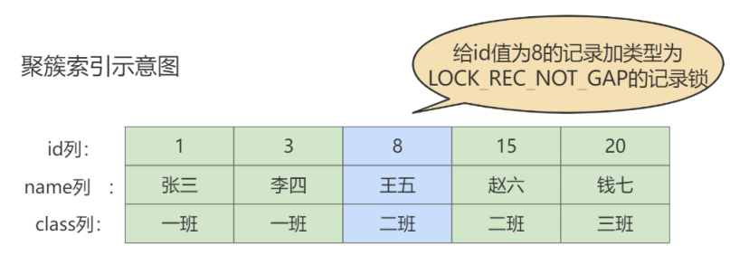

举例

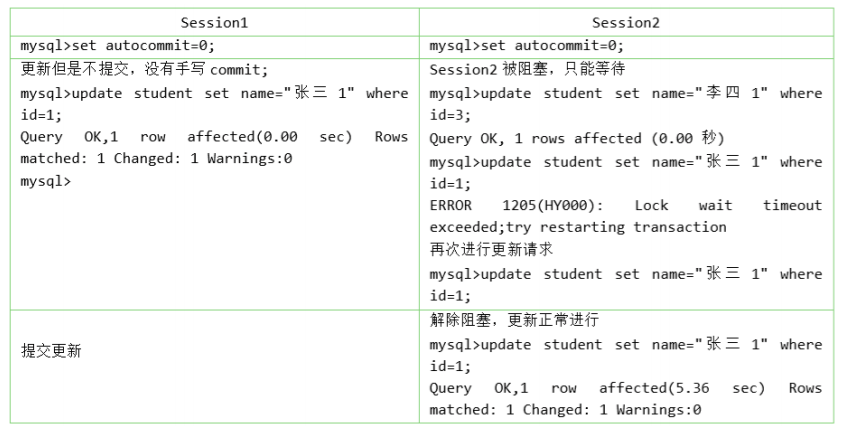

记录锁是有S锁和X锁之分的，称之为 S型记录锁 和 X型记录锁 。

- 当一个事务获取了一条记录的S型记录锁后，其他事务也可以继续获取该记录的S型记录锁，但不可
  以继续获取X型记录锁；
- 当一个事务获取了一条记录的X型记录锁后，其他事务既不可以继续获取该记录的S型记录锁，也不
  可以继续获取X型记录锁。

#### ② 间隙锁（Gap Locks）

MySQL 在 REPEATABLE READ 隔离级别下是可以解决幻读问题的，解决方案有两种，可以使用 MVCC 方
案解决，也可以采用 加锁 方案解决。但是在使用加锁方案解决时有个大问题，就是事务在第一次执行读
取操作时，那些幻影记录尚不存在，我们无法给这些 幻影记录 加上 记录锁 。InnoDB提出了一种称之为
Gap Locks 的锁，官方的类型名称为： LOCK_GAP ，我们可以简称为 gap锁 。比如，把id值为8的那条
记录加一个gap锁的示意图如下。

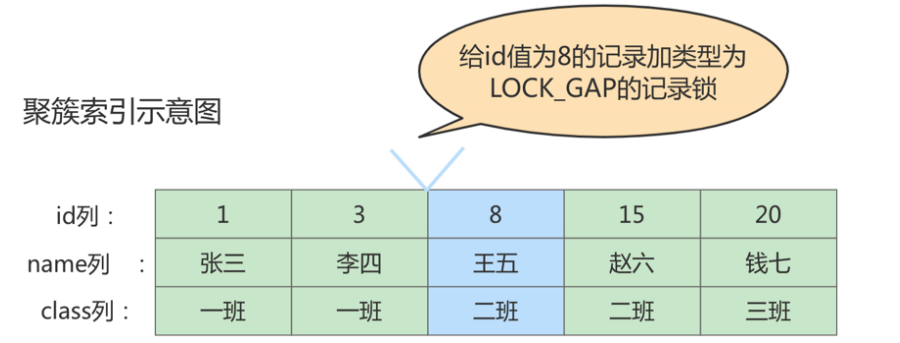


图中id值为8的记录加了gap锁，意味着 不允许别的事务在id值为8的记录前边的间隙插入新记录 ，其实就是
id列的值(3, 8)这个区间的新记录是不允许立即插入的。比如，有另外一个事务再想插入一条id值为4的新
记录，它定位到该条新记录的下一条记录的id值为8，而这条记录上又有一个gap锁，所以就会阻塞插入
操作，直到拥有这个gap锁的事务提交了之后，id列的值在区间(3, 8)中的新记录才可以被插入。

**gap锁的提出仅仅是为了防止插入幻影记录而提出的**。虽然有共享gap锁和独占gap锁这样的说法
但是它们起到的作用是相同的。而且如果对一条记录加了gap锁（不论是共享gap锁还是独占gap锁)，并不会限制其他事务对这条记录加记录锁或者继续加gap锁。


这里session 2并不会被堵住。因为表里并没有id=5这个记录，因此 session 1加的是间隙锁（3,8)
而session 2也是在这个间隙加的间隙锁。它们有共同的目标，即:保护这个间隙，不允许插入值。但，它们之间是不冲突的。

注意，给一条记录加了gap锁只是不允许其他事务往这条记录前边的间隙插入新记录，那对于最后一条记录之后的间隙，也就是student表中id值为20的记录之后的间隙该咋办呢?也就是说给哪条记录加gap锁才能阻止其他事务插入id值在(20，正无穷)这个区间的新记录呢?这时候我们在讲数据页时介绍的两条伪记录派上用场了:

- Infimum记录，表示该页面中最小的记录。
- Supremum记录，表示该页面中最大的记录。
  为了实现阻止其他事务插入id值在(20, +oo)这个区间的新记录，我们可以给索引中的最后一条记录，也就是id值为20的那条记录所在页面的Supremum记录加上一个gap锁，如图所示。

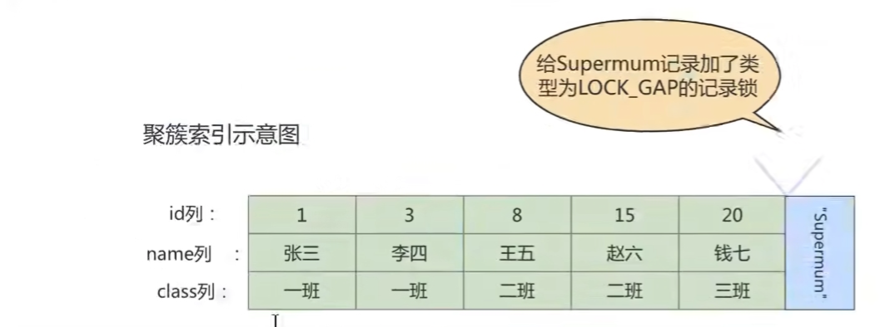

```sql
mysql> select * from student where id > 20 lock in share mode;
mysql> select * from performance_schema.data_locks\G
```

这样就可以阻止其他事务插入id值在 (20,+∞) 这个区间的新纪录。

间隙锁的引入，可能会导致同样的语句锁住更大的范围，这其实是影响了并发度的。下面的例子会产生死锁

| session1                                                     | session2                                                     |
| ------------------------------------------------------------ | ------------------------------------------------------------ |
| begin;<br />select * from student where id = 5 for update;   | begin;<br />select * from student where id = 5 for update;<br />insert into student values (5,'kino', '二班'); # 阻塞 |
| insert into student values(5, 'kino1', '二班');<br />(ERROR 1213(40001): Deadlock found when trying to get lock; try restarting transaction) |                                                              |

1. session1 执行 select ... for update 语句，由于 id=5 这一行并不存在，因此会加上间隙锁(3,8);
2. session2 执行 select ... for update 语句，同样会加上间隙锁(3,8)，间隙锁之间不会冲突，因此这个语句可以执行成功；
3. session2 试图插入一行 (5, 'kino', '二班')，被 session1 的间隙锁挡住了，只好进入等待；
4. session1 试图插入一行 (5, 'kino1','二班')，被 session2 的间隙锁挡住了。至此，两个session 进入互相等待状态，形成死锁。当然，InnoDB 的死锁检测马上就发现了这对死锁关系，让 session1 的 insert 语句报错返回。

#### ③ 临键锁（Next-Key Locks）

有时候我们既想 锁住某条记录 ，又想 阻止 其他事务在该记录前边的 间隙插入新记录 ，所以InnoDB就提
出了一种称之为 Next-Key Locks 的锁，官方的类型名称为： LOCK_ORDINARY ，我们也可以简称为
next-key锁 。Next-Key Locks是在存储引擎 innodb 、事务级别在 可重复读 的情况下使用的数据库锁，
innodb默认的锁就是Next-Key locks。比如，我们把id值为8的那条记录加一个next-key锁的示意图如下:

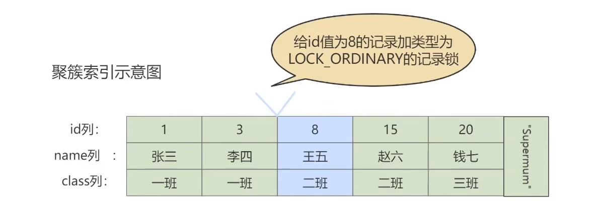

`Next-Key Locks` 的本质就是一个 `记录锁` 和一个 `gap 锁`的合体，它既能保护该条记录，又能阻止别的事务将新纪录插入被保护记录前边的间隙。

```sql
begin; 

select * from student where id <=8 and id > 3 for update;
```

#### ④ 插入意向锁（Insert Intention Locks）

我们说一个事务在 插入 一条记录时需要判断一下插入位置是不是被别的事务加了 gap锁 （ next-key锁
也包含 gap锁 ），如果有的话，插入操作需要等待，直到拥有 gap锁 的那个事务提交。但是InnoDB规
定事务在等待的时候也需要在内存中生成一个锁结构，表明有事务想在某个 间隙 中 插入 新记录，但是
现在在等待。InnoDB就把这种类型的锁命名为 Insert Intention Locks ，官方的类型名称为：
LOCK_INSERT_INTENTION ，我们称为 插入意向锁 。插入意向锁是一种 Gap锁 ，不是意向锁，在insert
操作时产生。

**插入意向锁是在插入一条记录行前，由INSERT操作产生的一种间隙锁**。该锁用以表示插入意向，当多个事务在同一区间(gap）插入位置不同的多条数据时，事务之间不需要互相等待。假设存在两条值分别为4和7的记录，两个不同的事务分别试图插入值为5和6的两条记录，每个事务在获取插入行上独占的（排他）锁前，都会获取(4，7)之间的间隙锁，但是因为数据行之间并不冲突，所以两个事务之间并不会产生冲突（阻塞等待)。总结来说，插入意向锁的特性可以分成两部分:

(1）插入意向锁是一种特殊的间隙锁 - -间隙锁可以锁定开区间内的部分记录。

(2）插入意向锁之间互不排斥，所以即使多个事务在同一区间插入多条记录，只要记录本身(主键、唯一索引)不冲突，那么事务之间就不会出现冲突等待。

注意，虽然插入意向锁中含有意向锁三个字，但是它并不属于意向锁而属于间隙锁，因为意向锁是表锁而插入意向锁是行锁。

比如，把id值为s的那条记录加一个插入意向锁的示意图如下:

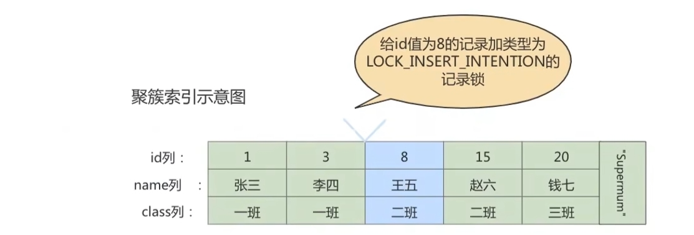

比如，现在T1 为 id=8 的记录加了 gap 锁，然后 T2 和 T3 分别想向 student表中插入 id 值分别是 4、5 的两条记录，所以现在为 id=8的记录加的锁的示意图如下

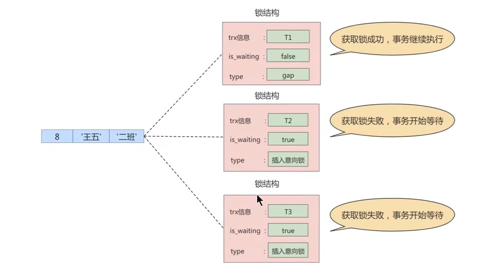

从图中可以看到，由于T1持有gap锁，所以T2和T3需要生成一个插入意向锁的锁结构并且处于等待状态。当T1提交后会把它获取到的锁都释放掉，这样T2和T3就能获取到对应的插入意向锁了(本质上就是把插入意向锁对应锁结构的is_waiting属性改为false)，T2和T3之间也并不会相互阻塞，它们可以同时获取到id值为8的插入意向锁，然后执行插入操作。事实上**插入意向锁并不会阻止别的事务继续获取该记录上任何类型的锁**。

### 3. 页锁

页锁就是在 页的粒度 上进行锁定，锁定的数据资源比行锁要多，因为一个页中可以有多个行记录。当我
们使用页锁的时候，会出现数据浪费的现象，但这样的浪费最多也就是一个页上的数据行。页锁的开销
介于表锁和行锁之间，会出现死锁。锁定粒度介于表锁和行锁之间，并发度一般。

每个层级的锁数量是有限制的，因为锁会占用内存空间， 锁空间的大小是有限的 。当某个层级的锁数量
超过了这个层级的阈值时，就会进行 锁升级 。锁升级就是用更大粒度的锁替代多个更小粒度的锁，比如
InnoDB 中行锁升级为表锁，这样做的好处是占用的锁空间降低了，但同时数据的并发度也下降了。

## 3.3 从对待锁的态度划分:乐观锁、悲观锁

从对待锁的态度来看锁的话，可以将锁分成乐观锁和悲观锁，从名字中也可以看出这两种锁是两种看待
数据并发的思维方式 。需要注意的是，乐观锁和悲观锁并不是锁，而是锁的 设计思想 。

### 1. 悲观锁（Pessimistic Locking）

悲观锁是一种思想，顾名思义，就是很悲观，对数据被其他事务的修改持保守态度，会通过数据库自身
的锁机制来实现，从而保证数据操作的排它性。

悲观锁总是假设最坏的情况，每次去拿数据的时候都认为别人会修改，所以每次在拿数据的时候都会上
锁，这样别人想拿这个数据就会 阻塞 直到它拿到锁（共享资源每次只给一个线程使用，其它线程阻塞，
用完后再把资源转让给其它线程）。比如行锁，表锁等，读锁，写锁等，都是在做操作之前先上锁，当
其他线程想要访问数据时，都需要阻塞挂起。Java中 synchronized 和 ReentrantLock 等独占锁就是
悲观锁思想的实现。

秒杀案例1

商品秒杀过程中，库存数量的减少，避免出现超卖的情况。比如，商品表中有一个字段为 quantity 表示当前该商品的库存量。假设商品为华为mate40，id为1001，quantity=100个。如果不使用锁的情况下，操作方法如下所示

```sql
# 第一步: 查询商品库存
select quantity from items where id = 1001;
# 第二步: 如果库存大于0，则根据商品信息生产订单
insert into orders(item_id) values(1001);
# 第三步: 修改商品的库存，num表示购买数量
update items set quantity = quantity - num where id = 1001;
```

这样的话，在并发量小的公司没有大的问题，但是如果在 高并发环境下可能出现以下问题

|      | 线程A                    | 线程B                    |
| ---- | ------------------------ | ------------------------ |
| 1    | step1(查询还有100部手机) | step1(查询还有100部手机) |
| 2    |                          | step2(生成订单)          |
| 3    | step2(生成订单)          |                          |
| 4    |                          | step3(减库存1)           |
| 5    | step3(减库存2)           |                          |

其中线程B此时已经下单并且减完库存，这个时候线程A依然去执行 step3，就造成了超卖。

我们使用悲观锁可以解决这个问题，商品信息查询出来到修改，中间有一个生成订单的过程，使用悲观锁的原理就是，当我们在查询items 信息后就把当前商品的数据锁定，直到我们修改完毕后再解锁。那么整个过程中，因为数据被锁定了，就不会出现第三者来对其进行修改了。而这样做的前提是需要将要执行的sql语句放在同一个事务中，否则达不到锁定数据行的目的。

修改如下:

```sql
# 第一步: 查询商品库存
select quantity from items where id = 1001 for update;
# 第二步: 如果库存大于0，则根据商品信息生产订单
insert into orders(item_id) values(1001);
# 第三步: 修改商品的库存，num表示购买数量
update items set quantity = quantity - num where id = 1001;
```

 `select ... for update` 是 MySQL 中悲观锁。此时在 items 表中，id 为 1001 的哪条数据就被锁定了，其他的要执行 `select quantity from items where id = 1001 for update;` 语句的事务必须等待本次事务提交之后才能执行。这样我们可以保证当前的数据不会被其他事务修改。

注意，当执行 `select quantity from items where id = 1001 for update;` 语句之后，如果在其他事务中执行 `select quantity from items where id = 1001;`语句，并不会受第一个事务的影响，仍然可以正常查询出数据。

注意: **select ... for update 语句执行过程中所有扫描的行都会被锁上，因此在 MySQL中用悲观锁必须确定使用了索引，而不是全表扫描，否则将会把整个表锁住。**

悲观锁不适用的场景较多，它存在一些不足，因为悲观锁大多情况下依靠数据库的锁机制来实现，以保证程序的并发访问性，同时这样对数据库性能开销影响也很大，特别是 `长事务`而言，这样的`开销往往无法承受`，这时就需要乐观锁。


