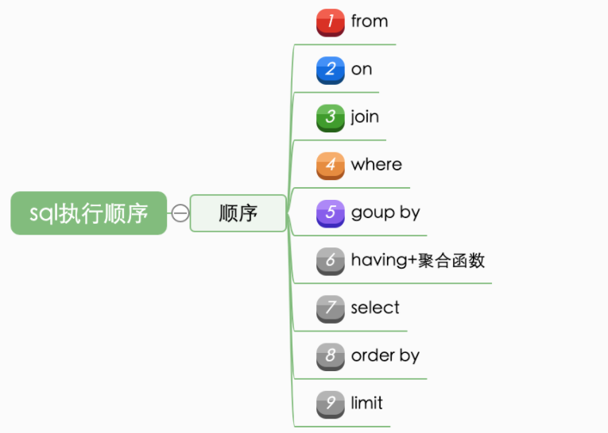

--- 
# 一、MySQL 执行过程
mysql整体的执行过程如下图所示:


# 二、SQL 执行顺序


例子: 
```mysql
mysql> SELECT distinct s.id  
    -> FROM T t 
    -> JOIN  S s on t.id=s.id 
    -> WHERE t.name="Yrion" 
    -> GROUP BY t.mobile 
    -> HAVING count(*)>2  
    -> ORDER BY s.create_time 
    -> LIMIT 5;
```
① FROM: 