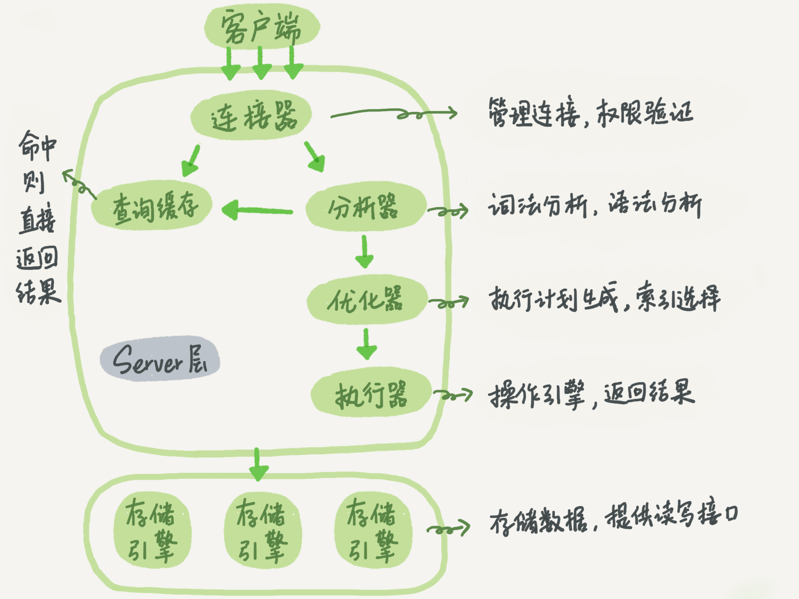
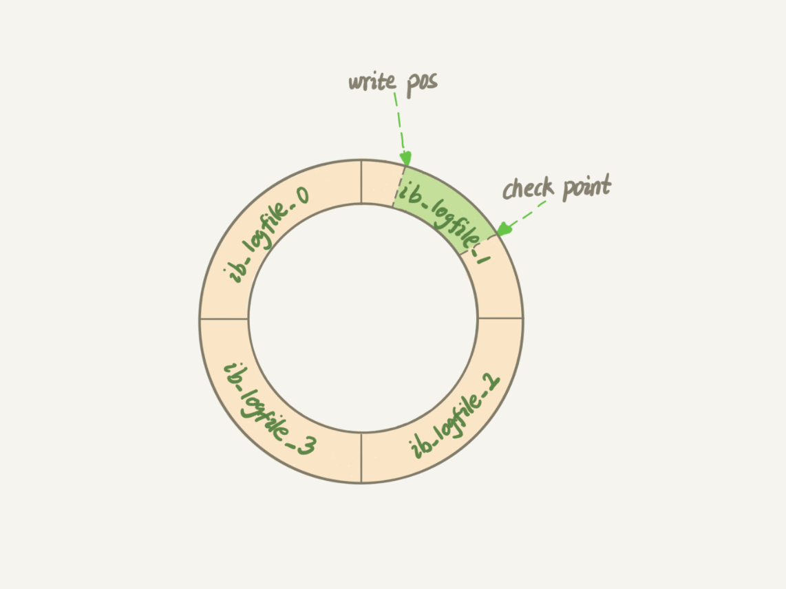

---


# 一、MySQL 基本架构

大体来说, mysql 分为 Server 和 存储引擎两部分。

Server 层包括连接器、查询缓存、分析器、优化器、执行器等，涵盖 MySQL 的大多数核心服务功能，以及所有的内置函数（如日期、时间、数学和加密函数等），所有跨存储引擎的功能都在这一层实现，比如存储过程、触发器、视图等。

而存储引擎层负责数据的存储和提取。其架构模式是插件式的，支持 InnoDB、MyISAM、Memory 等多个存储引擎。现在最常用的存储引擎是 InnoDB，它从 MySQL 5.5.5 版本开始成为了默认存储引擎。

执行 create table 建表的时候，如果不指定引擎类型，默认使用的就是 InnoDB。不过，也可以通过指定存储引擎的类型来选择别的引擎，比如在 create table 语句中使用 engine=memory, 来指定使用内存引擎创建表。不同存储引擎的表数据存取方式不同，支持的功能也不同.



## 1.1 连接器
当执行 `mysql -u$user -p -P$Port -h$ip` 连接 mysql 数据库时, 首先会经过连接器。 连接器负责跟客户`建立连接、获取权限、维持和管理连接`。

- 如果输入的用户名或密码不对，就提示 `Access denied for user` 的错误信息；
- 如果用户名密码认证通过，连接器会到权限表里面查出登录用户的所有权限，之后这次连接里面所有的操作，都依赖此时读到的权限，也就是说，如果用户登录到MySQL 之后，管理员修改了他的权限，也不会影响当前登录连接的权限，除非重新创建连接。

连接完成后，如果没有后续操作，这个连接就会处于空闲状态，可以执行 `show processlist` 查询连接信息。例如下图中，`Command` 列显示为 `Sleep`, 就表示这是一个空闲连接。


如果客户端太长时间没有后续操作，连接器就会自动将它断开。这个参数由: `wait_timeout` 控制，默认是 8 小时。

```mysql
mysql> show variables like 'wait_timeout';
+---------------+-------+
| Variable_name | Value |
+---------------+-------+
| wait_timeout  | 28800 |
+---------------+-------+
1 row in set (0.00 sec)
```

## TODO: 设置超时时间

在程序中连接数据库，分为长连接和短连接，长连接是说，如果客户端持续有请求，则一直使用同一个连接；短连接则是每次执行完很少的几次查询就断开连接，下次查询再重新创建一个。

如果所有的连接都是用长链接，MySQL 占用的内存会涨的特别快，这是因为 MySQL 在执行过程中临时使用的内存是管理在连接对象里面的，这些资源在连接断开的时候才释放，所以如果长连接累积下来，可能导致占用内存太大，被系统强行杀掉(OOM)，从现象上就是 MySQL 异常重启了。解决这个的两个方案:
1. 定期断开长连接。使用一段时间，或者程序里面判断执行过一个占用内存的大查询后，断开连接，之后要查询再重连。
2. 在 MySQ5.7 之后，可以在每次执行一个比较大的操作后，通过 mysql_reset_connection 来重新初始化连接资源。这个过程不需要重新连接和重新做权限校验，但是会将连接恢复到刚刚创建完时的状态。

## 1.2 查询缓存
说明：在 MySQL8 中，查询缓存已经被删除。

在连接建立完成后，执行 select 语句，mysql 会先到查询缓存看看，之前如果执行过这条语句，则会将结果以 key-value 的形式，直接缓存在内存中，key是查询语句，value是查询结果，如果查询缓存中找到了这个key，则value会被直接返回给客户端。

查询缓存的失效是非常频繁的，只要有表更新，这个表对应的查询缓存都会被清空，因此可能会产生：刚把结果缓存起来，还没使用，表被更新，查询环境就失效了。

mysql 也可以按需开启查询缓存，需要设置参数: `query_cache_type` 为 `DEMAND`,这样所有的查询都不用查询缓存，对于需要缓存的语句使用 `SQL_CACHE` 显示指定:
```mysql
mysql> select SQL_CACHE * from T where ID=10;
```

## 1.3 分析器
分析器的主要作用，是对 SQL 语句做 `词法解析、语法解析`。

在未命中查询缓存，分析器就会开始做 `词法解析`，MySQL 从输入的 `select` 关键字识别出这是查询语句, 把字符串 T 识别成 表名T，把字符串 ID 识别成 列ID。

做完 `此法解析` 后，还需要做 `语法解析`， 根据 `词法解析` 的结果，`语法分析器`会根据语法规则，判断输入的 SQL 语句是否满足 MySQL 语法要求。

如果语句不对，就会收到 `You have an error in your SQL syntax` 的错误信息:
```sql
mysql> elect * from t where id=10;
ERROR 1064 (42000): You have an error in your SQL syntax; check the manual that corresponds to your MySQL server version for the right syntax to use near 'elect * from t where ID=10' at line 1
```

## 1.4 优化器
优化器是在表里面有多个索引的时候，决定使用哪个索引；或者在一个语句有多个表关联(join)的时候，决定各个表的连接顺序，比如执行如下sql:
```sql
mysql> select * from t1 join t1 using(ID) where t1.c=10 and t2.d=20;
```
- 既可以先从表 t1 里面取出 c=10 的记录的ID值，再根据 ID 值关联到表 t2，再判断 t2 里面 d 的值是否等于 20.
- 也可以先从表 t2 取出 d=20 的记录的 ID 值，再根据 ID 值关联到 t1，再判断 t1 里面 c 的值是否等于 10.

这两种执行方法的逻辑结果是一样的，但是执行的效率会有不同，而优化器的作用就是决定选择哪一个方案。

## 1.5 执行器
执行器在开始执行的时候，要先判断用户有没有这个表 T 的查询权限，如果没有，就会返回没有权限的错误(如果命中查询缓存，会在查询结果返回的时候，做权限校验)
```sql
mysql> select * from T where ID=10;

ERROR 1142(42000): SELECT command denied to user 'b@localhost' for table 'T'
```

如果有权限，就打开表继续执行，打开表的时候，执行器会根据表的引擎定义，使用引擎提供的接口。如上面例子的执行流程如下:
- 调用 InnoDB 引擎的接口取这个表的第一行，判断 ID 值是不是 10， 如果不是则跳过，如果是则将这行存在结果集中；
- 调用引擎接口取下一行，重复上面的判断逻辑，直到最后一行；
- 执行器将结果组成记录集作为结果返回给客户端。

在数据库的慢查询日志中，可以看到一个 rows_examined 的字段，表示这个语句执行过程中扫描了多少行，这个值就是在执行器每次调用引擎获取数据行的时候累加的。

在有些场景下，执行器调用一次，在引擎内部则扫描了多行，因此 引擎扫描行数跟 row_examined 并不是完全相同的。


# 二、MySQL 日志模块
mysql 中，有两个重要的日志模块: `redo log(重做日志)` 和 `binlog(归档日志)`

## 2.1 redo log
当 mysql 中有一条记录需要更新的时候，InnoDB 引擎会先把记录写入到 redo log里面，更新到内存，这个时候更新就算完整了。同时，InnoDB 引擎会在适当的时候，将这个操作记录写入到磁盘里面。

InnoDB 的 redo log 是固定大小的，比如配置一组4个文件，每个文件大小为1GB，那个 redo log 总共就可以记录 4GB 的操作。redo log 会从头开始写，写到末尾又回到开头循环写，如下图:



write pos 是当前记录的位置，一边写一边后移，写到第3号文件末尾后，就回到0号文件的开头。

checkpoint 是当前要擦除的位置，也是往后推移并且循环的，擦除记录前要把记录更新到数据文件。

write pos 和 checkpoint 之间空着的，表示还可以用来记录新的操作。如果 write pos 追上 checkpoint，表示 redo log 满了，这个时候不能在执行更新操作，需要先把 redo log 更新到数据文件然后擦除，把 checkpoint 推进。

有了 redo log，InnoDB 就可以保证即使数据库发生异常重启，之前提交的记录都不会丢失，这个能力称为: crash-safe.

## 2.2 binlog
[binlog 的一些简单描述](./binlog.md)

