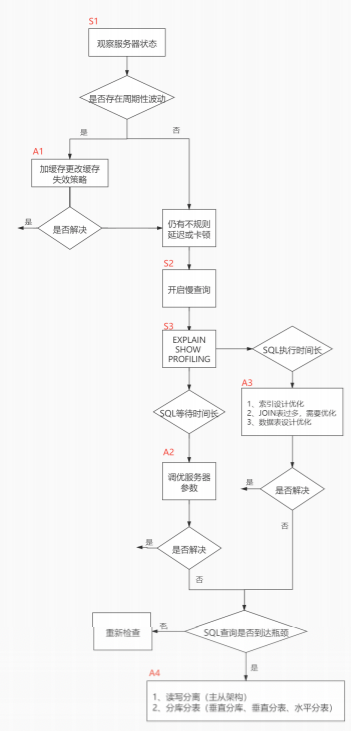
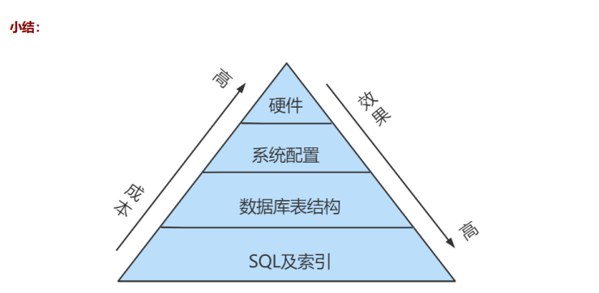
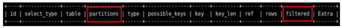
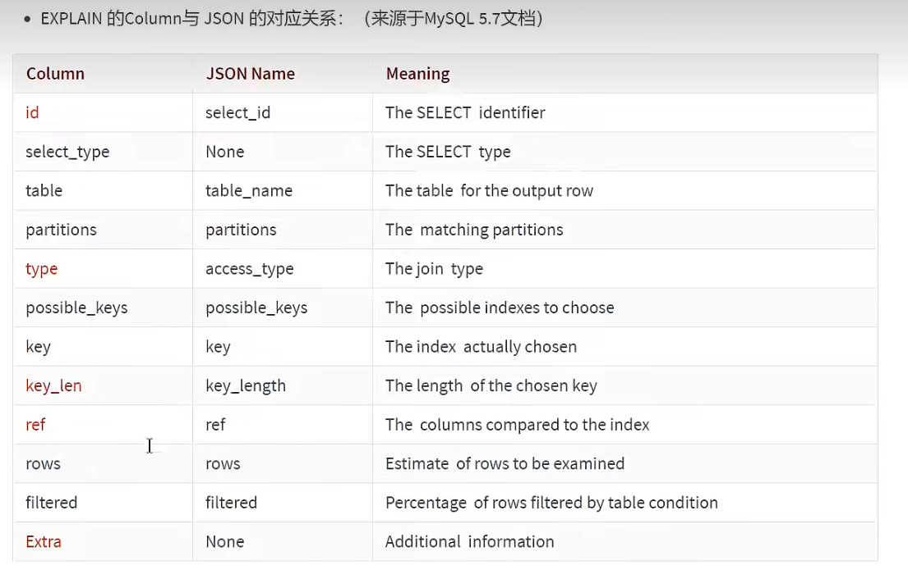
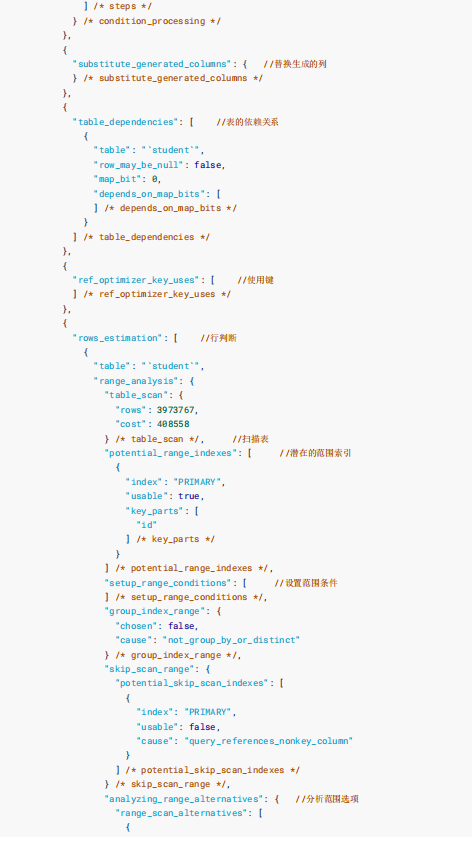
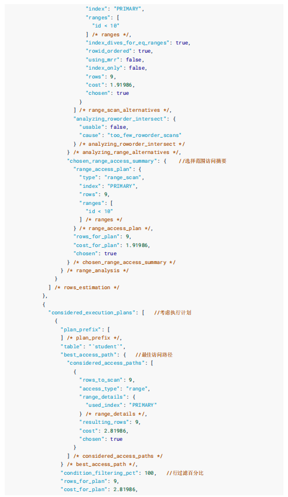
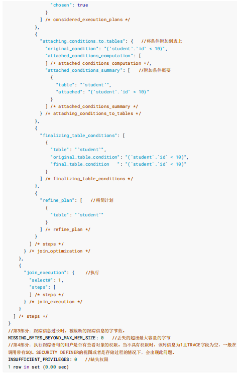

---
在数据库调优中，我们的目标就是`响应时间更快`，`吞吐量更大`。利用宏观的监控工具和微观的日志分析可以帮助我们快速找到调优的思路和方式。


# 一、数据库服务器的优化步骤
当我们遇到数据库调优问题的时候，该如何思考呢？这里把思考的流程整理成下面这张图。

整个流程分成了 `观察(show status)` 和 `行动(action)` 两个部分。字母 S 的部分代表观察(会使用相应的分析工具)，字母 A 代表的部分是行动(对应分析可以采取的行动)。



我们可以通过观察了解数据库整体的运行状态，通过性能分析工具可以让我们了解执行慢的SQL都有哪些，查看具体的SQL执行计划，甚至是SQL执行中的每一步的成本代价，这样才能定位问题所在，找到了问题，再采取相应的行动。

**详细解释一下这张图:**

首先在S1部分，我们需要观察服务器的状态是否存在周期性的波动。如果存在周期性波动，有可能是周期性节点的原因，比如双十一、促销活动等。这样的话，我们可以通过A1这一步骤解决，也就是加缓存，或者更改缓存失效策略。

如果缓存策略没有解决，或者不是周期性波动的原因，我们就需要进一步分析查询延迟和卡顿的原因。接下来进入S2这一步，我们需要开启慢查询。慢查询可以帮我们定位执行慢的SQL语句。我们可以通过设置long_query_time参数定义“慢"的阈值，如果SQL执行时间超过了long_query_time，则会认为是慢查询。当收集上来这些慢查询之后，我们就可以通过分析工具对慢查询日志进行分析。

在S3这一步骤中，我们就知道了执行慢的SQL，这样就可以针对性地用EXPLAIN查看对应SQL语句的执行计划，或者使用show profile查看SQL中每一个步骤的时间成本。这样我们就可以了解SQL查询慢是因为执行时间长，还是等待时间长。

如果是SQL等待时间长，我们进入A2步骤。在这一步骤中，我们可以调优服务器的参数，比如适当增加数据库缓冲池等。如果是SQL执行时间长，就进入A3步骤，这一步中我们需要考虑是索引设计的问题?还是查询关联的数据表过多?还是因为数据表的字段设计问题导致了这一现象。然后在这些维度上进行对应的调整。

如果A2和A3都不能解决问题，我们需要考虑数据库自身的SQL查询性能是否已经达到了瓶颈，如果确认没有达到性能瓶颈，就需要重新检查，重复以上的步骤。如果已经达到了性能瓶颈，进入A4阶段，需要考虑增加服务器，采用读写分离的架构，或者考虑对数据库进行分库分表，比如垂直分库、垂直分表和水平分表等。

以上就是数据库调优的流程思路。如果我们发现执行SQL时存在不规则延迟或卡顿的时候，就可以采用分析工具帮我们定位有问题的SQL，这三种分析工具你可以理解是SQL调优的三个步骤:慢查询、EXPLAIN和SHOW PROFILING。




# 二、查看系统性能参数
在MySQL中，可以使用 `SHOW STATUS` 语句查询一些MySQL数据库服务器的 性能参数 、 执行频率 。
```mysql
SHOW [GLOBAL|SESSION] STATUS LIKE '参数';
```
一些常用的性能参数如下：
- Connections：连接MySQL服务器的次数。
- Uptime：MySQL服务器的上线时间。
- Slow_queries：慢查询的次数。
- Innodb_rows_read：Select查询返回的行数
- Innodb_rows_inserted：执行INSERT操作插入的行数
- Innodb_rows_updated：执行UPDATE操作更新的行数
- Innodb_rows_deleted：执行DELETE操作删除的行数 • Com_select：查询操作的次数。
- Com_insert：插入操作的次数。对于批量插入的 INSERT 操作，只累加一次。
- Com_update：更新操作的次数。
- Com_delete：删除操作的次数。


# 三、统计SQL的查询成本
一条SQL查询语句在执行前需要确定查询执行计划，如果存在多种执行计划的话，MySQL会计算每个执行计划所需要的成本，从中选择成本最小的一个作为最终执行的执行计划。

如果我们想要查看某条SQL语句的查询成本，可以在执行完这条SQL语句之后，通过查看当前会话中的last_query_cost变量值来得到当前查询的成本。它通常也是我们评价一个查询的执行效率的一个常用指标。这个查询成本对应的是SQL语句所需要读取的页的数量。

使用 student_info 表为例：
```mysql
CREATE TABLE `student_info` ( 
	`id` INT(11) NOT NULL AUTO_INCREMENT, 
	`student_id` INT NOT NULL , 
	`name` VARCHAR(20) DEFAULT NULL, 
	`course_id` INT NOT NULL , 
	`class_id` INT(11) DEFAULT NULL, 
	`create_time` DATETIME DEFAULT CURRENT_TIMESTAMP ON UPDATE CURRENT_TIMESTAMP, 
	PRIMARY KEY (`id`) 
) ENGINE=INNODB AUTO_INCREMENT=1 DEFAULT CHARSET=utf8;
```
如果我们想要查询 id=900001 的记录，然后看下查询成本，我们可以直接在聚簇索引上进行查找：
```mysql
SELECT student_id, class_id, NAME, create_time FROM student_info WHERE id = 900001;
```
运行结果（1 条记录，运行时间为 0.042s ）

然后再看下查询优化器的成本，实际上我们只需要检索一个页即可：
```mysql
mysql> SHOW STATUS LIKE 'last_query_cost'; 
+-----------------+----------+
| Variable_name   |    Value | 
+-----------------+----------+
| Last_query_cost | 1.000000 | 
+-----------------+----------+
```
如果我们想要查询 id 在 900001 到 9000100 之间的学生记录呢？
```mysql
SELECT student_id, class_id, NAME, create_time FROM student_info WHERE id BETWEEN 900001 AND 900100;
```
运行结果（100 条记录，运行时间为 0.046s ）：

然后再看下查询优化器的成本，这时我们大概需要进行 20 个页的查询。
```mysql
mysql> SHOW STATUS LIKE 'last_query_cost'; 
+-----------------+-----------+
|   Variable_name |     Value | 
+-----------------+-----------+
| Last_query_cost | 21.134453 | 
+-----------------+-----------+
```
你能看到页的数量是刚才的 20 倍，但是查询的效率并没有明显的变化，实际上这两个 SQL 查询的时间基本上一样，就是因为采用了顺序读取的方式将页面一次性加载到缓冲池中，然后再进行查找。虽然 页 数量（last_query_cost）增加了不少 ，但是通过缓冲池的机制，并 没有增加多少查询时间 。

使用场景：它对于比较开销是非常有用的，特别是我们有好几种查询方式可选的时候。
> SQL查询是一个动态的过程，从页加载的角度来看，我们可以得到以下两点结论:
> 
> 1. 位置决定效率。如果页就在数据库缓冲池中，那么效率是最高的，否则还需要从内存或者磁盘中进行读取，当然针对单个页的读取来说，如果页存在于内存中，会比在磁盘中读取效率高很多。
> 2. 批量决定效率。如果我们从磁盘中对单一页进行随机读，那么效率是很低的(差不多10ms)，而采用顺序读取的方式，批量对页进行读取，平均一页的读取效率就会提升很多，甚至要快于单个页面在内存中的随机读取。

>所以说，遇到I/O并不用担心，方法找对了，效率还是很高的。我们首先要考虑数据存放的位置，如果是经常使用的数据就要尽量放到缓冲池中，其次我们可以充分利用磁盘的吞吐能力，一次性批量读取数据，这样单个页的读取效率也就得到了提升。


# 四、定位执行慢的SQL: 慢查询日志
MySQL的慢查询日志，用来记录在MySQL中响应时间超过阀值的语句，具体指运行时间超过long_query_time值的SQL，则会被记录到慢查询日志中。long_query_time的默认值为10，意思是运行10秒以上(不含10秒)的语句，认为是超出了我们的最大忍耐时间值。

它的主要作用是，帮助我们发现那些执行时间特别长的SQL查询，并且有针对性地进行优化，从而提高系统的整体效率。当我们的数据库服务器发生阻塞、运行变慢的时候，检查一下慢查询日志，找到那些慢查询，对解决问题很有帮助。比如一条sql执行超过5秒钟，我们就算慢SQL，希望能收集超过5秒的sql，结合explain进行全面分析。

默认情况下，MySQL数据库没有开启慢查询日志，需要我们手动来设置这个参数。如果不是调优需要的话，一般不建议启动该参数，因为开启慢查询日志会或多或少带来一定的性能影响。

慢查询日志支持将日志记录写入文件。

## 4.1 开启慢查询日志参数
在使用前，我们需要先看下慢查询是否已经开启，使用下面这条命令即可:
```mysql
mysql> show variables like '%slow_query_log%';
+---------------------+--------------------------------------+
| Variable_name       | Value                                |
+---------------------+--------------------------------------+
| slow_query_log      | OFF                                  |
| slow_query_log_file | /var/lib/mysql/42408b48ccb1-slow.log |
+---------------------+--------------------------------------+
2 rows in set (0.00 sec)
```
我们能看到`slow_query_log=OFF`，我们可以把慢查询日志打开，注意设置变量值的时候需要使用global，否则会报错:
```mysql
mysql > set global slow_query_log= ON;
```
然后我们再来查看下慢查询日志是否开启，以及慢查询日志文件的位置：
```mysql
mysql> show variables like '%slow_query_log';
```
你能看到这时慢查询分析已经开启，同时文件保存在 /var/lib/mysql/kinomysql8-slow.log 文件中。

慢日志默认时间为 10s
```mysql
mysql> show variables like '%long_query_time%';
+-----------------+-----------+
| Variable_name   | Value     |
+-----------------+-----------+
| long_query_time | 10.000000 |
+-----------------+-----------+
1 row in set (0.00 sec)
```
这里如果我们想把时间缩短，比如设置为 1 秒，可以这样设置：
```mysql
# 测试发现：设置global的方式对当前session的long_query_time失效。对新连接的客户端有效。所以可以一并 执行下述语句 
mysql > set global long_query_time = 1; 
mysql> show global variables like '%long_query_time%'; 
或者
mysql> set long_query_time=1; 
mysql> show variables like '%long_query_time%';
```
**补充:配置文件中一并设置参数**

如下的方式相较于前面的命令行方式，可以看作是永久设置的方式。

修改my.cnf文件，[mysqld]下增加或修改参数long_query_time、slow_query_log和slow_query_log_file后，然后重启MySQL服务器。

```bash
$ vi /etc/my.cnf
[mysqld]
slow_query_log=ON # 开启慢查询日志的开关
slow_query_log_file=/var/lib/mysql/kinomysql8-slow.log # 慢查询日志的目录和文件名
long_query_time=3 # 设置慢查询阈值为3秒，超出此设定值的 SQL 即被记录到慢查询日志
log_output=FILE
```
如果不指定存储路径，慢查询日志将默认存储到 MySQL 数据库的数据文件夹下。如果不指定文件名，默认文件名为 hostname-slow.log.

## 4.2 查看慢查询数目
查询当前系统中有多少条慢查询记录
```mysql
mysql> SHOW GLOBAL STATUS LIKE '%Slow_queries%';
+---------------+-------+
| Variable_name | Value |
+---------------+-------+
| Slow_queries  | 0     |
+---------------+-------+
1 row in set (0.01 sec)
```

## 4.3 案例演示
### 步骤1. 建表
```mysql
CREATE TABLE `student` ( 
	`id` INT(11) NOT NULL AUTO_INCREMENT, 
	`stuno` INT NOT NULL , 
	`name` VARCHAR(20) DEFAULT NULL, 
	`age` INT(3) DEFAULT NULL, 
	`classId` INT(11) DEFAULT NULL, 
	PRIMARY KEY (`id`) 
) ENGINE=INNODB AUTO_INCREMENT=1 DEFAULT CHARSET=utf8;
```
### 步骤2：设置参数 log_bin_trust_function_creators
创建函数，假如报错：
```mysql
This function has none of DETERMINISTIC......
```
命令开启：允许创建函数设置：
```mysql
set global log_bin_trust_function_creators=1; # 不加global只是当前窗口有效。
```
### 步骤3：创建函数
随机产生字符串：（同上一章）
```mysql
DELIMITER // 
CREATE FUNCTION rand_string(n INT) 
	RETURNS VARCHAR(255) #该函数会返回一个字符串 
BEGIN
	DECLARE chars_str VARCHAR(100) DEFAULT 'abcdefghijklmnopqrstuvwxyzABCDEFJHIJKLMNOPQRSTUVWXYZ'; 
	DECLARE return_str VARCHAR(255) DEFAULT ''; 
	DECLARE i INT DEFAULT 0; 
	WHILE i < n DO SET 
	return_str =CONCAT(return_str,SUBSTRING(chars_str,FLOOR(1+RAND()*52),1)); 
	SET i = i + 1; 
    END WHILE; 
    RETURN return_str; 
END // 
DELIMITER ; 

#测试 SELECT rand_string(10);
```
产生随机数值：（同上一章）
```mysql
DELIMITER // 
CREATE FUNCTION rand_num (from_num INT ,to_num INT) RETURNS INT(11) 
BEGIN 
DECLARE i INT DEFAULT 0; 
SET i = FLOOR(from_num +RAND()*(to_num - from_num+1)) ; 
RETURN i; 
END // 
DELIMITER ; 

#测试： 
SELECT rand_num(10,100);
```
### 步骤4：创建存储过程
```mysql
DELIMITER // 
CREATE PROCEDURE insert_stu1( START INT , max_num INT ) 
BEGIN 
DECLARE i INT DEFAULT 0; 
	SET autocommit = 0; #设置手动提交事务 
	REPEAT #循环 
SET i = i + 1; #赋值 
INSERT INTO student (stuno, NAME ,age ,classId ) VALUES ((START+i),rand_string(6),rand_num(10,100),rand_num(10,1000)); 
UNTIL i = max_num END REPEAT; 
COMMIT; #提交事务 
END // 
DELIMITER ;
```
### 步骤5：调用存储过程
```mysql
#调用刚刚写好的函数, 4000000条记录,从100001号开始 

CALL insert_stu1(100001,4000000);
```

## 4.4 测试及分析
### 1. 测试
```mysql
mysql> SELECT * FROM student WHERE stuno = 3455655;
 +---------+---------+--------+------+---------+
|      id | stuno   |   name |  age | classId | 
+---------+---------+--------+------+---------+
| 3523633 | 3455655 | oQmLUr |   19 |      39 | 
+---------+---------+--------+------+---------+
1 row in set (2.09 sec) 

mysql> SELECT * FROM student WHERE name = 'oQmLUr';
 +---------+---------+--------+------+---------+
|      id |   stuno |   name |  age | classId | 
+---------+---------+--------+------+---------+
| 1154002 | 1243200 | OQMlUR |  266 |      28 | 
| 1405708 | 1437740 | OQMlUR |  245 |     439 | 
| 1748070 | 1680092 | OQMlUR |  240 |     414 | 
| 2119892 | 2051914 | oQmLUr |   17 |      32 | 
| 2893154 | 2825176 | OQMlUR |  245 |     435 | 
| 3523633 | 3455655 | oQmLUr |   19 |      39 | 
+---------+---------+--------+------+---------+
6 rows in set (2.39 sec)
```
从上面的结果可以看出来，查询学生编号为“3455655”的学生信息花费时间为2.09秒。查询学生姓名为“oQmLUr”的学生信息花费时间为2.39秒。已经达到了秒的数量级，说明目前查询效率是比较低的，下面的小节我们分析一下原因。

### 2. 分析
查看慢查询的数量
```mysql
mysql> show status like 'slow_queries';
+---------------+-------+
| Variable_name | Value |
+---------------+-------+
| Slow_queries  | 2     |
+---------------+-------+
1 row in set (0.00 sec)
```
补充说明:
> 除了上述变量，控制慢查询日志的还有一个系统变量: min_examined_row_limit。
> 
> 这个变量的意思是，查询扫描过的最少记录数。这个变量和查询执行时间，共同组成了判别一个查询是否是慢查询的条件。如果查询扫描过的记录数大于等于这个变量的值，并且查询执行时间超过long_query_time的值，那么，这个查询就被记录到慢查询日志中;反之，则不被记录到慢查询日志中。
> ```mysql
> mysql> show variables like 'min%';
> +------------------------+-------+
> | Variable_name          | Value |
> +------------------------+-------+
> | min_examined_row_limit | 0     |
> +------------------------+-------+
> 1 row in set (0.00 sec)
> ```
> 这个值默认是0。与long_query_time=10合在一起，表示只要查询的执行时间超过10秒钟，哪怕一个记录也没有扫描过，都要被记录到慢查询日志中。你也可以根据需要，通过修改“my.ini"文件，来修改查询时长，或者通过SET指令，用SQL语句修改“min_examined_row_limit”的值。

## 4.5 慢查询日志分析工具：mysqldumpslow
在生产环境中，如果要手工分析日志，查找、分析SQL，显然是个体力活，MySQL提供了日志分析工具mysqldumpslow.

查看mysqldumpslow的帮助信息
```mysql
mysqldumpslow --help
```
mysqldumpslow 命令的具体参数如下：
- a: 不将数字抽象成N，字符串抽象成S
- s: 是表示按照何种方式排序：
- c: 访问次数
- l: 锁定时间
- r: 返回记录
- t: 查询时间
- al:平均锁定时间
- ar:平均返回记录数
- at:平均查询时间 （默认方式）
- ac:平均查询次数
- -t: 即为返回前面多少条的数据；
- -g: 后边搭配一个正则匹配模式，大小写不敏感的；

举例：我们想要按照查询时间排序，查看前五条 SQL 语句，这样写即可：
```mysql
[root@bogon ~]# mysqldumpslow -s t -t 5 /var/lib/mysql/atguigu01-slow.log 

Reading mysql slow query log from /var/lib/mysql/atguigu01-slow.log 

Count: 1 Time=2.39s (2s) Lock=0.00s (0s) Rows=13.0 (13), root[root]@localhost

SELECT * FROM student WHERE name = 'S'

    Count: 1 Time=2.09s (2s) Lock=0.00s (0s) Rows=2.0 (2), root[root]@localhost

SELECT * FROM student WHERE stuno = N

    Died at /usr/bin/mysqldumpslow line 162, <> chunk 2.
```

工作常用参考：
```mysql
#得到返回记录集最多的10个SQL 
mysqldumpslow -s r -t 10 /var/lib/mysql/atguigu-slow.log 

#得到访问次数最多的10个SQL 
mysqldumpslow -s c -t 10 /var/lib/mysql/atguigu-slow.log 

#得到按照时间排序的前10条里面含有左连接的查询语句 
mysqldumpslow -s t -t 10 -g "left join" /var/lib/mysql/atguigu-slow.log 

#另外建议在使用这些命令时结合 | 和more 使用 ，否则有可能出现爆屏情况 
mysqldumpslow -s r -t 10 /var/lib/mysql/atguigu-slow.log | more
```

## 4.6 关闭慢查询日志
MySQL服务器停止慢查询日志功能有两种方法：

### 方式1：永久性方式
修改my.cnf或者my.ini文件，把[mysqld]组下的slow_query_log值设置为OFF，修改保存后，再重启MysQL服务,即可生效;
```mysql
[mysqld] 
slow_query_log=OFF
```
或者，把slow_query_log一项注释掉 或 删除
```mysql
[mysqld] 
#slow_query_log =OFF
```
重启MySQL服务，执行如下语句查询慢日志功能。
```mysql
SHOW VARIABLES LIKE '%slow%'; #查询慢查询日志所在目录 
SHOW VARIABLES LIKE '%long_query_time%'; #查询超时时长
```
### 方式2：临时性方式
（1）停止MySQL慢查询日志功能，具体SQL语句如下。
````mysql
SET GLOBAL slow_query_log=off;
````
（2）重启MySQL服务，使用SHOW语句查询慢查询日志功能信息，具体SQL语句如下
```mysql
SHOW VARIABLES LIKE '%slow%'; 
#以及 
SHOW VARIABLES LIKE '%long_query_time%';
```

## 4.7 删除慢查询日志
使用SHOW语句显示慢查询日志信息，具体SQL语句如下。
```mysql
SHOW VARIABLES LIKE 'slow_query_log%';
```
从执行结果可以看出，慢查询日志的目录默认为MySQL的数据目录，在该目录下手动删除慢查询日志文件即可。使用命令mysqladmin flush-logs来重新生成查询日志文件，具体命令如下，执行完毕会在数据目录下重新生成慢查询日志文件。
```mysql
mysqladmin -uroot -p flush-logs slow
```
提示
> 慢查询日志都是使用mysqladmin flush-logs命令来删除重建的。使用时一定要注意，一旦执行了这个命令，慢查询日志都只存在新的日志文件中，如果需要旧的查询日志，就必须事先备份。


# 五、查看SQL执行成本: show profile
show profile在《逻辑架构》章节中讲过，这里作为复习。

Show profile是MysQL提供的可以用来分析当前会话中SQL都做了什么、执行的资源消耗情况的工具，可用于sql调优的测量。默认情况下处于关闭状态，并保存最近15次的运行结果。

我们可以在会话级别开启这个功能
```mysql
mysql > show variables like 'profiling';
```
通过设置 profiling='ON’ 来开启 show profile：
```mysql
mysql > set profiling = 'ON';
```
然后执行相关的查询语句。接着看下当前会话都有哪些 profiles，使用下面这条命令：
```mysql
mysql > show profiles;
```
你能看到当前会话一共有 2 个查询。如果我们想要查看最近一次查询的开销，可以使用：
```mysql
mysql > show profile;
```
我们也可以查看指定的Query lD的开销，比如show profile for query 2查询结果是一样的。在SHOw PROFILE中我们可以查看不同部分的开销，比如cpu、block.io等:
```mysql
mysql> show profile cpu,block io for query 2;
```
show profile的常用查询参数：
1. ALL：显示所有的开销信息。 
2. BLOCK IO：显示块IO开销。 
3. CONTEXT SWITCHES：上下文切换开销。 
4. CPU：显示CPU开销信息。 
5. IPC：显示发送和接收开销信息。 
6. MEMORY：显示内存开销信息。 
7. PAGE FAULTS：显示页面错误开销信息。 
8. SOURCE：显示和Source_function，Source_file， Source_line相关的开销信息。 
9. SWAPS：显示交换次数开销信息。

日常开发需注意的结论:
- converting HEAP to MyISAM:查询结果太大，内存不够，数据往磁盘上搬了。
- Creating Itmp table:创建临时表。先拷贝数据到临时表，用完后再删除临时表。
- copying to tmp table on disk:把内存中临时表复制到磁盘上，警惕!
- locked: 如果在show profile诊断结果中出现了以上4条结果中的任何一条，则sql语句需要优化。

注意： 
> 不过SHOW PROFILE命令将被弃用，我们可以从information_schema中的profiling数据表进行查看。


# 六、分析查询语句: explain
## 6.1 概述
定位了查询慢的SQL之后，我们就可以使用EXPLAIN或DESCRIBE工具做针对性的分析查询语句。DESCRIBE语句的使用方法与EXPLAIN语句是一样的，并且分析结果也是一样的。

MySQL中有专门负责优化SELECT语句的优化器模块，主要功能:通过计算分析系统中收集到的统计信息，为客户端请求的Query提供它认为最优的执行计划（他认为最优的数据检索方式，但不见得是DBA认为是最优的，这部分最耗费时间)。

这个执行计划展示了接下来具体执行查询的方式，比如多表连接的顺序是什么，对于每个表采用什么访问方法来具体执行查询等等。MySQL为我们提供了EXPLAIN语句来帮助我们查看某个查询语句的具体执行计划，大家看懂EXPLAIN语句的各个输出项，可以有针对性的提升我们查询语句的性能。

## 6.2 explain 能做什么?
- 表的读取顺序
- 数据读取操作的操作类型
- 哪些索引可以使用
- 哪些索引被实际使用
- 表之间的引用
- 每张表有多少行被优化器查询

## 6.3 官网介绍
https://dev.mysql.com/doc/refman/5.7/en/explain-output.html

https://dev.mysql.com/doc/refman/8.0/en/explain-output.html

## 6.4 版本情况
- MySQL 5.6.3以前只能 EXPLAIN SELECT ；MYSQL 5.6.3以后就可以 EXPLAIN SELECT，UPDATE， DELETE 在
- 5.7以前的版本中，想要显示 partitions 需要使用 explain partitions 命令；想要显示filtered 需要使用 explain extended 命令。在5.7版本后，默认explain直接显示partitions和 filtered中的信息。



## 6.4 基本语法
EXPLAIN 或 DESCRIBE语句的语法形式如下：
```mysql
EXPLAIN SELECT select_options 
或者
DESCRIBE SELECT select_options
```
如果我们想看看某个查询的执行计划的话，可以在具体的查询语句前边加一个 EXPLAIN ，就像这样：
```mysql
mysql> EXPLAIN SELECT 1;
```
输出的上述信息就是所谓的执行计划。在这个执行计划的辅助下，我们需要知道应该怎样改进自己的查询语句以使查询执行起来更高效。其实除了以SELECT开头的查询语句，其余的DELETE、INSERT、REPLACE以及UPDATE语句等都可以加上EXPLAIN，用来查看这些语句的执行计划，只是平时我们对SELECT语句更感兴趣。

注意:执行EXPLAIN时并没有真正的执行该后面的语句，因此可以安全的查看执行计划。

EXPLAIN 语句输出的各个列的作用如下：

| 列名 | 描述 | 
| --- | --- |
| id | 在一个大的查询语句中，每个 select 关键字都对应一个唯一的 id | 
| select_type | select 关键字对应的那个查询的类型 | 
| table | 表名 | 
| partitions | 匹配的分区信息 | 
| type | 针对单表的访问方法 | 
| possible_keys | 可能用到的索引 | 
| key | 实际上使用的索引 |
| key_len | 实际使用到的索引的长度 | 
| ref | 当使用索引列等值查询时，与索引列进行等值匹配的对象信息 | 
| rows | 预估的需要读取的记录条数 | 
| filtered | 某个表经过搜过条件过滤后剩余记录条数的百分比 | 
| Extra | 一些额外的信息 | 

## 6.5 数据准备
```mysql
-- 建表
CREATE TABLE s1 (
                    id INT AUTO_INCREMENT,
                    key1 VARCHAR(100),
                    key2 INT, key3 VARCHAR(100),
                    key_part1 VARCHAR(100),
                    key_part2 VARCHAR(100),
                    key_part3 VARCHAR(100),
                    common_field VARCHAR(100),
                    PRIMARY KEY (id),
                    INDEX idx_key1 (key1),
                    UNIQUE INDEX idx_key2 (key2),
                    INDEX idx_key3 (key3),
                    INDEX idx_key_part(key_part1, key_part2, key_part3)
) ENGINE=INNODB CHARSET=utf8;
CREATE TABLE s2 (
                    id INT AUTO_INCREMENT,
                    key1 VARCHAR(100),
                    key2 INT,
                    key3 VARCHAR(100),
                    key_part1 VARCHAR(100),
                    key_part2 VARCHAR(100),
                    key_part3 VARCHAR(100),
                    common_field VARCHAR(100),
                    PRIMARY KEY (id),
                    INDEX idx_key1 (key1),
                    UNIQUE INDEX idx_key2 (key2),
                    INDEX idx_key3 (key3),
                    INDEX idx_key_part(key_part1,
                                       key_part2, key_part3)
) ENGINE=INNODB CHARSET=utf8;

-- 设置参数 log_bin_trust_function_creators， 创建函数，假如报错，需开启如下命令：允许创建函数设置：
set global log_bin_trust_function_creators=1; # 不加global只是当前窗口有效。

-- 创建函数
DELIMITER //
CREATE FUNCTION rand_string1(n INT)
    RETURNS VARCHAR(255) #该函数会返回一个字符串 
BEGIN
    DECLARE chars_str VARCHAR(100) DEFAULT 'abcdefghijklmnopqrstuvwxyzABCDEFJHIJKLMNOPQRSTUVWXYZ';
    DECLARE return_str VARCHAR(255) DEFAULT '';
    DECLARE i INT DEFAULT 0;
    WHILE i < n DO
            SET return_str =CONCAT(return_str,SUBSTRING(chars_str,FLOOR(1+RAND()*52),1));
            SET i = i + 1;
        END WHILE;
    RETURN return_str;
END //
DELIMITER ;

-- 创建存储过程， 创建往s1表中插入数据的存储过程：
DELIMITER //
CREATE PROCEDURE insert_s1 (IN min_num INT (10),IN max_num INT (10))
BEGIN
    DECLARE i INT DEFAULT 0;
    SET autocommit = 0;
    REPEAT
        SET i = i + 1;
        INSERT INTO s1 VALUES( (min_num + i),
                               rand_string1(6),
                               (min_num + 30 * i + 5),
                               rand_string1(6),
                               rand_string1(10),
                               rand_string1(5),
                               rand_string1(10),
                               rand_string1(10));
    UNTIL i = max_num
        END REPEAT;
    COMMIT;
END //
DELIMITER ;

-- 创建往s2表中插入数据的存储过程：
DELIMITER //
CREATE PROCEDURE insert_s2 (IN min_num INT (10),IN max_num INT (10))
BEGIN
    DECLARE i INT DEFAULT 0;
    SET autocommit = 0;
    REPEAT
        SET i = i + 1;
        INSERT INTO s2 VALUES( (min_num + i),
                               rand_string1(6),
                               (min_num + 30 * i + 5),
                               rand_string1(6),
                               rand_string1(10),
                               rand_string1(5),
                               rand_string1(10),
                               rand_string1(10));
    UNTIL i = max_num
        END REPEAT;
    COMMIT;
END //
DELIMITER ;

-- 调用存储过程， s1表数据的添加：加入1万条记录：
CALL insert_s1(10001,10000);

-- s2表数据的添加：加入1万条记录：
CALL insert_s2(10001,10000);
```

## 6.5 EXPLAIN各列作用
### 1.table
不论我们的查询语句有多复杂，里边儿 包含了多少个表 ，到最后也是需要对每个表进行 单表访问 的，所以MySQL规定EXPLAIN语句输出的每条记录都对应着某个单表的访问方法，该条记录的table列代表着该表的表名（有时不是真实的表名字，可能是简称）。
```mysql
mysql> EXPLAIN SELECT * FROM s1;
```
这个查询语句只涉及对s1表的单表查询，所以EXPLAIN输出中只有一条记录，其中的table列的值是s1，表明这条记录是用来说明对s1表的单表访问方法的。

下边我们看一个连接查询的执行计划:

```mysql
mysql> EXPLAIN SELECT * FROM s1 INNER JOIN s2;
```
可以看到这个连接查询的执行计划中有两条记录，这两条记录的table列分别是s1和s2，这两条记录用来分别说明对s1表和s2表的访问方法是什么。

### 2. id
我们写的查询语句一般都以 SELECT 关键字开头，比较简单的查询语句里只有一个 SELECT 关键字，比如下边这个查询语句：
```mysql
SELECT * FROM s1 WHERE key1 = 'a';
```
稍微复杂一点的连接查询中也只有一个 SELECT 关键字，比如：
```mysql
SELECT * FROM s1 INNER JOIN s2 
ON s1.key1 = s2.key1 
WHERE s1.common_field = 'a';
```
但是下边两种情况下在一条查询语句中会出现多个SELECT 关键字:

- 查询中包含子查询的情况

  比如下边这个查询语句中就包含2个SELECT关键字:
    ```mysql
    SELECT * FROM s1
    WHERE key1 IN ( SELECT key3 FROM s2);
    ```
- 查询中包含UNION语句的情况
  
  比如下边这个查询语句中也包含2个SELECT关键字:
    ```mysql
    mysql> explain SELECT * FROM s1 UNION SELECT * FROM s2;
    +----+--------------+------------+------------+------+---------------+------+---------+------+-------+----------+-----------------+
    | id | select_type  | table      | partitions | type | possible_keys | key  | key_len | ref  | rows  | filtered | Extra           |
    +----+--------------+------------+------------+------+---------------+------+---------+------+-------+----------+-----------------+
    |  1 | PRIMARY      | s1         | NULL       | ALL  | NULL          | NULL | NULL    | NULL |  9852 |   100.00 | NULL            |
    |  2 | UNION        | s2         | NULL       | ALL  | NULL          | NULL | NULL    | NULL | 10152 |   100.00 | NULL            |
    | NULL | UNION RESULT | <union1,2> | NULL       | ALL  | NULL          | NULL | NULL    | NULL |  NULL |     NULL | Using temporary |
    +----+--------------+------------+------------+------+---------------+------+---------+------+-------+----------+-----------------+
    3 rows in set, 1 warning (0.00 sec)
    ```
  查询语句中每出现一个SELECT关键字，MySQL就会为它分配一个唯一的id值。这个id值就是EXPLAIN语句的第一个列，比如下边这个查询中只有一个SELECT关键字，所以EXPLAIN的结果中也就只有一条id列为1的记录:
    ```mysql
    mysql> EXPLAIN SELECT * FROM s1 WHERE key1 = 'a';
    +----+-------------+-------+------------+------+---------------+----------+---------+-------+------+----------+-------+
    | id | select_type | table | partitions | type | possible_keys | key      | key_len | ref   | rows | filtered | Extra |
    +----+-------------+-------+------------+------+---------------+----------+---------+-------+------+----------+-------+
    |  1 | SIMPLE      | s1    | NULL       | ref  | idx_key1      | idx_key1 | 303     | const |    1 |   100.00 | NULL  |
    +----+-------------+-------+------------+------+---------------+----------+---------+-------+------+----------+-------+
    1 row in set, 1 warning (0.00 sec)
    ```
  对于连接查询来说，一个SELECT关键字后边的FROM子句中可以跟随多个表，所以在连接查询的执行计划中，每个表都会对应一条记录，但是这些记录的id值都是相同的，比如:
    ```mysql
    mysql> EXPLAIN SELECT * FROM s1 INNER JOIN s2;
    +----+-------------+-------+------------+------+---------------+------+---------+------+-------+----------+-------------------------------+
    | id | select_type | table | partitions | type | possible_keys | key  | key_len | ref  | rows  | filtered | Extra                         |
    +----+-------------+-------+------------+------+---------------+------+---------+------+-------+----------+-------------------------------+
    |  1 | SIMPLE      | s1    | NULL       | ALL  | NULL          | NULL | NULL    | NULL |  9852 |   100.00 | NULL                          |
    |  1 | SIMPLE      | s2    | NULL       | ALL  | NULL          | NULL | NULL    | NULL | 10152 |   100.00 | Using join buffer (hash join) |
    +----+-------------+-------+------------+------+---------------+------+---------+------+-------+----------+-------------------------------+
    2 rows in set, 1 warning (0.00 sec)
    ```
可以看到，上述连接查询中参与连接的s1和s2表分别对应一条记录，但是这两条记录对应的id值都是1。这里需要大家记住的是，在连接查询的执行计划中，每个表都会对应一条记录，这些记录的id列的值是相同的，出现在前边的表表示驱动表，出现在后边的表表示被驱动表。所以从上边的EXPLAIN输出中我们可以看出，查询优化器准备让s1表作为驱动表，让s2表作为被驱动表来执行查询。

对于包含子查询的查询语句来说，就可能涉及多个SELECT关键字，所以在包含子查询的查询语句的执行计划中，每个SELECT 关键字都会对应一个唯一的id值，比如这样:
```mysql
mysql> EXPLAIN SELECT * FROM s1 WHERE key1 IN (SELECT key1 FROM s2) OR key3 = 'a';
+----+-------------+-------+------------+-------+---------------+----------+---------+------+-------+----------+-------------+
| id | select_type | table | partitions | type  | possible_keys | key      | key_len | ref  | rows  | filtered | Extra       |
+----+-------------+-------+------------+-------+---------------+----------+---------+------+-------+----------+-------------+
|  1 | PRIMARY     | s1    | NULL       | ALL   | idx_key3      | NULL     | NULL    | NULL |  9852 |   100.00 | Using where |
|  2 | SUBQUERY    | s2    | NULL       | index | idx_key1      | idx_key1 | 303     | NULL | 10152 |   100.00 | Using index |
+----+-------------+-------+------------+-------+---------------+----------+---------+------+-------+----------+-------------+
2 rows in set, 1 warning (0.00 sec)
```
从输出结果中我们可以看到;s1表在外层查询中，外层查询有一个独立的SELECT关键字，所以第一条记录的id值就是1，s2表在子查询中，子查询有一个独立的SELECT关键字，所以第二条记录的id值就是2。

但是这里大家需要特别注意，查询优化器可能对涉及子查询的查询语句进行重写，从而转换为连接查询。所以如果我们想知道查询优化器对某个包含子查询的语句是否进行了重写，直接查看执行计划就好了，比如说:
```mysql
mysql> EXPLAIN SELECT * FROM s1 WHERE key1 IN (SELECT key2 FROM s2 WHERE common_field = 'a');
+----+-------------+-------+------------+--------+---------------+----------+---------+----------------+------+----------+------------------------------------+
| id | select_type | table | partitions | type   | possible_keys | key      | key_len | ref            | rows | filtered | Extra                              |
+----+-------------+-------+------------+--------+---------------+----------+---------+----------------+------+----------+------------------------------------+
|  1 | SIMPLE      | s1    | NULL       | ALL    | idx_key1      | NULL     | NULL    | NULL           | 9852 |   100.00 | Using where                        |
|  1 | SIMPLE      | s2    | NULL       | eq_ref | idx_key2      | idx_key2 | 5       | kinodb.s1.key1 |    1 |    10.00 | Using index condition; Using where |
+----+-------------+-------+------------+--------+---------------+----------+---------+----------------+------+----------+------------------------------------+
2 rows in set, 2 warnings (0.00 sec)
```

可以看到，虽然我们的查询语句是一个子查询，但是执行计划中s1和s2表对应的记录的id值全部是1，这就表明了查询优化器将子查询转换为了连接查询。

对于包含UNION子句的查询语句来说，每个SELECT关键字对应一个id值也是没错的，不过还是有点儿特别的东西，比方说下边这个查询:

```mysql
mysql> EXPLAIN SELECT * FROM s1 UNION SELECT * FROM s2;
+----+--------------+------------+------------+------+---------------+------+---------+------+-------+----------+-----------------+
| id | select_type  | table      | partitions | type | possible_keys | key  | key_len | ref  | rows  | filtered | Extra           |
+----+--------------+------------+------------+------+---------------+------+---------+------+-------+----------+-----------------+
|  1 | PRIMARY      | s1         | NULL       | ALL  | NULL          | NULL | NULL    | NULL |  9852 |   100.00 | NULL            |
|  2 | UNION        | s2         | NULL       | ALL  | NULL          | NULL | NULL    | NULL | 10152 |   100.00 | NULL            |
| NULL | UNION RESULT | <union1,2> | NULL       | ALL  | NULL          | NULL | NULL    | NULL |  NULL |     NULL | Using temporary |
+----+--------------+------------+------------+------+---------------+------+---------+------+-------+----------+-----------------+
3 rows in set, 1 warning (0.00 sec)
```

这个语句的执行计划的第三条记录是什么?为何id值是NULL，而且table列也很奇怪?UNION!它会把多个查询的结果集合并起来并对结果集中的记录进行去重，怎么去重呢?MySQL使用的是内部的临时表。正如上边的查询计划中所示，UNION子句是为了把id为1的查询和id为2的查询的结果集合并起来并去重，所以在内部创建了一个名为<union1，2>的临时表（就是执行计划第三条记录的table列的名称)，id为NULL表明这个临时表是为了合并两个查询的结果集而创建的。

跟UNION对比起来，UNION ALL就不需要为最终的结果集进行去重，它只是单纯的把多个查询的结果集中的记录合并成一个并返回给用户，所以也就不需要使用临时表。所以在包含UNION ALL子句的查询的执行计划中，就没有那个id为NULL的记录，如下所示:

```mysql
mysql> EXPLAIN SELECT * FROM s1 UNION ALL SELECT * FROM s2;
+----+-------------+-------+------------+------+---------------+------+---------+------+-------+----------+-------+
| id | select_type | table | partitions | type | possible_keys | key  | key_len | ref  | rows  | filtered | Extra |
+----+-------------+-------+------------+------+---------------+------+---------+------+-------+----------+-------+
|  1 | PRIMARY     | s1    | NULL       | ALL  | NULL          | NULL | NULL    | NULL |  9852 |   100.00 | NULL  |
|  2 | UNION       | s2    | NULL       | ALL  | NULL          | NULL | NULL    | NULL | 10152 |   100.00 | NULL  |
+----+-------------+-------+------------+------+---------------+------+---------+------+-------+----------+-------+
2 rows in set, 1 warning (0.00 sec)
```

小结:
- id如果相同，可以认为是一组，从上往下顺序执行
- 在所有组中，id值越大，优先级越高，越先执行
- 关注点：id号每个号码，表示一趟独立的查询, 一个sql的查询趟数越少越好

### 3. select_type
一条大的查询语句里边可以包含若干个SELECT关键字，每个SELECT关键字代表着一个小的查询语句，而每个SELECT关键字的FROM子句中都可以包含若干张表(这些表用来做连接查询)，每一张表都对应着执行计划输出中的一条记录，对于在同一个SELECT关键字中的表来说，它们的id值是相同的。

MySQL为每一个SELECT关键字代表的小查询都定义了一个称之为select_type的属性，意思是我们只要知道了某个小查询的select_type属性，就知道了这个小查询在整个大查询中扮演了一个什么角色，我们看一下

select_type都能取哪些值，请看官方文档:

| 名称                   | 描述                                                                     |
|----------------------|------------------------------------------------------------------------|
| `SIMPLE`               | Simple Select(not using UNION or subqueries)                           |
| `PRIMARY`              | Outermost SELECT                                                       | 
| `UNION`                | Second or later SELECT statement in a UNION                            |
| `UNION` RESULT         | Result of a UNION                                                      |
| `SUBQUERY`             | First SELECT in subquery                                               |
| `DEPENDENT SUBQUERY`   | First SELECT in subquery，dependent on outer query                      |
| `DEPENDENT UNION`      | Second or later SELECT statement in a UNION, dependent on outer query  |
| `DERIVED`              | Derived table |
| `MATERIALIZED`         | Materialized subquery |
| `UNCACHEABLE SUBQUERY` | A subquery for which the result cannot be cached and must be re-evaluated for each row of the outer query |
| `UNCACHEABLE UNION` | The second or later select in a UNION that belongs to an uncacheable subquery(see UNCACHEABLE SUBQUERY) |

具体分析如下：
- `SIMPLE`: 查询语句中不包含UNION或者子查询的查询都算作是SIMPLE 类型，比方说下边这个单表查询的select_type的值就是SIMPLE:
    ```mysql
    mysql> EXPLAIN SELECT * FROM s1;
    ```
  当然，连接查询也算是 SIMPLE 类型，比如：
  ```mysql
  mysql> EXPLAIN SELECT * FROM s1 INNER JOIN s2;
  ```
- `PRIMARY`: 对于包含UNION、UNION ALL或者子查询的大查询来说，它是由几个小查询组成的，其中最左边的那个查询的select_type值就是PRIMARY，比方说:
    ```sql
    mysql> EXPLAIN SELECT * FROM s1 UNION SELECT * FROM s2;
    ```
  从结果中可以看到，最左边的小查询SELECT * FROM s1对应的是执行计划中的第一条记录，它的select_type值就是 PRIMARY。
- `UNION`: 对于包含UNION或者UNIN ALL的大查询来说，它是由几个小查询组成的，其中除了最左边的那个小查询以外，其余的小查询的select_type值就是UNION，可以对比上一个例子的效果。
- `UNION RESULT`: MySQL选择使用临时表来完成UNION查询的去重工作，针对该临时表的查询的select_type就是UNION RESULT，例子上边有。
- `SUBQUERY`: 如果包含子查询的查询语句不能够转为对应的semi-join的形式，并且该子查询是不相关子查询，并且查询优化器决定采用将该子查询物化的方案来执行该子查询时，该子查询的第一个SELECT关键字代表的那个查询的select_type就是 SUBQUERY，比如下边这个查询:
    ```mysql
    mysql> EXPLAIN SELECT * FROM s1 WHERE key1 IN (SELECT key1 FROM s2) OR key3 = 'a';
    ```
- `DEPENDENT SUBQUERY`: 
    ```mysql
    mysql> EXPLAIN SELECT * FROM s1 WHERE key1 IN (SELECT key1 FROM s2 
    WHERE s1.key2 = s2.key2) OR key3 = 'a';
    ```
- `DEPENDENT UNION`: 
    ```mysql
    mysql> EXPLAIN SELECT * FROM s1 WHERE key1 IN (SELECT key1 FROM s2 WHERE key1 = 'a' 
    UNION SELECT key1 FROM s1 WHERE key1 = 'b');
    ```
- `DERIVED`: 
    ```mysql
    mysql> EXPLAIN SELECT * FROM (SELECT key1, count(*) as c FROM s1 GROUP BY key1) 
    AS derived_s1 where c > 1;
    ```
- `MATERIALIZED`: 
    ```mysql
    mysql> EXPLAIN SELECT * FROM s1 WHERE key1 IN (SELECT key1 FROM s2);
    ```
- `UNCACHEABLE SUBQUERY`: 不常用，就不多说了。

### 4. partitions (可略)
代表分区表中的命中情况，非分区表，该项为NULL。一般情况下我们的查询语句的执行计划的partition列的值都是NULL。

https://dev.mysql.com/doc/refman/5.7/en/alter-table-partition-operations.html

如果想详细了解，可以如下方式测试。创建分区表：
```mysql
-- 创建分区表，
-- 按照id分区，id<100 p0分区，其他p1分区 

CREATE TABLE user_partitions (
	id INT auto_increment, 
	NAME VARCHAR(12),
	PRIMARY KEY(id)) 
	PARTITION BY RANGE(id)
	( PARTITION p0 VALUES less than(100), 
PARTITION p1 VALUES less than MAXVALUE );

DESC SELECT * FROM user_partitions WHERE id>200;
```
查询id大于200（200>100，p1分区）的记录，查看执行计划，partitions是p1，符合我们的分区规则

### 5. type ☆
执行计划的一条记录就代表着MySQL对某个表的执行查询时的访问方法，又称“访问类型”，其中的type列就表明了这个访问方法是啥，是较为重要的一个指标。比如，看到type列的值是ref，表明MysQL即将使用ref访问方法来执行对s1表的查询。

完整的访问方法如下： system ， const ， eq_ref ， ref ， fulltext ， ref_or_null ， index_merge ， unique_subquery ， index_subquery ， range ， index ， ALL 。

- `system`: 当表中只有一条记录并且该表使用的存储引擎的统计数据是精确的，比如MyISAM、Memory，那么对该表的访问方法就是system。比方说我们新建一个MyISAM表，并为其插入一条记录:
    ```mysql
    mysql> CREATE TABLE t( i int) Engine=MyISAM; 
    Query OK, 0 rows affected (0.05 sec) 
    
    mysql> INSERT INTO t VALUES(1); 
    Query OK, 1 row affected (0.01 sec)
    ```
  然后我们看一下查询这个表的执行计划：
    ```mysql
    mysql> EXPLAIN SELECT * FROM t;
    ```
  可以看到type列的值就是system了。
  > 测试:可以把表改成使用InnoDB存储引擎，试试看执行计划的type列是什么。ALL
- `const`: 当我们根据主键或者唯一二级索引列与常数进行等值匹配时，对单表的访问方法就是const，比如:
    ```mysql
    mysql> explain select * from s1 where id = 10005;
    +----+-------------+-------+------------+-------+---------------+---------+---------+-------+------+----------+-------+
    | id | select_type | table | partitions | type  | possible_keys | key     | key_len | ref   | rows | filtered | Extra |
    +----+-------------+-------+------------+-------+---------------+---------+---------+-------+------+----------+-------+
    |  1 | SIMPLE      | s1    | NULL       | const | PRIMARY       | PRIMARY | 4       | const |    1 |   100.00 | NULL  |
    +----+-------------+-------+------------+-------+---------------+---------+---------+-------+------+----------+-------+
    1 row in set, 1 warning (0.00 sec)
    ```
- `eq_ref`: 在连接查询时，如果被驱动表是通过主键或者唯一二级索引列等值匹配的方式进行访问的(如果该主键或者唯一二级索引是联合索引的话，所有的索引列都必须进行等值比较)，则对该被驱动表的访问方法就是eq_ref，比方说:
    ```mysql
    mysql> EXPLAIN SELECT * FROM s1 INNER JOIN s2 ON s1.id = s2.id;
    +----+-------------+-------+------------+--------+---------------+---------+---------+--------------+------+----------+-------+
    | id | select_type | table | partitions | type   | possible_keys | key     | key_len | ref          | rows | filtered | Extra |
    +----+-------------+-------+------------+--------+---------------+---------+---------+--------------+------+----------+-------+
    |  1 | SIMPLE      | s1    | NULL       | ALL    | PRIMARY       | NULL    | NULL    | NULL         | 9852 |   100.00 | NULL  |
    |  1 | SIMPLE      | s2    | NULL       | eq_ref | PRIMARY       | PRIMARY | 4       | kinodb.s1.id |    1 |   100.00 | NULL  |
    +----+-------------+-------+------------+--------+---------------+---------+---------+--------------+------+----------+-------+
    2 rows in set, 1 warning (0.00 sec)
    ```
    从执行计划的结果中可以看出，MySQL打算将s1作为驱动表，s2作为被驱动表，重点关注21的访问方法是 eq_ref ，表明在访问s2表的时候可以 通过主键的等值匹配 来进行访问。
    > 因为 s1 和 s2 表记录基本差不多，想验证 小表驱动大表，可以选中之前创建了 400万记录 的 student 表 join s1 表。
- `ref`: 当通过普通的二级索引列与常量进行等值匹配时来查询某个表，那么对该表的访问方法就可能是ref，比方说下边这个查询:
    ```mysql
    mysql> explain select * from s1 where key1 = 'a';
    +----+-------------+-------+------------+------+---------------+----------+---------+-------+------+----------+-------+
    | id | select_type | table | partitions | type | possible_keys | key      | key_len | ref   | rows | filtered | Extra |
    +----+-------------+-------+------------+------+---------------+----------+---------+-------+------+----------+-------+
    |  1 | SIMPLE      | s1    | NULL       | ref  | idx_key1      | idx_key1 | 303     | const |    1 |   100.00 | NULL  |
    +----+-------------+-------+------------+------+---------------+----------+---------+-------+------+----------+-------+
    1 row in set, 1 warning (0.00 sec)
    ```
- `fulltext`: 全文索引
- `ref_or_null`: 当对普通二级索引进行等值匹配查询，该索引列的值也可以是NULL值时，那么对该表的访问方法就可能是ref_or_null，比如说:
    ```mysql
    mysql> EXPLAIN SELECT * FROM s1 WHERE key1 = 'a' OR key1 IS NULL;
    +----+-------------+-------+------------+-------------+---------------+----------+---------+-------+------+----------+-----------------------+
    | id | select_type | table | partitions | type        | possible_keys | key      | key_len | ref   | rows | filtered | Extra                 |
    +----+-------------+-------+------------+-------------+---------------+----------+---------+-------+------+----------+-----------------------+
    |  1 | SIMPLE      | s1    | NULL       | ref_or_null | idx_key1      | idx_key1 | 303     | const |    2 |   100.00 | Using index condition |
    +----+-------------+-------+------------+-------------+---------------+----------+---------+-------+------+----------+-----------------------+
    1 row in set, 1 warning (0.00 sec)
    ```
- `index_merge`: 一般情况下对于某个表的查询只能使用到一个索引，但单表访问方法时在某些场景下可以使用Intersection、Union、Sort-Union这三种索引合并的方式来执行查询。我们看一下执行计划中是怎么体现MySQL使用索引合并的方式来对某个表执行查询的:
    ```mysql
    mysql> EXPLAIN SELECT * FROM s1 WHERE key1 = 'a' OR key3 = 'a';
    +----+-------------+-------+------------+-------------+-------------------+-------------------+---------+------+------+----------+---------------------------------------------+
    | id | select_type | table | partitions | type        | possible_keys     | key               | key_len | ref  | rows | filtered | Extra                                       |
    +----+-------------+-------+------------+-------------+-------------------+-------------------+---------+------+------+----------+---------------------------------------------+
    |  1 | SIMPLE      | s1    | NULL       | index_merge | idx_key1,idx_key3 | idx_key1,idx_key3 | 303,303 | NULL |    2 |   100.00 | Using union(idx_key1,idx_key3); Using where |
    +----+-------------+-------+------------+-------------+-------------------+-------------------+---------+------+------+----------+---------------------------------------------+
    1 row in set, 1 warning (0.00 sec)
    ```
  从执行计划的 type 列的值是 index_merge 就可以看出，MySQL 打算使用索引合并的方式来执行对 s1 表的查询。
- `unique_subquery`： 类似于两表连接中被驱动表的eq_ref访问方法，unique_subquery是针对在一些包含IN子查询的查询语句中，如果查询优化器决定将IN子查询转换为EXISTS子查询，而且子查询可以使用到主键进行等值匹配的话，那么该子查询执行计划的type列的值就是unique_subquery，比如下边的这个查询语句:
    ```mysql
    mysql> EXPLAIN SELECT * FROM s1 WHERE key2 IN (SELECT id FROM s2 where s1.key1 = s2.key1) OR key3 = 'a';
    +----+--------------------+-------+------------+-----------------+------------------+---------+---------+------+------+----------+-------------+
    | id | select_type        | table | partitions | type            | possible_keys    | key     | key_len | ref  | rows | filtered | Extra       |
    +----+--------------------+-------+------------+-----------------+------------------+---------+---------+------+------+----------+-------------+
    |  1 | PRIMARY            | s1    | NULL       | ALL             | idx_key3         | NULL    | NULL    | NULL | 9852 |   100.00 | Using where |
    |  2 | DEPENDENT SUBQUERY | s2    | NULL       | unique_subquery | PRIMARY,idx_key1 | PRIMARY | 4       | func |    1 |    10.00 | Using where |
    +----+--------------------+-------+------------+-----------------+------------------+---------+---------+------+------+----------+-------------+
    2 rows in set, 2 warnings (0.00 sec)
    ```
  可以看到执行计划的第二条记录的type值就是unique_subquery，说明在执行子查询时会使用到id列的索引。
- `index_subquery`: index_subquery与unique_subquery类似，只不过访问子查询中的表时使用的是普通的索引，比如这样:
    ```mysql
    mysql> EXPLAIN SELECT * FROM s1 WHERE common_field IN (SELECT key3 FROM s2 where s1.key1 = s2.key1) OR key3 = 'a';
    +----+--------------------+-------+------------+----------------+-------------------+----------+---------+------+------+----------+-------------+
    | id | select_type        | table | partitions | type           | possible_keys     | key      | key_len | ref  | rows | filtered | Extra       |
    +----+--------------------+-------+------------+----------------+-------------------+----------+---------+------+------+----------+-------------+
    |  1 | PRIMARY            | s1    | NULL       | ALL            | idx_key3          | NULL     | NULL    | NULL | 9852 |   100.00 | Using where |
    |  2 | DEPENDENT SUBQUERY | s2    | NULL       | index_subquery | idx_key1,idx_key3 | idx_key3 | 303     | func |    1 |    10.00 | Using where |
    +----+--------------------+-------+------------+----------------+-------------------+----------+---------+------+------+----------+-------------+
    2 rows in set, 2 warnings (0.00 sec)
    ```
- `range`: 如果使用索引获取某些范围区间的记录，那么就可能使用到range访问方法，比如下边的这个查询:
    ```mysql
    mysql> EXPLAIN SELECT * FROM s1 WHERE key1 IN ('a', 'b', 'c');
    +----+-------------+-------+------------+-------+---------------+----------+---------+------+------+----------+-----------------------+
    | id | select_type | table | partitions | type  | possible_keys | key      | key_len | ref  | rows | filtered | Extra                 |
    +----+-------------+-------+------------+-------+---------------+----------+---------+------+------+----------+-----------------------+
    |  1 | SIMPLE      | s1    | NULL       | range | idx_key1      | idx_key1 | 303     | NULL |    3 |   100.00 | Using index condition |
    +----+-------------+-------+------------+-------+---------------+----------+---------+------+------+----------+-----------------------+
    1 row in set, 1 warning (0.00 sec)
    ```
  或者
    ```mysql
    mysql> EXPLAIN SELECT * FROM s1 WHERE key1 > 'a' AND key1 < 'b';
    +----+-------------+-------+------------+-------+---------------+----------+---------+------+------+----------+-----------------------+
    | id | select_type | table | partitions | type  | possible_keys | key      | key_len | ref  | rows | filtered | Extra                 |
    +----+-------------+-------+------------+-------+---------------+----------+---------+------+------+----------+-----------------------+
    |  1 | SIMPLE      | s1    | NULL       | range | idx_key1      | idx_key1 | 303     | NULL |  357 |   100.00 | Using index condition |
    +----+-------------+-------+------------+-------+---------------+----------+---------+------+------+----------+-----------------------+
    1 row in set, 1 warning (0.00 sec)
    ```
- `index`: 当我们可以使用索引覆盖，但需要扫描全部的索引记录时，该表的访问方法就是index，比如这样:
    ```mysql
    mysql> EXPLAIN SELECT key_part2 FROM s1 WHERE key_part3 = 'a';
    +----+-------------+-------+------------+-------+---------------+--------------+---------+------+------+----------+--------------------------+
    | id | select_type | table | partitions | type  | possible_keys | key          | key_len | ref  | rows | filtered | Extra                    |
    +----+-------------+-------+------------+-------+---------------+--------------+---------+------+------+----------+--------------------------+
    |  1 | SIMPLE      | s1    | NULL       | index | idx_key_part  | idx_key_part | 909     | NULL | 9852 |    10.00 | Using where; Using index |
    +----+-------------+-------+------------+-------+---------------+--------------+---------+------+------+----------+--------------------------+
    1 row in set, 1 warning (0.00 sec)    
    ```
  上述查询中的搜索列表中只有key_part2一个列，而且搜索条件中也只有key_part3一个列，这两个列又恰好包含在idx_key_part这个索引中，可是搜索条件key_part3不能直接使用该索引进行ref或者range方式的访问，只能扫描整个idx_key_part索引的记录，所以查询计划的type列的值就是index。
    > 再一次强调，对于使用InnoDB存储引擎的表来说，二级索引的记录只包含索引列和主键列的值，而聚簇索引中包含用户定义的全部列以及一些隐藏列，所以扫描二级索引的代价比直接全表扫描，也就是扫描聚簇索引的代价更低一些。
- `ALL`: 最熟悉的全表扫描，就不多说了，直接看例子:
    ```mysql
    mysql> EXPLAIN SELECT * FROM s1;
    +----+-------------+-------+------------+------+---------------+------+---------+------+------+----------+-------+
    | id | select_type | table | partitions | type | possible_keys | key  | key_len | ref  | rows | filtered | Extra |
    +----+-------------+-------+------------+------+---------------+------+---------+------+------+----------+-------+
    |  1 | SIMPLE      | s1    | NULL       | ALL  | NULL          | NULL | NULL    | NULL | 9852 |   100.00 | NULL  |
    +----+-------------+-------+------------+------+---------------+------+---------+------+------+----------+-------+
    1 row in set, 1 warning (0.00 sec)
    ```
  一般来说，这些访问方法中除了All这个访问方法外，其余的访问方法都能用到索引，除了index_merge访问方法外，其余的访问方法都最多只能用到一个索引。


### 6. possible_keys和key
在EXPLAIN语句输出的执行计划中,possible_keys列表示在某个查询语句中，对某个表执行单表查询时可能用到的索引有哪些。一般查询涉及到的字段上若存在索引，则该索引将被列出，但不一定被查询使用。key列表示实际用到的索引有哪些，如果为NULL，则没有使用索引。比方说下边这个查询:

```mysql
mysql> EXPLAIN SELECT * FROM s1 WHERE key1 > 'z' AND key3 = 'a';
```

### 7. key_len ☆
```mysql
mysql> EXPLAIN SELECT * FROM s1 WHERE id = 10005;
+----+-------------+-------+------------+-------+---------------+---------+---------+-------+------+----------+-------+
| id | select_type | table | partitions | type  | possible_keys | key     | key_len | ref   | rows | filtered | Extra |
+----+-------------+-------+------------+-------+---------------+---------+---------+-------+------+----------+-------+
|  1 | SIMPLE      | s1    | NULL       | const | PRIMARY       | PRIMARY | 4       | const |    1 |   100.00 | NULL  |
+----+-------------+-------+------------+-------+---------------+---------+---------+-------+------+----------+-------+
1 row in set, 1 warning (0.00 sec)
```
```mysql
mysql> EXPLAIN SELECT * FROM s1 WHERE key2 = 10126;
+----+-------------+-------+------------+-------+---------------+----------+---------+-------+------+----------+-------+
| id | select_type | table | partitions | type  | possible_keys | key      | key_len | ref   | rows | filtered | Extra |
+----+-------------+-------+------------+-------+---------------+----------+---------+-------+------+----------+-------+
|  1 | SIMPLE      | s1    | NULL       | const | idx_key2      | idx_key2 | 5       | const |    1 |   100.00 | NULL  |
+----+-------------+-------+------------+-------+---------------+----------+---------+-------+------+----------+-------+
1 row in set, 1 warning (0.00 sec)
```
```mysql
mysql> EXPLAIN SELECT * FROM s1 WHERE key1 = 'a';
+----+-------------+-------+------------+------+---------------+----------+---------+-------+------+----------+-------+
| id | select_type | table | partitions | type | possible_keys | key      | key_len | ref   | rows | filtered | Extra |
+----+-------------+-------+------------+------+---------------+----------+---------+-------+------+----------+-------+
|  1 | SIMPLE      | s1    | NULL       | ref  | idx_key1      | idx_key1 | 303     | const |    1 |   100.00 | NULL  |
+----+-------------+-------+------------+------+---------------+----------+---------+-------+------+----------+-------+
1 row in set, 1 warning (0.00 sec)
```
```mysql
mysql> EXPLAIN SELECT * FROM s1 WHERE key_part1 = 'a';
+----+-------------+-------+------------+------+---------------+--------------+---------+-------+------+----------+-------+
| id | select_type | table | partitions | type | possible_keys | key          | key_len | ref   | rows | filtered | Extra |
+----+-------------+-------+------------+------+---------------+--------------+---------+-------+------+----------+-------+
|  1 | SIMPLE      | s1    | NULL       | ref  | idx_key_part  | idx_key_part | 303     | const |    1 |   100.00 | NULL  |
+----+-------------+-------+------------+------+---------------+--------------+---------+-------+------+----------+-------+
1 row in set, 1 warning (0.00 sec)
```
```mysql
mysql> EXPLAIN SELECT * FROM s1 WHERE key_part1 = 'a' AND key_part2 = 'b';
+----+-------------+-------+------------+------+---------------+--------------+---------+-------------+------+----------+-------+
| id | select_type | table | partitions | type | possible_keys | key          | key_len | ref         | rows | filtered | Extra |
+----+-------------+-------+------------+------+---------------+--------------+---------+-------------+------+----------+-------+
|  1 | SIMPLE      | s1    | NULL       | ref  | idx_key_part  | idx_key_part | 606     | const,const |    1 |   100.00 | NULL  |
+----+-------------+-------+------------+------+---------------+--------------+---------+-------------+------+----------+-------+
1 row in set, 1 warning (0.00 sec)
```

练习：key_len的长度计算公式：
```bash
varchar(10)变长字段且允许NULL = 10 * ( character set：utf8=3,gbk=2,latin1=1)+1(NULL)+2(变长字段) 

varchar(10)变长字段且不允许NULL = 10 * ( character set：utf8=3,gbk=2,latin1=1)+2(变长字段)

char(10)固定字段且允许NULL = 10 * ( character set：utf8=3,gbk=2,latin1=1)+1(NULL) 

char(10)固定字段且不允许NULL = 10 * ( character set：utf8=3,gbk=2,latin1=1)
```

### 8. ref
```mysql
mysql> EXPLAIN SELECT * FROM s1 WHERE key1 = 'a';
```
```mysql
mysql> EXPLAIN SELECT * FROM s1 INNER JOIN s2 ON s1.id = s2.id;
```
```mysql
mysql> EXPLAIN SELECT * FROM s1 INNER JOIN s2 ON s2.key1 = UPPER(s1.key1);
```


### 9. rows ☆
预估的需要读取的记录条数值越小越好
```mysql
mysql> EXPLAIN SELECT * FROM s1 WHERE key1 > 'z';
+----+-------------+-------+------------+-------+---------------+----------+---------+------+------+----------+-----------------------+
| id | select_type | table | partitions | type  | possible_keys | key      | key_len | ref  | rows | filtered | Extra                 |
+----+-------------+-------+------------+-------+---------------+----------+---------+------+------+----------+-----------------------+
|  1 | SIMPLE      | s1    | NULL       | range | idx_key1      | idx_key1 | 303     | NULL |  397 |   100.00 | Using index condition |
+----+-------------+-------+------------+-------+---------------+----------+---------+------+------+----------+-----------------------+
1 row in set, 1 warning (0.00 sec)
```

### 10. filtered
某个表经过搜索条件过滤后剩余记录条数的百分比。

如果使用的是索引执行的单表扫描，那么计算时需要估计出满足除使用到对应索引的搜索条件外的其他搜索条件的记录有多少条。

```mysql
mysql> EXPLAIN SELECT * FROM s1 WHERE key1 > 'z' AND common_field = 'a';
+----+-------------+-------+------------+-------+---------------+----------+---------+------+------+----------+------------------------------------+
| id | select_type | table | partitions | type  | possible_keys | key      | key_len | ref  | rows | filtered | Extra                              |
+----+-------------+-------+------------+-------+---------------+----------+---------+------+------+----------+------------------------------------+
|  1 | SIMPLE      | s1    | NULL       | range | idx_key1      | idx_key1 | 303     | NULL |  397 |    10.00 | Using index condition; Using where |
+----+-------------+-------+------------+-------+---------------+----------+---------+------+------+----------+------------------------------------+
1 row in set, 1 warning (0.00 sec)
```

对于单表查询来说，这个filtered列的值没什么意义，我们更关注在连接查询中驱动表对应的执行计划记录的filtered值，它决定了被驱动表要执行的次数(即: rows * filtered)
```mysql
mysql> EXPLAIN SELECT * FROM s1 INNER JOIN s2 ON s1.key1 = s2.key1 WHERE s1.common_field = 'a';
+----+-------------+-------+------------+------+---------------+----------+---------+----------------+------+----------+-------------+
| id | select_type | table | partitions | type | possible_keys | key      | key_len | ref            | rows | filtered | Extra       |
+----+-------------+-------+------------+------+---------------+----------+---------+----------------+------+----------+-------------+
|  1 | SIMPLE      | s1    | NULL       | ALL  | idx_key1      | NULL     | NULL    | NULL           | 9852 |    10.00 | Using where |
|  1 | SIMPLE      | s2    | NULL       | ref  | idx_key1      | idx_key1 | 303     | kinodb.s1.key1 |    1 |   100.00 | NULL        |
+----+-------------+-------+------------+------+---------------+----------+---------+----------------+------+----------+-------------+
2 rows in set, 1 warning (0.00 sec)
```

### 11. Extra ☆
顾名思义，Extra列是用来说明一些额外信息的，包含不适合在其他列中显示但十分重要的额外信息。我们可以通过这些额外信息来更准确的理解MySQL到底将如何执行给定的查询语句。MySQL提供的额外信息有好几十个，我们就不一个一个介绍了，所以我们只挑比较重要的额外信息介绍给大家。

- `No tables used`: 当查询语句的没有FROM子句时将会提示该额外信息，比如:
  ```mysql
  mysql> EXPLAIN SELECT 1;
  +----+-------------+-------+------------+------+---------------+------+---------+------+------+----------+----------------+
  | id | select_type | table | partitions | type | possible_keys | key  | key_len | ref  | rows | filtered | Extra          |
  +----+-------------+-------+------------+------+---------------+------+---------+------+------+----------+----------------+
  |  1 | SIMPLE      | NULL  | NULL       | NULL | NULL          | NULL | NULL    | NULL | NULL |     NULL | No tables used |
  +----+-------------+-------+------------+------+---------------+------+---------+------+------+----------+----------------+
  1 row in set, 1 warning (0.00 sec)
  ```
- `Impossible WHERE`: 查询语句的WHERE子句永远为FALSE时将会提示该额外信息
  ```mysql
  mysql> EXPLAIN SELECT * FROM s1 WHERE 1 != 1;
  +----+-------------+-------+------------+------+---------------+------+---------+------+------+----------+------------------+
  | id | select_type | table | partitions | type | possible_keys | key  | key_len | ref  | rows | filtered | Extra            |
  +----+-------------+-------+------------+------+---------------+------+---------+------+------+----------+------------------+
  |  1 | SIMPLE      | NULL  | NULL       | NULL | NULL          | NULL | NULL    | NULL | NULL |     NULL | Impossible WHERE |
  +----+-------------+-------+------------+------+---------------+------+---------+------+------+----------+------------------+
  1 row in set, 1 warning (0.00 sec)
  ```
- `Using where`: 当我们使用全表扫描来执行对某个表的查询，并且该语句的WHERE子句中有针对该表的搜索条件时，在Extra列中会提示上述额外信息。
  ```mysql
  mysql> EXPLAIN SELECT * FROM s1 WHERE common_field = 'a';
  +----+-------------+-------+------------+------+---------------+------+---------+------+------+----------+-------------+
  | id | select_type | table | partitions | type | possible_keys | key  | key_len | ref  | rows | filtered | Extra       |
  +----+-------------+-------+------------+------+---------------+------+---------+------+------+----------+-------------+
  |  1 | SIMPLE      | s1    | NULL       | ALL  | NULL          | NULL | NULL    | NULL | 9852 |    10.00 | Using where |
  +----+-------------+-------+------------+------+---------------+------+---------+------+------+----------+-------------+
  1 row in set, 1 warning (0.00 sec)
  ```
  当使用索引访问来执行对某个表的查询，并且该语句的WHERE子句中有除了该索引包含的列之外的其他搜索条件时，在`Extra '列中也会提示上述额外信息。
  ```mysql
  mysql> EXPLAIN SELECT * FROM s1 WHERE key1 = 'a' AND common_field = 'a';
  +----+-------------+-------+------------+------+---------------+----------+---------+-------+------+----------+-------------+
  | id | select_type | table | partitions | type | possible_keys | key      | key_len | ref   | rows | filtered | Extra       |
  +----+-------------+-------+------------+------+---------------+----------+---------+-------+------+----------+-------------+
  |  1 | SIMPLE      | s1    | NULL       | ref  | idx_key1      | idx_key1 | 303     | const |    1 |    10.00 | Using where |
  +----+-------------+-------+------------+------+---------------+----------+---------+-------+------+----------+-------------+
  1 row in set, 1 warning (0.00 sec)
  ```
- `No matching min/max row`: 当查询列表处有MIN或者MAx聚合函数，但是并没有符合WHERE子句中的搜索条件的记录时，将会提示该额外信息.
  ```mysql
  mysql> EXPLAIN SELECT MIN(key1) FROM s1 WHERE key1 = 'abcdefg';
  +----+-------------+-------+------------+------+---------------+------+---------+------+------+----------+-------------------------+
  | id | select_type | table | partitions | type | possible_keys | key  | key_len | ref  | rows | filtered | Extra                   |
  +----+-------------+-------+------------+------+---------------+------+---------+------+------+----------+-------------------------+
  |  1 | SIMPLE      | NULL  | NULL       | NULL | NULL          | NULL | NULL    | NULL | NULL |     NULL | No matching min/max row |
  +----+-------------+-------+------------+------+---------------+------+---------+------+------+----------+-------------------------+
  1 row in set, 1 warning (0.01 sec)
  ```
- `Using index`: 当我们的查询列表以及搜索条件中只包含属于某个索引的列，也就是在可以使用覆盖索引的情况下，在Extra'列将会提示该额外信息。比方说下边这个查询中只需要用到idx key1而不需要回表操作:
  ```mysql
  mysql> EXPLAIN SELECT key1 FROM s1 WHERE key1 = 'a';
  +----+-------------+-------+------------+------+---------------+----------+---------+-------+------+----------+-------------+
  | id | select_type | table | partitions | type | possible_keys | key      | key_len | ref   | rows | filtered | Extra       |
  +----+-------------+-------+------------+------+---------------+----------+---------+-------+------+----------+-------------+
  |  1 | SIMPLE      | s1    | NULL       | ref  | idx_key1      | idx_key1 | 303     | const |    1 |   100.00 | Using index |
  +----+-------------+-------+------------+------+---------------+----------+---------+-------+------+----------+-------------+
  1 row in set, 1 warning (0.00 sec)
  ```
- `Using index condition`: 有些搜索条件中虽然出现了索引列，但却不能使用到索引看课件理解索引条件下推
  ```mysql
  SELECT * FROM s1 WHERE key1 > 'z' AND key1 LIKE '%a';
  ```
  ```mysql
  mysql> EXPLAIN SELECT * FROM s1 WHERE key1 > 'z' AND key1 LIKE '%b';
  +----+-------------+-------+------------+-------+---------------+----------+---------+------+------+----------+-----------------------+
  | id | select_type | table | partitions | type  | possible_keys | key      | key_len | ref  | rows | filtered | Extra                 |
  +----+-------------+-------+------------+-------+---------------+----------+---------+------+------+----------+-----------------------+
  |  1 | SIMPLE      | s1    | NULL       | range | idx_key1      | idx_key1 | 303     | NULL |  397 |   100.00 | Using index condition |
  +----+-------------+-------+------------+-------+---------------+----------+---------+------+------+----------+-----------------------+
  1 row in set, 1 warning (0.00 sec)
  ```
- `Using join buffer (Block Nested Loop)`: 在连接查询执行过程中，当被驱动表不能有效的利用索引加快访问速度，MySQL一般会为其分配一块名叫join buffer的内存块来加快查询速度，也就是我们所讲的基于块的嵌套循环算法，比如下边这个查询语句:
  ```mysql
  mysql> EXPLAIN SELECT * FROM s1 INNER JOIN s2 ON s1.common_field = s2.common_field;
  +----+-------------+-------+------------+------+---------------+------+---------+------+-------+----------+--------------------------------------------+
  | id | select_type | table | partitions | type | possible_keys | key  | key_len | ref  | rows  | filtered | Extra                                      |
  +----+-------------+-------+------------+------+---------------+------+---------+------+-------+----------+--------------------------------------------+
  |  1 | SIMPLE      | s1    | NULL       | ALL  | NULL          | NULL | NULL    | NULL |  9852 |   100.00 | NULL                                       |
  |  1 | SIMPLE      | s2    | NULL       | ALL  | NULL          | NULL | NULL    | NULL | 10151 |    10.00 | Using where; Using join buffer (hash join) |
  +----+-------------+-------+------------+------+---------------+------+---------+------+-------+----------+--------------------------------------------+
  2 rows in set, 1 warning (0.00 sec)
  ```
  在对s2表的执行计划的 Extra 列显示了两个提示: 
  - Using join buffer(Block Nested Loop): 这是因为对表 s2 的访问不能有效利用索引，只好退而求其次，使用 join buffer 来减少对 s2 表的访问次数，从而提高性能。
  - Using where: 可以看到查询语句中有一个 s1.common_field = s2.common_field 条件，因为 s1 是驱动表，s2 是被驱动表，所以在访问 s2 表时，s1.common_field 的值已经确定下来了，所以实际上查询 s2 表的条件就是 s2.common_field = 一个常数，所以提示了 Using where 额外信息。
- `Not exists`: 当我们使用左(外)连接时，如果 where 子句中包含要求被驱动表的某个列等于 NULL 值的搜索条件，而且那个列又是不允许存储 NULL 值的，那么在该表的执行计划的 Extra 列就会提示 Not exists 额外信息，比如下边这个查询语句:
  ```mysql
  mysql> EXPLAIN SELECT * FROM s1 LEFT JOIN s2 ON s1.key1 = s2.key1 WHERE s2.id IS NULL;
  +----+-------------+-------+------------+------+---------------+----------+---------+----------------+------+----------+-------------------------+
  | id | select_type | table | partitions | type | possible_keys | key      | key_len | ref            | rows | filtered | Extra                   |
  +----+-------------+-------+------------+------+---------------+----------+---------+----------------+------+----------+-------------------------+
  |  1 | SIMPLE      | s1    | NULL       | ALL  | NULL          | NULL     | NULL    | NULL           | 9852 |   100.00 | NULL                    |
  |  1 | SIMPLE      | s2    | NULL       | ref  | idx_key1      | idx_key1 | 303     | kinodb.s1.key1 |    1 |    10.00 | Using where; Not exists |
  +----+-------------+-------+------------+------+---------------+----------+---------+----------------+------+----------+-------------------------+
  2 rows in set, 1 warning (0.00 sec)
  ```
  上述查询中 s1 表时驱动表，s2 表是被驱动表，s2.id 列是不允许存储 NULL 值的，而 where 子句中又包含 s2.id IS NULL 的搜索条件，这意味着必定是驱动表的记录在被驱动表中找不到匹配 ON 子句条件的记录才会把该驱动表的记录加入到最终的结果集，所以对于某条驱动表中的记录来说，如果能在被驱动表中找到1条记录符合 ON 子句条件的记录，那么该驱动表的记录就不会被加入到最终的结果集，也就是说我们没有必要到被驱动表中找到全部符合 ON 子句条件的记录，这样可以稍微节省一点性能。

  > 小贴士: 右(外)连接可以被转换为左(外)连接，所以就不提右(外)连接的情况了。
- `Using intersect(…) 、 Using union(…) 和 Using sort_union(…)`: 如果执行计划的 Extra 列出现了 Using intersect(...) 提示，说明准备使用 Intersect 索引合并的方式执行查询，括号中的... 表示需要进行索引合并的索引名称；如果出现了 Using union(...) 提示，说明准备使用 Union 索引合并的方式执行查询；出现了 Using sort_union(...) 提示，说明准备使用 Sort-Union 索引合并的方式执行查询。比如这个查询的执行计划：
  ```mysql
  mysql> EXPLAIN SELECT * FROM s1 WHERE key1 = 'a' OR key3 = 'a';
  +----+-------------+-------+------------+-------------+-------------------+-------------------+---------+------+------+----------+---------------------------------------------+
  | id | select_type | table | partitions | type        | possible_keys     | key               | key_len | ref  | rows | filtered | Extra                                       |
  +----+-------------+-------+------------+-------------+-------------------+-------------------+---------+------+------+----------+---------------------------------------------+
  |  1 | SIMPLE      | s1    | NULL       | index_merge | idx_key1,idx_key3 | idx_key1,idx_key3 | 303,303 | NULL |    2 |   100.00 | Using union(idx_key1,idx_key3); Using where |
  +----+-------------+-------+------------+-------------+-------------------+-------------------+---------+------+------+----------+---------------------------------------------+
  1 row in set, 1 warning (0.00 sec)
  ```
  其中，Extra 列就显示了 Using union(idx_key3,inx_key1), 表明 MySQL 即将使用 idx_key3 和 idx_key1 这两个索引进行 union 索引合并的方式执行查询。

- `Zero limit`: 当我们的 Limit 子句的参数是 0 时，压根不打算从表中读取任何记录，将会提示该额外信息，比如这样:
  ```mysql
  mysql> EXPLAIN SELECT * FROM s1 LIMIT 0;
  +----+-------------+-------+------------+------+---------------+------+---------+------+------+----------+------------+
  | id | select_type | table | partitions | type | possible_keys | key  | key_len | ref  | rows | filtered | Extra      |
  +----+-------------+-------+------------+------+---------------+------+---------+------+------+----------+------------+
  |  1 | SIMPLE      | NULL  | NULL       | NULL | NULL          | NULL | NULL    | NULL | NULL |     NULL | Zero limit |
  +----+-------------+-------+------------+------+---------------+------+---------+------+------+----------+------------+
  1 row in set, 1 warning (0.00 sec)
  ```
- `Using filesort`: 有一些情况下对结果集中的记录排序是可以使用到索引的，比如下面这个查询：
  ```mysql
  mysql> EXPLAIN SELECT * FROM s1 ORDER BY key1 LIMIT 10;
  +----+-------------+-------+------------+-------+---------------+----------+---------+------+------+----------+-------+
  | id | select_type | table | partitions | type  | possible_keys | key      | key_len | ref  | rows | filtered | Extra |
  +----+-------------+-------+------------+-------+---------------+----------+---------+------+------+----------+-------+
  |  1 | SIMPLE      | s1    | NULL       | index | NULL          | idx_key1 | 303     | NULL |   10 |   100.00 | NULL  |
  +----+-------------+-------+------------+-------+---------------+----------+---------+------+------+----------+-------+
  1 row in set, 1 warning (0.00 sec)
  ```
  这个查询语句可以利用 idx_key1 索引直接取出 key1 列的10 条记录，然后再进行回表操作就好了。但是很多情况下排序操作无法使用到索引，只能在内存中(记录比较少的时候)或者磁盘中(记录较多的时候)进行排序，MySQL 把这种在内存中或者磁盘上进行排序的方式统称为文件排序(filesort)。如果某个查询需要使用文件排序的方式执行查询，就会在执行计划的 Extra 列中显示 Using filesort 提示，比如这样：
  ```mysql
  mysql> EXPLAIN SELECT * FROM s1 ORDER BY common_field LIMIT 10;
  +----+-------------+-------+------------+------+---------------+------+---------+------+------+----------+----------------+
  | id | select_type | table | partitions | type | possible_keys | key  | key_len | ref  | rows | filtered | Extra          |
  +----+-------------+-------+------------+------+---------------+------+---------+------+------+----------+----------------+
  |  1 | SIMPLE      | s1    | NULL       | ALL  | NULL          | NULL | NULL    | NULL | 9852 |   100.00 | Using filesort |
  +----+-------------+-------+------------+------+---------------+------+---------+------+------+----------+----------------+
  1 row in set, 1 warning (0.00 sec)
  ```
  需要注意的是，如果查询中需要使用 filesort 的方式进行排序的记录非常多，那么这个过程是很耗费性能的，我们最好想办法 `将使用文件排序的执行方式改为使用索引进行排序`。
- `Using temporary`: 
  ```mysql
  mysql> EXPLAIN SELECT DISTINCT common_field FROM s1;
  +----+-------------+-------+------------+------+---------------+------+---------+------+------+----------+-----------------+
  | id | select_type | table | partitions | type | possible_keys | key  | key_len | ref  | rows | filtered | Extra           |
  +----+-------------+-------+------------+------+---------------+------+---------+------+------+----------+-----------------+
  |  1 | SIMPLE      | s1    | NULL       | ALL  | NULL          | NULL | NULL    | NULL | 9852 |   100.00 | Using temporary |
  +----+-------------+-------+------------+------+---------------+------+---------+------+------+----------+-----------------+
  1 row in set, 1 warning (0.00 sec)
  ```
  再比如
  ```mysql
  mysql> EXPLAIN SELECT common_field, COUNT(*) AS amount FROM s1 GROUP BY common_field;
  +----+-------------+-------+------------+------+---------------+------+---------+------+------+----------+-----------------+
  | id | select_type | table | partitions | type | possible_keys | key  | key_len | ref  | rows | filtered | Extra           |
  +----+-------------+-------+------------+------+---------------+------+---------+------+------+----------+-----------------+
  |  1 | SIMPLE      | s1    | NULL       | ALL  | NULL          | NULL | NULL    | NULL | 9852 |   100.00 | Using temporary |
  +----+-------------+-------+------------+------+---------------+------+---------+------+------+----------+-----------------+
  1 row in set, 1 warning (0.00 sec)
  ```
  执行计划中出现 Using temporary 并不是一个好征兆，因为建立与维护临时表需要付出很大的成本，所以我们最好能使用索引来替代掉使用临时表，比如说下面这个包含 GROUP BY 子句的查询就不需要使用临时表:
  ```mysql
  mysql> EXPLAIN SELECT key1, COUNT(*) AS amount FROM s1 GROUP BY key1;
  +----+-------------+-------+------------+-------+---------------+----------+---------+------+------+----------+-------------+
  | id | select_type | table | partitions | type  | possible_keys | key      | key_len | ref  | rows | filtered | Extra       |
  +----+-------------+-------+------------+-------+---------------+----------+---------+------+------+----------+-------------+
  |  1 | SIMPLE      | s1    | NULL       | index | idx_key1      | idx_key1 | 303     | NULL | 9852 |   100.00 | Using index |
  +----+-------------+-------+------------+-------+---------------+----------+---------+------+------+----------+-------------+
  1 row in set, 1 warning (0.00 sec)
  ```
  从 Extra 的 Using index 的提示里我们可以看出，上述查询只需要扫描 idx_key1 索引就可以搞定了，不再需要临时表了。

### 12. 小结
- EXPLAIN不考虑各种Cache
- EXPLAIN不能显示MySQL在执行查询时所作的优化工作
- EXPLAIN不会告诉你关于触发器、存储过程的信息或用户自定义函数对查询的影响情况
- 部分统计信息是估算的，并非精确值


# 七、explain 的进一步使用
## 7.1 EXPLAIN四种输出格式
这里谈谈EXPLAIN的输出格式。EXPLAIN可以输出四种格式： 传统格式 ， JSON格式 ， TREE格式 以及 可 视化输出 。用户可以根据需要选择适用于自己的格式。

### 1. 传统格式
传统格式简单明了，输出是一个表格形式，概要说明查询计划。
```mysql
mysql> EXPLAIN SELECT s1.key1, s2.key1 FROM s1 LEFT JOIN s2 ON s1.key1 = s2.key1 WHERE s2.common_field IS NOT NULL;
+----+-------------+-------+------------+------+---------------+----------+---------+----------------+-------+----------+-------------+
| id | select_type | table | partitions | type | possible_keys | key      | key_len | ref            | rows  | filtered | Extra       |
+----+-------------+-------+------------+------+---------------+----------+---------+----------------+-------+----------+-------------+
|  1 | SIMPLE      | s2    | NULL       | ALL  | idx_key1      | NULL     | NULL    | NULL           | 10151 |    90.00 | Using where |
|  1 | SIMPLE      | s1    | NULL       | ref  | idx_key1      | idx_key1 | 303     | kinodb.s2.key1 |     1 |   100.00 | Using index |
+----+-------------+-------+------------+------+---------------+----------+---------+----------------+-------+----------+-------------+
2 rows in set, 1 warning (0.00 sec)
```

### 2. JSON格式
第一种个时钟介绍的 EXPLAIN 语句中缺少了一个衡量执行计划好坏的重要属性-->成本。而 JSON 格式是四种格式里面输出信息最详尽的格式，里面包含了执行的成本信息

JSON格式：在EXPLAIN单词和真正的查询语句中间加上 FORMAT=JSON 。
```mysql
EXPLAIN FORMAT=JSON SELECT ....
```



这样我们就可以得到一个 json 格式的执行计划，里面包含该计划花费的成本，比如这样
```mysql
mysql> explain format=json select * from s1 inner join s2 on s1.key1 = s2.key2 where s1.common_field = 'a'\G
*************************** 1. row ***************************
EXPLAIN: {
  "query_block": {
    "select_id": 1,                 -- 整个查询语句只有 1 个 SELECT 关键字，该关键字对应的 id 为 1
    "cost_info": {
      "query_cost": "1354.27"       -- 整个查询的执行成本语句为 1354.27
    },
    "nested_loop": [                -- 几个表之间采用嵌套循环连接算法执行
      -- 以下是参与嵌套循环连接算法的各个表的信息
      {
        "table": {
          "table_name": "s1",       -- s1 表是驱动表
          "access_type": "ALL",     -- 访问方式是ALL，意味着使用全表扫描访问
          "possible_keys": [        -- 可能使用的索引
            "idx_key1"
          ],
          "rows_examined_per_scan": 9852,  -- 查询一次s1表大致需要扫描 9852 条记录
          "rows_produced_per_join": 985,   -- rows_examined_per_scan * filtered 的记录数
          "filtered": "10.00",             -- 百分比
          "cost_info": {
            "read_cost": "910.93",
            "eval_cost": "98.52",
            "prefix_cost": "1009.45",      -- 单词查询 s1 表总共的成本
            "data_read_per_join": "1M"     -- 读取的数据量
          },
          "used_columns": [                -- 执行查询中涉及到的列
            "id",
            "key1",
            "key2",
            "key3",
            "key_part1",
            "key_part2",
            "key_part3",
            "common_field"
          ],
          -- 对 s1 表访问时针对单表查询的条件
          "attached_condition": "((`kinodb`.`s1`.`common_field` = 'a') and (`kinodb`.`s1`.`key1` is not null))"
        }
      },
      {
        "table": {
          "table_name": "s2",             -- s2 是被驱动表
          "access_type": "eq_ref",        -- 访问方法为 eq_ref
          "possible_keys": [              -- 可能使用的索引
            "idx_key2"
          ],
          "key": "idx_key2",              -- 实际使用的索引
          "used_key_parts": [             -- 使用到的索引列
            "key2"
          ],
          "key_length": "5",              
          "ref": [                        -- 与 key2 列进行等值匹配的表达式
            "kinodb.s1.key1"
          ],
          "rows_examined_per_scan": 1,    -- 查询一次 s2 表大致需要扫描 1 条记录 
          "rows_produced_per_join": 985,  
          "filtered": "100.00",           -- 百分比
          -- s2 表使用索引进行查询的搜索条件  
          "index_condition": "(cast(`kinodb`.`s1`.`key1` as double) = cast(`kinodb`.`s2`.`key2` as double))",
          "cost_info": {
            "read_cost": "246.30",
            "eval_cost": "98.52",
            "prefix_cost": "1354.27",     -- 单词查询 s1、多次查询 s2 表总共的成本
            "data_read_per_join": "1M"    -- 读取的数据量
          },
          "used_columns": [               -- 执行查询涉及到的列
            "id",
            "key1",
            "key2",
            "key3",
            "key_part1",
            "key_part2",
            "key_part3",
            "common_field"
          ]
        }
      }
    ]
  }
}
1 row in set, 2 warnings (0.01 sec)
```
大家可能有疑问 “cost_info” 里边的成本看着怪怪的，它们是怎么计算出来的？先看 s1 表的 “cost_info” 部分:
```json
"cost_info": { 
	"read_cost": "1840.84", 
	"eval_cost": "193.76", 
	"prefix_cost": "2034.60", 
	"data_read_per_join": "1M" 
}
```
- read_cost 是由下边这两部分组成的：
  - IO 成本
  - 检测 rows × (1 - filter) 条记录的 CPU 成本
> 小贴士： rows和filter都是我们前边介绍执行计划的输出列，在JSON格式的执行计划中，rows相当于rows_examined_per_scan，filtered名称不变。
- eval_cost 是这样计算的：检测 rows × filter 条记录的成本。
- prefix_cost 就是单独查询 s1 表的成本，也就是：read_cost + eval_cost
- data_read_per_join 表示在此次查询中需要读取的数据量。

对于 s2 表的 “cost_info” 部分是这样的：
```json
"cost_info": { 	
	"read_cost": "968.80", 
	"eval_cost": "193.76", 
	"prefix_cost": "3197.16", 
	"data_read_per_join": "1M" 
}
```
由于 s2 表是被驱动表，所以可能被读取多次，这里的 read_cost 和 eval_cost 是访问多次 s2 表后累加起来的值，大家主要关注里边儿的 prefix_cost 的值代表的是整个连接查询预计的成本，也就是单次查询 s1 表和多次查询 s2 表后的成本的和，也就是：
```bash
968.80 + 193.76 + 2034.60 = 3197.16
```

### 3. TREE格式
TREE格式是8.0.16版本之后引入的新格式，主要根据查询的 各个部分之间的关系 和 各部分的执行顺序 来描述如何查询。
```mysql
mysql> EXPLAIN FORMAT=tree SELECT * FROM s1 INNER JOIN s2 ON s1.key1 = s2.key2 WHERE s1.common_field = 'a'\G
*************************** 1. row ***************************
EXPLAIN: -> Nested loop inner join  (cost=1354.27 rows=985)
    -> Filter: ((s1.common_field = 'a') and (s1.key1 is not null))  (cost=1009.45 rows=985)
        -> Table scan on s1  (cost=1009.45 rows=9852)
    -> Single-row index lookup on s2 using idx_key2 (key2=s1.key1), with index condition: (cast(s1.key1 as double) = cast(s2.key2 as double))  (cost=0.25 rows=1)

1 row in set, 1 warning (0.00 sec)
```

## 7.2 SHOW WARNINGS的使用
在我们使用EXPLAIN语句查看了某个查询的执行计划后，紧接着还可以使用SHOW WARNINGS语句查看与这个查询的执行计划有关的一些扩展信息，比如这样:

```mysql
mysql> EXPLAIN SELECT s1.key1, s2.key1 FROM s1 LEFT JOIN s2 ON s1.key1 = s2.key1 WHERE s2.common_field IS NOT NULL;
+----+-------------+-------+------------+------+---------------+----------+---------+----------------+-------+----------+-------------+
| id | select_type | table | partitions | type | possible_keys | key      | key_len | ref            | rows  | filtered | Extra       |
+----+-------------+-------+------------+------+---------------+----------+---------+----------------+-------+----------+-------------+
|  1 | SIMPLE      | s2    | NULL       | ALL  | idx_key1      | NULL     | NULL    | NULL           | 10151 |    90.00 | Using where |
|  1 | SIMPLE      | s1    | NULL       | ref  | idx_key1      | idx_key1 | 303     | kinodb.s2.key1 |     1 |   100.00 | Using index |
+----+-------------+-------+------------+------+---------------+----------+---------+----------------+-------+----------+-------------+
2 rows in set, 1 warning (0.00 sec)
```
```mysql
mysql> SHOW WARNINGS\G
*************************** 1. row ***************************
  Level: Note
   Code: 1003
Message: /* select#1 */ select `kinodb`.`s1`.`key1` AS `key1`,`kinodb`.`s2`.`key1` AS `key1` from `kinodb`.`s1` join `kinodb`.`s2` where ((`kinodb`.`s1`.`key1` = `kinodb`.`s2`.`key1`) and (`kinodb`.`s2`.`common_field` is not null))
1 row in set (0.00 sec)
```
大家可以看到 `SHOW WARNINGS` 展示出来的信息有三个字段，分别是 Level、Code、Message。我们最常见的就是 Code 为 1003 的信息，当 Code 值为 1003 时，Message 字段展示的信息类似于查询优化器将我们的查询语句重写后的语句。比如我们上边的查询本来是一个左(外)连接查询，但是有一个 s2.common_field is not null 的条件，这就会导致查询优化器把左(外)连接查询优化为内连接查询，从 SHOW WARNINGS 的 Message 字段也可以看出来，原本的 LEFT JOIN 已经变成了 JOIN。


# 八、分析优化器执行计划: trace
OPTIMIZER_TRACE 是 MySQL5.6 引入的一项跟踪功能，它可以跟踪优化器做出的各种决策(比如访问表的方法、各种开销计算、各种转换等)，并将跟踪结果记录到 INFORMATION_SCHEMA.OPTIMIZER_TRACE 表中。

此功能默认关闭。开启 trace，并设置格式为 json，同时设置 trace 最大能够使用的内存大小，避免解析过程中因为默认内存过小而不能够完整展示。
```mysql
SET optimizer_trace="enabled=on",end_markers_in_json=on; 
set optimizer_trace_max_mem_size=1000000;
```
开启后，可分析如下语句：
- SELECT
- INSERT
- REPLACE
- UPDATE
- DELETE
- EXPLAIN
- SET
- DECLARE
- CASE
- IFRETURN
- CALL

测试：执行如下SQL语句
```mysql
select * from student where id < 10;
```
最后， 查询 information_schema.optimizer_trace 就可以知道MySQL是如何执行SQL的 ：
```mysql
select * from information_schema.optimizer_trace\G
```









# 九、MySQL监控分析视图
关于 MySQL 的性能监控和问题诊断，我们一般都是从 performance_schema 中去获取想要的数据，在 MySQL5.7 版本中新增 sys schema,它将 performance_schema 和 information_schema 中的数据以更容易理解的方式总结归纳为 "视图"，其目的就是为了降低查询 performance_schema 的复杂度，让 DBA 能够快速的定位问题。下面看看这些库中都有哪些监控表和视图，掌握了这些，在我们开发和运维的过程中就起到了事半功倍的效果。

## 9.1 Sys schema视图摘要
1. 主机相关：以host_summary开头，主要汇总了IO延迟的信息。
2. Innodb相关：以innodb开头，汇总了innodb buffer信息和事务等待innodb锁的信息。
3. I/o相关：以io开头，汇总了等待I/O、I/O使用量情况。
4. 内存使用情况：以memory开头，从主机、线程、事件等角度展示内存的使用情况
5. 连接与会话信息：processlist和session相关视图，总结了会话相关信息。
6. 表相关：以schema_table开头的视图，展示了表的统计信息。
7. 索引信息：统计了索引的使用情况，包含冗余索引和未使用的索引情况。
8. 语句相关：以statement开头，包含执行全表扫描、使用临时表、排序等的语句信息。
9. 用户相关：以user开头的视图，统计了用户使用的文件I/O、执行语句统计信息。
10. 等待事件相关信息：以wait开头，展示等待事件的延迟情况。

## 9.2 Sys schema视图使用场景
索引情况
```mysql
#1. 查询冗余索引 
select * from sys.schema_redundant_indexes; 
#2. 查询未使用过的索引 select * from sys.schema_unused_indexes; 
#3. 查询索引的使用情况 select index_name,rows_selected,rows_inserted,rows_updated,rows_deleted
from sys.schema_index_statistics where table_schema='dbname' ;
```
表相关
```mysql
# 1. 查询表的访问量 
select table_schema,table_name,sum(io_read_requests+io_write_requests) as io from
 sys.schema_table_statistics group by table_schema,table_name order by io desc; 

# 2. 查询占用bufferpool较多的表 
select object_schema,object_name,allocated,data
from sys.innodb_buffer_stats_by_table order by allocated limit 10; 

# 3. 查看表的全表扫描情况 
select * from sys.statements_with_full_table_scans where db='dbname';
```
语句相关
```mysql
#1. 监控SQL执行的频率 
select db,exec_count,query from sys.statement_analysis order by exec_count desc; 

#2. 监控使用了排序的SQL 
select db,exec_count,first_seen,last_seen,query
from sys.statements_with_sorting limit 1; 

#3. 监控使用了临时表或者磁盘临时表的SQL 
select db,exec_count,tmp_tables,tmp_disk_tables,query
from sys.statement_analysis where tmp_tables>0 or tmp_disk_tables >0 order by
 (tmp_tables+tmp_disk_tables) desc;
```
IO相关
```mysql
#1. 查看消耗磁盘IO的文件 
select file,avg_read,avg_write,avg_read+avg_write as avg_io
from sys.io_global_by_file_by_bytes order by avg_read limit 10;
```
Innodb 相关
```mysql
#1. 行锁阻塞情况 
select * from sys.innodb_lock_waits;
```

> 风险提示:
> 通过 sys 库去查询时，MySQL 会消耗大量资源去收集相关信息，严重的可能会导致业务请求被阻塞，从而引起故障。建议生产生不要频繁的去查询 sys 或者 performance_schema、information_schema 来完整监控、巡检等工作。


# 十、小结
查询是数据库中最频繁的操作，提高查询速度可以有效地提高MysQL数据库的性能。通过对查询语句的分析可以了解查询语句的执行情况，找出查语句的瓶颈，从而优化查询语句。


