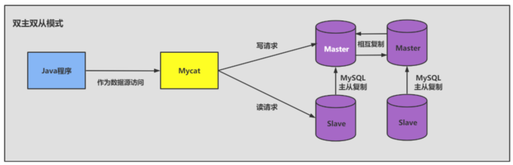
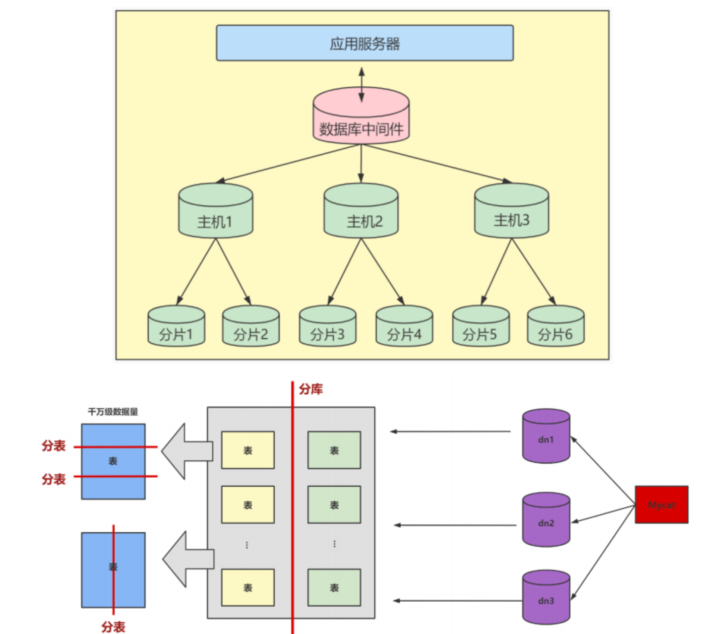
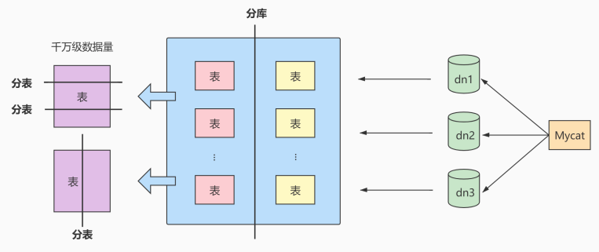

# 一、数据库调优的措施

## 1.1 调优的目标

- 尽可能 节省系统资源 ，以便系统可以提供更大负荷的服务。（吞吐量更大）

- 合理的结构设计和参数调整，以提高用户操作 响应的速度 。（响应速度更快）
- 减少系统的瓶颈，提高MySQL数据库整体的性能。

## 1.2 如何定位调优问题

不过随着用户量的不断增加，以及应用程序复杂度的提升，我们很难用“更快”去定义数据库调优的目标，因为用户在不同时间段访问服务器遇到的瓶颈不同，比如双十一促销的时候会带来大规模的并发访问;还有用户在进行不同业务操作的时候，数据库的事务处理和 SQL查询都会有所不同。因此我们还需要更加精细的定位，去确定调优的目标。

如何确定呢？一般情况下，有如下几种方式： 

- 用户的反馈（主要）

  用户是我们的服务对象，因此他们的反馈是最直接的。虽然他们不会直接提出技术建议，但是有些问题往往是用户第一时间发现的。我们要重视用户的反馈，找到和数据相关的问题。

- 日志分析（主要）

  我们可以通过查看数据库日志和操作系统日志等方式找出异常情况，通过它们来定位遇到的问题。

- 服务器资源使用监控

  通过监控服务器的cPU、内存、Io等使用情况，可以实时了解服务器的性能使用，与历史情况进行对比

- 数据库内部状况监控

  在数据库的监控中，活动会话（Active Session)监控是一个重要的指标。通过它，你可以清楚地了解数据库当前是否处于非常繁忙的状态，是否存在SQL堆积等。

- 其它

  除了活动会话监控以外，我们也可以对 事务 、 锁等待 等进行监控，这些都可以帮助我们对数据库的运行状态有更全面的认识。

## 1.4 调优的维度和步骤 

我们需要调优的对象是整个数据库管理系统，它不仅包括 SQL 查询，还包括数据库的部署配置、架构等。从这个角度来说，我们思考的维度就不仅仅局限在 SQL 优化上了。通过如下的步骤我们进行梳理：

### 第1步：选择适合的 DBMS

​    如果对事务性处理以及安全性要求高的话，可以选择商业的数据库产品。这些数据库在事务处理和查询性能上都比较强，比如采用SQL Server、Oracle，那么单表存储上亿条数据是没有问题的。如果数据表设计得好，即使不采用分库分表的方式，查询效率也不差。

​    除此以外，你也可以采用开源的MysQL进行存储，它有很多存储引擎可以选择，如果进行事务处理的话可以选择lnnoDB，非事务处理可以选择MylSAM。

​    NoSQL_阵营包括键值型数据库、文档型数据库、搜索引擎、列式存储和图形数据库。这些数据库的优缺点和使用场景各有不同，比如列式存储数据库可以大幅度降低系统的I/o，适合于分布式文件系统，但如果数据需要频地增删改，那么列式存储就不太适用了。

​    DBMS的选择关系到了后面的整个设计过程，所以第一步就是要选择适合的DBMS。如果已经确定好了DBMS那么这步可以跳过。


### 第2步：优化表设计

选择了DBMS之后，我们就需要进行表设计了。而数据表的设计方式也直接影响了后续的SQL查询语句。RDBMS中，每个对象都可以定义为一张表，表与表之间的关系代表了对象之间的关系。如果用的是MySQL，我们还可以根据不同表的使用需求，选择不同的存储引擎。除此以外，还有一些优化的原则可以参考:

1. 表结构要尽量遵循三范式的原则。这样可以让数据结构更加清晰规范，减少冗余字段，同时也减少了在更新，插入和删除数据时等异常情况的发生。

2. 如果查询应用比较多，尤其是需要进行多表联查的时候，可以采用反范式进行优化。反范式采用空间换时间的方式，通过增加冗余字段提高查询的效率。
3. 表字段的数据类型选择，关系到了查询效率的高低以及存储空间的大小。一般来说，如果字段可以采用数值类型就不要采用字符类型;字符长度要尽可能设计得短一些。针对字符类型来说，当确定字符长度固定时就可以采用CHAR类型;当长度不固定时，通常采用VARCHAR类型。

数据表的结构设计很基础，也很关键。好的表结构可以在业务发展和用户量增加的情况下依然发挥作用，不好的表结构设计会让数据表变得非常臃肿，查询效率也会降低。

### 第3步：优化逻辑查询

当我们建立好数据表之后，就可以对数据表进行增删改查的操作了。这时我们首先需要考虑的是逻辑查询优化。SQL查询优化，可以分为逻辑查询优化和物理查询优化。逻辑查询优化就是通过改变SQL语句的内容让SQL执行效率更高效，采用的方式是对SQL语句进行等价变换，对查询进行重写。


SQL的查询重写包括了子查询优化、等价谓词重写、视图重写、条件简化、连接消除和嵌套连接消除等。


比如我们在讲解EXISTS子查询和IN子查询的时候，会根据小表驱动大表的原则选择适合的子查询。在WHERE子句中会尽量避免对字段进行函数运算，它们会让字段的索引失效。


举例:查询评论内容开头为abc的内容都有哪些，如果在WHERE子句中使用了函数，语句就会写成下面这样

```sql
SELECT comment_id，comment_text，comment_time FROM product_comment 
WHERE SUBSTRING ( comment_text, 1,3)= 'abc'
```

采用查询重写的方式进行等价替换:

```sql
SELECT comment_id，comment_text,comment_time FROM product_comment 
WHERE comment_text LIKE 'abc%'
```

### 第4步：优化物理查询

物理查询优化是在确定了逻辑查询优化之后，采用物理优化技术（比如索引等），通过计算代价模型对各种可能的访问路径进行估算，从而找到执行方式中代价最小的作为执行计划。在这个部分中，我们需要掌握的重点是对索引的创建和使用。


但索引不是万能的，我们需要根据实际情况来创建索引。那么都有哪些情况需要考虑呢?我们在前面几章中已经进行了细致的剖析。


SQL查询时需要对不同的数据表进行查询，因此在物理查询优化阶段也需要确定这些查询所采用的路径，具体的情况包括:

1. 单表扫描:对于单表扫描来说，我们可以全表扫描所有的数据，也可以局部扫描。
2. 两张表的连接:常用的连接方式包括了嵌套循环连接、HASH 连接和合并连接。
3. 多张表的连接∶多张数据表进行连接的时候，顺序很重要，因为不同的连接路径查询的效率不同，搜索空间也会不同。我们在进行多表连接的时候，搜索空间可能会达到很高的数据量级，巨大的搜索空间显然会占用更多的资源，因此我们需要通过调整连接顺序，将搜索空间调整在一个可接受的范围内。

### 第5步：使用 Redis 或 Memcached 作为缓存

除了可以对 SQL 本身进行优化以外，我们还可以请外援提升查询的效率。


因为数据都是存放到数据库中，我们需要从数据库层中取出数据放到内存中进行业务逻辑的操作，当用户量增大的时候，如果频繁地进行数据查询，会消耗数据库的很多资源。如果我们将常用的数据直接放到内存中，就会大幅提升查询的效率。


键值存储数据库可以帮我们解决这个问题。


常用的键值存储数据库有 Redis 和 Memcached，它们都可以将数据存放到内存中。


从可靠性来说, Redis支持持久化，可以让我们的数据保存在硬盘上，不过这样一来性能消耗也会比较大。而Memcached 仅仅是内存存储，不支持持久化。


从支持的数据类型来说，Redis 比Memcached要多，它不仅支持 key-value类型的数据，还支持List，Set,Hash等数据结构。当我们有持久化需求或者是更高级的数据处理需求的时候，就可以使用Redis。如果是简单的key-value存储，则可以使用Memcached。


通常我们对于查询响应要求高的场景（响应时间短，吞吐量大)，可以考虑内存数据库，毕竟术业有专攻。传统的 RDBMS都是将数据存储在硬盘上，而内存数据库则存放在内存中，查询起来要快得多。不过使用不同的工具，也增加了开发人员的使用成本。


### 第6步：库级优化

库级优化是站在数据库的维度上进行的优化策略，比如控制一个库中的数据表数量。另外，单一的数据库总会遇到各种限制，不如取长补短，利用"外援的方式。通过主从架构优化我们的读写策略，通过对数据库进行垂直或者水平切分，突破单一数据库或数据表的访问限制，提升查询的性能。


**1、读写分离**

如果读和写的业务量都很大，并且它们都在同一个数据库服务器中进行操作，那么数据库的性能就会出现瓶颈，这时为了提升系统的性能，优化用户体验，我们可以采用读写分离的方式降低主数据库的负载，比如用主数据库( master)完成写操作，用从数据库(slave）完成读操作。




**2、数据分片**

对数据库分库分表。当数据量级达到千万级以上时，有时候我们需要把一个数据库切成多份，放到不同的数据库服务器上，减少对单一数据库服务器的访问压力。如果你使用的是MySQL，就可以使用MysQL自带的分区表功能，当然你也可以考虑自己做垂直拆分（分库）、水平拆分（分表）、垂直+水平拆分(分库分表)。




# 二、优化MySQL服务器

优化MysQL服务器主要从两个方面来优化，一方面是对硬件进行优化;另一方面是对MySQL服务的参数进行优化。这部分的内容需要较全面的知识，一般只有专业的数据库管理员才能进行这一类的优化。对于可以定制参数的操作系统，也可以针对MySQL进行操作系统优化。


## 2.1 优化服务器硬件

服务器的硬件性能直接决定着MySQL数据库的性能。硬件的性能瓶颈直接决定MySQL数据库的运行速度和效率。针对性能瓶颈提高硬件配置，可以提高MySQL数据库查询、更新的速度。


(1）配置较大的内存。足够大的内存是提高MysQL数据库性能的方法之一。内存的速度比磁盘I/O快得多，可以通过增加系统的缓冲区容量使数据在内存中停留的时间更长，以减少磁盘I/0。

(2）配置高速磁盘系统，以减少读盘的等待时间，提高响应速度。磁盘的I/O能力，也就是它的寻道能力，目前的SCSI高速旋转的是7200转/分钟，这样的速度，一旦访问的用户量上去，磁盘的压力就会过大，如果是每天的网站pv(page view)在150w，这样的一般的配置就无法满足这样的需求了。现在SSD盛行，在SSD上随机访问和顺序访问性能几乎差不多，使用SSD可以减少随机Io带来的性能损耗。

(3)合理分布磁盘I/0，把磁盘I/0分散在多个设备上，以减少资源竞争，提高并行操作能力。

(4）配置多处理器，MySQL是多线程的数据库，多处理器可同时执行多个线程。

## 2.2 优化MySQL的参数

通过优化MySQL的参数可以提高资源利用率，从而达到提高MySQL服务器性能的目的。

MySQL服务的配置参数都在my.cnf或者my.ini文件的[mysqld]组中。配置完参数以后，需要重新启动MySQL服务才会生效。

下面对几个对性能影响比较大的参数进行详细介绍。

- innodb_buffer_pool_size ：这个参数是Mysql数据库最重要的参数之一，表示InnoDB类型的 表 和索引的最大缓存 。它不仅仅缓存 索引数据 ，还会缓存 表的数据 。这个值越大，查询的速度就会越快。但是这个值太大会影响操作系统的性能。
- key_buffer_size ：表示 索引缓冲区的大小 。索引缓冲区是所有的 线程共享 。增加索引缓冲区可以得到更好处理的索引（对所有读和多重写）。当然，这个值不是越大越好，它的大小取决于内存的大小。如果这个值太大，就会导致操作系统频繁换页，也会降低系统性能。对于内存在 4GB 左右的服务器该参数可设置为 256M 或 384M 。
- table_cache ：表示 同时打开的表的个数 。这个值越大，能够同时打开的表的个数越多。物理内存越大，设置就越大。默认为2402，调到512-1024最佳。这个值不是越大越好，因为同时打开的表太多会影响操作系统的性能。
- query_cache_size ：表示 查询缓冲区的大小 。可以通过在MySQL控制台观察，如果Qcache_lowmem_prunes的值非常大，则表明经常出现缓冲不够的情况，就要增加Query_cache_size的值；如果Qcache_hits的值非常大，则表明查询缓冲使用非常频繁，如果该值较小反而会影响效率，那么可以考虑不用查询缓存；Qcache_free_blocks，如果该值非常大，则表明缓冲区中碎片很多。MySQL8.0之后失效。该参数需要和query_cache_type配合使用。
- query_cache_type 的值是0时，所有的查询都不使用查询缓存区。但是query_cache_type=0并不会导致MySQL释放query_cache_size所配置的缓存区内存。当query_cache_type=1时，所有的查询都将使用查询缓存区，除非在查询语句中指定SQL_NO_CACHE ，如SELECT SQL_NO_CACHE * FROM tbl_name。 当query_cache_type=2时，只有在查询语句中使用 SQL_CACHE 关键字，查询才会使用查询缓存区。使用查询缓存区可以提高查询的速度，这种方式只适用于修改操作少且经常执行相同的查询操作的情况。
- sort_buffer_size ：表示每个 需要进行排序的线程分配的缓冲区的大小 。增加这个参数的值可以提高 ORDER BY 或 GROUP BY 操作的速度。默认数值是2 097 144字节（约2MB）。对于内存在4GB左右的服务器推荐设置为6-8M，如果有100个连接，那么实际分配的总共排序缓冲区大小为100 × 6 ＝ 600MB。
- join_buffer_size = 8M ：表示 联合查询操作所能使用的缓冲区大小 ，和sort_buffer_size一样，该参数对应的分配内存也是每个连接独享。
- read_buffer_size ：表示 每个线程连续扫描时为扫描的每个表分配的缓冲区的大小（字节） 。当线程从表中连续读取记录时需要用到这个缓冲区。SET SESSION read_buffer_size=n可以临时设置该参数的值。默认为64K，可以设置为4M。
- innodb_flush_log_at_trx_commit ：表示 何时将缓冲区的数据写入日志文件 ，并且将日志文件写入磁盘中。该参数对于innoDB引擎非常重要。该参数有3个值，分别为0、1和2。该参数的默认值为1。值为 0 时，表示 每秒1次 的频率将数据写入日志文件并将日志文件写入磁盘。每个事务的commit并不会触发前面的任何操作。该模式速度最快，但不太安全，mysqld进程的崩溃会导致上一秒钟所有事务数据的丢失。值为 1 时，表示 每次提交事务时 将数据写入日志文件并将日志文件写入磁盘进行同步。该模式是最安全的，但也是最慢的一种方式。因为每次事务提交或事务外的指令都需要把日志写入（flush）硬盘。值为 2 时，表示 每次提交事务时 将数据写入日志文件， 每隔1秒 将日志文件写入磁盘。该模式速度较快，也比0安全，只有在操作系统崩溃或者系统断电的情况下，上一秒钟所有事务数据才可能丢失。
- innodb_log_buffer_size ：这是 InnoDB 存储引擎的 事务日志所使用的缓冲区 。为了提高性能，也是先将信息写入 Innodb Log Buffer 中，当满足 innodb_flush_log_trx_commit 参数所设置的相应条件（或者日志缓冲区写满）之后，才会将日志写到文件（或者同步到磁盘）中。
- max_connections ：表示 允许连接到MySQL数据库的最大数量 ，默认值是 151 。如果状态变量connection_errors_max_connections 不为零，并且一直增长，则说明不断有连接请求因数据库连接数已达到允许最大值而失败，这是可以考虑增大max_connections 的值。在Linux 平台下，性能好的服务器，支持 500-1000 个连接不是难事，需要根据服务器性能进行评估设定。这个连接数 不是越大 越好 ，因为这些连接会浪费内存的资源。过多的连接可能会导致MySQL服务器僵死。
- back_log ：用于 控制MySQL监听TCP端口时设置的积压请求栈大小 。如果MySql的连接数达到max_connections时，新来的请求将会被存在堆栈中，以等待某一连接释放资源，该堆栈的数量即back_log，如果等待连接的数量超过back_log，将不被授予连接资源，将会报错。5.6.6 版本之前默认值为 50 ， 之后的版本默认为 50 + （max_connections / 5）， 对于Linux系统推荐设置为小于512的整数，但最大不超过900。如果需要数据库在较短的时间内处理大量连接请求， 可以考虑适当增大back_log 的值。
- thread_cache_size ： 线程池缓存线程数量的大小 ，当客户端断开连接后将当前线程缓存起来，当在接到新的连接请求时快速响应无需创建新的线程 。这尤其对那些使用短连接的应用程序来说可以极大的提高创建连接的效率。那么为了提高性能可以增大该参数的值。默认为60，可以设置为120。

  可以通过如下几个MySQL状态值来适当调整线程池的大小：
  ```sql
  mysql> show global status like 'Thread%';
  ```
  当 Threads_cached 越来越少，但 Threads_connected 始终不降，且 Threads_created 持续升高，可适当增加 thread_cache_size 的大小。

- wait_timeout ：指定 一个请求的最大连接时间 ，对于4GB左右内存的服务器可以设置为5-10。

- interactive_timeout ：表示服务器在关闭连接前等待行动的秒数。


这里给出一份my.cnf的参考配置：
```bash
[mysqld]
port = 3306
serverid = 1
socket = /tmp/mysql.sock
skip-locking #避免MySQL的外部锁定，减少出错几率增强稳定性。
skip-name-resolve #禁止MySQL对外部连接进行DNS解析，使用这一选项可以消除MySQL进行DNS解析的时间。但需要注意，如果开启该选项，则所有远程主机连接授权都要使用IP地址方式，否则MySQL将无法正常处理连接请求！
back_log = 384
key_buffer_size = 256M
max_allowed_packet = 4M
thread_stack = 256K
table_cache = 128K
sort_buffer_size = 6M
read_buffer_size = 4M
read_rnd_buffer_size=16M
join_buffer_size = 8M
myisam_sort_buffer_size = 64M
table_cache = 512 thread_cache_size = 64
query_cache_size = 64M
tmp_table_size = 256M
max_connections = 768
max_connect_errors = 10000000
wait_timeout = 10
thread_concurrency = 8 #该参数取值为服务器逻辑CPU数量*2，在本例中，服务器有2颗物理CPU，而每颗物理CPU又支持H.T超线程，所以实际取值为4*2=8
skip-networking #开启该选项可以彻底关闭MySQL的TCP/IP连接方式，如果WEB服务器是以远程连接的方式访问MySQL数据库服务器则不要开启该选项！否则将无法正常连接！
table_cache=1024
innodb_additional_mem_pool_size=4M #默认为2M
innodb_flush_log_at_trx_commit=1
innodb_log_buffer_size=2M #默认为1M
innodb_thread_concurrency=8 #你的服务器CPU有几个就设置为几。建议用默认一般为8
tmp_table_size=64M #默认为16M，调到64-256最挂
thread_cache_size=120
query_cache_size=32M
```


很多情况还需要具体情况具体分析！

举例:

下面是一个电商平台，类似京东或天猫这样的平台。商家购买服务，入住平台，开通之后，商家可以在系统中上架各种商品，客户通过手机App、微信小程序等渠道购买商品，商家接到订单以后安排快递送货。

刚刚上线的时候，系统运行状态良好。但是，随着入住的商家不断增多，使用系统的用户量越来越多，每天的订单数据达到了5万条以上。这个时候，系统开始出现问题，CPU使用率不断飙升。终于，双十一或者618活动高峰的时候，CPU使用率达到99%，这实际上就意味着，系统的计算资源已经耗尽，再也无法处理任何新的订单了。换句话说，系统已经崩溃了。

这个时候，我们想到了对系统参数进行调整，因为参数的值决定了资源配置的方式和投放的程度。为了解决这个问题，一共调整3个系统参数，分别是

- lnnoDB_flush_log_at_trx_commit
- lnnoDB_buffer_pool_size
- InnoDB_buffer_pool_instances

下面我们就说一说调整这三个参数的原因是什么。

**(1)调整系统参数InnoDB_flush_log_at_trx_commit**

这个参数适用于InnoDB存储引擎，电商平台系统中的表用的存储引擎都是InnoDB。默认的值是1，意思是每次提交事务的时候，都把数据写入日志，并把日志写入磁盘。这样做的好处是数据安全性最佳，不足之处在于每次提交事务，都要进行磁盘写入的操作。在大并发的场景下，过于频繁的磁盘读写会导致CPU资源浪费，系统效率变低。

这个参数的值还有2个可能的选项，分别是0和2。我们把这个参数的值改成了2。这样就不用每次提交事务的时候都启动磁盘读写了，在大并发的场景下，可以改善系统效率，降低CPU使用率。即便出现故障，损失的数据也比较小。

**(2）调整系统参数InnoDB_buffer_pool_size**

这个参数的意思是，InnoDB存储引擎使用缓存来存储索引和数据。这个值越大，可以加载到缓存区的索引和数据量就越多，需要的磁盘读写就越少。

因为我们的MySQL服务器是数据库专属服务器，只用来运行MySQL数据库服务，没有其他应用了，而我们的计算机是64位机器，内存也有128G。于是我们把这个参数的值调整为64G。这样一来，磁盘读写次数可以大幅降低，我们就可以充分利用内存，释放出一些CPU的资源。

**(3）调整系统参数InnoDB_buffer_pool_instances**

这个参数可以将InnoDB的缓存区分成几个部分，这样可以提高系统的并行处理能力，因为可以允许多个进程同时处理不同部分的缓存区。

我们把InnoDB_buffer_pool_instances的值修改为64,，意思就是把 InnoDB的缓存区分成64个分区，这样就可以同时有多个进程进行数据操作，CPU的效率就高多了。修改好了系统参数的值，要重启MySQL数据库服务器。

> 总结一下就是遇到CPU资源不足的问题，可以从下面2个思路去解决。
>
> 1. 疏通拥堵路段，消除瓶颈，让等待的时间更短;
> 2. 开拓新的通道，增加并行处理能力。

# 三、优化数据库结构

一个好的数据库设计方案对于数据库的性能常常会起到事半功倍的效果。合理的数据库结构不仅可以使数据库占用更小的磁盘空间，而且能够使查询速度更快。数据库结构的设计需要考虑数据冗余、查询和更新的速度、字段的数据类型是否合理等多方面的内容。

## 3.1 拆分表：冷热数据分离

拆分表的思路是，把1个包含很多字段的表拆分成2个或者多个相对较小的表。这样做的原因是，这些表中某些字段的操作频率很高（热数据），经常要进行查询或者更新操作，而另外一些字段的使用频率却很低（冷数据），冷热数据分离，可以减小表的宽度。如果放在一个表里面，每次查询都要读取大记录，会消耗较多的资源。

MySQL限制每个表最多存储4096列，并且每一行数据的大小不能超过65535字节。表越宽，把表装载进内存缓冲池时所占用的内存也就越大，也会消耗更多的lO。冷热数据分离的目的是:①减少磁盘IO，保证热数据的内存缓存命中率。②更有效的利用缓存，避免读入无用的冷数据。

举例1： 会员members表 存储会员登录认证信息，该表中有很多字段，如id、姓名、密码、地址、电话、个人描述字段。其中地址、电话、个人描述等字段并不常用，可以将这些不常用的字段分解出另一个表。将这个表取名叫members_detail，表中有member_id、address、telephone、description等字段。这样就把会员表分成了两个表，分别为 members表 和 members_detail表 。

创建这两个表的SQL语句如下：

```sql
CREATE TABLE members ( 
	id int(11) NOT NULL AUTO_INCREMENT, 
	username varchar(50) DEFAULT NULL, 
	password varchar(50) DEFAULT NULL, 
	last_login_time datetime DEFAULT NULL, 
	last_login_ip varchar(100) DEFAULT NULL, 
	PRIMARY KEY(Id) 
);


CREATE TABLE members_detail ( 
	Member_id int(11) NOT NULL DEFAULT 0, 
	address varchar(255) DEFAULT NULL, 
	telephone varchar(255) DEFAULT NULL, 
	description text 
);
```

如果需要查询会员的基本信息或详细信息，那么可以用会员的id来查询。如果需要将会员的基本信息和详细信息同时显示，那么可以将members表和members_detail表进行联合查询，查询语句如下：

```sql
SELECT * FROM members LEFT JOIN members_detail on members.id = members_detail.member_id;
```

通过这种分解可以提高表的查询效率。对于字段很多且有些字段使用不频繁的表，可以通过这种分解的方式来优化数据库的性能。

## 3.2 增加中间表

对于需要经常联合查询的表，可以建立中间表以提高查询效率。通过建立中间表，把需要经常联合查询的数据插入中间表中，然后将原来的联合查询改为对中间表的查询，以此来提高查询效率。

首先，分析经常联合查询表中的字段;然后，使用这些字段建立一个中间表，并将原来联合查询的表的数据插入中间表中;最后，使用中间表来进行查询。

举例1： 学生信息表 和 班级表 的SQL语句如下：

```sql
CREATE TABLE `class` ( 
	`id` INT(11) NOT NULL AUTO_INCREMENT, 
	`className` VARCHAR(30) DEFAULT NULL, 
	`address` VARCHAR(40) DEFAULT NULL, 
	`monitor` INT NULL , 
	PRIMARY KEY (`id`) 
) ENGINE=INNODB AUTO_INCREMENT=1 DEFAULT CHARSET=utf8; 

CREATE TABLE `student` ( 
	`id` INT(11) NOT NULL AUTO_INCREMENT, 
	`stuno` INT NOT NULL ,
	`name` VARCHAR(20) DEFAULT NULL, 
	`age` INT(3) DEFAULT NULL, 
	`classId` INT(11) DEFAULT NULL, 
	PRIMARY KEY (`id`) 
) ENGINE=INNODB AUTO_INCREMENT=1 DEFAULT CHARSET=utf8;
```

现在有一个模块需要经常查询带有学生名称（name）、学生所在班级名称（className）、学生班级班长（monitor）的学生信息。根据这种情况可以创建一个 temp_student 表。temp_student表中存储学生名称（stu_name）、学生所在班级名称（className）和学生班级班长（monitor）信息。创建表的语句如下：

```sql
CREATE TABLE `temp_student` ( 
	`id` INT(11) NOT NULL AUTO_INCREMENT, 
	`stu_name` INT NOT NULL , 
	`className` VARCHAR(20) DEFAULT NULL, 
	`monitor` INT(3) DEFAULT NULL, 
	PRIMARY KEY (`id`) 
) ENGINE=INNODB AUTO_INCREMENT=1 DEFAULT CHARSET=utf8;
```

接下来，从学生信息表和班级表中查询相关信息存储到临时表中：

```sql
insert into temp_student(stu_name,className,monitor) 
	select s.name,c.className,c.monitor
	from student as s,class as c 
	where s.classId = c.id
```

以后，可以直接从temp_student表中查询学生名称、班级名称和班级班长，而不用每次都进行联合查询。这样可以提高数据库的查询速度。

## 3.3 增加冗余字段

设计数据库表时应尽量遵循范式理论的规约，尽可能减少冗余字段，让数据库设计看起来精致、优雅。但是，合理地加入冗余字段可以提高查询速度。

表的规范化程度越高，表与表之间的关系就越多，需要连接查询的情况也就越多。尤其在数据量大，而且需要频繁进行连接的时候，为了提升效率，我们也可以考虑增加冗余字段来减少连接。这部分内容在《第11章_数据库的设计规范》章节中 反范式化小节 中具体展开讲解了。这里省略。


## 3.4 优化数据类型

改进表的设计时，可以考虑优化字段的数据类型。这个问题在大家刚从事开发时基本不算是问题。但是，随着你的经验越来越丰富，参与的项目越来越大，数据量也越来越多的时候，你就不能只从系统稳定性的角度来思考问题了，还要考虑到系统整体的稳定性和效率。此时，优先选择符合存储需要的最小的数据类型。

列的字段越大，建立索引时所需要的空间也就越大，这样一页中所能存储的索引节点的数量也就越少，在遍历时所需要的IO次数也就越多，索引的性能也就越差。

### 情况1：对整数类型数据进行优化。

遇到整数类型的字段可以用 INT 型 。这样做的理由是，INT 型数据有足够大的取值范围，不用担心数据超出取值范围的问题。刚开始做项目的时候，首先要保证系统的稳定性，这样设计字段类型是可以的。但在数据量很大的时候，数据类型的定义，在很大程度上会影响到系统整体的执行效率。

对于 非负型 的数据（如自增ID、整型IP）来说，要优先使用无符号整型 UNSIGNED 来存储。因为无符号相对于有符号，同样的字节数，存储的数值范围更大。如tinyint有符号为-128-127，无符号为0-255，多出一倍的存储空间。

### 情况2：既可以使用文本类型也可以使用整数类型的字段，要选择使用整数类型。

跟文本类型数据相比，大整数往往占用 更少的存储空间 ，因此，在存取和比对的时候，可以占用更少的内存空间。所以，在二者皆可用的情况下，尽量使用整数类型，这样可以提高查询的效率。如：将IP地址转换成整型数据。

### 情况3：避免使用TEXT、BLOB数据类型

MySQL内存临时表不支持TEXT、BLOB这样的大数据类型，如果查询中包含这样的数据，在排序等操作时，就不能使用内存临时表，必须使用磁盘临时表进行。并且对于这种数据，MySQL还是要进行二次查询，会使SQL性能变得很差，但是不是说一定不能使用这样的数据类型。

如果一定要使用，建议把BLOB或是TEXT列分离到单独的扩展表中，查询时一定不要使用select *，而只需要取出必要的列，不需要TEXT列的数据时不要对该列进行查询。

### 情况4：避免使用ENUM类型

修改ENUM值需要使用ALTER语句。
ENUM类型的ORDER BY操作效率低，需要额外操作。使用TINYINT来代替ENUM类型。

### 情况5：使用TIMESTAMP存储时间

TIMESTAMP存储的时间范围1970-01-01 00:00:01~2038-01-19-03:14:07。TIMESTAMP使用4字节，DATETIME使用8个字节，同时TIMESTAMP具有自动赋值以及自动更新的特性。

### 情况6：用DECIMAL代替FLOAT和DOUBLE存储精确浮点数

1)非精准浮点: float,double

2)精准浮点: decimal

Decimal类型为精准浮点数，在计算时不会丢失精度，尤其是财务相关的金融类数据。占用空间由定义的宽度决定，每4个字节可以存储9位数字，并且小数点要占用一个字节。可用于存储比bigint更大的整型数据。

总之，遇到数据量大的项目时，一定要在充分了解业务需求的前提下，合理优化数据类型，这样才能充
分发挥资源的效率，使系统达到最优。

## 3.5 优化插入记录的速度

插入记录时，影响插入速度的主要是索引、唯一性校验、一次插入记录条数等。根据这些情况可以分别进行优化。这里我们分为MylSAM引擎和InnoDB存储引擎来讲。

### 1. MyISAM引擎的表：

① 禁用索引

对于非空表，插入记录时，MySQL会根据表的索引对插入的记录建立索引。如果插入大量数据，建立索引就会降低插入记录的速度。为了解决这种情况，可以在插入记录之前禁用索引，数据插入完毕后再开启索引。禁用索引的语句如下:

```sql
ALTER TABLE table_name DISABLE KEYS;
```

重新开启索引的语句如下:

```sql
ALTER TABLE table_name ENABLE KEYS;
```

若对于空表批量导入数据，则不需要进行此操作，因为MylSAM引擎的表是在导入数据之后才建立索引的。

② 禁用唯一性检查

插入数据时，MySQL会对插入的记录进行唯一性校验。这种唯一性校验会降低插入记录的速度。为了降低这种情况对查询速度的影响，可以在插入记录之前禁用唯一性检查，等到记录插入完毕后再开启。

禁用唯一性检查的语句如下:

```sql
SET UNIQUE_CHECKS=0;
```

开启唯一性检查的语句如下:

```sql
SET UNIQUE_CHECKS=1;
```

③ 使用批量插入

插入多条记录时，可以使用一条INSERT语句插入一条记录，也可以使用一条INSERT语句插入多条记录。插入一条记录的INSERT语句情形如下:

```sql
insert into student values(1,'zhangsan',18,1); 

insert into student values(2,'lisi',17,1); 

insert into student values(3,'wangwu',17,1); 

insert into student values(4,'zhaoliu',19,1);
```

使用一条INSERT语句插入多条记录的情形如下：

```sql
insert into student values (1,'zhangsan',18,1), (2,'lisi',17,1), (3,'wangwu',17,1), (4,'zhaoliu',19,1);
```

第2种情形的插入速度要比第1种情形快。

④ 使用LOAD DATA INFILE 批量导入

当需要批量导入数据时，如果能用LOAD DATAINFILE语句，就尽量使用。因为LOAD DATA INFILE语句导入数据的速度比INSERT语句快。

### 2. InnoDB引擎的表：

① 禁用唯一性检查

插入数据之前执行set unique_checks=0来禁止对唯一索引的检查，数据导入完成之后再运行setunique_checks=1。这个和MyISAM引擎的使用方法一样。

② 禁用外键检查

插入数据之前执行禁止对外键的检查，数据插入完成之后再恢复对外键的检查。禁用外键检查的语句如下:

```sql
SET foreign_key_checks=0;
```

恢复对外键的检查语句如下:

```sql
SET foreign_key_checks=1;
```

③ 禁止自动提交

插入数据之前禁止事务的自动提交，数据导入完成之后，执行恢复自动提交操作。禁止自动提交的语句如下:

```sql
set autocommit=0;
```

恢复自动提交的语句如下:

```sql
set autocommit=1;
```

## 3.6 使用非空约束

在设计字段的时候，如果业务允许，建议尽量使用非空约束，这样的好处是：

1. 进行比较和计算时，省去要对NULL值的字段判断是否为空的开销，提高存储效率。
2. 非空字段也容易创建索引。因为索引NULL列需要额外的空间来保存，所以要占用更多的空间。使用非空约束，就可以节省存储空间(每个字段1个bit)。

## 3.7 分析表、检查表与优化表

MysQL提供了分析表、检查表和优化表的语句。分析表主要是分析关键字的分布，检查表主要是检查表是否存在错误，优化表主要是消除删除或者更新造成的空间浪费。

1. 分析表

MySQL中提供了ANALYZE TABLE语句分析表，ANALYZE TABLE语句的基本语法如下：

```sql
ANALYZE [LOCAL | NO_WRITE_TO_BINLOG] TABLE tbl_name[,tbl_name]…
```

默认的，MySQL服务会将 ANALYZE TABLE语句写到binlog中，以便在主从架构中，从服务能够同步数据。可以添加参数LOCAL 或者 NO_WRITE_TO_BINLOG取消将语句写到binlog中。

使用 ANALYZE TABLE 分析表的过程中，数据库系统会自动对表加一个 只读锁 。在分析期间，只能读取表中的记录，不能更新和插入记录。ANALYZE TABLE语句能够分析InnoDB和MyISAM类型的表，但是不能作用于视图。

ANALYZE TABLE分析后的统计结果会反应到 cardinality 的值，该值统计了表中某一键所在的列不重复的值的个数。该值越接近表中的总行数，则在表连接查询或者索引查询时，就越优先被优化器选择使用。也就是索引列的cardinality的值与表中数据的总条数差距越大，即使查询的时候使用了该索引作为查询条件，存储引擎实际查询的时候使用的概率就越小。下面通过例子来验证下。cardinality可以通过
SHOW INDEX FROM 表名查看。

2. 检查表

MySQL中可以使用 CHECK TABLE 语句来检查表。CHECK TABLE语句能够检查InnoDB和MyISAM类型的表是否存在错误。CHECK TABLE语句在执行过程中也会给表加上 只读锁 。

对于MyISAM类型的表，CHECK TABLE语句还会更新关键字统计数据。而且，CHECK TABLE也可以检查视图是否有错误，比如在视图定义中被引用的表已不存在。该语句的基本语法如下：

```sql
CHECK TABLE tbl_name [, tbl_name] ... [option] ... 
option = {QUICK | FAST | MEDIUM | EXTENDED | CHANGED}
```

其中，tbl_name是表名；option参数有5个取值，分别是QUICK、FAST、MEDIUM、EXTENDED和 CHANGED。各个选项的意义分别是：

- QUICK ：不扫描行，不检查错误的连接。
- FAST ：只检查没有被正确关闭的表。
- CHANGED ：只检查上次检查后被更改的表和没有被正确关闭的表。
- MEDIUM ：扫描行，以验证被删除的连接是有效的。也可以计算各行的关键字校验和，并使用计算
  出的校验和验证这一点。
- EXTENDED ：对每行的所有关键字进行一个全面的关键字查找。这可以确保表是100%一致的，但
  是花的时间较长。

option只对MyISAM类型的表有效，对InnoDB类型的表无效。比如：

```sql
mysql> check table student;
```

该语句对于检查的表可能会产生多行信息。最后一行有一个状态的 Msg_type 值，Msg_text 通常为 OK。如果得到的不是 OK，通常要对其进行修复；是 OK 说明表已经是最新的了。表已经是最新的，意味着存储引擎对这张表不必进行检查。

3. 优化表

方式1：OPTIMIZE TABLE

MySQL中使用 OPTIMIZE TABLE 语句来优化表。但是，OPTILMIZE TABLE语句只能优化表中的VARCHAR 、 BLOB 或 TEXT 类型的字段。一个表使用了这些字段的数据类型，若已经 删除 了表的一大部分数据，或者已经对含有可变长度行的表（含有VARCHAR、BLOB或TEXT列的表）进行了很多 更新 ，则应使用OPTIMIZE TABLE来重新利用未使用的空间，并整理数据文件的 碎片 。 OPTIMIZE TABLE 语句对InnoDB和MyISAM类型的表都有效。该语句在执行过程中也会给表加上 只读锁 。 OPTILMIZE TABLE语句的基本语法如下：

```sql
OPTIMIZE [LOCAL | NO_WRITE_TO_BINLOG] TABLE tbl_name [, tbl_name] ...
```

LOCAL | NO_WRITE_TO_BINLOG关键字的意义和分析表相同，都是指定不写入二进制日志。

```sql
mysql> optimize table student;
```

执行完毕，Msg_text显示

> numysql.SYS_APP_USER’, ‘optimize’, ‘note’, ‘Table does not support optimize, doing recreate + analyze instead

原因是我服务器上的MySQL是InnoDB存储引擎。

到底优化了没有呢？看官网！

https://dev.mysql.com/doc/refman/8.0/en/optimize-table.html

在MyISAM中，是先分析这张表，然后会整理相关的MySQL datafile，之后回收未使用的空间；在InnoDB中，回收空间是简单通过Alter table进行整理空间。在优化期间，MySQL会创建一个临时表，优化完成之后会删除原始表，然后会将临时表rename成为原始表。

> 说明： 在多数的设置中，根本不需要运行OPTIMIZE TABLE。即使对可变长度的行进行了大量的更新，也不需要经常运行， 每周一次 或 每月一次 即可，并且只需要对 特定的表 运行。

## 3.8 小结

上述这些方法都是有利有弊的。比如：

修改数据类型，节省存储空间的同时，你要考虑到数据不能超过取值范围；增加冗余字段的时候，不要忘了确保数据一致性；

把大表拆分，也意味着你的查询会增加新的连接，从而增加额外的开销和运维的成本。因此，你一定要结合实际的业务需求进行权衡。

# 四、大表优化

当MySQL单表记录数过大时，数据库的CRUD性能会明显下降，一些常见的优化措施如下:

## 4.1 限定查询的范围

禁止不带任何限制数据范围条件的查询语句。比如：我们当用户在查询订单历史的时候，我们可以控制在一个月的范围内；

## 4.2 读/写分离

经典的数据库拆分方案，主库负责写，从库负责读。

- 一主一从模式


- 双主双从模式

  

## 4.3 垂直拆分

当数据量级达到 千万级 以上时，有时候我们需要把一个数据库切成多份，放到不同的数据库服务器上，减少对单一数据库服务器的访问压力。


- 如果数据库中的数据表过多，可以采用垂直分库的方式，将关联的数据表部署在同一个数据库上。
- 如果数据表中的列过多，可以采用垂直分表的方式，将一张数据表分拆成多张数据表，把经常一起使用的列放到同一张表里。


垂直拆分的优点： 可以使得列数据变小，在查询时减少读取的Block数，减少I/O次数。此外，垂直分区可以简化表的结构，易于维护。

垂直拆分的缺点： 主键会出现冗余，需要管理冗余列，并会引起 JOIN 操作。此外，垂直拆分会让事务变得更加复杂。


## 4.4 水平拆分

- 尽量控制单表数据量的大小，建议控制在1000万以内。10000万并不是 MySQL数据库的限制，过大会造成修改表结构、备份、恢复都会有很大的问题。此时可以用 历史数据归档(应用于日志数据)，水平分表(应用于业务数据)等来控制数据量大小。
- 这里我们主要考虑业务数据的水平分表策略。将大的数据表按照某个属性维度分拆成不同的小表，没张小表保持相同的表结构。比如你可以按照年份来划分，把不同年份的数据放到不同的数据表中。2017年、2018年和2019年的数据就可以分别放到三张数据表中。
- 水平分表仅仅是解决了单一表数据量过大的问题，但是由于表的数据还是在同一台机器上，其实对于提升MySQL并发能力没有什么意义，所以水平拆分最好分库，从而达到分布式的目的。



水平拆分能够支持非常大的数据量存储，应用端改造也少，但分片事务难以解决，跨节点Join性能较差，逻辑复杂。《Java工程师修炼之道》的作者推荐·尽量不要对数据进行分片，因为拆分会带来逻辑、部署、运维的各种复杂度，一般的数据表在优化得当的情况下支撑千万以下的数据量是没有太大问题的。如果实在要分片，尽量选择客户端分片架构，这样可以减少一次和中间件的网络I/O。

下面补充一下数据库分片的两种常见方案：

- 客户端代理： 分片逻辑在应用端，封装在jar包中，通过修改或者封装JDBC层来实现。 当当网的Sharding-JDBC 、阿里的TDDL是两种比较常用的实现。
- 中间件代理： 在应用和数据中间加了一个代理层。分片逻辑统一维护在中间件服务中。我们现在谈的 Mycat 、360的Atlas、网易的DDB等等都是这种架构的实现。


# 五、其它调优策略

## 5.1 服务器语句超时处理

在MySQL 8.0中可以设置 服务器语句超时的限制 ，单位可以达到 毫秒级别 。当中断的执行语句超过设置的毫秒数后，服务器将终止查询影响不大的事务或连接，然后将错误报给客户端。

设置服务器语句超时的限制，可以通过设置系统变量 MAX_EXECUTION_TIME 来实现。默认情况下，MAX_EXECUTION_TIME的值为0，代表没有时间限制。 例如：

```sql
SET GLOBAL MAX_EXECUTION_TIME=2000;
SET SESSION MAX_EXECUTION_TIME=2000; #指定该会话中SELECT语句的超时时间
```

## 5.2 创建全局通用表空间

MySQL 8.0使用` CREATE TABLESPACE`语句来创建一个全局通用表空间。全局表空间可以被所有的数据库的表共享，而且相比于独享表空间，使用手动创建共享表空间可以节约元数据方面的内存。可以在创建表的时候，指定属于哪个表空间，也可以对已有表进行表空间修改等。

下面创建名为kino的共享表空间，SQL语句如下:

```sql
mysql> CREATE TABLESPACE atguigu1 ADD datafile 'kino.ibd' file_block_size=16k;
```

指定表空间，SQL语句如下:

```sql
mysql> CREATE TABLE test(id int, name varchar(10)
) engine=innodb default charset utf8mb4 tablespace kino ;
```

也可以通过 alter table 语句指定表空间

```sql
mysql> alter table test tablespace kino;
```

如何删除创建的共享表空间？因为是共享表空间，所以不能直接通过 drop table tbname 删除，这样操作并不能回收空间。当确定共享表空间的数据都没有用，并且依赖该表空间的表均已被删除时，可以通过 drop tablespace 删除共享表空间来释放空间，如果依赖该共享表空间的表存在，就会删除失败，如下所示

```sql
mysql> drop tablespace kino;
Tablespace `kino` is not empty.
```

所以应该首先删除依赖该表空间的数据表

```sql
mysql> drop table test; 
```

最后即可删除表空间

```sql
mysql> drop tablespace kino; 
```

## 5.3 MySQL 8.0新特性：隐藏索引对调优的帮助

不可见索引的特性对于性能调试非常有用。在MySQL 8.0中，索引可以被“隐藏"和“显示"。当一个索引被隐藏时，它不会被查询优化器所使用。也就是说，管理员可以隐藏一个索引，然后观察对数据库的影响。如果数据库性能有所下降，就说明这个索引是有用的，于是将其"恢复显示"即可;如果数据库性能看不出变化，就说明这个索引是多余的，可以删掉了。

需要注意的是当索引被隐藏时，它的内容仍然是和正常索引一样实时更新的。如果一个索引需要长期被隐藏那么可以将其删除，因为索引的存在会影响插入、更新和删除的性能。

数据表中的主键不能被设置为invisible。


