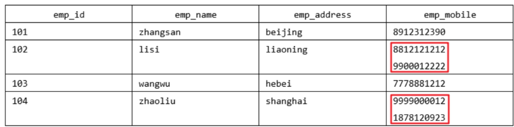
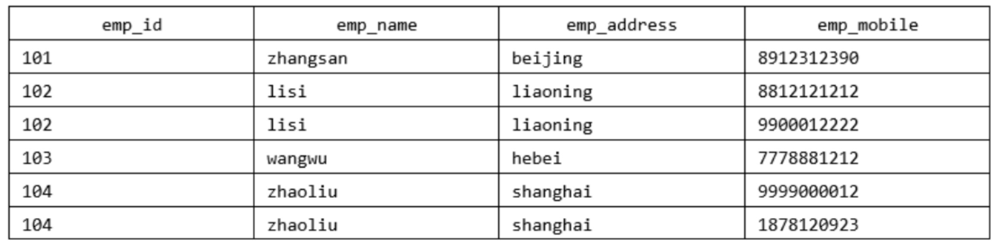
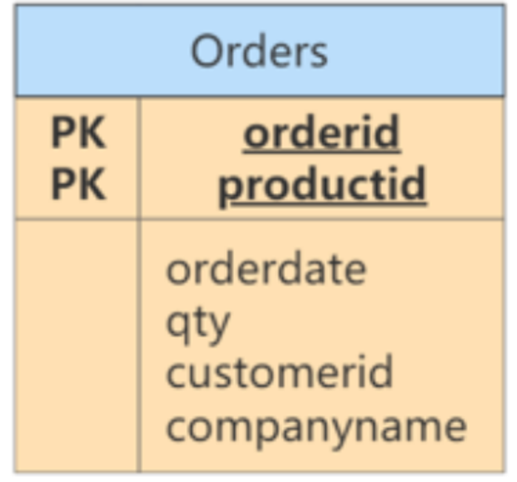
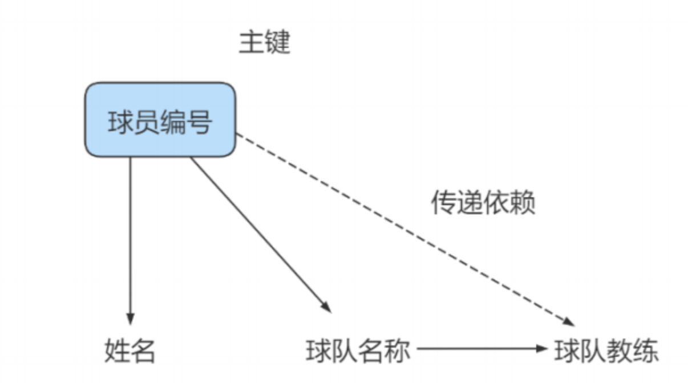

# 一、为什么需要数据库设计

我们在设计数据表的时候，要考虑很多问题。比如:

- 用户都需要什么数据?需要在数据表中保存哪些数据?
- 如何保证数据表中数据的正确性，当插入、删除、更新的时候该进行怎样的约束检查?
- 如何降低数据表的数据冗余度，保证数据表不会因为用户量的增长而迅速扩张?
- 如何让负责数据库维护的人员更方便地使用数据库?
- 使用数据库的应用场景也各不相同，可以说针对不同的情况，设计出来的数据表可能千差万别。

 

**现实情况中，面临的场景:**

当数据库运行了一段时间之后，我们才发现数据表设计的有问题。重新调整数据表的结构，就需要做数据迁移，还有可能影响程序的业务逻辑，以及网站正常的访问。

**如果是糟糕的数据库设计可能会造成以下问题:**

- 数据冗余、信息重复，存储空间浪费。
- 数据更新、插入、删除的异常
- 无法正确表示信息
- 丢失有效信息程序性能差

**良好的数据库设计则有以下优点:**

- 节省数据的存储空间 
- 能够保证数据的完整性
- 方便进行数据库应用系统的开发

总之，开始设置数据库的时候，我们就需要重视数据表的设计。为了建立冗余较小、结构合理的数据库，设计数据库时必须遵循一定的规则。

# 二、范 式

## 2.1 范式简介

在关系型数据库中，关于数据表设计的基本原则、规则就称为范式。可以理解为，一张数据表的设计结构需要满足的某种设计标准的 级别 。要想设计一个结构合理的关系型数据库，必须满足一定的范式。

范式的英文名称是Normal Form，简称 NF。它是英国人E.F.Codd在上个世纪70年代提出关系数据库模型后总结出来的。范式是关系数据库理论的基础，也是我们在设计数据库结构过程中所要遵循的规则和指导方法。

## 2.2 范式都包括哪些

目前关系型数据库有六种常见范式，按照范式级别，从低到高分别是：第一范式（1NF）、第二范式（2NF）、第三范式（3NF）、巴斯-科德范式（BCNF）、第四范式(4NF）和第五范式（5NF，又称完美范式）。

数据库的范式设计越高阶，冗余度就越低，同时高阶的范式一定符合低阶范式的要求，满足最低要求的范式是第一范式（1NF)。在第一范式的基础上进一步满足更多规范要求的称为第二范式 (2NF)，其余范式以次类推。

一般来说，在关系型数据库设计中，最高也就遵循到BCNF，普遍还是3NF。但也不绝对，有时候为了提高某些查询性能，我们还需要破坏范式规则，也就是反规范化。

## 2.3 键和相关属性的概念

范式的定义会使用到主键和候选键，数据库中的键(Key)由一个或者多个属性组成。数据表中常用的几种键和属性的定义:

- 超键: 能唯─标识元组的属性集叫做超键。
- 候选键: 如果超键不包括多余的属性，那么这个超键就是候选键。
- 主键:用户可以从候选键中选择一个作为主键。
- 外键∶如果数据表R1中的某属性集不是R1的主键，而是另一个数据表R2的主键，那么这个属性集就是数据表R1的外键。
- 主属性:包含在任一候选键中的属性称为主属性。
- 非主属性:与主属性相对，指的是不包含在任何一个候选键中的属性。

通常，我们也将候选键称之为“码”，把主键也称为“主码"。因为键可能是由多个属性组成的，针对单个属性我们还可以用主属性和非主属性来进行区分。

举例：这里有两个表：

球员表(player) ：球员编号 | 姓名 | 身份证号 | 年龄 | 球队编号

球队表(team) ：球队编号 | 主教练 | 球队所在地

**超键** ：对于球员表来说，超键就是包括球员编号或者身份证号的任意组合，比如（球员编号）（球员编号，姓名）（身份证号，年龄）等。

**候选键** ：就是最小的超键，对于球员表来说，候选键就是（球员编号）或者（身份证号）。

**主键** ：我们自己选定，也就是从候选键中选择一个，比如（球员编号）。

**外键** ：球员表中的球队编号。

**主属性** 、 **非主属性** ：在球员表中，主属性是（球员编号）（身份证号），其他的属性（姓名）（年龄）（球队编号）都是非主属性。

## 2.4 第一范式(1st NF)

第一范式主要是确保数据表中每个字段的值必须具有原子性，也就是说数据表中每个字段的值为不可再次拆分的最小数据单元。

我们在设计某个字段的时候，对于字段X来说，不能把字段X拆分成字段X-1和字段X-2。事实上,任何的DBMS都会满足第一范式的要求，不会将字段进行拆分。

举例1：

假设一家公司要存储员工的姓名和联系方式。它创建一个如下表：

该表不符合 1NF ，因为规则说“表的每个属性必须具有原子（单个）值”， lisi和zhaoliu员工的emp_mobile 值违反了该规则。为了使表符合 1NF ，我们应该有如下表数据：

举例2：

user 表的设计不符合第一范式

| 字段名称  | 字段类型     | 是否主键 | 说明                               |
| --------- | ------------ | -------- | ---------------------------------- |
| id        | INT          | 是       | 主键ID                             |
| username  | VARCHAR(30)  | 否       | 用户名                             |
| password  | VARCHAR(50)  | 否       | 密码                               |
| user_info | VARCHAR(255) | 否       | 用户信息(包含真实姓名、电话、住址) |

其中， user_info字段为用户信息，可以进一步拆分成更小粒度的字段，不符合数据库设计对第一范式的要求。将user_info拆分后如下:

| 字段名称  | 字段类型     | 是否主键 | 说明     |
| --------- | ------------ | -------- | -------- |
| id        | INT          | 是       | 主键ID   |
| username  | VARCHAR(30)  | 否       | 用户名   |
| password  | VARCHAR(50)  | 否       | 密码     |
| real_name | VARCHAR(30)  | 否       | 真实姓名 |
| phone     | VARCHAR(12)  | 否       | 联系电话 |
| address   | VARCHAR(100) | 否       | 家庭住址 |

举例3：

属性的原子性是 主观的 。例如， Employees关系中雇员姓名应当使用1个（fullname）、 2个（firstname和lastname）还是3个（firstname、 middlename和lastname）属性表示呢？答案取决于应用程序。如果应用程序需要分别处理雇员的姓名部分（如：用于搜索目的），则有必要把它们分开。否则，不需要。

表1:

| 姓名 | 年龄 | 地址                   |
| ---- | ---- | ---------------------- |
| 张三 | 20   | 广东省广州市三元里78号 |
| 李四 | 24   | 广东省深圳市龙华新区   |

表2:

| 姓名 | 年龄 | 省   | 市   | 地址       |
| ---- | ---- | ---- | ---- | ---------- |
| 张三 | 20   | 广东 | 广州 | 三元里78号 |
| 李四 | 24   | 广东 | 深圳 | 龙华新区   |

## 2.5 第二范式(2nd NF)

第二范式要求，在满足第一范式的基础上，还要满足数据表里的每一条数据记录，都是可唯一标识的。而且所有非主键字段，都必须完全依赖主键，不能只依赖主键的一部分。如果知道主键的所有属性的值，就可以检索到任何元组(行)的任何属性的任何值。(要求中的主键，其实可以拓展替换为候选键)。

举例1：

成绩表 （学号，课程号，成绩）关系中，（学号，课程号）可以决定成绩，但是学号不能决定成绩，课程号也不能决定成绩，所以“（学号，课程号）→成绩”就是 完全依赖关系 。

举例2：

比赛表 playe r_game ，里面包含球员编号、姓名、年龄、比赛编号、比赛时间和比赛场地等属性，这里候选键和主键都为（球员编号，比赛编号），我们可以通过候选键（或主键）来决定如下的关系：

> (球员编号 , 比赛编号 ) → (姓名 , 年龄 , 比赛时间 , 比赛场地，得分)

但是这个数据表不满足第二范式，因为数据表中的字段之间还存在着如下的对应关系：

> (球员编号 ) → (姓名，年龄)
>
> (比赛编号 ) → (比赛时间 , 比赛场地)

对于非主属性来说，并非完全依赖候选键。这样会产生怎样的问题呢？

1. 数据冗余 ：如果一个球员可以参加 m 场比赛，那么球员的姓名和年龄就重复了 m-1 次。一个比赛也可能会有 n 个球员参加，比赛的时间和地点就重复了 n-1 次。
2. 插入异常 ：如果我们想要添加一场新的比赛，但是这时还没有确定参加的球员都有谁，那么就没法插入。
3. 删除异常 ：如果我要删除某个球员编号，如果没有单独保存比赛表的话，就会同时把比赛信息删除掉。
4. 更新异常 ：如果我们调整了某个比赛的时间，那么数据表中所有这个比赛的时间都需要进行调整，否则就会出现一场比赛时间不同的情况。

为了避免出现上述的情况，我们可以把球员比赛表设计为下面的三张表。

| 表名                      | 属性(字段)                         |
| ------------------------- | ---------------------------------- |
| 球员player表              | 球员编号、姓名和年龄等属性         |
| 比赛game表                | 比赛编号、比赛时间和比赛场地等属性 |
| 球员比赛关系player_name表 | 球员编号、比赛编号和得分等属性     |

这样的话，每张数据表都符合第二范式，也就避免了异常情况的发生。

> 1NF 告诉我们字段属性需要是原子性的，而 2NF 告诉我们一张表就是一个独立的对象，一张表只表达一个意思。

举例3：

定义了一个名为 Orders 的关系，表示订单和订单行的信息：

违反了第二范式，因为有非主键属性仅依赖于候选键（或主键）的一部分。例如，可以仅通过orderid找到订单的 orderdate，以及 customerid 和 companyname，而没有必要再去使用productid。

修改：

Orders表和OrderDetails表如下，此时符合第二范式。

> 小结:第二范式(2NF）要求实体的属性完全依赖主关键字。如果存在不完全依赖，那么这个属性和主关键字的这一部分应该分离出来形成一个新的实体，新实体与元实体之间是一对多的关系。

## 2.6 第三范式(3rd NF)

第三范式是在第二范式的基础上，确保数据表中的每一个非主键字段都和主键字段直接相关，也就是说，要求数据表中的所有非主键字段不能依赖于其他非主键字段。(即，不能存在非主属性A依赖于非主属性B，非主属性B依赖于主键C的情况，即存在“A→B一C"”"的决定关系）通俗地讲，该规则的意思是所有非主键属性之间不能有依赖关系，必须相互独立。

这里的主键可以拓展为候选键。

举例1：

部门信息表 ：每个部门有部门编号（dept_id）、部门名称、部门简介等信息。

员工信息表 ：每个员工有员工编号、姓名、部门编号。列出部门编号后就不能再将部门名称、部门简介等与部门有关的信息再加入员工信息表中。

如果不存在部门信息表，则根据第三范式（3NF）也应该构建它，否则就会有大量的数据冗余。

举例2：

| 字段名称      | 字段类型      | 是否主键 | 说明             |
| ------------- | ------------- | -------- | ---------------- |
| id            | INT           | 是       | 商品主键ID(主键) |
| category_id   | INT           | 否       | 商品类别id       |
| category_name | VARCHAR(30)   | 否       | 商品类别名称     |
| goods_name    | VARCHAR(30)   | 否       | 商品名称         |
| price         | DECIMAL(10,3) | 否       | 商品加个         |

商品类别名称依赖于商品类别编号，不符合第三范式。

修改：

表1：符合第三范式的 商品类别表 的设计

| 字段名称      | 字段类型    | 是否主键 | 说明           |
| ------------- | ----------- | -------- | -------------- |
| id            | INT         | 是       | 商品类别主键id |
| category_name | VARCHAR(30) | 否       | 商品类别名称   |

表2：符合第三范式的 商品表 的设计

| 字段名称      | 字段类型      | 是否主键 | 说明       |
| ------------- | ------------- | -------- | ---------- |
| id            | INT           | 是       | 商品主键id |
| category_id   | VARCHAR(30)   | 否       | 商品类别id |
| category_name | VARCHAR(30)   | 否       | 商品名称   |
| price         | DECIMAL(10,3) | 否       | 商品价格   |

商品表goods通过商品类别id字段（category_id）与商品类别表goods_category进行关联。

举例3：

球员player表 ：球员编号、姓名、球队名称和球队主教练。现在，我们把属性之间的依赖关系画出来，如下图所示：

你能看到球员编号决定了球队名称，同时球队名称决定了球队主教练，非主属性球队主教练就会传递依赖于球员编号，因此不符合 3NF 的要求。

如果要达到 3NF 的要求，需要把数据表拆成下面这样：

| 表名   | 属性(字段)               |
| ------ | ------------------------ |
| 球员表 | 球员编号、姓名和球队名称 |
| 球队表 | 球队名称、球队主教练     |

举例4：

修改第二范式中的举例3。

此时的Orders关系包含 orderid、orderdate、customerid 和 companyname 属性，主键定义为 orderid。 customerid 和companyname均依赖于主键——orderid。例如，你需要通过orderid主键来查找代表订单中客户的customerid，同样，你需要通过 orderid 主键查找订单中客户的公司名称（companyname）。然而， customerid和companyname也是互相依靠的。为满足第三范式，可以改写如下：

