---
都有哪些维度可以进行数据库调优?简言之:
1. 索引失效、没有充分利用到索引――索引建立
2. 关联查询太多JOIN(设计缺陷或不得已的需求)——SQL优化
3. 服务器调优及各个参数设置(缓冲、线程数等)――调整my.cnf
4. 数据过多一分库分表

关于数据库调优的知识点非常分散。不同的DBMS，不同的公司，不同的职位，不同的项目遇到的问题都不尽相同。这里我们分为三个章节进行细致讲解。

虽然SQL查询优化的技术有很多，但是大方向上完全可以分成物理查询优化和逻辑查询优化两大块。

- 物理查询优化是通过索引和表连接方式等技术来进行优化，这里重点需要掌握索引的使用。
- 逻辑查询优化就是通过SQL等价变换提升查询效率，直白一点就是说，换一种查询写法执行效率可能更高。


# 一、数据准备
学员表 插 50万 条， 班级表 插 1万 条。

## 步骤1：建表
```mysql
CREATE TABLE `class` ( 
	`id` INT(11) NOT NULL AUTO_INCREMENT, 
	`className` VARCHAR(30) DEFAULT NULL, 
	`address` VARCHAR(40) DEFAULT NULL, 
	`monitor` INT NULL , PRIMARY KEY (`id`) 
) ENGINE=INNODB AUTO_INCREMENT=1 DEFAULT CHARSET=utf8; 

CREATE TABLE `student` ( 
	`id` INT(11) NOT NULL AUTO_INCREMENT, 
	`stuno` INT NOT NULL , 
	`name` VARCHAR(20) DEFAULT NULL, 
	`age` INT(3) DEFAULT NULL, 
	`classId` INT(11) DEFAULT NULL, 
	PRIMARY KEY (`id`) 
#CONSTRAINT `fk_class_id` FOREIGN KEY (`classId`) REFERENCES `t_class` (`id`) 
) ENGINE=INNODB AUTO_INCREMENT=1 DEFAULT CHARSET=utf8;
```
## 步骤2：设置参数
命令开启：允许创建函数设置：
```mysql
set global log_bin_trust_function_creators=1; # 不加global只是当前窗口有效。
```
## 步骤3：创建函数
保证每条数据都不同。
```mysql
#随机产生字符串 
DELIMITER // 
CREATE FUNCTION rand_string(n INT) RETURNS VARCHAR(255) 
BEGIN 
DECLARE chars_str VARCHAR(100) DEFAULT
 'abcdefghijklmnopqrstuvwxyzABCDEFJHIJKLMNOPQRSTUVWXYZ'; 
DECLARE return_str VARCHAR(255) DEFAULT ''; 
DECLARE i INT DEFAULT 0; 
WHILE i < n DO 
SET return_str =CONCAT(return_str,SUBSTRING(chars_str,FLOOR(1+RAND()*52),1)); 
SET i = i + 1; 
END WHILE;
RETURN return_str; 
END // 
DELIMITER ; 

#假如要删除 
#drop function rand_string;
```
随机产生班级编号
```mysql
#用于随机产生多少到多少的编号 
DELIMITER // 
CREATE FUNCTION rand_num (from_num INT ,to_num INT) RETURNS INT(11) 
BEGIN 
DECLARE i INT DEFAULT 0; SET i = FLOOR(from_num +RAND()*(to_num - from_num+1)) ; 
RETURN i; 
END // 
DELIMITER ; 

#假如要删除 
#drop function rand_num;
```
## 步骤4：创建存储过程
```mysql
#创建往stu表中插入数据的存储过程 
DELIMITER // 
CREATE PROCEDURE insert_stu( START INT , max_num INT ) 
BEGIN 
DECLARE i INT DEFAULT 0; 
SET autocommit = 0; #设置手动提交事务 
REPEAT #循环 
SET i = i + 1; #赋值 
INSERT INTO student (stuno, name ,age ,classId ) VALUES ((START+i),rand_string(6),rand_num(1,50),rand_num(1,1000)); 
UNTIL i = max_num END REPEAT; 
COMMIT; #提交事务 
END // 
DELIMITER ; 

#假如要删除 
#drop PROCEDURE insert_stu;
```
创建往class表中插入数据的存储过程
```mysql
#执行存储过程，往class表添加随机数据 
DELIMITER // 
CREATE PROCEDURE `insert_class`( max_num INT ) BEGIN DECLARE i INT DEFAULT 0; 
SET autocommit = 0; 
REPEAT 
SET i = i + 1; 
INSERT INTO class ( classname,address,monitor ) VALUES
 (rand_string(8),rand_string(10),rand_num(1,100000)); 
UNTIL i = max_num 
END REPEAT; 
COMMIT;
END // 
DELIMITER ; 

#假如要删除 
#drop PROCEDURE insert_class;
```
## 步骤5：调用存储过程
```mysql
-- class
# 执行存储过程，往class表添加11万条数据 
CALL insert_class(110000);

-- stu
#执行存储过程，往stu表添加400万条数据 
CALL insert_stu(1000000,5000000);
```
## 步骤6：删除某表上的索引
创建存储过程
```mysql
DELIMITER // 
CREATE PROCEDURE `proc_drop_index`(dbname VARCHAR(200),tablename VARCHAR(200)) 
BEGIN 
DECLARE done INT DEFAULT 0; 
DECLARE ct INT DEFAULT 0; 
DECLARE _index VARCHAR(200) DEFAULT ''; 
DECLARE _cur CURSOR FOR SELECT index_name FROM 
information_schema.STATISTICS WHERE table_schema=dbname AND 
table_name=tablename AND seq_in_index=1 AND index_name <>'PRIMARY' ; 
#每个游标必须使用不同的declare continue handler for not found set done=1来控制游标的结束 
DECLARE CONTINUE HANDLER FOR NOT FOUND set done=2 ; 
#若没有数据返回,程序继续,并将变量done设为2 
OPEN _cur; 
FETCH _cur INTO _index; 
WHILE _index<>'' DO 
SET @str = CONCAT("drop index " , _index , " on " , tablename ); 
PREPARE sql_str FROM @str ; 
EXECUTE sql_str; 
DEALLOCATE PREPARE sql_str; 
SET _index=''; 
FETCH _cur INTO _index; 
END WHILE; 
CLOSE _cur; 
END // 
DELIMITER ;
```
执行存储过程
```mysql
CALL proc_drop_index("dbname","tablename");
```


# 二、索引失效案例
MySQL中提高性能的一个最有效的方式是对数据表设计合理的索引。索引提供了高效访问数据的方法，并且加快查询的速度，因此索引对查询的速度有着至关重要的影响。

- 使用索引可以快速地定位表中的某条记录，从而提高数据库查询的速度，提高数据库的性能。
- 如果查询时没有使用索引，查询语句就会扫描表中的所有记录。在数据量大的情况下，这样查询的速度会很慢。

大多数情况下都（默认）采用B+树来构建索引。只是空间列类型的索引使用R-树，并且MEMORY表还支持hash索引。

其实，用不用索引，最终都是优化器说了算。优化器是基于什么的优化器?基于cost开销(CostBaseOptimizer)，它不是基于规则(Rule-BasedOptimizer)，也不是基于语义。怎么样开销小就怎么来。另外，SQL语句是否使用索引，跟数据库版本、数据量、数据选择度都有关系。

## 2.1 全值匹配我最爱
系统中经常出现的sql语句如下:
```mysql
EXPLAIN SELECT SQL_NO_CACHE * FROM student WHERE age=30;
EXPLAIN SELECT SQL_NO_CACHE * FROM student WHERE age=30 and classId=4;
EXPLAIN SELECT SQL_NO_CACHE * FROM student WHERE age=30 and classId=4 AND name = 'abcd' ;
```
建立索引前执行:(关注执行时间)
```mysql
mysql> SELECT SQL_NO_CACHE * FROM student WHERE age=30 and classId=4 AND name = 'abcd ';
Empty set,1 warning (0.28 sec)
```
建立索引
```mysql
CREATE INDEX idx_age oN student( age ) ;
CREATE INDEX idx_age_classid ON student(age , classId );
CREATE INDEX idx_age_classid_name ON student( age ,classId , name ) ;
```
建立索引后执行:
```mysql
mysql> SELECT SQL_NO_CACHE * FROM student WHERE age=30 and classId=4 AND name = 'abcd ';
Empty set,1 warning (0.01 sec)
```
可以看到，创建索引前的查询时间是0.28秒，创建索引后的查询时间是0.01秒，索引帮助我们极大的提高了查询效率。

## 2.2 最佳左前缀法则
在MySQL建立联合索引时会遵守最佳左前缀匹配原则，即最左优先，在检索数据时从联合索引的最左边开始匹配。

举例1:
```mysql
mysql> EXPLAIN SELECT SQL_NO_CACHE * FROM student WHERE student.age=30 AND student.name = 'abcd' ;
+----+-------------+---------+------------+------+----------------------------------------------+----------------------+---------+-------+-------+----------+-----------------------+
| id | select_type | table   | partitions | type | possible_keys                                | key                  | key_len | ref   | rows  | filtered | Extra                 |
+----+-------------+---------+------------+------+----------------------------------------------+----------------------+---------+-------+-------+----------+-----------------------+
|  1 | SIMPLE      | student | NULL       | ref  | idx_age_classid_name,idx_age,idx_age_classid | idx_age_classid_name | 5       | const | 81778 |    10.00 | Using index condition |
+----+-------------+---------+------------+------+----------------------------------------------+----------------------+---------+-------+-------+----------+-----------------------+
1 row in set, 2 warnings (0.00 sec)
```
举例2:
```mysql
mysql> EXPLAIN SELECT SQL_NO_CACHE * FROM student WHERE student.classid=1 AND student.name = 'abcd';
+----+-------------+---------+------------+------+---------------+------+---------+------+---------+----------+-------------+
| id | select_type | table   | partitions | type | possible_keys | key  | key_len | ref  | rows    | filtered | Extra       |
+----+-------------+---------+------------+------+---------------+------+---------+------+---------+----------+-------------+
|  1 | SIMPLE      | student | NULL       | ALL  | NULL          | NULL | NULL    | NULL | 3990115 |     1.00 | Using where |
+----+-------------+---------+------------+------+---------------+------+---------+------+---------+----------+-------------+
1 row in set, 2 warnings (0.00 sec)
```
举例3:索引idx_age_classid_name还能否正常使用?
```mysql
mysql> EXPLAIN SELECT SQL_NO_CACHE * FROM student WHERE classid=4 AND student.age=30 AND student.name= 'abcd';
+----+-------------+---------+------------+------+----------------------------------------------+----------------------+---------+-------------------+------+----------+-------+
| id | select_type | table   | partitions | type | possible_keys                                | key                  | key_len | ref               | rows | filtered | Extra |
+----+-------------+---------+------------+------+----------------------------------------------+----------------------+---------+-------------------+------+----------+-------+
|  1 | SIMPLE      | student | NULL       | ref  | idx_age_classid_name,idx_age,idx_age_classid | idx_age_classid_name | 73      | const,const,const |    1 |   100.00 | NULL  |
+----+-------------+---------+------------+------+----------------------------------------------+----------------------+---------+-------------------+------+----------+-------+
1 row in set, 2 warnings (0.00 sec)
```
> 注意: where 条件的 classid、age、name 可以交换顺序，在优化器中会重新排列。

如果索引了多列，要遵守最左前缀法则。指的是查询从索引的最左前列开始并且不跳过索引中的列。
```mysql
-- mysql5
mysql> EXPLAIN SELECT SQL_NO_CACHE * FROM student WHERE student.age=30 AND student.name ='abcd';
+----+-------------+---------+------------+------+----------------------------------------------+---------+---------+-------+--------+----------+-------------+
| id | select_type | table   | partitions | type | possible_keys                                | key     | key_len | ref   | rows   | filtered | Extra       |
+----+-------------+---------+------------+------+----------------------------------------------+---------+---------+-------+--------+----------+-------------+
|  1 | SIMPLE      | student | NULL       | ref  | idx_age,idx_age_classid,idx_age_classid_name | idx_age | 5       | const | 185618 |    10.00 | Using where |
+----+-------------+---------+------------+------+----------------------------------------------+---------+---------+-------+--------+----------+-------------+
1 row in set, 2 warnings (0.00 sec)

-- mysql8 
mysql> EXPLAIN SELECT SQL_NO_CACHE * FROM student WHERE student.age=30 AND student.name ='abcd';
+----+-------------+---------+------------+------+------------------------------+----------------------+---------+-------+--------+----------+-----------------------+
| id | select_type | table   | partitions | type | possible_keys                | key                  | key_len | ref   | rows   | filtered | Extra                 |
+----+-------------+---------+------------+------+------------------------------+----------------------+---------+-------+--------+----------+-----------------------+
|  1 | SIMPLE      | student | NULL       | ref  | idx_age,idx_age_classid_name | idx_age_classid_name | 5       | const | 192098 |    10.00 | Using index condition |
+----+-------------+---------+------------+------+------------------------------+----------------------+---------+-------+--------+----------+-----------------------+
1 row in set, 2 warnings (0.00 sec)
```
虽然可以正常使用，但是只有部分被使用到了。

```mysql
mysql> EXPLAIN SELECT SQL_NO_CACHE * FROM student WHERE student.classid=1 AND student.name ='abcd';
+----+-------------+---------+------------+------+---------------+------+---------+------+---------+----------+-------------+
| id | select_type | table   | partitions | type | possible_keys | key  | key_len | ref  | rows    | filtered | Extra       |
+----+-------------+---------+------------+------+---------------+------+---------+------+---------+----------+-------------+
|  1 | SIMPLE      | student | NULL       | ALL  | NULL          | NULL | NULL    | NULL | 3990115 |     1.00 | Using where |
+----+-------------+---------+------------+------+---------------+------+---------+------+---------+----------+-------------+
1 row in set, 2 warnings (0.00 sec)
```
此时，完全没有使用上索引。

> 结论: MySQL可以为多个字段创建索引，一个索引可以包括16个字段。对于多列索引，过滤条件要使用索引必须按照索引建立时的顺序，依次满足，一旦跳过某个字段，索引后面的字段都无法被使用。如果查询条件中没有使用这些字段中第1个字段时，多列(或联合)索引不会被使用。

> 拓展：Alibaba《Java开发手册》: 索引文件具有 B-Tree 的最左前缀匹配特性，如果左边的值未确定，那么无法使用此索引。

## 2.3 主键插入顺序
对于一个使用InnoDB存储引擎的表来说，在我们没有显式的创建索引时，表中的数据实际上都是存储在聚簇索引的叶子节点的。而记录又是存储在数据页中的，数据页和记录又是按照记录主键值从小到大的顺序进行排序，所以如果我们插入的记录的主键值是依次增大的话，那我们每插满一个数据页就换到下一个数据页继续插，而如果我们插入的主键值忽大忽小的话，就比较麻烦了，假设某个数据页存储的记录已经满了，它存储的主键值在1~100之间:

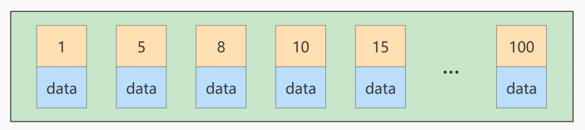

如果此时再插入一条主键值为 9 的记录，那它插入的位置就如下图：

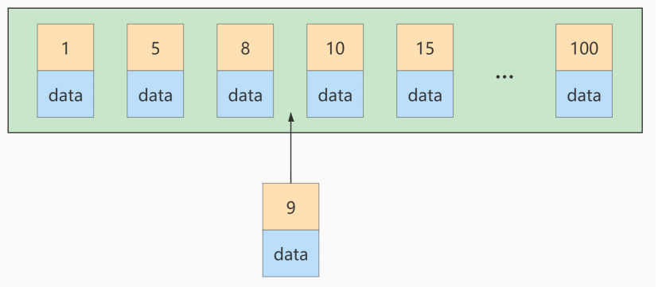

可这个数据页已经满了，再插进来咋办呢？我们需要把当前 页面分裂 成两个页面，把本页中的一些记录移动到新创建的这个页中。页面分裂和记录移位意味着什么？意味着: 性能损耗! 所以如果我们想尽量避免这样无谓的性能损耗，最好让插入的记录的 主键值依次递增 ，这样就不会发生这样的性能损耗了。

所以我们建议: 让主键具有 AUTO_INCREMENT, 让存储引擎自己为表生成主键, 而不是我们手动插入, 比如: person_info 表：
```mysql
CREATE TABLE person_info( 
	id INT UNSIGNED NOT NULL AUTO_INCREMENT, 
	name VARCHAR(100) NOT NULL, 
	birthday DATE NOT NULL, 
	phone_number CHAR(11) NOT NULL, 
	country varchar(100) NOT NULL, 
	PRIMARY KEY (id), 
	KEY idx_name_birthday_phone_number (name(10), 
	birthday, phone_number) 
);
```
我们自定义的主键列 id 拥有 AUTO_INCREMENT 属性，在插入记录时存储引擎会自动为我们填入自增的主键值。这样的主键占用空间小，顺序写入，减少页分裂。

## 2.4 计算、函数、类型转换(自动或手动)导致索引失效
这两条sql哪种写法更好
```mysql
EXPLAIN SELECT SQL_NO_CACHE * FROM student WHERE student.name LIKE 'abc%';
and
EXPLAIN SELECT SQL_NO_CACHE * FROM student WHERE LEFT(student.name,3) = 'abc';
```
创建索引
```mysql
CREATE INDEX idx_name ON student(NAME);
```
第一种：索引优化生效
```mysql
mysql> EXPLAIN SELECT SQL_NO_CACHE * FROM student WHERE student.name LIKE 'abc%';
+----+-------------+---------+------------+-------+---------------+----------+---------+------+------+----------+-----------------------+
| id | select_type | table   | partitions | type  | possible_keys | key      | key_len | ref  | rows | filtered | Extra                 |
+----+-------------+---------+------------+-------+---------------+----------+---------+------+------+----------+-----------------------+
|  1 | SIMPLE      | student | NULL       | range | idx_name      | idx_name | 63      | NULL |  181 |   100.00 | Using index condition |
+----+-------------+---------+------------+-------+---------------+----------+---------+------+------+----------+-----------------------+
1 row in set, 2 warnings (0.00 sec)

mysql> SELECT SQL_NO_CACHE * FROM student WHERE student.name LIKE 'abc%';
181 rows in set, 1 warning (0.00 sec)
```
第二种：索引优化失效
```mysql
mysql> EXPLAIN SELECT SQL_NO_CACHE * FROM student WHERE LEFT(student.name,3) = 'abc';
+----+-------------+---------+------------+------+---------------+------+---------+------+---------+----------+-------------+
| id | select_type | table   | partitions | type | possible_keys | key  | key_len | ref  | rows    | filtered | Extra       |
+----+-------------+---------+------------+------+---------------+------+---------+------+---------+----------+-------------+
|  1 | SIMPLE      | student | NULL       | ALL  | NULL          | NULL | NULL    | NULL | 3990115 |   100.00 | Using where |
+----+-------------+---------+------------+------+---------------+------+---------+------+---------+----------+-------------+
1 row in set, 2 warnings (0.00 sec)

mysql> SELECT SQL_NO_CACHE * FROM student WHERE LEFT(student.name,3) = 'abc';
```
type为“ALL”，表示没有使用到索引，查询时间为 3.62 秒，查询效率较之前低很多。

再举例：

student表的字段stuno上设置有索引
```mysql
CREATE INDEX idx_sno ON student(stuno);
```
**索引优化失效**:
```mysql
mysql> EXPLAIN SELECT SQL_NO_CACHE id, stuno, NAME FROM student WHERE stuno+1 = 900001;
+----+-------------+---------+------------+------+---------------+------+---------+------+---------+----------+-------------+
| id | select_type | table   | partitions | type | possible_keys | key  | key_len | ref  | rows    | filtered | Extra       |
+----+-------------+---------+------------+------+---------------+------+---------+------+---------+----------+-------------+
|  1 | SIMPLE      | student | NULL       | ALL  | NULL          | NULL | NULL    | NULL | 3990115 |   100.00 | Using where |
+----+-------------+---------+------------+------+---------------+------+---------+------+---------+----------+-------------+
1 row in set, 2 warnings (0.00 sec)
```
你能看到如果对索引进行了表达式计算，索引就失效了。这是因为我们需要把索引字段的取值都取出来，然后依次进行表达式的计算来进行条件判断，因此采用的就是全表扫描的方式，运行时间也会慢很多，最终运行时间为2.538秒。

**索引优化生效**：
```mysql
mysql> EXPLAIN SELECT SQL_NO_CACHE id, stuno, NAME FROM student WHERE stuno = 900000;
+----+-------------+---------+------------+------+---------------+---------+---------+-------+------+----------+-------+
| id | select_type | table   | partitions | type | possible_keys | key     | key_len | ref   | rows | filtered | Extra |
+----+-------------+---------+------------+------+---------------+---------+---------+-------+------+----------+-------+
|  1 | SIMPLE      | student | NULL       | ref  | idx_sno       | idx_sno | 4       | const |    1 |   100.00 | NULL  |
+----+-------------+---------+------------+------+---------------+---------+---------+-------+------+----------+-------+
1 row in set, 2 warnings (0.00 sec)
```
运行时间为0.039秒。

再举例：

student表的字段name上设置有索引
```mysql
CREATE INDEX idx_name ON student(NAME);
```
我们想要对name的前三位为abc的内容进行条件筛选，这里我们来查看下执行计划:

索引优化失效:
```mysql
mysql> EXPLAIN SELECT id, stuno, name FROM student WHERE SUBSTRING(name, 1,3)='abc';
+----+-------------+---------+------------+------+---------------+------+---------+------+---------+----------+-------------+
| id | select_type | table   | partitions | type | possible_keys | key  | key_len | ref  | rows    | filtered | Extra       |
+----+-------------+---------+------------+------+---------------+------+---------+------+---------+----------+-------------+
|  1 | SIMPLE      | student | NULL       | ALL  | NULL          | NULL | NULL    | NULL | 3990115 |   100.00 | Using where |
+----+-------------+---------+------------+------+---------------+------+---------+------+---------+----------+-------------+
1 row in set, 1 warning (0.00 sec)
```
索引优化生效:
```mysql
mysql> EXPLAIN SELECT id, stuno, NAME FROM student WHERE NAME LIKE 'abc%';
+----+-------------+---------+------------+-------+---------------+----------+---------+------+------+----------+-----------------------+
| id | select_type | table   | partitions | type  | possible_keys | key      | key_len | ref  | rows | filtered | Extra                 |
+----+-------------+---------+------------+-------+---------------+----------+---------+------+------+----------+-----------------------+
|  1 | SIMPLE      | student | NULL       | range | idx_name      | idx_name | 63      | NULL |  181 |   100.00 | Using index condition |
+----+-------------+---------+------------+-------+---------------+----------+---------+------+------+----------+-----------------------+
1 row in set, 1 warning (0.00 sec)
```
你能看到经过查询重写后，可以使用索引进行范围检索，从而提升查询效率。

## 2.5 类型转换导致索引失效
下列哪个sql语句可以用到索引。（假设name字段上设置有索引）
```mysql
# 未使用到索引 
mysql> EXPLAIN SELECT SQL_NO_CACHE * FROM student WHERE name=123;
+----+-------------+---------+------------+------+---------------+------+---------+------+---------+----------+-------------+
| id | select_type | table   | partitions | type | possible_keys | key  | key_len | ref  | rows    | filtered | Extra       |
+----+-------------+---------+------------+------+---------------+------+---------+------+---------+----------+-------------+
|  1 | SIMPLE      | student | NULL       | ALL  | idx_name      | NULL | NULL    | NULL | 3990115 |    10.00 | Using where |
+----+-------------+---------+------------+------+---------------+------+---------+------+---------+----------+-------------+
1 row in set, 5 warnings (0.00 sec)

# 使用到索引 
mysql> EXPLAIN SELECT SQL_NO_CACHE * FROM student WHERE name='123';
+----+-------------+---------+------------+------+---------------+----------+---------+-------+------+----------+-------+
| id | select_type | table   | partitions | type | possible_keys | key      | key_len | ref   | rows | filtered | Extra |
+----+-------------+---------+------------+------+---------------+----------+---------+-------+------+----------+-------+
|  1 | SIMPLE      | student | NULL       | ref  | idx_name      | idx_name | 63      | const |    1 |   100.00 | NULL  |
+----+-------------+---------+------------+------+---------------+----------+---------+-------+------+----------+-------+
1 row in set, 2 warnings (0.00 sec)
```
name=123发生类型转换，索引失效。
> 结论:设计实体类属性时，一定要与数据库字段类型相对应。否则，就会出现类型转换的情况。


## 2.6 范围条件右边的列索引失效

如果系统经常出现的sql如下:
```mysql
-- mysql5
ALTER TABLE student DROP INDEX idx_name; 
ALTER TABLE student DROP INDEX idx_age; 
ALTER TABLE student DROP INDEX idx_age_classid;
-- mysql8 
ALTER TABLE student ALTER INDEX idx_name INVISIBLE;
ALTER TABLE student ALTER INDEX idx_age INVISIBLE;
ALTER TABLE student ALTER INDEX idx_age_classid INVISIBLE;

mysql> EXPLAIN SELECT SQL_NO_CACHE * FROM student WHERE student.age=30 AND student.classId>20 AND student.name = 'abc' ;
+----+-------------+---------+------------+-------+----------------------+----------------------+---------+------+-------+----------+----------------------------------+
| id | select_type | table   | partitions | type  | possible_keys        | key                  | key_len | ref  | rows  | filtered | Extra                            |
+----+-------------+---------+------------+-------+----------------------+----------------------+---------+------+-------+----------+----------------------------------+
|  1 | SIMPLE      | student | NULL       | range | idx_age_classid_name | idx_age_classid_name | 10      | NULL | 83068 |    10.00 | Using index condition; Using MRR |
+----+-------------+---------+------------+-------+----------------------+----------------------+---------+------+-------+----------+----------------------------------+
1 row in set, 2 warnings (0.00 sec)
```
可以看到, ken_len 是 10, 原因是 age、classid 用到了索引，name 没有用到索引，age和classid为 int 类型的字段占4个字节，且可以为NULL占1个字节，加起来就是10字节。如果name用到了索引，那应该加上 name 占的63字节(utf8mb3中一个字符占3字节, 且varchar是变长的, 要占2字节, 且 name 可以为 NULL占用1字节)，三个字段都用到索引后，key_len的总大小应该是73。

那么索引 idx_age_classid_name 就不能正常使用了(name 未使用到索引)。

> 结论: 范围右边的列不能使用。比如: (<) (<=) (>)(>=）和between等。

如果这种sql出现较多，应该建立:
```mysql
create index idx_age_name_classid on student(age,name,classid);
```
将范围查询条件放置语句最后：
```mysql
mysql> EXPLAIN SELECT SQL_NO_CACHE * FROM student WHERE student.age=30 AND student.name = 'abc' AND student.classId>20 ;
+----+-------------+---------+------------+-------+-------------------------------------------+----------------------+---------+------+------+----------+-----------------------+
| id | select_type | table   | partitions | type  | possible_keys                             | key                  | key_len | ref  | rows | filtered | Extra                 |
+----+-------------+---------+------------+-------+-------------------------------------------+----------------------+---------+------+------+----------+-----------------------+
|  1 | SIMPLE      | student | NULL       | range | idx_age_classid_name,idx_age_name_classid | idx_age_name_classid | 73      | NULL |    1 |   100.00 | Using index condition |
+----+-------------+---------+------------+-------+-------------------------------------------+----------------------+---------+------+------+----------+-----------------------+
1 row in set, 2 warnings (0.00 sec)
```
> 应用开发中范围查询，例如: 金额查询，日期查询往往都是范围查询, 应将查询条件放置where语句最后。

## 2.7 不等于(!= 或者<>)索引失效
为name字段创建索引
```mysql
CREATE INDEX idx_name oN student(NAME);
```
查看索引是否失效
```mysql
mysql> EXPLAIN SELECT SQL_NO_CACHE * FROM student WHERE student.name <> 'abc' ;
+----+-------------+---------+------------+------+---------------+------+---------+------+---------+----------+-------------+
| id | select_type | table   | partitions | type | possible_keys | key  | key_len | ref  | rows    | filtered | Extra       |
+----+-------------+---------+------------+------+---------------+------+---------+------+---------+----------+-------------+
|  1 | SIMPLE      | student | NULL       | ALL  | idx_name      | NULL | NULL    | NULL | 3990115 |    50.15 | Using where |
+----+-------------+---------+------------+------+---------------+------+---------+------+---------+----------+-------------+
1 row in set, 2 warnings (0.00 sec)
```
或者
```mysql
mysql> EXPLAIN SELECT SQL_NO_CACHE * FROM student WHERE student. name != 'abc';
+----+-------------+---------+------------+------+---------------+------+---------+------+---------+----------+-------------+
| id | select_type | table   | partitions | type | possible_keys | key  | key_len | ref  | rows    | filtered | Extra       |
+----+-------------+---------+------------+------+---------------+------+---------+------+---------+----------+-------------+
|  1 | SIMPLE      | student | NULL       | ALL  | idx_name      | NULL | NULL    | NULL | 3990115 |    50.15 | Using where |
+----+-------------+---------+------------+------+---------------+------+---------+------+---------+----------+-------------+
1 row in set, 2 warnings (0.00 sec)
```
场景举例:用户提出需求，将财务数据，产品利润金额不等于0的都统计出来。

## 2.8 is null可以使用索引，is not null无法使用索引
`IS NULL` 可以触发索引
```mysql
mysql> EXPLAIN SELECT SQL_NO_CACHE * FROM student WHERE age IS NULL;
+----+-------------+---------+------------+------+-------------------------------------------+----------------------+---------+-------+------+----------+-----------------------+
| id | select_type | table   | partitions | type | possible_keys                             | key                  | key_len | ref   | rows | filtered | Extra                 |
+----+-------------+---------+------------+------+-------------------------------------------+----------------------+---------+-------+------+----------+-----------------------+
|  1 | SIMPLE      | student | NULL       | ref  | idx_age_classid_name,idx_age_name_classid | idx_age_classid_name | 5       | const |    1 |   100.00 | Using index condition |
+----+-------------+---------+------------+------+-------------------------------------------+----------------------+---------+-------+------+----------+-----------------------+
1 row in set, 2 warnings (0.01 sec)
```
`IS NOT NULL` 无法触发索引
```mysql
mysql> EXPLAIN SELECT SQL_NO_CACHE * FROM student WHERE age IS NOT NULL;
+----+-------------+---------+------------+------+-------------------------------------------+------+---------+------+---------+----------+-------------+
| id | select_type | table   | partitions | type | possible_keys                             | key  | key_len | ref  | rows    | filtered | Extra       |
+----+-------------+---------+------------+------+-------------------------------------------+------+---------+------+---------+----------+-------------+
|  1 | SIMPLE      | student | NULL       | ALL  | idx_age_classid_name,idx_age_name_classid | NULL | NULL    | NULL | 3990115 |    50.00 | Using where |
+----+-------------+---------+------------+------+-------------------------------------------+------+---------+------+---------+----------+-------------+
1 row in set, 2 warnings (0.00 sec)
```
> 结论: 最好在设计数据表的时候就将字段设置为NOT NULL 约束，比如你可以将INT类型的字段，默认值设置为0。将字符类型的默认值设置为空字符串('')。

## 2.9 like以通配符%开头索引失效
在使用LIKE关键字进行查询的查询语句中，如果匹配字符串的第一个字符为`'%'`，索引就不会起作用。只有`'%'`不在第一个位置，索引才会起作用。

使用到索引
```mysql
mysql> EXPLAIN SELECT SQL_NO_CACHE * FROM student WHERE name LIKE 'ab% ';
+----+-------------+---------+------------+-------+---------------+----------+---------+------+------+----------+----------------------------------+
| id | select_type | table   | partitions | type  | possible_keys | key      | key_len | ref  | rows | filtered | Extra                            |
+----+-------------+---------+------------+-------+---------------+----------+---------+------+------+----------+----------------------------------+
|  1 | SIMPLE      | student | NULL       | range | idx_name      | idx_name | 63      | NULL | 5933 |   100.00 | Using index condition; Using MRR |
+----+-------------+---------+------------+-------+---------------+----------+---------+------+------+----------+----------------------------------+
1 row in set, 2 warnings (0.00 sec)
```
未使用到索引
```mysql
mysql> EXPLAIN SELECT SQL_NO_CACHE * FROM student WHERE name LIKE '%ab%' ;
+----+-------------+---------+------------+------+---------------+------+---------+------+---------+----------+-------------+
| id | select_type | table   | partitions | type | possible_keys | key  | key_len | ref  | rows    | filtered | Extra       |
+----+-------------+---------+------------+------+---------------+------+---------+------+---------+----------+-------------+
|  1 | SIMPLE      | student | NULL       | ALL  | NULL          | NULL | NULL    | NULL | 3990115 |    11.11 | Using where |
+----+-------------+---------+------------+------+---------------+------+---------+------+---------+----------+-------------+
1 row in set, 2 warnings (0.00 sec)
```
> 拓展：Alibaba《Java开发手册》: 【强制】页面搜索严禁左模糊或者全模糊，如果需要请走搜索引擎来解决。

## 2.10 OR 前后存在非索引的列，索引失效
在WHERE子句中，如果在OR前的条件列进行了索引，而在OR后的条件列没有进行索引，那么索引会失效。也就是说，OR前后的两个条件中的列都是索引时，查询中才使用索引。

因为OR的含义就是两个只要满足一个即可，因此只有一个条件列进行了索引是没有意义的，只要有条件列没有进行索引，就会进行全表扫描，因此索引的条件列也会失效。

查询语句使用OR关键字的情况:
```mysql
# 未使用到索引 
mysql> EXPLAIN SELECT SQL_NO_CACHE * FROM student WHERE age = 10 OR classid = 100;
+----+-------------+---------+------------+------+-------------------------------------------+------+---------+------+---------+----------+-------------+
| id | select_type | table   | partitions | type | possible_keys                             | key  | key_len | ref  | rows    | filtered | Extra       |
+----+-------------+---------+------------+------+-------------------------------------------+------+---------+------+---------+----------+-------------+
|  1 | SIMPLE      | student | NULL       | ALL  | idx_age_classid_name,idx_age_name_classid | NULL | NULL    | NULL | 3990115 |    11.03 | Using where |
+----+-------------+---------+------------+------+-------------------------------------------+------+---------+------+---------+----------+-------------+
1 row in set, 2 warnings (0.00 sec)
```
因为classid字段上没有索引，所以上述查询语句没有使用索引。
```mysql
#使用到索引 
mysql> EXPLAIN SELECT SQL_NO_CACHE * FROM student WHERE age = 10 OR name = 'Abel';
+----+-------------+---------+------------+-------------+----------------------------------------------------+-------------------------------+---------+------+-------+----------+--------------------------------------------------------------+
| id | select_type | table   | partitions | type        | possible_keys                                      | key                           | key_len | ref  | rows  | filtered | Extra                                                        |
+----+-------------+---------+------------+-------------+----------------------------------------------------+-------------------------------+---------+------+-------+----------+--------------------------------------------------------------+
|  1 | SIMPLE      | student | NULL       | index_merge | idx_age_classid_name,idx_age_name_classid,idx_name | idx_age_classid_name,idx_name | 5,63    | NULL | 90999 |   100.00 | Using sort_union(idx_age_classid_name,idx_name); Using where |
+----+-------------+---------+------------+-------------+----------------------------------------------------+-------------------------------+---------+------+-------+----------+--------------------------------------------------------------+
1 row in set, 2 warnings (0.00 sec)
```
因为age字段和name字段上都有索引，所以查询中使用了索引。你能看到这里使用到了index_merge，简单来说index_merge就是对age和name分别进行了扫描，然后将这两个结果集进行了合并。这样做的好处就是避免了全表扫描。

## 2.11 数据库和表的字符集统一使用utf8mb4
统一使用utf8mb4( 5.5.3版本以上支持)兼容性更好，统一字符集可以避免由于字符集转换产生的乱码。不同的 字符集 进行比较前需要进行 转换 会造成索引失效。

## 2.12 练习及一般性建议
练习: 假设: index(a,b,c)

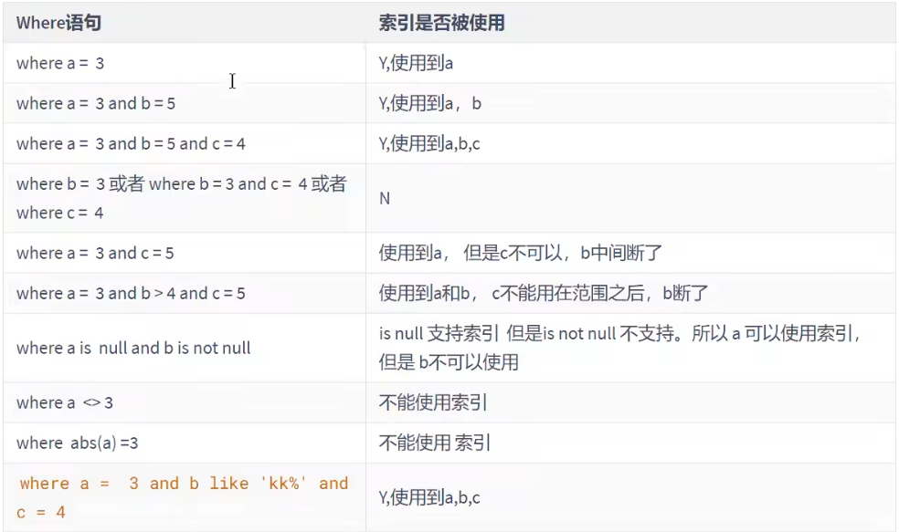

一般性建议:
- 对于单列索引，尽量选择针对当前query过滤性更好的索引
- 在选择组合索引的时候，当前query中过滤性最好的字段在索引字段顺序中，位置越靠前越好。
- 在选择组合索引的时候，尽量选择能够包含当前query中的where子句中更多字段的索引。
- 在选择组合索引的时候，如果某个字段可能出现范围查询时，尽量把这个字段放在索引次序的最后面。

总之，书写SQL语句时，尽量避免造成索引失效的情况。

# 三、关联查询优化
## 3.1 数据准备
```mysql
#分类
CREATE TABLE IF NOT EXISTS `type`(
	`id` INT (10) UNSIGNED NOT NULL AUTO_INCREMENT,
	`card` INT(10) UNSIGNED NOT NULL,
	PRIMARY KEY ( `id`)
);

#图书
CREATE TABLE IF NOT EXISTS `book`(
	`bookid` INT(10) UNSIGNED NOT NULL AUTO_INCREMENT,
	`card` INT(10) UNSIGNED NOT NULL,
	PRIMARY KEY ( `bookid`)
);

#向分类表中添加20条记录
INSERT INTO type( card) VALUES( FLOOR(1 +(RAND( ) * 20) ) );
INSERT INTO type(card) VALUES( FLOOR( 1 +(RAND( ) * 20) ) ) ;
INSERT INTO type(card) VALUES(FLOOR( 1 +(RAND( ) * 20) ) ) ;
INSERT INTO type(card) VALUES( FLOOR( 1 +(RAND( ) * 20) ) ) ;
INSERT INTO type( card) VALUES( FLOOR(1 +(RAND( ) * 20) ) ) ;
INSERT INTO type (card) VALUES( FLOOR( 1 +(RAND() * 20) ) ) ;
INSERT INTO type( card) VALUES( FLOOR( 1 + (RAND( ) * 20) ) );
INSERT INTO type( card) VALUES( FLOOR(1 +(RAND( ) * 20) ) ) ;
INSERT INTO type ( card) VALUES(FLOOR( 1 +(RAND( ) * 20) ) );
INSERT INTO type( card) VALUES( FLOOR( 1 +(RAND( ) * 20) ) );
INSERT INTO type ( card) VALUES(FLOOR( 1 +(RAND( ) * 20) ) ) ;
INSERT INTO type(card) VALUES(FLOOR(1 +(RAND() * 20) ) );
INSERT INTO type( card) VALUES( FLOOR( 1 +(RAND( ) * 20) ) );
INSERT INTO type(card) VALUES( FLOOR(1 + (RAND() * 20) ) ) ;
INSERT INTO type( card) VALUES( FLOOR(1 + (RAND() * 20) ) ) ;
INSERT INTO type(card) VALUES( FLOOR( 1 +(RAND( ) * 20) ) );
INSERT INTO type( card ) VALUES( FLOOR(1 +(RAND() * 20) ) );
INSERT INTO type( card ) VALUES( FLOOR(1 +(RAND() * 20) ) );
INSERT INTO type( card ) VALUES( FLOOR(1 +(RAND() * 20) ) );
INSERT INTO type( card ) VALUES( FLOOR(1 +(RAND() * 20) ) );


#向图书表中添加20条记录
INSERT INTO book(card) VALUES( FLOOR( 1 +(RAND() * 20) ) );
INSERT INTO book(card) VALUES(FLOOR(1 +(RAND() * 20) ) ) ;
INSERT INTO book(card) VALUES( FLOOR( 1 + (RAND() * 20) ) );
INSERT INTO book(card) VALUES(FLOOR( 1 +(RAND() * 20) ) ) ;
INSERT INTO book(card) VALUES( FLOOR( 1 + (RAND( ) * 20) ) ) ;
INSERT INTO book(card) VALUES( FLOOR( 1 +(RAND( ) * 20) ) );
INSERT INTO book(card) VALUES( FLOOR( 1 +(RAND( ) * 20) ) );
INSERT INTO book(card) VALUES(FLOOR(1 +(RAND() * 20) ) ) ;
INSERT INTO book(card) VALUES( FLOOR(1 +(RAND( ) * 20) ) );
INSERT INTO book(card) VALUES( FLOOR(1 +(RAND() * 20) ) ) ;
INSERT INTO book(card) VALUES(FLOOR(1 + (RAND() * 20) ) ) ;
INSERT INTO book(card) VALUES( FLOOR(1 +(RAND() * 20) ) );
INSERT INTO book(card) VALUES( FLOOR( 1 +(RAND() * 20) ) ) ;
INSERT INTO book(card) VALUES( FLOOR( 1 +(RAND( ) * 20) ) ) ;
INSERT INTO book(card) VALUES( FLOOR( 1 +(RAND() * 20) ) );
INSERT INTO book(card) VALUES(FLOOR(1 +(RAND( ) * 20) ) );
INSERT INTO book(card) VALUES( FLOOR( 1 + (RAND( ) * 20) ) ) ;
INSERT INTO book(card) VALUES( FLOOR( 1 +(RAND( ) * 20) ) );
INSERT INTO book(card) VALUES( FLOOR(1 +(RAND( ) * 20) ) );
INSERT INTO book(card) VALUES( FLOOR(1 +(RAND( ) * 20) ) ) ;
```

## 3.2 采用左外连接
下面开始 EXPLAIN 分析
```mysql
EXPLAIN SELECT SQL_NO_CACHE * FROM `type` LEFT JOIN book ON type.card = book.card;
```
结论：type 为 ALL。

```mysql
-- 添加索引优化
ALTER TABLE book ADD INDEX Y(card); #【被驱动表】，可以避免全表扫描 

-- 再次执行
mysql> explain select sql_no_cache * from type left join book on type.card = book.card;
+----+-------------+-------+------------+------+---------------+------+---------+------------------+------+----------+-------------+
| id | select_type | table | partitions | type | possible_keys | key  | key_len | ref              | rows | filtered | Extra       |
+----+-------------+-------+------------+------+---------------+------+---------+------------------+------+----------+-------------+
|  1 | SIMPLE      | type  | NULL       | ALL  | NULL          | NULL | NULL    | NULL             |   20 |   100.00 | NULL        |
|  1 | SIMPLE      | book  | NULL       | ref  | Y             | Y    | 4       | kinodb.type.card |    1 |   100.00 | Using index |
+----+-------------+-------+------------+------+---------------+------+---------+------------------+------+----------+-------------+
2 rows in set, 2 warnings (0.00 sec)
```
可以看到第二行的 type 变为了 ref，rows 也变成了1，优化比较明显。这是由左连接特性决定的。LEFT JOIN条件用于确定如何从右表搜索行，左边一定都有，所以 右边是我们的关键点,一定需要建立索引 。
```mysql
ALTER TABLE `type` ADD INDEX X (card); #【驱动表】，无法避免全表扫描 

mysql> EXPLAIN SELECT SQL_NO_CACHE * FROM `type` LEFT JOIN book ON type.card = book.card;
+----+-------------+-------+------------+-------+---------------+------+---------+------------------+------+----------+-------------+
| id | select_type | table | partitions | type  | possible_keys | key  | key_len | ref              | rows | filtered | Extra       |
+----+-------------+-------+------------+-------+---------------+------+---------+------------------+------+----------+-------------+
|  1 | SIMPLE      | type  | NULL       | index | NULL          | X    | 4       | NULL             |   20 |   100.00 | Using index |
|  1 | SIMPLE      | book  | NULL       | ref   | Y             | Y    | 4       | kinodb.type.card |    1 |   100.00 | Using index |
+----+-------------+-------+------------+-------+---------------+------+---------+------------------+------+----------+-------------+
2 rows in set, 2 warnings (0.00 sec)
```
接着
```mysql
DROP INDEX Y ON book;

mysql> EXPLAIN SELECT SQL_NO_CACHE * FROM `type` LEFT JOIN book ON type.card = book.card;
+----+-------------+-------+------------+-------+---------------+------+---------+------+------+----------+--------------------------------------------+
| id | select_type | table | partitions | type  | possible_keys | key  | key_len | ref  | rows | filtered | Extra                                      |
+----+-------------+-------+------------+-------+---------------+------+---------+------+------+----------+--------------------------------------------+
|  1 | SIMPLE      | type  | NULL       | index | NULL          | X    | 4       | NULL |   20 |   100.00 | Using index                                |
|  1 | SIMPLE      | book  | NULL       | ALL   | NULL          | NULL | NULL    | NULL |   20 |   100.00 | Using where; Using join buffer (hash join) |
+----+-------------+-------+------------+-------+---------------+------+---------+------+------+----------+--------------------------------------------+
2 rows in set, 2 warnings (0.00 sec)
```

## 3.3 采用内连接
```mysql
drop index X on type; 
drop index Y on book; -- 如果已经删除了可以不用再执行该操作
```
换成 inner join（MySQL自动选择驱动表）
```mysql
mysql> EXPLAIN SELECT SQL_NO_CACHE * FROM type INNER JOIN book ON type.card=book.card;
+----+-------------+-------+------------+------+---------------+------+---------+------+------+----------+--------------------------------------------+
| id | select_type | table | partitions | type | possible_keys | key  | key_len | ref  | rows | filtered | Extra                                      |
+----+-------------+-------+------------+------+---------------+------+---------+------+------+----------+--------------------------------------------+
|  1 | SIMPLE      | type  | NULL       | ALL  | NULL          | NULL | NULL    | NULL |   20 |   100.00 | NULL                                       |
|  1 | SIMPLE      | book  | NULL       | ALL  | NULL          | NULL | NULL    | NULL |   20 |    10.00 | Using where; Using join buffer (hash join) |
+----+-------------+-------+------------+------+---------------+------+---------+------+------+----------+--------------------------------------------+
2 rows in set, 2 warnings (0.00 sec)
```
添加索引优化
```mysql
mysql> ALTER TABLE book ADD INDEX Y ( card);

mysql> EXPLAIN SELECT SQL_NO_CACHE * FROM type INNER JOIN book ON type.card=book.card;
+----+-------------+-------+------------+------+---------------+------+---------+------------------+------+----------+-------------+
| id | select_type | table | partitions | type | possible_keys | key  | key_len | ref              | rows | filtered | Extra       |
+----+-------------+-------+------------+------+---------------+------+---------+------------------+------+----------+-------------+
|  1 | SIMPLE      | type  | NULL       | ALL  | NULL          | NULL | NULL    | NULL             |   20 |   100.00 | NULL        |
|  1 | SIMPLE      | book  | NULL       | ref  | Y             | Y    | 4       | kinodb.type.card |    1 |   100.00 | Using index |
+----+-------------+-------+------------+------+---------------+------+---------+------------------+------+----------+-------------+
2 rows in set, 2 warnings (0.00 sec)


mysql> ALTER TABLE type ADD INDEX X (card);

mysql> EXPLAIN SELECT SQL_NO_CACHE * FROM type INNER JOIN book ON type.card=book.card;
+----+-------------+-------+------------+-------+---------------+------+---------+------------------+------+----------+-------------+
| id | select_type | table | partitions | type  | possible_keys | key  | key_len | ref              | rows | filtered | Extra       |
+----+-------------+-------+------------+-------+---------------+------+---------+------------------+------+----------+-------------+
|  1 | SIMPLE      | book  | NULL       | index | Y             | Y    | 4       | NULL             |   20 |   100.00 | Using index |
|  1 | SIMPLE      | type  | NULL       | ref   | X             | X    | 4       | kinodb.book.card |    1 |   100.00 | Using index |
+----+-------------+-------+------------+-------+---------------+------+---------+------------------+------+----------+-------------+
2 rows in set, 2 warnings (0.00 sec)
```
接着：
```mysql
DROP INDEX X ON `type`;

mysql> EXPLAIN SELECT SQL_NO_CACHE * FROM type INNER JOIN book ON type.card=book.card;
+----+-------------+-------+------------+------+---------------+------+---------+------------------+------+----------+-------------+
| id | select_type | table | partitions | type | possible_keys | key  | key_len | ref              | rows | filtered | Extra       |
+----+-------------+-------+------------+------+---------------+------+---------+------------------+------+----------+-------------+
|  1 | SIMPLE      | type  | NULL       | ALL  | NULL          | NULL | NULL    | NULL             |   20 |   100.00 | NULL        |
|  1 | SIMPLE      | book  | NULL       | ref  | Y             | Y    | 4       | kinodb.type.card |    1 |   100.00 | Using index |
+----+-------------+-------+------------+------+---------------+------+---------+------------------+------+----------+-------------+
2 rows in set, 2 warnings (0.00 sec
```
接着：
```mysql
#向表中再添加20条记录
INSERT INTO book(card) VALUES( FLOOR( 1 +(RAND() * 20) ) );
INSERT INTO book(card) VALUES(FLOOR(1 +(RAND() * 20) ) ) ;
INSERT INTO book(card) VALUES( FLOOR( 1 + (RAND() * 20) ) );
INSERT INTO book(card) VALUES(FLOOR( 1 +(RAND() * 20) ) ) ;
INSERT INTO book(card) VALUES( FLOOR( 1 + (RAND( ) * 20) ) ) ;
INSERT INTO book(card) VALUES( FLOOR( 1 +(RAND( ) * 20) ) );
INSERT INTO book(card) VALUES( FLOOR( 1 +(RAND( ) * 20) ) );
INSERT INTO book(card) VALUES(FLOOR(1 +(RAND() * 20) ) ) ;
INSERT INTO book(card) VALUES( FLOOR(1 +(RAND( ) * 20) ) );
INSERT INTO book(card) VALUES( FLOOR(1 +(RAND() * 20) ) ) ;
INSERT INTO book(card) VALUES(FLOOR(1 + (RAND() * 20) ) ) ;
INSERT INTO book(card) VALUES( FLOOR(1 +(RAND() * 20) ) );
INSERT INTO book(card) VALUES( FLOOR( 1 +(RAND() * 20) ) ) ;
INSERT INTO book(card) VALUES( FLOOR( 1 +(RAND( ) * 20) ) ) ;
INSERT INTO book(card) VALUES( FLOOR( 1 +(RAND() * 20) ) );
INSERT INTO book(card) VALUES(FLOOR(1 +(RAND( ) * 20) ) );
INSERT INTO book(card) VALUES( FLOOR( 1 + (RAND( ) * 20) ) ) ;
INSERT INTO book(card) VALUES( FLOOR( 1 +(RAND( ) * 20) ) );
INSERT INTO book(card) VALUES( FLOOR(1 +(RAND( ) * 20) ) );
INSERT INTO book(card) VALUES( FLOOR(1 +(RAND( ) * 20) ) ) ;

ALTER TABLE type ADD INDEX Y ( card) ;

mysql> EXPLAIN SELECT SQL_NO_CACHE * FROM type INNER JOIN book ON type.card=book.card;
+----+-------------+-------+------------+------+---------------+------+---------+------------------+------+----------+-------------+
| id | select_type | table | partitions | type | possible_keys | key  | key_len | ref              | rows | filtered | Extra       |
+----+-------------+-------+------------+------+---------------+------+---------+------------------+------+----------+-------------+
|  1 | SIMPLE      | type  | NULL       | ALL  | NULL          | NULL | NULL    | NULL             |   20 |   100.00 | NULL        |
|  1 | SIMPLE      | book  | NULL       | ref  | Y             | Y    | 4       | kinodb.type.card |    1 |   100.00 | Using index |
+----+-------------+-------+------------+------+---------------+------+---------+------------------+------+----------+-------------+
2 rows in set, 2 warnings (0.00 sec)
```
图中发现，由于type表数据大于book表数据，MySQL选择将type作为被驱动表。也就是小表驱动大表。

把 book 的索引去掉, 然后添加10万条记录进去, 再执行上面的 inner join 会得到如下结果
```sql
mysql> EXPLAIN SELECT SQL_NO_CACHE * FROM type INNER JOIN book ON type.card=book.card;
+----+-------------+-------+------------+------+---------------+------+---------+------------------+--------+----------+-------------+
| id | select_type | table | partitions | type | possible_keys | key  | key_len | ref              | rows   | filtered | Extra       |
+----+-------------+-------+------------+------+---------------+------+---------+------------------+--------+----------+-------------+
|  1 | SIMPLE      | book  | NULL       | ALL  | NULL          | NULL | NULL    | NULL             | 133572 |   100.00 | NULL        |
|  1 | SIMPLE      | type  | NULL       | ref  | Y             | Y    | 4       | kinodb.book.card |      1 |   100.00 | Using index |
+----+-------------+-------+------------+------+---------------+------+---------+------------------+--------+----------+-------------+
2 rows in set, 2 warnings (0.00 sec)
```
book 表的数据显然是大于 type 表, 但是没有遵循 `小表驱动大表` 的情况, MySQL 优化器认为 book 全表在  type 表(join 字段有索引)中过滤的性能是高于 book 表做被驱动的。

所以如果 两张表join, 其中一张表 join 的字段没有索引, 另一个表的 join 字段有索引, 那么没有索引的就是驱动表.

## 3.4 join语句原理
join方式连接多个表，本质就是各个表之间数据的循环匹配。MySQL5.5版本之前，MySQL只支持一种表间关联方式，就是嵌套循环(Nested Loop Join)。如果关联表的数据量很大，则join关联的执行时间会非常长。在MySQL5.5以后的版本中，MySQL通过引入BNLJ算法来优化嵌套执行。

### 1.驱动表和被驱动表
驱动表就是主表，被驱动表就是从表、非驱动表。

对于内连接来说:
```mysql
SELECT * FROM A JOIN B ON ...
```
A一定是驱动表吗?不一定，优化器会根据你查询语句做优化，决定先查哪张表。先查询的那张表就是驱动表,反之就是被驱动表。通过explain关键字可以查看。

对于外连接来说:
```mysql
SELECT * FROM A LEFT JOIN B ON ...

#或

SELECT * FROM B RIGHT JOIN A ON ...
```
通常，大家会认为A就是驱动表，B就是被驱动表。但也未必。测试如下:
```mysql
CREATE TABLE a(f1 INT, f2 INT,INDEX(f1 ))ENGINE=INNODB;

CREATE TABLE b(f1 INT,f2 INT)ENGINE=INNODB;

INSERT INTO a VALUES(1,1),(2,2),(3,3),(4,4),(5,5),(6,6);

INSERT INTO b VALUES(3,3),(4,4),(5,5),(6,6),(7,7),(8,8);

SELECT * FROM b;

#测试1
mysql> EXPLAIN SELECT * FROM a LEFT JOIN b ON a.f1=b.f1 WHERE a.f2=b.f2;
+----+-------------+-------+------------+------+---------------+------+---------+-------------+------+----------+-------------+
| id | select_type | table | partitions | type | possible_keys | key  | key_len | ref         | rows | filtered | Extra       |
+----+-------------+-------+------------+------+---------------+------+---------+-------------+------+----------+-------------+
|  1 | SIMPLE      | b     | NULL       | ALL  | NULL          | NULL | NULL    | NULL        |    6 |   100.00 | Using where |
|  1 | SIMPLE      | a     | NULL       | ref  | f1            | f1   | 5       | kinodb.b.f1 |    1 |    16.67 | Using where |
+----+-------------+-------+------------+------+---------------+------+---------+-------------+------+----------+-------------+
2 rows in set, 1 warning (0.00 sec)

#测试2
mysql> EXPLAIN SELECT * FROM a LEFT JOIN b ON a.f1=b.f1 AND a.f2=b.f2;
+----+-------------+-------+------------+------+---------------+------+---------+------+------+----------+--------------------------------------------+
| id | select_type | table | partitions | type | possible_keys | key  | key_len | ref  | rows | filtered | Extra                                      |
+----+-------------+-------+------------+------+---------------+------+---------+------+------+----------+--------------------------------------------+
|  1 | SIMPLE      | a     | NULL       | ALL  | NULL          | NULL | NULL    | NULL |    6 |   100.00 | NULL                                       |
|  1 | SIMPLE      | b     | NULL       | ALL  | NULL          | NULL | NULL    | NULL |    6 |   100.00 | Using where; Using join buffer (hash join) |
+----+-------------+-------+------------+------+---------------+------+---------+------+------+----------+--------------------------------------------+
2 rows in set, 1 warning (0.00 sec)
```

### 2. Simple Nested-Loop Join(简单嵌套循环连接)
算法相当简单，从表A中取出一条数据1，遍历表B，将匹配到的数据放到result…以此类推，驱动表A中的每一条记录与被驱动表B的记录进行判断:

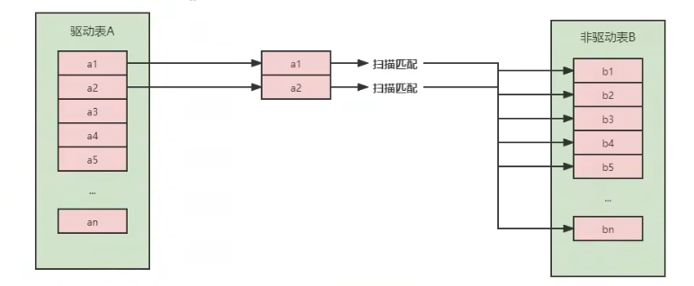

可以看到这种方式效率是非常低的，以上述表A数据100条，表B数据1000条计算，则A*B=10万次。开销统计如下:

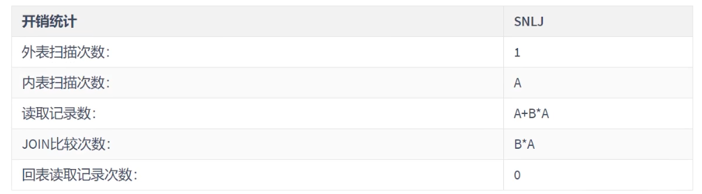

当然mysql肯定不会这么粗暴的去进行表的连接，所以就出现了后面的两种对Nested-Loop Join优化算法。


### 3. Index Nested-Loop Join(索引嵌套循环连接)
Index Nested-Loop Join其优化的思路主要是为了减少内层表数据的匹配次数，所以要求被驱动表上必须有索引才行。通过外层表匹配条件直接与内层表索引进行匹配，避免和内层表的每条记录去进行比较，这样极大的减少了对内层表的匹配次数。

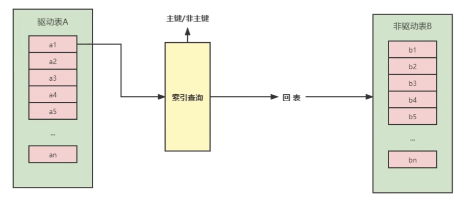

驱动表中的每条记录通过被驱动表的索引进行访问，因为索引查询的成本是比较固定的，故mysql优化器都倾向于使用记录数少的表作为驱动表(外表)。


如果被驱动表加索引，效率是非常高的，但如果索引不是主键索引，所以还得进行一次回表查询。相比，被驱动表的索引是主键索引，效率会更高。

### 4. Block Nested-Loop Join(块嵌套循环连接)
如果存在索引，那么会使用index的方式进行join，如果join的列没有索引，被驱动表要扫描的次数太多了。每次访问被驱动表，其表中的记录都会被加载到内存中，然后再从驱动表中取一条与其匹配，匹配结束后清除内存，然后再从驱动表中加载一条记录，然后把被驱动表的记录在加载到内存匹配，这样周而复始，大大增加了IO的次数。为了减少被驱动表的IO次数，就出现了Block Nested-Loop Join的方式。

不再是逐条获取驱动表的数据，而是一块一块的获取，引入了join buffer缓冲区，将驱动表join相关的部分数据列(大小受join buffer的限制)缓存到join buffer中，然后全表扫描被驱动表，被驱动表的每一条记录一次性和joinbuffer中的所有驱动表记录进行匹配(内存中操作)，将简单嵌套循环中的多次比较合并成一次，降低了被驱动表的访问频率。

> 注意:
> 这里缓存的不只是关联表的列,select后面的列也会缓存起来。
> 在一个有N个join关联的sql中会分配N-1个join buffer。所以查询的时候尽量减少不必要的字段，可以让joinbuffer中可以存放更多的列。

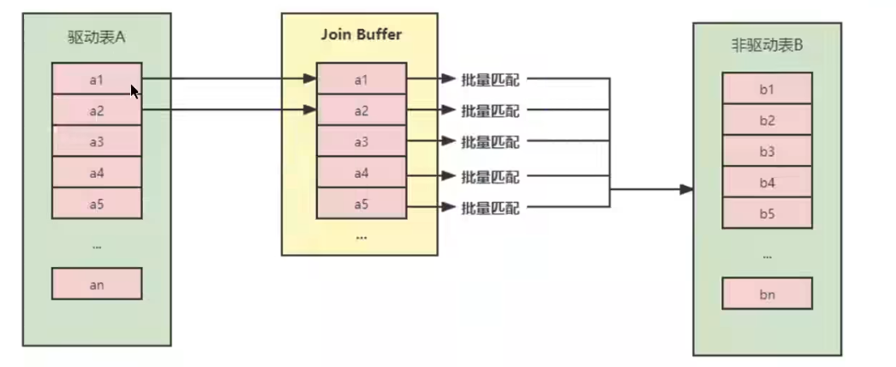

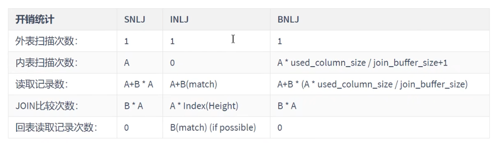

参数设置:
- block_nested_loop
  通过 `SHOW VARIABLES LIKE '%optimizer_switch%'`查看block_nested_loop状态。默认是开启的。
- join_buffer_size
  驱动表能不能一次加载完，要看join buffer能不能存储所有的数据，默认情况下join_buffer_size=256k 。
  ```mysql
  mysql> show variables like '%join_buffer%';
  +------------------+--------+
  | Variable_name    | Value  |
  +------------------+--------+
  | join_buffer_size | 262144 |
  +------------------+--------+
  1 row in set (1.56 sec)
  ```
  join_buffer_size的最大值在32位系统可以申请4G，而在64位操做系统下可以申请大于4G的Join Buffer空间(64位Windows除外，其大值会被截断为4GB并发出警告)。

### 5. Join小结
1. 整体效率比较:INLJ >BNLJ > SNLJ
2. 永远用小结果集驱动大结果集(其本质就是减少外层循环的数据数量) (小的度量单位指的是表行数*每行大小)
  ```mysql
  select t1.b,t2.* from t1 straight_join t2 on (t1.b=t2.b) where t2.id<=100;#推荐
  select t1.b,t2.* from t2 straight.join t1 on (t1.b=t2.b) where t2.id<=100;#不推荐
  ```
3. 为被驱动表匹配的条件增加索引(减少内层表的循环匹配次数)
4. 增大join buffer size的大小(一次缓存的数据越多，那么内层包的扫表次数就越少)
5. 减少驱动表不必要的字段查询(字段越少，join buffer所缓存的数据就越多)

### 6. Hash Join
从MySQL的8.0.20版本开始将废弃BNLJ，因为从MySQL8.0.18版本开始就加入了hash join默认都会使用hash join

- Nested Loop：对于被连接的数据子集较小的情况下，Nested Loop是个较好的选择。
- Hash Join是做`大数据集连接`时的常用方式，优化器使用两个表中较小（相对较小）的表利用Join Key在内存中建立`散列值`，然后扫描较大的表并探测散列值，找出与Hash表匹配的行。
  - 这种方式适用于较小的表完全可以放入内存中的情况，这样总成本就是访问两个表的成本之和。
  - 在表很大的情况下并不能完全放入内存，这时优化器会将它分割成`若干不同的分区`，不能放入内存的部分就把该分区写入磁盘的临时段，此时要求有较大的临时段从而尽量提高I/O的性能。
  - 它能够很好的工作于没有索引的大表和并行查询的环境中，并提供最好的性能。Hash Join只能应用于等值连接，这是由Hash的特点决定的。

| 类别   | Nested Loop                            | Hash Join                                                        | 
|------|----------------------------------------|------------------------------------------------------------------|
| 使用条件 | 任何条件                                   | 等值连接(=)                                                          |
| 相关资源 | CPU、磁盘IO                               | 内存、临时空间                                                          |
| 特点   | 当有高选择性索引或进行限制性搜索时效率比较高，能够快速返回第一次的搜索结果。 | 当缺乏索引或者索引条件模糊时，Hash Join 比 Nested Loop 有效。在数据仓库环境下，如果表的记录数多，效率高。 |
| 缺点   | 当索引丢失或者查询条件限制不够时，效率很低；当标的记录数多时，效率低     | 为建立哈希表，需要大量内存，第一次的结果返回较慢。                                        |

我们来看一下这个语句：
```mysql
EXPLAIN SELECT * FROM t1 STRAIGHT_JOIN t2 ON (t1.a=t2.a);
```
如果直接使用join语句，MySQL优化器可能会选择表t1或t2作为驱动表，这样会影响我们分析SQL语句的执行过程。所以，为了便于分析执行过程中的性能问题，我改用 straight_join 让MySQL使用固定的连接方式执行查询，这样优化器只会按照我们指定的方式去join。在这个语句里，t1 是驱动表，t2是被驱动表。

可以看到，在这条语句里，被驱动表t2的字段a上有索引，join过程用上了这个索引，因此这个语句的执行流程是这样的：

1. 从表t1中读入一行数据 R；
2. 从数据行R中，取出a字段到表t2里去查找；
3. 取出表t2中满足条件的行，跟R组成一行，作为结果集的一部分；
4. 重复执行步骤1到3，直到表t1的末尾循环结束。

这个过程是先遍历表t1，然后根据从表t1中取出的每行数据中的a值，去表t2中查找满足条件的记录。在形式上，这个过程就跟我们写程序时的嵌套查询类似，并且可以用上被驱动表的索引，所以我们称之为“Index Nested-Loop Join”，简称NLJ。

它对应的流程图如下所示：

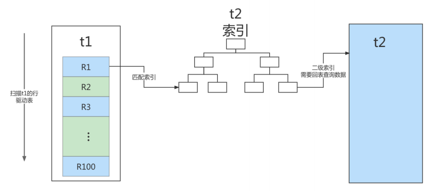

在这个流程里：
1. 对驱动表t1做了全表扫描，这个过程需要扫描100行；
2. 而对于每一行R，根据a字段去表t2查找，走的是树搜索过程。由于我们构造的数据都是一一对应的，因此每次的搜索过程都只扫描一行，也是总共扫描100行；
3. 所以，整个执行流程，总扫描行数是200。

引申问题1：能不能使用join?

引申问题2：怎么选择驱动表？
> 比如：N扩大1000倍的话，扫描行数就会扩大1000倍；而M扩大1000倍，扫描行数扩大不到10倍。

> 两个结论：
> 1. 使用join语句，性能比强行拆成多个单表执行SQL语句的性能要好；
> 2. 如果使用join语句的话，需要让小表做驱动表。

### 7. 不同Join算法性能测试
#### 准备环境
```sql
mysql> select version();
+-----------+
| version() |
+-----------+
| 8.4.2     |
+-----------+
1 row in set (0.00 sec)

mysql> show variables like 'join_buffer_size';
+------------------+--------+
| Variable_name    | Value  |
+------------------+--------+
| join_buffer_size | 262144 |   -- 默认的 256kb
+------------------+--------+
1 row in set (0.00 sec)
```
准备数据: 以上面的 student、class 两张表为主.


#### 使用Hash join
```sql
mysql> explain select sql_no_cache count(1) from student join class on student.classId = class.monitor;
+----+-------------+---------+------------+-------+---------------+----------------------+---------+------+---------+----------+---------------------------------------------------------+
| id | select_type | table   | partitions | type  | possible_keys | key                  | key_len | ref  | rows    | filtered | Extra                                                   |
+----+-------------+---------+------------+-------+---------------+----------------------+---------+------+---------+----------+---------------------------------------------------------+
|  1 | SIMPLE      | class   | NULL       | ALL   | NULL          | NULL                 | NULL    | NULL |  105915 |   100.00 | NULL                                                    |
|  1 | SIMPLE      | student | NULL       | index | NULL          | idx_age_name_classid | 73      | NULL | 4987260 |    10.00 | Using where; Using index; Using join buffer (hash join) |
+----+-------------+---------+------------+-------+---------------+----------------------+---------+------+---------+----------+---------------------------------------------------------+
2 rows in set, 2 warnings (0.00 sec)
```
Explain format=tree或explain analyze看到hash join关键字
```sql
mysql> explain format=tree select sql_no_cache count(1) from student join class on student.classId = class.monitor;
+----------------------------------------------------------------------------------------------------------------------+
| EXPLAIN                                                                                                              |
+----------------------------------------------------------------------------------------------------------------------+
| -> Aggregate: count(1)  (cost=58.1e+9 rows=1)
    -> Inner hash join (student.classId = class.monitor)  (cost=52.8e+9 rows=52.8e+9)
        -> Covering index scan on student using idx_age_name_classid  (cost=0.769 rows=4.99e+6)
        -> Hash
            -> Table scan on class  (cost=10805 rows=105915)
 |
+----------------------------------------------------------------------------------------------------------------------+
1 row in set, 1 warning (0.00 sec)
```
#### 测试外连接
```sql
mysql> explain format=tree select sql_no_cache count(1) from student left join class on student.classId = class.monitor;
+----------------------------------------------------------------------------------------------------------------------+
| EXPLAIN                                                                                                              |
+----------------------------------------------------------------------------------------------------------------------+
| -> Aggregate: count(1)  (cost=106e+9 rows=1)
    -> Left hash join (class.monitor = student.classId)  (cost=52.8e+9 rows=528e+9)
        -> Covering index scan on student using idx_age_name_classid  (cost=509189 rows=4.99e+6)
        -> Hash
            -> Table scan on class  (cost=0.00624 rows=105915)
 |
+----------------------------------------------------------------------------------------------------------------------+
1 row in set, 1 warning (0.00 sec)
```
#### 测试不等连接
```sql
mysql> explain format=tree select sql_no_cache count(1) from student join class on student.classId < class.monitor;
+----------------------------------------------------------------------------------------------------------------------+
| EXPLAIN                                                                                                              |
+----------------------------------------------------------------------------------------------------------------------+
| -> Aggregate: count(1)  (cost=70.4e+9 rows=1)
    -> Filter: (student.classId < class.monitor)  (cost=52.8e+9 rows=176e+9)
        -> Inner hash join (no condition)  (cost=52.8e+9 rows=176e+9)
            -> Covering index scan on student using idx_age_name_classid  (cost=1.87 rows=4.99e+6)
            -> Hash
                -> Table scan on class  (cost=10805 rows=105915)
 |
+----------------------------------------------------------------------------------------------------------------------+
1 row in set, 1 warning (0.00 sec)
```
可以看到在MySQL 8.4.2版本中已经支持非等值连接、外连接等Join。


#### Join字段添加索引
```sql
-- t1表添加索引
mysql> create index idx_monitor on class(monitor);
mysql> explain format=tree select sql_no_cache count(1) from student join class on student.classId = class.monitor;
+----------------------------------------------------------------------------------------------------------------------+
| EXPLAIN                                                                                                              |
+----------------------------------------------------------------------------------------------------------------------+
| -> Aggregate: count(1)  (cost=7.1e+6 rows=1)
    -> Nested loop inner join  (cost=6.3e+6 rows=8.02e+6)
        -> Filter: (student.classId is not null)  (cost=509189 rows=4.99e+6)
            -> Covering index scan on student using idx_age_name_classid  (cost=509189 rows=4.99e+6)
        -> Covering index lookup on class using idx_monitor (monitor=student.classId)  (cost=1 rows=1.61)
 |
+----------------------------------------------------------------------------------------------------------------------+
1 row in set, 1 warning (0.00 sec)

-- 清理索引
mysql> drop index idx_monitor on class;
```
已经变成Index Nested Loop Join

#### 使用hint（BNL和NO_BNL）将hash join启用和关闭

使用NO_BNL(t1,t2)退化为Nested loop inner join

```sql
mysql> explain format=tree select /*+ NO_BNL(t1,t2)*/ count(1) from student join class on student.classId = class.monitor;
+----------------------------------------------------------------------------------------------------------------------+
| EXPLAIN                                                                                                              |
+----------------------------------------------------------------------------------------------------------------------+
| -> Aggregate: count(1)  (cost=7.1e+6 rows=1)
    -> Nested loop inner join  (cost=6.3e+6 rows=8.02e+6)
        -> Filter: (student.classId is not null)  (cost=509189 rows=4.99e+6)
            -> Covering index scan on student using idx_age_name_classid  (cost=509189 rows=4.99e+6)
        -> Covering index lookup on class using idx_monitor (monitor=student.classId)  (cost=1 rows=1.61)
 |
+----------------------------------------------------------------------------------------------------------------------+
1 row in set, 2 warnings (0.00 sec)
```

在mysql5中测试发现, 当 monitor 字段不存在索引时, 查询了 500s 还未出结果, 可见 mysql8 对索引做出的优化的成效多显著。


几种Join算法性能对比如下：
T1表记录50000条，T2表记录1000条，各种Join算法执行情况如上表：

- 使用Hash Join：查询时间0.0299s、Rows_examined记录51000条，为T1+T2表记录和
- 使用简单Nested loop join：查询时间20.64s、Rows_examined记录50001000条，为T1*T2笛卡尔积
- Index Nested loop join（小表index）：查询时间0.125s、Rows_examined记录50517条
- Index Nested loop join（大表index）：查询时间0.007s、Rows_examined记录1517条
- Index Nested loop join（两表都有index）：查询时间0.0064s、Rows_examined记录1517条

可以看到使用hash join比普通的netsted loop join性能好很多，而index Nested loop join如果索引使用不当或者索引字段过滤系数不高，性能并不能比hash join好。通过explain analyze分析下上面两个场景：

```sql
-- Hash join结果
mysql> explain analyze select * from student join class on student.classId = class.monitor;
+-----------------------------------------------------------------------------------------------------------------------------------+
| EXPLAIN          -------------                                                                                                    |
+-----------------------------------------------------------------------------------------------------------------------------------+
| -> Inner hash join (student.classId = class.monitor)  (cost=52.8e+9 rows=52.8e+9) (actual time=33.8..2443 rows=5.38e+6 loops=1)
    -> Table scan on student  (cost=8 rows=4.99e+6) (actual time=0.357..1198 rows=5e+6 loops=1)
    -> Hash
        -> Table scan on class  (cost=10691 rows=105915) (actual time=0.029..22.3 rows=110000 loops=1)
 |
+-----------------------------------------------------------------------------------------------------------------------------------+
1 row in set (3.08 sec)


-- Hash join结果
mysql> explain analyze select /*+ BNL(student, class) */ * from student join class on student.classId = class.monitor;
+---------------------------------------------------------------------------------------------------------------------------------------------------------------+
| EXPLA                                                                                                                                                         |
+---------------------------------------------------------------------------------------------------------------------------------------------------------------+
| -> Nested loop inner join  (cost=3.32e+6 rows=8.04e+6) (actual time=0.375..12782 rows=5.38e+6 loops=1)
    -> Filter: (student.classId is not null)  (cost=507183 rows=4.99e+6) (actual time=0.36..1599 rows=5e+6 loops=1)
        -> Table scan on student  (cost=507183 rows=4.99e+6) (actual time=0.359..1393 rows=5e+6 loops=1)
    -> Index lookup on class using idx_monitor (monitor=student.classId)  (cost=0.403 rows=1.61) (actual time=0.00189..0.00213 rows=1.08 loops=5e+6)
 |
+---------------------------------------------------------------------------------------------------------------------------------------------------------------+
1 row in set (13.54 sec)
```
对比看到hash join时候，student表和class表进行的是table scan，但是只需要loop一次；而在index Nested loop join时候，虽然class表走了index lookup，但是需要loops=5e+6次，也就是对student表的所有记录循环比对，整个过程下来性能相比较差了很多。如果class表的索引匹配效率不高，这个执行效率会更差。


MySQL 8.0.25版本中当两张表进行等值Join时候，没有索引的情况下默认会使用到hash join算法。当对Join连接字段添加索引后，MySQL优化器使用index Nested loop join算法，但是当小表使用到索引并且过滤系数不高的时候，会进行大量的loop操作，进而导致整个执行效率变差。因此在Join查询优化的时候，加索引并不一定能提升效率，有可能会适得其反，这些都是MySQL优化器控制的。

将 INDEX Nested loop inner join 强制转为 hash join:
```sql
mysql> explain analyze select /*+ BNL(student, class) */ * from student join class IGNORE INDEX (idx_monitor) on student.classId = class.monitor;
+--------------------------------------------------------------------------------------------------------------------------------------------+
| EXPLAIN                                                                                                                                    |
+--------------------------------------------------------------------------------------------------------------------------------------------+
| -> Inner hash join (class.monitor = student.classId)  (cost=52.8e+9 rows=8.04e+6) (actual time=1651..2553 rows=5.38e+6 loops=1)
    -> Table scan on class  (cost=0.0297 rows=105915) (actual time=0.0359..23.9 rows=110000 loops=1)
    -> Hash
        -> Table scan on student  (cost=506029 rows=4.99e+6) (actual time=0.386..1212 rows=5e+6 loops=1)
 |
+--------------------------------------------------------------------------------------------------------------------------------------------+
1 row in set (3.19 sec)
```


## 3.5 小结
- 保证被驱动表的JOIN字段已经创建了索引
- 需要JOIN 的字段，数据类型保持绝对一致。
- LEFT JOIN 时，选择小表作为驱动表， 大表作为被驱动表 。减少外层循环的次数。
- INNER JOIN 时，MySQL会自动将 小结果集的表选为驱动表 。选择相信MySQL优化策略。
- 能够直接多表关联的尽量直接关联，不用子查询。(减少查询的趟数)
- 不建议使用子查询，建议将子查询SQL拆开结合程序多次查询，或使用 JOIN 来代替子查询。
- 衍生表建不了索引


# 四、子查询优化
MySQL从4.1版本开始支持子查询，使用子查询可以进行SELECT语句的嵌套查询，即一个SELECT查询的结果作为另一个SELECT语句的条件。 子查询可以一次性完成很多逻辑上需要多个步骤才能完成的SQL操作 。

子查询是 MySQL 的一项重要的功能，可以帮助我们通过一个 SQL 语句实现比较复杂的查询。但是，子查询的执行效率不高。原因：
1. 执行子查询时，MySQL需要为内层查询语句的查询结果 建立一个临时表 ，然后外层查询语句从临时表中查询记录。查询完毕后，再 撤销这些临时表 。这样会消耗过多的CPU和IO资源，产生大量的慢查询。
2. 子查询的结果集存储的临时表，不论是内存临时表还是磁盘临时表都 不会存在索引 ，所以查询性能会受到一定的影响。
3. 对于返回结果集比较大的子查询，其对查询性能的影响也就越大。

在MySQL中，可以使用连接（JOIN）查询来替代子查询。连接查询 不需要建立临时表 ，其 速度比子查询 要快 ，如果查询中使用索引的话，性能就会更好。

举例1:查询学生表中是班长的学生信息。

使用子查询
```mysql
#创建班级表中班长的索引
CREATE INDEX idx_monitor on class(monitor);

EXPLAIN SELECT * FROM student stu1 WHERE stu1.`stuno` IN (
SELECT monitor FROM class c
WHERE monitor IS NOT NULL
);
```
推荐:使用多表查询
```mysql
EXPLAIN SELECT stu1.* FROM student stu1 JOIN class c ON stu1.`stuno` = c.`monitor`
WHERE c.`monitor` IS NOT NULL ;
```

举例2:取所有不为班长的同学

不推荐
```mysql
EXPLAIN SELECT SQL_NO_CACHE a.* FROM student a
WHERE a.stuno NOT IN (
SELECT monitor FROM class b WHERE monitor IS NOT NULL
);
```
推荐
```mysql
EXPLAIN SELECT SQL_NO_CACHE a.* 
FROM student a LEFT OUTER JOIN class b
ON a.stuno = b.monitor
WHERE b.monitor IS NULL;
```
> 结论：尽量不要使用NOT IN 或者 NOT EXISTS，用LEFT JOIN xxx ON xx WHERE xx IS NULL替代


# 五、排序优化
## 5.1 排序优化
问题：在 WHERE 条件字段上加索引，但是为什么在 ORDER BY 字段上还要加索引呢？
> 在 MySQL 中，支持两种排序方式，分别是 FileSort 和 Index 排序。
> - Index 排序中，索引可以保证数据的有序性，不需要再进行排序，效率更高。
> - FileSort 排序则一般在内存中进行排序，占用 CPU 较多。如果待排结果较大，会产生临时文件 IO 到磁盘进行排序的情况，效率较低

优化建议：
1. SQL 中，可以在 WHERE 子句和 ORDER BY 子句中使用索引，目的是在 WHERE 子句中 避免全表扫 描 ，在 ORDER BY 子句 避免使用 FileSort 排序 。当然，某些情况下全表扫描，或者 FileSort 排序不一定比索引慢。但总的来说，我们还是要避免，以提高查询效率。
2. 尽量使用 Index 完成 ORDER BY 排序。如果 WHERE 和 ORDER BY 后面是相同的列就使用单索引列；如果不同就使用联合索引。
3. 无法使用 Index 时，需要对 FileSort 方式进行调优。

## 5.2测试

删除student表和class表中已创建的索引。
```mysql
-- 方式1
drop index idx_monitor on class;
drop index idx_cid on student;
drop index idx_age on student;
drop index idx_name on student;
drop index idx_age_name_classid on student;
drop index idx_age_classid_name on student;

-- 方式2
call pric_drop_index('kinodb', 'student');
```
以下是否能使用到索引, 能否去掉 `using filesort`

过程一
```mysql
EXPLAIN SELECT SQL_NO_CACHE * FROM student ORDER BY age,classid;

EXPLAIN SELECT SQL_NO_CACHE * FROM student ORDER BY age,classid limit 10;
```
过程二: order by 时不 limit, 索引失效
```mysql
# 创建索引
CREATE INDEX idx_age_classid_name ON student (age, classid, name);

# 不限制，索引失效
EXPLAIN SELECT SQL_NO_CACHE * FROM student ORDER BY age, classid;

# 增加 limit 过滤条件，使用上索引了
EXPLAIN SELECT SQL_NO_CACHE * FROM student ORDER BY age, classid limit 10;
```
过程三: order by 时，顺序错误，索引失效
```mysql
# 创建索引
CREATE INDEX idx_age_classid_stuno ON student(age, classid, stuno);

# 以下哪些索引失效？
EXPLAIN SELECT SQL_NO_CACHE * FROM student ORDER BY classid limit 10;
EXPLAIN SELECT SQL_NO_CACHE * FROM student ORDER BY classid, name limit 10;
EXPLAIN SELECT SQL_NO_CACHE * FROM student ORDER BY classid, name, stuno limit 10;
EXPLAIN SELECT SQL_NO_CACHE * FROM student ORDER BY age, classid, stuno limit 10;
EXPLAIN SELECT SQL_NO_CACHE * FROM student ORDER BY age, classid limit 10;
EXPLAIN SELECT SQL_NO_CACHE * FROM student ORDER BY age limit 10;
```
过程四: order by 时规则不一致，索引失效(顺序错，不索引；方向反，不索引)
```mysql
EXPLAIN SELECT SQL_NO_CACHE * FROM student ORDER BY age DESC, classid ASC LIMIT 10;
EXPLAIN SELECT SQL_NO_CACHE * FROM student ORDER BY classid DESC, name DESC LIMIT 10;
EXPLAIN SELECT SQL_NO_CACHE * FROM student ORDER BY age DESC, classid DESC LIMIT 10;  -- Backward index scan(倒序索引)
```
结论: order by 子句，尽量使用 Index 方式排序，避免使用 FileSort 方式排序。

过程五: 无过滤，不索引
```mysql
EXPLAIN SELECT SQL_NO_CACHE * FROM student WHERE age = 45 ORDER BY classid;
EXPLAIN SELECT SQL_NO_CACHE * FROM student WHERE age = 45 ORDER BY classid, name;
EXPLAIN SELECT SQL_NO_CACHE * FROM student WHERE classid = 45 ORDER BY age;
EXPLAIN SELECT SQL_NO_CACHE * FROM student WHERE classid = 45 ORDER BY age limit 10;
```
小结:
```sql
INDEX a_b_c(a,b,c) 
order by 能使用索引最左前缀
- ORDER BY a
- ORDER BY a,b
- ORDER BY a,b,c
- ORDER BY a DESC,b DESC,c DESC 如果WHERE使用索引的最左前缀定义为常量，则order by 能使用索引
- WHERE a = const ORDER BY b,c
- WHERE a = const AND b = const ORDER BY c
- WHERE a = const ORDER BY b,c
- WHERE a = const AND b > const ORDER BY b,c 不能使用索引进行排序
- ORDER BY a ASC,b DESC,c DESC /* 排序不一致 */
- WHERE g = const ORDER BY b,c /*丢失a索引*/
- WHERE a = const ORDER BY c /*丢失b索引*/
- WHERE a = const ORDER BY a,d /*d不是索引的一部分*/
- WHERE a in (...) ORDER BY b,c /*对于排序来说，多个相等条件也是范围查询*/
```
## 5.3 案例实战
执行案例前先清除 student 上的索引，只留主键
```mysql
drop index idx_age on student;
drop index idx_age_classid_stuno on student;
drop index idx_age_classid_name on student;

或者 
call proc_drop_index('kinodb','student');
```
场景:查询年龄为30岁的，且学生编号小于101000的学生，按用户名称排序
```mysql
mysql> explain SELECT SQL_NO_CACHE count(1) FROM student WHERE age = 30 AND stuno < 101000 ORDER BY NAME ;
+----+-------------+---------+------------+------+---------------+------+---------+------+---------+----------+-------------+
| id | select_type | table   | partitions | type | possible_keys | key  | key_len | ref  | rows    | filtered | Extra       |
+----+-------------+---------+------------+------+---------------+------+---------+------+---------+----------+-------------+
|  1 | SIMPLE      | student | NULL       | ALL  | NULL          | NULL | NULL    | NULL | 4987260 |     3.33 | Using where |
+----+-------------+---------+------------+------+---------------+------+---------+------+---------+----------+-------------+
1 row in set, 2 warnings (0.00 sec)
            
mysql> SELECT SQL_NO_CACHE count(1) FROM student WHERE age = 30 AND stuno < 101000 ORDER BY NAME;
+----------+
| count(1) |
+----------+
|        0 |
+----------+
1 row in set, 1 warning (1.10 sec)
```
> type 是 ALL，即最坏的情况。Extra 里还出现了 Using filesort，也是最坏的情况，优化是必须的。

优化方案一: 为了去掉 filesort， 可以把索引建成
```mysql
create index idx_age_name on student(age,name);

mysql> explain SELECT SQL_NO_CACHE count(1) FROM student WHERE age = 30 AND stuno < 101000 ORDER BY NAME ;
+----+-------------+---------+------------+------+---------------+--------------+---------+-------+--------+----------+-------------+
| id | select_type | table   | partitions | type | possible_keys | key          | key_len | ref   | rows   | filtered | Extra       |
+----+-------------+---------+------------+------+---------------+--------------+---------+-------+--------+----------+-------------+
|  1 | SIMPLE      | student | NULL       | ref  | idx_age_name  | idx_age_name | 5       | const | 201372 |    33.33 | Using where |
+----+-------------+---------+------------+------+---------------+--------------+---------+-------+--------+----------+-------------+
1 row in set, 2 warnings (0.00 sec)

mysql> SELECT SQL_NO_CACHE count(1) FROM student WHERE age = 30 AND stuno < 101000 ORDER BY NAME ;
+----------+
| count(1) |
+----------+
|        0 |
+----------+
1 row in set, 1 warning (7.67 sec)
```
优化方案二: 尽量让 where 的过滤条件和排序使用上索引

建一个三个字段的组合索引：
```mysql
# 删除索引
DROP INDEX idx_age_name ON student; 

# 创建索引
CREATE INDEX idx_age_stuno_name ON student (age,stuno,NAME);

mysql> EXPLAIN SELECT SQL_NO_CACHE * FROM student WHERE age = 30 AND stuno < 101000 ORDER BY NAME ;
+----+-------------+---------+------------+-------+---------------------------------+--------------------+---------+------+------+----------+-------------------------+
| id | select_type | table   | partitions | type  | possible_keys                   | key                | key_len | ref  | rows | filtered | Extra                   |
+----+-------------+---------+------------+-------+---------------------------------+--------------------+---------+------+------+----------+-------------------------+
|  1 | SIMPLE      | student | NULL       | range | idx_age_name,idx_age_stuno_name | idx_age_stuno_name | 9       | NULL |    1 |   100.00 | Using indeUsing filesort |
+----+-------------+---------+------------+-------+---------------------------------+--------------------+---------+------+------+----------+-------------------------+
1 row in set, 2 warnings (0.00 sec)
            
mysql> SELECT SQL_NO_CACHE count(1) FROM student WHERE age = 30 AND stuno < 101000 ORDER BY NAME ;
+----------+
| count(1) |
+----------+
|        0 |
+----------+
1 row in set, 1 warning (0.00 sec)
```
结果竟然有 filesort的 sql 运行速度， 超过了已经优化掉 filesort的 sql ，而且快了很多，几乎一瞬间就出现了结果.

> 结论: 
> 1. 两个索引同时存在，mysql自动选择最优的方案. (对于这个例子，mysql选择idx_age_stuno_name). 但是, 随着数据量的变化, 选择的索引也会随之变化的 。
> 2. 当【范围条件】和【group by 或者 order by】的字段出现二选一时，优先观察条件字段的过滤数量，如果过滤的数据足够多，而需要排序的数据并不多时，优先把索引放在范围字段上。反之，亦然。

思考：这里我们使用如下索引，是否可行？
```mysql
mysql> DROP INDEX idx_age_stuno_name ON student;

mysql> CREATE INDEX idx_age_stuno ON student(age,stuno);
mysql> SELECT SQL_NO_CACHE count(1) FROM student WHERE age = 30 AND stuno < 101000 ORDER BY NAME ;
```
答: 如果age和stuno两个条件能过滤掉绝大部分数据, 那可行. 否则索引最好加上 name, 因为没有过滤掉大部分数据, 还要 order by, 需要 filesort.
```mysql
mysql> explain SELECT SQL_NO_CACHE count(1) FROM student WHERE age = 30 AND stuno > 1 ORDER BY NAME ;
+----+-------------+---------+------------+-------+---------------+---------------+---------+------+--------+----------+----------------------------------+
| id | select_type | table   | partitions | type  | possible_keys | key           | key_len | ref  | rows   | filtered | Extra                            |
+----+-------------+---------+------------+-------+---------------+---------------+---------+------+--------+----------+----------------------------------+
|  1 | SIMPLE      | student | NULL       | range | idx_age_stuno | idx_age_stuno | 9       | NULL | 209708 |   100.00 | Using index condition; Using MRR |
+----+-------------+---------+------------+-------+---------------+---------------+---------+------+--------+----------+----------------------------------+
1 row in set, 2 warnings (0.00 sec)

mysql> explain SELECT SQL_NO_CACHE count(1) FROM student WHERE age = 30 AND stuno < 1 ORDER BY NAME ;
+----+-------------+---------+------------+-------+---------------+---------------+---------+------+------+----------+-----------------------+
| id | select_type | table   | partitions | type  | possible_keys | key           | key_len | ref  | rows | filtered | Extra                 |
+----+-------------+---------+------------+-------+---------------+---------------+---------+------+------+----------+-----------------------+
|  1 | SIMPLE      | student | NULL       | range | idx_age_stuno | idx_age_stuno | 9       | NULL |    1 |   100.00 | Using index condition |
+----+-------------+---------+------------+-------+---------------+---------------+---------+------+------+----------+-----------------------+
1 row in set, 2 warnings (0.00 sec)

mysql> CREATE INDEX idx_age_stuno_name ON student(age,stuno, name);

mysql>
mysql> explain SELECT SQL_NO_CACHE count(1) FROM student WHERE age = 30 AND stuno > 1 ORDER BY NAME ;
+----+-------------+---------+------------+-------+----------------------------------+--------------------+---------+------+--------+----------+--------------------------+
| id | select_type | table   | partitions | type  | possible_keys                    | key                | key_len | ref  | rows   | filtered | Extra                    |
+----+-------------+---------+------------+-------+----------------------------------+--------------------+---------+------+--------+----------+--------------------------+
|  1 | SIMPLE      | student | NULL       | range | idx_age_stuno,idx_age_stuno_name | idx_age_stuno_name | 9       | NULL | 192098 |   100.00 | Using where; Using index |
+----+-------------+---------+------------+-------+----------------------------------+--------------------+---------+------+--------+----------+--------------------------+
1 row in set, 2 warnings (0.01 sec)
```

## 5.4 filesort算法：双路排序和单路排序
排序的字段若如果不在索引列上，则filesort会有两种算法:双路排序和单路排序

### 双路排序 （慢）

MySQL 4.1之前是使用双路排序 ，字面意思就是两次扫描磁盘，最终得到数据， 读取行指针和order by列 ，对他们进行排序，然后扫描已经排序好的列表，按照列表中的值重新从列表中读取对应的数据输出 从磁盘取排序字段，在buffer进行排序，再从 磁盘取其他字段 。

取一批数据，要对磁盘进行两次扫描，众所周知，IO是很耗时的，所以在mysql4.1之后，出现了第二种改进的算法，就是单路排序。


### 单路排序 （快）

从磁盘读取查询需要的所有列 ，按照order by列在buffer对它们进行排序，然后扫描排序后的列表进行输出， 它的效率更快一些，避免了第二次读取数据。并且把随机IO变成了顺序IO，但是它会使用更多的空间, 因为它把每一行都保存在内存中了。

### 结论及引申出的问题
- 由于单路是后出的，总体而言好过双路
- 但是用单路有问题
  - 在sort_buffer中，单路比多路要多占用很多空间，因为单路是把所有字段都取出,所以有可能取出的数据的总大小超出了sort_buffer的容量，导致每次只能取sort_buffer容量大小的数据，进行排序(创建tmp文件，多路合并)，排完再取sort_buffer容量大小，再排…从而多次I/O。
  - 单路本来想省一次lo操作，反而导致了大量的I/0操作，反而得不偿失。


### 优化策略
1. 尝试提高 sort_buffer_size

   不管尝试哪种算法，提高这个参数都会提高效率，要根据系统的能力去提高，因为这个参数是针对每个进程(connection)的1-8M之间调整。MySQL5.7中InnoDB存储引擎默认值是 1048576字节=1MB。

   ```mysql
   show variables like '%sort_buffer_size%';
   ```

2. 尝试提高 max_length_for_sort_data

   提高这个参数，会增加用改进算法的概率。

   ```mysql
   show variables like '%max_length_for_sort_data%';  # 默认 1024 字节
   ```

   但是如果设置的太高，数据总容量超出 `sort_buffer_size`的概率就增大，明显症状是高的磁盘I/O活动和低的处理器使用率。如果需要返回的列的总长度大于 `max_length_for_sort_data`,使用双路算法，否则使用单路算法。1024-8192字节之间调整


3. Order by 时select * 是一个大忌。最好只Query需要的字段。
   - 当 Query 的字段大小总和小于 `max_length_for_sort_data`, 而且排序字段不是 TEXT|BLOB 类型时，会用改进后的算法--单路排序，否则用老算法--多路排序。
   - 两种算法的数据都有可能超出 `sort_buffer_size`的容量，超出之后，会创建 tmp 文件进行合并排序，导致多次I/O, 但是用单路排序算法的风险更大一些，所以要 `提高 sort_buffer_size`。

# 六、GROUP BY 优化
- group by 使用索引的原则几乎跟order by一致 ，group by 即使没有过滤条件用到索引，也可以直接使用索引。
- group by 先排序再分组，遵照索引建的最佳左前缀法则。
- 当无法使用索引列，增大 max_length_for_sort_data 和 sort_buffer_size 参数的设置。
- where效率高于having，能写在where限定的条件就不要写在having中了。
- 减少使用order by，和业务沟通能不排序就不排序，或将排序放到程序端去做。Order by、group by、distinct这些语句较为耗费CPU，数据库的CPU资源是极其宝贵的。
- 包含了order by、group by、distinct这些查询的语句，where条件过滤出来的结果集请保持在1000行以内，否则SQL会很慢。


# 七、优化分页查询

一般分页查询时，通过创建覆盖索引能够比较好的提高性能。一个常见又非常头疼的问题就是 limit 2000000,10, 此时需要 MySQL 排序前 2000010记录，仅仅返回2000000-2000010的记录，其他的记录丢弃，查询排序的代价非常大。

```mysql
explain select sql_no_cache * from student limit 2000000,10;
```

## 7.1 优化思路一

在索引上完成排序分页操作，最后根据主键关联回原表查询所需要的其他列内容。

```mysql
EXPLAIN SELECT * FROM student t,(SELECT id FROM student ORDER BY id LIMIT 2000000,10) a WHERE t.id = a.id;
```

## 7.2 优化思路二

该方案适用于主键自增的表，可以把Limit 查询转换成某个位置的查询 。

```mysql
EXPLAIN SELECT * FROM student WHERE id > 2000000 LIMIT 10;
```

# 八、优先考虑覆盖索引

## 8.1 什么是覆盖索引？

`理解方式一`：索引是高效找到行的一个方法，但是一般数据库也能使用索引找到一个列的数据，因此它不必读取整个行。毕竟索引叶子节点存储了它们索引的数据；当能通过读取索引就可以得到想要的数据，那就不需要读取行了。一个索引包含了满足查询结果的数据就叫做覆盖索引。

`理解方式二`：非聚簇复合索引的一种形式，它包括在查询里的SELECT、JOIN和WHERE子句用到的所有列（即建索引的字段正好是覆盖查询条件中所涉及的字段）。

简单说就是， `索引列+主键` 包含 `SELECT 到 FROM之间查询的列` 。

举例一:

```mysql
#删除之前的索引

DROP INDEX idx_age_stuno ON student;

CREATE INDEX idx_age_name ON student ( age, NAME);

EXPLAIN SELECT * FROM student WHERE age <> 20;
```

```mysql
EXPLAIN SELECT id , age , NAME FROM student WHERE age <> 20 ;
```

上述都使用到了声明的索引，下面的情况则不然，在查询列中多了一列classid，显示未使用到索引:

```mysql
EXPLAIN SELECT id , age , NAME,classid FROM student WHERE age <> 20;
```

举例二:

```mysql
EXPLAIN SELECT * FROM student WHERE NAME LIKE '%abc ' ;
```

```mysql
CREATE INDEX idx_age_name ON student ( age , NAME);

EXPLAIN SELECT id , age ,NAME FROM student WHERE NAME LIKE '%abc ' ;
```

上述都使用到了声明的索引，下面的情况则不然，查询列依然多了classid，结果是未使用到索引:

```mysql
EXPLAIN SELECT id , age ,NAME, classid FROM student WHERE NAME LIKE '%ab';
```

## 8.2 覆盖索引的利弊

### 好处

1. 避免Innodb表进行索引的二次查询（回表）

    Innodb是以聚集索引的顺序来存储的，对于Innodb来说，二级索引在叶子节点中所保存的是行的主键信息，如果是用二级索引查询数据，在查找到相应的键值后，还需通过主键进行二次查询才能获取我们真实所需要的数据。

    在覆盖索引中，二级索引的键值中可以获取所要的数据，避免了对主键的二次查询，减少了I0操作，提升了查询效率。

2. 可以把随机IO变成顺序IO加快查询效率

    由于覆盖索引是按键值的顺序存储的，对于I0密集型的范围查找来说，对比随机从磁盘读取每一行的数据Io要少的多，因此利用覆盖索引在访问时也可以把磁盘的随机读取的IO转变成索引查找的顺序I0。

    由于覆盖索引可以减少树的搜索次数，显著提升查询性能，所以使用覆盖索引是一个常用的性能优化手段。

### 弊端

索引字段的维护 总是有代价的。因此，在建立冗余索引来支持覆盖索引时就需要权衡考虑了。这是业务DBA，或者称为业务数据架构师的工作。

# 九、如何给字符串添加索引

有一张教师表，表定义如下：

```mysql
create table teacher( 
	ID bigint unsigned primary key, 
	email varchar(64), 
	... 
)engine=innodb;
```

讲师要使用邮箱登录，所以业务代码中一定会出现类似于这样的语句：

```mysql
mysql> select col1, col2 from teacher where email='xxx';
```

如果email这个字段上没有索引，那么这个语句就只能做 全表扫描 。

## 9.1 前缀索引

MySQL是支持前缀索引的。默认地，如果你创建索引的语句不指定前缀长度，那么索引就会包含整个字符串。

```mysql
mysql> alter table teacher add index index1(email); 

#或

mysql> alter table teacher add index index2(email(6));
```

这两种不同的定义在数据结构和存储上有什么区别呢？下图就是这两个索引的示意图。

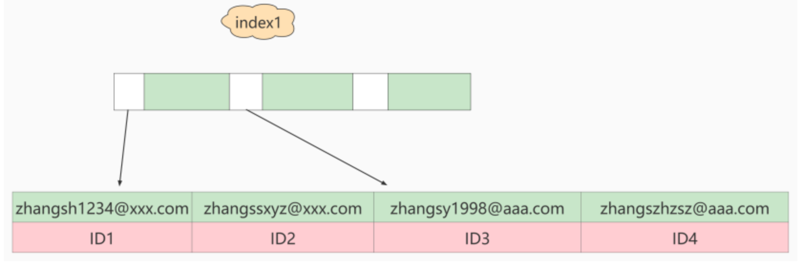

或者

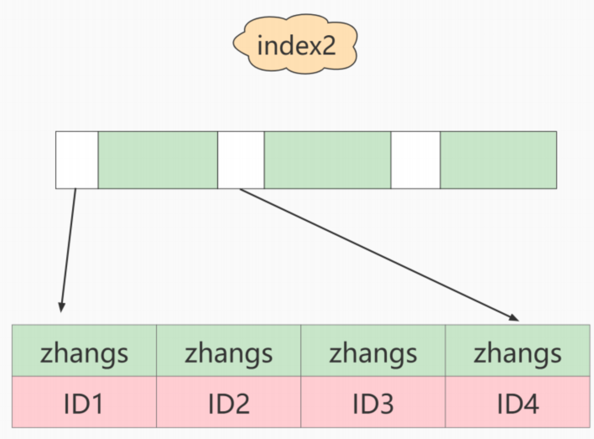

`如果使用的是index1`（即email整个字符串的索引结构），执行顺序是这样的：

1. 从index1索引树找到满足索引值是’ [zhangssxyz@xxx.com](mailto:zhangssxyz@xxx.com) ’的这条记录，取得ID2的值；
2. 到主键上查到主键值是ID2的行，判断email的值是正确的，将这行记录加入结果集；
3. 取index1索引树上刚刚查到的位置的下一条记录，发现已经不满足email=’ [zhangssxyz@xxx.com](mailto:zhangssxyz@xxx.com) ’的条件了，循环结束。


这个过程中，只需要回主键索引取一次数据，所以系统认为只扫描了一行。


`如果使用的是index2`（即email(6)索引结构），执行顺序是这样的：

1. 从index2索引树找到满足索引值是’zhangs’的记录，找到的第一个是ID1；
2. 到主键上查到主键值是ID1的行，判断出email的值不是’ [zhangssxyz@xxx.com](mailto:zhangssxyz@xxx.com) ’，这行记录丢弃；
3. 取index2上刚刚查到的位置的下一条记录，发现仍然是’zhangs’，取出ID2，再到ID索引上取整行然后判断，这次值对了，将这行记录加入结果集；
4. 重复上一步，直到在idxe2上取到的值不是’zhangs’时，循环结束。

也就是说使用前缀索引，定义好长度，就可以做到既节省空间，又不用额外增加太多的查询成本。前面已经讲过区分度，区分度越高越好。因为区分度越高，意味着重复的键值越少。

## 9.2 前缀索引对覆盖索引的影响

> 结论：
> 使用前缀索引就用不上覆盖索引对查询性能的优化了，这也是你在选择是否使用前缀索引时需要考虑的一个因素。


# 十、索引下推

Index Condition Pushdown(ICP)是MySQL 5.6中新特性，是一种在存储引擎层使用索引过滤数据的一种优化方式。ICP可以减少存储引擎访问基表的次数以及MySQL服务器访问存储引擎的次数。

## 10.1 使用前后对比

- 如果没有ICP，存储引擎会遍历索引以定位基表中的行，并将它们返回给MySQL服务器，由MySQL服务器评估WHERE后面的条件是否保留行。

- 启用ICP后，如果部分WHERE条件可以仅使用索引中的列进行筛选，则mysql服务器会把这部分WHERE条件放到存储引擎筛选。然后，存储引擎通过使用索引条目来筛选数据，并且只有在满足这一条件时才从表中读取行。

   

好处:ICP可以减少存储引擎必须访问基表的次数和MySQL服务器必须访问存储引擎的次数。

但是，ICP的加速效果取决于在存储引擎内通过ICP筛选掉的数据的比例。

## 10.2 ICP的使用条件

1. 只能用于二级索引(secondary index)

2. explain显示的执行计划中type值（join 类型）为 range 、 ref 、 eq_ref 或者 ref_or_null 。

3. 并非全部where条件都可以用ICP筛选，如果where条件的字段不在索引列中，还是要读取整表的记录到server端做where过滤。

4. ICP可以用于MyISAM和InnnoDB存储引擎

5. MySQL 5.6版本的不支持分区表的ICP功能，5.7版本的开始支持。

6. 当SQL使用覆盖索引时，不支持ICP优化方法。


## 10.3 ICP使用案例

案例1

```sql
SELECT * FROM tuser 
WHERE NAME LIKE '张%' 
AND age = 10 AND ismale = 1;
```

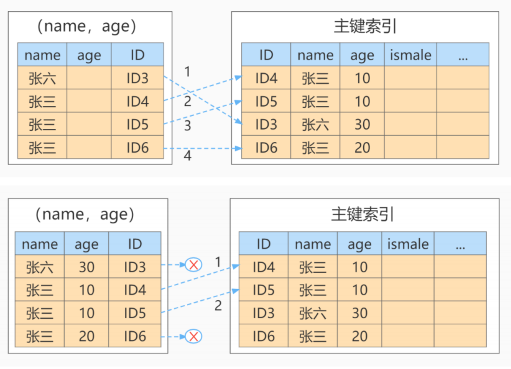

# 十一、普通索引 vs 唯一索引

从性能的角度考虑，你选择唯一索引还是普通索引呢？选择的依据是什么呢？

假设，我们有一个主键列为ID的表，表中有字段k，并且在k上有索引，假设字段 k 上的值都不重复。


这个表的建表语句是：

```sql
mysql> create table test( 
	id int primary key, 
	k int not null, 
	name varchar(16), 
	index (k) 
)engine=InnoDB;
```

表中R1~R5的(ID,k)值分别为(100,1)、(200,2)、(300,3)、(500,5)和(600,6)。

## 11.1 查询过程

假设，执行查询的语句是 `select id from test where k=5`。

- 对于普通索引来说，查找到满足条件的第一个记录(5,500)后，需要查找下一个记录，直到碰到第一个不满足k=5条件的记录。
- 对于唯一索引来说，由于索引定义了唯一性，查找到第一个满足条件的记录后，就会停止继续检索。

那么，这个不同带来的性能差距会有多少呢？答案是， 微乎其微 。


## 11.2 更新过程

为了说明普通索引和唯一索引对更新语句性能的影响这个问题，介绍一下change buffer。


当需要更新一个数据页时，如果数据页在内存中就直接更新，而如果这个数据页还没有在内存中的话，在不影响数据一致性的前提下， **InooDB会将这些更新操作缓存在change buffer中** ，这样就不需要从磁盘中读入这个数据页了。在下次查询需要访问这个数据页的时候，将数据页读入内存，然后执行change buffer中与这个页有关的操作。通过这种方式就能保证这个数据逻辑的正确性。


将change buffer中的操作应用到原数据页，得到最新结果的过程称为 `merge` 。除了 `访问这个数据页` 会触发merge外，系统有 后台线程会定期 merge。在 数据库正常关闭（shutdown） 的过程中，也会执行merge操作。


如果能够将更新操作先记录在change buffer， 减少读磁盘 ，语句的执行速度会得到明显的提升。而且，数据读入内存是需要占用 buffer pool 的，所以这种方式还能够 避免占用内存 ，提高内存利用率。


`唯一索引的更新就不能使用change buffer` ，实际上也只有普通索引可以使用。


如果要在这张表中插入一个新记录(4,400)的话，InnoDB的处理流程是怎样的？


## 11.3 change buffer的使用场景

1. 普通索引和唯一索引应该怎么选择？其实，这两类索引在查询能力上是没差别的，主要考虑的是对 更新性能 的影响。所以，建议你 尽量选择普通索引 。
2. 在实际使用中会发现， 普通索引 和 change buffer 的配合使用，对于 数据量大 的表的更新优化还是很明显的。
3. 如果所有的更新后面，都马上 伴随着对这个记录的查询 ，那么你应该 关闭change buffer 。而在其他情况下，change buffer都能提升更新性能。
4. 由于唯一索引用不上change buffer的优化机制，因此如果 业务可以接受 ，从性能角度出发建议优先考虑非唯一索引。但是如果"业务可能无法确保"的情况下，怎么处理呢？


首先， 业务正确性优先 。我们的前提是“业务代码已经保证不会写入重复数据”的情况下，讨论性能问题。如果业务不能保证，或者业务就是要求数据库来做约束，那么没得选，必须创建唯一索引。这种情况下，本节的意义在于，如果碰上了大量插入数据慢、内存命中率低的时候，给你多提供一个排查思路。

然后，在一些“ 归档库 ”的场景，你是可以考虑使用唯一索引的。比如，线上数据只需要保留半年，然后历史数据保存在归档库。这时候，归档数据已经是确保没有唯一键冲突了。要提高归档效率，可以考虑把表里面的唯一索引改成普通索引。


# 十二、其它查询优化策略

## 12.1 EXISTS 和 IN 的区分

问题：

不太理解哪种情况下应该使用 EXISTS，哪种情况应该用 IN。选择的标准是看能否使用表的索引吗？


回答:

索引是个前提，其实选择与否还是要看表的大小。你可以将选择的标准理解为小表驱动大表。在这种方式下效率是最高的。


比如下面这样:

```sql
SELECT * FROM A WHERE cc IN (SELECT cc FROM B)
SELECT * FROM A WHERE EXISTS (SELECT cc FROM B WHERE B.cc=A.cc)
```

当A小于B时，用EXISTS。因为EXISTS的实现，相当于外表循环，实现的逻辑类似于:

```sql
for i in A
	for j in B
		if j.cc == i.cc then
```

当B小于A时用IN，因为实现的逻辑类似于:

```sql
for i in B
	for j in A
		if j.cc == i.cc then ...
```

哪个表小就用哪个表来驱动，A表小就用EXISTS，B表小就用IN。


## 12.2 COUNT(*)与COUNT(具体字段)效率

问：在 MySQL 中统计数据表的行数，可以使用三种方式： SELECT COUNT(*) 、 SELECT COUNT(1) 和 SELECT COUNT(具体字段) ，使用这三者之间的查询效率是怎样的？

答:

前提:如果你要统计的是某个字段的非空数据行数，则另当别论，毕竟比较执行效率的前提是结果一样才可以。


**环节1**: COUNT(*)和COUNT(1)都是对所有结果进行COUNT，COUNT(*)和COUNT(1)本质上并没有区别(二者执行时间可能略有差别，不过你还是可以把它俩的执行效率看成是相等的)。如果有WHERE子句，则是对所有符合筛选条件的数据行进行统计;如果没有WHERE子句，则是对数据表的数据行数进行统计。


**环节2**:如果是MyISAM存储引擎，统计数据表的行数只需要O(1)的复杂度，这是因为每张MyISAM的数据表都有一个meta 信息存储了row_count值，而一致性则由表级锁来保证。


如果是InnoDB存储引擎，因为InnoDB支持事务，采用行级锁和MVCC机制，所以无法像MyISAM一样，维护一个row_count变量，因此需要采用扫描全表，进行循环＋计数的方式来完成统计，是O(N)级别复杂度。


**环节3**:在InnoDB引擎中，如果采用COUNT(具体字段)来统计数据行数，要尽量采用二级索引。因为主键采用的索引是聚簇索引，聚簇索引包含的信息多，明显会大于二级索引(非聚簇索引)。对于COUNT(*)和COUNT(1)来说，它们不需要查找具体的行，只是统计行数，系统会自动采用占用空间更小的二级索引来进行统计。


如果有多个二级索引，会使用key_len 小的二级索引进行扫描。当没有二级索引的时候，才会采用主键索引来进行统计。


## 12.3 关于SELECT(*)

在表查询中，建议明确字段，不要使用 * 作为查询的字段列表，推荐使用SELECT <字段列表> 查询。原因：

1. MySQL 在解析的过程中，会通过 查询数据字典 将"*"按序转换成所有列名，这会大大的耗费资源和时间。

2. 无法使用 覆盖索引

## 12.4 LIMIT 1 对优化的影响

针对的是会扫描全表的 SQL 语句，如果你可以确定结果集只有一条，那么加上 LIMIT 1 的时候，当找到一条结果的时候就不会继续扫描了，这样会加快查询速度。


如果数据表已经对字段建立了唯一索引，那么可以通过索引进行查询，不会全表扫描的话，就不需要加上 LIMIT 1 了。


## 12.5 多使用COMMIT

只要有可能，在程序中尽量多使用 COMMIT，这样程序的性能得到提高，需求也会因为 COMMIT 所释放的资源而减少。


COMMIT 所释放的资源：

- 回滚段上用于恢复数据的信息

- 被程序语句获得的锁

- redo / undo log buffer 中的空间

- 管理上述 3 种资源中的内部花费

# 十三、淘宝数据库，主键如何设计的？

自增ID做主键，简单易懂，几乎所有数据库都支持自增类型，只是实现上各自有所不同而已。自增ID除了简单，其他都是缺点，总体来看存在以下几方面的问题：


1. 可靠性不高

   存在自增ID回溯的问题，这个问题直到最新版本的MySQL 8.0才修复。

2. 安全性不高

   对外暴露的接口可以非常容易猜测对应的信息。比如：/User/1/这样的接口，可以非常容易猜测用户ID的值为多少，总用户数量有多少，也可以非常容易地通过接口进行数据的爬取。

3. 性能差

   自增ID的性能较差，需要在数据库服务器端生成。

4. 交互多

   业务还需要额外执行一次类似 last_insert_id() 的函数才能知道刚才插入的自增值，这需要多一次的网络交互。在海量并发的系统中，多1条SQL，就多一次性能上的开销。

5. 局部唯一性

   最重要的一点，自增ID是局部唯一，只在当前数据库实例中唯一，而不是全局唯一，在任意服务器间都是唯一的。对于目前分布式系统来说，这简直就是噩梦。

## 13.2 业务字段做主键

为了能够唯一地标识一个会员的信息，需要为 会员信息表 设置一个主键。那么，怎么为这个表设置主键，才能达到我们理想的目标呢？ 这里我们考虑业务字段做主键。

表数据如下：

| cardno   | membername | memberphone | memberpid      | address | sex  | birthday   |
| -------- | ---------- | ----------- | -------------- | ------- | ---- | ---------- |
| 10000001 | 张三       | 12356789    | 11223344556677 | 北京    | 男   | 2000-01-01 |
| 10000002 | 李四       | 12345678    | 22334455667788 | 上海    | 女   | 1990-01-01 |

在这个表里，哪个字段比较合适呢？

1. 选择卡号（cardno）

​	会员卡号（cardno）看起来比较合适，因为会员卡号不能为空，而且有唯一性，可以用来 标识一条会员记录。

```sql
mysql> CREATE TABLE demo.membermaster
-> (
-> cardno CHAR(8) PRIMARY KEY, -- 会员卡号为主键
-> membername TEXT,
-> memberphone TEXT,
-> memberpid TEXT,
-> memberaddress TEXT,
-> sex TEXT,
-> birthday DATETIME
-> ); 
Query OK, 0 rows affected (0.06 sec)
```

不同的会员卡号对应不同的会员，字段“cardno”唯一地标识某一个会员。如果都是这样，会员卡号与会员一一对应，系统是可以正常运行的。


但实际情况是， 会员卡号可能存在重复使用 的情况。比如，张三因为工作变动搬离了原来的地址，不再到商家的门店消费了 （退还了会员卡），于是张三就不再是这个商家门店的会员了。但是，商家不想让这个会 员卡空着，就把卡号是“10000001”的会员卡发给了王五。


从系统设计的角度看，这个变化只是修改了会员信息表中的卡号是“10000001”这个会员 信息，并不会影响到数据一致性。也就是说，修改会员卡号是“10000001”的会员信息， 系统的各个模块，都会获取到修改后的会员信息，不会出现“有的模块获取到修改之前的会员信息，有的模块获取到修改后的会员信息，而导致系统内部数据不一致”的情况。因此，从 信息系统层面 上看是没问题的。


但是从使用 系统的业务层面 来看，就有很大的问题 了，会对商家造成影响。


比如，我们有一个销售流水表（trans），记录了所有的销售流水明细。2020 年 12 月 01 日，张三在门店购买了一本书，消费了 89 元。那么，系统中就有了张三买书的流水记录，如下所示：

| transaactionno(流水单号) | itemnumber(商品编号) | quantity(销售数量) | price(价格) | salevalue(销售金额) | cardno(会员卡号) | transdate(交易时间) |
| ------------------------ | -------------------- | ------------------ | ----------- | ------------------- | ---------------- | ------------------- |
| 1                        | 1                    | 1                  | 10          | 10                  | 1000001          | 2022-01-01          |

 接着，我们查询一下 2020 年 12 月 01 日的会员销售记录：

```sql
mysql> SELECT b.membername,c.goodsname,a.quantity,a.salesvalue,a.transdate
	FROM demo.trans AS a
  JOIN demo.membermaster AS b
  JOIN demo.goodsmaster AS c
  ON (a.cardno = b.cardno AND a.itemnumber=c.itemnumber); 
+------------+-----------+----------+------------+---------------------+
| membername | goodsname | quantity | salesvalue |      transdate      | 
+------------+-----------+----------+------------+---------------------+
|     张三   |       书  |     1.000 |      89.00 | 2020-12-01 00:00:00 | 
+------------+-----------+----------+------------+---------------------+
1 row in set (0.00 sec)
```

如果会员卡“10000001”又发给了王五，我们会更改会员信息表。导致查询时：

```sql
mysql> SELECT b.membername,c.goodsname,a.quantity,a.salesvalue,a.transdate
 FROM demo.trans AS a
 JOIN demo.membermaster AS b
 JOIN demo.goodsmaster AS c
 ON (a.cardno = b.cardno AND a.itemnumber=c.itemnumber); 
+------------+-----------+----------+------------+---------------------+
| membername | goodsname | quantity | salesvalue |     transdate       | 
+------------+-----------+----------+------------+---------------------+
|    王五    |     书     |   1.000  |    89.00   | 2020-12-01 00:00:00 | 
+------------+-----------+----------+------------+---------------------+
1 row in set (0.01 sec)
```

这次得到的结果是：王五在 2020 年 12 月 01 日，买了一本书，消费 89 元。显然是错误的！结论：千万不能把会员卡号当做主键。


会员电话可以做主键吗？不行的。在实际操作中，手机号也存在 被运营商收回 ，重新发给别人用的情况。


那身份证号行不行呢？好像可以。因为身份证决不会重复，身份证号与一个人存在一一对 应的关系。可问题是，身份证号属于 个人隐私 ，顾客不一定愿意给你。要是强制要求会员必须登记身份证号，会把很多客人赶跑的。其实，客户电话也有这个问题，这也是我们在设计会员信息表的时候，允许身份证号和电话都为空的原因。


所以，建议尽量不要用跟业务有关的字段做主键。毕竟，作为项目设计的技术人员，我们谁也无法预测在项目的整个生命周期中，哪个业务字段会因为项目的业务需求而有重复，或者重用之类的情况出现。

>经验：
>刚开始使用 MySQL 时，很多人都很容易犯的错误是喜欢用业务字段做主键，想当然地认为了解业务需求，但实际情况往往出乎意料，而更改主键设置的成本非常高。


## 13.3 淘宝的主键设计

在淘宝的电商业务中，订单服务是一个核心业务。请问， 订单表的主键 淘宝是如何设计的呢？是自增ID吗？

打开淘宝，看一下订单信息：


从上图可以发现，订单号不是自增ID！我们详细看下上述4个订单号：

```sh
1550672064762308113 
1481195847180308113 
1431156171142308113 
1431146631521308113
```

订单号是19位的长度，且订单的最后5位都是一样的，都是08113。且订单号的前面14位部分是单调递增的。

大胆猜测，淘宝的订单ID设计应该是：

```sh
订单ID = 时间 + 去重字段 + 用户ID后6位尾号
```

这样的设计能做到全局唯一，且对分布式系统查询及其友好。

## 13.4 推荐的主键设计

**非核心业务** ：对应表的主键自增ID，如告警、日志、监控等信息。

**核心业务** ：主键设计至少应该是全局唯一且是单调递增。全局唯一保证在各系统之间都是唯一的，单调递增是希望插入时不影响数据库性能。


这里推荐最简单的一种主键设计：UUID。


### UUID的特点：

全局唯一，占用36字节，数据无序，插入性能差。

- MySQL数据库的UUID组成如下所示：

```bash
UUID = 时间+UUID版本（16字节）- 时钟序列（4字节） - MAC地址（12字节）
```

我们以UUID值e0ea12d4-6473-11eb-943c-00155dbaa39d举例：

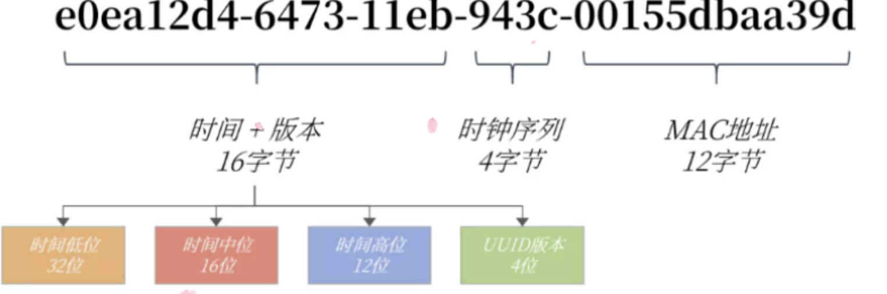


### 为什么UUID是全局唯一的？

在UUID中时间部分占用60位，存储的类似TIMESTAMP的时间戳，但表示的是从1582-10-15 00：00：00.00到现在的100ns的计数。可以看到UUID存储的时间精度比TIMESTAMPE更高，时间维度发生重复的概率降低到1/100ns。


时钟序列是为了避免时钟被回拨导致产生时间重复的可能性。MAC地址用于全局唯一。


### 为什么UUID占用36个字节？

UUID根据字符串进行存储，设计时还带有无用"-"字符串，因此总共需要36个字节。

### 为什么UUID是随机无序的呢？

因为UUID的设计中，将时间低位放在最前面，而这部分的数据是一直在变化的，并且是无序。

### 改造UUID

若将时间高低位互换，则时间就是单调递增的了，也就变得单调递增了。MySQL 8.0可以更换时间低位和时间高位的存储方式，这样UUID就是有序的UUID了。

MySQL 8.0还解决了UUID存在的空间占用的问题，除去了UUID字符串中无意义的"-"字符串，并且将字符串用二进制类型保存，这样存储空间降低为了16字节。


可以通过MySQL8.0提供的uuid_to_bin函数实现上述功能，同样的，MySQL也提供了bin_to_uuid函数进行转化：

```sql
SET @uuid = UUID(); 

SELECT @uuid,uuid_to_bin(@uuid),uuid_to_bin(@uuid,TRUE);
```

通过函数uuid_to_bin(@uuid,true)将UUID转化为有序UUID了。全局唯一 + 单调递增，这不就是我们想要的主键！


### 有序UUID性能测试

16字节的有序UUID，相比之前8字节的自增ID，性能和存储空间对比究竟如何呢？


我们来做一个测试，插入1亿条数据，每条数据占用500字节，含有3个二级索引，最终的结果如下所示：

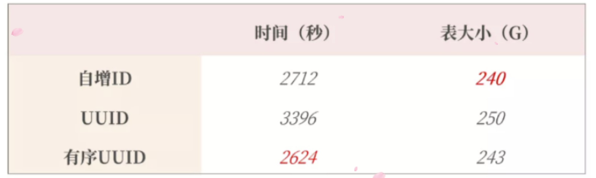

从上图可以看到插入1亿条数据有序UUID是最快的，而且在实际业务使用中有序UUID在 业务端就可以生 成 。还可以进一步减少SQL的交互次数。


另外，虽然有序UUID相比自增ID多了8个字节，但实际只增大了3G的存储空间，还可以接受。

> 在当今的互联网环境中，非常不推荐自增ID作为主键的数据库设计。更推荐类似有序UUID的全局唯一的实现。
>
> 另外在真实的业务系统中，主键还可以加入业务和系统属性，如用户的尾号，机房的信息等。这样的主键设计就更为考验架构师的水平了。


### 如果不是MySQL8.0 肿么办？

手动赋值字段做主键！

比如，设计各个分店的会员表的主键，因为如果每台机器各自产生的数据需要合并，就可能会出现主键重复的问题。


可以在总部 MySQL 数据库中，有一个管理信息表，在这个表中添加一个字段，专门用来记录当前会员编号的最大值。


门店在添加会员的时候，先到总部 MySQL 数据库中获取这个最大值，在这个基础上加 1，然后用这个值作为新会员的“id”，同时，更新总部 MySQL 数据库管理信息表中的当 前会员编号的最大值。


这样一来，各个门店添加会员的时候，都对同一个总部 MySQL 数据库中的数据表字段进 行操作，就解决了各门店添加会员时会员编号冲突的问题。
