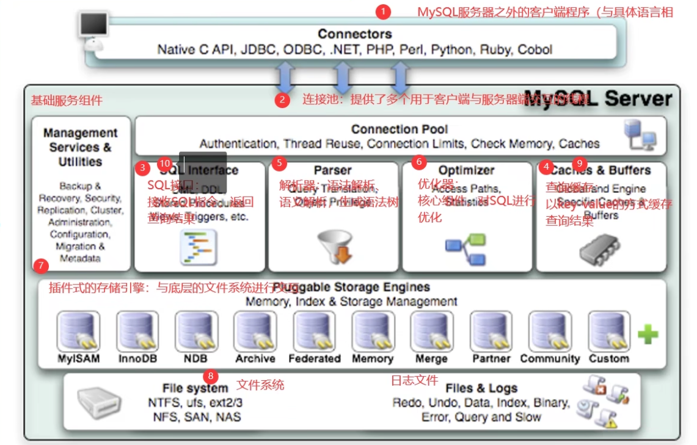
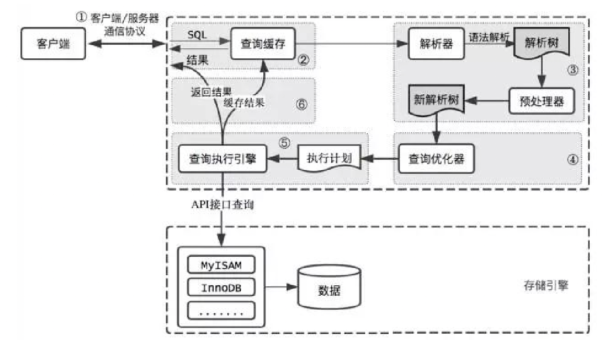
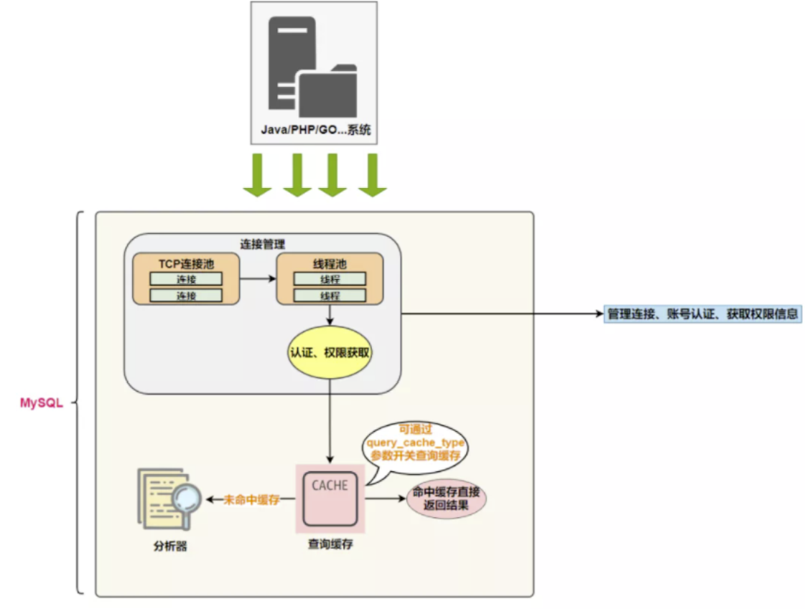
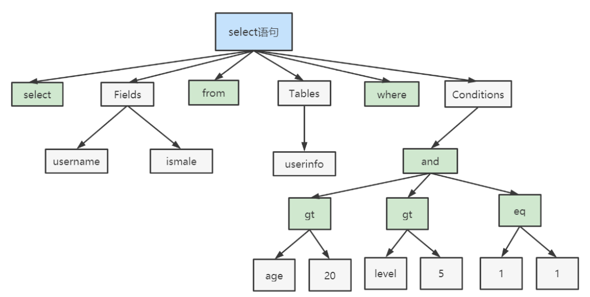
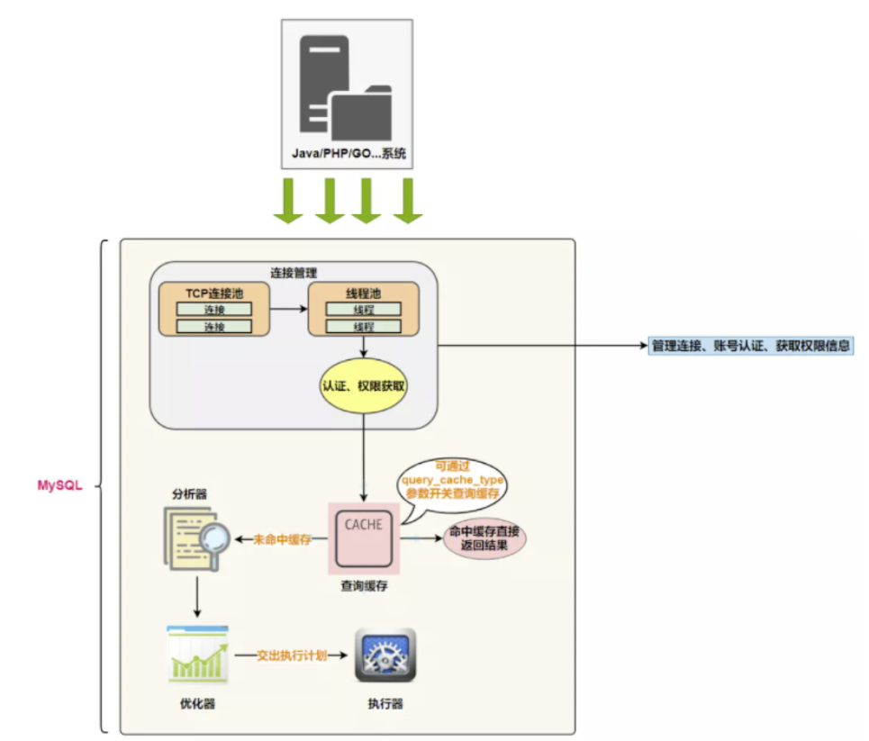
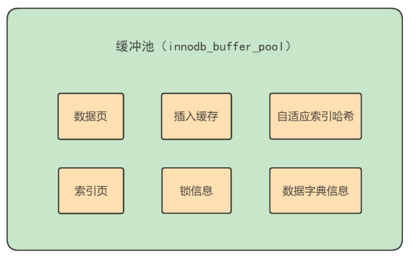
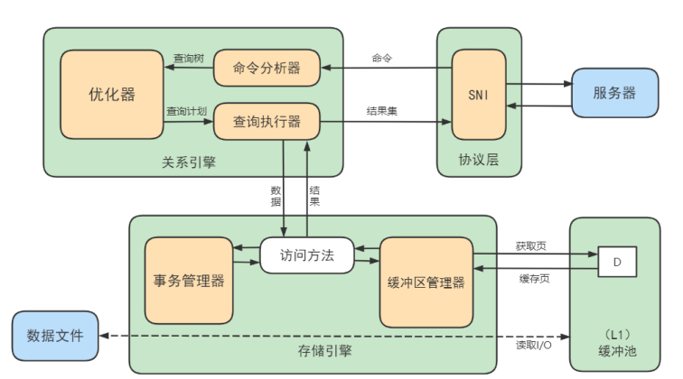
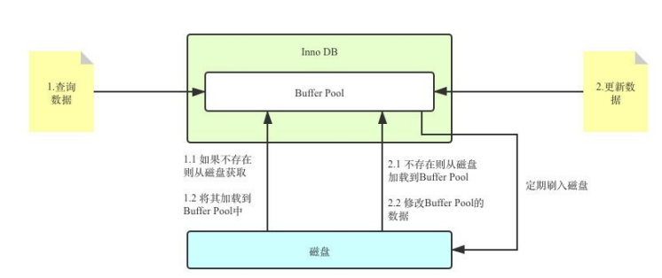

---
# 一、MySQL 逻辑架构剖析

大体来说, mysql 分为 Server 和 存储引擎两部分。

Server 层包括连接器、查询缓存、分析器、优化器、执行器等，涵盖 MySQL 的大多数核心服务功能，以及所有的内置函数（如日期、时间、数学和加密函数等），所有跨存储引擎的功能都在这一层实现，比如存储过程、触发器、视图等。

而存储引擎层负责数据的存储和提取。其架构模式是插件式的，支持 InnoDB、MyISAM、Memory 等多个存储引擎。现在最常用的存储引擎是 InnoDB，它从 MySQL 5.5.5 版本开始成为了默认存储引擎。

执行 create table 建表的时候，如果不指定引擎类型，默认使用的就是 InnoDB。不过，也可以通过指定存储引擎的类型来选择别的引擎，比如在 create table 语句中使用 engine=memory, 来指定使用内存引擎创建表。不同存储引擎的表数据存取方式不同，支持的功能也不同.


展开图



## 1.1 Connectors 
Connector 指的是不同语言中, 与 SQL 的交互。MySQL 首先是一个网络程序, 在 TCP 之上定义了自己的应用层协议。所以要是用 MySQL，可以编写代码，跟 MySQL Server 建立 TCP 连接，之后按照其定义好的协议进行交互。或者比较简单的方法是调用 SDK，例如 Native C API、JDBC、PHP 等各种语言的 MySQL Connector，或者通过 ODBC。但通过 SDK 来访问 MySQL，本质上还是在 TCP 连接上通过 MySQL 协议跟 MySQL 进行交互。

## 1.2 连接层
当执行 `mysql -u$user -p -P$Port -h$ip` 连接 mysql 数据库时, 首先会经过连接器。 连接器负责跟客户`建立连接、获取权限、维持和管理连接`。

- 如果输入的用户名或密码不对，就提示 `Access denied for user` 的错误信息；
- 如果用户名密码认证通过，连接器会到权限表里面查出登录用户的所有权限，之后这次连接里面所有的操作，都依赖此时读到的权限，也就是说，如果用户登录到MySQL 之后，管理员修改了他的权限，也不会影响当前登录连接的权限，除非重新创建连接。

连接完成后，如果没有后续操作，这个连接就会处于空闲状态，可以执行 `show processlist` 查询连接信息。例如下图中，`Command` 列显示为 `Sleep`, 就表示这是一个空闲连接。

```sql
mysql> show processlist;
+----+-----------------+-----------+------+---------+-------+------------------------+------------------+
| Id | User            | Host      | db   | Command | Time  | State                  | Info             |
+----+-----------------+-----------+------+---------+-------+------------------------+------------------+
|  5 | event_scheduler | localhost | NULL | Daemon  | 45581 | Waiting on empty queue | NULL             |
| 14 | root            | localhost | NULL | Query   |     0 | init                   | show processlist |
| 15 | root            | localhost | NULL | Sleep   |     2 |                        | NULL             |
+----+-----------------+-----------+------+---------+-------+------------------------+------------------+
3 rows in set (0.00 sec)
```

如果客户端太长时间没有后续操作，连接器就会自动将它断开。这个参数由: `wait_timeout` 控制，默认是 8 小时。

```mysql
mysql> show variables like 'wait_timeout';
+---------------+-------+
| Variable_name | Value |
+---------------+-------+
| wait_timeout  | 28800 |
+---------------+-------+
1 row in set (0.00 sec)
```

### 设置超时时间

在程序中连接数据库，分为长连接和短连接，长连接是说，如果客户端持续有请求，则一直使用同一个连接；短连接则是每次执行完很少的几次查询就断开连接，下次查询再重新创建一个。

如果所有的连接都是用长链接，MySQL 占用的内存会涨的特别快，这是因为 MySQL 在执行过程中临时使用的内存是管理在连接对象里面的，这些资源在连接断开的时候才释放，所以如果长连接累积下来，可能导致占用内存太大，被系统强行杀掉(OOM)，从现象上就是 MySQL 异常重启了。解决这个的两个方案:
1. 定期断开长连接。使用一段时间，或者程序里面判断执行过一个占用内存的大查询后，断开连接，之后要查询再重连。
2. 在 MySQ5.7 之后，可以在每次执行一个比较大的操作后，通过 [mysql_reset_connection](https://dev.mysql.com/doc/c-api/5.7/en/mysql-reset-connection.html) 来重新初始化连接资源。这个过程不需要重新连接和重新做权限校验，但是会将连接恢复到刚刚创建完时的状态。


## 1.3 服务层
- SQL Interface: SQL 接口
  - 接收用户的 SQL 命令，并且返回用户需要查询的结果。
  - MySQL 支持 DML、DDL、存储过程、视图、触发器、自定义函数等多种 SQL 语言接口。
- Parser: 解析器
  - 分析器的主要作用，是对 SQL 语句做 `词法解析、语法解析`。 在未命中查询缓存，分析器就会开始做 `词法解析`，MySQL 从输入的 `select` 关键字识别出这是查询语句, 把字符串 T 识别成 表名T，把字符串 ID 识别成 列ID。 做完 `此法解析` 后，还需要做 `语法解析`， 根据 `词法解析` 的结果，`语法分析器`会根据语法规则，判断输入的 SQL 语句是否满足 MySQL 语法要求。 如果语句不对，就会收到 `You have an error in your SQL syntax` 的错误信息:
    ```sql
    mysql> elect * from t where id=10;
    ERROR 1064 (42000): You have an error in your SQL syntax; check the manual that corresponds to your MySQL server version for the right syntax to use near 'elect * from t where ID=10' at line 1
    ```
  - 在 SQL 命令传递到解析器的时候，会被解析器验证和解析，并为其创建**语法树**，并根据数据字典丰富查询语法树，会**验证该客户端是否具有执行该查询的权限**。创建好语法树后，MySQL 还会对 SQL 查询进行语法上的优化，进行查询重写。
- Optimizer: 查询优化器
  - 优化器是在表里面有多个索引的时候，决定使用哪个索引；或者在一个语句有多个表关联(join)的时候，决定各个表的连接顺序，比如执行如下sql:
    ```sql
    mysql> select * from t1 join t1 using(ID) where t1.c=10 and t2.d=20;
    ```
  - 既可以先从表 t1 里面取出 c=10 的记录的ID值，再根据 ID 值关联到表 t2，再判断 t2 里面 d 的值是否等于 20.
  - 也可以先从表 t2 取出 d=20 的记录的 ID 值，再根据 ID 值关联到 t1，再判断 t1 里面 c 的值是否等于 10.
  - 这两种执行方法的逻辑结果是一样的，但是执行的效率会有不同，而优化器的作用就是决定选择哪一个方案。
- Caches & Buffers: 查询缓存组件
  - 说明：在 MySQL8 中，查询缓存已经被删除。
  - 在连接建立完成后，执行 select 语句，mysql 会先到查询缓存看看，之前如果执行过这条语句，则会将结果以 key-value 的形式，直接缓存在内存中，key是查询语句，value是查询结果，如果查询缓存中找到了这个key，则value会被直接返回给客户端。
  - 查询缓存的失效是非常频繁的，只要有表更新，这个表对应的查询缓存都会被清空，因此可能会产生：刚把结果缓存起来，还没使用，表被更新，查询环境就失效了。
  - mysql 也可以按需开启查询缓存，需要设置参数: `query_cache_type` 为 `DEMAND`,这样所有的查询都不用查询缓存，对于需要缓存的语句使用 `SQL_CACHE` 显示指定:
    ```mysql
    mysql> select SQL_CACHE * from T where ID=10;
    ```

## 1.4 引擎层
插件式存储引擎层(Storage Engines), 真正的负责了 MySQL 中数据的存储和提取，对物理服务器级别维护的底层数据执行操作，服务器通过 API 与存储引擎进行通信。不同的存储引擎具有不同的功能。

MySQL8 默认支持的存储引擎:
```mysql
mysql> show engines;
+--------------------+---------+----------------------------------------------------------------+--------------+------+------------+
| Engine             | Support | Comment                                                        | Transactions | XA   | Savepoints |
+--------------------+---------+----------------------------------------------------------------+--------------+------+------------+
| FEDERATED          | NO      | Federated MySQL storage engine                                 | NULL         | NULL | NULL       |
| MEMORY             | YES     | Hash based, stored in memory, useful for temporary tables      | NO           | NO   | NO         |
| InnoDB             | DEFAULT | Supports transactions, row-level locking, and foreign keys     | YES          | YES  | YES        |
| PERFORMANCE_SCHEMA | YES     | Performance Schema                                             | NO           | NO   | NO         |
| MyISAM             | YES     | MyISAM storage engine                                          | NO           | NO   | NO         |
| MRG_MYISAM         | YES     | Collection of identical MyISAM tables                          | NO           | NO   | NO         |
| BLACKHOLE          | YES     | /dev/null storage engine (anything you write to it disappears) | NO           | NO   | NO         |
| CSV                | YES     | CSV storage engine                                             | NO           | NO   | NO         |
| ARCHIVE            | YES     | Archive storage engine                                         | NO           | NO   | NO         |
+--------------------+---------+----------------------------------------------------------------+--------------+------+------------+
9 rows in set (0.00 sec)
```

## 1.5 存储层
所有的数据、数据库、表的定义、表的每一行内容、索引，都是存在文件系统上的，以文件的方式存在的，并完成与存储引擎的交互。当然厚些存储引擎比如 InnoDB，也支持不使用文件系统直接管理裸设备，但现代文件系统的实现使得这样做没有必要了。在文件系统之下，可以使用本地磁盘，可以使用 DAS、NAS、SAN等各种存储系统。


# 二、SQL 执行流程
## 2.1 MySQL 中的 SQL 执行流程


### 2.1.1 MySQL 查询流程
**查询缓存**: Server 如果在查询缓存中发现了这条 SQL 语句，就会直接将结果返回给客户端；如果没有，就进入到解析器阶段。需要说明的是，因为查询缓存往往效率不高，所以在 MySQL8.0 之后就抛弃了这个功能。

查询缓存是提前把查询结果缓存起来，这样下次不需要执行就可以直接拿到结果。需要说明的是，在 MySQL 中的查询缓存，不是缓存查询计划，而是缓存查询对应的结果。这就意味着查询匹配的**鲁棒性大大降低**，只有**相同的查询操作才会命中查询缓存**。两个查询请求在任何字符上的不同(例如: 空格、注释、大小写)，都会导致缓存不命中。因此 MySQL 的**查询缓存命中率不高**。

同时，如果查询请求中包含某些系统函数、用户自定义变量和函数、一些系统表(mysql、information_schema、performance_schema数据库中的表)，那么这个请求就不会被缓存。一某些系统函举例，可能同样的函数的两次调用会产生不一样的结果，比如 `NOW`，每次调用都会产生最新的当前时间，如果在一个查询请求中调用了这个函数，那即使查询请求的文本信息都一样，那不同时间的两次查询也就应该得到不同的结果，如果在第一次查询的时候就缓存了，那第二次查询的时候直接使用第一次查询的结果就是错误的。

此外，既然是缓存，那就有它**缓存失效的时候**。MySQL 的缓存系统会检测涉及到的每张表，只要该表的结构或者数据被修改，如果对该表使用了 `INSERT`、`UPDATE`、`DELETE`、`TRUNCATE`、`ALTER`、`DROP TABLE` 或 `DROP DATABASE`语句，那么使用该表的所有高速缓存查询豆浆变成无效并高速缓存中删除。对于**更新压力大的数据库**来说，查询缓存的命中率会非常低。

**解析器**: 在解析器中对 SQL 语句进行词法分析、语法分析



解析器先做 `词法分析`。输入的是由多个字符串和空格组成的一条 SQL 语句，MySQL 需要识别出里面的字符串分别是什么，代表什么。MySQL 从输入的 "SELECT" 关键字识别出来这是一个查询语句。

接着，要做 `语法分析`。根据词法分析的结果，语法分析器(比如: Bison) 会根据语法规则，判断输入的这个 SQL 语句是否**满足 MySQL 语法**。

```mysql
SELECT username,ismale from userinfo where 1=1 and age > 20 and level > 5;
```
 如果 SQL 语句正确，则会生成这样一个语法树



**优化器**: 在优化器中会确定 SQL 语句的执行路径，比如是根据 **全表检**索，还是根据 **索引检索** 等。

例如:[服务层的说明](#13-服务层) ,关于查询优化器的举例。

在查询优化器中，可以分为逻辑查询优化阶段和物理查询优化阶段。

**执行器**: 一个查询到此时，还没有真正的取读写真实的表，仅仅是产出了一个执行计划，然后才进入当前执行器阶段。



在执行之前，需要判断该用户**是否具备权限**
- 如果没有权限，就会返回权限错误。
- 如果具备权限，就执行 SQL 查询并返回结果。在MySQL8以下版本，如果设置了查询缓存，这是会将查询结果进行缓存。

例如: `select * from test where id = 1;`, 在 test 表中 id 字段没有索引，那么执行的流程如下:
- 调用 InnoDB 引擎接口取这个表的第一行，判断 id 值是不是 1，如果不是则跳过，如果是则将这行记录存到结果集中。调用引擎接口取下一行，重复相同的判断逻辑，知道取到这个表的最后一行。
- 执行器将上述遍历过程中所有满足条件的行组成的记录集作为结果集返回给客户端。

至此，这个语句就执行完成了。对于有索引的表，执行的逻辑也差不多。

### 2.1.2 总结
SQL 语句在 MySQL 中的流程是: `SQL 语句` -> `查询缓存` -> `解析器` -> `优化器` -> `执行器`


## 2.2 MySQL8 中的 SQL 执行原理
在 MySQL5.0 之后，提供了 Query profier 功能，它可以查看一条 SQL 的执行时长，还可以查询这条 SQL 消耗了多少 CPU、IO等资源。

### 2.2.1 设置 profiling
```mysql
-- 查看 profiling
mysql> select @@profiling;
+-------------+
| @@profiling |
+-------------+
|           0 |
+-------------+
1 row in set, 1 warning (0.00 sec)

mysql> show variables like 'profiling';
+---------------+-------+
| Variable_name | Value |
+---------------+-------+
| profiling     | OFF   |
+---------------+-------+
1 row in set (0.01 sec)
```

### 2.2.2 开启 profiling
profiling=0 表示关闭，需要把 profiling 打开，设置为 1 即可:
```mysql
set profiling=1;
```

### 2.2.3 多次执行相同的 SQL 查询
```mysql
select * from user;
```

### 2.2.4 查看 profiling
```mysql
mysql> show profiles; -- 显示最近的几次查询
+----------+------------+---------------------------------+
| Query_ID | Duration   | Query                           |
+----------+------------+---------------------------------+
|        1 | 0.00093175 | show variables like 'profiling' |
|        2 | 0.00009725 | SELECT DATABASE()               |
|        3 | 0.00052275 | show databases                  |
|        4 | 0.00054250 | show tables                     |
|        5 | 0.00077125 | show tables                     |
|        6 | 0.00019325 | select * from user              |
|        7 | 0.00018825 | select * from user              |
+----------+------------+---------------------------------+
7 rows in set, 1 warning (0.00 sec)
```

### 2.2.5 查看 profile 
```mysql
mysql> show profile;
+--------------------------------+----------+
| Status                         | Duration |
+--------------------------------+----------+
| starting                       | 0.000054 |
| Executing hook on transaction  | 0.000003 |
| starting                       | 0.000005 |
| checking permissions           | 0.000004 |
| Opening tables                 | 0.000022 |
| init                           | 0.000005 |
| System lock                    | 0.000020 |
| optimizing                     | 0.000003 |
| statistics                     | 0.000010 |
| preparing                      | 0.000011 |
| executing                      | 0.000025 |
| end                            | 0.000003 |
| query end                      | 0.000002 |
| waiting for handler commit     | 0.000006 |
| closing tables                 | 0.000005 |
| freeing items                  | 0.000008 |
| cleaning up                    | 0.000006 |
+--------------------------------+----------+
  17 rows in set, 1 warning (0.00 sec)
```
- `checking permissions`: 检查权限
- `Opening tables`： 打开表
- `init`: 初始化
- `System lock`: 锁系统
- `optimizing`: 查询优化
- `preparing`: 准备
- `executing`: 执行

还可以查询执行的 Query ID
```mysql
show profile for query 7;
```

此外，还可以查询 CPU、Block IO 信息
```mysql
mysql> show profile cpu,block io for query 6;
+--------------------------------+----------+----------+------------+--------------+---------------+
| Status                         | Duration | CPU_user | CPU_system | Block_ops_in | Block_ops_out |
+--------------------------------+----------+----------+------------+--------------+---------------+
| starting                       | 0.000060 | 0.000030 |   0.000029 |            0 |             0 |
| Executing hook on transaction  | 0.000003 | 0.000002 |   0.000002 |            0 |             0 |
| starting                       | 0.000005 | 0.000002 |   0.000002 |            0 |             0 |
| checking permissions           | 0.000003 | 0.000002 |   0.000002 |            0 |             0 |
| Opening tables                 | 0.000023 | 0.000012 |   0.000011 |            0 |             0 |
| init                           | 0.000004 | 0.000001 |   0.000002 |            0 |             0 |
| System lock                    | 0.000005 | 0.000003 |   0.000003 |            0 |             0 |
| optimizing                     | 0.000003 | 0.000001 |   0.000001 |            0 |             0 |
| statistics                     | 0.000010 | 0.000006 |   0.000005 |            0 |             0 |
| preparing                      | 0.000011 | 0.000005 |   0.000005 |            0 |             0 |
| executing                      | 0.000025 | 0.000013 |   0.000013 |            0 |             0 |
| end                            | 0.000002 | 0.000001 |   0.000001 |            0 |             0 |
| query end                      | 0.000002 | 0.000001 |   0.000001 |            0 |             0 |
| waiting for handler commit     | 0.000006 | 0.000003 |   0.000002 |            0 |             0 |
| closing tables                 | 0.000005 | 0.000002 |   0.000003 |            0 |             0 |
| freeing items                  | 0.000021 | 0.000011 |   0.000010 |            0 |             0 |
| cleaning up                    | 0.000006 | 0.000003 |   0.000003 |            0 |             0 |
+--------------------------------+----------+----------+------------+--------------+---------------+
  17 rows in set, 1 warning (0.00 sec)
```


## 2.3 MySQL5.7 中 SQL 执行原理
上述操作在MySQL5.7中测试，发现前后两次相同的sql语句，执行的查询过程仍然是相同的。

在 MySQL5.7 中 显式开启查询缓存模式, 如下设置：

1. 查看查询缓存是否开启
```mysql
mysql> show variables like 'query_cache_type';
+------------------+-------+
| Variable_name    | Value |
+------------------+-------+
| query_cache_type | OFF   |
+------------------+-------+
1 row in set (0.00 sec)
```
2. 开启查询缓存
```bash
## 修改配置文件
$ vi /etc/my.cnf
query_cache_type=1

## 重启服务
$ systemctl restart mysqld

## 再次查看查询缓存是否开启
mysql> show variables like 'query_cache_type';
+------------------+-------+
| Variable_name    | Value |
+------------------+-------+
| query_cache_type | ON    |
+------------------+-------+
1 row in set (0.00 sec)

## 查看查询执行计划是否开启
mysql> show variables like "profiling";
+---------------+-------+
| Variable_name | Value |
+---------------+-------+
| profiling     | OFF   |
+---------------+-------+
1 row in set (0.00 sec)

## 开启查询执行计划(因为重启mysql，所以需要重新开启)
mysql> set profiling=1;
```
执行两次相同语句
```mysql
mysql> select user,host from test1;
```
查看 profiles 
```mysql
mysql> show profiles;
+----------+------------+----------------------------------+
| Query_ID | Duration   | Query                            |
+----------+------------+----------------------------------+
|       1  | 0.00014400 | select * from test1              |
|       2  | 0.00015900 | select * from test1              |
+----------+------------+----------------------------------+
4 rows in set, 1 warning (0.00 sec)
```
查看指定 Query_ID 的 profiles
```mysql
mysql> show profile for query 1;
+--------------------------------+----------+
| Status                         | Duration |
+--------------------------------+----------+
| starting                       | 0.000013 |
| Waiting for query cache lock   | 0.000002 |
| starting                       | 0.000001 |
| checking query cache for query | 0.000025 |
| checking permissions           | 0.000004 |
| Opening tables                 | 0.000009 |
| init                           | 0.000009 |
| System lock                    | 0.000004 |
| Waiting for query cache lock   | 0.000001 |
| System lock                    | 0.000012 |
| optimizing                     | 0.000003 |
| statistics                     | 0.000009 |
| preparing                      | 0.000006 |
| executing                      | 0.000002 |
| Sending data                   | 0.000024 |
| end                            | 0.000002 |
| query end                      | 0.000003 |
| closing tables                 | 0.000003 |
| freeing items                  | 0.000004 |
| Waiting for query cache lock   | 0.000001 |
| freeing items                  | 0.000005 |
| Waiting for query cache lock   | 0.000001 |
| freeing items                  | 0.000001 |
| storing result in query cache  | 0.000002 |
| cleaning up                    | 0.000008 |
+--------------------------------+----------+
25 rows in set, 1 warning (0.00 sec)

mysql> show profile for query 2;
+--------------------------------+----------+
| Status                         | Duration |
+--------------------------------+----------+
| starting                       | 0.000015 |
| Waiting for query cache lock   | 0.000002 |
| starting                       | 0.000001 |
| checking query cache for query | 0.000004 |
| checking privileges on cached  | 0.000002 |
| checking permissions           | 0.000006 |
| sending cached result to clien | 0.000007 |
| cleaning up                    | 0.000003 |
+--------------------------------+----------+
8 rows in set, 1 warning (0.00 sec)
```
query id 为 2 的信息比 id 为 1 的信息少了很多，因为此时是从查询缓存中获取的数据。


# 三、数据库缓冲池(buffer pool)
InnoDB 存储引擎是以页为单位来管理存储空间的，我们进行的增删改查操作本质上都是在访问页面(包括读、写、创建新的页面等操作)。 磁盘 I/O 需要消耗的时间很多，而在内存中进行操作，效率则会高很多，为了能让数据表或者索引中的数据随时被我们所用，DBMS 会申请 `占用内存作为数据缓冲池`，在真正访问页面之前，需要把在磁盘上的页缓存到内存中的 `Buffer Pool` 之后才可以访问。

这样做的好处是可以让磁盘活动最小化，`从而减少与磁盘直接进行 I/O 的时间`。这种策略对提升 SQL 语句的查询性能来说至关重要。如果索引的数据在缓冲池离，那么访问的成本就会降低很多。

## 3.1 缓冲池 和 查询缓存
缓冲池和查询缓存不是一个东西。

### 3.1.1 缓冲池(Buffer Pool)
在 InnoDB 存储引擎中有一部分数据会放到内存中，缓冲池则占了这部分内存的大部分，它用来存储各种数据的缓存



缓存按照 **`位置 * 频率`** 这个原则，帮我们对 I/O 访问效率进行优化。

首先，位置决定效率，提供缓冲池就是为了在内存中可以直接访问数据。

其次，频次决定优先级顺序。因为缓冲池的大小是有限的，比如磁盘有 200G，但是内存只有 16G，缓冲池只有 1G，那么就无法将所有的数据都加载到缓冲池离，这时就涉及到优先级顺序，会**优先对使用频率高的过热数据进行缓存**。


### 3.1.2 查询缓存
查询缓存是提前把 **`查询结果缓存`** 起来，这样下次不需要执行就可以直接拿到结果。需要注意的是，在 MySQL 中的查询缓存，不是查询缓存计划，而是查询对应的结果。因为命中条件苛刻，而且只要数据表发生变化，查询缓存就会失效，因此命中率低。

## 3.2 缓冲池如何读取数据
缓冲池管理器会尽量将经常使用的数据保存起来，在数据库进行页面读操作的时候，首先会判断该页面是否在缓冲池中，如果存在就直接读取，如果不在，就会通过内存活磁盘将页面放到缓冲池中再进行读取。

缓冲池在数据库中的结构和作用图



## 3.3 查看/设置缓冲池的大小
InnoDB 存储引擎可以通过 `innodb_buffer_pool_size` 变量来查看缓冲池的大小
```mysql
mysql> show variables like 'innodb_buffer_pool_size';
+-------------------------+-----------+
| Variable_name           | Value     |
+-------------------------+-----------+
| innodb_buffer_pool_size | 134217728 |
+-------------------------+-----------+
1 row in set (0.00 sec)
```
InnoDB 缓冲池的大小如上所示，只有 `134217728 / 1024 / 1024 = 128M`。

可以通过 set 修改缓冲池大小
```mysql
-- 命令行修改
mysql> set global innodb_buffer_pool_size=268435456;

-- my.cnf 文件修改(需要重启mysql)
[server]
innodb_buffer_pool_size=268435456
```

## 3.4 多个 Buffer Pool
```bash
[server]
innodb_buffer_pool_instances=2
```

那每个 Buffer Pool 实例实际占多少内存空间呢？其实使用这个公式算出来的：

```bash
innodb_buffer_pool_size / innodb_buffer_pool_instances
```

## 3.5 引申问题
Buffer Pool是MySQL内存结构中十分核心的一个组成，你可以先把它想象成一个黑盒子。

黑盒下的更新数据流程



我更新到一半突然发生错误了，想要回滚到更新之前的版本，该怎么办？连数据持久化的保证、事务回滚都做不到还谈什么崩溃恢复？

答案：Redo Log & Undo Log


