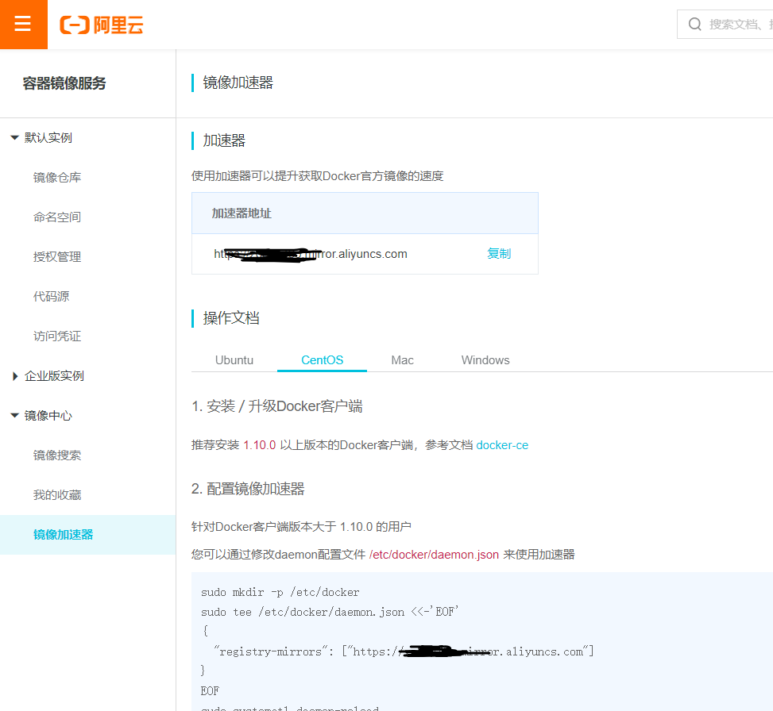

* [一、前提条件](#%E4%B8%80%E5%89%8D%E6%8F%90%E6%9D%A1%E4%BB%B6)
* [二、卸载旧版本](#%E4%BA%8C%E5%8D%B8%E8%BD%BD%E6%97%A7%E7%89%88%E6%9C%AC)
* [三、安装](#%E4%B8%89%E5%AE%89%E8%A3%85)

---

https://zhuanlan.zhihu.com/p/490585683

# 一、前提条件

操作系统要求
要安装Docker Engine-Community，您需要一个CentOS 7的维护版本。不支持或未测试存档版本。

# 二、卸载旧版本
较旧的Docker版本称为docker或docker-engine。如果已安装这些程序，请卸载它们以及相关的依赖项。
```bash
$ sudo yum remove docker docker-client docker-client-latest docker-common docker-latest docker-latest-logrotate docker-logrotate docker-engine
```

# 三、安装
1. 安装所需的软件包。
	yum-utils 提供了yum-config-manager 效用，并device-mapper-persistent-data和lvm2由需要 devicemapper存储驱动程序。
	
	```bash
	$ sudo yum install -y yum-utils device-mapper-persistent-data lvm2
	```
2. 使用以下命令来设置稳定的存储库。
	```bash
	$ sudo yum-config-manager --add-repo http://download.docker.com/linux/centos/docker-ce.repo
	或者
	$ sudo yum-config-manager --add-repo http://mirrors.aliyun.com/docker-ce/linux/centos/docker-ce.repo
	```

3. 安装最新版本的Docker Engine-Community和containerd，或者转到下一步安装特定版本：
	
	```bash
	$ sudo yum install docker-ce docker-ce-cli containerd.io
	```
	Docker已安装但尚未启动。docker创建该组，但没有用户添加到该组。
4. 要安装特定版本的Docker Engine-Community，请在存储库中列出可用版本，然后选择并安装 一种。列出并排序您存储库中可用的版本。此示例按版本号（从高到低）对结果进行排序：
	
	```bash
	$ yum list docker-ce --showduplicates | sort -r
	
	docker-ce.x86_64  3:18.09.1-3.el7                     docker-ce-stable
	docker-ce.x86_64  3:18.09.0-3.el7                     docker-ce-stable
	docker-ce.x86_64  18.06.1.ce-3.el7                    docker-ce-stable
	docker-ce.x86_64  18.06.0.ce-3.el7                    docker-ce-stable
	```
	返回的列表取决于启用了哪些存储库，并且特定于您的CentOS版本（.el7在本示例中以后缀表示）。
5. 通过其完全合格的软件包名称安装特定版本，该软件包名称是软件包名称（docker-ce）加上版本字符串（第二列），从第一个冒号（:）到第一个连字符，以连字符（-）分隔。例如，docker-ce-18.09.1。
	```bash
	$ sudo yum install docker-ce-<VERSION_STRING> docker-ce-cli-<VERSION_STRING> containerd.io 18.06.3.ce-3.el7
	```
6. 启动Docker。
	```bash
	$ sudo systemctl start docker
	$ sudo systemctl enable  docker
	$ sudo docker version
	Client: Docker Engine - Community
	 Version:           19.03.7
	 API version:       1.40
	 Go version:        go1.12.17
	 Git commit:        7141c199a2
	 Built:             Wed Mar  4 01:24:10 2020
	 OS/Arch:           linux/amd64
	 Experimental:      false
	
	Server: Docker Engine - Community
	 Engine:
	  Version:          19.03.7
	  API version:      1.40 (minimum version 1.12)
	  Go version:       go1.12.17
	  Git commit:       7141c199a2
	  Built:            Wed Mar  4 01:22:45 2020
	  OS/Arch:          linux/amd64
	  Experimental:     false
	 containerd:
	  Version:          1.2.13
	  GitCommit:        7ad184331fa3e55e52b890ea95e65ba581ae3429
	 runc:
	  Version:          1.0.0-rc10
	  GitCommit:        dc9208a3303feef5b3839f4323d9beb36df0a9dd
	 docker-init:
	  Version:          0.18.0
	  GitCommit:        fec3683

	```
	此命令下载测试图像并在容器中运行它。容器运行时，它会打印参考消息并退出。

# 四、配置加速
1. 注册阿里云账户

2. 获取加速器地址

    

3. 配置本机 Docker 运行镜像加速器

    贴上图代码即可

4. 重新启动 Docker 后台服务
   ```bash
   sudo systemctl daemon-reload
   sudo systemctl restart docker
   ```

5. 检查 Linux 系统下配置完加速器是否生效
    ```bash
   ps -ef | grep docker
   ```