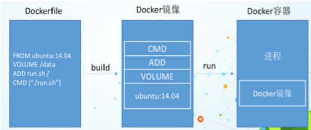
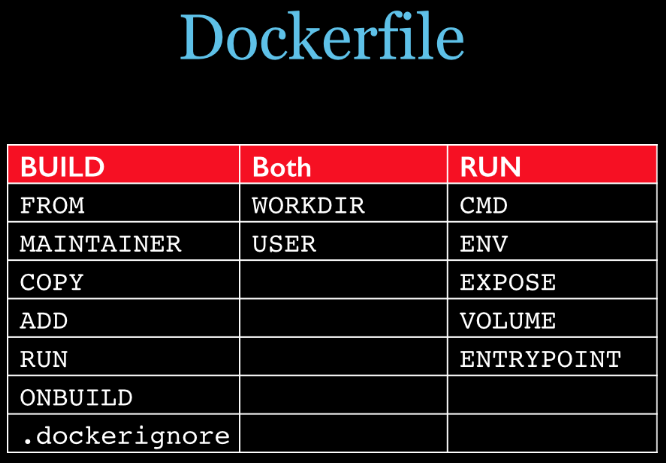
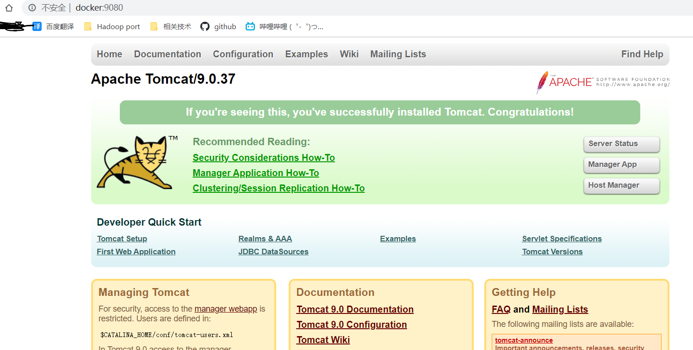
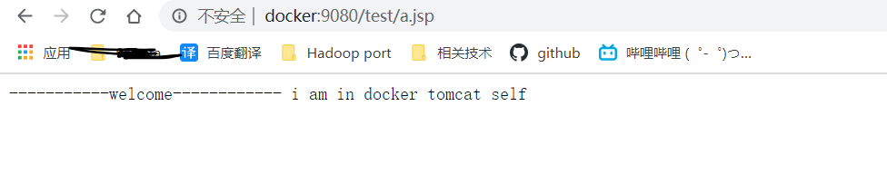
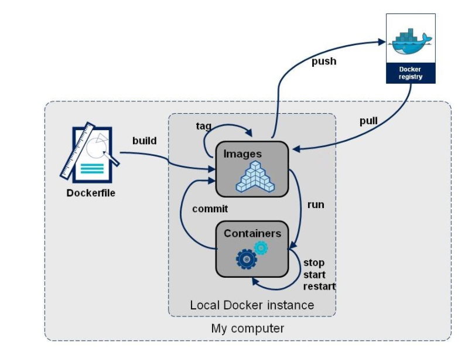

* [一、DockerFile 说明](#%E4%B8%80dockerfile-%E8%AF%B4%E6%98%8E)
  * [1\.1 DockerFile 是什么?](#11-dockerfile-%E6%98%AF%E4%BB%80%E4%B9%88)
  * [1\.2 构建 DockerFile 的步骤](#12-%E6%9E%84%E5%BB%BA-dockerfile-%E7%9A%84%E6%AD%A5%E9%AA%A4)
  * [1\.3 DockerFile 文件构成](#13-dockerfile-%E6%96%87%E4%BB%B6%E6%9E%84%E6%88%90)
* [二、DockerFile 构建过程解析](#%E4%BA%8Cdockerfile-%E6%9E%84%E5%BB%BA%E8%BF%87%E7%A8%8B%E8%A7%A3%E6%9E%90)
  * [2\.1 DockerFile 基础知识](#21-dockerfile-%E5%9F%BA%E7%A1%80%E7%9F%A5%E8%AF%86)
  * [2\.2 Docker 执行 DockerFile 的大致流程](#22-docker-%E6%89%A7%E8%A1%8C-dockerfile-%E7%9A%84%E5%A4%A7%E8%87%B4%E6%B5%81%E7%A8%8B)
  * [2\.3 小结](#23-%E5%B0%8F%E7%BB%93)
* [三、DockerFile 保留字](#%E4%B8%89dockerfile-%E4%BF%9D%E7%95%99%E5%AD%97)
* [四、案例](#%E5%9B%9B%E6%A1%88%E4%BE%8B)
  * [4\.1 Base 镜像(scratch)](#41-base-%E9%95%9C%E5%83%8Fscratch)
  * [4\.2 自定义 mycentos 镜像](#42-%E8%87%AA%E5%AE%9A%E4%B9%89-mycentos-%E9%95%9C%E5%83%8F)
    * [4\.2\.1 编写](#421-%E7%BC%96%E5%86%99)
    * [4\.2\.2 构建](#422-%E6%9E%84%E5%BB%BA)
    * [4\.2\.3 运行](#423-%E8%BF%90%E8%A1%8C)
    * [4\.2\.4 列出镜像的变更历史](#424-%E5%88%97%E5%87%BA%E9%95%9C%E5%83%8F%E7%9A%84%E5%8F%98%E6%9B%B4%E5%8E%86%E5%8F%B2)
  * [4\.3 CMD/ENTRYPOINT 指令的镜像案例](#43-cmdentrypoint-%E6%8C%87%E4%BB%A4%E7%9A%84%E9%95%9C%E5%83%8F%E6%A1%88%E4%BE%8B)
    * [4\.3\.1 CMD 命令](#431-cmd-%E5%91%BD%E4%BB%A4)
    * [4\.3\.2 ENTRYPOINT 命令](#432-entrypoint-%E5%91%BD%E4%BB%A4)
  * [4\.4 自定义 tomcat 镜像](#44-%E8%87%AA%E5%AE%9A%E4%B9%89-tomcat-%E9%95%9C%E5%83%8F)
* [五、总结](#%E4%BA%94%E6%80%BB%E7%BB%93)


----

# 一、DockerFile 说明
## 1.1 DockerFile 是什么?
DickerFile 是用来构建 Docker 镜像的构建文件, 是由一系列命令和参数构成的脚本.

## 1.2 构建 DockerFile 的步骤
1. 编写 DockerFile 文件
2. `docker build`
3. `docker run`

## 1.3 DockerFile 文件构成
[参考 CentOS 的 DockerFile 文件](https://github.com/CentOS/sig-cloud-instance-images/blob/b521221b5c8ac3ac88698e77941a2414ce6e778d/docker/Dockerfile
)

# 二、DockerFile 构建过程解析
## 2.1 DockerFile 基础知识
1. 每条保留字指定都必须大写, 且后面要跟随至少一个参数;
2. 指令按照从上到下, 顺序执行;
3. `#` 表示注释;
4. 每条指令都会创建一个新的镜像层, 并对镜像进行提交.

## 2.2 Docker 执行 DockerFile 的大致流程
1. docker 从基础镜像运行一个容器
2. 执行一条指令并对容器做出修改
3. 执行类似 `docker commit` 的操作提交一个新的镜像层
4. docker 再基于刚提交的镜像运行一个新容器
5. 执行 DockerFile 中的下一条指令直到所有指令都执行完成

## 2.3 小结
从应用软件的角度来看，Dockerfile、Docker镜像与Docker容器分别代表软件的三个不同阶段，
*  DockerFile 是软件的原材料
*  Docker 镜像是软件的交付品
*  Docker 容器则可以认为是软件的运行态.

Dockerfile面向开发, Docker镜像成为交付标准, Docker容器则涉及部署与运维, 三者缺一不可, 合力充当Docker 体系的基石. 



1. Dockerfile: 需要定义一个Dockerfile, Dockerfile定义了进程需要的一切东西。Dockerfile涉及的内容包括执行代码或者是文件、环境变量、依赖包、运行时环境、动态链接库、操作系统的发行版、服务进程和内核进程(当应用进程需要和系统服务和内核进程打交道, 这时需要考虑如何设计namespace的权限控制)等等;
 
2. Docker镜像: 在用Dockerfile定义一个文件之后, docker build时会产生一个Docker镜像, 当运行 Docker镜像时, 会真正开始提供服务;
 
3. Docker容器: 容器是直接提供服务的

# 三、DockerFile 保留字
- `FROM`: 基础镜像, 当前新镜像是基于哪个镜像.
- `MAINTAINER`: 镜像维护者的姓名和邮箱地址.
- `RUN`: 容器构建时需要运行的命令. 
- `EXPOSE`: 当前容器对外暴露出的端口.
- `WORKDIR`: 指定在创建容器后, 终端默认登录进来的目录, 工作落脚点.
- `ENV`: 用来在构建镜像过程中设置环境变量.
- `ADD`: 将宿主机目录下的文件拷贝进镜像且 ADD 命令会自动处理 URL 和解压 tar 压缩包.
- `COPY`: 类似 ADD, 拷贝文件和目录到镜像中, 将从构建上下文目录中 <源路径>的文件/目录复制到新的一层的镜像内的<目标目录>位置.
  - `COPY src dest`
  - `COPY ["src", "dest"]`
- `VOLUME`: 容器数据卷, 用于数据保存和持久化工作.
- `CMD`: 指定一个容器启动时要运行的命令, DockerFile 中可以有多个 CMD 命令, 但只有最后一个生效, CMD会被 docker run 之后的参数替换.
   - shell 格式: CMD <命令>
   - exec 格式: CMD ["可执行文件", "参数1","参数2",....]
- `ENTRYPOINT`: 指定一个容器启动时要运行的命令, ENTRYPOINT 的目的和 CMD 一样, 都是在指定容器启动程序及参数.
- `ONBUILD`: 当构建一个被继承的 DockerFile 时运行, 父镜像在被子继承后, 父镜像的 ONBUILD 会被触发.




# 四、案例
准备三个案例仅供参考
## 4.1 Base 镜像(scratch)
Docker Hub 中 99% 的镜像都是通过在 base 镜像中安装和配置需要的软件构建出来的

```bash
# centos 镜像
# https://github.com/CentOS/sig-cloud-instance-images/blob/b521221b5c8ac3ac88698e77941a2414ce6e778d/docker/Dockerfile
FROM scratch <-----
ADD centos-7-x86_64-docker.tar.xz /
LABEL \
org.label-schema.schema-version="1.0" \
org.label-schema.name="CentOS Base Image" \
```

## 4.2 自定义 mycentos 镜像
目的: 最终让我们的 mycentos 镜像登录默认在 /tmp 目录下, 具备 vim、ifconfig支持
### 4.2.1 编写
① Docker Hub 中默认的 CentOS 镜像
```bash
[root@docker1 ~]# docker images centos     # 查看 centos 镜像
REPOSITORY          TAG                 IMAGE ID            CREATED             SIZE
centos              latest              831691599b88        2 months ago        215MB
[root@docker1 ~]# docker run -it centos    # 运行该 centos 镜像, 默认路径是 / 根目录
[root@8462c199bb5b /]# vim test.txt        # 不支持 vim 命令
bash: vim: command not found
[root@8462c199bb5b /]# ifconfig            # 不支持 ifconfig 命令
bash: ifconfig: command not found
```

② 构建我们自己的 centos 镜像

1. 准备 DockerFile 文件
```bash
[root@docker1 mydockerfile]# vim Dockerfile
FROM centos
MAINTAINER kino<rmkino@163.com>

ENV MYPATH /usr/local
WORKDIR $MYPATH

RUN yum -y install vim
RUN yum -y install net-tools

EXPOSE 80

CMD echo $MYPATH
CMD echo "success -------------------"
CMD /bin/bash
```

### 4.2.2 构建 
```bash
[root@docker1 mydockerfile]# docker build -t mycentos:1.0 .
Sending build context to Docker daemon  2.048kB
Step 1/10 : FROM centos
 ---> 831691599b88
Step 2/10 : MAINTAINER kino<rmkino@163.com>
 ---> Running in e533d2a61e9f
Removing intermediate container e533d2a61e9f
 ---> d5cb61601813
Step 3/10 : ENV MYPATH /usr/local
 ---> Running in 8361a107da82
Removing intermediate container 8361a107da82
 ---> 73a52e0b7fd7
Step 4/10 : WORKDIR $MYPATH
 ---> Running in ba47fcf087e3
Removing intermediate container ba47fcf087e3
 ---> fdb88d50c8fd
Step 5/10 : RUN yum -y install vim
 ---> Running in 57607efaf602
CentOS-8 - AppStream                            645 kB/s | 5.8 MB     00:09    
CentOS-8 - Base                                  99 kB/s | 2.2 MB     00:23    
CentOS-8 - Extras                               405  B/s | 7.3 kB     00:18    
Dependencies resolved.
================================================================================
 Package             Arch        Version                   Repository      Size
================================================================================
Installing:
 vim-enhanced        x86_64      2:8.0.1763-13.el8         AppStream      1.4 M
Installing dependencies:
 gpm-libs            x86_64      1.20.7-15.el8             AppStream       39 k
 vim-common          x86_64      2:8.0.1763-13.el8         AppStream      6.3 M
 vim-filesystem      noarch      2:8.0.1763-13.el8         AppStream       48 k
 which               x86_64      2.21-12.el8               BaseOS          49 k

Transaction Summary
================================================================================
Install  5 Packages

Total download size: 7.8 M
Installed size: 31 M
Downloading Packages:
(1/5): gpm-libs-1.20.7-15.el8.x86_64.rpm         17 kB/s |  39 kB     00:02    
(2/5): vim-filesystem-8.0.1763-13.el8.noarch.rp 334 kB/s |  48 kB     00:00    
(3/5): vim-enhanced-8.0.1763-13.el8.x86_64.rpm  542 kB/s | 1.4 MB     00:02    
(4/5): vim-common-8.0.1763-13.el8.x86_64.rpm    1.8 MB/s | 6.3 MB     00:03    
(5/5): which-2.21-12.el8.x86_64.rpm              18 kB/s |  49 kB     00:02    
--------------------------------------------------------------------------------
Total                                           688 kB/s | 7.8 MB     00:11     
warning: /var/cache/dnf/AppStream-02e86d1c976ab532/packages/gpm-libs-1.20.7-15.el8.x86_64.rpm: Header V3 RSA/SHA256 Signature, key ID 8483c65d: NOKEY
CentOS-8 - AppStream                             52 kB/s | 1.6 kB     00:00    
Importing GPG key 0x8483C65D:
 Userid     : "CentOS (CentOS Official Signing Key) <security@centos.org>"
 Fingerprint: 99DB 70FA E1D7 CE22 7FB6 4882 05B5 55B3 8483 C65D
 From       : /etc/pki/rpm-gpg/RPM-GPG-KEY-centosofficial
Key imported successfully
Running transaction check
Transaction check succeeded.
Running transaction test
Transaction test succeeded.
Running transaction
  Preparing        :                                                        1/1 
  Installing       : which-2.21-12.el8.x86_64                               1/5 
  Installing       : vim-filesystem-2:8.0.1763-13.el8.noarch                2/5 
  Installing       : vim-common-2:8.0.1763-13.el8.x86_64                    3/5 
  Installing       : gpm-libs-1.20.7-15.el8.x86_64                          4/5 
  Running scriptlet: gpm-libs-1.20.7-15.el8.x86_64                          4/5 
  Installing       : vim-enhanced-2:8.0.1763-13.el8.x86_64                  5/5 
  Running scriptlet: vim-enhanced-2:8.0.1763-13.el8.x86_64                  5/5 
  Running scriptlet: vim-common-2:8.0.1763-13.el8.x86_64                    5/5 
  Verifying        : gpm-libs-1.20.7-15.el8.x86_64                          1/5 
  Verifying        : vim-common-2:8.0.1763-13.el8.x86_64                    2/5 
  Verifying        : vim-enhanced-2:8.0.1763-13.el8.x86_64                  3/5 
  Verifying        : vim-filesystem-2:8.0.1763-13.el8.noarch                4/5 
  Verifying        : which-2.21-12.el8.x86_64                               5/5 

Installed:
  gpm-libs-1.20.7-15.el8.x86_64         vim-common-2:8.0.1763-13.el8.x86_64    
  vim-enhanced-2:8.0.1763-13.el8.x86_64 vim-filesystem-2:8.0.1763-13.el8.noarch
  which-2.21-12.el8.x86_64             

Complete!
Removing intermediate container 57607efaf602
 ---> 7d2341d0a730
Step 6/10 : RUN yum -y install net-tools
 ---> Running in 9651e150aa41
Last metadata expiration check: 0:00:30 ago on Thu Aug 20 13:00:15 2020.
Dependencies resolved.
================================================================================
 Package         Architecture Version                        Repository    Size
================================================================================
Installing:
 net-tools       x86_64       2.0-0.51.20160912git.el8       BaseOS       323 k

Transaction Summary
================================================================================
Install  1 Package

Total download size: 323 k
Installed size: 1.0 M
Downloading Packages:
net-tools-2.0-0.51.20160912git.el8.x86_64.rpm    78 kB/s | 323 kB     00:04    
--------------------------------------------------------------------------------
Total                                            48 kB/s | 323 kB     00:06     
Running transaction check
Transaction check succeeded.
Running transaction test
Transaction test succeeded.
Running transaction
  Preparing        :                                                        1/1 
  Installing       : net-tools-2.0-0.51.20160912git.el8.x86_64              1/1 
  Running scriptlet: net-tools-2.0-0.51.20160912git.el8.x86_64              1/1 
  Verifying        : net-tools-2.0-0.51.20160912git.el8.x86_64              1/1 

Installed:
  net-tools-2.0-0.51.20160912git.el8.x86_64                                     

Complete!
Removing intermediate container 9651e150aa41
 ---> da64f253768f
Step 7/10 : EXPOSE 80
 ---> Running in edf29f26ef29
Removing intermediate container edf29f26ef29
 ---> 90c7d20383d7
Step 8/10 : CMD echo $MYPATH
 ---> Running in d6d6ed7b9e00
Removing intermediate container d6d6ed7b9e00
 ---> 6c0f60e6f12c
Step 9/10 : CMD echo "success -------------------"
 ---> Running in 9f27f10f41a8
Removing intermediate container 9f27f10f41a8
 ---> c958155372f9
Step 10/10 : CMD /bin/bash
 ---> Running in ed74d9942c44
Removing intermediate container ed74d9942c44
 ---> df3ce2fbcd2d
Successfully built df3ce2fbcd2d
Successfully tagged mycentos:1.0
[root@docker1 mydockerfile]# 
```

### 4.2.3 运行
```bash
[root@docker1 mydockerfile]# docker ps     # 查看运行的 docker 容器
CONTAINER ID        IMAGE               COMMAND             CREATED             STATUS              PORTS               NAMES
[root@docker1 mydockerfile]# docker run -it mycentos:1.0     # 运行 mycentos 镜像
[root@4a36745df179 local]# pwd    # 查看进入mycentos容器的落脚点
/usr/local
[root@4a36745df179 local]# ifconfig   # 有了ifconfig命令
eth0: flags=4163<UP,BROADCAST,RUNNING,MULTICAST>  mtu 1500
        inet 172.17.0.2  netmask 255.255.0.0  broadcast 172.17.255.255
        ether 02:42:ac:11:00:02  txqueuelen 0  (Ethernet)
        RX packets 8  bytes 656 (656.0 B)
        RX errors 0  dropped 0  overruns 0  frame 0
        TX packets 0  bytes 0 (0.0 B)
        TX errors 0  dropped 0 overruns 0  carrier 0  collisions 0

lo: flags=73<UP,LOOPBACK,RUNNING>  mtu 65536
        inet 127.0.0.1  netmask 255.0.0.0
        loop  txqueuelen 1000  (Local Loopback)
        RX packets 0  bytes 0 (0.0 B)
        RX errors 0  dropped 0  overruns 0  frame 0
        TX packets 0  bytes 0 (0.0 B)
        TX errors 0  dropped 0 overruns 0  carrier 0  collisions 0

[root@4a36745df179 local]# vim test.txt  # 有了 vim 领命
[root@4a36745df179 local]# 
```

### 4.2.4 列出镜像的变更历史
```bash
[root@docker1 mydockerfile]# docker history mycentos:1.0
IMAGE               CREATED             CREATED BY                                      SIZE                COMMENT
df3ce2fbcd2d        3 minutes ago       /bin/sh -c #(nop)  CMD ["/bin/sh" "-c" "/bin…   0B                  
c958155372f9        3 minutes ago       /bin/sh -c #(nop)  CMD ["/bin/sh" "-c" "echo…   0B                  
6c0f60e6f12c        3 minutes ago       /bin/sh -c #(nop)  CMD ["/bin/sh" "-c" "echo…   0B                  
90c7d20383d7        3 minutes ago       /bin/sh -c #(nop)  EXPOSE 80                    0B                  
da64f253768f        3 minutes ago       /bin/sh -c yum -y install net-tools             22.7MB              
7d2341d0a730        3 minutes ago       /bin/sh -c yum -y install vim                   57.2MB              
fdb88d50c8fd        5 minutes ago       /bin/sh -c #(nop) WORKDIR /usr/local            0B                  
73a52e0b7fd7        5 minutes ago       /bin/sh -c #(nop)  ENV MYPATH=/usr/local        0B                  
d5cb61601813        5 minutes ago       /bin/sh -c #(nop)  MAINTAINER kino<rmkino@16…   0B                  
831691599b88        2 months ago        /bin/sh -c #(nop)  CMD ["/bin/bash"]            0B                  
<missing>           2 months ago        /bin/sh -c #(nop)  LABEL org.label-schema.sc…   0B                  
<missing>           2 months ago        /bin/sh -c #(nop) ADD file:84700c11fcc969ac0…   215MB
```


## 4.3 `CMD/ENTRYPOINT` 指令的镜像案例
说明: 这两个命令都是 指定一个容器启动时要运行的命令.

### 4.3.1 `CMD` 命令
Dockerfile 中可以有多个 CMD 指令, 但只有最后一个生效, CMD 会被 docker run 之后的参数替换
```bash
[root@docker1 mydockerfile]# docker run -it mycentos:1.0 ls -l
total 0
drwxr-xr-x. 2 root root  6 May 11  2019 bin
drwxr-xr-x. 2 root root  6 May 11  2019 etc
drwxr-xr-x. 2 root root  6 May 11  2019 games
drwxr-xr-x. 2 root root  6 May 11  2019 include
drwxr-xr-x. 2 root root  6 May 11  2019 lib
drwxr-xr-x. 2 root root  6 May 11  2019 lib64
drwxr-xr-x. 2 root root  6 May 11  2019 libexec
drwxr-xr-x. 2 root root  6 May 11  2019 sbin
drwxr-xr-x. 5 root root 49 Jun 11 02:35 share
drwxr-xr-x. 2 root root  6 May 11  2019 src
[root@docker1 mydockerfile]# 
```

### 4.3.2 `ENTRYPOINT` 命令
docker run 之后的参数会被当做参数传递给 ENTRYPOINT, 之后形成新的命令组合
 
案例:

1. 制作 CMD 版可以查询 IP 信息的容器
    ```bash
    [root@docker1 mydockerfile]# vim cmd-docker-file
    FROM centos
    RUN yum -y install curl
    CMD ["curl", "-s", "http://ip.cn"]
    
    [root@docker1 mydockerfile]# docker build -f cmd-docker-file -t myip .
    Sending build context to Docker daemon  3.072kB
    Step 1/3 : FROM centos
     ---> 831691599b88
    Step 2/3 : RUN yum -y install curl
     ---> Running in 6599ae71cb81
    CentOS-8 - AppStream                            3.5 MB/s | 5.8 MB     00:01    
    CentOS-8 - Base                                 424 kB/s | 2.2 MB     00:05    
    CentOS-8 - Extras                               2.0 kB/s | 7.3 kB     00:03    
    Package curl-7.61.1-12.el8.x86_64 is already installed.
    Dependencies resolved.
    Nothing to do.
    Complete!
    Removing intermediate container 6599ae71cb81
     ---> ea7dc0f87961
    Step 3/3 : CMD [ "curl", "-s", "http://ip.cn" ]
     ---> Running in c12ebb27deeb
    Removing intermediate container c12ebb27deeb
     ---> 2e374efb99b6
    Successfully built 2e374efb99b6
    Successfully tagged myip:latest
    
    [root@docker1 mydockerfile]# docker run myip
    当前IP: 116.24.66.207 广东省深圳市 电信
    
    [root@docker1 mydockerfile]# docker run myip -l
    ERROR ....
    ```

2. 制作 ENTRYPOINT 版可以查询 IP 信息的容器

    我们可以看到可执行文件找不到的报错，executable file not found。

    之前我们说过，跟在镜像名后面的是 command，运行时会替换 CMD 的默认值。

    因此这里的 -i 替换了原来的 CMD，而不是添加在原来的 curl -s http://ip.cn 后面。而 -i 根本不是命令，所以自然找不到。
 
    那么如果我们希望加入 -i 这参数，我们就必须重新完整的输入这个命令: 
    ```bash
    $ docker run myip curl -s http://ip.cn -i
    ``` 
    
    ```bash
    FROM centos
    RUN yum install -y curl
    ENTRYPOINT [ "curl", "-s", "http://ip.cn" ]
    
    [root@docker1 mydockerfile]# docker run myip 
    当前IP: 116.24.66.207 广东省深圳市 电信
    
    [root@docker1 mydockerfile]# docker run myip -i
    HTTP/1.1 403 Forbidden
    Date: Thu, 20 Aug 2020 13:23:56 GMT
    Content-Type: text/plain; charset=UTF-8
    Content-Length: 16
    Connection: keep-alive
    X-Frame-Options: SAMEORIGIN
    Cache-Control: private, max-age=0, no-store, no-cache, must-revalidate, post-check=0, pre-check=0
    Expires: Thu, 01 Jan 1970 00:00:01 GMT
    Set-Cookie: __cfduid=d142a502609d3d52cd0a2c7bdb4b4eb1d1597929836; expires=Sat, 19-Sep-20 13:23:56 GMT; path=/; domain=.ip.cn; HttpOnly; SameSite=Lax
    cf-request-id: 04ada368710000e7e926a93200000001
    Server: cloudflare
    CF-RAY: 5c5c6e871cb2e7e9-LAX
    alt-svc: h3-27=":443"; ma=86400, h3-28=":443"; ma=86400, h3-29=":443"; ma=86400
    
    当前IP: 116.24.66.207 广东省深圳市 电信
    ```

## 4.4 自定义 tomcat 镜像
① 
```bash
[root@docker1 /]# mkdir -p /root/mydocker/tomcat9
[root@docker1 /]# cd /root/mydocker/tomcat9
[root@docker1 tomcat9]# pwd
/root/mydocker/tomcat9
```
② 将 tomcat 和 jdk 上传到 `/root/mydocker/tomcat9`
③ 编辑Dockerfile
```bash
[root@docker1 tomcat9]# vim Dockerfile
FROM centos
MAINTAINER kino<rmkino@163.com>

#把宿主机当前上下文的 a.txt 拷贝到容器 /usr/local 目录下
COPY a.txt /usr/local/container.txt

#把 Java 与 tomcat 添加到容器中
ADD jdk-8u131-linux-x64.tar.gz /usr/local
ADD apache-tomcat-9.0.37.tar.gz /usr/local

#安装 vim 编辑器
RUN yun -y install vim

#设置工作访问时候的 WORKDIR 路径
ENV MYPATH /usr/local
WORKDIR $MYPATH

#配置Java与tomcat环境变量
ENV JAVA_HOME /usr/local/jdk_1.8.0_131
ENV CLASSPATH $JAVA_HOME/lib/dt.jar:$JAVA_HOME/lib/tools.jar
ENV CATALINA_HOME /usr/local/apache-tomcat-9.0.37
ENV CATALINA_BASE /usr/local/apache-tomcat-9.0.37
ENV PATH $PATH:$JAVA_HOME/bin:$CATALINA_HOME/lib:$CATALINA_HOME/bin

#容器运行时监听的端口
EXPOSE 8080

#启动时运行 tomcat
# ENTRYPOINT ["/usr/local/apache-tomcat-9.0.37/bin/startup.sh" ]
# CMD ["/usr/local/apache-tomcat-9.0.37/bin/catalina.sh","run"]
CMD /usr/local/apache-tomcat-9.0.8/bin/startup.sh && tail -F /usr/local/apache-tomcat-9.0.8/bin/logs/catalina.out


[root@docker1 tomcat9]# ll
总用量 192148
-rw-r--r--. 1 root root  11211292 8月  21 19:51 apache-tomcat-9.0.37.tar.gz
-rw-r--r--. 1 root root         0 8月  21 19:49 a.txt
-rw-r--r--. 1 root root      1027 8月  21 19:59 Dockerfile
-rw-r--r--. 1 root root 185540433 8月   6 14:00 jdk-8u131-linux-x64.tar.gz
```
④ 构建
```bash
[root@docker1 tomcat9]# docker build -t mytoncat9 .
Sending build context to Docker daemon  196.8MB
Step 1/14 : FROM         centos
 ---> 0d120b6ccaa8
Step 2/14 : MAINTAINER    kino<kinomin@136.com>
 ---> Using cache
 ---> a2bb8a5a0e09
Step 3/14 : COPY a.txt /usr/local/container.txt
 ---> Using cache
 ---> 6c713a1ba244
Step 4/14 : ADD jdk-8u131-linux-x64.tar.gz /usr/local
 ---> Using cache
 ---> 7df7b6b7a599
Step 5/14 : ADD apache-tomcat-9.0.37.tar.gz /usr/local
 ---> Using cache
 ---> aa279706232f
Step 6/14 : ENV MYPATH /usr/local
 ---> [Warning] IPv4 forwarding is disabled. Networking will not work.
 ---> Running in 8955477dfd1c
Removing intermediate container 8955477dfd1c
 ---> 2c17a2cacae6
Step 7/14 : WORKDIR $MYPATH
 ---> [Warning] IPv4 forwarding is disabled. Networking will not work.
 ---> Running in 12519286549c
Removing intermediate container 12519286549c
 ---> f08854fc0b12
Step 8/14 : ENV JAVA_HOME /usr/local/jdk_1.8.0_131
 ---> [Warning] IPv4 forwarding is disabled. Networking will not work.
 ---> Running in 9a9993a16e82
Removing intermediate container 9a9993a16e82
 ---> 17a52e728bcf
Step 9/14 : ENV CLASSPATH $JAVA_HOME/lib/dt.jar:$JAVA_HOME/lib/tools.jar
 ---> [Warning] IPv4 forwarding is disabled. Networking will not work.
 ---> Running in fe0cdec1822e
Removing intermediate container fe0cdec1822e
 ---> 011b1387d0c1
Step 10/14 : ENV CATALINA_HOME /usr/local/apache-tomcat-9.0.37
 ---> [Warning] IPv4 forwarding is disabled. Networking will not work.
 ---> Running in 27971279a69a
Removing intermediate container 27971279a69a
 ---> 18237e66338c
Step 11/14 : ENV CATALINA_BASE /usr/local/apache-tomcat-9.0.37
 ---> [Warning] IPv4 forwarding is disabled. Networking will not work.
 ---> Running in 3277c511bf8f
Removing intermediate container 3277c511bf8f
 ---> 5c974bcde2b7
Step 12/14 : ENV PATH $PATH:$JAVA_HOME/bin:$CATALINA_HOME/lib:$CATALINA_HOME/bin
 ---> [Warning] IPv4 forwarding is disabled. Networking will not work.
 ---> Running in 94d981f3f551
Removing intermediate container 94d981f3f551
 ---> 8b16d898b7c1
Step 13/14 : EXPOSE 8080
 ---> [Warning] IPv4 forwarding is disabled. Networking will not work.
 ---> Running in 7b36eb8045c8
Removing intermediate container 7b36eb8045c8
 ---> b009a3d4e4ae
Step 14/14 : CMD /usr/local/apache-tomcat-9.0.37/bin/startup.sh && tail -F /usr/local/apache-tomcat-9.0.37/bin/logs/catalina.out
 ---> [Warning] IPv4 forwarding is disabled. Networking will not work.
 ---> Running in 7fe5440b2497
Removing intermediate container 7fe5440b2497
 ---> c27957e5edec
Successfully built c27957e5edec
Successfully tagged mytoncat9:latest
```

⑤ 运行
```bash
[root@docker1 tomcat9]# docker run -d -p 9080:8080 --name tomcat9 -v /root/mydocker/tomcat9/mydockerfile/tomcat9/test:/usr/local/apache-tomcat-9.0.8/webapps/test -v /root/mydocker/tomcat9/mydockerfile/tomcat9/tomcat9logs/:/usr/local/apache-tomcat-9.0.8/logs --privileged=true kinotomcat9
455a90b66d8843c34beb3130ef656954baf5e42745566527bcc4004e69115a50
```

⑥ 校验


⑦ 发布web服务
```bash
[root@d8924379fd1a test]# vim a.jsp
<%@ page language="java" contentType="text/html; charset=UTF-8" pageEncoding="UTF-8"%>
<!DOCTYPE html PUBLIC "-//W3C//DTD HTML 4.01 Transitional//EN" "http://www.w3.org/TR/html4/loose.dtd">
<html>
  <head>
    <meta http-equiv="Content-Type" content="text/html; charset=UTF-8">
    <title>Insert title here</title>
  </head>
  <body>
     -----------welcome------------
     <%="i am in docker tomcat self "%>
     <br>
     <br>
     <% System.out.println("=============docker tomcat self");%>
   </body>
</html>

[root@d8924379fd1a test]# mkdir WEB-INF
[root@d8924379fd1a test]# cd WEB-INF
[root@d8924379fd1a test]# vim web.xml
<?xml version="1.0" encoding="UTF-8"?>
<web-app xmlns:xsi="http://www.w3.org/2001/XMLSchema-instance"
  xmlns="http://java.sun.com/xml/ns/javaee"
  xsi:schemaLocation="http://java.sun.com/xml/ns/javaee http://java.sun.com/xml/ns/javaee/web-app_2_5.xsd"
  id="WebApp_ID" version="2.5">
  
  <display-name>test</display-name>
 
</web-app>
```

# 五、总结
