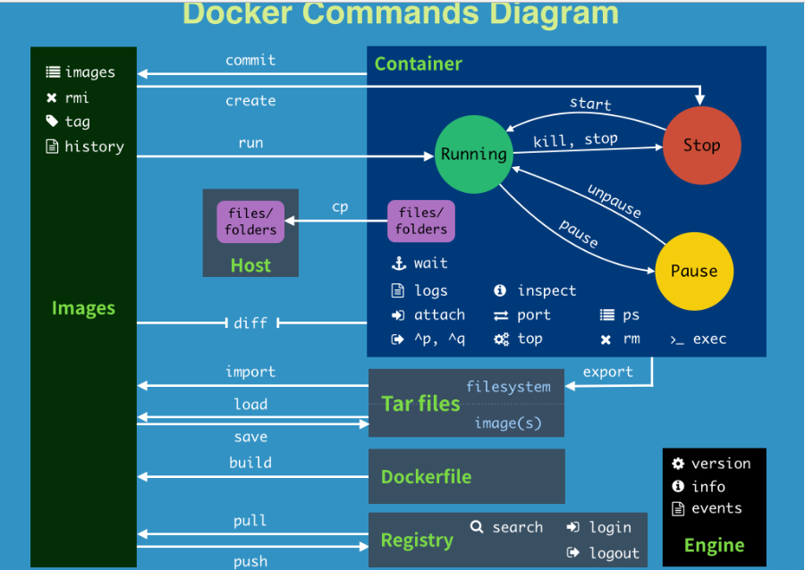

* [一、帮助命令](#%E4%B8%80%E5%B8%AE%E5%8A%A9%E5%91%BD%E4%BB%A4)
* [二、镜像命令](#%E4%BA%8C%E9%95%9C%E5%83%8F%E5%91%BD%E4%BB%A4)
  * [2\.1 docker images: 列出本地镜像。](#21-docker-images-%E5%88%97%E5%87%BA%E6%9C%AC%E5%9C%B0%E9%95%9C%E5%83%8F)
  * [2\.2 docker search: 从Docker Hub查找镜像](#22-docker-search-%E4%BB%8Edocker-hub%E6%9F%A5%E6%89%BE%E9%95%9C%E5%83%8F)
  * [2\.3 docker pull: 从镜像仓库中拉取或者更新指定镜像](#23-docker-pull-%E4%BB%8E%E9%95%9C%E5%83%8F%E4%BB%93%E5%BA%93%E4%B8%AD%E6%8B%89%E5%8F%96%E6%88%96%E8%80%85%E6%9B%B4%E6%96%B0%E6%8C%87%E5%AE%9A%E9%95%9C%E5%83%8F)
  * [2\.4 docker rmi: 删除本地一个或多少镜像。](#24-docker-rmi-%E5%88%A0%E9%99%A4%E6%9C%AC%E5%9C%B0%E4%B8%80%E4%B8%AA%E6%88%96%E5%A4%9A%E5%B0%91%E9%95%9C%E5%83%8F)
* [三、容器命令](#%E4%B8%89%E5%AE%B9%E5%99%A8%E5%91%BD%E4%BB%A4)
  * [3\.1 docker run: 创建一个新的容器并运行一个命令](#31-docker-run-%E5%88%9B%E5%BB%BA%E4%B8%80%E4%B8%AA%E6%96%B0%E7%9A%84%E5%AE%B9%E5%99%A8%E5%B9%B6%E8%BF%90%E8%A1%8C%E4%B8%80%E4%B8%AA%E5%91%BD%E4%BB%A4)
  * [3\.2 docker ps: 列出当前所有 正在运行 的容器](#32-docker-ps-%E5%88%97%E5%87%BA%E5%BD%93%E5%89%8D%E6%89%80%E6%9C%89-%E6%AD%A3%E5%9C%A8%E8%BF%90%E8%A1%8C-%E7%9A%84%E5%AE%B9%E5%99%A8)
  * [3\.3 退出容器](#33-%E9%80%80%E5%87%BA%E5%AE%B9%E5%99%A8)
  * [3\.4 docker start: 启动容器](#34-docker-start-%E5%90%AF%E5%8A%A8%E5%AE%B9%E5%99%A8)
  * [3\.5 docker restart: 重启容器](#35-docker-restart-%E9%87%8D%E5%90%AF%E5%AE%B9%E5%99%A8)
  * [3\.6 docker stop: 停止容器](#36-docker-stop-%E5%81%9C%E6%AD%A2%E5%AE%B9%E5%99%A8)
  * [3\.7 docker kill: 强制停止容器](#37-docker-kill-%E5%BC%BA%E5%88%B6%E5%81%9C%E6%AD%A2%E5%AE%B9%E5%99%A8)
  * [3\.8 docker rm: 删除已经停止的容器](#38-docker-rm-%E5%88%A0%E9%99%A4%E5%B7%B2%E7%BB%8F%E5%81%9C%E6%AD%A2%E7%9A%84%E5%AE%B9%E5%99%A8)
  * [3\.9 docker run \-d: 启动守护式容器(重要)](#39-docker-run--d-%E5%90%AF%E5%8A%A8%E5%AE%88%E6%8A%A4%E5%BC%8F%E5%AE%B9%E5%99%A8%E9%87%8D%E8%A6%81)
  * [3\.10 docker logs \-ft \-\-tail: 查看容器日志](#310-docker-logs--ft---tail-%E6%9F%A5%E7%9C%8B%E5%AE%B9%E5%99%A8%E6%97%A5%E5%BF%97)
  * [3\.11 docker top: 查看容器内运行的进程](#311-docker-top-%E6%9F%A5%E7%9C%8B%E5%AE%B9%E5%99%A8%E5%86%85%E8%BF%90%E8%A1%8C%E7%9A%84%E8%BF%9B%E7%A8%8B)
  * [3\.12 docker inspect: 查看容器内部细节](#312-docker-inspect-%E6%9F%A5%E7%9C%8B%E5%AE%B9%E5%99%A8%E5%86%85%E9%83%A8%E7%BB%86%E8%8A%82)
  * [3\.13 docker exec \-it 容器ID bashShell: 进入正在运行的容器并以命令交互](#313-docker-exec--it-%E5%AE%B9%E5%99%A8id-bashshell-%E8%BF%9B%E5%85%A5%E6%AD%A3%E5%9C%A8%E8%BF%90%E8%A1%8C%E7%9A%84%E5%AE%B9%E5%99%A8%E5%B9%B6%E4%BB%A5%E5%91%BD%E4%BB%A4%E4%BA%A4%E4%BA%92)
  * [3\.14 docker cp 容器ID:容器内路径 主机路径: 从容器内拷贝文件到主机上](#314-docker-cp-%E5%AE%B9%E5%99%A8id%E5%AE%B9%E5%99%A8%E5%86%85%E8%B7%AF%E5%BE%84-%E4%B8%BB%E6%9C%BA%E8%B7%AF%E5%BE%84-%E4%BB%8E%E5%AE%B9%E5%99%A8%E5%86%85%E6%8B%B7%E8%B4%9D%E6%96%87%E4%BB%B6%E5%88%B0%E4%B8%BB%E6%9C%BA%E4%B8%8A)
* [四、常用命令小结:](#%E5%9B%9B%E5%B8%B8%E7%94%A8%E5%91%BD%E4%BB%A4%E5%B0%8F%E7%BB%93)

---
官方网址: https://www.docker.com/

# 一、帮助命令
```bash
docker version
docker info
docker --help
```

# 二、镜像命令
## 2.1 `docker images`: 列出本地镜像。
```bash
[root@docker1 ~]# docker images
REPOSITORY          TAG                 IMAGE ID            CREATED             SIZE
hello-world         latest              bf756fb1ae65        6 months ago        13.3kB
```
参数说明:
- `-a`: 列出本地所有的镜像(含中间映像层)
- `-q`: 只显示镜像ID
- `--digests`: 显示镜像的摘要信息
- `--no-trunc`: 显示完整的镜像信息
    
## 2.2 `docker search`: 从Docker Hub查找镜像
```bash
[root@docker1 ~]# docker search -s 11 java
Flag --stars has been deprecated, use --filter=stars=3 instead
NAME                               DESCRIPTION                                     STARS               OFFICIAL            AUTOMATED
node                               Node.js is a JavaScript-based platform for s…   9043                [OK]                
tomcat                             Apache Tomcat is an open source implementati…   2783                [OK]                
openjdk                            OpenJDK is an open-source implementation of …   2345                [OK]                
java                               Java is a concurrent, class-based, and objec…   1976                [OK]                
ghost                              Ghost is a free and open source blogging pla…   1221                [OK]                
couchdb                            CouchDB is a database that uses JSON for doc…   357                 [OK]                
jetty                              Jetty provides a Web server and javax.servle…   340                 [OK]                
groovy                             Apache Groovy is a multi-faceted language fo…   97                  [OK]                
lwieske/java-8                     Oracle Java 8 Container - Full + Slim - Base…   46                                      [OK]
nimmis/java-centos                 This is docker images of CentOS 7 with diffe…   42                                      [OK]
fabric8/java-jboss-openjdk8-jdk    Fabric8 Java Base Image (JBoss, OpenJDK 8)      28                                      [OK]
cloudbees/java-build-tools         Docker image with commonly used tools to bui…   15                                      [OK]
frekele/java                       docker run --rm --name java frekele/java        12                                      [OK]
fabric8/java-centos-openjdk8-jdk   Fabric8 Java Base Image (CentOS, OpenJDK 8, …   11                                      [OK]                                    
``` 
参数说明: 
- `--no-trunc`: 显示完整的镜像描述
- `-s`: 列出收藏数不小于指定值的镜像
- `--automated`: 只列出 automated build 类型的镜像
   
## 2.3 `docker pull`: 从镜像仓库中拉取或者更新指定镜像
```bash
[root@docker1 ~]# docker pull java
Using default tag: latest
latest: Pulling from library/java
5040bd298390: Pull complete 
fce5728aad85: Pull complete 
76610ec20bf5: Pull complete 
60170fec2151: Pull complete 
e98f73de8f0d: Pull complete 
11f7af24ed9c: Pull complete 
49e2d6393f32: Pull complete 
bb9cdec9c7f3: Pull complete 
Digest: sha256:c1ff613e8ba25833d2e1940da0940c3824f03f802c449f3d1815a66b7f8c0e9d
Status: Downloaded newer image for java:latest
docker.io/library/java:latest

[root@docker1 ~]# docker images
REPOSITORY          TAG                 IMAGE ID            CREATED             SIZE
hello-world         latest              bf756fb1ae65        6 months ago        13.3kB
java                latest              d23bdf5b1b1b        3 years ago         643MB
```
参数说明:
- `-a`: 拉取所有 tagged 镜像
- `--disable-content-trust`: 忽略镜像的校验, 默认开启
   
## 2.4 `docker rmi`: 删除本地一个或多少镜像。
```bash
[root@docker1 ~]# docker rmi -f java
Untagged: java:latest
Untagged: java@sha256:c1ff613e8ba25833d2e1940da0940c3824f03f802c449f3d1815a66b7f8c0e9d
Deleted: sha256:d23bdf5b1b1b1afce5f1d0fd33e7ed8afbc084b594b9ccf742a5b27080d8a4a8
Deleted: sha256:0132aeca1bc9ac49d397635d34675915693a8727b103639ddee3cc5438e0f60a
Deleted: sha256:c011315277e16e6c88687a6c683e388e2879f9a195113129a2ca12f782d9fcf9
Deleted: sha256:3181aa7c07970b525de9d3bd15c4c3710a2ab49fd5927df41e5586d9b89b1480
Deleted: sha256:b0053647bc72f97b7a9709a505a20a7a74a556c6aa025979e36532ff3df7cb8d
Deleted: sha256:0877f4904e80b44741cc07706b19c6d415724b20128f4b26ee59faec9a859416
Deleted: sha256:dbf7b16cf5d32dfec3058391a92361a09745421deb2491545964f8ba99b37fc2
Deleted: sha256:4cbc0ad7007fe8c2dfcf2cdc82fdb04f35070f0e2a04d5fa35093977a3cc1693
Deleted: sha256:a2ae92ffcd29f7ededa0320f4a4fd709a723beae9a4e681696874932db7aee2c

[root@docker1 ~]# docker images
REPOSITORY          TAG                 IMAGE ID            CREATED             SIZE
hello-world         latest              bf756fb1ae65        6 months ago        13.3kB
```
参数说明:
- `-f`: 强制删除；
- `--no-prune`: 不移除该镜像的过程镜像，默认移除；
   
# 三、容器命令
有镜像才能创建容器, 这是根本前提(下载一个 CentOS 镜像演示)
```bash
docker pull centos
```
## 3.1 `docker run`: 创建一个新的容器并运行一个命令
```bash
[root@docker1 ~]# docker images
REPOSITORY          TAG                 IMAGE ID            CREATED             SIZE
centos              latest              831691599b88        4 weeks ago         215MB
hello-world         latest              bf756fb1ae65        6 months ago        13.3kB

[root@docker1 ~]# docker run -it centos /bin/bash

[root@384bed8bf17b /]# ps -ef 
UID         PID   PPID  C STIME TTY          TIME CMD
root          1      0  0 12:10 pts/0    00:00:00 /bin/bash
root         14      1  0 12:10 pts/0    00:00:00 ps -ef
```
参数说明: 
- `-name="容器的名字"`: 为容器指定一个名称
- `-d`: 后台运行容器, 并返回容器 ID, 也即启动守护式容器
- `-i`: 以交互模式运行容器, 通常与 -t 同时使用
- `-t`: 为容器重新分配一个伪输入终端, 通常与 -i 同时使用
- `-P`: 随机端口映射
- `-p`: 指定端口映射, 有一下四种格式:
    - ip:hostPort:containerPort
    - ip::containerPort
    - hostPort:containerPort
    - containerPort
        
## 3.2 `docker ps`: 列出当前所有 正在运行 的容器
```bash
[root@docker1 ~]# 
[root@docker1 ~]# docker ps -a
CONTAINER ID        IMAGE               COMMAND             CREATED             STATUS                         PORTS               NAMES
384bed8bf17b        centos              "/bin/bash"         5 minutes ago       Exited (127) 5 seconds ago                         eager_benz
400c034be63c        hello-world         "/hello"            About an hour ago   Exited (0) About an hour ago                       gallant_lewin
5acd44331813        hello-world         "/hello"            About an hour ago   Exited (0) About an hour ago                       peaceful_hertz
```
参数说明:
- `-a`: 列出当前所有 正在运行 的容器 + 历史上运行过的
- `-l`: 显示最近创建的容器
- `-n`: 显示最近 n 个创建的容器
- `-q`: 静默模式, 只显示容器编号
- `--no-trunc`: 不截断输出
   
## 3.3 退出容器
exit: 容器停止退出

ctrl+P+Q: 容器不停止退出

## 3.4 `docker start`: 启动容器
```bash
docker start 容器ID/容器名
```
   
## 3.5 `docker restart`: 重启容器
```bash
docker restart 容器ID/容器名
```
   
## 3.6 `docker stop`: 停止容器
```bash
docker stop 容器ID/容器名 
```
   
## 3.7 `docker kill`: 强制停止容器
```bash
docker kill 容器ID/容器名 
```
   
## 3.8 `docker rm`: 删除已经停止的容器
```bash
[root@docker1 ~]# docker rm -f $(docker ps -a -q) 
或者
[root@docker1 ~]# docker ps -a -q | xargs docker rm -f
a328c2dc5c63
2616044943ea
384bed8bf17b
400c034be63c
5acd44331813

[root@docker1 ~]# docker images
REPOSITORY          TAG                 IMAGE ID            CREATED             SIZE
centos              latest              831691599b88        4 weeks ago         215MB
hello-world         latest              bf756fb1ae65        6 months ago        13.3kB

[root@docker1 ~]# docker ps
CONTAINER ID        IMAGE               COMMAND             CREATED             STATUS              PORTS               NAMES
```
   
## 3.9 `docker run -d`: 启动守护式容器(重要)
```bash
[root@docker1 ~]# docker run -d centos
5a2464425cee999e9d13bf422795671b6744890f78bf15222eba482881c82dbc

[root@docker1 ~]# docker ps -a
CONTAINER ID        IMAGE               COMMAND             CREATED             STATUS                       PORTS               NAMES
5a2464425cee        centos              "/bin/bash"         7 seconds ago       Exited (0) 6 seconds ago                         happy_banzai
0b11cb8852f3        hello-world         "/hello"            3 minutes ago       Exited (0) 3 minutes ago                         competent_mclean
a2473fac6f11        centos              "/bin/bash"         4 minutes ago       Exited (137) 2 minutes ago                       funny_engelbart
a0eb794e9f32        centos              "/bin/bash"         5 minutes ago       Exited (0) 5 minutes ago                         practical_hawking
```
问题: docker run -d centos, 然后 docker ps -a 进行查看, 会发现容器已经退出

很重要的要说明的一点: Docker 容器后台运行, 就必须有一个前台进程.

容器运行的命令如果不是那些一直挂起的命令（比如运行top，tail），就是会自动退出的。

这个是docker的机制问题,比如你的web容器,我们以nginx为例，正常情况下,我们配置启动服务只需要启动响应的service即可。例如

service nginx start

但是,这样做,nginx为后台进程模式运行,就导致docker前台没有运行的应用,

这样的容器后台启动后,会立即自杀因为他觉得他没事可做了.

所以，最佳的解决方案是,将你要运行的程序以前台进程的形式运行

## 3.10 `docker logs -ft --tail`: 查看容器日志
```bash
[root@docker1 ~]# docker run -d centos /bin/bash -c "while true;do echo hello zzyy;sleep 2;done"
510b350fe6cefee4a742ec97d13e56f0ef3e2b61adda28efeda9b969ccdd70c9

[root@docker1 ~]# docker logs -ft --tail 10 centos 510b350fe6cefee4a742ec97d13e56f0ef3e2b61adda28efeda9b969ccdd70c9
2020-07-21T12:40:41.728688218Z hello zzyy
2020-07-21T12:40:43.730552652Z hello zzyy
2020-07-21T12:40:45.733246851Z hello zzyy
2020-07-21T12:40:47.735943461Z hello zzyy
2020-07-21T12:40:49.738306477Z hello zzyy
2020-07-21T12:40:51.740957180Z hello zzyy
2020-07-21T12:40:53.743355795Z hello zzyy
2020-07-21T12:40:55.745541727Z hello zzyy
```    
参数说明:
- `-t`: 加入时间戳
- `-f`: 跟随最新的日志打印
- `--tail 数字`: 显示最后多少条

## 3.11 `docker top`: 查看容器内运行的进程
```bash
[root@docker1 ~]# docker top 510b350fe6cefee4a742ec97d13e56f0ef3e2b61adda28efeda9b969ccdd70c9
UID                 PID                 PPID                C                   STIME               TTY                 TIME                CMD
root                72708               72688               0                   20:40               ?                   00:00:00            /bin/bash -c while true;do echo hello zzyy;sleep 2;done
root                72878               72708               0                   20:43               ?                   00:00:00            /usr/bin/coreutils --coreutils-prog-shebang=sleep /usr/bin/sleep 2
```
    
## 3.12 `docker inspect`: 查看容器内部细节
```bash
[root@docker1 ~]# docker inspect 510b350fe6cefee4a742ec97d13e56f0ef3e2b61adda28efeda9b969ccdd70c9
[
    {
        "Id": "510b350fe6cefee4a742ec97d13e56f0ef3e2b61adda28efeda9b969ccdd70c9",
        "Created": "2020-07-21T12:40:41.427179888Z",
        "Path": "/bin/bash",
        "Args": [
            "-c",
            "while true;do echo hello zzyy;sleep 2;done"
        ........
```
查看数据卷情况
```bash
docker inspect -f "{{.Mounts}}" 91d15091c262
```    
## 3.13 `docker exec -it 容器ID bashShell`: 进入正在运行的容器并以命令交互
```bash
[root@docker1 ~]# docker exec -it 510b350fe6ce /bin/bash

[root@510b350fe6ce /]# ls
bin  dev  etc  home  lib  lib64  lost+found  media  mnt  opt  proc  root  run  sbin  srv  sys  tmp  usr  var
```

`docker attach 容器ID /bin/bash`

两者区别:
    
`exec`: 是在容器中打开新的终端, 并且可以启动新的进程

`attach`: 直接进入容器启动命令的终端, 不会启动新的进程
    
## 3.14 `docker cp 容器ID:容器内路径 主机路径`: 从容器内拷贝文件到主机上
```bash
[root@docker1 tmp]# docker cp 510b350fe6ce:/opt/docker-test.txt /tmp/test.txt
```


# 四、常用命令小结:


