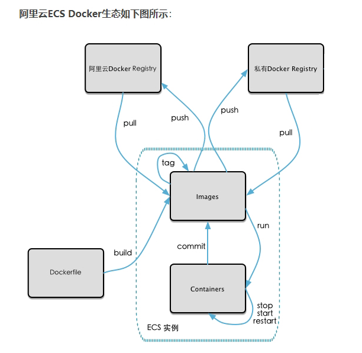
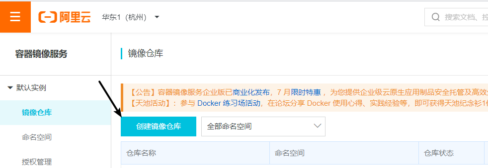
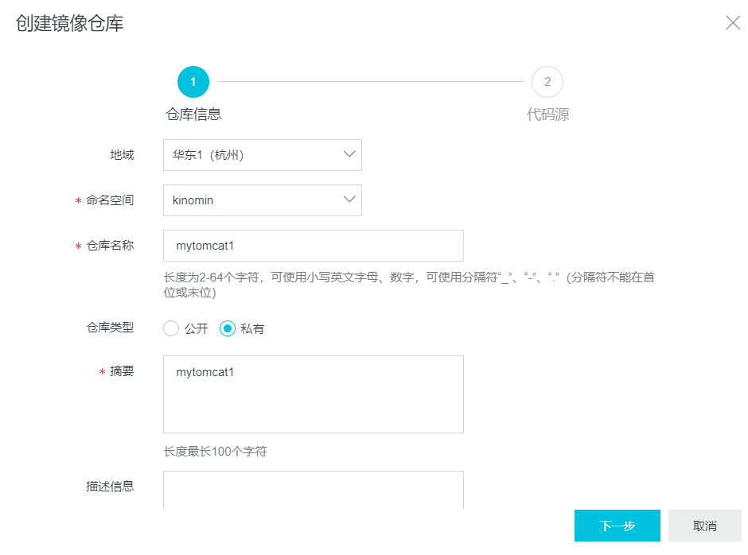
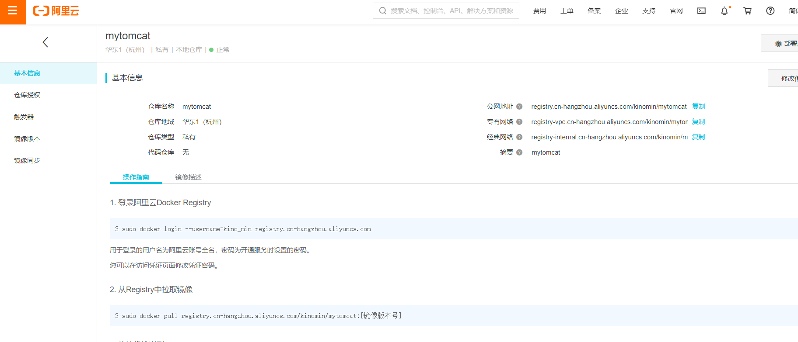
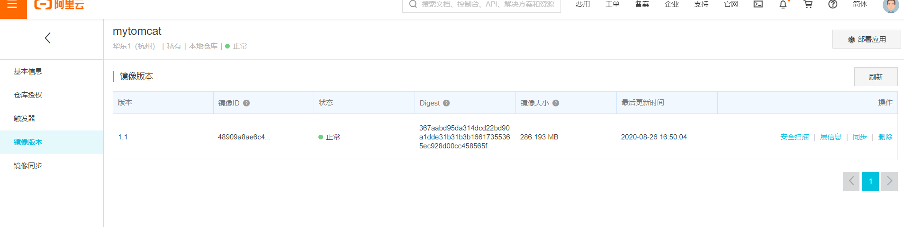

* [一、本地镜像发布到阿里云流程](#%E4%B8%80%E6%9C%AC%E5%9C%B0%E9%95%9C%E5%83%8F%E5%8F%91%E5%B8%83%E5%88%B0%E9%98%BF%E9%87%8C%E4%BA%91%E6%B5%81%E7%A8%8B)
* [二、生成新的本地镜像](#%E4%BA%8C%E7%94%9F%E6%88%90%E6%96%B0%E7%9A%84%E6%9C%AC%E5%9C%B0%E9%95%9C%E5%83%8F)
* [三、推送到阿里云](#%E4%B8%89%E6%8E%A8%E9%80%81%E5%88%B0%E9%98%BF%E9%87%8C%E4%BA%91)
  * [3\.1 登录阿里云开发者平台](#31-%E7%99%BB%E5%BD%95%E9%98%BF%E9%87%8C%E4%BA%91%E5%BC%80%E5%8F%91%E8%80%85%E5%B9%B3%E5%8F%B0)
  * [3\.2 登录阿里云Docker Registry](#32-%E7%99%BB%E5%BD%95%E9%98%BF%E9%87%8C%E4%BA%91docker-registry)
  * [3\.3 将镜像推送到Registry](#33-%E5%B0%86%E9%95%9C%E5%83%8F%E6%8E%A8%E9%80%81%E5%88%B0registry)
  * [3\.4 从Registry中拉取镜像](#34-%E4%BB%8Eregistry%E4%B8%AD%E6%8B%89%E5%8F%96%E9%95%9C%E5%83%8F)


---
# 一、本地镜像发布到阿里云流程



# 二、生成新的本地镜像
```bash
[root@docker1 data]# docker run -it -d -p 11111:8080 mytomcat9
fd061602713c9c3c0032cadee54a4cdc9324774c050bc1e974124a573bef81d2
[root@docker1 data]# docker ps
CONTAINER ID        IMAGE               COMMAND                  CREATED             STATUS              PORTS                                NAMES
fd061602713c        mytomcat9           "/bin/sh -c '/usr/lo…"   4 seconds ago       Up 3 seconds        0.0.0.0:11111->8080/tcp              cool_mayer
23c95edb2f6f        redis:3.2           "docker-entrypoint.s…"   19 minutes ago      Up 19 minutes       0.0.0.0:6379->6379/tcp               laughing_banach
5b8945f51078        mysql:5.7           "docker-entrypoint.s…"   26 minutes ago      Up 26 minutes       33060/tcp, 0.0.0.0:12345->3306/tcp   mysql
[root@docker1 data]# docker commit -a kino -m "mytomcat9 1.1 from latest" fd061602713c mytomcat:1.1
sha256:48909a8ae6c4d131aba38dbb3e85b1e814f20c3324d87be47533c44445c3d2cc[root@docker1 data]# docker images
REPOSITORY          TAG                 IMAGE ID            CREATED             SIZE
mytomcat            1.1                 48909a8ae6c4        7 seconds ago       664MB       <----
mytomcat9           latest              8c7bb158c8a4        2 minutes ago       664MB
centos              latest              0d120b6ccaa8        2 weeks ago         215MB
tomcat              latest              2ae23eb477aa        2 weeks ago         647MB
mysql               5.7                 718a6da099d8        3 weeks ago         448MB
redis               3.2                 87856cc39862        22 months ago       76MB
[root@docker1 data]#
```

# 三、推送到阿里云
## 3.1 登录阿里云开发者平台






## 3.2 登录阿里云Docker Registry
```bash
[root@docker1 data]# docker login --username=你的用户名(图三上有) registry.cn-hangzhou.aliyuncs.com
Password: (输入密码, 是阿里云登录的密码)
WARNING! Your password will be stored unencrypted in /root/.docker/config.json.
Configure a credential helper to remove this warning. See
https://docs.docker.com/engine/reference/commandline/login/#credentials-store

Login Succeeded
```

## 3.3 将镜像推送到Registry
```bash
[root@docker1 ~]# docker images
REPOSITORY          TAG                 IMAGE ID            CREATED             SIZE
mytomcat            1.1                 48909a8ae6c4        22 minutes ago      664MB
mytomcat9           latest              8c7bb158c8a4        24 minutes ago      664MB
centos              latest              0d120b6ccaa8        2 weeks ago         215MB
tomcat              latest              2ae23eb477aa        2 weeks ago         647MB
mysql               5.7                 718a6da099d8        3 weeks ago         448MB
redis               3.2                 87856cc39862        22 months ago       76MB

[root@docker1 data]# docker tag 48909a8ae6c4 registry.cn-hangzhou.aliyuncs.com/kinomin/mytomcat:1.1
[root@docker1 data]# docker push registry.cn-hangzhou.aliyuncs.com/kinomin/mytomcat:1.1
The push refers to repository [registry.cn-hangzhou.aliyuncs.com/kinomin/mytomcat]
a62b2fd02e9f: Layer already exists 
e5d7f77bae0c: Layer already exists 
dcda7ce7ca2e: Layer already exists 
fa434442c3a1: Pushed 
e984235f3d88: Layer already exists 
4b2ba216d3a0: Pushed 
b62f9688c04a: Layer already exists 
291f6e44771a: Pushed 
1.1: digest: sha256:367aabd95da314dcd22bd90a1dde31b31b3b16617355365ec928d00cc458565f size: 1997
```


## 3.4 从Registry中拉取镜像
```bash
[root@docker1 data]# docker pull registry.cn-hangzhou.aliyuncs.com/kinomin/mytomcat:1.1
1.1: Pulling from kinomin/mytomcat
Digest: sha256:367aabd95da314dcd22bd90a1dde31b31b3b16617355365ec928d00cc458565f
Status: Image is up to date for registry.cn-hangzhou.aliyuncs.com/kinomin/mytomcat:1.1
registry.cn-hangzhou.aliyuncs.com/kinomin/mytomcat:1.1
[root@docker1 data]# docker images
REPOSITORY                                           TAG                 IMAGE ID            CREATED             SIZE
mytomcat                                             1.1                 48909a8ae6c4        30 minutes ago      664MB
registry.cn-hangzhou.aliyuncs.com/kinomin/mytomcat   1.1                 48909a8ae6c4        30 minutes ago      664MB
mytomcat9                                            latest              8c7bb158c8a4        32 minutes ago      664MB
centos                                               latest              0d120b6ccaa8        2 weeks ago         215MB
tomcat                                               latest              2ae23eb477aa        2 weeks ago         647MB
mysql                                                5.7                 718a6da099d8        3 weeks ago         448MB
redis                                                3.2                 87856cc39862        22 months ago       76MB
```