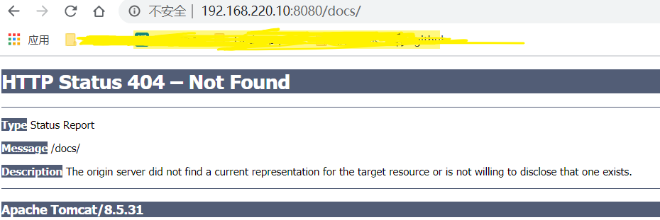
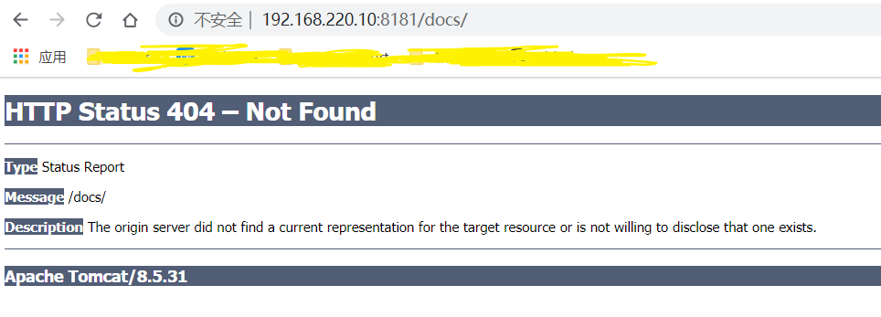

* [一、Docker 镜像是什么?](#%E4%B8%80docker-%E9%95%9C%E5%83%8F%E6%98%AF%E4%BB%80%E4%B9%88)
* [二、UnionFS](#%E4%BA%8Cunionfs)
* [三、Docker 镜像加载原理](#%E4%B8%89docker-%E9%95%9C%E5%83%8F%E5%8A%A0%E8%BD%BD%E5%8E%9F%E7%90%86)
* [四、镜像的分层](#%E5%9B%9B%E9%95%9C%E5%83%8F%E7%9A%84%E5%88%86%E5%B1%82)
* [五、docker 镜像特点](#%E4%BA%94docker-%E9%95%9C%E5%83%8F%E7%89%B9%E7%82%B9)
* [六、docker 镜像 commit 操作](#%E5%85%ADdocker-%E9%95%9C%E5%83%8F-commit-%E6%93%8D%E4%BD%9C)

----
# 一、Docker 镜像是什么?
镜像是一种轻量级、可执行的独立软件包, <font color='red'>用来打包软件运行环境和基于运行环境开发的软件</font>, 它包含运行某个软件所需的所有内容, 包括代码、运行时、库、环境变量和配置文件。

# 二、UnionFS
UnionFS(联合文件系统): Union文件系统(UnionFS)是一种分层、轻量级并且高性能的文件系统, <font color='red'>它支持对文件系统的修改作为一次提交来一层层的叠加</font>, 同时可以将不同目录挂载到同一个虚拟文件系统下(unite several directories into a single virtual filesystem).

Union 文件系统是 Docker 镜像的基础. 镜像可以通过分层来进行继承，基于基础镜像(没有父镜像), 可以制作各种具体的应用镜像.


# 三、Docker 镜像加载原理
docker的镜像实际上由一层一层的文件系统组成, 这种层级的文件系统UnionFS.

bootfs(boot file system)主要包含bootloader和kernel, bootloader主要是引导加载kernel, Linux刚启动时会加载bootfs文件系统, 在Docker镜像的最底层是bootfs. 这一层与我们典型的Linux/Unix系统是一样的, 包含boot加载器和内核. 当boot加载完成之后整个内核就都在内存中了, 此时内存的使用权已由bootfs转交给内核, 此时系统也会卸载bootfs.

rootfs(root file system), 在bootfs之上. 包含的就是典型 Linux 系统中的 /dev, /proc, /bin, /etc 等标准目录和文件. rootfs就是各种不同的操作系统发行版, 比如Ubuntu，Centos等等.

平时我们安装进虚拟机的CentOS都是好几个G, 为什么docker这里才200M??

```bash
[root@docker1 ~]# docker images centos
REPOSITORY          TAG                 IMAGE ID            CREATED             SIZE
centos              latest              831691599b88        5 weeks ago         215MB
```

# 四、镜像的分层
以我们的pull为例, 在下载的过程中我们可以看到docker的镜像好像是在一层一层的在下载

```bash
[root@docker1 ~]# docker pull mysql:5.7
5.7: Pulling from library/mysql
6ec8c9369e08: Pull complete 
177e5de89054: Pull complete 
ab6ccb86eb40: Pull complete 
e1ee78841235: Pull complete 
09cd86ccee56: Pull complete 
78bea0594a44: Pull complete 
caf5f529ae89: Pull complete 
4e54a8bcf566: Pull complete 
50c21ba6527b: Pull complete 
68e74bb27b39: Pull complete 
5f13eadfe747: Pull complete 
Digest: sha256:97869b42772dac5b767f4e4692434fbd5e6b86bcb8695d4feafb52b59fe9ae24
Status: Downloaded newer image for mysql:5.7
docker.io/library/mysql:5.7
```

*为什么 Docker 镜像要采用这种分层结构呢?*

最大的一个好处就是 - 共享资源
 
比如: 有多个镜像都从相同的 base 镜像构建而来, 那么宿主机只需在磁盘上保存一份base镜像, 同时内存中也只需加载一份 base 镜像, 就可以为所有容器服务了, 而且镜像的每一层都可以被共享. 


# 五、docker 镜像特点
Docker 镜像都是只读的, 当容器启动时, 一个新的可写层被加载到镜像的顶部, 这一层通常被称作为 "容器层", "容器层" 之下都叫 "镜像层". 


# 六、docker 镜像 commit 操作
1. `docker commit`
```bash
docker commit -m "提交的描述信息" -a "作者" 容器id 要创建的目标镜像名:标签名
```

2. 案例演示
① 从 Hub 上下载 tomcat 镜像到本地并运行
```bash
[root@docker1 ~]# docker pull tomcat:8.5.31
8.5.31: Pulling from library/tomcat
0bd44ff9c2cf: Pull complete 
047670ddbd2a: Pull complete 
ea7d5dc89438: Pull complete 
4a05570971bb: Pull complete 
66f679cd5859: Pull complete 
89362eaac850: Pull complete 
d76c23323cb4: Pull complete 
f7a113d2d566: Pull complete 
f7ffd00be2be: Pull complete 
dd678d267c76: Pull complete 
97f6f322fa52: Pull complete 
51d085dee99e: Pull complete 
Digest: sha256:e99c57ccb609f64c332ee889dd14c8fcc050dd65afed8bd0c0bc7ece1e4ad2cd
Status: Downloaded newer image for tomcat:8.5.31
docker.io/library/tomcat:8.5.31

[root@docker1 ~]# docker images
REPOSITORY          TAG                 IMAGE ID            CREATED             SIZE
tomcat              8.5.31              df50c9d355cf        2 years ago         463MB

[root@docker1 ~]# docker run -d -p 8080:8080 tomcat

[root@docker1 ~]# docker ps
CONTAINER ID        IMAGE               COMMAND             CREATED             STATUS              PORTS                    NAMES
0949dc263fee        tomcat:8.5.31          "catalina.sh run"   41 seconds ago      Up 40 seconds       0.0.0.0:8080->8080/tcp   optimistic_jang
```

② 打开浏览器输入: ip:8080


③ 删除 tomcat 容器的 doc
```bash
[root@docker1 ~]# docker ps
CONTAINER ID        IMAGE               COMMAND             CREATED             STATUS              PORTS                    NAMES
0949dc263fee        tomcat:8.5.31          "catalina.sh run"   4 minutes ago       Up 3 minutes        0.0.0.0:8080->8080/tcp   optimistic_jang

root@2a85b2af20d6:/usr/local/tomcat# ls -l
total 92
-rw-r-----. 1 root root  57092 Apr 27  2018 LICENSE
-rw-r-----. 1 root root   1723 Apr 27  2018 NOTICE
-rw-r-----. 1 root root   7138 Apr 27  2018 RELEASE-NOTES
-rw-r-----. 1 root root  16246 Apr 27  2018 RUNNING.txt
drwxr-x---. 2 root root   4096 Jun 27  2018 bin
drwx--S---. 1 root root     22 Jul 28 12:41 conf
drwxr-sr-x. 3 root staff    19 Jun 27  2018 include
drwxr-x---. 2 root root   4096 Jun 27  2018 lib
drwxr-x---. 1 root root    177 Jul 28 12:41 logs
drwxr-sr-x. 3 root staff   151 Jun 27  2018 native-jni-lib
drwxr-x---. 2 root root     30 Jun 27  2018 temp
drwxr-x---. 7 root root     81 Apr 27  2018 webapps
drwxr-x---. 1 root root     22 Jul 28 12:41 work

root@2a85b2af20d6:/usr/local/tomcat# cd webapps/

root@2a85b2af20d6:/usr/local/tomcat/webapps# ls -l
total 8
drwxr-x---.  3 root root 4096 Jun 27  2018 ROOT
drwxr-x---. 14 root root 4096 Jun 27  2018 docs
drwxr-x---.  6 root root   83 Jun 27  2018 examples
drwxr-x---.  5 root root   87 Jun 27  2018 host-manager
drwxr-x---.  5 root root  103 Jun 27  2018 manager

root@2a85b2af20d6:/usr/local/tomcat/webapps# rm -rf docs
```


④ 提交当前没有 doc 的tomcat镜像
```bash
[root@docker1 ~]# docker ps -l
CONTAINER ID        IMAGE               COMMAND             CREATED             STATUS              PORTS                    NAMES
2a85b2af20d6        tomcat:8.5.31       "catalina.sh run"   4 minutes ago       Up 4 minutes        0.0.0.0:8080->8080/tcp   peaceful_khorana
[root@docker1 ~]# docker commit -a "kino" -m "del tomcat docs" 2a85b2af20d6 kino/tomcat2:1.0
sha256:3f85b99c0e9d2804ebd04c82906f71da893c42a334647c234a080df3b275ee4a
```

⑤ 启动自己 commit 的 tomcat 镜像
```bash
[root@docker1 ~]# docker run -d -p 8181:8080 kino/tomcat2:1.0
0fd553f5176ae73e8ba23f056b099d9072c00ee737f04cd8869a167511832f45
```
在浏览器中输入: ip+8181/docs/


现在我们自己 commit 的 tomcat 镜像就是没有 docs 的镜像了, 最初从 hub 上下载的 tomcat 是有 docs 的