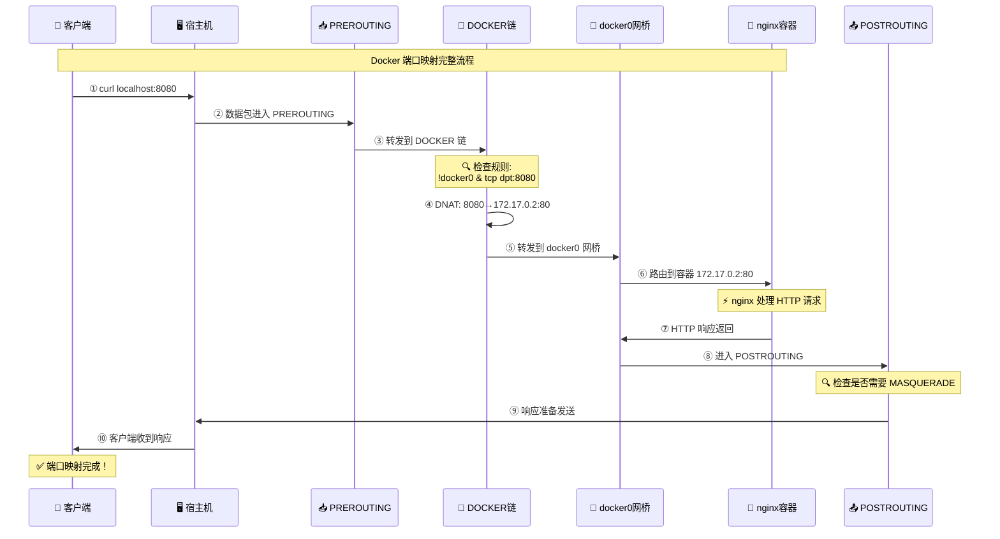
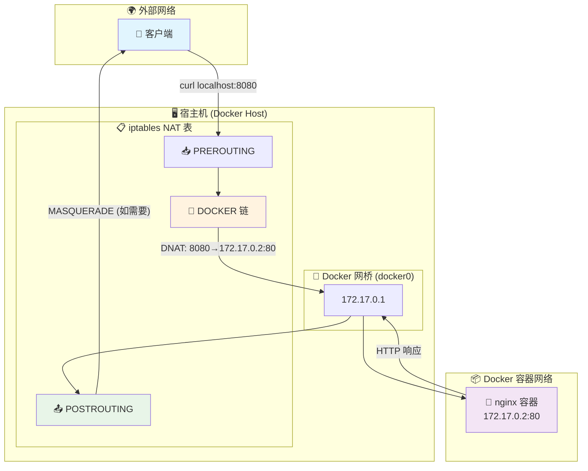

---
# 一、宿主机和容器的流量分配

## 1.1 docker 流量流转情况

一台崭新的Centos服务器, 默认有两个网卡:
```bash
$ ip addr
1: lo: <LOOPBACK,UP,LOWER_UP> mtu 65536 qdisc noqueue state UNKNOWN group default qlen 1000
    link/loopback 00:00:00:00:00:00 brd 00:00:00:00:00:00
    inet 127.0.0.1/8 scope host lo
       valid_lft forever preferred_lft forever
    inet6 ::1/128 scope host
       valid_lft forever preferred_lft forever
2: eth0: <BROADCAST,MULTICAST,UP,LOWER_UP> mtu 1500 qdisc pfifo_fast state UP group default qlen 1000
    link/ether 00:16:3e:23:e0:17 brd ff:ff:ff:ff:ff:ff
    inet 172.18.207.68/20 brd 172.18.207.255 scope global dynamic eth0
       valid_lft 1892159531sec preferred_lft 1892159531sec
    inet6 fe80::216:3eff:fe23:e017/64 scope link
       valid_lft forever preferred_lft forever
```

当安装上 docker 后, 会增加一个网卡:
```bash
3: docker0: <NO-CARRIER,BROADCAST,MULTICAST,UP> mtu 1500 qdisc noqueue state DOWN group default
    link/ether 02:42:29:4a:b8:4f brd ff:ff:ff:ff:ff:ff
    inet 172.17.0.1/16 brd 172.17.255.255 scope global docker0
       valid_lft forever preferred_lft forever
```
创建一个容器

```bash
$ docker run -d --name nginx -p 8080:80 nginx
```

宿主机网卡会多一个网卡

```bash
$ ip addr
1: lo: <LOOPBACK,UP,LOWER_UP> mtu 65536 qdisc noqueue state UNKNOWN group default qlen 1000
    link/loopback 00:00:00:00:00:00 brd 00:00:00:00:00:00
    inet 127.0.0.1/8 scope host lo
       valid_lft forever preferred_lft forever
    inet6 ::1/128 scope host
       valid_lft forever preferred_lft forever
2: eth0: <BROADCAST,MULTICAST,UP,LOWER_UP> mtu 1500 qdisc pfifo_fast state UP group default qlen 1000
    link/ether 00:16:3e:23:e0:17 brd ff:ff:ff:ff:ff:ff
    inet 172.18.207.68/20 brd 172.18.207.255 scope global dynamic eth0
       valid_lft 1892159368sec preferred_lft 1892159368sec
    inet6 fe80::216:3eff:fe23:e017/64 scope link
       valid_lft forever preferred_lft forever
3: docker0: <BROADCAST,MULTICAST,UP,LOWER_UP> mtu 1500 qdisc noqueue state UP group default
    link/ether 02:42:29:4a:b8:4f brd ff:ff:ff:ff:ff:ff
    inet 172.17.0.1/16 brd 172.17.255.255 scope global docker0
       valid_lft forever preferred_lft forever
    inet6 fe80::42:29ff:fe4a:b84f/64 scope link
       valid_lft forever preferred_lft forever
5: vethb736276@if4: <BROADCAST,MULTICAST,UP,LOWER_UP> mtu 1500 qdisc noqueue master docker0 state UP group default
    link/ether 9a:b0:77:75:45:36 brd ff:ff:ff:ff:ff:ff link-netnsid 0
    inet6 fe80::98b0:77ff:fe75:4536/64 scope link
       valid_lft forever preferred_lft forever
```

当外部请求访问容器服务时, 网络顺序是:

```bash
外网 → 主机eth0(172.18.207.68) → iptables/netfilter规则 → docker0(172.17.0.1) → vethb736276@if4 → eth0(172.17.0.2) → 容器内应用
```

- `iptables`: 

  ```bash
  [root@iZwz9c2wwrtacltkcj6n9oZ ~]# iptables -t nat -nL -v
  # 预路由: 数据包当到达服务器的时候的第一个检查点。类似快递到分拣中心, 检查收件地址, 决定送到哪里
  Chain PREROUTING (policy ACCEPT 141 packets, 10850 bytes)
   # 所有发往本地的流量都要经过 DOCKER链 检查
   # pkts bytes: 已经处理了 358 个包, 共 26776 字节
   # ADDRTYPE match dst-type LOCAL: 只匹配目标是本机地址的数据包
   # docker 安装后自动添加
   pkts bytes target     prot opt in     out     source               destination
      1    40 DOCKER     all  --  *      *       0.0.0.0/0            0.0.0.0/0            ADDRTYPE match dst-type LOCAL
  
  # 入站: 发往本机进程的数据包检查点, 它决定是否允许访问。确定这个快递确实是给我们这栋楼的 
  Chain INPUT (policy ACCEPT 137 packets, 10602 bytes)
   # 此链为空，表示没有特殊的入站NAT规则，全部接受(ACCEPT)
   # Docker 主要在 PREROUTING 阶段处理入站流量转发
   pkts bytes target     prot opt in     out     source               destination
  
  # 出站: 本机发出的数据包检查点, 控制本机访问外部的流量。我们寄快递的检查点
  Chain OUTPUT (policy ACCEPT 183 packets, 13770 bytes)
   # 处理本机程序访问容器的情况（如容器通过宿主机端口访问自己）
   # !127.0.0.0/8: 排除本地回环地址，避免影响localhost通信
   # 包计数为0说明暂时没有这种访问场景发生
   # docker 安装后自动添加
   pkts bytes target     prot opt in     out     source               destination
      0     0 DOCKER     all  --  *      *       0.0.0.0/0           !127.0.0.0/8          ADDRTYPE match dst-type LOCAL
  
  # 后路由: 数据包离开服务器前的最后检查点, 主要做NAT、MASQUERADE 源地址转换。快递出门前的最后检查，贴上我们的寄件地址
  Chain POSTROUTING (policy ACCEPT 183 packets, 13770 bytes)
   pkts bytes target     prot opt in     out     source               destination
     # 规则1: 容器访问外网时的地址伪装（核心网络规则）
     # 172.17.0.0/16: Docker默认网段的所有容器
     # !docker0: 不是通过docker0网桥出去的流量（即去往外网的流量）
     # MASQUERADE: 将容器内网IP伪装成宿主机IP，让外网能正确响应
     # 16个包，999字节: 说明有容器访问过外网
     # docker 安装后自动添加
      0     0 MASQUERADE  all  --  *      !docker0  172.17.0.0/16        0.0.0.0/0
     
     # 规则2: 容器通过宿主机端口访问自己时的地址伪装（特殊场景）
     # 172.17.0.2 -> 172.17.0.2: 容器访问自己
     # tcp dpt:80: 访问80端口时
     # 避免容器通过 localhost:8080 访问自己时出现路由环路
     # 包计数为0: 说明这种自访问情况还没发生
      0     0 MASQUERADE  tcp  --  *      *       172.17.0.2           172.17.0.2           tcp dpt:80
  
  # Docker自定义链: 处理所有Docker相关的端口映射和网络转发
  # docker 安装后自动添加
  Chain DOCKER (2 references)
   pkts bytes target     prot opt in     out     source               destination
      # 规则1: Docker内部通信直接放行（优化规则）
      # docker0: Docker默认网桥
      # RETURN: 直接返回上级链，不再处理后续规则
      # 容器间通信或容器访问宿主机时直接放行，提高效率
      # 包计数为0: 说明暂时没有这种内部通信
      0     0 RETURN     all  --  docker0 *       0.0.0.0/0            0.0.0.0/0
      
      # 规则2: 端口映射的核心实现（DNAT目标地址转换）
      # !docker0: 不是来自docker0网桥的流量（即外部流量）
      # tcp dpt:8080: 访问8080端口的TCP流量
      # to:172.17.0.2:80: 转发到容器172.17.0.2的80端口
      # 这就是 docker run -p 8080:80 的实现原理！
      # 包计数为0: 说明还没有人访问过8080端口
      0     0 DNAT       tcp  --  !docker0 *       0.0.0.0/0            0.0.0.0/0            tcp dpt:8080 to:172.17.0.2:80
  ```

- `docker0`: docker 网桥，充当网关做网络转发

- `vethb736276@if4`: veth 是一种Linux 的虚拟网络设备，它具备以下特点:
  - **成对出现**: 总是以一对的形式存在，数据从一端进入，会从另一端出来
  - **双向通信**: 两端可以互相发送和接受数据包
  - **夸命名空间**: 可以将两端分别放在不同的网络命令空间中

- `eth0`: 容器内的网卡名, veth 的另一端，从主机端 veth 进入的数据包会从这一端出来
- `容器内应用`: 真正的服务进程

## 1.2 docker安装后干了啥

1. 在主机上添加了一个网卡: `docker0`

2. 在 `iptables` `nat` 表中添加如下内容:

   ```bash
   Chain PREROUTING (policy ACCEPT 141 packets, 10850 bytes)
    pkts bytes target     prot opt in     out     source               destination
       # 添加一条记录
       0     0 DOCKER     all  --  *      *       0.0.0.0/0            0.0.0.0/0            ADDRTYPE match dst-type LOCAL
       
   Chain OUTPUT (policy ACCEPT 26 packets, 1770 bytes)
    pkts bytes target     prot opt in     out     source               destination
       # 添加一条记录
       0     0 DOCKER     all  --  *      *       0.0.0.0/0           !127.0.0.0/8          ADDRTYPE match dst-type LOCAL
       
   Chain POSTROUTING (policy ACCEPT 26 packets, 1770 bytes)
    pkts bytes target     prot opt in     out     source               destination
       # 添加一条记录
       0     0 MASQUERADE  all  --  *      !docker0  172.17.0.0/16        0.0.0.0/0
   
   # 添加一条 Chain 
   Chain DOCKER (2 references)
    pkts bytes target     prot opt in     out     source               destination
       0     0 RETURN     all  --  docker0 *       0.0.0.0/0            0.0.0.0/0
   ```

   

## 1.3 总结

完整的数据流程







1. Docker 底层就是 iptables 规则
2. `端口映射 = DNAT:` 目标地址转换
3. `容器上网 = MASQUERADE`: 源地址伪装实现


这个网卡的ip是: 172.17.0.1, 这个网卡的作用如下图所示:


当eth0网卡 接收到请求后, 会通过 iptables 自动识别哪些流量是给 docker0 的(通过容器暴露的端口)


```bash
$ iptables -nL
Chain INPUT (policy ACCEPT)
target     prot opt source               destination         
ACCEPT     all  --  0.0.0.0/0            0.0.0.0/0            ctstate RELATED,ESTABLISHED
ACCEPT     all  --  0.0.0.0/0            0.0.0.0/0           
INPUT_direct  all  --  0.0.0.0/0            0.0.0.0/0           
INPUT_ZONES_SOURCE  all  --  0.0.0.0/0            0.0.0.0/0           
INPUT_ZONES  all  --  0.0.0.0/0            0.0.0.0/0           
DROP       all  --  0.0.0.0/0            0.0.0.0/0            ctstate INVALID
REJECT     all  --  0.0.0.0/0            0.0.0.0/0            reject-with icmp-host-prohibited

Chain FORWARD (policy DROP)
target     prot opt source               destination         
DOCKER-USER  all  --  0.0.0.0/0            0.0.0.0/0           
DOCKER-ISOLATION-STAGE-1  all  --  0.0.0.0/0            0.0.0.0/0           
ACCEPT     all  --  0.0.0.0/0            0.0.0.0/0            ctstate RELATED,ESTABLISHED
DOCKER     all  --  0.0.0.0/0            0.0.0.0/0           
ACCEPT     all  --  0.0.0.0/0            0.0.0.0/0           
ACCEPT     all  --  0.0.0.0/0            0.0.0.0/0           
ACCEPT     all  --  0.0.0.0/0            0.0.0.0/0            ctstate RELATED,ESTABLISHED
DOCKER     all  --  0.0.0.0/0            0.0.0.0/0           
ACCEPT     all  --  0.0.0.0/0            0.0.0.0/0           
ACCEPT     all  --  0.0.0.0/0            0.0.0.0/0           
ACCEPT     all  --  0.0.0.0/0            0.0.0.0/0            ctstate RELATED,ESTABLISHED
DOCKER     all  --  0.0.0.0/0            0.0.0.0/0           
ACCEPT     all  --  0.0.0.0/0            0.0.0.0/0           
ACCEPT     all  --  0.0.0.0/0            0.0.0.0/0           
ACCEPT     all  --  0.0.0.0/0            0.0.0.0/0            ctstate RELATED,ESTABLISHED
ACCEPT     all  --  0.0.0.0/0            0.0.0.0/0           
FORWARD_direct  all  --  0.0.0.0/0            0.0.0.0/0           
FORWARD_IN_ZONES_SOURCE  all  --  0.0.0.0/0            0.0.0.0/0           
FORWARD_IN_ZONES  all  --  0.0.0.0/0            0.0.0.0/0           
FORWARD_OUT_ZONES_SOURCE  all  --  0.0.0.0/0            0.0.0.0/0           
FORWARD_OUT_ZONES  all  --  0.0.0.0/0            0.0.0.0/0           
DROP       all  --  0.0.0.0/0            0.0.0.0/0            ctstate INVALID
REJECT     all  --  0.0.0.0/0            0.0.0.0/0            reject-with icmp-host-prohibited

Chain OUTPUT (policy ACCEPT)
target     prot opt source               destination         
ACCEPT     all  --  0.0.0.0/0            0.0.0.0/0           
OUTPUT_direct  all  --  0.0.0.0/0            0.0.0.0/0           

Chain DOCKER (3 references)
target     prot opt source               destination         
ACCEPT     tcp  --  0.0.0.0/0            172.17.0.3           tcp dpt:50000
ACCEPT     tcp  --  0.0.0.0/0            172.17.0.3           tcp dpt:8080
....
```

例如, 这里如果eth0网卡接收到 8080端口的流量后, 会将流量交给docker0中ip是 172.17.0.3 的容器


# 二、容器之间的互联
启动一个 tomcat1 容器
```bash
$ docker run -itd -P --name tomcat1 tomcat:7
```
再启动一个 tomcat2 容器, 连接上 tomcat1 容器
```bash
$ docker run -itd -P --name tomcat2 --link tomcat1:tomcat tomcat:7

$ docker ps 
2285ef816f2a   tomcat:7              "catalina.sh run"        10 seconds ago   Up 10 seconds   0.0.0.0:49154->8080/tcp, :::49154->8080/tcp                                                tomcat2
444b69a1b0fc   tomcat:7              "catalina.sh run"        31 seconds ago   Up 30 seconds   0.0.0.0:49153->8080/tcp, :::49153->8080/tcp
```
在 tomcat2 中 ping tomcat1 
```bash
$ docker exec -it tomcat2 ping tomcat1
PING tomcat1 (172.17.0.2) 56(84) bytes of data.
64 bytes from tomcat1 (172.17.0.2): icmp_seq=1 ttl=64 time=0.088 ms
64 bytes from tomcat1 (172.17.0.2): icmp_seq=2 ttl=64 time=0.090 ms
64 bytes from tomcat1 (172.17.0.2): icmp_seq=3 ttl=64 time=0.072 m
```
在 tomcat1 中 ping tomcat2 
```bash
$ docker exec -it tomcat1  ping tomcat2
ping: tomcat2: No address associated with hostname
```
可以看见, 在 tomcat1 中并不能 ping 通 tomcat2, 由此说明, **这种方式是单向互联的**

另外再看看 tomcat1 的 /etc/hosts
```bash
$ docker exec -it tomcat1 cat /etc/hosts
127.0.0.1	localhost
::1	localhost ip6-localhost ip6-loopback
fe00::0	ip6-localnet
ff00::0	ip6-mcastprefix
ff02::1	ip6-allnodes
ff02::2	ip6-allrouters
172.17.0.2	444b69a1b0fc
```
再看看 tomcat2 的 /etc/hosts 文件
```bash
$ docker exec -it tomcat2 cat /etc/hosts
127.0.0.1	localhost
::1	localhost ip6-localhost ip6-loopback
fe00::0	ip6-localnet
ff00::0	ip6-mcastprefix
ff02::1	ip6-allnodes
ff02::2	ip6-allrouters
172.17.0.2	tomcat1 tomcat 444b69a1b0fc
172.17.0.4	2285ef816f2a
```
可以看见:
1. tomcat1 的 hosts 文件中, 只记录了自己的 ip和主机名
2. tomcat2 的 hosts 文件中, 记录了 tomcat1 的ip 和主机名, 还记录了自己的ip 和主机名

在 tomcat2 的 hosts 中记录tomcat1 的ip 是写死的, 如果有一天, tomcat1 容器故障(或其他原因), 导致tomcat1 的 ip地址发生变化, 此时 tomcat2 就访问不到 tomcat1 了

## 2.1 总结
两个弊端:
1. 互联是单向的;
2. hosts 文件中的 ip 是写死的, 可能会产生问题


# 三、自定义网络
## 3.1 默认网络原理 
Docker使用 Linux 桥接，在宿主机虚拟一个 Docker 容器网桥(docker0)，Docker 启动一个容器时会根据 Docker 网桥的网段分配给容器一个IP地址，称为 Container-IP ，同时Docker网桥是每个容器的默认网关。因为在同一宿主机内的容器都接入同一个网桥，这样容器之间就能够通过容器的Container-IP直接通信。


Docker容器网络就很好的利用了Linux虚拟网络技术，在本地主机和容器内分别创建一个虚拟接口，并让他们彼此联通（这样一对接口叫veth pair）;

Docker中的网络接口默认都是虚拟的接口。虚拟接口的优势就是转发效率极高（因为Linux是在内核中进行数据的复制来实现虚拟接口之间的数据转发，无需通过外部的网络设备交换），对于本地系统和容器系统来说，虚拟接口跟一个正常的以太网卡相比并没有区别，只是他的速度快很多。

原理：
1. 每一个安装了Docker的linux主机都有一个docker0的虚拟网卡。桥接网卡
2. 每启动一个容器linux主机多了一个虚拟网卡。
3. docker run -d -P --name tomcat --net bridge tomcat:8

## 3.2 网络模式
| 网络模式 | 配置 | 说明 |
| ---- | ---- | ---- |
| bridge模式 | --net=bridge | 默认值，在Docker网桥docker0上为容器创建新的网络栈 |
| none模式 | --net=none | 不配置网络，用户可以稍后进入容器，自行配置 | 
| container模式 | --net=container:name/id |  容器和另外一个容器共享Network namespace。 <br/>kubernetes中的pod就是多个容器共享一个Network namespace。
| host模式 | --net=host | 容器和宿主机共享Network namespace；| 
| 用户自定义 | --net=mynet | 用户自己使用network相关命令定义网络，创建容器的时候可以指定为自己定义的网络

## 3.3 创建网络
创建一个网络
```bash
# driver: 网络模式是 bridge(磨人的)
# subnet: 子网掩码
# gateway: 网关
$ docker network create --driver bridge --subnet 192.168.0.0/16 --gateway 192.168.0.1 mynetwork
```
将已经存在的容器加入自定义网络
```bash
$ docker netowrk connect mynetwork toncat1
```
启动容器时, 指定自定义网络
```bash
$ docker run -itd -P --network mynetwork --name tomcat4 tomcat:7
```
再启动一个容器
```bash
$ docker run -itd -P --network mynetwork --name tomcat5 tomcat:7
```
在 tomcat4 中 ping tomcat5 
```bash
$ docker exec -it tomcat4 ping tomcat5
PING tomcat5 (192.168.0.3) 56(84) bytes of data.
64 bytes from tomcat5.mynetwork (192.168.0.3): icmp_seq=1 ttl=64 time=0.077 ms
64 bytes from tomcat5.mynetwork (192.168.0.3): icmp_seq=2 ttl=64 time=0.397 ms
```
在 tomcat5 中 ping tomcat4 
```bash
$ docker exec -it tomcat5 ping tomcat4
PING tomcat4 (192.168.0.2) 56(84) bytes of data.
64 bytes from tomcat4.mynetwork (192.168.0.2): icmp_seq=1 ttl=64 time=0.069 ms
64 bytes from tomcat4.mynetwork (192.168.0.2): icmp_seq=2 ttl=64 time=0.195 ms
```
在启动一个容器
```bash
$ docker run -itd -P --network mynetwork --name tomcat6 tomcat:7
```
在 tomcat4 中ping tomcat6
```bash
$ docker exec -it tomcat4 ping tomcat6
PING tomcat6 (192.168.0.4) 56(84) bytes of data.
64 bytes from tomcat6.mynetwork (192.168.0.4): icmp_seq=1 ttl=64 time=0.091 ms
64 bytes from tomcat6.mynetwork (192.168.0.4): icmp_seq=2 ttl=64 time=0.211 ms
```
可以看见, **此时的互联是双向的**, 并且只要启动容器时, 指定了相同的自定义网络, 随时都可以互相访问

查看 tomcat4 的 /etc/hosts 文件
```bash
$ docker exec -it tomcat4 cat /etc/hosts
127.0.0.1	localhost
::1	localhost ip6-localhost ip6-loopback
fe00::0	ip6-localnet
ff00::0	ip6-mcastprefix
ff02::1	ip6-allnodes
ff02::2	ip6-allrouters
192.168.0.2	adca4808dd6d
```
这里并没有看见 tomcat6 和 tomcat5 存在 hosts文件中, 能直接 ping 通是因为这个容器都处于同一个网段中


查看自定义网络的详细信息
```bash
$ docker network inspect mynetwork
[
    {
        "Name": "mynetwork",
        "Id": "2743eeb09bf2463d01d14098aeb9d3aad94d2fac3acb2e6efe50988dc86b2dc4",
        "Created": "2021-04-19T22:18:28.200260231+08:00",
        "Scope": "local",
        "Driver": "bridge",
        "EnableIPv6": false,
        "IPAM": {
            "Driver": "default",
            "Options": {},
            "Config": [
                {
                    "Subnet": "192.168.0.0/16",
                    "Gateway": "192.168.0.1"
                }
            ]
        },
        "Internal": false,
        "Attachable": false,
        "Ingress": false,
        "ConfigFrom": {
            "Network": ""
        },
        "ConfigOnly": false,
        "Containers": {
            "7d6a37ac67aff28c68e2583567de5f35142024aecc0713ebc63ab6038d1bcea3": {
                "Name": "tomcat6",
                "EndpointID": "7bc643baa0ce1078097c32e603c861fab5b6c21b6c0fdde2533379bbf36d79b0",
                "MacAddress": "02:42:c0:a8:00:04",
                "IPv4Address": "192.168.0.4/16",
                "IPv6Address": ""
            },
            "adca4808dd6d9eb35ef97b08243e40dbbfd73f8786c89d416e38bab27dd1043f": {
                "Name": "tomcat4",
                "EndpointID": "7672470a2c21a106ba481ac71fdd4f7b1b5ce072a01cb0409f0058b350e2860a",
                "MacAddress": "02:42:c0:a8:00:02",
                "IPv4Address": "192.168.0.2/16",
                "IPv6Address": ""
            },
            "dba7d01a4fb8cf67c5f9bb0e2be4636978e6f4f4ee439496c52173937345ad71": {
                "Name": "tomcat5",
                "EndpointID": "18f2aadb8e25974c08e9b632c30646da6e3e3bf1e88392610cdbae25cc088532",
                "MacAddress": "02:42:c0:a8:00:03",
                "IPv4Address": "192.168.0.3/16",
                "IPv6Address": ""
            }
        },
        "Options": {},
        "Labels": {}
    }
```
可以看见, 在这个自定义网络下, 有三个容器加入了进来, 这三个容器处于同一个网段下, 就可以通过 ip 和 主机名互相访问了