---
# 一、宿主机和容器的流量分配

## 1.1 docker 流量流转情况

一台崭新的Centos服务器, 默认有两个网卡:
```bash
1: lo: <LOOPBACK,UP,LOWER_UP> mtu 65536 qdisc noqueue state UNKNOWN group default qlen 1000
    link/loopback 00:00:00:00:00:00 brd 00:00:00:00:00:00
    inet 127.0.0.1/8 scope host lo
       valid_lft forever preferred_lft forever
    inet6 ::1/128 scope host
       valid_lft forever preferred_lft forever
2: eth0: <BROADCAST,MULTICAST,UP,LOWER_UP> mtu 1500 qdisc pfifo_fast state UP group default qlen 1000
    link/ether 00:16:3e:13:66:0a brd ff:ff:ff:ff:ff:ff
    inet 172.18.3.187/20 brd 172.18.15.255 scope global dynamic eth0
       valid_lft 1892158778sec preferred_lft 1892158778sec
    inet6 fe80::216:3eff:fe13:660a/64 scope link
       valid_lft forever preferred_lft forever
```

当安装上 docker 后, 会增加一个网卡:
```bash
3: docker0: <NO-CARRIER,BROADCAST,MULTICAST,UP> mtu 1500 qdisc noqueue state DOWN group default
    link/ether 02:42:91:18:ae:57 brd ff:ff:ff:ff:ff:ff
    inet 172.17.0.1/16 brd 172.17.255.255 scope global docker0
       valid_lft forever preferred_lft forever
```
创建一个容器

```bash
$ docker run -d --name nginx -p 8080:80 nginx
```

宿主机网卡会多一个网卡

```bash
1: lo: <LOOPBACK,UP,LOWER_UP> mtu 65536 qdisc noqueue state UNKNOWN group default qlen 1000
    link/loopback 00:00:00:00:00:00 brd 00:00:00:00:00:00
    inet 127.0.0.1/8 scope host lo
       valid_lft forever preferred_lft forever
    inet6 ::1/128 scope host
       valid_lft forever preferred_lft forever
2: eth0: <BROADCAST,MULTICAST,UP,LOWER_UP> mtu 1500 qdisc pfifo_fast state UP group default qlen 1000
    link/ether 00:16:3e:13:66:0a brd ff:ff:ff:ff:ff:ff
    inet 172.18.3.187/20 brd 172.18.15.255 scope global dynamic eth0
       valid_lft 1892158747sec preferred_lft 1892158747sec
    inet6 fe80::216:3eff:fe13:660a/64 scope link
       valid_lft forever preferred_lft forever
3: docker0: <BROADCAST,MULTICAST,UP,LOWER_UP> mtu 1500 qdisc noqueue state UP group default
    link/ether 02:42:91:18:ae:57 brd ff:ff:ff:ff:ff:ff
    inet 172.17.0.1/16 brd 172.17.255.255 scope global docker0
       valid_lft forever preferred_lft forever
    inet6 fe80::42:91ff:fe18:ae57/64 scope link
       valid_lft forever preferred_lft forever
5: vethb331178@if4: <BROADCAST,MULTICAST,UP,LOWER_UP> mtu 1500 qdisc noqueue master docker0 state UP group default
    link/ether ce:79:8a:73:b1:13 brd ff:ff:ff:ff:ff:ff link-netnsid 0
    inet6 fe80::cc79:8aff:fe73:b113/64 scope link
       valid_lft forever preferred_lft forever
```

当外部请求访问容器服务时, 网络顺序是:

```bash
外网 → 主机eth0(172.18.207.67) → iptables/netfilter规则 → docker0(172.17.0.1) → vethb331178@if4 → eth0(172.17.0.2) → 容器内应用
```

- `iptables`: 

  - filter 表

  ```bash
  $ iptables -t filter -nL -v
  Chain INPUT (policy ACCEPT 198 packets, 37671 bytes)
   pkts bytes target     prot opt in     out     source               destination
  
  Chain FORWARD (policy DROP 0 packets, 0 bytes)
   pkts bytes target     prot opt in     out     source               destination
      0     0 DOCKER-USER  all  --  *      *       0.0.0.0/0            0.0.0.0/0
      0     0 DOCKER-ISOLATION-STAGE-1  all  --  *      *       0.0.0.0/0            0.0.0.0/0
      0     0 ACCEPT     all  --  *      docker0  0.0.0.0/0            0.0.0.0/0            ctstate RELATED,ESTABLISHED
      0     0 DOCKER     all  --  *      docker0  0.0.0.0/0            0.0.0.0/0
      0     0 ACCEPT     all  --  docker0 !docker0  0.0.0.0/0            0.0.0.0/0
      0     0 ACCEPT     all  --  docker0 docker0  0.0.0.0/0            0.0.0.0/0
  
  Chain OUTPUT (policy ACCEPT 172 packets, 73360 bytes)
   pkts bytes target     prot opt in     out     source               destination
  
  Chain DOCKER (1 references)
   pkts bytes target     prot opt in     out     source               destination
      0     0 ACCEPT     tcp  --  !docker0 docker0  0.0.0.0/0            172.17.0.2           tcp dpt:80
  
  Chain DOCKER-ISOLATION-STAGE-1 (1 references)
   pkts bytes target     prot opt in     out     source               destination
      0     0 DOCKER-ISOLATION-STAGE-2  all  --  docker0 !docker0  0.0.0.0/0            0.0.0.0/0
      0     0 RETURN     all  --  *      *       0.0.0.0/0            0.0.0.0/0
  
  Chain DOCKER-ISOLATION-STAGE-2 (1 references)
   pkts bytes target     prot opt in     out     source               destination
      0     0 DROP       all  --  *      docker0  0.0.0.0/0            0.0.0.0/0
      0     0 RETURN     all  --  *      *       0.0.0.0/0            0.0.0.0/0
  
  Chain DOCKER-USER (1 references)
   pkts bytes target     prot opt in     out     source               destination
      0     0 RETURN     all  --  *      *       0.0.0.0/0            0.0.0.0/0
  ```

  - net 表

  ```bash
  $ iptables -t nat -nL -v
  # 预路由: 数据包当到达服务器的时候的第一个检查点。类似快递到分拣中心, 检查收件地址, 决定送到哪里
  Chain PREROUTING (policy ACCEPT 141 packets, 10850 bytes)
   # 所有发往本地的流量都要经过 DOCKER链 检查
   # pkts bytes: 已经处理了 0 个包, 共 0 字节
   # ADDRTYPE match dst-type LOCAL: 只匹配目标是本机地址的数据包
   # docker 安装后自动添加
   pkts bytes target     prot opt in     out     source               destination
      0     0 DOCKER     all  --  *      *       0.0.0.0/0            0.0.0.0/0            ADDRTYPE match dst-type LOCAL
  
  # 入站: 发往本机进程的数据包检查点, 它决定是否允许访问。确定这个快递确实是给我们这栋楼的 
  Chain INPUT (policy ACCEPT 137 packets, 10602 bytes)
   # 此链为空，表示没有特殊的入站NAT规则，全部接受(ACCEPT)
   # Docker 主要在 PREROUTING 阶段处理入站流量转发
   pkts bytes target     prot opt in     out     source               destination
  
  # 出站: 本机发出的数据包检查点, 控制本机访问外部的流量。我们寄快递的检查点
  Chain OUTPUT (policy ACCEPT 183 packets, 13770 bytes)
   # 处理本机程序访问容器的情况（如容器通过宿主机端口访问自己）
   # !127.0.0.0/8: 排除本地回环地址，避免影响localhost通信
   # 包计数为0说明暂时没有这种访问场景发生
   # docker 安装后自动添加
   pkts bytes target     prot opt in     out     source               destination
      0     0 DOCKER     all  --  *      *       0.0.0.0/0           !127.0.0.0/8          ADDRTYPE match dst-type LOCAL
  
  # 后路由: 数据包离开服务器前的最后检查点, 主要做NAT、MASQUERADE 源地址转换。快递出门前的最后检查，贴上我们的寄件地址
  Chain POSTROUTING (policy ACCEPT 183 packets, 13770 bytes)
   pkts bytes target     prot opt in     out     source               destination
     # 规则1: 容器访问外网时的地址伪装（核心网络规则）
     # 172.17.0.0/16: Docker默认网段的所有容器
     # !docker0: 不是通过docker0网桥出去的流量（即去往外网的流量）
     # MASQUERADE: 将容器内网IP伪装成宿主机IP，让外网能正确响应
     # 16个包，999字节: 说明有容器访问过外网
     # docker 安装后自动添加
      0     0 MASQUERADE  all  --  *      !docker0  172.17.0.0/16        0.0.0.0/0
     
     # 规则2: 容器通过宿主机端口访问自己时的地址伪装（特殊场景）
     # 172.17.0.2 -> 172.17.0.2: 容器访问自己
     # tcp dpt:80: 访问80端口时
     # 避免容器通过 localhost:8080 访问自己时出现路由环路
     # 包计数为0: 说明这种自访问情况还没发生
      0     0 MASQUERADE  tcp  --  *      *       172.17.0.2           172.17.0.2           tcp dpt:80
  
  # Docker自定义链: 处理所有Docker相关的端口映射和网络转发
  # docker 安装后自动添加
  Chain DOCKER (2 references)
   pkts bytes target     prot opt in     out     source               destination
      # 规则1: Docker内部通信直接放行（优化规则）
      # docker0: Docker默认网桥
      # RETURN: 直接返回上级链，不再处理后续规则
      # 容器间通信或容器访问宿主机时直接放行，提高效率
      # 包计数为0: 说明暂时没有这种内部通信
      0     0 RETURN     all  --  docker0 *       0.0.0.0/0            0.0.0.0/0
      
      # 规则2: 端口映射的核心实现（DNAT目标地址转换）
      # !docker0: 不是来自docker0网桥的流量（即外部流量）
      # tcp dpt:8080: 访问8080端口的TCP流量
      # to:172.17.0.2:80: 转发到容器172.17.0.2的80端口
      # 这就是 docker run -p 8080:80 的实现原理！
      # 包计数为0: 说明还没有人访问过8080端口
      0     0 DNAT       tcp  --  !docker0 *       0.0.0.0/0            0.0.0.0/0            tcp dpt:8080 to:172.17.0.2:80
  ```

- `docker0`: docker 网桥，充当网关做网络转发

- `vethe3147f9@if4`: veth 是一种Linux 的虚拟网络设备，它具备以下特点:
  - **成对出现**: 总是以一对的形式存在，数据从一端进入，会从另一端出来
  - **双向通信**: 两端可以互相发送和接受数据包
  - **夸命名空间**: 可以将两端分别放在不同的网络命令空间中

- `eth0`: 容器内的网卡名, veth 的另一端，从主机端 veth 进入的数据包会从这一端出来
- `容器内应用`: 真正的服务进程

## 1.2 docker安装后干了啥

1. 在主机上添加了一个网卡: `docker0`

2. 在 `iptables` `nat` 表中添加如下内容:

   ```bash
   $ iptables -t nat -nvL
   Chain PREROUTING (policy ACCEPT 141 packets, 10850 bytes)
    pkts bytes target     prot opt in     out     source               destination
       # 添加一条记录
       0     0 DOCKER     all  --  *      *       0.0.0.0/0            0.0.0.0/0            ADDRTYPE match dst-type LOCAL
       
   Chain OUTPUT (policy ACCEPT 26 packets, 1770 bytes)
    pkts bytes target     prot opt in     out     source               destination
       # 添加一条记录
       0     0 DOCKER     all  --  *      *       0.0.0.0/0           !127.0.0.0/8          ADDRTYPE match dst-type LOCAL
       
   Chain POSTROUTING (policy ACCEPT 26 packets, 1770 bytes)
    pkts bytes target     prot opt in     out     source               destination
       # 添加一条记录
       0     0 MASQUERADE  all  --  *      !docker0  172.17.0.0/16        0.0.0.0/0
   
   # 添加一条 Chain 
   Chain DOCKER (2 references)
    pkts bytes target     prot opt in     out     source               destination
       0     0 RETURN     all  --  docker0 *       0.0.0.0/0            0.0.0.0/0
   ```
   
   

## 1.3 总结

完整的数据流程

```mermaid
sequenceDiagram
    participant C as 👤 客户端
    participant H as 🖥️ 宿主机
    participant P as 📥 PREROUTING
    participant D as 🐳 DOCKER链
    participant B as 🌉 docker0网桥
    participant N as 🐋 nginx容器
    participant O as 📤 POSTROUTING
    
    Note over C,N: Docker 端口映射完整流程
    
    C->>H: ① curl localhost:8080
    H->>P: ② 数据包进入 PREROUTING
    P->>D: ③ 转发到 DOCKER 链
    
    Note over D: 🔍 检查规则:<br/>!docker0 & tcp dpt:8080
    
    D->>D: ④ DNAT: 8080→172.17.0.2:80
    D->>B: ⑤ 转发到 docker0 网桥
    B->>N: ⑥ 路由到容器 172.17.0.2:80
    
    Note over N: ⚡ nginx 处理 HTTP 请求
    
    N->>B: ⑦ HTTP 响应返回
    B->>O: ⑧ 进入 POSTROUTING
    
    Note over O: 🔍 检查是否需要 MASQUERADE
    
    O->>H: ⑨ 响应准备发送
    H->>C: ⑩ 客户端收到响应
    
    Note over C: ✅ 端口映射完成！
```

```mermaid
graph TD
    subgraph "🌍 外部网络"
        A["👤 客户端"]
    end
    
    subgraph "🖥️ 宿主机 (Docker Host)"
        subgraph "📋 iptables NAT 表"
            B["📥 PREROUTING"]
            C["🐳 DOCKER 链"]
            D["📤 POSTROUTING"]
        end
        
        subgraph "🌉 Docker 网桥 (docker0)"
            E["172.17.0.1"]
        end
    end
    
    subgraph "📦 Docker 容器网络"
        F["🐋 nginx 容器<br/>172.17.0.2:80"]
    end
    
    A -->|"curl localhost:8080"| B
    B --> C
    C -->|"DNAT: 8080→172.17.0.2:80"| E
    E --> F
    F -->|"HTTP 响应"| E
    E --> D
    D -->|"MASQUERADE (如需要)"| A
    
    style A fill:#e1f5fe
    style F fill:#f3e5f5
    style C fill:#fff3e0
    style D fill:#e8f5e8
```






1. Docker 底层就是 iptables 规则
2. `端口映射 = DNAT:` 目标地址转换
3. `容器上网 = MASQUERADE`: 源地址伪装实现


## 1.4 主机 ping 容器的流量流转情况

上面已经详细的描述了docker 网络的关系, 现在实战分析在主机上 ping 容器的案例

```bash
# ping 之前 iptables nat 表的情况
$ iptables -t nat -nL -v
Chain PREROUTING (policy ACCEPT 0 packets, 0 bytes)
 pkts bytes target     prot opt in     out     source               destination
    2    80 DOCKER     all  --  *      *       0.0.0.0/0            0.0.0.0/0            ADDRTYPE match dst-type LOCAL

Chain INPUT (policy ACCEPT 0 packets, 0 bytes)
 pkts bytes target     prot opt in     out     source               destination

Chain OUTPUT (policy ACCEPT 57 packets, 4328 bytes)
 pkts bytes target     prot opt in     out     source               destination
    0     0 DOCKER     all  --  *      *       0.0.0.0/0           !127.0.0.0/8          ADDRTYPE match dst-type LOCAL

Chain POSTROUTING (policy ACCEPT 57 packets, 4328 bytes)
 pkts bytes target     prot opt in     out     source               destination
    0     0 MASQUERADE  all  --  *      !docker0  172.17.0.0/16        0.0.0.0/0
    0     0 MASQUERADE  tcp  --  *      *       172.17.0.2           172.17.0.2           tcp dpt:80

Chain DOCKER (2 references)
 pkts bytes target     prot opt in     out     source               destination
    0     0 RETURN     all  --  docker0 *       0.0.0.0/0            0.0.0.0/0
    0     0 DNAT       tcp  --  !docker0 *       0.0.0.0/0            0.0.0.0/0            tcp dpt:8080 to:172.17.0.2:80
    
# ping 之前 iptables filter 表的情况
$ iptables -t filter -nL -v
Chain INPUT (policy ACCEPT 283 packets, 19167 bytes)
 pkts bytes target     prot opt in     out     source               destination

Chain FORWARD (policy DROP 0 packets, 0 bytes)
 pkts bytes target     prot opt in     out     source               destination
    0     0 DOCKER-USER  all  --  *      *       0.0.0.0/0            0.0.0.0/0
    0     0 DOCKER-ISOLATION-STAGE-1  all  --  *      *       0.0.0.0/0            0.0.0.0/0
    0     0 ACCEPT     all  --  *      docker0  0.0.0.0/0            0.0.0.0/0            ctstate RELATED,ESTABLISHED
    0     0 DOCKER     all  --  *      docker0  0.0.0.0/0            0.0.0.0/0
    0     0 ACCEPT     all  --  docker0 !docker0  0.0.0.0/0            0.0.0.0/0
    0     0 ACCEPT     all  --  docker0 docker0  0.0.0.0/0            0.0.0.0/0

Chain OUTPUT (policy ACCEPT 199 packets, 83552 bytes)
 pkts bytes target     prot opt in     out     source               destination

Chain DOCKER (1 references)
 pkts bytes target     prot opt in     out     source               destination
    0     0 ACCEPT     tcp  --  !docker0 docker0  0.0.0.0/0            172.17.0.2           tcp dpt:80

Chain DOCKER-ISOLATION-STAGE-1 (1 references)
 pkts bytes target     prot opt in     out     source               destination
    0     0 DOCKER-ISOLATION-STAGE-2  all  --  docker0 !docker0  0.0.0.0/0            0.0.0.0/0
    0     0 RETURN     all  --  *      *       0.0.0.0/0            0.0.0.0/0

Chain DOCKER-ISOLATION-STAGE-2 (1 references)
 pkts bytes target     prot opt in     out     source               destination
    0     0 DROP       all  --  *      docker0  0.0.0.0/0            0.0.0.0/0
    0     0 RETURN     all  --  *      *       0.0.0.0/0            0.0.0.0/0

Chain DOCKER-USER (1 references)
 pkts bytes target     prot opt in     out     source               destination
    0     0 RETURN     all  --  *      *       0.0.0.0/0            0.0.0.0/0

# docker 容器的 ip: 172.17.0.2(nginx)
$ ping 172.17.0.2
PING 172.17.0.2 (172.17.0.2) 56(84) bytes of data.
64 bytes from 172.17.0.2: icmp_seq=1 ttl=64 time=0.059 ms
64 bytes from 172.17.0.2: icmp_seq=2 ttl=64 time=0.065 ms
```

在分析ping 的流量顺序之前，需要澄清一些东西，网络请求入站、出站的处理顺序，系统是会交替使用本地路由表和iptables表的，如下:


**入站流量处理顺序**

```mermaid
graph TD
    A[网卡接收数据包] --> B[iptables nat PREROUTING]
    B --> C[第一次路由决策]
    C --> D{本地 or 转发?}
    D -->|本地| E[iptables filter INPUT]
    D -->|转发| F[iptables filter FORWARD]
    F --> G[第二次路由决策]
    E --> H[应用程序]
    G --> I[iptables nat POSTROUTING]
    I --> J[从网卡发出]
```



**出站流量处理顺序**

```mermaid
graph TD
    A[本地进程发出] --> B[iptables nat OUTPUT]
    B --> C[路由决策]
    C --> D[iptables filter OUTPUT]
    D --> E[iptables nat POSTROUTING]
    E --> F[从网卡发出]
```



问题: 

1. ping 会走 filter 表吗？
2. ping 会走 nat 表吗？

3. ping 会走到哪些链呢？

答:

1. ping 会走 filter 表。

2. ping 会走 nat 表。

3. 具体走了哪些链看如下iptables表
   ```bash
   ## nat 表
   Chain PREROUTING (policy ACCEPT 5 packets, 248 bytes)
    pkts bytes target     prot opt in     out     source               destination
       7   328 DOCKER     all  --  *      *       0.0.0.0/0            0.0.0.0/0            ADDRTYPE match dst-type LOCAL
   
   Chain INPUT (policy ACCEPT 5 packets, 248 bytes)
    pkts bytes target     prot opt in     out     source               destination
   
   Chain OUTPUT (policy ACCEPT 107 packets, 8130 bytes)
    pkts bytes target     prot opt in     out     source               destination
       0     0 DOCKER     all  --  *      *       0.0.0.0/0           !127.0.0.0/8          ADDRTYPE match dst-type LOCAL
   
   Chain POSTROUTING (policy ACCEPT 107 packets, 8130 bytes)
    pkts bytes target     prot opt in     out     source               destination
       0     0 MASQUERADE  all  --  *      !docker0  172.17.0.0/16        0.0.0.0/0
       0     0 MASQUERADE  tcp  --  *      *       172.17.0.2           172.17.0.2           tcp dpt:80
   
   Chain DOCKER (2 references)
    pkts bytes target     prot opt in     out     source               destination
       0     0 RETURN     all  --  docker0 *       0.0.0.0/0            0.0.0.0/0
       0     0 DNAT       tcp  --  !docker0 *       0.0.0.0/0            0.0.0.0/0            tcp dpt:8080 to:172.17.0.2:80
   
   ## filter 表
   Chain INPUT (policy ACCEPT 481 packets, 33066 bytes)
    pkts bytes target     prot opt in     out     source               destination
   
   Chain FORWARD (policy DROP 0 packets, 0 bytes)
    pkts bytes target     prot opt in     out     source               destination
       0     0 DOCKER-USER  all  --  *      *       0.0.0.0/0            0.0.0.0/0
       0     0 DOCKER-ISOLATION-STAGE-1  all  --  *      *       0.0.0.0/0            0.0.0.0/0
       0     0 ACCEPT     all  --  *      docker0  0.0.0.0/0            0.0.0.0/0            ctstate RELATED,ESTABLISHED
       0     0 DOCKER     all  --  *      docker0  0.0.0.0/0            0.0.0.0/0
       0     0 ACCEPT     all  --  docker0 !docker0  0.0.0.0/0            0.0.0.0/0
       0     0 ACCEPT     all  --  docker0 docker0  0.0.0.0/0            0.0.0.0/0
   
   Chain OUTPUT (policy ACCEPT 337 packets, 121K bytes)
    pkts bytes target     prot opt in     out     source               destination
   
   Chain DOCKER (1 references)
    pkts bytes target     prot opt in     out     source               destination
       0     0 ACCEPT     tcp  --  !docker0 docker0  0.0.0.0/0            172.17.0.2           tcp dpt:80
   
   Chain DOCKER-ISOLATION-STAGE-1 (1 references)
    pkts bytes target     prot opt in     out     source               destination
       0     0 DOCKER-ISOLATION-STAGE-2  all  --  docker0 !docker0  0.0.0.0/0            0.0.0.0/0
       0     0 RETURN     all  --  *      *       0.0.0.0/0            0.0.0.0/0
   
   Chain DOCKER-ISOLATION-STAGE-2 (1 references)
    pkts bytes target     prot opt in     out     source               destination
       0     0 DROP       all  --  *      docker0  0.0.0.0/0            0.0.0.0/0
       0     0 RETURN     all  --  *      *       0.0.0.0/0            0.0.0.0/0
   
   Chain DOCKER-USER (1 references)
    pkts bytes target     prot opt in     out     source               destination
       0     0 RETURN     all  --  *      *       0.0.0.0/0            0.0.0.0/0
   ```

   ping 的流量顺序:

   1. 宿主机发包:

      - 本地进程发出的 ICMP 包先进入 **`nat OUTPUT` 链**。
      - ping 不匹配任何 DNAT/SNAT 规则，包计数为 0。
   
   2. 路由决策:
   
      - 查询路由表：
   
        ```bash
        $ ip route show
        default via 172.18.207.253 dev eth0
        172.17.0.0/16 dev docker0 proto kernel scope link src 172.17.0.1
        172.18.192.0/20 dev eth0 proto kernel scope link src 172.18.207.67
        ```
   
      - `172.17.0.0/16 dev docker0` 表明目标是容器网络，下一跳走 `docker0`。
   
   3. filter OUTPUT 链:
   
      - 包检查是否允许发送，默认 ACCEPT。
      - pkts/bytes 显示为 0，因为没有显式规则匹配 ICMP。

   4. docker0 网桥转发:

      - 将数据包从宿主机发送到容器的 veth 接口。

   5. 容器内核接收:
   
      - 进入 **filter INPUT 链**，默认 ACCEPT。
   
   6. 容器处理 ICMP echo:
   
      - nginx 容器接收到 ping 包，准备响应。
   
   7. 容器输出:
   
      - 经过 **filter OUTPUT 链**，默认允许。
      - 返回到 docker0 网桥。
   
   8. 宿主机接收响应:
   
      - 数据包进入宿主机 **filter INPUT 链**，默认允许。
      - 最终 ping 命令收到响应。
   
   **核心总结:**
   
   - **ping 容器 IP 并没有绕过 filter 表**，而是走了 **宿主机 OUTPUT → docker0 → 容器 INPUT → 容器 OUTPUT → docker0 → 宿主机 INPUT** 的完整路径。
   
   - **pkts/bytes 为 0** 只是因为 filter 链中没有显式匹配规则处理 ICMP 包，默认 ACCEPT。
   
   - 与访问宿主机端口映射（如 curl localhost:8080）不同，ping 是 **本地主机到容器的直接桥接通信**，不经过 FORWARD 链，也不触发 DNAT。
   
   - Docker 的 DOCKER-USER、DOCKER-ISOLATION 等链主要处理 **跨网桥转发、端口映射、安全策略**，ping 不匹配这些规则。

## 1.5 主机 curl 容器的流量流转情况

先清空 iptables 表记录的字节数

```bash
## filter 表
$ iptables -t filter -Z
$ iptables -t nat -Z
```

执行curl命令

```bash
$ curl http://172.18.207.67:8080
<!DOCTYPE html>
<html>
<head>
<title>Welcome to nginx!</title>
<style>
html { color-scheme: light dark; }
body { width: 35em; margin: 0 auto;
font-family: Tahoma, Verdana, Arial, sans-serif; }
</style>
</head>
<body>
<h1>Welcome to nginx!</h1>
<p>If you see this page, the nginx web server is successfully installed and
working. Further configuration is required.</p>

<p>For online documentation and support please refer to
<a href="http://nginx.org/">nginx.org</a>.<br/>
Commercial support is available at
<a href="http://nginx.com/">nginx.com</a>.</p>

<p><em>Thank you for using nginx.</em></p>
</body>
</html>
```

再次查看 iptables 表记录的字节数

```bash
## nat 表
$ iptables -t nat -nvL 
Chain PREROUTING (policy ACCEPT 0 packets, 0 bytes)
 pkts bytes target     prot opt in     out     source               destination
    0     0 DOCKER     all  --  *      *       0.0.0.0/0            0.0.0.0/0            ADDRTYPE match dst-type LOCAL

Chain INPUT (policy ACCEPT 0 packets, 0 bytes)
 pkts bytes target     prot opt in     out     source               destination

Chain OUTPUT (policy ACCEPT 3 packets, 226 bytes)
 pkts bytes target     prot opt in     out     source               destination
    1    60 DOCKER     all  --  *      *       0.0.0.0/0           !127.0.0.0/8          ADDRTYPE match dst-type LOCAL

Chain POSTROUTING (policy ACCEPT 4 packets, 286 bytes)
 pkts bytes target     prot opt in     out     source               destination
    0     0 MASQUERADE  all  --  *      !docker0  172.17.0.0/16        0.0.0.0/0
    0     0 MASQUERADE  tcp  --  *      *       172.17.0.2           172.17.0.2           tcp dpt:80

Chain DOCKER (2 references)
 pkts bytes target     prot opt in     out     source               destination
    0     0 RETURN     all  --  docker0 *       0.0.0.0/0            0.0.0.0/0
    1    60 DNAT       tcp  --  !docker0 *       0.0.0.0/0            0.0.0.0/0            tcp dpt:8080 to:172.17.0.2:80

## filter 表
$ iptables -t filter -nvL
Chain INPUT (policy ACCEPT 27 packets, 2579 bytes)
 pkts bytes target     prot opt in     out     source               destination

Chain FORWARD (policy DROP 0 packets, 0 bytes)
 pkts bytes target     prot opt in     out     source               destination
    0     0 DOCKER-USER  all  --  *      *       0.0.0.0/0            0.0.0.0/0
    0     0 DOCKER-ISOLATION-STAGE-1  all  --  *      *       0.0.0.0/0            0.0.0.0/0
    0     0 ACCEPT     all  --  *      docker0  0.0.0.0/0            0.0.0.0/0            ctstate RELATED,ESTABLISHED
    0     0 DOCKER     all  --  *      docker0  0.0.0.0/0            0.0.0.0/0
    0     0 ACCEPT     all  --  docker0 !docker0  0.0.0.0/0            0.0.0.0/0
    0     0 ACCEPT     all  --  docker0 docker0  0.0.0.0/0            0.0.0.0/0

Chain OUTPUT (policy ACCEPT 23 packets, 6866 bytes)
 pkts bytes target     prot opt in     out     source               destination

Chain DOCKER (1 references)
 pkts bytes target     prot opt in     out     source               destination
    0     0 ACCEPT     tcp  --  !docker0 docker0  0.0.0.0/0            172.17.0.2           tcp dpt:80

Chain DOCKER-ISOLATION-STAGE-1 (1 references)
 pkts bytes target     prot opt in     out     source               destination
    0     0 DOCKER-ISOLATION-STAGE-2  all  --  docker0 !docker0  0.0.0.0/0            0.0.0.0/0
    0     0 RETURN     all  --  *      *       0.0.0.0/0            0.0.0.0/0

Chain DOCKER-ISOLATION-STAGE-2 (1 references)
 pkts bytes target     prot opt in     out     source               destination
    0     0 DROP       all  --  *      docker0  0.0.0.0/0            0.0.0.0/0
    0     0 RETURN     all  --  *      *       0.0.0.0/0            0.0.0.0/0

Chain DOCKER-USER (1 references)
 pkts bytes target     prot opt in     out     source               destination
    0     0 RETURN     all  --  *      *       0.0.0.0/0            0.0.0.0/0
```

从 nat 表可以看到，PREROUTING 链没有任何字节记录，反而是 OUTPUT 链有字节变动。

从 filter 表可以看到，INPUT 和 OUTPUT 均有字节变动。

**解释:** 访问 `curl 172.18.207.67:8080`

1. 因为 `172.18.207.67` 是本机ip，所以它不会经过 `PREROUTING` 链，而是进入 `OUTPUT` 链。此时会匹配到 `DOCKER` 链，所以 `DOCKER` 链也出现了字节变动，`DOCKER` 链中的第二条记录，会命中 DNAT 规则，把目标  `172.18.207.67:8080` 改写成 `172.17.0.2:80`

2. nat 表结束之后，会进行路由判定，决定下一跳是哪里，查看本地路由表:
   ```bash
   $ ip route show 
   default via 172.18.207.253 dev eth0
   169.254.0.0/16 dev eth0 scope link metric 1002
   172.17.0.0/16 dev docker0 proto kernel scope link src 172.17.0.1
   172.18.192.0/20 dev eth0 proto kernel scope link src 172.18.207.67
   ```

   根据这个路由表可以看到 172.17.0.2 在 docker0 网卡上，ip是 172.17.0.1。

3. 本地路由表判定结束后，会进入 filter 表，从上面filter表的记录分析，因为这是从宿主机自己发出的，所以它走的是 OUTPUT -> 容器 -> INPUT(容器进程)，并不会进入 FORWARD。

   > 注意: FORWARD 只处理 "不是本机发出/不是本机接收，只是路由转发"的流量


## 1.6 远程 curl 容器的流量流转情况

先清空 iptables 表记录的字节数

```bash
$ iptables -t filter -Z
$ iptables -t nat -Z
```

执行curl命令

```bash
$ curl http://47.115.147.69:8080  # 公网IP
<!DOCTYPE html>
<html>
<head>
<title>Welcome to nginx!</title>
<style>
html { color-scheme: light dark; }
body { width: 35em; margin: 0 auto;
font-family: Tahoma, Verdana, Arial, sans-serif; }
</style>
</head>
<body>
<h1>Welcome to nginx!</h1>
<p>If you see this page, the nginx web server is successfully installed and
working. Further configuration is required.</p>

<p>For online documentation and support please refer to
<a href="http://nginx.org/">nginx.org</a>.<br/>
Commercial support is available at
<a href="http://nginx.com/">nginx.com</a>.</p>

<p><em>Thank you for using nginx.</em></p>
</body>
</html>
```

再次查看 iptables 表记录的字节数

```bash
## nat 表
$ iptables -t nat -nvL
Chain PREROUTING (policy ACCEPT 0 packets, 0 bytes)
 pkts bytes target     prot opt in     out     source               destination
    1    64 DOCKER     all  --  *      *       0.0.0.0/0            0.0.0.0/0            ADDRTYPE match dst-type LOCAL

Chain INPUT (policy ACCEPT 0 packets, 0 bytes)
 pkts bytes target     prot opt in     out     source               destination

Chain OUTPUT (policy ACCEPT 6 packets, 456 bytes)
 pkts bytes target     prot opt in     out     source               destination
    0     0 DOCKER     all  --  *      *       0.0.0.0/0           !127.0.0.0/8          ADDRTYPE match dst-type LOCAL

Chain POSTROUTING (policy ACCEPT 7 packets, 520 bytes)
 pkts bytes target     prot opt in     out     source               destination
    0     0 MASQUERADE  all  --  *      !docker0  172.17.0.0/16        0.0.0.0/0
    0     0 MASQUERADE  tcp  --  *      *       172.17.0.2           172.17.0.2           tcp dpt:80

Chain DOCKER (2 references)
 pkts bytes target     prot opt in     out     source               destination
    0     0 RETURN     all  --  docker0 *       0.0.0.0/0            0.0.0.0/0
    1    64 DNAT       tcp  --  !docker0 *       0.0.0.0/0            0.0.0.0/0            tcp dpt:8080 to:172.17.0.2:80

## filter 表
$ iptables -t filter -nvL
Chain INPUT (policy ACCEPT 57 packets, 4214 bytes)
 pkts bytes target     prot opt in     out     source               destination

Chain FORWARD (policy DROP 0 packets, 0 bytes)
 pkts bytes target     prot opt in     out     source               destination
   11  1549 DOCKER-USER  all  --  *      *       0.0.0.0/0            0.0.0.0/0
   11  1549 DOCKER-ISOLATION-STAGE-1  all  --  *      *       0.0.0.0/0            0.0.0.0/0
    5   364 ACCEPT     all  --  *      docker0  0.0.0.0/0            0.0.0.0/0            ctstate RELATED,ESTABLISHED
    1    64 DOCKER     all  --  *      docker0  0.0.0.0/0            0.0.0.0/0
    5  1121 ACCEPT     all  --  docker0 !docker0  0.0.0.0/0            0.0.0.0/0
    0     0 ACCEPT     all  --  docker0 docker0  0.0.0.0/0            0.0.0.0/0

Chain OUTPUT (policy ACCEPT 40 packets, 10331 bytes)
 pkts bytes target     prot opt in     out     source               destination

Chain DOCKER (1 references)
 pkts bytes target     prot opt in     out     source               destination
    1    64 ACCEPT     tcp  --  !docker0 docker0  0.0.0.0/0            172.17.0.2           tcp dpt:80

Chain DOCKER-ISOLATION-STAGE-1 (1 references)
 pkts bytes target     prot opt in     out     source               destination
    5  1121 DOCKER-ISOLATION-STAGE-2  all  --  docker0 !docker0  0.0.0.0/0            0.0.0.0/0
   11  1549 RETURN     all  --  *      *       0.0.0.0/0            0.0.0.0/0

Chain DOCKER-ISOLATION-STAGE-2 (1 references)
 pkts bytes target     prot opt in     out     source               destination
    0     0 DROP       all  --  *      docker0  0.0.0.0/0            0.0.0.0/0
    5  1121 RETURN     all  --  *      *       0.0.0.0/0            0.0.0.0/0

Chain DOCKER-USER (1 references)
 pkts bytes target     prot opt in     out     source               destination
   11  1549 RETURN     all  --  *      *       0.0.0.0/0            0.0.0.0/0
```

从 nat 表可以看到，所有链均有字节变动。

从 filter 表可以看到，所有链也均有字节变动。

**解释:** `curl http://47.115.147.69:8080  # 公网IP`

1. 此时ip已经变更公网，DNAT会做一层转换，将 `47.115.147.69` 转成内网IP: `172.18.207.68`。

2. 流量会进入eth0网卡，由于这个数据报文不是本机产生的，所以首先经过iptables的nat表的PREROUTING链而不是直接进入OUTPUT链，它会匹配到 DOCKER链，然后将8080端口转成`172.17.0.2:80`。

3. 现在经过 DNAT 将 `172.18.207.68` 转成了`172.17.0.2:80`(docker 容器地址)，根据本机的网络配置看到，这不是eth0网卡IP，所以应该走转发而不是INPUT，其次要明确知道了`172.17.0.2:80`之后下一跳是哪里，所以会经过本地路由表

   ```bash
   $ ip route show
   default via 172.18.207.253 dev eth0
   169.254.0.0/16 dev eth0 scope link metric 1002
   172.17.0.0/16 dev docker0 proto kernel scope link src 172.17.0.1
   172.18.192.0/20 dev eth0 proto kernel scope link src 172.18.207.68
   ```

   `172.17.0.2` 属于 docker0 网段 → FORWARD 流量将通过 docker0 → veth pair → 容器网络命名空间。

4. 知道下一跳之后，接下来会经过 iptables 的 filter表，前一步确定了这是一个转发请求而不是 INPUT ，所以会进入 FORWARD 链，根据 FORWARD 链的记录，以下是 FORWARD 链的记录的详细分析:

   - DOCKER-USER: 包经过该链的规则，执行 RETURN 后继续匹配 FORWARD 链下一条规则。计数 pkts/bytes 增加，说明包经过此链。

   - DOCKER-ISOLATION-STAGE-1: 容器隔离链，包经过 RETURN 后继续匹配下一条规则。计数也增加。
   - DOCKER-ISOLATION-STAGE-2 链：隔离第二阶段规则，包继续匹配。计数变化说明包经过。
   - **DOCKER 链**：匹配到 ACCEPT 规则，包被允许通过宿主机 docker0 网卡发送到容器对应的 veth 接口。

   > 注意：FORWARD 链规则顺序匹配，遇到终止规则（ACCEPT / DROP）时包停止匹配；RETURN 规则仅返回调用链继续匹配。

5. veth pair 流量说明: 宿主机 docker0 网卡将包通过 veth pair 送入 Docker 容器命名空间。这是包进入容器的关键物理路径。

6. 容器收到网络报文并且处理后，会做出回应(回包)

   1. 回包从容器 veth 接口 → 宿主机 docker0 → FORWARD 链 → nat 表 POSTROUTING 链。
   2. POSTROUTING 链的 MASQUERADE 规则将源地址改写为宿主机 IP，并通过 eth0 发回远程客户端。
   3. 回包计数增加，验证流量确实经过 MASQUERADE。

7. 总结: Linux 内核 netfilter 的钩子链调用顺序，在代码里面是写死的，如下（具体可以查看更详细的文章）:

   1. PREROUTING 和 INPUT 钩子在 `NF_INET_PRE_ROUTING` 和 `NF_INET_LOCAL_IN`
   2. OUTPUT 钩子在 `NF_INET_LOCAL_OUT`
   3. FORWARD 在 `NF_INET_FORWARD`
   4. POSTROUTING 在 `NF_INET_POST_ROUTING`

   > 所有包都会沿着这条链子走一遍，区别只是：**路由查找结果不同 → 决定走 INPUT 还是 FORWARD**。

   **关键判断:**

   1. 数据包来源
      - 从网卡收进来的：一定先过 **PREROUTING**
      - 本机自己产生的：一定先过 **OUTPUT**，不会过 PREROUTING
   2. 路由查找之后，决定走 INPUT 还是 FORWARD
      - **路由目的地 = 本机地址**（包括 127.0.0.1、本机 IP、被 DNAT 成本机的 IP）：→ **INPUT**
      - **路由目的地 = 其它机器（不管是物理机、虚机还是容器 veth）**：→ **FORWARD**
   3. 包要发出去时
      - 都会经过 **POSTROUTING**（这里可以做 SNAT/MASQUERADE）。

​	**常见场景:**

​	1. `外部 → 本机进程`: `PREROUTING → 路由(目的=本机) → INPUT`

​	2. `外部 → 容器（端口映射 DNAT 到 172.17.x.x）`:`PREROUTING(DNAT) → 路由(目的=容器IP) → FORWARD → 容器`

​	3. `本机进程 → 容器（127.0.0.1:8080）`:`OUTPUT(DNAT) → 路由(容器IP) → FORWARD → 容器`

​	4. `容器 → 外部`: `FORWARD → POSTROUTING(SNAT/MASQUERADE) → 出口网卡`

```mermaid
graph TD
    subgraph "🌍 公网"
        A["👤 客户端"]
    end
    
    subgraph "🖥️ 宿主机 (Docker Host)"
        subgraph "📋 iptables NAT 表"
            B["📥 PREROUTING"]
            C["🐳 DOCKER 链"]
            D["📤 POSTROUTING"]
        end
        subgraph "🌉 docker0 网桥"
            E["172.17.0.1"]
        end
    end
    
    subgraph "📦 Docker 容器网络"
        F["🐋 nginx 容器<br/>172.17.0.2:80"]
    end

    %% 公网访问容器
    A -->|🔵 TCP SYN:8080| B
    B -->|🔵 进入 DOCKER 链| C
    C -->|🔵 DNAT 8080 → 172.17.0.2:80| E
    E -->|🔵 veth→容器| F
    F -->|🔵 HTTP 响应| E
    E -->|🔵 MASQUERADE POSTROUTING| D
    D -->|🔵 响应返回公网| A

    %% 宿主机访问容器
    H["🖥️ Host curl 172.17.0.2:80"] -->|🟢 直接走 docker0 veth| F
    F -->|🟢 HTTP 响应| H

    %% 宿主机 ping 容器
    G["🖥️ Host ping 172.17.0.2"] -->|🟠 ICMP Echo| E
    E -->|🟠 veth→容器| F
    F -->|🟠 ICMP Reply| E
    E -->|🟠 返回 Host| G

    style A fill:#e1f5fe
    style H fill:#c8e6c9
    style G fill:#ffe0b2
    style F fill:#f3e5f5
    style C fill:#fff3e0
    style D fill:#e8f5e8

```





# 二、容器之间的互联

启动一个 tomcat1 容器
```bash
$ docker run -itd -P --name tomcat1 tomcat:7
```
再启动一个 tomcat2 容器, 连接上 tomcat1 容器
```bash
$ docker run -itd -P --name tomcat2 --link tomcat1:tomcat tomcat:7

$ docker ps 
2285ef816f2a   tomcat:7              "catalina.sh run"        10 seconds ago   Up 10 seconds   0.0.0.0:49154->8080/tcp, :::49154->8080/tcp                                                tomcat2
444b69a1b0fc   tomcat:7              "catalina.sh run"        31 seconds ago   Up 30 seconds   0.0.0.0:49153->8080/tcp, :::49153->8080/tcp
```
在 tomcat2 中 ping tomcat1 
```bash
$ docker exec -it tomcat2 ping tomcat1
PING tomcat1 (172.17.0.2) 56(84) bytes of data.
64 bytes from tomcat1 (172.17.0.2): icmp_seq=1 ttl=64 time=0.088 ms
64 bytes from tomcat1 (172.17.0.2): icmp_seq=2 ttl=64 time=0.090 ms
64 bytes from tomcat1 (172.17.0.2): icmp_seq=3 ttl=64 time=0.072 m
```
在 tomcat1 中 ping tomcat2 
```bash
$ docker exec -it tomcat1  ping tomcat2
ping: tomcat2: No address associated with hostname
```
可以看见, 在 tomcat1 中并不能 ping 通 tomcat2, 由此说明, **这种方式是单向互联的**

另外再看看 tomcat1 的 /etc/hosts
```bash
$ docker exec -it tomcat1 cat /etc/hosts
127.0.0.1	localhost
::1	localhost ip6-localhost ip6-loopback
fe00::0	ip6-localnet
ff00::0	ip6-mcastprefix
ff02::1	ip6-allnodes
ff02::2	ip6-allrouters
172.17.0.2	444b69a1b0fc
```
再看看 tomcat2 的 /etc/hosts 文件
```bash
$ docker exec -it tomcat2 cat /etc/hosts
127.0.0.1	localhost
::1	localhost ip6-localhost ip6-loopback
fe00::0	ip6-localnet
ff00::0	ip6-mcastprefix
ff02::1	ip6-allnodes
ff02::2	ip6-allrouters
172.17.0.2	tomcat1 tomcat 444b69a1b0fc
172.17.0.4	2285ef816f2a
```
可以看见:
1. tomcat1 的 hosts 文件中, 只记录了自己的 ip和主机名
2. tomcat2 的 hosts 文件中, 记录了 tomcat1 的ip 和主机名, 还记录了自己的ip 和主机名

在 tomcat2 的 hosts 中记录tomcat1 的ip 是写死的, 如果有一天, tomcat1 容器故障(或其他原因), 导致tomcat1 的 ip地址发生变化, 此时 tomcat2 就访问不到 tomcat1 了

## 2.1 总结
两个弊端:
1. 互联是单向的;
2. hosts 文件中的 ip 是写死的, 可能会产生问题


# 三、自定义网络
## 3.1 默认网络原理 
Docker使用 Linux 桥接，在宿主机虚拟一个 Docker 容器网桥(docker0)，Docker 启动一个容器时会根据 Docker 网桥的网段分配给容器一个IP地址，称为 Container-IP ，同时Docker网桥是每个容器的默认网关。因为在同一宿主机内的容器都接入同一个网桥，这样容器之间就能够通过容器的Container-IP直接通信。


Docker容器网络就很好的利用了Linux虚拟网络技术，在本地主机和容器内分别创建一个虚拟接口，并让他们彼此联通（这样一对接口叫veth pair）;

Docker中的网络接口默认都是虚拟的接口。虚拟接口的优势就是转发效率极高（因为Linux是在内核中进行数据的复制来实现虚拟接口之间的数据转发，无需通过外部的网络设备交换），对于本地系统和容器系统来说，虚拟接口跟一个正常的以太网卡相比并没有区别，只是他的速度快很多。

原理：
1. 每一个安装了Docker的linux主机都有一个docker0的虚拟网卡。桥接网卡
2. 每启动一个容器linux主机多了一个虚拟网卡。
3. docker run -d -P --name tomcat --net bridge tomcat:8

## 3.2 网络模式
| 网络模式 | 配置 | 说明 |
| ---- | ---- | ---- |
| bridge模式 | --net=bridge | 默认值，在Docker网桥docker0上为容器创建新的网络栈 |
| none模式 | --net=none | 不配置网络，用户可以稍后进入容器，自行配置 | 
| container模式 | --net=container:name/id |  容器和另外一个容器共享Network namespace。 <br/>kubernetes中的pod就是多个容器共享一个Network namespace。
| host模式 | --net=host | 容器和宿主机共享Network namespace；| 
| 用户自定义 | --net=mynet | 用户自己使用network相关命令定义网络，创建容器的时候可以指定为自己定义的网络

## 3.3 创建网络
创建一个网络
```bash
# driver: 网络模式是 bridge
# subnet: 子网掩码
# gateway: 网关
$ docker network create --driver bridge --subnet 192.168.0.0/16 --gateway 192.168.0.1 mynetwork
```
将已经存在的容器加入自定义网络
```bash
$ docker netowrk connect mynetwork toncat1
```
启动容器时, 指定自定义网络
```bash
$ docker run -itd -P --network mynetwork --name tomcat4 tomcat:7
```
再启动一个容器
```bash
$ docker run -itd -P --network mynetwork --name tomcat5 tomcat:7
```
在 tomcat4 中 ping tomcat5 
```bash
$ docker exec -it tomcat4 ping tomcat5
PING tomcat5 (192.168.0.3) 56(84) bytes of data.
64 bytes from tomcat5.mynetwork (192.168.0.3): icmp_seq=1 ttl=64 time=0.077 ms
64 bytes from tomcat5.mynetwork (192.168.0.3): icmp_seq=2 ttl=64 time=0.397 ms
```
在 tomcat5 中 ping tomcat4 
```bash
$ docker exec -it tomcat5 ping tomcat4
PING tomcat4 (192.168.0.2) 56(84) bytes of data.
64 bytes from tomcat4.mynetwork (192.168.0.2): icmp_seq=1 ttl=64 time=0.069 ms
64 bytes from tomcat4.mynetwork (192.168.0.2): icmp_seq=2 ttl=64 time=0.195 ms
```
在启动一个容器
```bash
$ docker run -itd -P --network mynetwork --name tomcat6 tomcat:7
```
在 tomcat4 中ping tomcat6
```bash
$ docker exec -it tomcat4 ping tomcat6
PING tomcat6 (192.168.0.4) 56(84) bytes of data.
64 bytes from tomcat6.mynetwork (192.168.0.4): icmp_seq=1 ttl=64 time=0.091 ms
64 bytes from tomcat6.mynetwork (192.168.0.4): icmp_seq=2 ttl=64 time=0.211 ms
```
可以看见, **此时的互联是双向的**, 并且只要启动容器时, 指定了相同的自定义网络, 随时都可以互相访问

查看 tomcat4 的 /etc/hosts 文件
```bash
$ docker exec -it tomcat4 cat /etc/hosts
127.0.0.1	localhost
::1	localhost ip6-localhost ip6-loopback
fe00::0	ip6-localnet
ff00::0	ip6-mcastprefix
ff02::1	ip6-allnodes
ff02::2	ip6-allrouters
192.168.0.2	adca4808dd6d
```
这里并没有看见 tomcat6 和 tomcat5 存在 hosts文件中, 能直接 ping 通是因为这个容器都处于同一个网段中


查看自定义网络的详细信息
```bash
$ docker network inspect mynetwork
[
    {
        "Name": "mynetwork",
        "Id": "2743eeb09bf2463d01d14098aeb9d3aad94d2fac3acb2e6efe50988dc86b2dc4",
        "Created": "2021-04-19T22:18:28.200260231+08:00",
        "Scope": "local",
        "Driver": "bridge",
        "EnableIPv6": false,
        "IPAM": {
            "Driver": "default",
            "Options": {},
            "Config": [
                {
                    "Subnet": "192.168.0.0/16",
                    "Gateway": "192.168.0.1"
                }
            ]
        },
        "Internal": false,
        "Attachable": false,
        "Ingress": false,
        "ConfigFrom": {
            "Network": ""
        },
        "ConfigOnly": false,
        "Containers": {
            "7d6a37ac67aff28c68e2583567de5f35142024aecc0713ebc63ab6038d1bcea3": {
                "Name": "tomcat6",
                "EndpointID": "7bc643baa0ce1078097c32e603c861fab5b6c21b6c0fdde2533379bbf36d79b0",
                "MacAddress": "02:42:c0:a8:00:04",
                "IPv4Address": "192.168.0.4/16",
                "IPv6Address": ""
            },
            "adca4808dd6d9eb35ef97b08243e40dbbfd73f8786c89d416e38bab27dd1043f": {
                "Name": "tomcat4",
                "EndpointID": "7672470a2c21a106ba481ac71fdd4f7b1b5ce072a01cb0409f0058b350e2860a",
                "MacAddress": "02:42:c0:a8:00:02",
                "IPv4Address": "192.168.0.2/16",
                "IPv6Address": ""
            },
            "dba7d01a4fb8cf67c5f9bb0e2be4636978e6f4f4ee439496c52173937345ad71": {
                "Name": "tomcat5",
                "EndpointID": "18f2aadb8e25974c08e9b632c30646da6e3e3bf1e88392610cdbae25cc088532",
                "MacAddress": "02:42:c0:a8:00:03",
                "IPv4Address": "192.168.0.3/16",
                "IPv6Address": ""
            }
        },
        "Options": {},
        "Labels": {}
    }
```
可以看见, 在这个自定义网络下, 有三个容器加入了进来, 这三个容器处于同一个网段下, 就可以通过 ip 和 主机名互相访问了