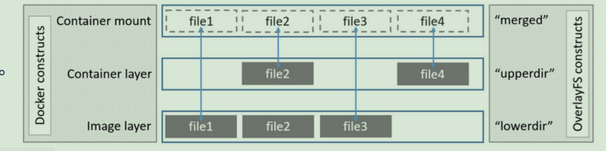
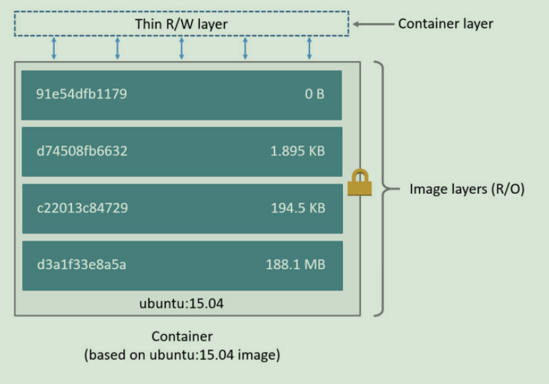

[官方-使用 OverlayFS 存储驱动程序](https://docs.docker.com/storage/storagedriver/overlayfs-driver/)


# 一、镜像是如何存储的
查看 Nginx 的镜像分层
```bash
[root@k8s-node2 ~]# docker images
REPOSITORY                                           TAG                 IMAGE ID            CREATED             SIZE
nginx                                                latest              519e12e2a84a        29 hours ago        133MB                                    1.8                 f4b4fccc65bb        3 years ago         657MB
[root@k8s-node2 ~]# docker history nginx
IMAGE               CREATED             CREATED BY                                      SIZE                COMMENT
519e12e2a84a        29 hours ago        /bin/sh -c #(nop)  CMD ["nginx" "-g" "daemon…   0B                  
<missing>           29 hours ago        /bin/sh -c #(nop)  STOPSIGNAL SIGQUIT           0B                  
<missing>           29 hours ago        /bin/sh -c #(nop)  EXPOSE 80                    0B                  
<missing>           29 hours ago        /bin/sh -c #(nop)  ENTRYPOINT ["/docker-entr…   0B                  
<missing>           29 hours ago        /bin/sh -c #(nop) COPY file:09a214a3e07c919a…   4.61kB              
<missing>           29 hours ago        /bin/sh -c #(nop) COPY file:0fd5fca330dcd6a7…   1.04kB              
<missing>           29 hours ago        /bin/sh -c #(nop) COPY file:0b866ff3fc1ef5b0…   1.96kB              
<missing>           29 hours ago        /bin/sh -c #(nop) COPY file:65504f71f5855ca0…   1.2kB               
<missing>           29 hours ago        /bin/sh -c set -x     && addgroup --system -…   63.8MB              
<missing>           29 hours ago        /bin/sh -c #(nop)  ENV PKG_RELEASE=1~buster     0B                  
<missing>           29 hours ago        /bin/sh -c #(nop)  ENV NJS_VERSION=0.5.3        0B                  
<missing>           29 hours ago        /bin/sh -c #(nop)  ENV NGINX_VERSION=1.19.9     0B                  
<missing>           29 hours ago        /bin/sh -c #(nop)  LABEL maintainer=NGINX Do…   0B                  
<missing>           36 hours ago        /bin/sh -c #(nop)  CMD ["bash"]                 0B                  
<missing>           36 hours ago        /bin/sh -c #(nop) ADD file:c855b3c65f5ba94d5…   69.3MB   
```

nginx 这个镜像是怎么存储的, 使用 inspect 命令查看
```bash
$ docker image inspect nginx
...
"GraphDriver": {
    "Data": {
        "LowerDir": "/var/lib/docker/overlay2/66318b7822dc1638c5bd383504399ca5f2ff53d332f78e44aacdbb3477a2a8c3/diff:/var/lib/docker/overlay2/1564791c812665a00d6d0b1110b067bbea1a0e5851f9263c7d165988109025e7/diff:/var/lib/docker/overlay2/55b3a2758adade3f07feef2d03abbb6799c249da2fec8922ea1725d3da6751bd/diff:/var/lib/docker/overlay2/2bedb352305ca4720bdcf349c852a00b33e9bf9283db7d0d919726e30baeddd0/diff",
        "MergedDir": "/var/lib/docker/overlay2/82449553db67c45ebcc76a6872de18857d686659e4dc8b8c54b3686160c96a89/merged",
        "UpperDir": "/var/lib/docker/overlay2/82449553db67c45ebcc76a6872de18857d686659e4dc8b8c54b3686160c96a89/diff",
        "WorkDir": "/var/lib/docker/overlay2/82449553db67c45ebcc76a6872de18857d686659e4dc8b8c54b3686160c96a89/work"
    },
    "Name": "overlay2"
},
...
```
这里可以看到, Nginx 镜像分成了4个目录存放, 分别是:
- LowerDir: 镜像层(只读层)
- MergedDir: 统一视图(可以看到 upper 和 lower 中所有数据的整合, exec -it 到容器中 ls 看见的就是这里的内容)
- UpperDir: 采用写时复制机制(改动某个文件时, 才会从 Lower 层把文件拷贝上来, 之后所有的修改都在这)
- WorkDir: 中间层(upper层中所有的修改, 会先放到WorkDir中, 再从 WorkDir 移到 Upper 里面去, overlay 的工作机制)

## 1.1 LowerDir
在 LowerDir 中, 一共有四个文件夹, 分别如下:

```bash
# 用户文件
$ ll /var/lib/docker/overlay2/66318b7822dc1638c5bd383504399ca5f2ff53d332f78e44aacdbb3477a2a8c3/diff
总用量 0
drwxr-xr-x 2 root root 45 4月  10 15:32 docker-entrypoint.d

# Nginx 的启动命令
$ ll /var/lib/docker/overlay2/1564791c812665a00d6d0b1110b067bbea1a0e5851f9263c7d165988109025e7/diff
总用量 4
-rwxrwxr-x 1 root root 1202 4月  10 15:31 docker-entrypoint.sh

# Nginx 的配置文件
$ ll /var/lib/docker/overlay2/55b3a2758adade3f07feef2d03abbb6799c249da2fec8922ea1725d3da6751bd/diff
总用量 4
drwxr-xr-x  2 root root    6 4月  10 15:32 docker-entrypoint.d
drwxr-xr-x 20 root root 4096 4月  10 15:32 etc
drwxr-xr-x  5 root root   56 4月  10 15:32 lib
drwxrwxrwt  2 root root    6 4月  10 15:32 tmp
drwxr-xr-x  7 root root   66 4月   8 08:00 usr
drwxr-xr-x  5 root root   41 4月   8 08:00 var

# 小Linux 系统
$ ll /var/lib/docker/overlay2/2bedb352305ca4720bdcf349c852a00b33e9bf9283db7d0d919726e30baeddd0/diff
总用量 12
drwxr-xr-x  2 root root 4096 4月   8 08:00 bin
drwxr-xr-x  2 root root    6 3月  20 07:44 boot
drwxr-xr-x  2 root root    6 4月   8 08:00 dev
drwxr-xr-x 28 root root 4096 4月   8 08:00 etc
drwxr-xr-x  2 root root    6 3月  20 07:44 home
drwxr-xr-x  7 root root   85 4月   8 08:00 lib
drwxr-xr-x  2 root root   34 4月   8 08:00 lib64
drwxr-xr-x  2 root root    6 4月   8 08:00 media
drwxr-xr-x  2 root root    6 4月   8 08:00 mnt
drwxr-xr-x  2 root root    6 4月   8 08:00 opt
drwxr-xr-x  2 root root    6 3月  20 07:44 proc
drwx------  2 root root   37 4月   8 08:00 root
drwxr-xr-x  3 root root   30 4月   8 08:00 run
drwxr-xr-x  2 root root 4096 4月   8 08:00 sbin
drwxr-xr-x  2 root root    6 4月   8 08:00 srv
drwxr-xr-x  2 root root    6 3月  20 07:44 sys
drwxrwxrwt  2 root root    6 4月   8 08:00 tmp
drwxr-xr-x 10 root root  105 4月   8 08:00 usr
drwxr-xr-x 11 root root  139 4月   8 08:00 var
```

将 LowerDir 中的四个文件夹 反着看:
1. 在小Linux(FROM apline) + Dockerfile 的每一行命令都可能引起系统的改变, 所以这里只记录修改, 和 Git 一样
2. 进入到镜像启动的容器中, 容器的文件系统就**是镜像的**
  为了验证, 再次启动一个 Nginx 镜像, 比对两个镜像中文件的唯一标识
   ```bash
   $ docker run -itd --name nginx1 nginx
   $ docker ps 
   e4362ce90875        nginx               "/docker-entrypoint.…"   About a minute ago   Up About a minute   80/tcp              nginx1
   212e0e7a1d7e        nginx               "/docker-entrypoint.…"   21 minutes ago       Up 21 minutes       80/tcp              nginx-app
   
   $ docker exec -it e4362ce90875 bash
   > ls -i
   67131310 bin    1288391 dev		     20990865 docker-entrypoint.sh  17752489 home   8818492 lib64  30660955 mnt         1 proc	59326389 run   84067998 srv  34924457 tmp  30695281 var
   75633321 boot  92994173 docker-entrypoint.d  67134516 etc		    83923519 lib   17752496 media  34924260 opt  53136454 root	75633330 sbin         1 sys  42521889 usr
   
   $ docker exec -it 212e0e7a1d7e bash
   67131310 bin    1310673 dev		     20990865 docker-entrypoint.sh  17752489 home   8818492 lib64  30660955 mnt         1 proc	59326389 run   84067998 srv  34924457 tmp  30695281 var
   75633321 boot  92994173 docker-entrypoint.d  52943778 etc		    83923519 lib   17752496 media  34924260 opt  53136454 root	75633330 sbin         1 sys  42521889 usr
   
   # 在两个容器中分别增加 1.txt 文件, 再次查看两个容器的文件系统文件的唯一标识, 可以看到1.txt 文件的唯一标识是不一样的
   e4362ce90875: 83923733 1.txt      212e0e7a1d7e: 13750405 1.txt
   ```
3. 容器层会自己建立层, 如果想要修改东西, 把改的内容复制到容器层即可(或者在容器数据源中直接改变)




# 二、Images 和 层 
Docker映像由一系列层组成, 每层代表图像的Dockerfile中的一条指令, **除最后一层外的每一层都是只读的。** 
```bash
FROM ubuntu:15.04
COPY . /app
RUN make /app
CMD python /app/app.py
```
> 该Dockerfile包含四个命令，每个命令创建一个层。
> 
> FROM语句从ubuntu：15.04映像创建一个图层开始。
> 
> COPY命令从Docker客户端的当前目录添加一些文件。
> 
> RUN命令使用make命令构建您的应用程序。
>
> 最后，最后一层指定要在容器中运行的命令。
> 
> 每一层只是与上一层不同的一组。 这些层彼此堆叠。
> 
> 创建新容器时，可以在基础层之上添加一个新的可写层。 该层通常称为“容器层”。 对运行中 的容器所做的所有更改（例如写入新文件，修改现有文件和删除文件）都将写入此薄可写容器层。



# 三、Container 和 层
容器和镜像之间的主要区别是可写顶层。

在容器中添加新数据或修改现有数据的所有写操作都存储在此可写层中。

删除容器后，可写层也会被删除。 基础图像保持不变。 因为每个容器都有其自己的可写容器层，并且所有更改都存储在该容器层中，所以多个容器可以共享对同一基础映像的访问，但具有自己的数据状态。

下图显示了共享同一Ubuntu 15.04映像的多个容器。


# 四、磁盘容量预估
一个 Docker 镜像, 在磁盘中仅占用一份磁盘空间(一个镜像启动多个容器也是如此), 不同的只是每个容器内部做的修改(可写层)

可以使用:`docker ps -s` 查看每个容器的可写层的数据量(在磁盘上)
```BASH
[root@k8s-node2 ~]# docker ps -s
CONTAINER ID        IMAGE               COMMAND                  CREATED             STATUS              PORTS               NAMES               SIZE
e4362ce90875        nginx               "/docker-entrypoint.…"   20 minutes ago      Up 20 minutes       80/tcp              nginx1              1.15kB (virtual 133MB)
212e0e7a1d7e        nginx               "/docker-entrypoint.…"   41 minutes ago      Up 41 minutes       80/tcp              nginx-app           1.12kB (virtual 133MB)
```
- size：用于每个容器的可写层的数据量（在磁盘上）。
- virtual size：容器使用的用于只读图像数据的数据量加上容器的可写图层大小。
多个容器可以共享部分或全部只读图像数据。
  
从同一镜像开始的两个容器共享100％的只读数据，而具有不同图像的两个容器（具有相同的层）共享这些公共层。 因此，不能只对虚拟大小进行总计。这高估了总磁盘使用量，可能是一笔不小的数目。

# 五、base镜像的挑选
- busybox：是一个集成了一百多个最常用Linux命令和工具的软件。linux工具里的瑞士军刀 
- alpine：Alpine操作系统是一个面向安全的轻型Linux发行版经典最小镜像，基于busybox，功能比 
- Busybox完善。
- slim：docker hub中有些镜像有slim标识，都是瘦身了的镜像。也要优先选择 
  
无论是制作镜像还是下载镜像，优先选择alpine类型.

# 六、写时复制
Docker 的容器是一个多层的结构, 如果对镜像做 history 操作, 可以看见他里面每一次dockerfile的命令都会创建一个新的层次。
```bash
$ docker image history nginx
IMAGE               CREATED             CREATED BY                                      SIZE                COMMENT
519e12e2a84a        30 hours ago        /bin/sh -c #(nop)  CMD ["nginx" "-g" "daemon…   0B                  
<missing>           30 hours ago        /bin/sh -c #(nop)  STOPSIGNAL SIGQUIT           0B                  
<missing>           30 hours ago        /bin/sh -c #(nop)  EXPOSE 80                    0B                  
<missing>           30 hours ago        /bin/sh -c #(nop)  ENTRYPOINT ["/docker-entr…   0B                  
<missing>           30 hours ago        /bin/sh -c #(nop) COPY file:09a214a3e07c919a…   4.61kB              
<missing>           30 hours ago        /bin/sh -c #(nop) COPY file:0fd5fca330dcd6a7…   1.04kB              
<missing>           30 hours ago        /bin/sh -c #(nop) COPY file:0b866ff3fc1ef5b0…   1.96kB              
<missing>           30 hours ago        /bin/sh -c #(nop) COPY file:65504f71f5855ca0…   1.2kB               
<missing>           30 hours ago        /bin/sh -c set -x     && addgroup --system -…   63.8MB              
<missing>           30 hours ago        /bin/sh -c #(nop)  ENV PKG_RELEASE=1~buster     0B                  
<missing>           30 hours ago        /bin/sh -c #(nop)  ENV NJS_VERSION=0.5.3        0B                  
<missing>           30 hours ago        /bin/sh -c #(nop)  ENV NGINX_VERSION=1.19.9     0B                  
<missing>           30 hours ago        /bin/sh -c #(nop)  LABEL maintainer=NGINX Do…   0B                  
<missing>           36 hours ago        /bin/sh -c #(nop)  CMD ["bash"]                 0B                  
<missing>           36 hours ago        /bin/sh -c #(nop) ADD file:c855b3c65f5ba94d5…   69.3MB
```
Docker里面有一个重要的概念叫做: Storage driver, 他可以帮助我们实现对容器的分层和读写。目前，docker的默认storage driver 是overlay2。所有的容器相关的文件都保存在/var/lib/docker这个目录下。我们可以看见在overlay2里面有很多不同的文件，注意这些文件和上面的dockerfile的命令并不是一一对应的 
```bash
$ ls /var/lib/docker/overlay2/
0b4f17a5f24bc09626d327b1de06866478941463f712c5dc7283702c2ab8beab       60c505cf2f096bd9bcd7a690ce4b124589eaf417d5bef531815bf5193efc9baa
0e4f80c16c3509cf0011153f111130fc1ede1efc7988c652bc064be7c4067218       631b35ec9b269025654d4b2b471b7a3863a1d45be2fd26ef6aca986740849328
0e4f80c16c3509cf0011153f111130fc1ede1efc7988c652bc064be7c4067218-init  66318b7822dc1638c5bd383504399ca5f2ff53d332f78e44aacdbb3477a2a8c3
113f18a2e97c2abac3c66d97e2408373a7eb4f35cdb5e951d1f7521b4c7cbdeb       75d415bb5f9dd50709cc856f0eae68be582cf2f0322750451e669843cc48e878
1564791c812665a00d6d0b1110b067bbea1a0e5851f9263c7d165988109025e7       775eb6b4ccfe56d867eacdd35b4e976305931f8c2c7c1bb26e1c5a1f3f0f1504
18473d338974cd6c5c8c00864f4d06820d5721ce981b8999a79e58918140ad1d       79b7d0f1b3bf68569106eb6b3a5e145e68a672e85ac6ad73d732a89f387008e4
1d443707f13710e512385a556670e95105829a0cf788788ef0ac81fcc72d4932       7be8eaa987173ec7929ecef8391d31fa91d49de92aafc14ef999cb8cffc8dd28
1df14c80a0ef897eb1967a49798a18289fefc60a41e3c05dc83b4994fc5f5f03       7be8eaa987173ec7929ecef8391d31fa91d49de92aafc14ef999cb8cffc8dd28-init
21b93a8abc0abadde6cb0309ad986759056ae401bfd37cf627d24d62dac64383       7c5113c87e539995e6899966020ec6baba43fe6dc4a9b9eb73fea97b497c511d
22faca14fada95075959a6cd424d09c2ae3c62be2e5937b71fd29305e802f507       82449553db67c45ebcc76a6872de18857d686659e4dc8b8c54b3686160c96a89
261630db0971868b0071a65acd2deb831b7b4e095a79187c1e75372af4d35db2       855336f9916fdfba607041306b0f032943fbf49c9b70b5f9fb8e5b5bc1ba76e3
2bc92f27cb6c6cbe1bfeb6f95f1e3ac2f03063df61187ca87c3cf478d58ba3fe       98c3ad95c55d88e7079989a65d8185bc8698be89e2880d1efefc79894a95c4bc
2bedb352305ca4720bdcf349c852a00b33e9bf9283db7d0d919726e30baeddd0       b2581eb365861da6083b7da2babffd8ce5910abfa08066f2f7a986b3db59a2c1
2ede7bd5462836b26d0e14b4fb4e522159f4de50b019c6e7bc86a99e413a8210       backingFsBlockDev
3160b1bd66ddc0106fc056cd90ae2bab4e6c1de64d3821f530691405474fa85f       bb1ce8ef1fd6fe4bbb852699bf1c229ed990f903e74e76e2bd1544991224069f
36dd0084a7979027a2676d0c23b7032c118f99ad509a12131d6c6d8393027f53       bc2600dabb5050fed99464c28bef405de4878a1daf936b59f81ffcfbb03aae49
3fefee950434e695ec1bb3836e58e4b0f7d6f1de8c2fd4b91974158e718dada7       bc2600dabb5050fed99464c28bef405de4878a1daf936b59f81ffcfbb03aae49-init
3ffe812fd9c19e902463bbdd40d9f1cf60ef14d0c0b04a788b1036a66572013c       c461aefb09ceab5042f77360910272d046eaa7b2735ded7354c6d5e7a66365d2
42b5584a6cec11f4910033ef9ba7f35fff74a82a0f7cea9cfdd192763e95c88f       cc85ddd0160dabebae08d818026448e6b2f9f196cd092c6d5bb9262a7e130a96
47b6127049ee81cd914c1095d3dc1d7810197f629e4ce99faf6098d33c312dff       dcea62a2ead4f10b3d81a75bd29f638b9dfee4fa9da608c933a5f87f1dbb9b2f
4d470c41dc7b5e7b69b326e3f228103c1e2fc473d7bf514ceba3d5d29a38e5e3       dd81196c270e2ee7dae881e5d54784a1c3d476ab0d291adb646a145eb9c02952
4d470c41dc7b5e7b69b326e3f228103c1e2fc473d7bf514ceba3d5d29a38e5e3-init  ec77a138e873ffa24a50f1ed73f335b302cd3845b977732712533ee763e23c72
55b3a2758adade3f07feef2d03abbb6799c249da2fec8922ea1725d3da6751bd       ec77a138e873ffa24a50f1ed73f335b302cd3845b977732712533ee763e23c72-init
58d309c784dcc9dd04c68ec77b8e81fca1aca589e9a59a38ad56920bf4010cd1       f107ce504aeb9c01a9f8b389804fd6364e1533d0d5c4a1939e447886b7a53dfa
58d309c784dcc9dd04c68ec77b8e81fca1aca589e9a59a38ad56920bf4010cd1-init  f107ce504aeb9c01a9f8b389804fd6364e1533d0d5c4a1939e447886b7a53dfa-init
59d8b3af72fd00e53484599cf343541bc1b3181dde9fab18feb85cd7d46e3cca       f47d74e5035641d517b4b15fdff2e10069d762c21795a19e57290eb48d457704
59d8b3af72fd00e53484599cf343541bc1b3181dde9fab18feb85cd7d46e3cca-init  f47d74e5035641d517b4b15fdff2e10069d762c21795a19e57290eb48d457704-init
5cb86ae2ebeb140517249871b22002c33efbe22b2c33a1875b3c2e27b6fb6e8f       fa20fa4be581a1069bf6528d4ecdd987be56e9c7f9f0171cb16b713e19b01afb
5cefe9c2ab42841e675bb27fd621a530abbd4fcda600c276300648748272ed2e       l
```

一个典型的场景如下所示，一个镜像文件里面，里面分了多层，最下面的是基础镜像，这个基础镜像不包括内核文件，执行的时候他会直接调用宿主机的内核，因此他的空间并不大。在基础镜像上面，又分了很多层，每一层代表在dockerfile里面执行的一行命令。这整个镜像文件都是只读的。每个容器通过镜像创建自己的容器层，而容器层是可以读写的，修改的内容他们会保存在自己的目录下面。因此每个容器对自己的修改 不会影响到其他容器。


在docker里面，我们通过storage driver来进行所谓的copy on write （ 写时复制）的操作。storage driver有很多种，目前默认的是overlay2

overlay的基本工作原理如下: 

我们通过镜像创建的容器包括了三层。最下面的是一个只读的镜像层，第二层是容器层，在他上面最上面的容器挂载层。最上层显示的是我们在容器上直接看见的内容，他通过UnionFS，或者说类似软连接的方式，文件的路径指向了容器层或者是镜像层。当我们尝试读取，修改或者创建一个新的文件时，我们总是从上到下进行搜索，如果在容器层找到了，那么就直接打开；如果容器层没有，那就从镜像层打开。如果是一个新建的文档，那么就从镜像层拷贝到容器层，再打开操作。


# 七、容器挂载的几种方式


容器支持三种挂载方式:
- Volumes(卷): Docker自动在外部创建文件夹自动挂载容器内部指定的文件夹内容【Dockerfile VOLUME指令的作用】
- Bind mounts(绑定挂载): 自己在外部创建文件夹，手动挂载
- tmpfs mounts(临时挂载): 可以把数据挂载到内存中。

--mount 挂载到 Linux 宿主机, 手动挂载(现在不用了)
-v 可以手动挂载到 Linux 宿主机 或 由Docker 自动管理


## 7.1 Volumes(卷)
## 7.1.1 匿名卷
```bash
# docker 将创建出匿名卷, 并将容器 /etc/nginx 目录下面的内容保存到宿主机
$ docker run -d -v :/etc/nginx nginx
90578007b35d08c9b6cb16fc210b23d6d6de38e0b6856d88a11503fe2f6fe235

# 查看容器的挂载信息
$ docker inspect 90578007b35d | grep Mounts -A 10
        "Mounts": [
            {
                # 类型: 卷
                "Type": "volume",
                # 卷名称
                "Name": "f1e79f3df5334c64f79d6f58a59e75308cf9c127cd9f8c8123f4d05589b91a4f",
                # 宿主机目录
                "Source": "/var/lib/docker/volumes/f1e79f3df5334c64f79d6f58a59e75308cf9c127cd9f8c8123f4d05589b91a4f/_data",
                # 容器目录
                "Destination": ":/etc/nginx",
                "Driver": "local",
                "Mode": "",
                # 可读可写
                "RW": true,
                "Propagation": ""
            }

# 查看卷列表
$ docker volume ls
DRIVER    VOLUME NAME
local     f1e79f3df5334c64f79d6f58a59e75308cf9c127cd9f8c8123f4d05589b91a4f
```

## 7.1.2 具名卷
### 7.1.2.1 绝对路径(挂载)
以绝对路径这种方式声明, 叫做挂载, 这种方式可能出现空挂载, 从而将容器内的文件清除
```bash
$ docker run -d -v /app/nginx:/etc/nginx nginx

# 查看运行的容器, 并没有刚刚启动的容器
$ docker ps 
CONTAINER ID   IMAGE     COMMAND                  CREATED         STATUS         PORTS     NAMES
aa31776fe598   nginx     "/docker-entrypoint.…"   5 minutes ago   Up 5 minutes   80/tcp    jolly_kare
90578007b35d   nginx     "/docker-entrypoint.…"   9 minutes ago   Up 9 minutes   80/tcp    frosty_easley

# 查看启动过的容器
$ docker ps -a 
CONTAINER ID   IMAGE     COMMAND                  CREATED          STATUS                      PORTS     NAMES
55e97857394f   nginx     "/docker-entrypoint.…"   14 seconds ago   Exited (1) 13 seconds ago             kind_roentgen
aa31776fe598   nginx     "/docker-entrypoint.…"   5 minutes ago    Up 5 minutes                80/tcp    jolly_kare
90578007b35d   nginx     "/docker-entrypoint.…"   9 minutes ago    Up 9 minutes                80/tcp    frosty_easley

# 查看失败原因, 是因为 nginx.conf 不存在, 因为挂在时候, /app/nginx 目录是空文件, 产生了空挂载
$ docker logs 55e97857394f
/docker-entrypoint.sh: /docker-entrypoint.d/ is not empty, will attempt to perform configuration
/docker-entrypoint.sh: Looking for shell scripts in /docker-entrypoint.d/
/docker-entrypoint.sh: Launching /docker-entrypoint.d/10-listen-on-ipv6-by-default.sh
10-listen-on-ipv6-by-default.sh: info: /etc/nginx/conf.d/default.conf is not a file or does not exist
/docker-entrypoint.sh: Launching /docker-entrypoint.d/20-envsubst-on-templates.sh
/docker-entrypoint.sh: Launching /docker-entrypoint.d/30-tune-worker-processes.sh
/docker-entrypoint.sh: Configuration complete; ready for start up
2021/04/13 09:45:29 [emerg] 1#1: open() "/etc/nginx/nginx.conf" failed (2: No such file or directory)
nginx: [emerg] open() "/etc/nginx/nginx.conf" failed (2: No such file or directory)
```

### 7.1.2.2 相对路径(绑定)
以相对路径这种方式声明, 叫做绑定, docker 会自动管理, docker 不会把它当成目录, 而是把它当成卷
1. docker 会首先在底层创建一个指定名字的卷(具名卷): nginx;
2. 把这个卷和容器内部目录进行绑定;
3. 容器启动后, 目录里面的内容就在卷里面存着;

```bash
# docker 将创建出名为 nginx 的卷, 并将容器 /etc/nginx 目录下面的内容保存到 nginx 卷下
$ docker run -d -v nginx:/etc/nginx nginx
aa31776fe598bac69ca0db4df610d590d08742fd2d1af33f891328ce2830155e

# 查看镜像的挂载信息
$ docker inspect aa31776fe598 | grep Mounts -A 10
        "Mounts": [
            {
                "Type": "volume",
                "Name": "nginx",
                "Source": "/var/lib/docker/volumes/nginx/_data",
                "Destination": "/etc/nginx",
                "Driver": "local",
                "Mode": "z",
                "RW": true,
                "Propagation": ""
            }

# 查看 nginx 卷下面的内容
$ ll /var/lib/docker/volumes/nginx/_data
总用量 36
drwxr-xr-x 2 root root   26 4月  13 17:39 conf.d
-rw-r--r-- 1 root root 1007 3月  30 22:47 fastcgi_params
-rw-r--r-- 1 root root 2837 3月  30 22:47 koi-utf
-rw-r--r-- 1 root root 2223 3月  30 22:47 koi-win
-rw-r--r-- 1 root root 5231 3月  30 22:47 mime.types
lrwxrwxrwx 1 root root   22 3月  30 22:58 modules -> /usr/lib/nginx/modules
-rw-r--r-- 1 root root  643 3月  30 22:58 nginx.conf
-rw-r--r-- 1 root root  636 3月  30 22:47 scgi_params
-rw-r--r-- 1 root root  664 3月  30 22:47 uwsgi_params
-rw-r--r-- 1 root root 3610 3月  30 22:47 win-utf

# 查看卷列表
$ docker volume ls
DRIVER    VOLUME NAME
local     f1e79f3df5334c64f79d6f58a59e75308cf9c127cd9f8c8123f4d05589b91a4f
local     nginx


# docker run -d -v nginx:/etc/nginx nginx 这个也可以用如下操作方式启动
# 1. docker create volume nginx
# 2. docker volume inspect nginx
# 3. docker run -d -P -v nginx:/etc/nginx nginx
```

两种方式的选择:
- 如果自己开发测试, 用 -v 绝对路径的方式
- 如果是生产环境建议用 -v 相对路径 卷的方式

### 7.1.2.3 挂载测试
```bash
# 不挂载, 可以访问 欢迎页
$ docker run -d --name mynginx1 -p 8080:80 nginx

# -v /app/html:/usr/share/nginx/html, 欢迎页报: 403 Forbidden
$ docker run -d --name mynginx2 -p 8081:80 -v /app/html:/usr/share/nginx/html nginx

# -v /usr/share/nginx/html(匿名卷), 可以访问 欢迎页
$ docker run -d --name mynginx3 -p 8082:80 -v :/usr/share/nginx/html nginx

# -v html:/usr/share/nginx/html(具名卷的), 可以访问 欢迎页
$ docker run -d --name mynginx4 -p 8083:80 -v html:/usr/share/nginx/html nginx
```

## 7.2 Bind mounts(绑定挂载)