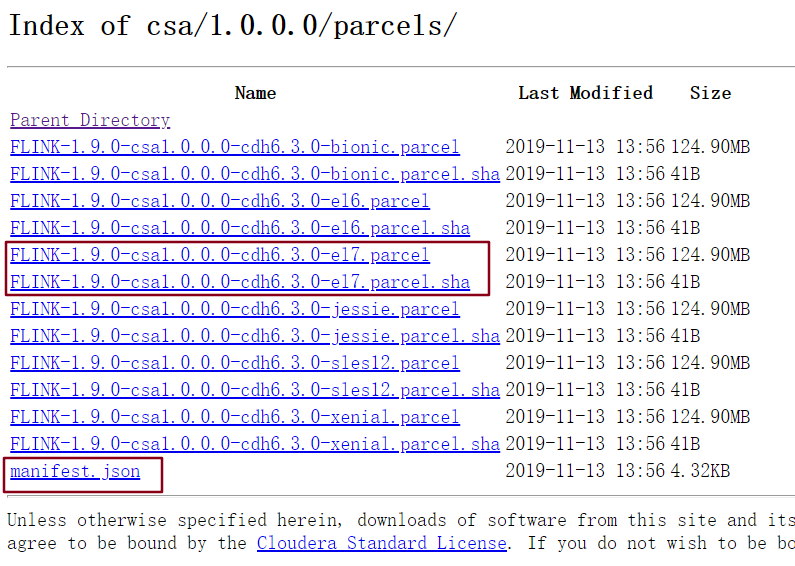
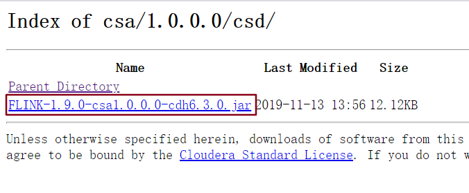

* [一、下载](#%E4%B8%80%E4%B8%8B%E8%BD%BD)
* [二、上传](#%E4%BA%8C%E4%B8%8A%E4%BC%A0)
* [三、分配](#%E4%B8%89%E5%88%86%E9%85%8D)
* [四、激活](#%E5%9B%9B%E6%BF%80%E6%B4%BB)
* [五、安装](#%E4%BA%94%E5%AE%89%E8%A3%85)

---
# 一、下载
https://archive.cloudera.com/csa/1.0.0.0/parcels/

下载需要的即可






# 二、上传
将下载好的文件上传到对应的目录中
```bash
[root@bigdata001 flink]# cp FLINK-1.9.0-csa1.0.0.0-cdh6.3.0.jar /opt/cloudera/csd/
[root@bigdata001 flink]# cp FLINK-1.9.0-csa1.0.0.0-cdh6.3.0-el7.parcel /opt/cloudera/parcel-repo/
[root@bigdata001 flink]# cp FLINK-1.9.0-csa1.0.0.0-cdh6.3.0-el7.parcel.sha /opt/cloudera/parcel-repo/
[root@bigdata001 flink]# cp manifest.json /opt/cloudera/parcel-repo
```

# 三、分配
打开 CDH 界面


# 四、激活


# 五、安装
正常安装即可