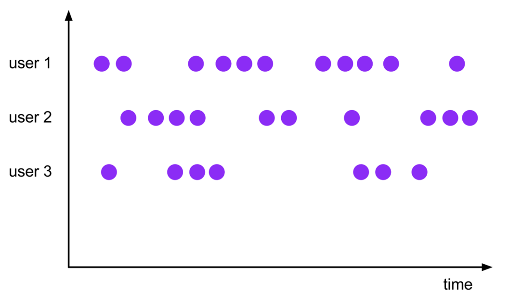
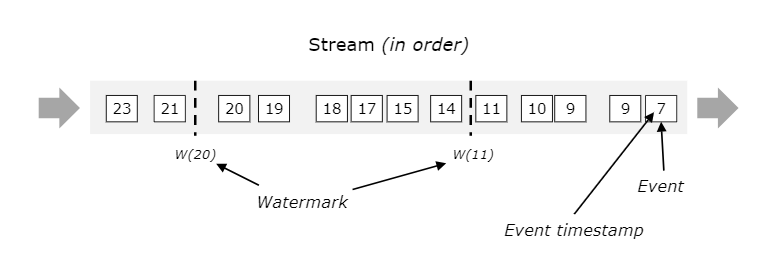
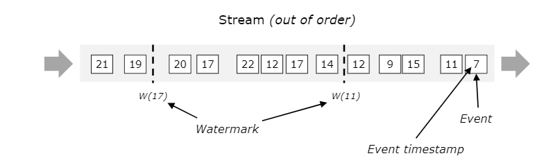
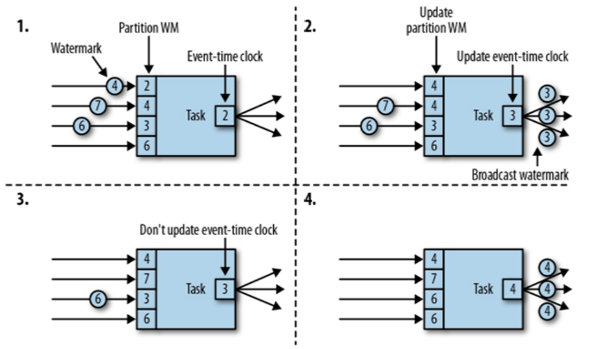

---
# 一、Window 概述
在流处理应用用, 我们处理的数据往往都是无穷无尽的, 通常情况下我们不可能等到所有数据到齐后再计算, Flink 可以接收到一条数据就处理一条, 但是在很多场景下, 我们需要计算一些聚合类的操作, 例如: 计算最近一小时的销售总额、计算最近一小时用户活跃量等等, 此时我们就需要用到 Window 将无穷无尽的流切割成有限的快, 从而得到业务需要的指标结果。

# 二、Window 分类
## 2.1 时间驱动的 Window
可以分为:
1. 滚动窗口(Tumbling Window): 窗口长度固定, 窗口之间不重叠, 每个事件仅属于一个窗口;
2. 滑动窗口(Sliding Window): 窗口长度固定, 窗口之间有重叠, 一个事件可能属于多个窗口;
3. 会话窗口(Session Window): 窗口长度固定, 窗口之间不重叠, 每个事件仅属于一个窗口;
4. 全局窗口(Global Window): 窗口不会被自动触发, 需要用户写 定时器 触发计算;

### 2.1.1 滚动窗口(Tumbling Window)


```java
package com.kino.flink.windows.time;

import org.apache.flink.api.common.functions.AggregateFunction;
import org.apache.flink.api.common.functions.ReduceFunction;
import org.apache.flink.api.java.tuple.Tuple2;
import org.apache.flink.streaming.api.environment.StreamExecutionEnvironment;
import org.apache.flink.streaming.api.functions.windowing.ProcessWindowFunction;
import org.apache.flink.streaming.api.windowing.assigners.TumblingEventTimeWindows;
import org.apache.flink.streaming.api.windowing.time.Time;
import org.apache.flink.streaming.api.windowing.windows.TimeWindow;
import org.apache.flink.util.Collector;

public class TumblingWindowTest {
    public static void main(String[] args) throws Exception {
        StreamExecutionEnvironment env = StreamExecutionEnvironment.getExecutionEnvironment().setParallelism(1);

        env.socketTextStream("localhost", 9999)
                .map(line -> {
                    String[] split = line.split(",");
                    return new Tuple2<String, Integer>(split[0], Integer.parseInt(split[1]));
                })
                .keyBy(k -> k.f0)
                .window(TumblingEventTimeWindows.of(Time.seconds(5)))
                // 1. ReduceFunction
                // .reduce(new ReduceFunction<Tuple2<String, Integer>>() {
                //     @Override
                //     public Tuple2<String, Integer> reduce(Tuple2<String, Integer> value1, Tuple2<String, Integer> value2) throws Exception {
                //         return new Tuple2<String, Integer>(value1.f0, value1.f1 + value2.f1);
                //     }
                // })
                // 2. AggregateFunction, 三个泛型, 1: 输入 2: 中间结果 3: 输出结果
                // .aggregate(new AggregateFunction<Tuple2<String, Integer>, Integer, String>() {
                //     // 初始化累加器
                //     @Override
                //     public Integer createAccumulator() {
                //         return 0;
                //     }
                //
                //     // 累加逻辑
                //     @Override
                //     public Integer add(Tuple2<String, Integer> value, Integer accumulator) {
                //         return value.f1 + accumulator;
                //     }
                //
                //     // 获取结果
                //     @Override
                //     public String getResult(Integer accumulator) {
                //         return accumulator.toString();
                //     }
                //
                //     // 累加器的合并: 只有会话窗口才会调用
                //     @Override
                //     public Integer merge(Integer a, Integer b) {
                //         return a + b;
                //     }
                // })
                // 3. ProcessWindowFunction 三个泛型 1: 输入  2: 输出 3: key  4. Window Type
                .process(new ProcessWindowFunction<Tuple2<String, Integer>, Integer, String, TimeWindow>() {
                    /**
                     *
                     * @param s         key
                     * @param context   上下文对象
                     * @param elements  这个窗口中的所有元素
                     * @param out       收集器, 用于向下游传递
                     * @throws Exception
                     */
                    @Override
                    public void process(String s, Context context, Iterable<Tuple2<String, Integer>> elements, Collector<Integer> out) throws Exception {
                        int sum = 0;
                        for (Tuple2<String, Integer> element : elements) {
                            sum = sum + element.f1;
                        }
                        System.out.println("该窗口中一共有: " + elements.spliterator().estimateSize() + " 个元素.");
                        out.collect(sum);
                    }
                })
                .print();
        env.execute();
    }
}
```

### 2.1.2 滑动窗口(Sliding Window)


```java
package com.kino.flink.windows.time;

import org.apache.flink.api.common.functions.ReduceFunction;
import org.apache.flink.api.java.tuple.Tuple2;
import org.apache.flink.streaming.api.environment.StreamExecutionEnvironment;
import org.apache.flink.streaming.api.windowing.assigners.SlidingEventTimeWindows;
import org.apache.flink.streaming.api.windowing.time.Time;

public class SlidingWindowTest {
    public static void main(String[] args) throws Exception {
        StreamExecutionEnvironment env = StreamExecutionEnvironment.getExecutionEnvironment().setParallelism(1);

        env.socketTextStream("localhost", 9999)
                .map(line -> {
                    String[] split = line.split(",");
                    return new Tuple2<String, Integer>(split[0], Integer.parseInt(split[1]));
                })
                .keyBy(k -> k.f0)
                .window(SlidingEventTimeWindows.of(Time.seconds(5), Time.seconds(2)))
                .reduce(new ReduceFunction<Tuple2<String, Integer>>() {
                    @Override
                    public Tuple2<String, Integer> reduce(Tuple2<String, Integer> value1, Tuple2<String, Integer> value2) throws Exception {
                        return new Tuple2<String, Integer>(value1.f0, value1.f1 + value2.f1);
                    }
                })
                .print();
        env.execute();
    }
}
```

### 2.1.3 会话窗口(Session Window)


```java
package com.kino.flink.windows.time;

import org.apache.flink.api.common.functions.ReduceFunction;
import org.apache.flink.api.java.tuple.Tuple2;
import org.apache.flink.streaming.api.environment.StreamExecutionEnvironment;
import org.apache.flink.streaming.api.windowing.assigners.ProcessingTimeSessionWindows;
import org.apache.flink.streaming.api.windowing.time.Time;

public class SessionWindowTest {
    public static void main(String[] args) throws Exception {
        StreamExecutionEnvironment env = StreamExecutionEnvironment.getExecutionEnvironment().setParallelism(1);

        env.socketTextStream("localhost", 9999)
                .map(line -> {
                    String[] split = line.split(",");
                    return new Tuple2<String, Integer>(split[0], Integer.parseInt(split[1]));
                })
                .keyBy(k -> k.f0)
                .window(ProcessingTimeSessionWindows.withGap(Time.seconds(10)))
                .reduce(new ReduceFunction<Tuple2<String, Integer>>() {
                    @Override
                    public Tuple2<String, Integer> reduce(Tuple2<String, Integer> value1, Tuple2<String, Integer> value2) throws Exception {
                        return new Tuple2<String, Integer>(value1.f0, value1.f1 + value2.f1);
                    }
                })
                .print();
        env.execute();
    }
}
```


### 2.1.4 全局窗口(Global Window)


```java
package com.kino.flink.windows.time;

import org.apache.flink.api.common.functions.ReduceFunction;
import org.apache.flink.api.common.state.ValueState;
import org.apache.flink.api.common.state.ValueStateDescriptor;
import org.apache.flink.api.java.tuple.Tuple2;
import org.apache.flink.streaming.api.environment.StreamExecutionEnvironment;
import org.apache.flink.streaming.api.windowing.assigners.GlobalWindows;
import org.apache.flink.streaming.api.windowing.triggers.Trigger;
import org.apache.flink.streaming.api.windowing.triggers.TriggerResult;
import org.apache.flink.streaming.api.windowing.windows.GlobalWindow;

public class GlobalWindowTest {
    public static void main(String[] args) throws Exception {
        StreamExecutionEnvironment env = StreamExecutionEnvironment.getExecutionEnvironment().setParallelism(1);

        env.socketTextStream("localhost", 9999)
                .map(line -> {
                    String[] split = line.split(",");
                    return new Tuple2<String, Integer>(split[0], Integer.parseInt(split[1]));
                })
                .keyBy(k -> k.f0)
                .window(GlobalWindows.create())
                .trigger(new Trigger<Tuple2<String, Integer>, GlobalWindow>() {
                    private static final long serialVersionUID = 1L;
                    ValueStateDescriptor<Integer> stateDescriptor = new ValueStateDescriptor<>("total", Integer.class);

                    /**
                     * 每个事件进入窗口都会进行计算
                     * @param element       事件
                     * @param timestamp     进入窗口时间戳
                     * @param window        窗口类型
                     * @param ctx           Trigger 上下文对象
                     * @return
                     * @throws Exception
                     */
                    @Override
                    public TriggerResult onElement(Tuple2<String, Integer> element, long timestamp, GlobalWindow window, TriggerContext ctx) throws Exception {
                        ValueState<Integer> sumState = ctx.getPartitionedState(stateDescriptor);
                        if (null == sumState.value()) {
                            sumState.update(0);
                        }
                        sumState.update(element.f1 + sumState.value());
                        if (sumState.value() >= 2) {
                            //这里可以选择手动处理状态
                            //  默认的trigger发送是TriggerResult.FIRE 不会清除窗口数据
                            return TriggerResult.FIRE_AND_PURGE;
                        }
                        return TriggerResult.CONTINUE;
                    }

                    /**
                     * 根据事件进入窗口的 Process Time 进行计算
                     * @param time
                     * @param window
                     * @param ctx
                     * @return
                     * @throws Exception
                     */
                    @Override
                    public TriggerResult onProcessingTime(long time, GlobalWindow window, TriggerContext ctx) throws Exception {
                        return TriggerResult.CONTINUE;
                    }

                    /**
                     * 根据时间进入窗口的 Event Time 进行计算
                     * @param time
                     * @param window
                     * @param ctx
                     * @return
                     * @throws Exception
                     */
                    @Override
                    public TriggerResult onEventTime(long time, GlobalWindow window, TriggerContext ctx) throws Exception {
                        return TriggerResult.CONTINUE;
                    }

                    /**
                     * 窗口的清除
                     * @param window
                     * @param ctx
                     * @throws Exception
                     */
                    @Override
                    public void clear(GlobalWindow window, TriggerContext ctx) throws Exception {
                        System.out.println("清理窗口状态  窗口内保存值为" + ctx.getPartitionedState(stateDescriptor).value());
                        ctx.getPartitionedState(stateDescriptor).clear();
                    }
                })
                .reduce(new ReduceFunction<Tuple2<String, Integer>>() {
                    @Override
                    public Tuple2<String, Integer> reduce(Tuple2<String, Integer> value1, Tuple2<String, Integer> value2) throws Exception {
                        return new Tuple2<>(value1.f0, value1.f1 + value2.f1);
                    }
                })
                .print();
        env.execute();
    }
}
```

## 2.2 数据驱动的 Window
按时间个数生成 Window, 一个窗口长度为5的滚动窗口意思是说: 这个窗口只收集 5 个事件, 超过就产生新的窗口;

可以分为:
1. 滚动窗口: 窗口长度固定, 窗口之间不重叠, 一个事件仅属于一个窗口;
2. 滑动窗口: 窗口长度固定, 窗口之间有重叠, 一个事件可能属于多个窗口;


### 2.2.1 滚动窗口
```java
package com.kino.flink.windows.count;

import org.apache.flink.api.common.functions.ReduceFunction;
import org.apache.flink.api.java.tuple.Tuple2;
import org.apache.flink.streaming.api.environment.StreamExecutionEnvironment;

public class TumblingCountTest {
    public static void main(String[] args) throws Exception {
        StreamExecutionEnvironment env = StreamExecutionEnvironment.getExecutionEnvironment().setParallelism(1);

        env.socketTextStream("localhost", 9999)
                .map(line -> {
                    String[] split = line.split(",");
                    return new Tuple2<String, Integer>(split[0], Integer.parseInt(split[1]));
                })
                .keyBy(k -> k.f0)
                .countWindow(5)
                .reduce(new ReduceFunction<Tuple2<String, Integer>>() {
                    @Override
                    public Tuple2<String, Integer> reduce(Tuple2<String, Integer> value1, Tuple2<String, Integer> value2) throws Exception {
                        return new Tuple2<>(value1.f0, value1.f1 + value2.f1);
                    }
                })
                .print();
        env.execute();
    }
}
```

### 2.2.2 滑动窗口
```java
package com.kino.flink.windows.count;

import org.apache.flink.api.common.functions.ReduceFunction;
import org.apache.flink.api.java.tuple.Tuple2;
import org.apache.flink.streaming.api.environment.StreamExecutionEnvironment;

public class SlidingCountTest {
    public static void main(String[] args) throws Exception {
        StreamExecutionEnvironment env = StreamExecutionEnvironment.getExecutionEnvironment().setParallelism(1);

        env.socketTextStream("localhost", 9999)
                .map(line -> {
                    String[] split = line.split(",");
                    return new Tuple2<String, Integer>(split[0], Integer.parseInt(split[1]));
                })
                .keyBy(k -> k.f0)
                .countWindow(5, 2)
                .reduce(new ReduceFunction<Tuple2<String, Integer>>() {
                    @Override
                    public Tuple2<String, Integer> reduce(Tuple2<String, Integer> value1, Tuple2<String, Integer> value2) throws Exception {
                        return new Tuple2<>(value1.f0, value1.f1 + value2.f1);
                    }
                })
                .print();
        env.execute();
    }
}
```

# 三、Window Function
.window() 方法是用来定义一个窗口, 窗口的计算需要 Window Function 指定如何计算, 当窗口关闭时, Window Function 就去计算窗口中的数据了;

## 3.1 Window Function 分类
1. ReduceFunction(增量聚合函数)
2. AggregateFunction(增量聚合函数)
3. ProcessWindowFunction(全窗口函数): 不高效, 执行这个函数前, 窗口中的数据被缓存在内存中, 在实现方法中, 得到的是窗口数据的 迭代器

### 3.2 三种 Window Function 示例代码
```java
package com.kino.flink.windows.time;

import org.apache.flink.api.common.functions.AggregateFunction;
import org.apache.flink.api.common.functions.ReduceFunction;
import org.apache.flink.api.java.tuple.Tuple2;
import org.apache.flink.streaming.api.environment.StreamExecutionEnvironment;
import org.apache.flink.streaming.api.functions.windowing.ProcessWindowFunction;
import org.apache.flink.streaming.api.windowing.assigners.TumblingEventTimeWindows;
import org.apache.flink.streaming.api.windowing.time.Time;
import org.apache.flink.streaming.api.windowing.windows.TimeWindow;
import org.apache.flink.util.Collector;

public class TumblingWindowTest {
    public static void main(String[] args) throws Exception {
        StreamExecutionEnvironment env = StreamExecutionEnvironment.getExecutionEnvironment().setParallelism(1);

        env.socketTextStream("localhost", 9999)
                .map(line -> {
                    String[] split = line.split(",");
                    return new Tuple2<String, Integer>(split[0], Integer.parseInt(split[1]));
                })
                .keyBy(k -> k.f0)
                .window(TumblingEventTimeWindows.of(Time.seconds(5)))
                // 1. ReduceFunction
                // .reduce(new ReduceFunction<Tuple2<String, Integer>>() {
                //     @Override
                //     public Tuple2<String, Integer> reduce(Tuple2<String, Integer> value1, Tuple2<String, Integer> value2) throws Exception {
                //         return new Tuple2<String, Integer>(value1.f0, value1.f1 + value2.f1);
                //     }
                // })
                // 2. AggregateFunction, 三个泛型, 1: 输入 2: 中间结果 3: 输出结果
                // .aggregate(new AggregateFunction<Tuple2<String, Integer>, Integer, String>() {
                //     // 初始化累加器
                //     @Override
                //     public Integer createAccumulator() {
                //         return 0;
                //     }
                //
                //     // 累加逻辑
                //     @Override
                //     public Integer add(Tuple2<String, Integer> value, Integer accumulator) {
                //         return value.f1 + accumulator;
                //     }
                //
                //     // 获取结果
                //     @Override
                //     public String getResult(Integer accumulator) {
                //         return accumulator.toString();
                //     }
                //
                //     // 累加器的合并: 只有会话窗口才会调用
                //     @Override
                //     public Integer merge(Integer a, Integer b) {
                //         return a + b;
                //     }
                // })
                // 3. ProcessWindowFunction 三个泛型 1: 输入  2: 输出 3: key  4. Window Type
                .process(new ProcessWindowFunction<Tuple2<String, Integer>, Integer, String, TimeWindow>() {
                    /**
                     *
                     * @param s         key
                     * @param context   上下文对象
                     * @param elements  这个窗口中的所有元素
                     * @param out       收集器, 用于向下游传递
                     * @throws Exception
                     */
                    @Override
                    public void process(String s, Context context, Iterable<Tuple2<String, Integer>> elements, Collector<Integer> out) throws Exception {
                        long windowCount = 0L;
                        int sum = 0;
                        for (Tuple2<String, Integer> element : elements) {
                            windowCount++;
                            sum = sum + element.f1;
                        }
                        System.out.println("该窗口中一共有: " + elements.spliterator().estimateSize() + " 个元素.");
                        out.collect(sum);
                    }
                })
                .print();
        env.execute();
    }
}
```

### 3.3 增量聚合函数和全窗口函数合并
```java
package com.kino.window;

import com.kino.source.Event;
import com.kino.transform.ClickSource;
import org.apache.flink.api.common.eventtime.SerializableTimestampAssigner;
import org.apache.flink.api.common.eventtime.WatermarkStrategy;
import org.apache.flink.api.common.functions.AggregateFunction;
import org.apache.flink.streaming.api.datastream.SingleOutputStreamOperator;
import org.apache.flink.streaming.api.environment.StreamExecutionEnvironment;
import org.apache.flink.streaming.api.functions.windowing.ProcessWindowFunction;
import org.apache.flink.streaming.api.windowing.assigners.SlidingEventTimeWindows;
import org.apache.flink.streaming.api.windowing.time.Time;
import org.apache.flink.streaming.api.windowing.windows.TimeWindow;
import org.apache.flink.util.Collector;

public class UrlViewCountExample {
    public static void main(String[] args) throws Exception {
        StreamExecutionEnvironment env = StreamExecutionEnvironment.getExecutionEnvironment();
        env.setParallelism(1);

        SingleOutputStreamOperator<Event> stream = env.addSource(new ClickSource())
            .assignTimestampsAndWatermarks(
                WatermarkStrategy.<Event>forMonotonousTimestamps()
                    .withTimestampAssigner(new SerializableTimestampAssigner<Event>() {
                        @Override
                        public long extractTimestamp(Event element, long recordTimestamp) {
                            return element.timestamp;
                        }
                    })
            );

        stream
            .keyBy(t -> t.url)
            .window(SlidingEventTimeWindows.of(Time.seconds(10), Time.seconds(2)))
            .aggregate(new UrlViewCountAgg(), new UrlViewCountResult())
            .print();

        env.execute();
    }
    public static class UrlViewCountAgg implements AggregateFunction<Event, Long, Long> {

        // 初始化累加器
        @Override
        public Long createAccumulator() {
            return 0L;
        }

        // 来一条数据累加器做一次累加
        @Override
        public Long add(Event value, Long accumulator) {
            return accumulator + 1;
        }

        // 返回累加器
        @Override
        public Long getResult(Long accumulator) {
            return accumulator;
        }

        @Override
        public Long merge(Long a, Long b) {
            return null;
        }
    }

    public static class UrlViewCountResult extends ProcessWindowFunction<Long, UrlViewCount, String, TimeWindow> {
        @Override
        public void process(String s, ProcessWindowFunction<Long, UrlViewCount, String, TimeWindow>.Context context, Iterable<Long> elements, Collector<UrlViewCount> out) throws Exception {
            // 结合窗口信息, 包装输入内容
            long start = context.window().getStart();
            long end = context.window().getEnd();
            // 迭代器中只有一个元素，就是增量聚合函数的计算结果
            out.collect(new UrlViewCount(s, elements.iterator().next(), start, end));
        }
    }
}
```

# 四、KeyBy 对 Window 的影响
在选择 Window 之前, 还需要考虑是否有做 .keyBy() 操作, 如果没有做 .keyBy(), 则只能选择 .windowAll() 方法, 如果做了 .keyBy(), 则可以选择 .window() 方法
```java
.windowAll(TumblingProcessingTimeWindows.of(Time.seconds(10)))
```

作用于 keyedStream 上面的 Window, 窗口计算被并行的运用在多个 Task上, 可以理解为每个 Task 都有自己单独的 Window

作用于 不是 keyedStream 上面的 Window, 其并行度只能是1, 如果设置了多并行度, 最终也只会在其中一个 Task 上执行


# 五、WaterMark
在实际生产中, 处理的基本都会是乱序数据, 例如在计算 近一小时的销售总额 的时候, 只定义一小时的窗口, 并不能保证在一小时结束的时候事件全部都收到了, 很多情况下数据都会有延迟, 这样 Flink 程序就不能确定 EventTime 的进展了, WaterMark 的出现就是 Flink 衡量 EventTime 进展的。

当上游接收到一个事件, 生成一个 WaterMark, 这个 WaterMark 就会往后流动

## 5.1 有序事件的 WaterMark

在有序事件流中, WaterMark 就显得不是很重要

## 5.2 乱序事件的 WaterMark

在乱序事件流中, 设置 WaterMark 能容忍 3s 的延迟, 当接收14那条数据的时候, 就生成 WaterMark 为 11, 表示 11之前的数据都已经收录到了, 后续不会出现 11 之前的数据了, 再收到 17 的时候, WaterMark 变成 14 向后传递, 再收到 12 的时候, WaterMark 还是 14, 12 这条数据是延迟来到的数据继续被收录到窗口中


## 5.1 WaterMark 的使用
Flink 内置了两个 WaterMark 生成器, 如果不满足业务, 可以进行自定义 WaterMark 生成器
1. 单调递增的WaterMark
2. 固定延迟的WaterMark

### 5.1.1 单调递增的 WaterMark
```java
// 定义 单调递增的 WaterMark
WatermarkStrategy<Tuple2<String, Integer>> adLogWatermarkStrategy = WatermarkStrategy
    .<Tuple2<String, Integer>>forMonotonousTimestamps()
    .withTimestampAssigner(new SerializableTimestampAssigner<Tuple2<String, Integer>>() {
        @Override
        public long extractTimestamp(Tuple2<String, Integer> element, long recordTimestamp) {
            return element.f1 * 1000;
        }
    });

// Window 使用 定义的 WaterMark
env.socketTextStream("localhost", 9999)
        .map(line -> {
        String[] split = line.split(",");
        return new Tuple2<String, Integer>(split[0], Integer.parseInt(split[1]));
        })
        .assignTimestampsAndWatermarks(adLogWatermarkStrategy)  // 指定水印和时间戳
        .keyBy(k -> k.f0)
        .window(TumblingEventTimeWindows.of(Time.seconds(5)))
        .......
```

### 5.1.2 固定延迟的 WaterMark
```java
// 定义 固定延迟的 WaterMark
WatermarkStrategy<Tuple2<String, Integer>> wms = WatermarkStrategy
                .<Tuple2<String, Integer>>forBoundedOutOfOrderness(Duration.ofSeconds(3)) // // 最大容忍的延迟时间
                .withTimestampAssigner(new SerializableTimestampAssigner<Tuple2<String, Integer>>() { // 指定时间戳
                    @Override
                    public long extractTimestamp(Tuple2<String, Integer> element, long recordTimestamp) {
                        return element.f1 * 1000;
                    }
                });

// Window 使用 定义的 WaterMark
env.socketTextStream("localhost", 9999)
        .map(line -> {
        String[] split = line.split(",");
        return new Tuple2<String, Integer>(split[0], Integer.parseInt(split[1]));
        })
        .assignTimestampsAndWatermarks(wms)  // 指定水印和时间戳
        .keyBy(k -> k.f0)
        .window(TumblingEventTimeWindows.of(Time.seconds(5)))
```
### 5.1.3 自定义 WaterMark
WaterMark 有2种风格的生成方式: periodic(周期性) and punctuated(间歇性).都需要继承接口: WatermarkGenerator
```java
// 插入水位线的逻辑
.assignTimestampsAndWatermarks(
     // 自定义 watermark 生成规则
     // https://nightlies.apache.org/flink/flink-docs-release-1.13/docs/dev/datastream/event-time/generating_watermarks/
     new WatermarkStrategy<Event>() {
         // 重写 watermark 的生成规则
         @Override
         public WatermarkGenerator<Event> createWatermarkGenerator(WatermarkGeneratorSupplier.Context context) {
             return new WatermarkGenerator<Event>() {
                 // 延迟时间
                 private Long delayTime = 5000L;
                 // 观察到的最大时间戳
                 private Long maxTs = Long.MIN_VALUE + delayTime + 1L;
                 // 来一条数据后，对应的 watermark 处理方法
                 @Override
                 public void onEvent(Event event, long eventTimestamp, WatermarkOutput output) {
                     maxTs = Math.max(event.timestamp, maxTs); // 更新最大的时间戳
                 }
                 // 发射水位线，默认 200ms 调用一次
                 @Override
                 public void onPeriodicEmit(WatermarkOutput output) {
                     output.emitWatermark(new Watermark(maxTs - delayTime -1L));
                 }
             };
         }
         // 重写 Timestamp 的分配规则
         @Override
         public TimestampAssigner<Event> createTimestampAssigner(TimestampAssignerSupplier.Context context) {
             return new SerializableTimestampAssigner<Event>(){
                 @Override
                 public long extractTimestamp(Event element, long recordTimestamp) {
                     return element.timestamp; // 告诉程序数据源里面的时间戳是哪一个字段
                 }
             };
         }
     }

     // 固定延迟的watermark，针对乱序流插入 watermark, 延迟设置为5s
     WatermarkStrategy
             .<Event>forBoundedOutOfOrderness(Duration.ofSeconds(5))
             .withTimestampAssigner(
                     (SerializableTimestampAssigner<Event>) (event, l) -> event.timestamp
             )
```


# 六、多 Task 的 WaterMark 传递


WaterMark 的向下传递以最小的那个 WaterMark 为准（木桶原理）

# 七、Window 允许迟到数据
如果设置了 WaterMark, 还是有数据没有来齐, 还可以再等一会, 可以通过 `.allowedLateness` 设置等待时间

当 WaterMark 触发窗口计算后, 此时窗口不会被关闭, 会再等待 `.allowedLateness()` 设置的时间, 如果在等待的时间中有时间来到, 则来一条计算一条, 等 WaterMark + `.allowedLateness()` 时间到达后, 窗口才会真的关闭。

```java
env.socketTextStream("localhost", 9999)
        .map(line -> {
            String[] split = line.split(",");
            return new Tuple2<String, Integer>(split[0], Integer.parseInt(split[1]));
        })
        .assignTimestampsAndWatermarks(wms)  // 指定水印和时间戳
        .keyBy(k -> k.f0)
        .window(TumblingEventTimeWindows.of(Time.seconds(5)))
        // watermark 触发窗口计算, 此时不会关闭窗口, 会再等待 3s, 以后每来一条事件, 触发计算一次, watermark + 等待事件 结束后, 窗口关闭
        // 只能用在 EventTime 时间语义上
        .allowedLateness(Time.seconds(3))
```

# 八、侧输出流
如果 WaterMark + `.allowedLateness()` 还是有数据为收录到, 还可以用侧输出流的方式, 将漏掉的数据进行操作

```java
env.socketTextStream("localhost", 9999)
        .map(line -> {
            String[] split = line.split(",");
            return new Tuple2<String, Integer>(split[0], Integer.parseInt(split[1]));
        })
        .assignTimestampsAndWatermarks(wms)  // 指定水印和时间戳
        .keyBy(k -> k.f0)
        .window(TumblingEventTimeWindows.of(Time.seconds(5)))
        // watermark 触发窗口计算, 此时不会关闭窗口, 会再等待 3s, 以后每来一条事件, 触发计算一次, watermark + 等待事件 结束后, 窗口关闭
        // 只能用在 EventTime 时间语义上
        .allowedLateness(Time.seconds(3))
        // 等待了, 但是还是延迟了的数据, 在这里被处理
        .sideOutputLateData(new OutputTag<Tuple2<String, Integer>>("side") {})
        ........

// 将 等待还是迟到了的数据进行相应的逻辑处理, 这里仅打印
result.getSideOutput(new OutputTag<Tuple2<String, Integer>>("side"){}).print("side");
```

## 8.1 侧输出流分流操作
```java
package com.kino.flink.windows.watermark;

import org.apache.flink.api.common.eventtime.SerializableTimestampAssigner;
import org.apache.flink.api.common.eventtime.WatermarkStrategy;
import org.apache.flink.api.java.tuple.Tuple2;
import org.apache.flink.streaming.api.datastream.SingleOutputStreamOperator;
import org.apache.flink.streaming.api.environment.StreamExecutionEnvironment;
import org.apache.flink.streaming.api.functions.windowing.ProcessWindowFunction;
import org.apache.flink.streaming.api.windowing.assigners.TumblingEventTimeWindows;
import org.apache.flink.streaming.api.windowing.time.Time;
import org.apache.flink.streaming.api.windowing.windows.TimeWindow;
import org.apache.flink.util.Collector;
import org.apache.flink.util.OutputTag;

import java.time.Duration;

public class WaterMarkTest1 {
    public static void main(String[] args) throws Exception {
        StreamExecutionEnvironment env = StreamExecutionEnvironment.getExecutionEnvironment().setParallelism(1);

        // Monotonously Increasing Timestamps(时间戳单调增长:其实就是允许的延迟为0)
        WatermarkStrategy<Tuple2<String, Integer>> adLogWatermarkStrategy = WatermarkStrategy
                .<Tuple2<String, Integer>>forMonotonousTimestamps()
                .withTimestampAssigner(new SerializableTimestampAssigner<Tuple2<String, Integer>>() {
                    @Override
                    public long extractTimestamp(Tuple2<String, Integer> element, long recordTimestamp) {
                        return element.f1 * 1000;
                    }
                });

        // Fixed Amount of Lateness(允许固定时间的延迟)
        WatermarkStrategy<Tuple2<String, Integer>> wms = WatermarkStrategy
                .<Tuple2<String, Integer>>forBoundedOutOfOrderness(Duration.ofSeconds(3)) // // 最大容忍的延迟时间
                .withTimestampAssigner(new SerializableTimestampAssigner<Tuple2<String, Integer>>() { // 指定时间戳
                    @Override
                    public long extractTimestamp(Tuple2<String, Integer> element, long recordTimestamp) {
                        return element.f1 * 1000;
                    }
                });

        SingleOutputStreamOperator<String> result = env.socketTextStream("localhost", 9999)
                .map(line -> {
                    String[] split = line.split(",");
                    return new Tuple2<String, Integer>(split[0], Integer.parseInt(split[1]));
                })
                .assignTimestampsAndWatermarks(wms)  // 指定水印和时间戳
                .keyBy(k -> k.f0)
                .window(TumblingEventTimeWindows.of(Time.seconds(5)))
                // watermark 触发窗口计算, 此时不会关闭窗口, 会再等待 3s, 以后每来一条事件, 触发计算一次, watermark + 等待事件 结束后, 窗口关闭
                // 只能用在 EventTime 时间语义上
                .allowedLateness(Time.seconds(3))
                // 等待了, 但是还是延迟了的数据, 在这里被处理
                .sideOutputLateData(new OutputTag<Tuple2<String, Integer>>("side") {})
                .process(new ProcessWindowFunction<Tuple2<String, Integer>, String, String, TimeWindow>() {
                    @Override
                    public void process(String s, Context context, Iterable<Tuple2<String, Integer>> elements, Collector<String> out) throws Exception {
                        String msg = "当前key: " + s + "窗口: [" + context.window().getStart() / 1000 + "," + context.window().getEnd() / 1000
                                + ") 一共有 " + elements.spliterator().estimateSize() + "条数据 ";
                        if (elements.spliterator().estimateSize() > 1000){
                            // 这里还可以用 侧输出流 进行分流
                            context.output(new OutputTag<String>("分流"){}, s);
                        }
                        out.collect(msg);
                    }
                });
        result.print("主流");
        // 将 等待还是迟到了的数据进行相应的逻辑处理, 这里仅打印
        result.getSideOutput(new OutputTag<Tuple2<String, Integer>>("side"){}).print("side");
        result.getSideOutput(new OutputTag<Tuple2<String, Integer>>("分流"){}).print("分流");
        env.execute();
    }
}
```

# 九、触发器(Trigger)
触发器主要是用来控制窗口什么时候触发计算。所谓的“触发计算”，本质上就是执行窗口函数，所以可以认为是计算得到结果并输出的过程。
```java
stream.keyBy(...)
      .window(...)
      .trigger(new MyTrigger())
```
Trigger 是一个抽象类，自定义时必须实现下面四个抽象方法：
- onElement()：窗口中每到来一个元素，都会调用这个方法。
- onEventTime()：当注册的事件时间定时器触发时，将调用这个方法。
- onProcessingTime ()：当注册的处理时间定时器触发时，将调用这个方法。
- clear()：当窗口关闭销毁时，调用这个方法。一般用来清除自定义的状态。

```java
package com.kino.window;

import com.kino.source.Event;
import com.kino.transform.ClickSource;
import org.apache.flink.api.common.eventtime.SerializableTimestampAssigner;
import org.apache.flink.api.common.eventtime.WatermarkStrategy;
import org.apache.flink.api.common.state.ValueState;
import org.apache.flink.api.common.state.ValueStateDescriptor;
import org.apache.flink.api.common.typeinfo.Types;
import org.apache.flink.streaming.api.datastream.SingleOutputStreamOperator;
import org.apache.flink.streaming.api.environment.StreamExecutionEnvironment;
import org.apache.flink.streaming.api.functions.windowing.ProcessWindowFunction;
import org.apache.flink.streaming.api.windowing.assigners.TumblingEventTimeWindows;
import org.apache.flink.streaming.api.windowing.time.Time;
import org.apache.flink.streaming.api.windowing.triggers.Trigger;
import org.apache.flink.streaming.api.windowing.triggers.TriggerResult;
import org.apache.flink.streaming.api.windowing.windows.TimeWindow;
import org.apache.flink.util.Collector;

public class TriggerExample {
    public static void main(String[] args) throws Exception {
        StreamExecutionEnvironment env = StreamExecutionEnvironment.getExecutionEnvironment();
        env.setParallelism(1);

        SingleOutputStreamOperator<Event> stream = env.addSource(new ClickSource())
            .assignTimestampsAndWatermarks(
                WatermarkStrategy.<Event>forMonotonousTimestamps()
                    .withTimestampAssigner(new SerializableTimestampAssigner<Event>() {
                        @Override
                        public long extractTimestamp(Event element, long recordTimestamp) {
                            return element.timestamp;
                        }
                    })
            );
        stream.keyBy(data -> data.url)
                .window(TumblingEventTimeWindows.of(Time.seconds(10)))
                .trigger(new  MyTrigger())
                .process(new WindowResult())
                .print();

        env.execute();
    }

    public static class WindowResult extends ProcessWindowFunction<Event, UrlViewCount, String, TimeWindow> {
        @Override
        public void process(String s, ProcessWindowFunction<Event, UrlViewCount, String, TimeWindow>.Context context, Iterable<Event> elements, Collector<UrlViewCount> out) throws Exception {
            out.collect(
                new UrlViewCount(s,elements.spliterator().getExactSizeIfKnown(), context.window().getStart(), context.window().getEnd())
            );
        }
    }

    public static class MyTrigger extends Trigger<Event, TimeWindow> {

        @Override
        public TriggerResult onElement(Event element, long timestamp, TimeWindow window, TriggerContext ctx) throws Exception {
            ValueState<Boolean> isFirstEvent = ctx.getPartitionedState(
                new ValueStateDescriptor<Boolean>("first-event", Types.BOOLEAN)
            );
            if (isFirstEvent.value() == null) {
                for (long i = window.getStart(); i < window.getEnd(); i = i + 1000L) {
                    ctx.registerEventTimeTimer(i);
                }
                isFirstEvent.update(true);
            }
            return TriggerResult.CONTINUE;
        }

        @Override
        public TriggerResult onProcessingTime(long time, TimeWindow window, TriggerContext ctx) throws Exception {
            return TriggerResult.FIRE;
        }

        @Override
        public TriggerResult onEventTime(long time, TimeWindow window, TriggerContext ctx) throws Exception {
            return TriggerResult.CONTINUE;
        }

        @Override
        public void clear(TimeWindow window, TriggerContext ctx) throws Exception {
            ValueState<Boolean> isFirstEvent = ctx.getPartitionedState(
                new ValueStateDescriptor<Boolean>("first-event", Types.BOOLEAN)
            );
            isFirstEvent.clear();
        }
    }
}
```
TriggerResult 的枚举类型:
- CONTINUE（继续）：什么都不做
- FIRE（触发）：触发计算，输出结果
- PURGE（清除）：清空窗口中的所有数据，销毁窗口
- FIRE_AND_PURGE（触发并清除）：触发计算输出结果，并清除窗口

# 十、迟到数据处理
设置了 Watermark 还没到达的数据，还可以使用测输出流将这类数据进行处理。
```java
package com.kino.window;

import com.kino.source.Event;
import com.kino.transform.ClickSource;
import org.apache.flink.api.common.eventtime.SerializableTimestampAssigner;
import org.apache.flink.api.common.eventtime.WatermarkStrategy;
import org.apache.flink.streaming.api.datastream.SingleOutputStreamOperator;
import org.apache.flink.streaming.api.environment.StreamExecutionEnvironment;
import org.apache.flink.streaming.api.windowing.assigners.TumblingEventTimeWindows;
import org.apache.flink.streaming.api.windowing.time.Time;
import org.apache.flink.util.OutputTag;

import java.time.Duration;

public class ProcessLateDataExample {
    public static void main(String[] args) throws Exception {
        StreamExecutionEnvironment env = StreamExecutionEnvironment.getExecutionEnvironment();
        env.setParallelism(1);

        SingleOutputStreamOperator<Event> stream = env.addSource(new ClickSource())
            .assignTimestampsAndWatermarks(
                // 设置 watermark 延迟 2s
                WatermarkStrategy.<Event>forBoundedOutOfOrderness(Duration.ofSeconds(2))
                    .withTimestampAssigner(new SerializableTimestampAssigner<Event>() {
                        @Override
                        public long extractTimestamp(Event element, long recordTimestamp) {
                            return element.timestamp;
                        }
                    })
            );

        OutputTag<Event> outputTag = new OutputTag<Event>("late"){};
        SingleOutputStreamOperator<UrlViewCount> result = stream.keyBy(data -> data.url)
            .window(TumblingEventTimeWindows.of(Time.seconds(10)))
            // 允许窗口处理迟到的数据, 设置 1 分钟的等待时间
            .allowedLateness(Time.milliseconds(1))
            // 将最后的迟到数据输出到侧输出流
            .sideOutputLateData(outputTag)
            .aggregate(new UrlViewCountExample.UrlViewCountAgg(), new UrlViewCountExample.UrlViewCountResult());

        result.print("result");
        result.getSideOutput(outputTag).print("late");

        stream.print("input");
        env.execute();
    }
}
```

# 九、定时器
不论是基于 ProcessTime 还是 EventTime 处理一条事件, 都可以注册一个定时器, 可以再设置好的时间后触发对应的业务逻辑(类似于闹钟)

## 9.1 ProcessTime 定时器
```java
package com.kino.flink.windows.timetimer;

import org.apache.flink.api.java.tuple.Tuple2;
import org.apache.flink.streaming.api.environment.StreamExecutionEnvironment;
import org.apache.flink.streaming.api.functions.KeyedProcessFunction;
import org.apache.flink.util.Collector;
import org.apache.flink.util.OutputTag;

public class TimeTimerTest {
    public static void main(String[] args) throws Exception {
        StreamExecutionEnvironment env = StreamExecutionEnvironment.getExecutionEnvironment().setParallelism(1);

        env.socketTextStream("localhost", 9999)
                .map(line -> {
                    String[] split = line.split(",");
                    return new Tuple2<String, Integer>(split[0], Integer.parseInt(split[1]));
                })
                .keyBy(k -> k.f0)
                .process(new KeyedProcessFunction<String, Tuple2<String, Integer>, String>() {
                    // 定时器被触发之后, 回调这个方法
                    // 参数1: 触发器被触发的时间
                    @Override
                    public void onTimer(long timestamp, OnTimerContext ctx, Collector<String> out) throws Exception {
                        ctx.output(new OutputTag<String>("timer"){}, "被触发了。。。");
                    }

                    @Override
                    public void processElement(Tuple2<String, Integer> value, Context ctx, Collector<String> out) throws Exception {
                        // 处理时间 过后5s后触发定时器
                        ctx.timerService().registerProcessingTimeTimer(ctx.timerService().currentProcessingTime() * 1000);
                        out.collect(value.toString());
                    }
                });

        env.execute();
    }
}
```


## 9.2 EventTime 定时器
```java
package com.kino.flink.windows.timetimer;

import org.apache.flink.api.common.eventtime.SerializableTimestampAssigner;
import org.apache.flink.api.common.eventtime.WatermarkStrategy;
import org.apache.flink.api.java.tuple.Tuple2;
import org.apache.flink.streaming.api.datastream.SingleOutputStreamOperator;
import org.apache.flink.streaming.api.environment.StreamExecutionEnvironment;
import org.apache.flink.streaming.api.functions.KeyedProcessFunction;
import org.apache.flink.util.Collector;
import org.apache.flink.util.OutputTag;

import java.time.Duration;

public class TimeTimerTest2 {
    public static void main(String[] args) throws Exception {
        StreamExecutionEnvironment env = StreamExecutionEnvironment.getExecutionEnvironment().setParallelism(1);

        SingleOutputStreamOperator<Tuple2<String, Integer>> inputStream = env.socketTextStream("localhost", 9999)
                .map(line -> {
                    String[] split = line.split(",");
                    return new Tuple2<String, Integer>(split[0], Integer.parseInt(split[1]));
                });

        WatermarkStrategy<Tuple2<String, Integer>> tuple2WatermarkStrategy = WatermarkStrategy
                .<Tuple2<String, Integer>>forBoundedOutOfOrderness(Duration.ofSeconds(5))
                .withTimestampAssigner(new SerializableTimestampAssigner<Tuple2<String, Integer>>() {
                    @Override
                    public long extractTimestamp(Tuple2<String, Integer> element, long recordTimestamp) {
                        return element.f1 * 1000;
                    }
                });

        inputStream
                .assignTimestampsAndWatermarks(tuple2WatermarkStrategy)
                .keyBy(t -> t.f0)
                .process(new KeyedProcessFunction<String, Tuple2<String, Integer>, String>() {
                    @Override
                    public void processElement(Tuple2<String, Integer> value, Context ctx, Collector<String> out) throws Exception {
                        // 注册定时器
                        ctx.timerService().registerProcessingTimeTimer(ctx.timestamp() + 5000);
                        out.collect(value.toString());
                    }

                    @Override
                    public void onTimer(long timestamp, OnTimerContext ctx, Collector<String> out) throws Exception {
                        out.collect("被触发了。。。");
                    }
                })
                .print();

        env.execute();
    }
}
```

两种时间语义的 定时器 都需要实现 `processElement` 方法, 不同的是 `processElement` 的参数是 `Context` 还是 `OnTimerContext`

这两种 Context 都有同样的对象:
	currentProcessingTime(): Long 返回当前处理时间
	currentWatermark(): Long 返回当前watermark的时间戳
	registerProcessingTimeTimer(timestamp: Long): Unit 会注册当前key的processing time的定时器。当processing time到达定时时间时，触发timer。
	registerEventTimeTimer(timestamp: Long): Unit 会注册当前key的event time 定时器。当水位线大于等于定时器注册的时间时，触发定时器执行回调函数。
	deleteProcessingTimeTimer(timestamp: Long): Unit 删除之前注册处理时间定时器。如果没有这个时间戳的定时器，则不执行。
	deleteEventTimeTimer(timestamp: Long): Unit 删除之前注册的事件时间定时器，如果没有此时间戳的定时器，则不执行。


