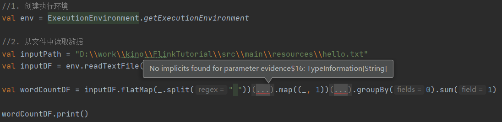

* [一、搭建maven工程 flink](#%E4%B8%80%E6%90%AD%E5%BB%BAmaven%E5%B7%A5%E7%A8%8B-flink)
  * [1\.1  pom文件](#11--pom%E6%96%87%E4%BB%B6)
  * [1\.2  添加scala框架 和 scala文件夹](#12--%E6%B7%BB%E5%8A%A0scala%E6%A1%86%E6%9E%B6-%E5%92%8C-scala%E6%96%87%E4%BB%B6%E5%A4%B9)
* [二、批处理wordcount](#%E4%BA%8C%E6%89%B9%E5%A4%84%E7%90%86wordcount)
* [三、流处理 wordcount](#%E4%B8%89%E6%B5%81%E5%A4%84%E7%90%86-wordcount)


---

# 一、搭建maven工程 flink
## 1.1  pom文件

```xml
<?xml version="1.0" encoding="UTF-8"?>
<project xmlns="http://maven.apache.org/POM/4.0.0"
         xmlns:xsi="http://www.w3.org/2001/XMLSchema-instance"
         xsi:schemaLocation="http://maven.apache.org/POM/4.0.0 http://maven.apache.org/xsd/maven-4.0.0.xsd">
    <modelVersion>4.0.0</modelVersion>

    <groupId>org.example</groupId>
    <artifactId>FlinkTutorial</artifactId>
    <version>1.0-SNAPSHOT</version>

    <dependencies>
        <dependency>
            <groupId>org.apache.flink</groupId>
            <artifactId>flink-scala_2.12</artifactId>
            <version>1.10.1</version>
        </dependency>
        <dependency>
            <groupId>org.apache.flink</groupId>
            <artifactId>flink-streaming-scala_2.12</artifactId>
            <version>1.10.1</version>
        </dependency>
    </dependencies>

    <build>
        <plugins>
            <!-- 该插件用于将 Scala 代码编译成 class 文件 -->
            <plugin>
                <groupId>net.alchim31.maven</groupId>
                <artifactId>scala-maven-plugin</artifactId>
                <version>3.4.6</version>
                <executions>
                    <execution>
                        <!-- 声明绑定到 maven 的 compile 阶段 -->
                        <goals>
                            <goal>compile</goal>
                        </goals>
                    </execution>
                </executions>
            </plugin>
            <plugin>
                <groupId>org.apache.maven.plugins</groupId>
                <artifactId>maven-assembly-plugin</artifactId>
                <version>3.0.0</version>
                <configuration>
                    <descriptorRefs>
                        <descriptorRef>jar-with-dependencies</descriptorRef>
                    </descriptorRefs>
                </configuration>
                <executions>
                    <execution>
                        <id>make-assembly</id>
                        <phase>package</phase>
                        <goals>
                            <goal>single</goal>
                        </goals>
                    </execution>
                </executions>
            </plugin>
        </plugins>
    </build>
</project>
```

## 1.2  添加scala框架 和 scala文件夹


 
# 二、批处理wordcount
注意: flink 有 Java 和 Scala 两种包, 这里我们引入的是 Scala的包;
```scala
package day01

import org.apache.flink.api.scala._

object WordCount {
  def main(args: Array[String]): Unit = {
    //1. 创建执行环境
    val env = ExecutionEnvironment.getExecutionEnvironment

    //2. 从文件中读取数据
    val inputPath = "D:\\work\\kino\\FlinkTutorial\\src\\main\\resources\\hello.txt"
    val inputDF = env.readTextFile(inputPath)

    //3. 使用 flatMap 切分字符串, 使用 map 转换成 元祖, 再使用 groupBy 进行分组, 最后使用 sum 进行聚合
    val wordCountDF = inputDF.flatMap(_.split(" ")).map((_, 1)).groupBy(0).sum(1)

    //4. 打印输出
    wordCountDF.print()
  }
}
```

在 resources 目录下创建 hello.txt 文件, 并添加如下内容:
```text
hello spark
hello flink
```

运行代码, 会得到如下结果:
```scala
(flink,1)
(hello,2)
(spark,1)
```

如果代码有如下报错, 请修改引入的包为 `import org.apache.flink.api.scala._`: 



# 三、流处理 wordcount
```scala
package day01

import org.apache.flink.streaming.api.scala._

object StreamWordCount {
  def main(args: Array[String]): Unit = {
    //1. 创建 流处理环境
    val env = StreamExecutionEnvironment.getExecutionEnvironment

    //2. 接收 Socket 文本流
    val textDstream = env.socketTextStream("localhost", 8888)

    //3. flatMap 和 map 需要隐式转换, 我们在上面引包的时候写的是_, 所以此处省了
    val dataStream = textDstream.flatMap(_.split(" ")).filter(_.nonEmpty).map((_, 1)).keyBy(0).sum(1)

    //4. 打印输出
    dataStream.print()

    //5. 启动 executor, 执行任务
    env.execute("Socket stream word count")
  }
}
```

测试——在 window 子 ubuntu 系统中用 netcat 命令进行发送测试。

```bash
kino@LAPTOP-7SSIH7L3:~$ nc -lk 8888

hello spark
hello flink
spark flink
```

输出如下结果:
```scala
3> (hello,1)
1> (spark,1)
7> (flink,1)
3> (hello,2)
7> (flink,2)
1> (spark,2)
```