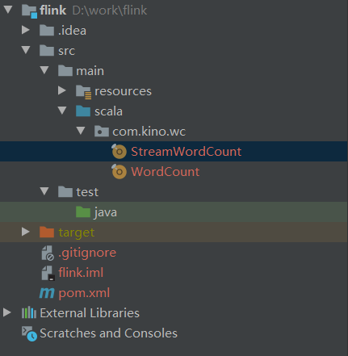

---

# 一、搭建maven工程 FlinkTutorial
## 1.1  pom文件

```xml
<?xml version="1.0" encoding="UTF-8"?>
<project xmlns="http://maven.apache.org/POM/4.0.0"
         xmlns:xsi="http://www.w3.org/2001/XMLSchema-instance"
         xsi:schemaLocation="http://maven.apache.org/POM/4.0.0 http://maven.apache.org/xsd/maven-4.0.0.xsd">
    <modelVersion>4.0.0</modelVersion>
    <groupId>com.kino.flink</groupId>
    <artifactId>FlinkTutorial</artifactId>
    <version>1.0-SNAPSHOT</version>

    <dependencies>
        <dependency>
            <groupId>org.apache.flink</groupId>
            <artifactId>flink-scala_2.11</artifactId>
            <version>1.7.2</version>
        </dependency>
        <!-- https://mvnrepository.com/artifact/org.apache.flink/flink-streaming-scala -->
        <dependency>
            <groupId>org.apache.flink</groupId>
            <artifactId>flink-streaming-scala_2.11</artifactId>
            <version>1.7.2</version>
        </dependency>
    </dependencies>

<build>
    <plugins>
    <!-- 该插件用于将Scala代码编译成class文件 -->
    <plugin>
        <groupId>net.alchim31.maven</groupId>
        <artifactId>scala-maven-plugin</artifactId>
        <version>3.4.6</version>
        <executions>
            <execution>
                <!-- 声明绑定到maven的compile阶段 -->
                <goals>
                    <goal>testCompile</goal>
                </goals>
            </execution>
        </executions>
    </plugin>
        <plugin>
            <groupId>org.apache.maven.plugins</groupId>
            <artifactId>maven-assembly-plugin</artifactId>
            <version>3.0.0</version>
            <configuration>
                <descriptorRefs>
                    <descriptorRef>jar-with-dependencies</descriptorRef>
                </descriptorRefs>
            </configuration>
            <executions>
                <execution>
                    <id>make-assembly</id>
                    <phase>package</phase>
                    <goals>
                        <goal>single</goal>
                    </goals>
                </execution>
            </executions>
        </plugin>
    </plugins>
</build>
</project>
```

## 1.2  添加scala框架 和 scala文件夹


 
# 二、批处理wordcount
src/main/scala/com.kino.wc/WordCount.scala
```scala
object WordCount {
  def main(args: Array[String]): Unit = {
    // 创建执行环境
    val env = ExecutionEnvironment.getExecutionEnvironment
    // 从文件中读取数据
    val inputPath = "D:\\Projects\\BigData\\TestWC1\\src\\main\\resources\\hello.txt"
    val inputDS: DataSet[String] = env.readTextFile(inputPath)
    // 分词之后，对单词进行groupby分组，然后用sum进行聚合
    val wordCountDS: AggregateDataSet[(String, Int)] = inputDS.flatMap(_.split(" ")).map((_, 1)).groupBy(0).sum(1)

    // 打印输出
    wordCountDS.print()
  }
}
```

注意：Flink程序支持java和scala两种语言，本课程中以scala语言为主。在引入包中，有java和scala两种包时注意要使用scala的包。

# 三、流处理 wordcount
src/main/scala/com.atguigu.wc/StreamWordCount.scala
```scala
object StreamWordCount {
  def main(args: Array[String]): Unit = {
    // 从外部命令中获取参数
    val params: ParameterTool =  ParameterTool.fromArgs(args)
    val host: String = params.get("host")
    val port: Int = params.getInt("port")

    // 创建流处理环境
    val env = StreamExecutionEnvironment.getExecutionEnvironment
    // 接收socket文本流
    val textDstream: DataStream[String] = env.socketTextStream(host, port)

    // flatMap和Map需要引用的隐式转换
    import org.apache.flink.api.scala._
    val dataStream: DataStream[(String, Int)] = textDstream.flatMap(_.split("\\s")).filter(_.nonEmpty).map((_, 1)).keyBy(0).sum(1)

    dataStream.print().setParallelism(1)

    // 启动executor，执行任务
    env.execute("Socket stream word count")
  }
}
```

测试——在 window 子 ubuntu 系统中用 netcat 命令进行发送测试。

```bash
nc -lk  7777
```