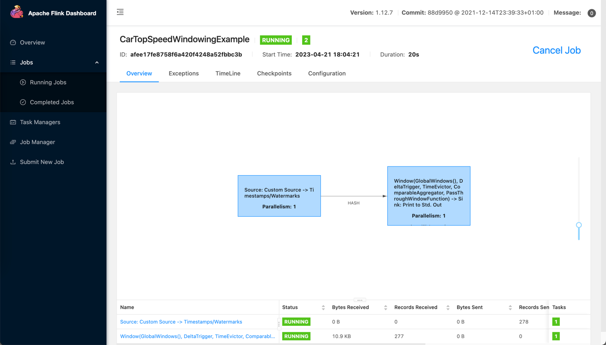
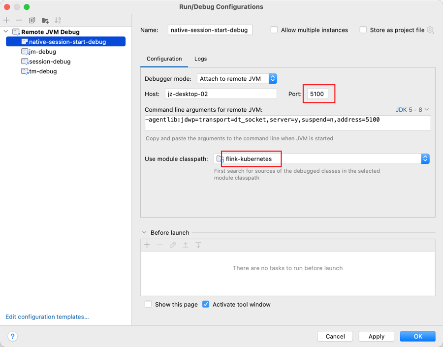

# 一、准备工作
[准备一个 Kubernetes 集群](../Kubernetes/k8s部署.md)
```bash
kubectl get nodes
NAME            STATUS                     ROLES                  AGE    VERSION
jz-desktop-04   Ready,SchedulingDisabled   <none>                 499d   v1.20.15
jz-desktop-05   Ready                      <none>                 134d   v1.20.15
jz-desktop-06   Ready,SchedulingDisabled   control-plane,master   304d   v1.20.15
jz-desktop-07   Ready                      control-plane,master   499d   v1.20.15
jz-desktop-08   Ready                      control-plane,master   305d   v1.20.15
```

[准备flink1.12.7源码](https://github.com/apache/flink)
```bash
git clone https://github.com/apache/flink
git checkout -b release-1.12.7
```
[编译flink源码(只看编译部分)](flink编译.md)


# 二、镜像构建
自己构建镜像适用于自己会修改源码, 如果不需要修改源码, 可以直接使用[官方提供的镜像](https://hub.docker.com/r/apache/flink/tags)
> docker pull apache/flink:1.12.7


手动构建镜像, 可以参考[官方提供的示例](https://github.com/apache/flink-docker), 这里我们准备几个文件

Dockerfile
```bash
vim Dockerfile
###############################################################################
#  Licensed to the Apache Software Foundation (ASF) under one
#  or more contributor license agreements.  See the NOTICE file
#  distributed with this work for additional information
#  regarding copyright ownership.  The ASF licenses this file
#  to you under the Apache License, Version 2.0 (the
#  "License"); you may not use this file except in compliance
#  with the License.  You may obtain a copy of the License at
#
#      http://www.apache.org/licenses/LICENSE-2.0
#
#  Unless required by applicable law or agreed to in writing, software
#  distributed under the License is distributed on an "AS IS" BASIS,
#  WITHOUT WARRANTIES OR CONDITIONS OF ANY KIND, either express or implied.
#  See the License for the specific language governing permissions and
# limitations under the License.
###############################################################################

FROM eclipse-temurin:8-jre-jammy

# Install dependencies
RUN set -ex; \
  apt-get update; \
  apt-get -y install gpg libsnappy1v5 gettext-base libjemalloc-dev; \
  rm -rf /var/lib/apt/lists/*

# Grab gosu for easy step-down from root
ENV GOSU_VERSION 1.11
RUN set -ex; \
  wget -nv -O /usr/local/bin/gosu "https://github.com/tianon/gosu/releases/download/$GOSU_VERSION/gosu-$(dpkg --print-architecture)"; \
  wget -nv -O /usr/local/bin/gosu.asc "https://github.com/tianon/gosu/releases/download/$GOSU_VERSION/gosu-$(dpkg --print-architecture).asc"; \
  export GNUPGHOME="$(mktemp -d)"; \
  for server in ha.pool.sks-keyservers.net $(shuf -e \
                          hkp://p80.pool.sks-keyservers.net:80 \
                          keyserver.ubuntu.com \
                          hkp://keyserver.ubuntu.com:80 \
                          pgp.mit.edu) ; do \
      gpg --batch --keyserver "$server" --recv-keys B42F6819007F00F88E364FD4036A9C25BF357DD4 && break || : ; \
  done && \
  gpg --batch --verify /usr/local/bin/gosu.asc /usr/local/bin/gosu; \
  gpgconf --kill all; \
  rm -rf "$GNUPGHOME" /usr/local/bin/gosu.asc; \
  chmod +x /usr/local/bin/gosu; \
  gosu nobody true

# Configure Flink version
ENV FLINK_TGZ_URL=https://www.apache.org/dyn/closer.cgi?action=download&filename=flink/flink-1.15.4/flink-1.15.4-bin-scala_2.12.tgz \
    FLINK_ASC_URL=https://www.apache.org/dist/flink/flink-1.15.4/flink-1.15.4-bin-scala_2.12.tgz.asc \
    GPG_KEY=0F79F2AFB2351BC29678544591F9C1EC125FD8DB \
    CHECK_GPG=true

# Prepare environment
ENV FLINK_HOME=/opt/flink
ENV PATH=$FLINK_HOME/bin:$PATH
RUN groupadd --system --gid=9999 flink && \
    useradd --system --home-dir $FLINK_HOME --uid=9999 --gid=flink flink
WORKDIR $FLINK_HOME

# Install Flink
RUN set -ex; \
  wget -nv -O flink.tgz "$FLINK_TGZ_URL"; \
  \
  if [ "$CHECK_GPG" = "true" ]; then \
    wget -nv -O flink.tgz.asc "$FLINK_ASC_URL"; \
    export GNUPGHOME="$(mktemp -d)"; \
    for server in ha.pool.sks-keyservers.net $(shuf -e \
                            hkp://p80.pool.sks-keyservers.net:80 \
                            keyserver.ubuntu.com \
                            hkp://keyserver.ubuntu.com:80 \
                            pgp.mit.edu) ; do \
        gpg --batch --keyserver "$server" --recv-keys "$GPG_KEY" && break || : ; \
    done && \
    gpg --batch --verify flink.tgz.asc flink.tgz; \
    gpgconf --kill all; \
    rm -rf "$GNUPGHOME" flink.tgz.asc; \
  fi; \
  \
  tar -xf flink.tgz --strip-components=1; \
  rm flink.tgz; \
  \
  chown -R flink:flink .; \
  \
  # Replace default REST/RPC endpoint bind address to use the container's network interface \
  sed -i 's/rest.address: localhost/rest.address: 0.0.0.0/g' $FLINK_HOME/conf/flink-conf.yaml; \
  sed -i 's/rest.bind-address: localhost/rest.bind-address: 0.0.0.0/g' $FLINK_HOME/conf/flink-conf.yaml; \
  sed -i 's/jobmanager.bind-host: localhost/jobmanager.bind-host: 0.0.0.0/g' $FLINK_HOME/conf/flink-conf.yaml; \
  sed -i 's/taskmanager.bind-host: localhost/taskmanager.bind-host: 0.0.0.0/g' $FLINK_HOME/conf/flink-conf.yaml; \
  sed -i '/taskmanager.host: localhost/d' $FLINK_HOME/conf/flink-conf.yaml;

# Configure container
COPY docker-entrypoint.sh /
ENTRYPOINT ["/docker-entrypoint.sh"]
EXPOSE 6123 8081
CMD ["help"]
EOF
```

docker-entrypoint.sh
```bash
vim docker-entrypoint.sh
#!/usr/bin/env bash

###############################################################################
#  Licensed to the Apache Software Foundation (ASF) under one
#  or more contributor license agreements.  See the NOTICE file
#  distributed with this work for additional information
#  regarding copyright ownership.  The ASF licenses this file
#  to you under the Apache License, Version 2.0 (the
#  "License"); you may not use this file except in compliance
#  with the License.  You may obtain a copy of the License at
#
#      http://www.apache.org/licenses/LICENSE-2.0
#
#  Unless required by applicable law or agreed to in writing, software
#  distributed under the License is distributed on an "AS IS" BASIS,
#  WITHOUT WARRANTIES OR CONDITIONS OF ANY KIND, either express or implied.
#  See the License for the specific language governing permissions and
# limitations under the License.
###############################################################################

COMMAND_STANDALONE="standalone-job"
COMMAND_HISTORY_SERVER="history-server"

# If unspecified, the hostname of the container is taken as the JobManager address
JOB_MANAGER_RPC_ADDRESS=${JOB_MANAGER_RPC_ADDRESS:-$(hostname -f)}
CONF_FILE="${FLINK_HOME}/conf/flink-conf.yaml"

drop_privs_cmd() {
    if [ $(id -u) != 0 ]; then
        # Don't need to drop privs if EUID != 0
        return
    elif [ -x /sbin/su-exec ]; then
        # Alpine
        echo su-exec flink
    else
        # Others
        echo gosu flink
    fi
}

copy_plugins_if_required() {
  if [ -z "$ENABLE_BUILT_IN_PLUGINS" ]; then
    return 0
  fi

  echo "Enabling required built-in plugins"
  for target_plugin in $(echo "$ENABLE_BUILT_IN_PLUGINS" | tr ';' ' '); do
    echo "Linking ${target_plugin} to plugin directory"
    plugin_name=${target_plugin%.jar}

    mkdir -p "${FLINK_HOME}/plugins/${plugin_name}"
    if [ ! -e "${FLINK_HOME}/opt/${target_plugin}" ]; then
      echo "Plugin ${target_plugin} does not exist. Exiting."
      exit 1
    else
      ln -fs "${FLINK_HOME}/opt/${target_plugin}" "${FLINK_HOME}/plugins/${plugin_name}"
      echo "Successfully enabled ${target_plugin}"
    fi
  done
}

set_config_option() {
  local option=$1
  local value=$2

  # escape periods for usage in regular expressions
  local escaped_option=$(echo ${option} | sed -e "s/\./\\\./g")

  # either override an existing entry, or append a new one
  if grep -E "^${escaped_option}:.*" "${CONF_FILE}" > /dev/null; then
        sed -i -e "s/${escaped_option}:.*/$option: $value/g" "${CONF_FILE}"
  else
        echo "${option}: ${value}" >> "${CONF_FILE}"
  fi
}

prepare_configuration() {
    set_config_option jobmanager.rpc.address ${JOB_MANAGER_RPC_ADDRESS}
    set_config_option blob.server.port 6124
    set_config_option query.server.port 6125

    if [ -n "${TASK_MANAGER_NUMBER_OF_TASK_SLOTS}" ]; then
        set_config_option taskmanager.numberOfTaskSlots ${TASK_MANAGER_NUMBER_OF_TASK_SLOTS}
    fi

    if [ -n "${FLINK_PROPERTIES}" ]; then
        echo "${FLINK_PROPERTIES}" >> "${CONF_FILE}"
    fi
    envsubst < "${CONF_FILE}" > "${CONF_FILE}.tmp" && mv "${CONF_FILE}.tmp" "${CONF_FILE}"
}

maybe_enable_jemalloc() {
    if [ "${DISABLE_JEMALLOC:-false}" == "false" ]; then
        JEMALLOC_PATH="/usr/lib/$(uname -m)-linux-gnu/libjemalloc.so"
        JEMALLOC_FALLBACK="/usr/lib/x86_64-linux-gnu/libjemalloc.so"
        if [ -f "$JEMALLOC_PATH" ]; then
            export LD_PRELOAD=$LD_PRELOAD:$JEMALLOC_PATH
        elif [ -f "$JEMALLOC_FALLBACK" ]; then
            export LD_PRELOAD=$LD_PRELOAD:$JEMALLOC_FALLBACK
        else
            if [ "$JEMALLOC_PATH" = "$JEMALLOC_FALLBACK" ]; then
                MSG_PATH=$JEMALLOC_PATH
            else
                MSG_PATH="$JEMALLOC_PATH and $JEMALLOC_FALLBACK"
            fi
            echo "WARNING: attempted to load jemalloc from $MSG_PATH but the library couldn't be found. glibc will be used instead."
        fi
    fi
}

maybe_enable_jemalloc

copy_plugins_if_required

prepare_configuration

args=("$@")
if [ "$1" = "help" ]; then
    printf "Usage: $(basename "$0") (jobmanager|${COMMAND_STANDALONE}|taskmanager|${COMMAND_HISTORY_SERVER})\n"
    printf "    Or $(basename "$0") help\n\n"
    printf "By default, Flink image adopts jemalloc as default memory allocator. This behavior can be disabled by setting the 'DISABLE_JEMALLOC' environment variable to 'true'.\n"
    exit 0
elif [ "$1" = "jobmanager" ]; then
    args=("${args[@]:1}")

    echo "Starting Job Manager"

    exec $(drop_privs_cmd) "$FLINK_HOME/bin/jobmanager.sh" start-foreground "${args[@]}"
elif [ "$1" = ${COMMAND_STANDALONE} ]; then
    args=("${args[@]:1}")

    echo "Starting Job Manager"

    exec $(drop_privs_cmd) "$FLINK_HOME/bin/standalone-job.sh" start-foreground "${args[@]}"
elif [ "$1" = ${COMMAND_HISTORY_SERVER} ]; then
    args=("${args[@]:1}")

    echo "Starting History Server"

    exec $(drop_privs_cmd) "$FLINK_HOME/bin/historyserver.sh" start-foreground "${args[@]}"
elif [ "$1" = "taskmanager" ]; then
    args=("${args[@]:1}")

    echo "Starting Task Manager"

    exec $(drop_privs_cmd) "$FLINK_HOME/bin/taskmanager.sh" start-foreground "${args[@]}"
fi

args=("${args[@]}")

# Running command in pass-through mode
exec $(drop_privs_cmd) "${args[@]}"
```
编译镜像
```bash
docker build -t registry.9zdata.cn/flink/flink:1.12.7 .

# 看见 Successfully tagged flink:1.12.7 即为构建成功
Step 12/14 : ENTRYPOINT ["/docker-entrypoint.sh"]
 ---> Running in 3b999715c7a4
Removing intermediate container 3b999715c7a4
 ---> 987cf24bce7c
Step 13/14 : EXPOSE 6123 8081
 ---> Running in 6ed3beb3dba6
Removing intermediate container 6ed3beb3dba6
 ---> f9968bd551dd
Step 14/14 : CMD ["help"]
 ---> Running in e15e3efc4e47
Removing intermediate container e15e3efc4e47
 ---> 76f6185bb703
Successfully built 76f6185bb703
Successfully tagged flink:1.12.7
```
试运行一个任务查看镜像是否可运行(可以不执行)
```bash
docker run -it --name flink-1 --rm flink:1.12.7 -p 8081:8081 bash
./bin/start-cluster.sh
./bin/flink run examples/batch/WordCount.jar

# 然后在 flink-ui -> http://dockerIp:8081 上查看任务
```
上传私服
```bash
docker push flink:1.12.7
```
如果没有私服, flink 镜像需要给每个kubernetes 机器保存一份

# 三、启动 session
[官方文档](https://nightlies.apache.org/flink/flink-docs-release-1.12/deployment/resource-providers/native_kubernetes.html)
```bash
./bin/kubernetes-session.sh \
  -Dkubernetes.cluster-id=my-flink-session \
  -Dkubernetes.namespace=supert21110027 \
  -Dkubernetes.container.image=registry.9zdata.cn/flink/flink:1.12.7 \
  -Dkubernetes.jobmanager.cpu=1 \
  -Dkubernetes.taskmanager.cpu=1 \
  -Dkubernetes.taskmanager.slots=2 \
  -Dkubernetes.rest-service.exposed.type=NodePort \
  -Dkubernetes.taskmanager.memory.process.size=1024m \
  -Dkubernetes.jobmanager.memory.process.size=1024m \
  -Dkubernetes.container.image.pull-policy=Always \
  -Dkubernetes.container.image.pull-secrets=jz-registry
```
关于 Kubernetes 更多参数选项, 可以查看[官方文档](https://nightlies.apache.org/flink/flink-docs-release-1.12/deployment/config.html#kubernetes-namespace)

session启动完成后, 会打印出 flink webui 的地址
```bash
....
2023-04-21 17:46:12,438 INFO  org.apache.flink.client.deployment.DefaultClusterClientServiceLoader [] - Could not load factory due to missing dependencies.
2023-04-21 17:46:12,990 INFO  org.apache.flink.runtime.util.config.memory.ProcessMemoryUtils [] - The derived from fraction jvm overhead memory (160.000mb (167772162 bytes)) is less than its min value 192.000mb (201326592 bytes), min value will be used instead
2023-04-21 17:46:12,997 INFO  org.apache.flink.runtime.util.config.memory.ProcessMemoryUtils [] - The derived from fraction jvm overhead memory (172.800mb (181193935 bytes)) is less than its min value 192.000mb (201326592 bytes), min value will be used instead
2023-04-21 17:46:13,071 INFO  org.apache.flink.kubernetes.utils.KubernetesUtils            [] - Kubernetes deployment requires a fixed port. Configuration blob.server.port will be set to 6124
2023-04-21 17:46:13,071 INFO  org.apache.flink.kubernetes.utils.KubernetesUtils            [] - Kubernetes deployment requires a fixed port. Configuration taskmanager.rpc.port will be set to 6122
2023-04-21 17:46:13,108 INFO  org.apache.flink.runtime.util.config.memory.ProcessMemoryUtils [] - The derived from fraction jvm overhead memory (160.000mb (167772162 bytes)) is less than its min value 192.000mb (201326592 bytes), min value will be used instead
2023-04-21 17:46:18,334 INFO  org.apache.flink.kubernetes.KubernetesClusterDescriptor      [] - Create flink session cluster my-flink-session successfully, JobManager Web Interface: http://192.168.1.248:32165
```
# 四、运行任务
```bash
./bin/flink run \
  --target kubernetes-session \
  -m 192.168.1.248:32165 \
  -Dkubernetes.cluster-id=my-flink-session \
  -Dkubernetes.namespace=supert21110027 \
  -Dkubernetes.container.image.pull-secrets=jz-registry \
  ./examples/streaming/TopSpeedWindowing1.jar
```



# 五、源码分析
在 debug 开始前, 我们一共有两个地方需要设置 debug 参数:
1. 修改 `flink-conf.yaml`, 添加参数:
   > env.java.opts.jobmanager: "-agentlib:jdwp=transport=dt_socket,server=y,suspend=y,address=5005"
   >    
   > env.java.opts.taskmanager: "-agentlib:jdwp=transport=dt_socket,server=y,suspend=y,address=5006"
   >    
   > env.java.opts.client: "-agentlib:jdwp=transport=dt_socket,server=y,suspend=y,address=5008"
2. 修改 `./bin/kubernetes-session.sh`, 修改参数:
   > $JAVA_RUN $JVM_ARGS -classpath "$CC_CLASSPATH"  $log_setting org.apache.flink.kubernetes.cli.KubernetesSessionCli "$@"
   > 
   > 修改为
   > 
   > $JAVA_RUN $JVM_ARGS -classpath "$CC_CLASSPATH" -Ddebug -Xdebug -Xrunjdwp:transport=dt_socket,server=y,suspend=y,address=5100 $log_setting org.apache.flink.kubernetes.cli.KubernetesSessionCli "$@"
   > 

启动 session 执行的脚本 `./bin/kubernetes-session.sh`, 在最后一行中, 运行了 java 类: `org.apache.flink.kubernetes.cli.KubernetesSessionCli`, 在这里我们重新启动 session 并且在 KubernetesSessionCli 的 main 方法中添加断点
```bash
./bin/kubernetes-session.sh \
  -Dkubernetes.cluster-id=my-flink-session \
  -Dkubernetes.namespace=supert21110027 \
  -Dkubernetes.container.image=registry.9zdata.cn/flink/flink:1.12.7 \
  -Dkubernetes.jobmanager.cpu=1 \
  -Dkubernetes.taskmanager.cpu=1 \
  -Dkubernetes.taskmanager.slots=2 \
  -Dkubernetes.rest-service.exposed.type=NodePort \
  -Dkubernetes.taskmanager.memory.process.size=1024m \
  -Dkubernetes.jobmanager.memory.process.size=1024m \
  -Dkubernetes.container.image.pull-policy=Always \
  -Dkubernetes.container.image.pull-secrets=jz-registry
# 输出信息  
Setting HADOOP_CONF_DIR=/etc/hadoop/conf because no HADOOP_CONF_DIR or HADOOP_CLASSPATH was set.
Setting HBASE_CONF_DIR=/etc/hbase/conf because no HBASE_CONF_DIR was set.
Listening for transport dt_socket at address: 5100  <----  程序卡主, 等待调式
```
