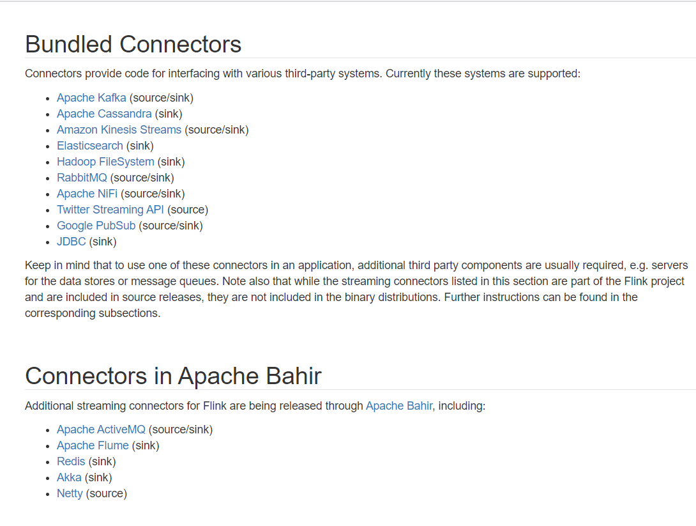

---
Flink 没有类似于 Spark 中 foreach 方法, 让用户进行迭代的操作。 虽有对外的输出操作都要利用 Sink 完成, 最后通过类似如下方式完成整个任务最重输出操作:
```scala 3
stream.addSink(new MySink(abcd))
```
官方提供了一部分的框架的 Sink. 除此以外, 需要用户自定义实现 Sink.

[官方提供的一部分框架的 Sink](https://ci.apache.org/projects/flink/flink-docs-release-1.11/zh/dev/connectors/#%E9%99%84%E5%B8%A6%E7%9A%84%E8%BF%9E%E6%8E%A5%E5%99%A8)



# 一、File Sink
```bash
package com.kino.sink

import com.kino.mode.SensorReading
import org.apache.flink.api.common.serialization.SimpleStringEncoder
import org.apache.flink.core.fs.Path
import org.apache.flink.streaming.api.functions.sink.filesystem.StreamingFileSink
import org.apache.flink.streaming.api.scala._

/**
 * create by kino on 2021/1/15
 */
object FileSink {
  def main(args: Array[String]): Unit = {
    val env = StreamExecutionEnvironment.getExecutionEnvironment
    env.setParallelism(1)

    // 读取数据
    val inputStream = env.readTextFile("D:\\work\\note-codes\\FlinkTutorial\\src\\main\\resources\\SensorReading.txt")

    // 转换成样例类类型(简单的转换操作)
    val dataStream = inputStream.map(x => {
      val splits = x.split(",")
      SensorReading(splits(0), splits(1).toLong, splits(2).toDouble)
    })

    dataStream.print()
    //    dataStream.writeAsCsv("D:\\Projects\\BigData\\FlinkTutorial\\src\\main\\resources\\out.txt")
    dataStream.addSink(
      StreamingFileSink.forRowFormat(
        new Path("D:\\work\\note-codes\\FlinkTutorial\\src\\main\\resources\\out.txt"),
        new SimpleStringEncoder[SensorReading]()
      ).build()
    )

    env.execute(this.getClass.getName)
  }
}
```


# 二、Kafka Sink
在前面的文章 [Flink Source](../../note/flink/flinkSource.md) 中, 列举了 Kafka Source, 这里讲述 Kafka Sink

添加 pom 依赖
```xml
<!--
https://mvnrepository.com/artifact/org.apache.flink/flink-connector-kafka-0.11
-->
<dependency>
    <groupId>org.apache.flink</groupId>
    <artifactId>flink-connector-kafka-0.11_2.12</artifactId>
    <version>1.10.1</version>
</dependency>
```
Kafka Sink 代码如下:
```scala 3
package day03

import java.util.Properties
import org.apache.flink.api.common.serialization.SimpleStringSchema
import org.apache.flink.streaming.api.scala._
import org.apache.flink.streaming.connectors.kafka.FlinkKafkaConsumer011
import org.apache.flink.streaming.connectors.kafka.FlinkKafkaProducer011

object MySink {
    def main(args: Array[String]): Unit = {
        val env = StreamExecutionEnvironment.getExecutionEnvironment

        val properties = new Properties()
        properties.setProperty("bootstrap.servers", "bigdata001:9092")
        properties.setProperty("group.id", "consumer-group1")
        properties.setProperty("zookeeper.connect", "bigdata001:2181")
        properties.setProperty("key.deserializer", "org.apache.kafka.common.serialization.StringDeserializer")
        properties.setProperty("value.deserializer", "org.apache.kafka.common.serialization.StringDeserializer")
        properties.setProperty("auto.offset.reset", "earliest")

        val stream = env.addSource(new FlinkKafkaConsumer011[String]("sensor", new SimpleStringSchema(), properties))

        stream.print()

        val myProducer = new FlinkKafkaProducer011[String]("bigdata001:9092","sensor1",new SimpleStringSchema())

        myProducer.setWriteTimestampToKafka(true)

        stream.addSink(myProducer)


        env.execute()
    }
}
```
启动 Kafka 生产者, 在 topic 为 sensor 中生产如下消息:
```bash
> sensor_1,1547718199,35.8
> sensor_6,1547718201,15.4
> sensor_7,1547718202,6.7
> sensor_10,1547718205,38.1
> sensor_1,1547718199,35.8
> sensor_1,1547718199,35.8
> sensor_1,1547718199,35.8
> sensor_6,1547718201,15.4
> sensor_7,1547718202,6.7
> sensor_10,1547718205,38.1
> sensor_1,1547718199,35.8
> sensor_1,1547718199,35.8
```
启动 Kafka 消费者, 消费 topic 为 sensor1 的消息:
```bash
20/09/14 11:25:40 INFO internals.Fetcher: [Consumer clientId=consumer-1, groupId=console-consumer-69271] Resetting offset for partition sensor1-0 to offset 0.
sensor_1,1547718199,35.8
sensor_6,1547718201,15.4
sensor_7,1547718202,6.7
sensor_10,1547718205,38.1
sensor_1,1547718199,35.8
sensor_1,1547718199,35.8
sensor_1,1547718199,35.8
sensor_6,1547718201,15.4
sensor_7,1547718202,6.7
sensor_10,1547718205,38.1
sensor_1,1547718199,35.8
sensor_1,1547718199,35.8
```


# 三、Redis Sink
添加 pom 依赖
```xml
<!-- https://mvnrepository.com/artifact/org.apache.bahir/flink-connector-redis-->
<dependency>
    <groupId>org.apache.bahir</groupId>
    <artifactId>flink-connector-redis_2.11</artifactId>
    <version>1.0</version>
</dependency>
```
代码如下:
```scala 3
package day03
import Mode.SensorReading
import java.util.Properties
import org.apache.flink.api.common.serialization.SimpleStringSchema
import org.apache.flink.streaming.api.scala._
import org.apache.flink.streaming.connectors.kafka._
import org.apache.flink.streaming.connectors.redis.common.mapper.RedisMapper
import org.apache.flink.streaming.connectors.redis.common.mapper.RedisCommandDescription
import org.apache.flink.streaming.connectors.redis.common.mapper.RedisCommand

object MyRedisSink {

    def main(args: Array[String]): Unit = {
        import org.apache.flink.streaming.connectors.redis.RedisSink
        import org.apache.flink.streaming.connectors.redis.common.config.{FlinkJedisConfigBase, FlinkJedisPoolConfig}
        val env = StreamExecutionEnvironment.getExecutionEnvironment

        val properties = new Properties()
        properties.setProperty("bootstrap.servers", "bigdata001:9092")
        properties.setProperty("group.id", "consumer-group1")
        properties.setProperty("zookeeper.connect", "bigdata001:2181")
        properties.setProperty("key.deserializer", "org.apache.kafka.common.serialization.StringDeserializer")
        properties.setProperty("value.deserializer", "org.apache.kafka.common.serialization.StringDeserializer")
        properties.setProperty("auto.offset.reset", "earliest")

        val stream = env.addSource(new FlinkKafkaConsumer011[String]("sensor", new SimpleStringSchema(), properties))
                .map(x => {
                    val dataArray = x.split(",")
                    SensorReading(dataArray(0).trim, dataArray(1).trim.toLong, dataArray(2).trim.toDouble)
                })
        stream.print()

        val conf = new FlinkJedisPoolConfig.Builder().setHost("192.168.220.10").setPort(6379).build()


        stream.addSink(new RedisSink[SensorReading](conf, new MyRedisMapper))

        env.execute()
    }
}

class MyRedisMapper extends RedisMapper[SensorReading]{

    override def getCommandDescription: RedisCommandDescription = {
        //把传感器id和温度值保存成哈希表: HSET key field value
        new RedisCommandDescription(RedisCommand.HSET, "sensor_temperature")
    }

    override def getKeyFromData(data: SensorReading): String = {
        data.id
    }

    override def getValueFromData(data: SensorReading): String = {
        data.temperature.toString
    }
}
```

[docker 安装 redis](https://github.com/KinoMin/bigdata-learning-notes/blob/master/note/docker/Docker%E5%B8%B8%E7%94%A8%E5%AE%89%E8%A3%85.md#%E5%9B%9B%E5%AE%89%E8%A3%85redis)

启动 Kafka 输入如下内容:
```bash
sensor_1,1547718199,35.8
```

redis 查看结果:
```bash
127.0.0.1:6379> KEYS *
1) "sensor_temperature"
2) "k1"
127.0.0.1:6379> hgetall sensor_temperature
1) "sensor_1"
2) "35.8"
```
RedisCommand 可选项:

Data Type |	Redis Command [Sink]
---- | ----
HASH | HSET
LIST | RPUSH, LPUSH
SET | SADD
PUBSUB | PUBLISH
STRING | SET
HYPER_LOG_LOG | PFADD
SORTED_SET | ZADD
SORTED_SET | ZREM

# 四、Elasticsearch Sink
[docker 部署 Elasticsearch](../../note/elasticsearch/Docker安装Elasticsearch.md)

[docker 部署 Kibana](../../note/kibana/Docker安装Kibana.md)

添加 pom 依赖
```xml
<dependency>
    <groupId>org.apache.flink</groupId>
    <artifactId>flink-connector-elasticsearch6_2.12</artifactId>
    <version>1.10.1</version>
</dependency>
```
代码如下:
```scala
package com.kino.sink

import com.kino.mode.SensorReading
import org.apache.flink.api.common.functions.RuntimeContext
import org.apache.flink.streaming.api.scala._
import org.apache.flink.streaming.connectors.elasticsearch.{ElasticsearchSinkFunction, RequestIndexer}
import org.apache.flink.streaming.connectors.elasticsearch6.ElasticsearchSink
import org.apache.http.HttpHost
import org.elasticsearch.client.Requests

import java.util


/**
 * create by kino on 2021/1/14
 */
object EsSink {
  def main(args: Array[String]): Unit = {
    val env = StreamExecutionEnvironment.getExecutionEnvironment

    // 1. 读取数据
    val inputStream = env.readTextFile("D:\\work\\note-codes\\FlinkTutorial\\src\\main\\resources\\SensorReading.txt")

    // 2. 转换成样例类类型(简单转换操作)
    val dataStream = inputStream.map(x => {
      val arr = x.split(",")
      SensorReading(arr(0), arr(1).toLong, arr(2).toDouble)
    })

    // 3. 定义 httpHosts
    val httpHosts = new util.ArrayList[HttpHost]()
    httpHosts.add(new HttpHost("localhost", 9200))

    // 4. 自定义写入 es 的 EsSinkFunction
    val myEsSinkFunction  = new ElasticsearchSinkFunction[SensorReading] {
      override def process(t: SensorReading, runtimeContext: RuntimeContext, requestIndexer: RequestIndexer): Unit = {
        // 包装一个 Map 作为 data source
        val datasource = new util.HashMap[String, String]()
        datasource.put("id", t.id)
        datasource.put("temperature", t.temperature.toString)
        datasource.put("ts", t.timestamp.toString)

        // 创建 index request, 用于发送 http 请求
        val indexRequest = Requests.indexRequest()
          .index("sensor")
          .`type`("readingdata")
          .source(datasource)

        // 用indexer发送请求
        requestIndexer.add(indexRequest)
      }
    }
    dataStream.addSink(new ElasticsearchSink.Builder[SensorReading](httpHosts, myEsSinkFunction).build())

    env.execute(this.getClass.getName)
  }
}
```

# 五、自定义JDBC Sink
```scala
package com.kino.sink

import com.kino.mode.SensorReading
import com.kino.source.CustomSource.MySensorSource
import org.apache.flink.configuration.Configuration
import org.apache.flink.streaming.api.functions.sink.{RichSinkFunction, SinkFunction}
import org.apache.flink.streaming.api.scala._

import java.sql.{Connection, DriverManager, PreparedStatement}

/**
 * create by kino on 2021/1/15
 */
object JdbcSink {
  def main(args: Array[String]): Unit = {
    val env = StreamExecutionEnvironment.getExecutionEnvironment
    val inputStream: DataStream[SensorReading] = env.addSource(new MySensorSource())
    inputStream.addSink(new MyJdbcSinkFunction())
    env.execute(this.getClass.getName)
  }
}

class MyJdbcSinkFunction() extends RichSinkFunction[SensorReading]{
  // 定义连接、预编译语句
  var conn: Connection = _
  var insertStmt: PreparedStatement = _
  var updateStmt: PreparedStatement = _

  override def open(parameters: Configuration): Unit ={
    conn = DriverManager.getConnection("jdbc:mysql://192.168.1.140:3307/test", "dmp", "Ioubuy123")
    insertStmt = conn.prepareStatement("insert into sensor_temp (id, temp) values (?, ?)")
    updateStmt = conn.prepareStatement("update sensor_temp set temp = ? where id = ?")
  }

  override def invoke(value: SensorReading, context: SinkFunction.Context[_]): Unit = {
    // 先执行更新操作，查到就更新
    updateStmt.setDouble(1, value.temperature)
    updateStmt.setString(2, value.id)
    updateStmt.execute()
    // 如果更新没有查到数据，那么就插入
    if( updateStmt.getUpdateCount == 0 ){
      insertStmt.setString(1, value.id)
      insertStmt.setDouble(2, value.temperature)
      insertStmt.execute()
    }
  }

  override def close(): Unit = {
    insertStmt.close()
    updateStmt.close()
    conn.close()
  }
}
```