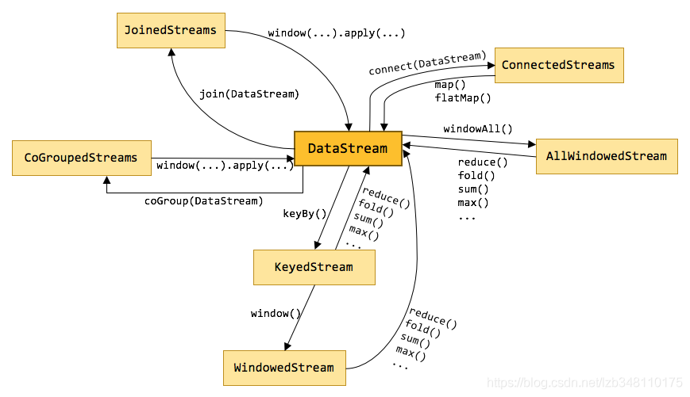
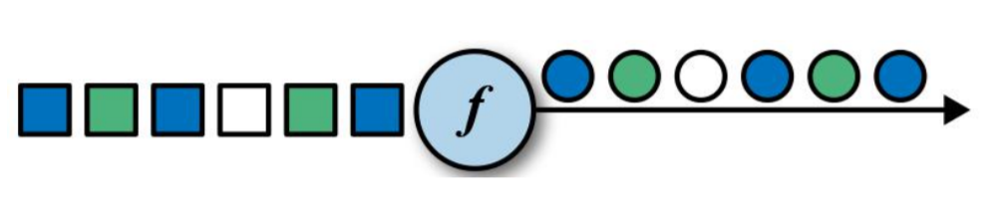
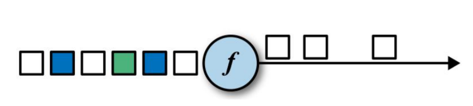
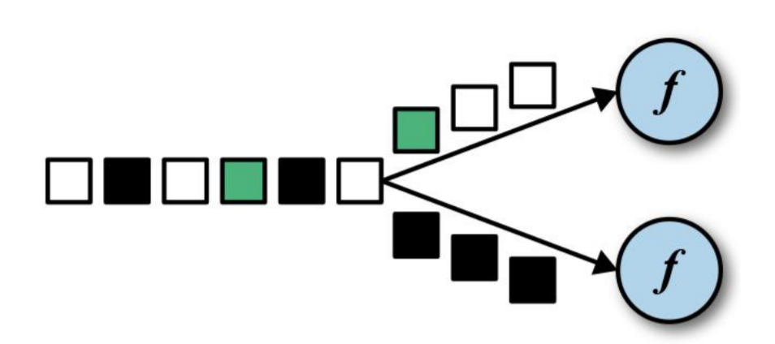
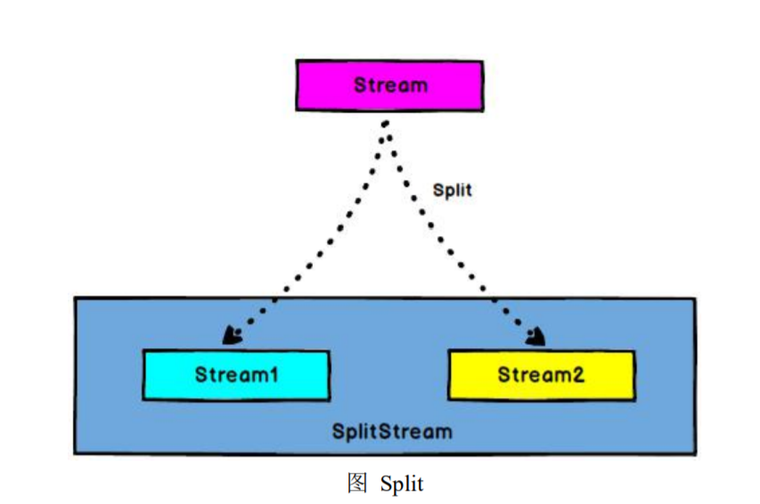
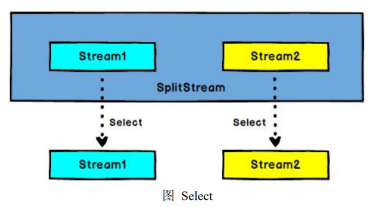
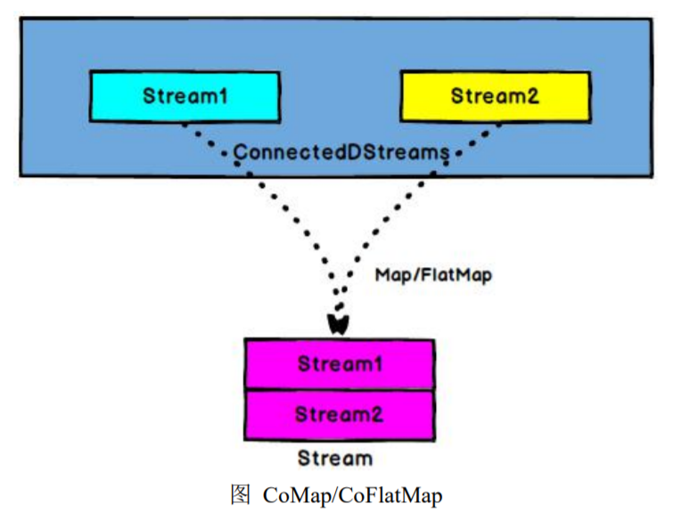
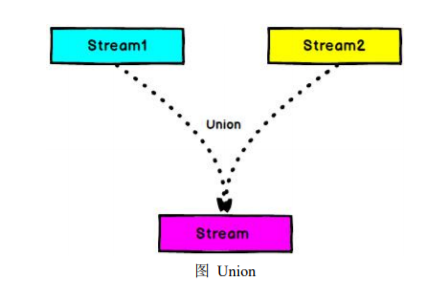

* [一、基本介绍](#%E4%B8%80%E5%9F%BA%E6%9C%AC%E4%BB%8B%E7%BB%8D)
* [二、map](#%E4%BA%8Cmap)
* [三、flatMap](#%E4%B8%89flatmap)
* [四、Filter](#%E5%9B%9Bfilter)
* [五、keyBy](#%E4%BA%94keyby)
* [六、滚动聚合算子(Rolling Aggregation)](#%E5%85%AD%E6%BB%9A%E5%8A%A8%E8%81%9A%E5%90%88%E7%AE%97%E5%AD%90rolling-aggregation)
* [七、Reduce](#%E4%B8%83reduce)
* [八、Split 和 Select](#%E5%85%ABsplit-%E5%92%8C-select)
* [九、Connect 和 CoMap/CoFlatMap](#%E4%B9%9Dconnect-%E5%92%8C-comapcoflatmap)
* [十二、Union](#%E5%8D%81%E4%BA%8Cunion)

---
# 一、基本介绍
Flink中的算子, 是对 DataStream 进行操作, 返回一个新的 DataStream 的过程.

Transform 过程, 是将一个或多个 DataStream 转换为新的 DataStream, 可以将多个转换组合成复杂的数据流拓扑

在Flink中, 有多种不同的 DataStream 类型, 他们之间就是使用各种算子来进行转换的. 如下图所示: 



本篇主要介绍 Flink 常用的 Transform 算子

# 二、map

```scala 3
object TransForm {
  def main(args: Array[String]): Unit = {
    val env = StreamExecutionEnvironment.getExecutionEnvironment
    val stream = env.socketTextStream("localhost", 8888)
    val streamPrint = stream.map(x => x.toInt * 2)
    streamPrint.print
    env.execute(TransForm.getClass.getName)
  }
}
```
启动 nc 工具, 输入:
```scala 3
kino@LAPTOP-7SSIH7L3:~$ nc -lk 8888
1
2
3
4
5
```
输出结果:
```scala 3
2> 2
3> 4
4> 6
5> 8
6> 10
```

# 三、flatMap
```scala 3
package day02.transform

import org.apache.flink.streaming.api.scala._

object TransForm {
  def main(args: Array[String]): Unit = {
    val env = StreamExecutionEnvironment.getExecutionEnvironment
    val stream = env.socketTextStream("localhost", 8888)
    //flatMap
    var streamPrint = stream.flatMap(_.split(","))
    streamPrint.print
    env.execute(TransForm.getClass.getName)
  }
}
```
启动 nc 工具, 输入:
```scala 3
kino@LAPTOP-7SSIH7L3:~$ nc -lk 8888
hello,flink
hello,spark
```
输出结果:
```scala 3
5> hello
5> flink
6> hello
6> spark
```

# 四、Filter

```bash
package day02.transform

import org.apache.flink.streaming.api.scala._

object TransForm {
  def main(args: Array[String]): Unit = {
    val env = StreamExecutionEnvironment.getExecutionEnvironment
    val stream = env.socketTextStream("localhost", 8888)

    // Filter
    val streamPrint = stream.filter(_.toInt % 2 == 0)

    streamPrint.print
    env.execute(TransForm.getClass.getName)
  }
}
```
启动 nc 工具, 输入:
```scala 3
kino@LAPTOP-7SSIH7L3:~$ nc -lk 8888
1
2
3
4
5
6
```
输出结果:
```scala 3
8> 4
2> 6
6> 2
```

# 五、keyBy

`DataStream` → `KeyedStream`: 逻辑地将一个流拆分成不相交的分区, 每个分区包含具有相同 key 的元素, 在内部以 hash 的形式实现的。
```scala 3
package day02.transform

import org.apache.flink.api.java.tuple.Tuple
import org.apache.flink.streaming.api.scala._

object TransForm {
  def main(args: Array[String]): Unit = {
    val env = StreamExecutionEnvironment.getExecutionEnvironment
    val stream = env.socketTextStream("localhost", 8888)

    val streamPrint = stream.map((_, 1)).keyBy(0)

    streamPrint.print
    env.execute(TransForm.getClass.getName)
  }
}
```
启动 nc 工具, 输入:
```scala 3
kino@LAPTOP-7SSIH7L3:~$ nc -lk 8888
aaa
bbb
ccc
aaa
ccc
```
输出结果:
```scala 3
5> (aaa,1)
7> (ccc,1)
4> (bbb,1)
5> (aaa,1)
8> (ccc,1)
```

# 六、滚动聚合算子(Rolling Aggregation)
滚动聚合算子可以针对 KeyedStream 的每一个支流做聚合.
- sum
- min
- max
- minBy
- maxBy

例如: 
```scala 3
package day02.transform

import org.apache.flink.api.java.tuple.Tuple
import org.apache.flink.streaming.api.scala._

object TransForm {
  def main(args: Array[String]): Unit = {
    val env = StreamExecutionEnvironment.getExecutionEnvironment
    val stream = env.socketTextStream("localhost", 8888)

    // 滚动聚合算子
    val streamPrint = stream.map((_, 1)).keyBy(0).sum(1)

    streamPrint.print
    env.execute(TransForm.getClass.getName)
  }
}
```
启动 nc 工具, 输入:
```scala 3
kino@LAPTOP-7SSIH7L3:~$ nc -lk 8888
aaa
bbb
ccc
aaa
ccc
```
输出结果:
```scala 3
7> (ccc,1)
4> (bbb,1)
5> (aaa,1)
5> (aaa,2)
7> (ccc,2)
```

# 七、Reduce
`KeyedStream` → `DataStream`: 一个分组数据流的聚合操作, 合并当前的元素和上次聚合的结果, 产生一个新的值, 返回的流中包含每一次聚合的结果, 而不是只返回最后一次聚合的最终结果。

示例: 读取 SensorReading 文件, 输出时, 将 timestamp 在当前结果+1, temperature 输出上一条记录的

src\main\resources\SensorReading
```text
sensor_1,1547718199,35.8
sensor_6,1547718201,15.4
sensor_7,1547718202,6.7
sensor_10,1547718205,38.1
```
```scala 3
package day02.transform

import Mode.SensorReading
import org.apache.flink.streaming.api.scala._

object Reduce {
  def main(args: Array[String]): Unit = {
    val env = StreamExecutionEnvironment.getExecutionEnvironment
    val stream = env.readTextFile("D:\\work\\kino\\FlinkTutorial\\src\\main\\resources\\SensorReading")
    val reduceDS: DataStream[SensorReading] = stream.map(x => {
      val dataArray = x.split(",")
      SensorReading(dataArray(0).trim, dataArray(1).trim.toLong, dataArray(2).trim.toDouble)
    })
      .keyBy("id")
      .reduce((x, y) => {
        SensorReading(x.id, x.timestamp + 1, y.temperature)
      })
    reduceDS.print
    env.execute(Reduce.getClass.getName)
  }
}
```
输出结果:
```scala 3
6> SensorReading(sensor_6,1547718201,15.4)
4> SensorReading(sensor_10,1547718205,38.1)
7> SensorReading(sensor_7,1547718202,6.7)
5> SensorReading(sensor_1,1547718199,35.8)
```

# 八、Split 和 Select 
***Split***:

`DataStream` → `SplitStream`: 根据某些特征把一个 DataStream 拆分成两个或者多个 DataStream


***Select***:

`SplitStream` → `DataStream`: 从一个 SplitStream 中获取一个或者多个DataStream。


例子: 将 传感器 数据按温度高低(以30度为界), 拆分成两个流.
```scala 3
package day02.transform

import Mode.SensorReading
import org.apache.flink.streaming.api.scala._

object SplitAndSelect {
  def main(args: Array[String]): Unit = {
    val env = StreamExecutionEnvironment.getExecutionEnvironment
    val stream = env.readTextFile("D:\\work\\kino\\FlinkTutorial\\src\\main\\resources\\SensorReading")
    val splitStream = stream.map(x => {
      val dataArray = x.split(",")
      SensorReading(dataArray(0), dataArray(1).toInt, dataArray(2).toDouble)
    })
      .split(x => {
        if (x.temperature > 30)
          Seq("high")
        else
          Seq("low")
      })

    var high: DataStream[SensorReading] = splitStream.select("high")
    var low: DataStream[SensorReading] = splitStream.select("low")
    var all: DataStream[SensorReading] = splitStream.select("high", "low")

    high.print("high: ").setParallelism(1)
    low.print("low: ").setParallelism(1)
    all.print("all: ").setParallelism(1)

    env.execute(this.getClass.getName)
  }
}
```
输出结果:
```scala 3
all: > SensorReading(sensor_6,1547718201,15.4)
low: > SensorReading(sensor_7,1547718202,6.7)
high: > SensorReading(sensor_10,1547718205,38.1)
all: > SensorReading(sensor_1,1547718199,35.8)
low: > SensorReading(sensor_6,1547718201,15.4)
high: > SensorReading(sensor_1,1547718199,35.8)
all: > SensorReading(sensor_10,1547718205,38.1)
all: > SensorReading(sensor_7,1547718202,6.7)
```

# 九、Connect 和 CoMap/CoFlatMap
***Connect***:

`DataStream,DataStream` → `ConnectedStreams`: 连接两个保持他们类型的数据流, 两个数据流被 Connect 之后, 只是被放在了一个同一个流中, 内部依然保持各自的数据和形式不发生任何变化, 两个流相互独立.


***CoMap/CoFlatMap***:

`ConnectedStreams` → `DataStream`: 作用于 ConnectedStreams 上, 功能与 map 和 flatMap 一样, 对 ConnectedStreams 中的每一个 Stream 分别进行 map 和 flatMap 处理.



```scala 3
package day02.transform

import Mode.SensorReading
import org.apache.flink.streaming.api.scala._

object SplitAndSelect {
  def main(args: Array[String]): Unit = {
    val env = StreamExecutionEnvironment.getExecutionEnvironment
    val stream = env.readTextFile("D:\\work\\kino\\FlinkTutorial\\src\\main\\resources\\SensorReading")
    val splitStream = stream.map(x => {
      val dataArray = x.split(",")
      SensorReading(dataArray(0), dataArray(1).toInt, dataArray(2).toDouble)
    })
      .split(x => {
        if (x.temperature > 30)
          Seq("high")
        else
          Seq("low")
      })

    var high: DataStream[SensorReading] = splitStream.select("high")
    var low: DataStream[SensorReading] = splitStream.select("low")
    var all: DataStream[SensorReading] = splitStream.select("high", "low")

    val warning = high.map(x => (x.id, x.temperature))
    val connected: ConnectedStreams[(String, Double), SensorReading] = warning.connect(all)
    val coMap = connected.map(
      warningData => (warningData._1, warningData._2, "warning"),
      lowData => (lowData.id, "healthy")
    )
    coMap.print()
    env.execute(this.getClass.getName)
  }
}
```
输出结果:
```scala 3
2> (sensor_6,healthy)
6> (sensor_10,38.1,warning)
1> (sensor_1,35.8,warning)
4> (sensor_7,healthy)
6> (sensor_10,healthy)
1> (sensor_1,healthy)
```

# 十二、Union


`DataStream` → `DataStream`: 对两个或者两个以上的 DataStream 进行 union 操作, 产生一个包含所有 DataStream 元素的新 DataStream。

```scala 3
package day02.transform

import Mode.SensorReading
import org.apache.flink.streaming.api.scala._

object SplitAndSelect {
  def main(args: Array[String]): Unit = {
    val env = StreamExecutionEnvironment.getExecutionEnvironment
    val stream = env.readTextFile("D:\\work\\kino\\FlinkTutorial\\src\\main\\resources\\SensorReading")
    val splitStream = stream.map(x => {
      val dataArray = x.split(",")
      SensorReading(dataArray(0), dataArray(1).toInt, dataArray(2).toDouble)
    })
      .split(x => {
        if (x.temperature > 30)
          Seq("high")
        else
          Seq("low")
      })

    var high: DataStream[SensorReading] = splitStream.select("high")
    var low: DataStream[SensorReading] = splitStream.select("low")
    var all: DataStream[SensorReading] = splitStream.select("high", "low")

    val warning = high.map(x => (x.id, x.temperature))
    val connected: ConnectedStreams[(String, Double), SensorReading] = warning.connect(all)
    val coMap = connected.map(
      warningData => (warningData._1, warningData._2, "warning"),
      lowData => (lowData.id, "healthy")
    )
    high.union(all).union(low).print()
    env.execute(this.getClass.getName)
  }
}
```
输出结果:
```scala 3
5> SensorReading(sensor_7,1547718202,6.7)
3> SensorReading(sensor_6,1547718201,15.4)
5> SensorReading(sensor_7,1547718202,6.7)
3> SensorReading(sensor_6,1547718201,15.4)
7> SensorReading(sensor_10,1547718205,38.1)
7> SensorReading(sensor_10,1547718205,38.1)
2> SensorReading(sensor_1,1547718199,35.8)
2> SensorReading(sensor_1,1547718199,35.8)
```


Connect 与 Union 区别:
1. Union 之前两个流的类型必须是一样，Connect 可以不一样，在之后的 coMap 中再去调整成为一样的。
2. Connect 只能操作两个流，Union 可以操作多个。

