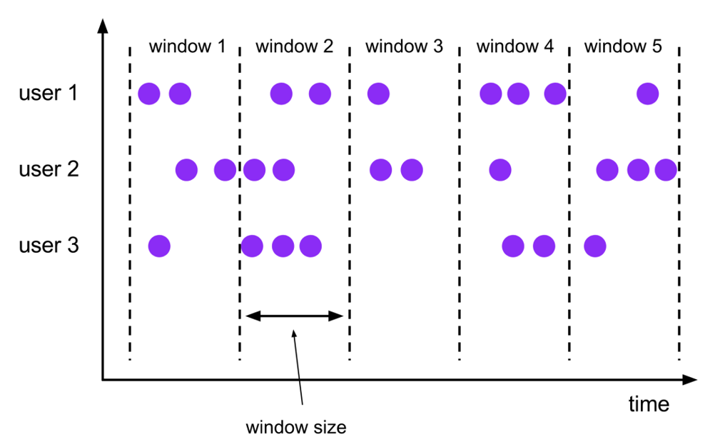
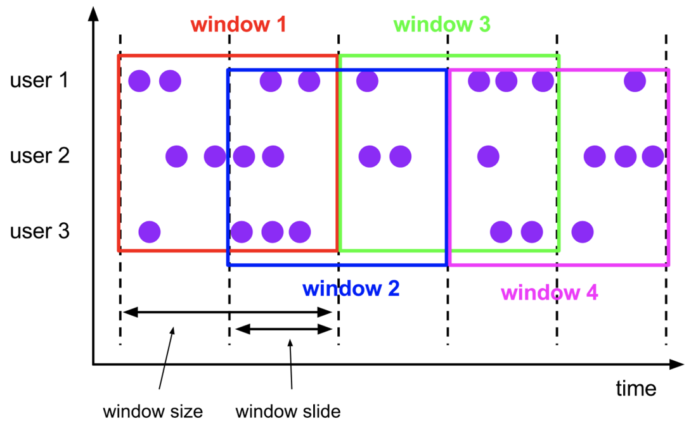
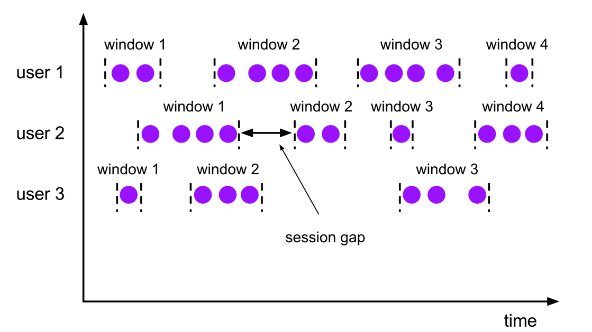

---

# 一、Window 说明
Flink 流式计算是处理无限数据集的引擎, 而Window 则是将这个无限的数据集切分成有限大小的块(buckets/桶) , 从而对这些块(buckets/桶)进行计算操作

# 二、Window 类型
Window 可以将无限的数据集切分成有限大小的块, 按什么类型切分可以分为如下几类:
1. CountWindow: 按照指定的数据条数生成一个 Window, 和时间无关
2. TimeWindow: 按照时间生成 Window
   - 滚动窗口(Tumbling Windows): 将数据依据固定的窗口长度对数据进行切分
     
     **特点:** 时间对齐, 窗口长度固定, 没有重叠
    
     **场景:** 适合 BI 统计等(做每个时间段的聚合计算)

          

   - 滑动窗口(Sliding Windows): 由固定的窗口长度和滑动间隔组成

     特点: 时间对齐, 窗口长度固定, 可以有重叠
    
     场景: 对最近一个时间段内的统计(最近5分钟的失败率决定报警)

     

   - 会话窗口(Session Windows): 由一系列事件组合一个指定时间长度的 timeout 间隙组成, 类似 web 应用的 session, 也就是一段时间没有接收到新数据就会生成新的窗口
    
     特点: 时间五对其

     
    

# 三、Window API - TimeWindow(时间窗口)
TimeWindow 是将指定时间范围内的所有数据组成一个window, 一次对一个 window 里面的所有数据进行计算

## 3.1 滚动窗口(Tumbling Windows)
Flink 默认的时间窗口根据 Processing Time 进行窗口划分, 将 Flink 获取到的数据根据进入 Flink 的时间划分到不同的窗口中
```scala
package com.kino.windows

import com.kino.mode.SensorReading
import org.apache.flink.api.common.serialization.SimpleStringSchema
import org.apache.flink.streaming.api.windowing.time.Time
import org.apache.flink.streaming.api.scala._
import org.apache.flink.streaming.api.windowing.assigners.TumblingEventTimeWindows
import org.apache.flink.streaming.connectors.kafka.FlinkKafkaConsumer011

import java.util.Properties

/**
 * create by kino on 2021/1/15
 * 滚动窗口(Tumbling Window)
 */
object TumblingWindowTest {
  def main(args: Array[String]): Unit = {
    val env = StreamExecutionEnvironment.getExecutionEnvironment
    // 设置并行度
    env.setParallelism(1)

    val props = new Properties()
    props.put("bootstrap.servers","bigdata001:9092")
    props.put("group.id","consumer-group1")
    props.put("zookeeper.connect","bigdata001:2181")
    props.put("key.deserializer","org.apache.kafka.common.serialization.StringDeserializer")
    props.put("value.deserializer","org.apache.kafka.common.serialization.StringDeserializer")
    props.put("auto.offset.reset","earliest")
    // 设置 Kafka Source
    var inputStream = env.addSource(new FlinkKafkaConsumer011[String]("sensor", new SimpleStringSchema(), props))
    // 将读取到的数据源转换成 样例类
    val dataStream = inputStream.map(x => {
      val splits = x.split(",")
      SensorReading(splits(0).toString, splits(1).toLong, splits(2).toDouble)
    })
    // 将样例类转换成 元祖, 然后做 keyBy, 设置 15s 一个窗口
    val outputSteam: DataStream[(String, Double)] = dataStream
      .map(x => (x.id, x.temperature))
      //       如果不进行 keyBy 就开窗, 需要用 .windowAll 函数, 传入 WindowAssigner 的实现类
      //      .windowAll(TumblingEventTimeWindows.of(Time.seconds(15)))
      .keyBy(_._1)
      .timeWindow(Time.seconds(15))
      .reduce((x1, x2) => (x1._1, x1._2.min(x2._2)))

    outputSteam.print()
    env.execute(this.getClass.getName)
  }
}
```

## 3.2 滑动窗口(SlidingEventTimeWindows)
滑动窗口和滚动窗口的函数名是完全一样的, 只是在传参数时需要传入两个参数, 一个是 `window size` 一个是 `sliding size`

设置 `sliding size` = 5s, `window size` = 15s, 表示窗口长度是15s, 滑动步长是5s
```scala
package com.kino.windows

import com.kino.mode.SensorReading
import org.apache.flink.streaming.api.scala._
import org.apache.flink.streaming.api.windowing.assigners.SlidingEventTimeWindows
import org.apache.flink.streaming.api.windowing.time.Time

/**
 * create by kino on 2021/1/17
 */
object SlidingWindowTest {
  def main(args: Array[String]): Unit = {
    val env = StreamExecutionEnvironment.getExecutionEnvironment
    val inputStream = env.socketTextStream("localhost", 8888)

    val dataStream = inputStream.map(x => {
      val splits = x.split(",")
      SensorReading(splits(0).toString, splits(1).toLong, splits(2).toDouble)
    })

    val outputStream = dataStream
      .map(x => (x.id, x.temperature))
      .keyBy((_._1))
      .timeWindow(Time.seconds(15), Time.seconds(5))
      .reduce((x1, x2) => (x1._1, x1._2.min(x2._2)))

    outputStream.print()

    env.execute(this.getClass.getName)
  }
}
```
如果需要设置时区, 则可以调用 `.window` API, 例如:
```bash
package com.kino.windows

import com.kino.mode.SensorReading
import org.apache.flink.streaming.api.scala._
import org.apache.flink.streaming.api.windowing.assigners.SlidingEventTimeWindows
import org.apache.flink.streaming.api.windowing.time.Time

/**
 * create by kino on 2021/1/17
 */
object SlidingWindowTest {
  def main(args: Array[String]): Unit = {
    val env = StreamExecutionEnvironment.getExecutionEnvironment
    val inputStream = env.socketTextStream("localhost", 8888)

    val dataStream = inputStream.map(x => {
      val splits = x.split(",")
      SensorReading(splits(0).toString, splits(1).toLong, splits(2).toDouble)
    })

    val outputStream = dataStream
      .map(x => (x.id, x.temperature))
      .keyBy((_._1))
//      .timeWindow(Time.seconds(15), Time.seconds(5))
      // 设置窗口, 并且添加时区
      .window(
        SlidingEventTimeWindows.of(
          Time.seconds(15),
          Time.seconds(5),
          Time.hours(-8)))
      .reduce((x1, x2) => (x1._1, x1._2.min(x2._2)))

    outputStream.print()

    env.execute(this.getClass.getName)
  }
}
```
## 3.3 CountWindow
CountWindow 根据窗口中相同 Key 元素的数量来触发执行, 执行时只计算元素数量达到窗口大小的 Key 对应的结果

注意: CountWindow 的 `window size` 指的是相同 Key 的元素的个数, 不是输入所有元素的总数

### 3.3.1 滚动窗口
```scala
package com.kino.windows

import com.kino.mode.SensorReading
import org.apache.flink.streaming.api.scala._

/**
 * create by kino on 2021/1/17
 */
object CountWindowTest {
  def main(args: Array[String]): Unit = {
    val env = StreamExecutionEnvironment.getExecutionEnvironment
    val inputStream = env.socketTextStream("localhost", 8888)
    val dataStream = inputStream.map(x => {
      val splits = x.split(",")
      SensorReading(splits(0).toString, splits(1).toLong, splits(2).toDouble)
    })
    val outputStream = dataStream
      .map(x => (x.id, x.temperature))
      .keyBy(_._1)
      .countWindow(3)
      .reduce((x1, x2) => (x1._1, x1._2.max(x2._2)))

    outputStream.print()
    env.execute(this.getClass.getName)
  }
}
```
socket 输入如下内容:
```text
sensor_1,1547718199,35.8
sensor_6,1547718201,15.4
sensor_7,1547718202,6.7
sensor_1,1547718199,35.8
sensor_1,1547718200,33.8
```
flink 则输入如下内容:
```text
5> (sensor_1,35.8)
```
我们代码中设置的窗口长度是3, 但是在 socket 中输入前三行记录后flink并没有输入, 而是 socket 输入三个 sensor_1 时flink才输出, 所以**CountWindow 的 `window size` 指的是相同 Key 的元素的个数, 不是输入所有元素的总数**

### 3.3.2 滑动窗口
```scala
package com.kino.windows

import com.kino.mode.SensorReading
import org.apache.flink.streaming.api.scala._

/**
 * create by kino on 2021/1/17
 */
object CountWindowTest {
  def main(args: Array[String]): Unit = {
    val env = StreamExecutionEnvironment.getExecutionEnvironment
    val inputStream = env.socketTextStream("localhost", 8888)
    val dataStream = inputStream.map(x => {
      val splits = x.split(",")
      SensorReading(splits(0).toString, splits(1).toLong, splits(2).toDouble)
    })
    val outputStream = dataStream
      .map(x => (x.id, x.temperature))
      .keyBy(_._1)
      // 表示 每收到 2 个相同 id 的数据就计算一次, 每一次计算的 window 范围是 10 个元素 
      .countWindow(10, 2)
      .reduce((x1, x2) => (x1._1, x1._2.max(x2._2)))

    outputStream.print()
    env.execute(this.getClass.getName)
  }
}
```