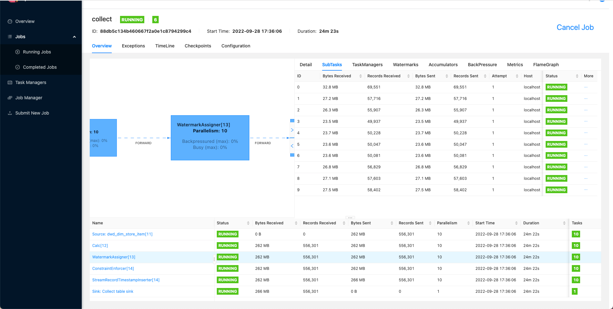

# FlinkCDC

---
[FlinkCDC 官方文档](https://ververica.github.io/flink-cdc-connectors/master/content/connectors/mysql-cdc.html#supported-databases)


## 一、下载 Flink 和相关依赖

[Download Flink1.15.2](https://dlcdn.apache.org/flink/flink-1.15.2/flink-1.15.2-bin-scala_2.11.tgz)

[Download flink-sql-connector-mysql-cdc-2.2.1.jar](https://repo1.maven.org/maven2/com/ververica/flink-sql-connector-mysql-cdc/2.2.1/flink-sql-connector-mysql-cdc-2.2.1.jar)

[Download mysql-connector-java-8.0.23.jar](https://repo1.maven.org/maven2/mysql/mysql-connector-java/8.0.23/mysql-connector-java-8.0.23.jar)

## 二、修改配置运行Flink(Standalone)

```bash
# 修改配置
$ vim $FLINK_HOME/conf/flink-conf.yaml
execution.checkpointing.interval: 10s
execution.checkpointing.externalized-checkpoint-retention: RETAIN_ON_CANCELLATION
execution.checkpointing.mode: EXACTLY_ONCE
state.checkpoints.dir: file:///Users/kino/app/flink/flink-1.15.2/checkpoints
state.savepoints.dir: file:///Users/kino/app/flink/flink-1.15.2/savepoints
jobmanager.execution.failover-strategy: region
classloader.check-leaked-classloader: false

# 启动 Flink Standalone
$ cd $FLINK_HOME
$ ./bin/start-cluster.sh
```

> Flink lib 目录如下
>
> ```bash
> total 451072
> -rw-r--r--  1 kino  staff     194418  8 18 00:27 flink-cep-1.15.2.jar
> -rw-r--r--  1 kino  staff     486023  8 18 00:29 flink-connector-files-1.15.2.jar
> -rw-r--r--  1 kino  staff      95186  8 18 00:35 flink-csv-1.15.2.jar
> -rw-r--r--  1 kino  staff  115819661  8 18 00:42 flink-dist-1.15.2.jar
> -rw-r--r--  1 kino  staff     175486  8 18 00:36 flink-json-1.15.2.jar
> -rw-r--r--  1 kino  staff   21041715  8 18 00:40 flink-scala_2.12-1.15.2.jar
> -rw-r--r--  1 kino  staff   10737871  2  8  2022 flink-shaded-zookeeper-3.5.9.jar
> -rw-r--r--  1 kino  staff   22096298  4 26 19:11 flink-sql-connector-mysql-cdc-2.2.1.jar
> -rw-r--r--  1 kino  staff   15264816  8 18 00:40 flink-table-api-java-uber-1.15.2.jar
> -rw-r--r--  1 kino  staff   36261037  8 18 00:41 flink-table-planner-loader-1.15.2.jar
> -rw-r--r--  1 kino  staff    2996564  8 18 00:27 flink-table-runtime-1.15.2.jar
> -rw-r--r--  1 kino  staff     208006  1  4  2022 log4j-1.2-api-2.17.1.jar
> -rw-r--r--  1 kino  staff     301872  1  4  2022 log4j-api-2.17.1.jar
> -rw-r--r--  1 kino  staff    1790452  1  4  2022 log4j-core-2.17.1.jar
> -rw-r--r--  1 kino  staff      24279  1  4  2022 log4j-slf4j-impl-2.17.1.jar
> -rw-r--r--@ 1 kino  staff    2428320  9 28 16:20 mysql-connector-java-8.0.25.jar
> ```

## 三、官方案例

在 MySQL 中创建`products`、`orders`表并插入数据

```sql
-- MySQL
CREATE DATABASE mydb;
USE mydb;
CREATE TABLE products (
  id INTEGER NOT NULL AUTO_INCREMENT PRIMARY KEY,
  name VARCHAR(255) NOT NULL,
  description VARCHAR(512)
);
ALTER TABLE products AUTO_INCREMENT = 101;

INSERT INTO products
VALUES (default,"scooter","Small 2-wheel scooter"),
       (default,"car battery","12V car battery"),
       (default,"12-pack drill bits","12-pack of drill bits with sizes ranging from #40 to #3"),
       (default,"hammer","12oz carpenter's hammer"),
       (default,"hammer","14oz carpenter's hammer"),
       (default,"hammer","16oz carpenter's hammer"),
       (default,"rocks","box of assorted rocks"),
       (default,"jacket","water resistent black wind breaker"),
       (default,"spare tire","24 inch spare tire");

CREATE TABLE orders (
  order_id INTEGER NOT NULL AUTO_INCREMENT PRIMARY KEY,
  order_date DATETIME NOT NULL,
  customer_name VARCHAR(255) NOT NULL,
  price DECIMAL(10, 5) NOT NULL,
  product_id INTEGER NOT NULL,
  order_status BOOLEAN NOT NULL -- Whether order has been placed
) AUTO_INCREMENT = 10001;

INSERT INTO orders
VALUES (default, '2020-07-30 10:08:22', 'Jark', 50.50, 102, false),
       (default, '2020-07-30 10:11:09', 'Sally', 15.00, 105, false),
       (default, '2020-07-30 12:00:30', 'Edward', 25.25, 106, false);
```

在 FlinkSQL Client 中执行以下命令

```sql
-- checkpoint every 3000 milliseconds                       
Flink SQL> SET 'execution.checkpointing.interval' = '3s';

-- register a MySQL table 'orders' in Flink SQL
Flink SQL> CREATE TABLE orders (
     order_id INT,
     order_date TIMESTAMP(0),
     customer_name STRING,
     price DECIMAL(10, 5),
     product_id INT,
     order_status BOOLEAN,
     PRIMARY KEY(order_id) NOT ENFORCED
     ) WITH (
     'connector' = 'mysql-cdc',
     'hostname' = 'localhost',
     'port' = '3306',
     'username' = 'root',
     'password' = '123456',
     'database-name' = 'mydb',
     'table-name' = 'orders'
     );

Flink SQL> CREATE TABLE orders_print (
     order_id INT,
     order_date TIMESTAMP(0),
     customer_name STRING,
     price DECIMAL(10, 5),
     product_id INT,
     order_status BOOLEAN,
     PRIMARY KEY(order_id) NOT ENFORCED
     ) WITH (
     'connector' = 'print'
     );

Flink SQL> INSERT INTO orders_print SELECT * FROM orders;
```

> 在 FlinkSQL CDC 中，可以设置 `scan.startup.mode`参数，改参数有两个属性:
>
> - initial: 默认的，从头开始；
> - latest-offset: 从最新的binlog开始；

> [FlinkSQL MySQL CDC可配置参数](https://ververica.github.io/flink-cdc-connectors/master/content/connectors/mysql-cdc.html#connector-options)

在 Flink WEB-UI 的 `Task Managers` 中，选择 `Stdout`可以看见输出了 `orders` 表插入的三条记录

```bash
九月 28, 2022 4:57:00 下午 com.github.shyiko.mysql.binlog.BinaryLogClient connect
信息: Connected to localhost:3306 at binlog.000004/3696 (sid:6167, cid:41)
+I[10001, 2020-07-30T10:08:22, Jark, 50.50000, 102, false]
+I[10002, 2020-07-30T10:11:09, Sally, 15.00000, 105, false]
+I[10003, 2020-07-30T12:00:30, Edward, 25.25000, 106, false]
```

在 Flink WEB-UI 中，Cancel Job 掉 Insert 的任务，然后查看任务的 Checkpoint 位置，例如我的位置是

```bash
file:/Users/kino/app/flink/flink-1.15.2/checkpoints/4a1ba1de78a32d908d3a252db7910d7a/chk-40
```

在 FlinkSQL Client 中重新运行 Insert 语句, 但是从上次的 Checkpoint 恢复

```sql
-- 设置 savepoint
SET 'execution.savepoint.path' = 'file:/Users/kino/app/flink/flink-1.15.2/checkpoints/4a1ba1de78a32d908d3a252db7910d7a/chk-40';

Flink SQL> INSERT INTO orders_print SELECT * FROM orders;
```

再次在 Flink WEB-UI 的 `Task Managers` 中，选择 `Stdout`可以看见，并没有重头读取 `orders`表。


为 `orders`表再次写入记录

```sql
INSERT INTO orders
VALUES (default, '2020-07-30 12:08:22', 'Kino', 23.10, 102, false),
       (default, '2020-07-30 12:11:09', 'Jerry', 49.00, 105, false),
```

可以看见又有两条记录输出了

```bash
+I[10004, 2020-07-30T12:08:22, Kino, 23.10000, 102, false]
+I[10005, 2020-07-30T12:11:09, Jerry, 49.00000, 105, false]
```

## 四、增量快照读取

增量快照优点:

1. MySQL CDC Source 在快照读取时，可以并行；
2. MySQL CDC Source 在快照读取时，可以在 chunk 粒度上进行检查点；
3. MySQL CDC Source 在快照读取前不需要获取全局读锁。

如果希望并行读取，每个 Slot 都应该有一个唯一的ID，因此该 ID 必须是一个类似于 `[5400-6400]`的范围，并且该范围必须大于并行度。


在增量快照读取过程中，MySQL CDC Source 首先通过表的主键拆分 `snapshot chunks(splits)`, 然后 MySQL CDC Source 将 chunk 分配给多个 reader 读取 `snapshot chunk` 的数据。


在 FlinkSQL Client 中设置并行度

```sql
Flink SQL> SET 'parallelism.default' = '10';
Flink SQL> 
```

选择一张大表同步(我拿了一张60w记录的表做示例)，效果如下




[FlinkCDC 官方文档](https://ververica.github.io/flink-cdc-connectors/master/content/connectors/mysql-cdc.html#how-incremental-snapshot-reading-works)


