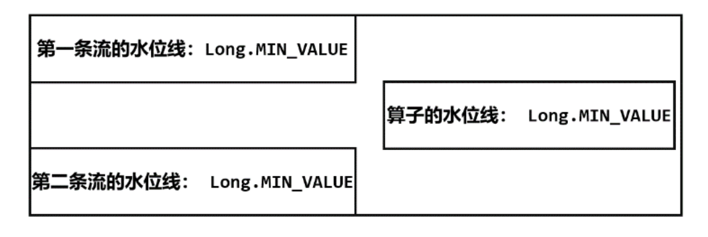
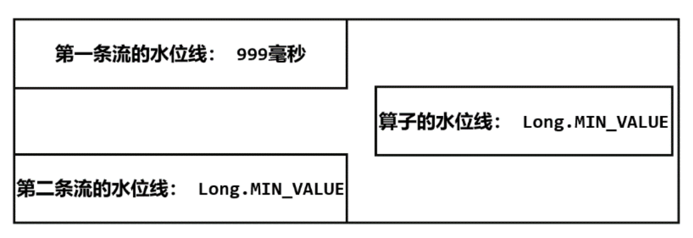
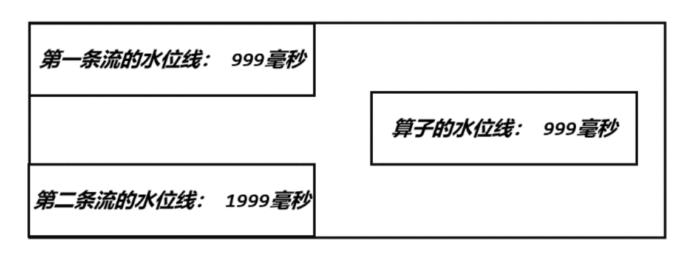
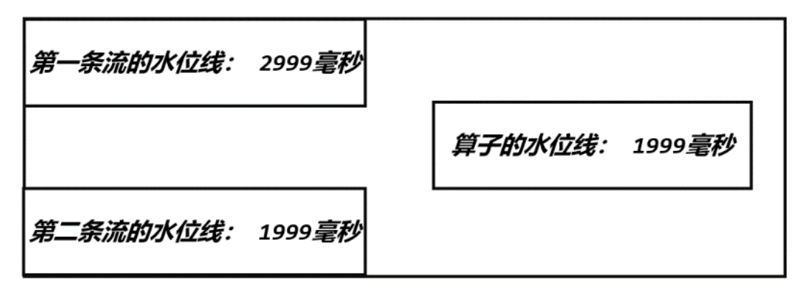

---
# 一、分流
将一条数据流拆分成两条完全独立的流
```java
import com.kino.stream.ClickSource;
import com.kino.stream.Event;
import org.apache.flink.api.common.functions.FilterFunction;
import org.apache.flink.streaming.api.datastream.DataStream;
import org.apache.flink.streaming.api.datastream.SingleOutputStreamOperator;
import org.apache.flink.streaming.api.environment.StreamExecutionEnvironment;

public class SplitStreamByFilter {
    public static void main(String[] args) throws Exception {
        StreamExecutionEnvironment env = StreamExecutionEnvironment.getExecutionEnvironment();
        env.setParallelism(1);
        
        SingleOutputStreamOperator<Event> stream = env.addSource(new ClickSource());
        // 筛选Mary的浏览行为放入MaryStream流中
        DataStream<Event> MaryStream = stream.filter(new FilterFunction<Event>() {
            @Override
            public boolean filter(Event value) throws Exception {
                return value.user.equals("Mary");
            }
        });
        // 筛选Bob的购买行为放入BobStream流中
        DataStream<Event> BobStream = stream.filter(new FilterFunction<Event>() {
            @Override
            public boolean filter(Event value) throws Exception {
                return value.user.equals("Bob");
            }
        });
        // 筛选其他人的浏览行为放入elseStream流中
        DataStream<Event> elseStream = stream.filter(new FilterFunction<Event>() {
            @Override
            public boolean filter(Event value) throws Exception {
                return !value.user.equals("Mary") && !value.user.equals("Bob") ;
            }
        });

        MaryStream.print("Mary pv");
        BobStream.print("Bob pv");
        elseStream.print("else pv");

        env.execute();

    }
}
```
使用测输出流分流
```java

import com.kino.stream.ClickSource;
import com.kino.stream.Event;
import org.apache.flink.api.java.tuple.Tuple3;
import org.apache.flink.streaming.api.datastream.SingleOutputStreamOperator;
import org.apache.flink.streaming.api.environment.StreamExecutionEnvironment;
import org.apache.flink.streaming.api.functions.ProcessFunction;
import org.apache.flink.util.Collector;
import org.apache.flink.util.OutputTag;


public class SplitStreamByOutputTag {
    // 定义输出标签，侧输出流的数据类型为三元组(user, url, timestamp)
    private static OutputTag<Tuple3<String, String, Long>> MaryTag = new OutputTag<Tuple3<String, String, Long>>("Mary-pv"){};
    private static OutputTag<Tuple3<String, String, Long>> BobTag = new OutputTag<Tuple3<String, String, Long>>("Bob-pv"){};
    public static void main(String[] args) throws Exception {
        StreamExecutionEnvironment env = StreamExecutionEnvironment.getExecutionEnvironment();
        env.setParallelism(1);
        SingleOutputStreamOperator<Event> stream = env
                .addSource(new ClickSource());

        SingleOutputStreamOperator<Event> processedStream = stream.process(new ProcessFunction<Event, Event>() {
            @Override
            public void processElement(Event value, Context ctx, Collector<Event> out) throws Exception {
                if (value.user.equals("Mary")){
                    ctx.output(MaryTag, new Tuple3<>(value.user, value.url, value.timestamp));
                } else if (value.user.equals("Bob")){
                    ctx.output(BobTag, new Tuple3<>(value.user, value.url, value.timestamp));
                } else {
                    out.collect(value);
                }
            }
        });

        processedStream.getSideOutput(MaryTag).print("Mary pv");
        processedStream.getSideOutput(BobTag).print("Bob pv");
        processedStream.print("else");

        env.execute();
    }
}
```

# 二、合流
## 2.1 union
将多个流合并到一起，要求两条流中的数据类型完全相同。
```java
import com.kino.stream.Event;
import org.apache.flink.api.common.eventtime.SerializableTimestampAssigner;
import org.apache.flink.api.common.eventtime.WatermarkStrategy;
import org.apache.flink.streaming.api.datastream.SingleOutputStreamOperator;
import org.apache.flink.streaming.api.environment.StreamExecutionEnvironment;
import org.apache.flink.streaming.api.functions.ProcessFunction;
import org.apache.flink.util.Collector;

import java.time.Duration;

public class UnionTest {
    public static void main(String[] args) throws Exception {
        StreamExecutionEnvironment env = StreamExecutionEnvironment.getExecutionEnvironment();
        env.setParallelism(1);

        SingleOutputStreamOperator<Event> stream1 = env.socketTextStream("hadoop102", 7777)
                .map(data -> {
                    String[] field = data.split(",");
                    return new Event(field[0].trim(), field[1].trim(), Long.valueOf(field[2].trim()));
                })
                .assignTimestampsAndWatermarks(WatermarkStrategy.<Event>forBoundedOutOfOrderness(Duration.ofSeconds(2))
                        .withTimestampAssigner(new SerializableTimestampAssigner<Event>() {
                            @Override
                            public long extractTimestamp(Event element, long recordTimestamp) {
                                return element.timestamp;
                            }
                        })
                );
        stream1.print("stream1");

        SingleOutputStreamOperator<Event> stream2 = env.socketTextStream("hadoop103", 7777)
                .map(data -> {
                    String[] field = data.split(",");
                    return new Event(field[0].trim(), field[1].trim(), Long.valueOf(field[2].trim()));
                })
                .assignTimestampsAndWatermarks(WatermarkStrategy.<Event>forBoundedOutOfOrderness(Duration.ofSeconds(5))
                        .withTimestampAssigner(new SerializableTimestampAssigner<Event>() {
                            @Override
                            public long extractTimestamp(Event element, long recordTimestamp) {
                                return element.timestamp;
                            }
                        })
                );

        stream2.print("stream2");

        // 合并两条流
        stream1.union(stream2)
                .process(new ProcessFunction<Event, String>() {
                    @Override
                    public void processElement(Event value, Context ctx, Collector<String> out) throws Exception {
                        out.collect("水位线：" + ctx.timerService().currentWatermark());
                    }
                })
                .print();
        env.execute();
    }
}
```
在 union 之后的 ProcessFunction 任务中，逻辑适中的初始状态如图



由于 Flink 会在流的开始处, 插入一个负无穷大（Long.MIN_VALUE） 的水位线，所以 union 后 的 ProcessFunction 对应的任务，会为合并的每条流保存一个 "分区水位线", 初始值都是 Long.MIN_VALUE; 而此时算子任务的水位线是所有分区水位线的最小值，因此也是 Long.MIN_VALUE。

在第一个 socket 输入 [Alice, ./home, 1000] 时，水位线不会立即改变，只有水位线生成周期的时间点(200ms一次)才会推进到 1000-1=999毫秒；不过即使第一条水位线推进到了 999，由于另一条流没有变化，所以 union 之后， Process 任务水位线仍然是初始值



在第二个 socket 输入 [Alice, ./home, 2000]，第二条流的水位线会推进到 2000-1=1999毫秒，Process 任务所保存的第二条流分区水位线更新为: 1999, 这样两个分区水位线取最小值，Process 任务的水位线也就可以推进到 999 了



如果继续在第一个 socket 中输入 [Alice, ./home, 3000]， Process 任务的第一条流分区数危险会更新为 2999，同时将算子任务的适中推进到 1999




## 2.2 connect
### 2.2.1 connected streams
union 虽然简单，但是受限于数据类型不能改变，而 connect 可以 连接数据类型不相同的流。
```java
import org.apache.flink.streaming.api.datastream.ConnectedStreams;
import org.apache.flink.streaming.api.datastream.DataStream;
import org.apache.flink.streaming.api.datastream.SingleOutputStreamOperator;
import org.apache.flink.streaming.api.environment.StreamExecutionEnvironment;
import org.apache.flink.streaming.api.functions.co.CoMapFunction;

public class ConnectTest {
    public static void main(String[] args) throws Exception {
        StreamExecutionEnvironment env = StreamExecutionEnvironment.getExecutionEnvironment();
        env.setParallelism(1);

        DataStream<Integer> stream1 = env.fromElements(1,2,3);
        DataStream<Long> stream2 = env.fromElements(1L,2L,3L);

        ConnectedStreams<Integer, Long> connectedStreams = stream1.connect(stream2);
        SingleOutputStreamOperator<String> result = connectedStreams.map(new CoMapFunction<Integer, Long, String>() {
            @Override
            public String map1(Integer value) {
                return "Integer: " + value;
            }

            @Override
            public String map2(Long value) {
                return "Long: " + value;
            }
        });

        result.print();

        env.execute();
    }
}
```

### 2.2.2 CoProcessFunction
```java
import org.apache.flink.api.common.eventtime.SerializableTimestampAssigner;
import org.apache.flink.api.common.eventtime.WatermarkStrategy;
import org.apache.flink.api.common.state.ValueState;
import org.apache.flink.api.common.state.ValueStateDescriptor;
import org.apache.flink.api.common.typeinfo.Types;
import org.apache.flink.api.java.tuple.Tuple3;
import org.apache.flink.api.java.tuple.Tuple4;
import org.apache.flink.configuration.Configuration;
import org.apache.flink.streaming.api.datastream.SingleOutputStreamOperator;
import org.apache.flink.streaming.api.environment.StreamExecutionEnvironment;
import org.apache.flink.streaming.api.functions.co.CoProcessFunction;
import org.apache.flink.util.Collector;

// 实时对账
public class BillCheckExample {

    public static void main(String[] args) throws Exception{
        StreamExecutionEnvironment env = StreamExecutionEnvironment.getExecutionEnvironment();
        env.setParallelism(1);

        // 来自app的支付日志
        SingleOutputStreamOperator<Tuple3<String, String, Long>> appStream = env.fromElements(
                Tuple3.of("order-1", "app", 1000L),
                Tuple3.of("order-2", "app", 2000L)
        ).assignTimestampsAndWatermarks(WatermarkStrategy.<Tuple3<String, String, Long>>forMonotonousTimestamps()
                .withTimestampAssigner(new SerializableTimestampAssigner<Tuple3<String, String, Long>>() {
                    @Override
                    public long extractTimestamp(Tuple3<String, String, Long> element, long recordTimestamp) {
                        return element.f2;
                    }
                })
        );

        // 来自第三方支付平台的支付日志
        SingleOutputStreamOperator<Tuple4<String, String, String, Long>> thirdpartStream = env.fromElements(
                Tuple4.of("order-1", "third-party", "success", 3000L),
                Tuple4.of("order-3", "third-party", "success", 4000L)
        ).assignTimestampsAndWatermarks(WatermarkStrategy.<Tuple4<String, String, String, Long>>forMonotonousTimestamps()
                .withTimestampAssigner(new SerializableTimestampAssigner<Tuple4<String, String, String, Long>>() {
                    @Override
                    public long extractTimestamp(Tuple4<String, String, String, Long> element, long recordTimestamp) {
                        return element.f3;
                    }
                })
        );

        // 检测同一支付单在两条流中是否匹配，不匹配就报警
        appStream.connect(thirdpartStream)
                .keyBy(data -> data.f0, data -> data.f0)
                .process(new OrderMatchResult())
                .print();

        env.execute();
    }

    // 自定义实现CoProcessFunction
    public static class OrderMatchResult extends CoProcessFunction<Tuple3<String, String, Long>, Tuple4<String, String, String, Long>, String>{
        // 定义状态变量，用来保存已经到达的事件
        private ValueState<Tuple3<String, String, Long>> appEventState;
        private ValueState<Tuple4<String, String, String, Long>> thirdPartyEventState;

        @Override
        public void open(Configuration parameters) throws Exception {
            appEventState = getRuntimeContext().getState(
                    new ValueStateDescriptor<Tuple3<String, String, Long>>("app-event", Types.TUPLE(Types.STRING, Types.STRING, Types.LONG))
            );

            thirdPartyEventState = getRuntimeContext().getState(
                    new ValueStateDescriptor<Tuple4<String, String, String, Long>>("thirdparty-event", Types.TUPLE(Types.STRING, Types.STRING, Types.STRING,Types.LONG))
            );
        }

        @Override
        public void processElement1(Tuple3<String, String, Long> value, Context ctx, Collector<String> out) throws Exception {
            // 看另一条流中事件是否来过
            if (thirdPartyEventState.value() != null){
                out.collect("对账成功：" + value + "  " + thirdPartyEventState.value());
                // 清空状态
                thirdPartyEventState.clear();
            } else {
                // 更新状态
                appEventState.update(value);
                // 注册一个5秒后的定时器，开始等待另一条流的事件
                ctx.timerService().registerEventTimeTimer(value.f2 + 5000L);
            }
        }

        @Override
        public void processElement2(Tuple4<String, String, String, Long> value, Context ctx, Collector<String> out) throws Exception {
            if (appEventState.value() != null){
                out.collect("对账成功：" + appEventState.value() + "  " + value);
                // 清空状态
                appEventState.clear();
            } else {
                // 更新状态
                thirdPartyEventState.update(value);
                // 注册一个5秒后的定时器，开始等待另一条流的事件
                ctx.timerService().registerEventTimeTimer(value.f3 + 5000L);
            }
        }

        @Override
        public void onTimer(long timestamp, OnTimerContext ctx, Collector<String> out) throws Exception {
            // 定时器触发，判断状态，如果某个状态不为空，说明另一条流中事件没来
            if (appEventState.value() != null) {
                out.collect("对账失败：" + appEventState.value() + "  " + "第三方支付平台信息未到");
            }
            if (thirdPartyEventState.value() != null) {
                out.collect("对账失败：" + thirdPartyEventState.value() + "  " + "app信息未到");
            }
            appEventState.clear();
            thirdPartyEventState.clear();
        }
    }
}
```


# 三、基于时间的合流-双流join
## 3.1 Window Join
按照 用户ID 进行分组再合并，分析他们之间的关联
```java
import org.apache.flink.api.common.eventtime.SerializableTimestampAssigner;
import org.apache.flink.api.common.eventtime.WatermarkStrategy;
import org.apache.flink.api.common.functions.JoinFunction;
import org.apache.flink.api.java.tuple.Tuple2;
import org.apache.flink.streaming.api.datastream.DataStream;
import org.apache.flink.streaming.api.environment.StreamExecutionEnvironment;
import org.apache.flink.streaming.api.windowing.assigners.TumblingEventTimeWindows;
import org.apache.flink.streaming.api.windowing.time.Time;

// 基于窗口的join
public class WindowJoinTest {
    public static void main(String[] args) throws Exception {
        StreamExecutionEnvironment env = StreamExecutionEnvironment.getExecutionEnvironment();
        env.setParallelism(1);

        DataStream<Tuple2<String, Long>> stream1 = env
                .fromElements(
                        Tuple2.of("a", 1000L),
                        Tuple2.of("b", 1000L),
                        Tuple2.of("a", 2000L),
                        Tuple2.of("b", 2000L)
                )
                .assignTimestampsAndWatermarks(
                        WatermarkStrategy
                                .<Tuple2<String, Long>>forMonotonousTimestamps()
                                .withTimestampAssigner(
                                        new SerializableTimestampAssigner<Tuple2<String, Long>>() {
                                            @Override
                                            public long extractTimestamp(Tuple2<String, Long> stringLongTuple2, long l) {
                                                return stringLongTuple2.f1;
                                            }
                                        }
                                )
                );

        DataStream<Tuple2<String, Long>> stream2 = env
                .fromElements(
                        Tuple2.of("a", 3000L),
                        Tuple2.of("b", 3000L),
                        Tuple2.of("a", 4000L),
                        Tuple2.of("b", 4000L)
                )
                .assignTimestampsAndWatermarks(
                        WatermarkStrategy
                                .<Tuple2<String, Long>>forMonotonousTimestamps()
                                .withTimestampAssigner(
                                        new SerializableTimestampAssigner<Tuple2<String, Long>>() {
                                            @Override
                                            public long extractTimestamp(Tuple2<String, Long> stringLongTuple2, long l) {
                                                return stringLongTuple2.f1;
                                            }
                                        }
                                )
                );

        stream1
                .join(stream2)
                .where(r -> r.f0)
                .equalTo(r -> r.f0)
                .window(TumblingEventTimeWindows.of(Time.seconds(5)))
                .apply(new JoinFunction<Tuple2<String, Long>, Tuple2<String, Long>, String>() {
                    @Override
                    public String join(Tuple2<String, Long> left, Tuple2<String, Long> right) throws Exception {
                        return left + "=>" + right;
                    }
                })
                .print();

        env.execute();
    }
}
```

## 3.2 Interval Join


