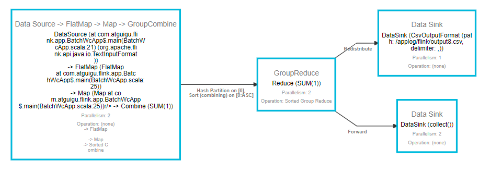
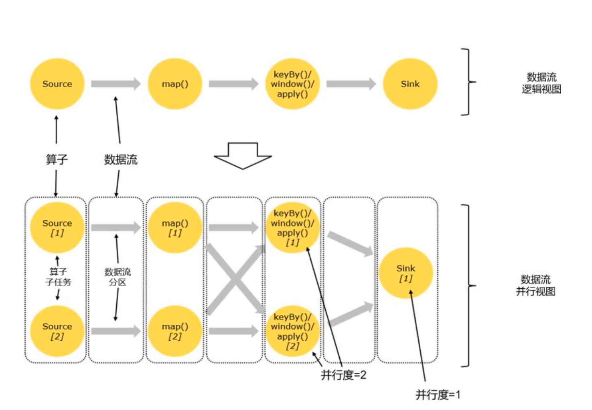
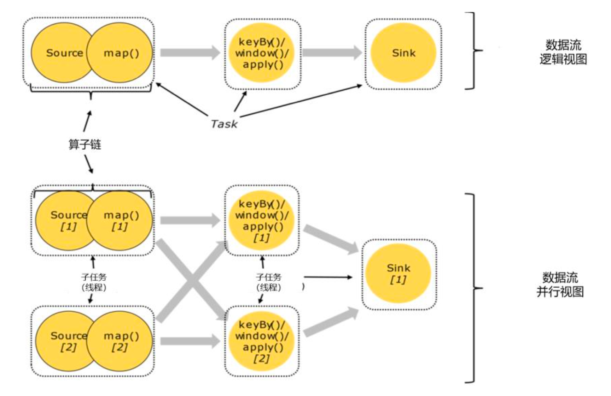
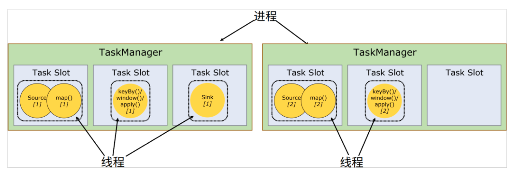
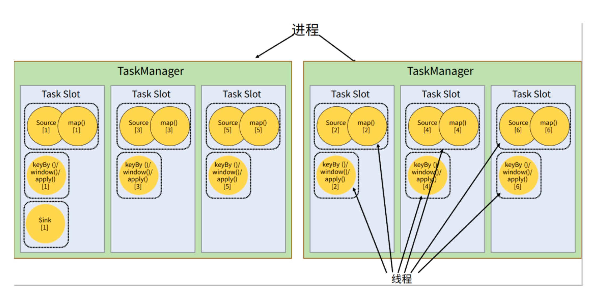
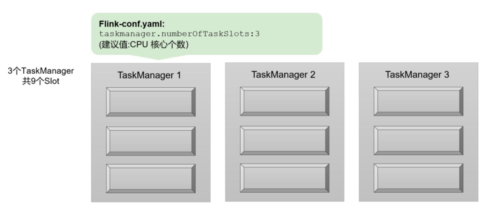
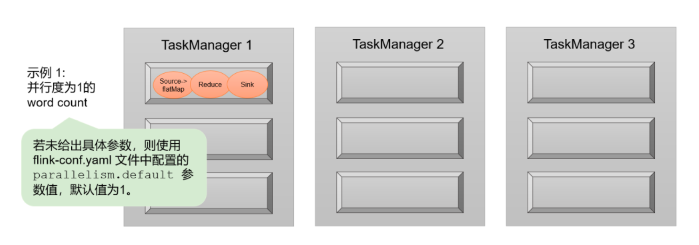
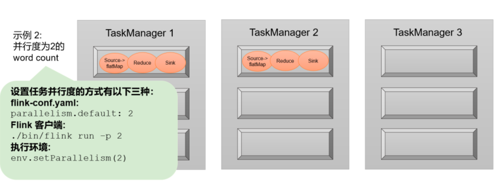
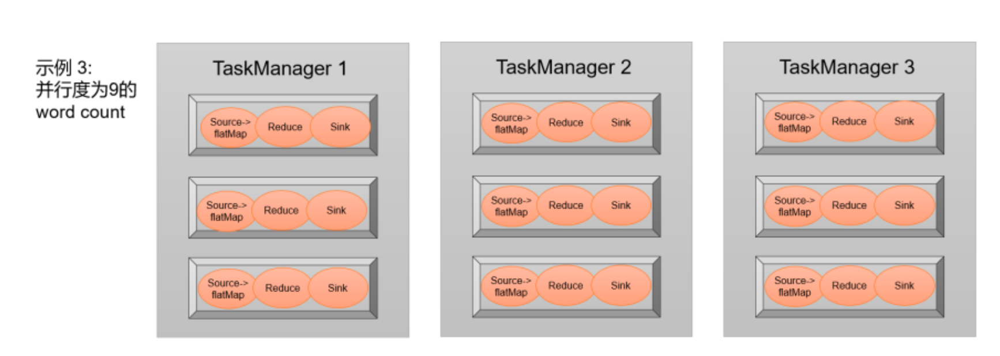
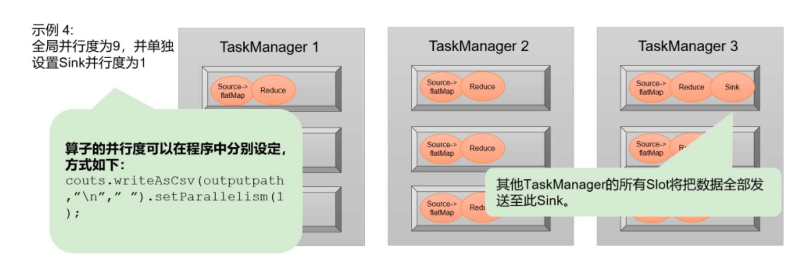

---


# 一、问题
1. 一个具体的作业，是怎样从代码，转换成 TaskManager 可以执行的任务的？ 
2. JobManager 收到提交的作业，又是怎样确定总共有多少任务、需要多少资源？

# 二、数据流图(Dataflow Graph)

Flink 是流式计算框架。

它的程序结构，其实就是定义了一连串的处理操作，每一个数据输入之后都会依次调用每一步计算。

在 Flink 代码中，我们定义的每一个处理转换操作都叫作 "算子"（Operator），所以我们的程序可以看作是一串算子构成的管道，数据则像水流一样有序地流过。比如在 WordCount 代码中，基于执行环境调用的 socketTextStream()方法，就是一个读取文本流的算子；而后面的 flatMap()方法，则是将字符串数据进行分词、转换成二元组的算子。


所有的 Flink 程序都可以归纳为由三部分构成: Source、Transformation 和 Sink。
- Source 表示 "源算子"，负责读取数据源。
- Transformation 表示 "转换算子"，利用各种算子进行处理加工。
- Sink 表示 "下沉算子"，负责数据的输出。



在运行时， Flink 程序会被映射成所有算子按照逻辑顺序连接在一起的一张图，这被称为 "逻辑数据流"（logical dataflow），或者叫 "数据流图"（dataflow graph）。

我们提交作业之后，打开 Flink 自带的 Web UI，点击作业就能看到对应的 dataflow，如上图。 在数据流图中，可以清楚地看到 Source、 Transformation、 Sink 三部分。

数据流图类似于任意的有向无环图（DAG），这一点与 Spark 等其他框架是一致的。图中的每一条数据流（dataflow）以一个或多个 source 算子开始，以一个或多个 sink 算子结束。


在大部分情况下， dataflow 中的算子，和程序中的转换运算是一一对应的关系。而 keyBy 它就只是一个数据分区操作，而并不是一个算子，这个时候就不是一一对应关系了。

# 三、并行度(Parallelism)
flink 不同于 spark，在 spark 中，需要将作业转化成 DAG 划分 stage，进而分配任务；在 流式计算框架flink 中，因为数据连续不断到来的， 所以没有必要像 spark 那样划分 stage，可以按照数据流创建一个 "流水线", 前一个操作处理完，就发往处理下一步操作的节点，所以，这也是 flink 中的一种并行度(任务并行)。

所以相对于上述的“任务并行”，我们真正关心的，是“数据并行”。也就是说，多条数据同时到来，我们应该可以同时读入，同时在不同节点执行 flatMap 操作。

我们把一个算子操作，“复制”多份到多个节点，数据来了之后就可以到其中任意一个执行。这样一来，一个算子任务就被拆分成了多个并行的“子任务”（subtasks），再将它们分发到不同节点，就真正实现了并行计算。

在 Flink 执行过程中，每一个算子（operator）可以包含一个或多个子任务（operator subtask），这些子任务在不同的线程、不同的物理机或不同的容器中完全独立地执行。



一个特定算子的子任务（subtask）的个数被称之为其并行度（parallelism）。这样，包含并行子任务的数据流，就是并行数据流，它需要多个分区（stream partition）来分配并行任务。

一般情况下，一个流程序的并行度，可以认为就是其所有算子中最大的并行度。一个程序中，不同的算子可能具有不同的并行度。

在上图中，当前数据流中有 source、 map、 window、 sink 四个算子，除最后 sink，其他算子的并行度都为 2。整个程序包含了 7 个子任务，至少需要 2 个分区来并行执行。我们可以说，这段流处理程序的并行度就是 2。

# 四、并行度的设置
没有配置文件，默认并行度就是当前机器的 CPU 核心数。

## 4.1 代码中设置
```java
// 对当前算子有效
stream.map(word -> Tuple2.of(word, 1L)).setParallelism(2);

// 全局并行度
env.setParallelism(2);
```
## 4.2 提交应用时设置
在使用 flink run 命令提交应用时，可以增加-p 参数来指定当前应用程序执行的并行度，它的作用类似于执行环境的全局设置
```shell
bin/flink run –p 2 –c com.kino.wc.StreamWordCount ./FlinkTutorial-1.0-SNAPSHOT.jar
```
## 4.3 配置文件中设置
```bash
vim flink-conf.yaml
parallelism.default: 2
```

# 五、并行度优先级
1. 对于一个算子，首先看在代码中是否单独指定了它的并行度，这个特定的设置优先级最高，会覆盖后面所有的设置。
2. 如果没有单独设置，那么采用当前代码中执行环境全局设置的并行度。
3. 如果代码中完全没有设置，那么采用提交时-p 参数指定的并行度。
4. 如果提交时也未指定-p 参数，那么采用集群配置文件中的默认并行度


# 六、算子链（Operator Chain）
## 6.1 算子间的数据传输


一个数据流在算子之间传输数据的形式可以是一对一（one-to-one）的直通 (forwarding)模式，也可以是打乱的重分区（redistributing）模式，具体是哪一种形式，取决于算子的种类。

### 6.1.1 一对一（One-to-one， forwarding）
**这种关系类似于 Spark 中的窄依赖。**

这种模式下，数据流维护着分区以及元素的顺序。

比如图中的 source 和 map 算子， source算子读取数据之后，可以直接发送给 map 算子做处理，它们之间不需要重新分区，也不需要调整数据的顺序。 这就意味着 map 算子的子任务，看到的元素个数和顺序跟 source 算子的子任务产生的完全一样，保证着“一对一”的关系。 map、 filter、 flatMap 等算子都是这种 one-to-one的对应关系。

### 6.1.2 重分区（Redistributing）
**这种算子间的关系类似于 Spark 中的宽依赖。**

在这种模式下，数据流的分区会发生改变。比图中的 map 和后面的 keyBy/window 算子之间（这里的 keyBy 是数据传输算子，后面的 window、 apply 方法共同构成了 window 算子） ,以及 keyBy/window 算子和 Sink 算子之间，都是这样的关系。

每一个算子的子任务，会根据数据传输的策略，把数据发送到不同的下游目标任务。例如，keyBy()是分组操作，本质上基于键（key）的哈希值（hashCode）进行了重分区；而当并行度改变时，比如从并行度为 2 的 window 算子，要传递到并行度为 1 的 Sink 算子，这时的数据传输方式是再平衡（rebalance），会把数据均匀地向下游子任务分发出去。这些传输方式都会引起重分区（redistribute）的过程，这一过程类似于 Spark 中的 shuffle。

## 6.2 合并算子链
在 Flink 中，并行度相同的一对一（one to one）算子操作，可以直接链接在一起形成一个 “大”的任务（task），这样原来的算子就成为了真正任务里的一部分，如图所示。每个 task 会被一个线程执行。这样的技术被称为 “算子链”（Operator Chain）。



比如在图 4-11 中的例子中， Source 和 map 之间满足了算子链的要求，所以可以直接合并在一起，形成了一个任务；因为并行度为 2，所以合并后的任务也有两个并行子任务。这样，这个数据流图所表示的作业最终会有 5 个任务，由 5 个线程并行执行。

Flink 为什么要有算子链这样一个设计呢？这是因为将算子链接成 task 是非常有效的优化：可以减少线程之间的切换和基于缓存区的数据交换，在减少时延的同时提升吞吐量。

Flink 默认会按照算子链的原则进行链接合并，如果我们想要禁止合并或者自行定义，也可以在代码中对算子做一些特定的设置：

```java
// 禁用算子链
.map(word -> Tuple2.of(word, 1L)).disableChaining();
// 从当前算子开始新链
.map(word -> Tuple2.of(word, 1L)).startNewChain()
```

# 七、任务（Tasks）和任务槽（Task Slots）

从上面我们最终得到结论：作业划分为 5 个并行子任务，需要 5 个线程并行执行。那在我们将应用提交到 Flink集群之后，到底需要占用多少资源呢？是否需要 5 个 TaskManager 来运行呢？

## 7.1 任务槽（Task Slots）
Flink 中每一个 worker(也就是 TaskManager)都是一个 JVM 进程，它可以启动多个独立的线程，来并行执行多个子任务（subtask）

所以如果想要执行 5 个任务，并不一定非要 5 个 TaskManager，我们可以让 TaskManager多线程执行任务。如果可以同时运行 5 个线程，那么只要一个 TaskManager 就可以满足我们之前程序的运行需求了。

很显然， TaskManager 的计算资源是有限的，并不是所有任务都可以放在一个 TaskManager上并行执行。并行的任务越多，每个线程的资源就会越少。

那一个 TaskManager 到底能并行处理多少个任务呢？为了控制并发量，我们需要在 TaskManager 上对每个任务运行所占用的资源做出明确的划分，这就是所谓的任务槽（task slots）。

每个任务槽（task slot）其实表示了 TaskManager 拥有计算资源的一个固定大小的子集。这些资源就是用来独立执行一个子任务的。



假如一个 TaskManager 有三个 slot，那么它会将管理的内存平均分成三份，每个 slot 独自占据一份。这样一来，我们在 slot 上执行一个子任务时，相当于划定了一块内存“专款专用”，就不需要跟来自其他作业的任务去竞争内存资源了。所以现在我们只要 2 个 TaskManager，就
可以并行处理分配好的 5 个任务了, 如上图

## 7.2 任务槽数量的设置
```bash
taskmanager.numberOfTaskSlots: 8
```

通过调整 slot 的数量，我们就可以控制子任务之间的隔离级别。

具体来说，如果一个 TaskManager 只有一个 slot，那将意味着每个任务都会运行在独立的JVM 中（当然，该 JVM 可能是通过一个特定的容器启动的）；而一个 TaskManager 设置多个slot 则意味着多个子任务可以共享同一个 JVM。它们的区别在于：前者任务之间完全独立运行，隔离级别更高、彼此间的影响可以降到最小；而后者在同一个 JVM 进程中运行的任务，将共享 TCP 连接和心跳消息，也可能共享数据集和数据结构，这就减少了每个任务的运行开销，在降低隔离级别的同时提升了性能。

需要注意的是， slot 目前仅仅用来隔离内存，不会涉及 CPU 的隔离。在具体应用时，可以将 slot 数量配置为机器的 CPU 核心数，尽量避免不同任务之间对 CPU 的竞争。 这也是开发环境默认并行度设为机器 CPU 数量的原因。

## 7.3 任务对任务槽的共享
这样看来，一共有多少任务，我们就需要有多少 slot 来并行处理它们。不过实际提交作业进行测试就会发现，我们之前的 WordCount 程序设置并行度为 2 提交，一共有 5 个并行子任务，可集群即使只有 2 个 task slot 也是可以成功提交并运行的。这又是为什么呢？

我们可以基于之前的例子继续扩展。如果我们保持 sink 任务并行度为 1 不变，而作业提交时设置全局并行度为 6，那么前两个任务节点就会各自有 6 个并行子任务，整个流处理程序则有 13 个子任务。那对于 2 个 TaskManager、每个有 3 个 slot 的集群配置来说，还能否正常运行呢？



完全没有问题。这是因为默认情况下， Flink 是允许子任务共享 slot 的。如图所示，只要属于同一个作业，那么对于不同任务节点的并行子任务，就可以放到同一个 slot 上执行。

所以对于第一个任务节点 source→map，它的 6 个并行子任务必须分到不同的 slot 上（如果在同一 slot 就没法数据并行了），而第二个任务节点 keyBy/window/apply 的并行子任务却可以和第一个任务节点共享 slot。

于是最终结果就变成了：每个任务节点的并行子任务一字排开，占据不同的 slot；而不同的任务节点的子任务可以共享 slot。一个 slot 中，可以将程序处理的所有任务都放在这里执行，我们把它叫作保存了整个作业的运行管道（pipeline）。

这个特性看起来有点奇怪：我们不是希望并行处理、任务之间相互隔离吗，为什么这里又允许共享 slot 呢？

我们知道，一个 slot 对应了一组独立的计算资源。在之前不做共享的时候，每个任务都平等地占据了一个 slot，但其实不同的任务对资源的占用是不同的。例如这里的前两个任务，source/map 尽管是两个算子合并算子链得到的，但它只是基本的数据读取和简单转换，计算耗时极短，一般也不需要太大的内存空间；而 window 算子所做的窗口操作，往往会涉及大量的数据、状态存储和计算，我们一般把这类任务叫作“资源密集型”（ intensive）任务。当它们被平等地分配到独立的 slot 上时，实际运行我们就会发现，大量数据到来时 source/map 和 sink任务很快就可以完成，但 window 任务却耗时很久；于是下游的 sink 任务占据的 slot 就会等待闲置，而上游的 source/map 任务受限于下游的处理能力，也会在快速处理完一部分数据后阻塞对应的资源开始等待（相当于处理背压）。这样资源的利用就出现了极大的不平衡，“忙的忙死，闲的闲死”

解决这一问题的思路就是允许 slot 共享。当我们将资源密集型和非密集型的任务同时放到一个 slot 中，它们就可以自行分配对资源占用的比例，从而保证最重的活平均分配给所有的TaskManager。

slot 共享另一个好处就是允许我们保存完整的作业管道。这样一来，即使某个 TaskManager出现故障宕机，其他节点也可以完全不受影响，作业的任务可以继续执行。

另外，同一个任务节点的并行子任务是不能共享 slot 的，所以允许 slot 共享之后， 运行作业所需的 slot 数量正好就是作业中所有算子并行度的最大值。这样一来，我们考虑当前集群需要配置多少 slot 资源时，就不需要再去详细计算一个作业总共包含多少个并行子任务了，只看最大的并行度就够了。

当然， Flink 默认是允许 slot 共享的，如果希望某个算子对应的任务完全独占一个 slot，或者只有某一部分算子共享 slot，我们也可以通过设置“slot 共享组”（SlotSharingGroup）手动指定.
```java
.map(word -> Tuple2.of(word, 1L)).slotSharingGroup("1");
```

这样，只有属于同一个 slot 共享组的子任务，才会开启 slot 共享；不同组之间的任务是完全隔离的，必须分配到不同的 slot 上。在这种场景下，总共需要的 slot 数量，就是各个 slot 共享组最大并行度的总和。

## 7.4 任务槽和并行度的关系

直观上看， slot 就是 TaskManager 为了并行执行任务而设置的，那它和之前讲过的并行度（Parallelism）是不是一回事呢？

Slot 和并行度确实都跟程序的并行执行有关，但两者是完全不同的概念。简单来说， taskslot 是 静 态 的 概 念 ， 是 指 TaskManager 具 有 的 并 发 执 行 能 力 ， 可 以 通 过 参 数 `taskmanager.numberOfTaskSlots` 进行配置；而并行度（ parallelism）是动态概念，也就是 TaskManager 运行程序时实际使用的并发能力，可以通过参数 parallelism.default 进行配置。

换句话说，并行度如果小于等于集群中可用 slot 的总数，程序是可以正常执行的，因为 slot 不一定要全部占用，有十分力气可以只用八分；而如果并行度大于可用 slot 总数，导致超出了并行能力上限，那么心有余力不足，程序就只好等待资源管理器分配更多的资源了。

下面我们再举一个具体的例子。假设一共有 3 个 TaskManager，每一个 TaskManager 中的slot 数量设置为 3 个，那么一共有 9 个 task slot， 如图所示， 表示集群最多能并行执行 9个任务。

而我们定义 WordCount 程序的处理操作是四个转换算子：source→ flatMap→ reduce→ sink

当所有算子并行度相同时，容易看出 source 和 flatMap 可以合并算子链，于是最终有三个任务节点。

如果我们没有任何并行度设置，而配置文件中默认 parallelism.default=1，那么程序运行的默认并行度为 1，总共有 3 个任务。 由于不同算子的任务可以共享任务槽，所以最终占用的 slot只有 1 个。 9 个 slot 只用了 1 个，有 8 个空闲，如图2 所示。











如果我们更改默认参数，或者提交作业时设置并行度为 2，那么总共有 6 个任务，共享任务槽之后会占用 2 个 slot，如图3 所示。同样，就有 7 个 slot 空闲，计算资源没有充分利用。所以可以看到，设置合适的并行度才能提高效率。

那对于这个例子，怎样设置并行度效率最高呢？当然是需要把所有的 slot 都利用起来。考虑到 slot 共享，我们可以直接把并行度设置为 9，这样所有 27 个任务就会完全占用 9 个 slot。

这是当前集群资源下能执行的最大并行度，计算资源得到了充分的利用，如图4 中所示。

另外再考虑对于某个算子单独设置并行度的场景。例如，如果我们考虑到输出可能是写入文件，那会希望不要并行写入多个文件，就需要设置 sink 算子的并行度为 1。这时其他的算子并行度依然为 9，所以总共会有 19 个子任务。根据 slot 共享的原则，它们最终还是会占用全部的 9 个 slot，而 sink 任务只在其中一个 slot 上执行，如图5 所示。通过这个例子也可以明确地看到，整个流处理程序的并行度，就应该是所有算子并行度中最大的那个，这代表了运行程序需要的 slot 数量。


