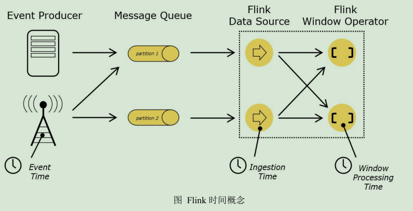
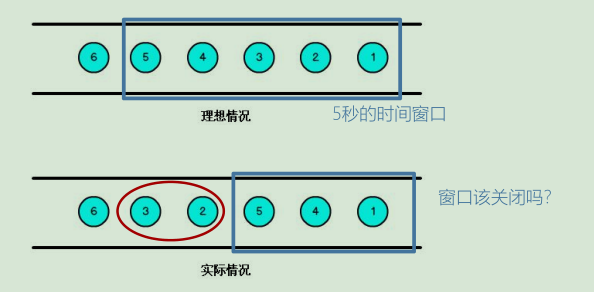
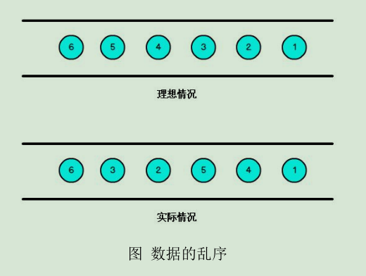
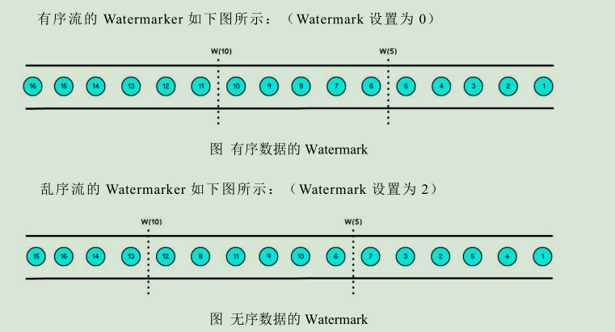
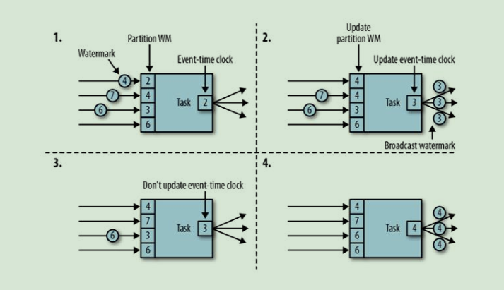

--- 
# 一、时间语义
在 Flink 流式处理中, 会涉及到时间的不同概念, 如 Flink 给的图所示



- Event Time: 事件创建的时间, 通常由事件中的时间戳描述, 例如: 采集的日志数据中, 每一条日志都会记录自己的生成时间, Flink 通过时间戳分配器访问事件时间戳
- Ingestion Time: 是数据进入 Flink 的时间
- Processing Time: 每一个指定基于时间操作的算子的本地系统时间, 与机器相关, Flink 默认的时间属性就是 Processing Time

在 Flink 的流式处理中, 绝大部分的业务都会使用 EventTime, 一般只在 EventTime 无法使用时, 才会被迫使用 ProcessingTime 或者 IngestionTime 

Flink 默认使用的是 ProcessingTime, 如果要引入 EventTime 的时间属性, 引入方式如下:
```scala
val env = StreamExecutionEnvironment.getExecutionEnvironment
// 从调用时刻开始给 env 创建的每一个 stream 追加时间特征
env.setStreamTimeCharacteristic(TimeCharacteristic.EventTime)
```

## 1.1 乱序数据的影响


- 当 Flink 以 EventTime 模式处理数据流时, 它会根据数据里的时间戳来处理基于时间的算子
- 由于网络、分布式等原因, 会导致乱序数据的产生
- 乱序数据会让窗口计算不准确

# 二、Watermark
在流处理中, 一个过程如下: 
1. 事件产生
2. 流经 source
3. flink 进行 operator

在大部分情况下, 流到 operator 的数据都是按照事件产生的时间顺序来的, 但是也可能存在由于网络、分布式等原因, 从而导致**乱序数据的产生**

所谓的乱序数据, 是指 Flink 接收到的事件的先后顺序不是严格按照事件的 EventTime 顺序排列的



一旦出现乱序数据, 如果只根据 EventTime 决定 window 的运行, 我们不能明确数据是否全部到位, 但是又不能无期限的等待下去, 此时必须要有个机制来保证一个特定的时间后, 必须触发 window 去进行计算, **这个特别的机制, 就是 Watermark**
- Watermark 是一种衡量 EventTime 进展的机制
- Watermark 是用于处理乱序事件的, 而正确的处理乱序时间, 通常用 Watermark 机制结合 window 来实现
- 数据流中的 Watermark 用于表示 timestamp 小于 Watermark 的数据, 都已经全部到达了, 因此, window 的执行也是由 Watermark 触发的
- Watermark 可以理解成一个延迟触发的机制, 我们可以设置 Watermark 的延时时长 t, 每次系统会校验已经到达的数据中心最大的 maxEventTime, 然后认定 eventTime 小于 maxEventTime - t 的数据都已经到达, 如果有窗口的停止时间等于 maxEventTime - t, 那么这个窗口被触发执行

当 Flink 接收到数据时, 会按照一定的规则去生成 Watermark, 这条 Watermark 就等于当前所有到达数据中心的 maxEventTime - 延迟时长, 也就是说, Watermark 是基于数据携带的时间戳生成的, 一旦 Watermark 比当前未触发的窗口的停止时间要晚, 那么就会触发相应窗口的执行。 由于 EventTime 是由数据携带的, 因此如果运行过程中无法获取新的数据, 那么没有被触发的窗口将永远都不会被触发



上图中, 设置的允许最大延迟到达时间为 2s, 所以时间戳为 7s 的事件对应的 Watermark 是 5s, 时间戳为 12s 的事件的 Watermark 是 10s, 如果我们的窗口1 是 1s~5s, 窗口2 是 6s~10s, 那么时间戳为 7s 的事件到达时的 Watermark 恰好触发窗口1, 时间戳为 12s 的事件到达时的 Watermark 恰好触发窗口2

# 三、Watermark 的传递


由图的第1部分看到, 整个Task 的Watermark 取的是每个 Partition 最小的 Watermark, 当图1中的 Watermark=4到达后, 最小的 Watermark就成了3, Watermark=3 向后传递, 所以图2中的 Task 的Watermark就变成了最小的 3了, 当Watermark=7到达后, 最小的Watermark 还是3, 所以整个 Task 的Watermark 还是3, 当 6到达后, 此时所有分区最小的 Watermark 变成了 4, 此时 Watermark=4向后传递, 所以图4中, 整个 Task 的Watermark就成了4

# 四、Watermark 的引入
EventTime 的使用一定要制定数据源中的时间戳

Watermark 的引入需调用 `assignTimestampAndWatermarks` 方法, 传入一个 `BoundedOutofOrdernessTimestampExtractor`, 就可以指定 Watermark:
```scala
dataStream.assignTimestampsAndWatermarks(new BoundedOutOfOrdernessTimestampExtractor[SensorReading](Time.milliseconds(1000)) {
  override def extractTimestamp(element: SensorReading): Long = {
    element.timestamp * 1000
  }
})
```
对于排好序的数据, 则不需要延迟触发, 可以只指定时间戳即可
```scala
// 传入的时间单位是毫秒
dataStream.assignAscendingTimestamps(_.timestamp * 1000)
```
同时  Flink 暴露了 TimestampAssigner 接口供我们实现, 使用时可以自定义如何从事件数据中抽取时间戳和生成 Watermark
```scala
dataStream.assignTimestampsAndWatermarks(new MyAssigner())
```
实现的 MyAssigner 有两种类型, 都继承于 TimestampAssigner 
1. AssignerWithPeriodicWatermarks(周期性)
    - 周期性的生成 Watermark: 系统会周期性的将 Watermark 插入到流中
    - 默认周期是 200 毫秒, 可以使用 `ExecutionConfig.setAutoWatermarkInterval()` 进行设置
    - 升序 和 前面乱序的处理 `BoundedOutOfOrderness` 都是基于周期性 Watermark 的
2. AssignerWithPunctuatedWatermarks(无规律)
    - 没有时间周期规律, 可以打断的生成 Watermark
    
在 Flink 中, Watermark 由应用开发人员生成, 这通常需要对相应的领域有一定的了解

如果 Watermark 设置的延迟太久, 收到结果的速度可能就会很慢, 解决办法是在 Watermark 到达钱输出一个近似结果

如果 Watermark 设置的太短, 则可能收到错误结果, 不过 Flink 处理迟数据的机制可以解决这个问题

# 五、时间语义和Watermark 示例代码
```scala
package com.kino.windows

import com.kino.mode.SensorReading
import org.apache.flink.streaming.api.TimeCharacteristic
import org.apache.flink.streaming.api.functions.{AssignerWithPeriodicWatermarks, AssignerWithPunctuatedWatermarks}
import org.apache.flink.streaming.api.scala._
import org.apache.flink.streaming.api.watermark.Watermark
import org.apache.flink.streaming.api.windowing.assigners.TumblingEventTimeWindows
import org.apache.flink.streaming.api.windowing.time.Time

/**
 * create by kino on 2021/1/17
 */
object WatermarkWindowTest {
  def main(args: Array[String]): Unit = {
    val env = StreamExecutionEnvironment.getExecutionEnvironment
    // 设置时间语义为 EventTime
    env.setStreamTimeCharacteristic(TimeCharacteristic.EventTime)
    // 设置周期性生成 Watermark 的时间(毫秒)
    env.getConfig.setAutoWatermarkInterval(100L)

    val inputStream = env.socketTextStream("localhost", 8888)
    val dataStream = inputStream.map(x => {
      val splits = x.split(",")
      SensorReading(splits(0).toString, splits(1).toLong, splits(2).toDouble)
    })
      // 当时间语义是 EventTime, 并且数据是有序的时候, 可以直接指定数据中的 timestamp 字段
//      .assignAscendingTimestamps(_.timestamp)
      // 当时间语义是 EventTime, 且数据是无须的时候, 需要使用此 API
      // 该 API 有两种类型的入参:
      //     1. AssignerWithPeriodicWatermarks: 有规律生成 Watermark 的API, 可以自定义生成 Watermark 的规则
      //     2. AssignerWithPunctuatedWatermarks: 没有规律的 API
//      .assignTimestampsAndWatermarks(new AssignerWithPeriodicWatermarks[SensorReading] {
//        // 延迟为 6s
//        val bound = 6000
//        var maxTime = Long.MaxValue
//
//        override def getCurrentWatermark: Watermark = new Watermark(maxTime - bound)
//
//        override def extractTimestamp(element: SensorReading, previousElementTimestamp: Long): Long = {
//          element.timestamp
//        }
//      })
      // 没有规律的 API
//      .assignTimestampsAndWatermarks(new AssignerWithPunctuatedWatermarks[SensorReading] {
//        override def checkAndGetNextWatermark(lastElement: SensorReading, extractedTimestamp: Long): Watermark = {
//          new Watermark(extractedTimestamp)
//        }
//
//        override def extractTimestamp(element: SensorReading, previousElementTimestamp: Long): Long = element.timestamp
//      })
      // 使用自定义的 Watermark 生成规则
      .assignTimestampsAndWatermarks(new MyWatermark(6000L))


    val outputStream = dataStream
      .map(x => (x.id, x.temperature))
      .keyBy(0)
      // 设置滚动窗口
      .window(TumblingEventTimeWindows.of(Time.seconds(10)))
      .reduce((x1, x2) => (x1._1, x1._2.max(x2._2)))
    outputStream.print("outputStream")
    dataStream.print("dataStream")
    env.execute(this.getClass.getName)
  }
}

// Watermark 可以继承于:
//    1. AssignerWithPeriodicWatermarks: 有规律生成 Watermark 的API, 可以自定义生成 Watermark 的规则
//    2. AssignerWithPunctuatedWatermarks: 没有规律的 API
class MyWatermark(bound: Long) extends AssignerWithPeriodicWatermarks[SensorReading]{
  var maxTime = Long.MaxValue

  override def getCurrentWatermark: Watermark = new Watermark(maxTime - bound)

  override def extractTimestamp(element: SensorReading, previousElementTimestamp: Long): Long = {
    element.timestamp
  }
}
```