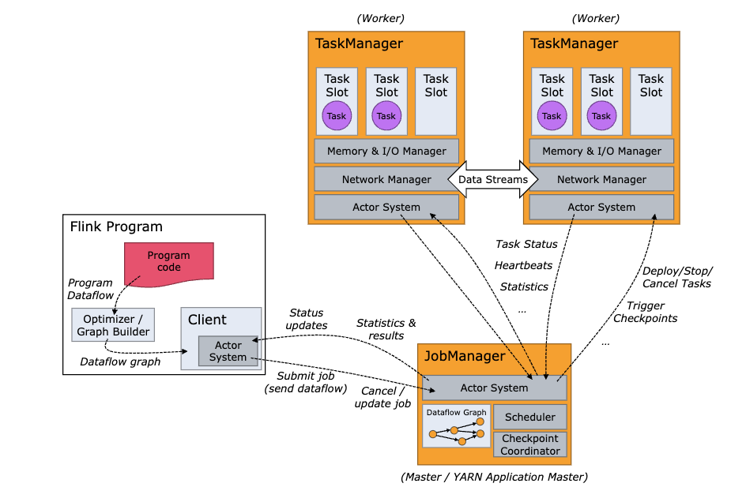
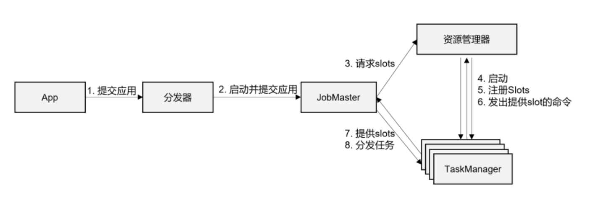
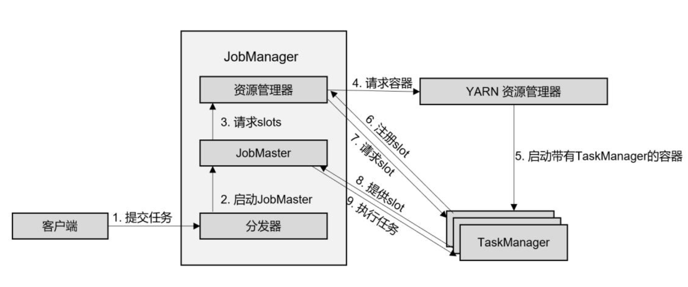
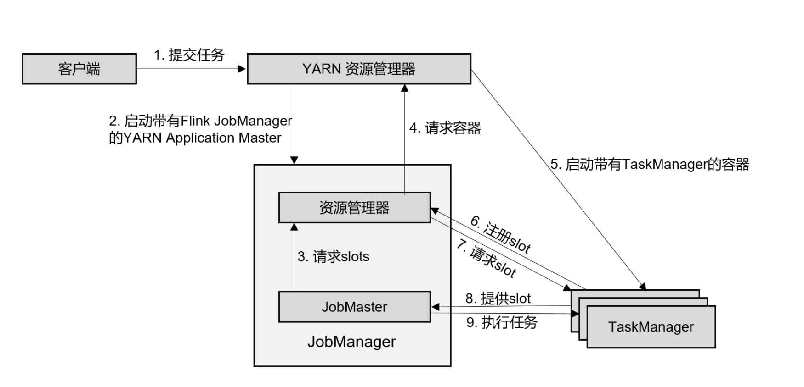

---

以 flink1.13.0 作为分析版本

# 一、flink 集群整体构成

Flink 运行时, 由两种类型的进程组成:
- JobManager
- TaskManager

Client 不是集群的一部分, 它只负责作业的提交。具体来说，就是调用 Main 方法，将代码转换成 "Dataflow Graph", 并且最终生成作业图(JobGraph)，然后再发送给 JobManager。

提交之后，任务的执行其实就跟 Client 没有关系了，此时可以讲 Client 断开与 JobManager 的连接, 当然也可以继续保持。在提交作业的时候，可以指定 `-d` 参数，表明是分离模式(detached mode)，也就是 Client 提交完成后，断开连接。

当 Client 把 JobGraph 提交到 JobManager 之后，JobManager 会讲 JobGraph 解析成可以执行的 ExecutorGraph，向 ResourceManager 申请资源后，把 ExecutorGraph 分发给 TaskManager 执行计算工作。

JobManager 和 TaskManager 可以用不同的方式启动，也就是 flink 不同的部署方式:
1. 作为 Standalone 集群的进程, 直接再机器上启动;
2. 在容器中启动;
3. 由资源管理平台调度启动, 如: Yarn、K8S。

# 二、JobManager
JobManager 是 Flink 集群中的核心，负责任务的管理、调度、协调 checkpoint、向 Client 反馈执行情况。

JobManager 同一时间，在 Flink 集群中只存在一个活跃的进程(HA 模式下也是如此)，也就是说，每一个提交进来的应用，都被唯一的 JobManager 所管理。

JobManager 又分为3个不同的组件:

## 2.1 JobMaster
JobMaster 是 JobManager 中最核心的组件，负责处理单独的作业。也就是说，JobMaster 是和 作业 一一对应的，多个 Job 可以同时运行在一个 Flink 集群中，每个 Job 都有一个专属于自己的 JobMaster。

在一个作业提交时(Client 的 Dataflow Graph 向 JobManager 提交)，JobMaster 会先收到要执行的应用，然后 JobMaster 会将 JobGraph 转换成为一个物理层面的 ExecutionGraph，ExecutionGraph 包含了所有可以并发执行的任务。然后 JobMaster 会向 ResourceManager 发出请求，申请执行任务所需要的资源，获取到了足够的资源后，就会将 ExecutionGraph 发送到真正运行它们的 TaskManager 上。

在作业运行的过程中，JobManager 会负责所有需要中央协调的操作，比如 checkpoint 的协调。

## 2.2 ResourceManager
ResourceManager 主要负责集群资源的分配和管理，在 Flink 集群中只有一个。ResourceManager 管理的资源主要是指 TaskManager 的 Task Slots。 Task Slots 是 Flink 集群中的资源调配单元，包含了机器用来执行计算的一组 CPU 和 Memory。每一个 Task 都需要分配到一个 Slot 上执行。

对于集群的资源管理，并不限于 Flink 内置的 ResourceManager，还可以是其他的资源管理平台，例如 Yarn 和K8s。

在 Standalone 模式下，因为 TaskManager 是在集群启动时就已经启动的(不存在 Pre-Job 模式)，所以 ResourceManager 只能分发可用的 TaskManager，不能单独启动新的 TaskManager。

## 2.3 Dispatcher
Dispatcher 主要负责提供一个 REST 接口，用来提交应用，并且负责为每个新提交的作业启动一个新的 JobMaster。Dispatcher 也会启动一个WebUI，用来展示和监控作业的执行情况。

# 三、TaskManager
TaskManager 是 Flink 中的工作进程，数据流的具体计算就是它来做的，所以也会被成为 Worker。

Flink 集群中有一个或多个 TaskManager，每一个 TaskManager 都包含了一定数量的 Task Slots。 Slot 是资源调度的最小单位，slot 的数量限制了 TaskManager 能够并行处理的任务数量。

当 一个作业提交并且 ResourceManager 确定 TaskManager 有足够的的资源之后，TaskManager 会向 ResourceManager 注册它的 slots，然后会将 所需要的 Slot 提供给 JobMaster 调用，JobMaster 就可以分配任务来执行了。

[以上可以通过 Flikn 官网查看官方描述](https://nightlies.apache.org/flink/flink-docs-release-1.13/docs/concepts/flink-architecture/#flink-architecture)

# 四、作业提交通用流程

1. 一般情况下，由 Client 通过 Dispatcher 提供的 REST 接口，讲作业提交给 JobManager。

2. 由 Dispatcher 启动 JobMaster，并将作业(JobGraph)提交给 JobMaster。

3. JobMaster 将 JobGraph 解析为可以执行的 ExecutionGraph，得到所需要的资源数量，然后向 ResourceManager 申请 Slots。

4. ResourceManager 判断当前是否有足够的可用资源，如果没有，启动新的 TaskManager。

5. TaskManager 启动之后，向 ResourceManager 注册自己的可用 Slots(任务槽)。

6. ResourceManager 通知 TaskManager 为新的作业提供 Slots.

7. TaskManager 连接到对应的 JobMaster，提供 Slots。

8. JobMaster 将需要执行的任务分发给 TaskManager。

9. TaskManager 执行任务。

# 五、Standalone 
在 Standalone 模式下，只有 Session 和 Application 两种部署方式。

两者整体流程非常相似: TaskManager 都需要手动启动，所以当 ResourceManager 收到 JobMaster 的请求时，会直接要求 TaskManager 提供资源。而 JobMaster 启动的时间点，Session 模式是预先启动，Application 是在作业提交时启动。

# 六、Yarn 
Flink on Yarn 分为三种模式:
- Session
- Pre-Job
- Application

## 6.1 Session 模式
在 Session 模式下，需要先启动一个 Yarn Session 创建一个 Flink 集群(由 Yarn ResourceManager 启动 JobManager 容器)，TaskManager 是动态启动的，所以 Flink WebUI 上不会显示可用的 Slots 数量。

1. Client 通过 REST 接口，将作业提交到 Dispatcher。
2. Dispatcher 启动 JobMaster，并将作业(包含 JobGraph) 提交到 JobMaster。
3. JobMaster 向 ResourceManager 申请资源(Slots)。
4. ResourceManager 向 Yarn 的资源管理器请求 container 资源。
5. Yarn 启动新的 TaskManager 容器。
6. TaskManager 启动之后，向 Flink 的 ResourceManager 注册自己的可用 slots。
7. ResourceManager 通知 TaskManager 为新的作业提供 slots。
8. TaskManager 连接到对应的 JobMaster，提供 slots。
9. JobMaster 讲所需执行的任务分发给 TaskManager，执行任务

## 6.2 Pre-Job 模式
在 Pre-Job 模式下，Flink 集群不会预先启动，而是在提交作业时，才会启动新的 JobManager。

1. Client 将任务提交给 Yarn 的资源管理器，这一步会同时将 Flink 的 Jar 包和配置上传到 HDFS，以便后续启动 Flink 相关的容器。
2. Yarn 的资源管理器分配 Container 资源，启动 Flink JobManager，并将作业提交给 JobMaster。
3. JobMaster 向 ResourceManager 申请资源(slots)。
4. ResourceManager 向 Yarn 的资源管理器请求 container 资源。
5. Yarn 启动新的 TaskManager 容器。
6. TaskManager 向 ResourceManager 注册可用的资源(slots)。
7. ResourceManager 通知 TaskManager 为新的作业提供资源(slots)。
8. TaskManager 连接到对应的 JobMaster，提供 slots。
9. JobMaster 将需要执行的任务分发到 TaskManager，执行任务。

## 6.3 Application 模式
Application 模式与 Pre-Job 模式的提交流程非常相似，只是初始提价给 Yarn 的资源管理器的不再是具体的作业，而是整个应用。一个应用中可能包含了多个作业，这些作业都将在 Flink 集群中启动各自对应的 JobMaster。

