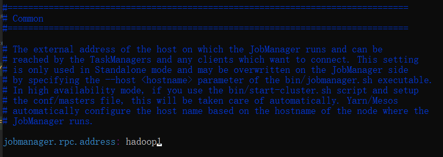
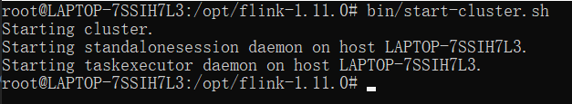
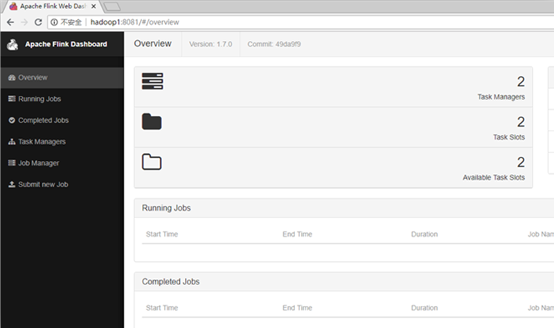
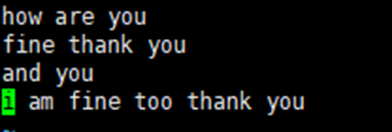
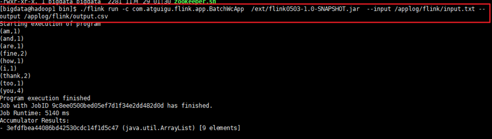
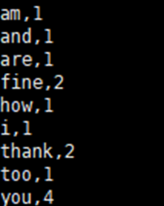
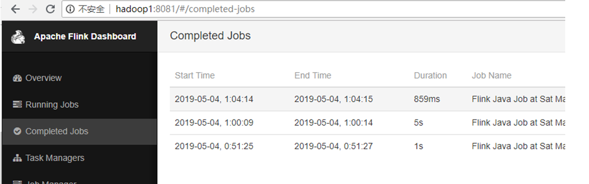

---

# 一、Flink部署 
## 1.1 Standalone模式
### 1.1.1 安装
解压缩  flink-1.7.2-bin-hadoop27-scala_2.11.tgz，进入conf目录中。

① 修改 flink/conf/flink-conf.yaml 文件:


 
② 修改 /conf/slave文件：


 
③ 分发给另外两台机子：


 
④ 启动：


 
访问http://localhost:8081可以对flink集群和任务进行监控管理。



 

### 1.1.2 提交任务

① 准备数据文件



 
② 把含数据文件的文件夹，分发到taskmanage 机器中
 


由于读取数据是从本地磁盘读取，实际任务会被分发到taskmanage的机器中，所以要把目标文件分发。

③ 执行程序 
```bash
./flink run -c com.atguigu.flink.app.BatchWcApp  /ext/flinkTest-1.0-SNAPSHOT.jar  --input /applog/flink/input.txt --output /applog/flink/output.csv
```


 
④ 到目标文件夹中查看计算结果
注意：计算结果根据会保存到taskmanage的机器下，不会在jobmanage下。
 


⑤ 在webui控制台查看计算过程 


 

# 二、Yarn模式
以Yarn模式部署Flink任务时，要求Flink是有Hadoop支持的版本，Hadoop环境需要保证版本在2.2以上，并且集群中安装有HDFS服务。
1)	启动hadoop集群（略）
2)	启动yarn-session

./yarn-session.sh -n 2 -s 2 -jm 1024 -tm 1024 -nm test -d
其中：
-n(--container)：TaskManager的数量。
-s(--slots)：	每个TaskManager的slot数量，默认一个slot一个core，默认每个taskmanager的slot的个数为1，有时可以多一些taskmanager，做冗余。
-jm：JobManager的内存（单位MB)。
-tm：每个taskmanager的内存（单位MB)。
-nm：yarn 的appName(现在yarn的ui上的名字)。 
-d：后台执行。

 
3)	执行任务
./flink run  -m yarn-cluster -c com.atguigu.flink.app.BatchWcApp  /ext/flink0503-1.0-SNAPSHOT.jar  --input /applog/flink/input.txt --output /applog/flink/output5.csv

 
4)	去yarn控制台查看任务状态
 

3.3  Kubernetes部署
容器化部署时目前业界很流行的一项技术，基于Docker镜像运行能够让用户更加方便地对应用进行管理和运维。容器管理工具中最为流行的就是Kubernetes（k8s），而Flink也在最近的版本中支持了k8s部署模式。
1）	搭建Kubernetes集群（略）
2）	配置各组件的yaml文件
在k8s上构建Flink Session Cluster，需要将Flink集群的组件对应的docker镜像分别在k8s上启动，包括JobManager、TaskManager、JobManagerService三个镜像服务。每个镜像服务都可以从中央镜像仓库中获取。
3）启动Flink Session Cluster
// 启动jobmanager-service 服务
kubectl create -f jobmanager-service.yaml
// 启动jobmanager-deployment服务
kubectl create -f jobmanager-deployment.yaml
// 启动taskmanager-deployment服务
kubectl create -f taskmanager-deployment.yaml
4）访问Flink UI页面
集群启动后，就可以通过JobManagerServicers中配置的WebUI端口，用浏览器输入以下url来访问Flink UI页面了：
http://{JobManagerHost:Port}/api/v1/namespaces/default/services/flink-jobmanager:ui/proxy
