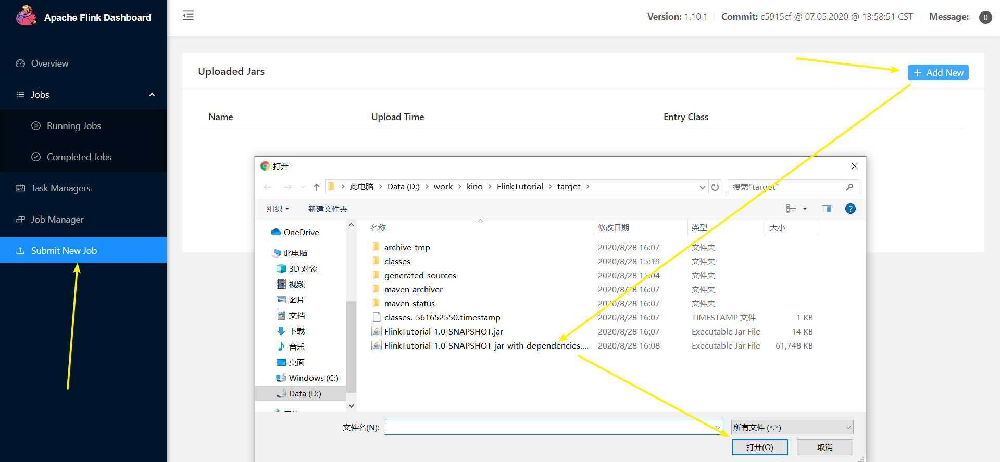
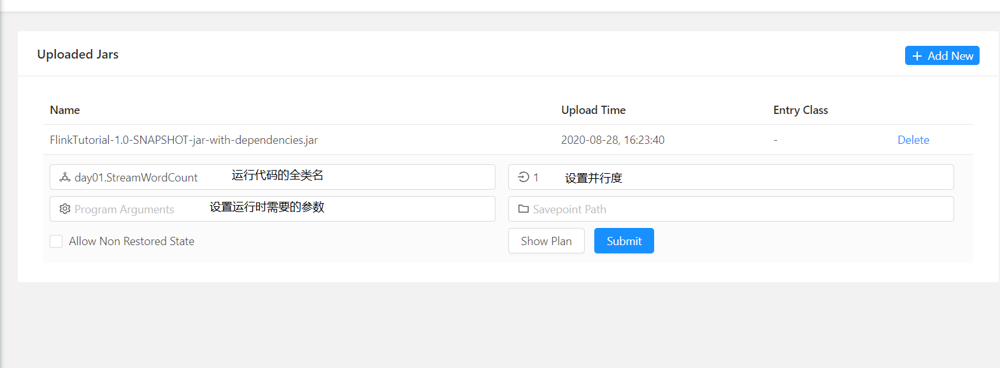
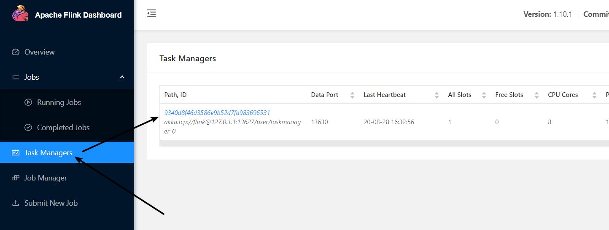
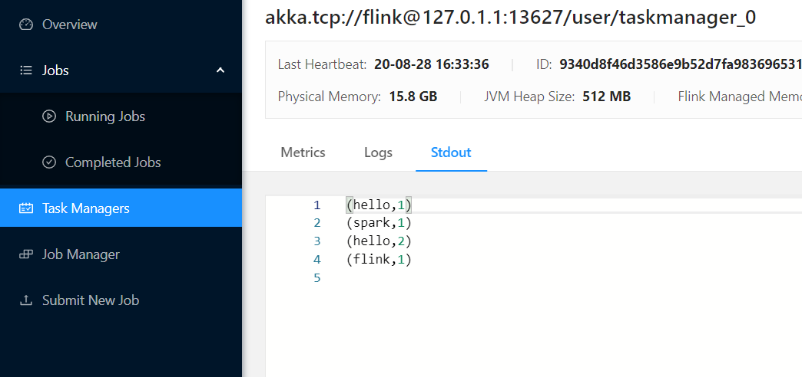
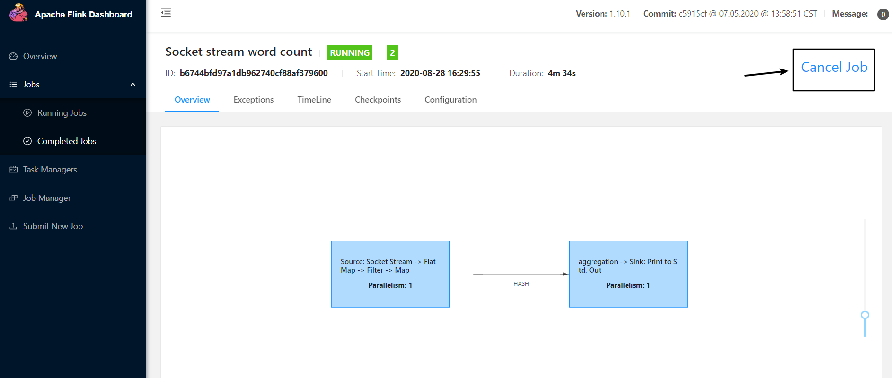
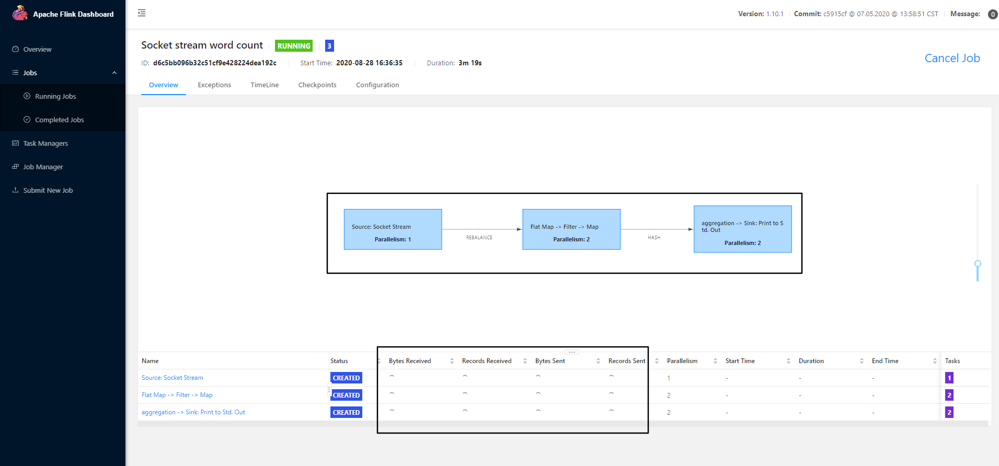
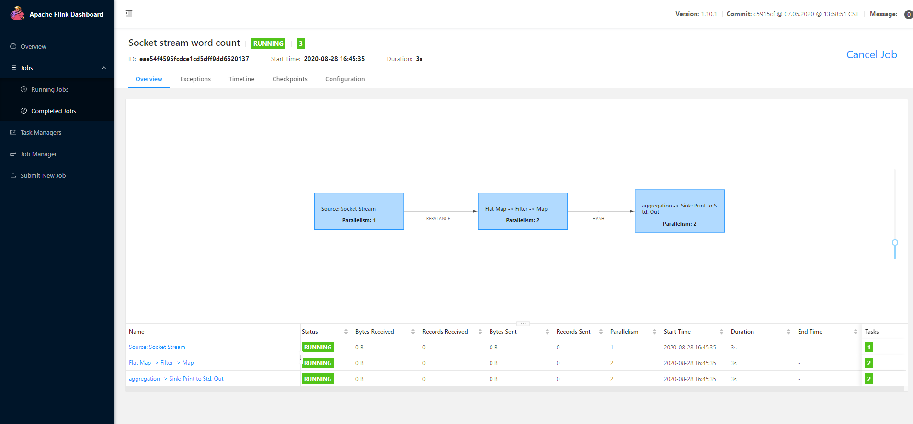
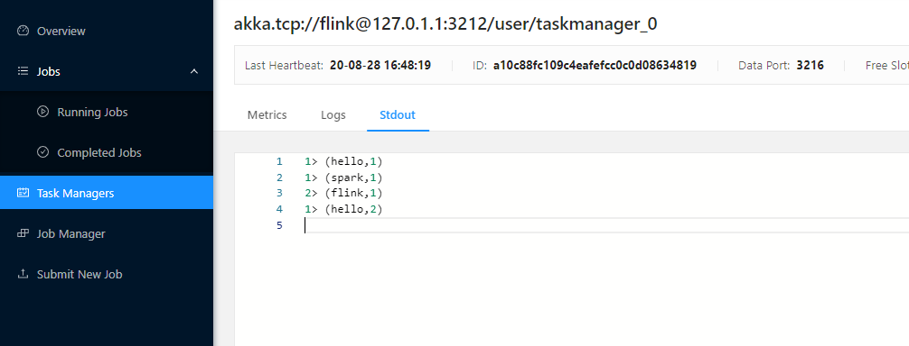

* [一、Flink部署](#%E4%B8%80flink%E9%83%A8%E7%BD%B2)
  * [1\.1 Standalone模式](#11-standalone%E6%A8%A1%E5%BC%8F)
    * [1\.1\.1 安装](#111-%E5%AE%89%E8%A3%85)
    * [1\.1\.2 提交任务](#112-%E6%8F%90%E4%BA%A4%E4%BB%BB%E5%8A%A1)
* [二、Yarn模式](#%E4%BA%8Cyarn%E6%A8%A1%E5%BC%8F)
* [三、Kubernetes部署](#%E4%B8%89kubernetes%E9%83%A8%E7%BD%B2)

---

# 一、Flink部署 
本次使用单机 Flink 作为环境, 后续会详细介绍 Flink 的三种部署模式

## 1.1 下载 Flink 安装包
http://apache.mirrors.hoobly.com/flink/

## 解压, 启动 flink 
```bash
root@LAPTOP-7SSIH7L3:/opt/flink-1.10.1# bin/start-cluster.sh
Starting cluster.
Starting standalonesession daemon on host LAPTOP-7SSIH7L3.
Starting taskexecutor daemon on host LAPTOP-7SSIH7L3.

root@LAPTOP-7SSIH7L3:/opt/flink-1.10.1# jps
1413 Jps
966 StandaloneSessionClusterEntrypoint
1304 TaskManagerRunner
```

在浏览器中输入: http://localhost:8081/


## 1.2 提交任务


## 1.3 运行任务



测试——在 window 子 ubuntu 系统中用 netcat 命令进行发送测试。

```bash
kino@LAPTOP-7SSIH7L3:~$ nc -lk 8888

hello spark
hello flink
```

在 WebUI 中查看结果:




## 1.4 停止任务


## 1.5 将启动时设置的并行度设置为 2 再启动


可以看见, show plan 已经不一样了, 而且我们能看见 下面 `status` 处于 `CREATED` 状态, 并且处于加载状态, 原因是因为 我们提交时设置的并行度为: 2, 而我们 `flink-conf.yaml` 配置文件中, `taskmanager.numberOfTaskSlots` 默认为: 1

我们修改配置文件中的该参数为: 2 然后重启flink再提交任务
```bash
root@LAPTOP-7SSIH7L3:/opt/flink-1.10.1# vim conf/flink-conf.yaml

taskmanager.numberOfTaskSlots: 2
```

再次提交任务



可以看到此时任务正常运行起来了, 我们使用 nc 输入看一下效果
```bash
kino@LAPTOP-7SSIH7L3:~$ nc -lk 8888

hello spark
hello flink
```

