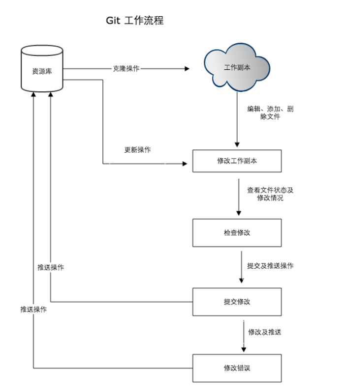

---
# 一、安装
[官方网站](https://git-scm.com/)

## 1.1 下载
[下载地址](https://git-scm.com/downloads)

## 1.2 安装
双击下载好的 exe 一路 next 即可

# 二、使用 git 的工作流程
1. 克隆 git 项目作为工作目录
2. 在克隆下来的项目进行修改
3. 协同开发更新了文件, 就可以在本地进行文件更新
4. 在自己提交前查看修改
5. 提交修改
6. 在修改完成后, 发现有错误, 可以撤销并再次修改提交



# 三、基本概念
git 分为: 
- 工作区: 电脑上就能看见的目录
- 暂存区: 存放在 `.git` 目录下的 index 文件(.git/index)中, 有人称暂存区为索引
- 版本区: 工作区中有个隐藏文件 `.git`


# 四、创建仓库
登录 github, 创建仓库: `git-study`, 使用 idea 克隆项目, 在项目根目录中有一个 `.git` 文件夹, 进入, 使用cmd输入: `tree/F`, 会输出 `.git` 目录结构:
```tree
卷 Data 的文件夹 PATH 列表
卷序列号为 9E01-7D0F
D:.
│  config
│  description
│  HEAD
│  index
│  packed-refs
│
├─hooks
│      applypatch-msg.sample
│      commit-msg.sample
│      fsmonitor-watchman.sample
│      post-update.sample
│      pre-applypatch.sample
│      pre-commit.sample
│      pre-merge-commit.sample
│      pre-push.sample
│      pre-rebase.sample
│      pre-receive.sample
│      prepare-commit-msg.sample
│      update.sample
│
├─info
│      exclude
│
├─logs
│  │  HEAD
│  │
│  └─refs
│      ├─heads
│      │      main
│      │
│      └─remotes
│          └─origin
│                  HEAD
│
├─objects
│  ├─93
│  │      255a10c0bcb73c2622f1b9918aa25e076c7698
│  │
│  ├─e3
│  │      5e2fa1592a3e9aeed28ffd053d919d2e519d9c
│  │
│  ├─ef
│  │      c0aa816153c537255441924c01155300fa48d6
│  │
│  ├─info
│  └─pack
└─refs
    ├─heads
    │      main
    │
    ├─remotes
    │  └─origin
    │          HEAD
    │
    └─tags
```

# 五、git 常用命令
## 5.1 git clone
克隆整个仓库
```bash
kino@LAPTOP-7SSIH7L3 MINGW64 /d/work
$ git clone https://github.com/KinoMin/git-study.git
```
克隆到执行的目录下
```bash
kino@LAPTOP-7SSIH7L3 MINGW64 /d/work 
$ git clone https://github.com/KinoMin/git-study.git git-study-1
kino@LAPTOP-7SSIH7L3 MINGW64 /d/work 
$ cd git-study-1
kino@LAPTOP-7SSIH7L3 MINGW64 /d/work 
$ ll
total 1
-rw-r--r-- 1 raomi 197609 19 12月 17 18:34 README.md
```
## 