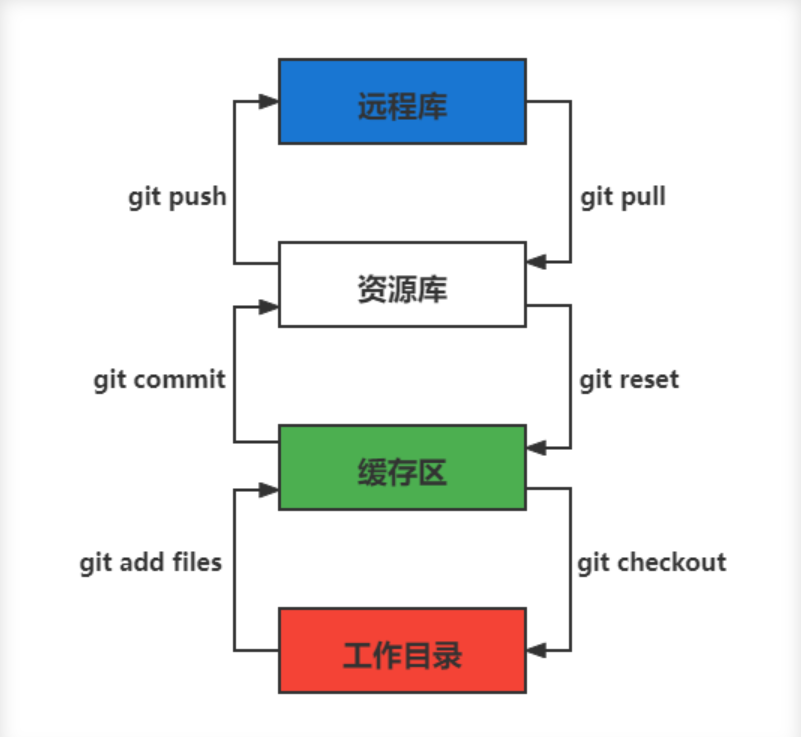
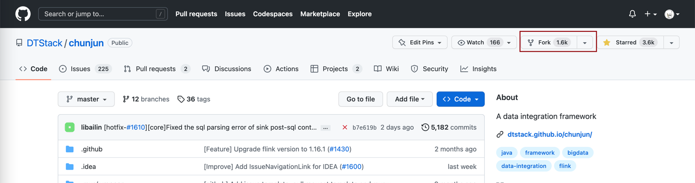
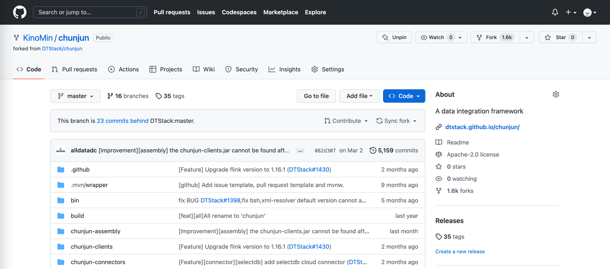

---

# 一、git 工作流程
git 有四个区域:
- 3个本地区域
  - 工作区(Workspace): 存放项目代码的地方。
  - 暂存区(Stage): 存放临时的改动, 事实上它只是一个文件, 保存即将提交的文件列表信息。
  - 资源库(Repository): 安全存放数据的位置, 这里面有提交到所有版本的数据。其中 HEAD 指向最新放入仓库的版本。
- 1个远程区域
  - 远程库(Remote): 托管代码的服务器。



# 二、git 初始化
```bash
$ mkdir git-study && cd git-study
$ git init
$ ls -la
total 0
drwxr-xr-x   3 kino  staff   96 11 23 17:18 .
drwxr-xr-x  16 kino  staff  512 11 23 17:18 ..
drwxr-xr-x   9 kino  staff  288 11 23 17:18 .git
```
创建成功之后, 会出现一个 `.git` 的隐藏文件夹, 这个就是这个项目的 git 仓库, 以后所有的 git 操作历史提交记录信息全都在此, 只要这个文件夹还存在, 就可以记住我们所有的 git 操作。

# 三、git 配置相关常用命令
## 3.1 git config
查看 git 配置
```bash
$ git config --list
credential.helper=osxkeychain
user.name=kino
user.email=kino@gmail.com
core.autocrlf=input
core.quotepath=false
core.repositoryformatversion=0
core.filemode=true
core.bare=false
core.logallrefupdates=true
core.ignorecase=true
core.precomposeunicode=true
```
修改 git 配置文件
```bash
$ git config -e            # 针对当前仓库
$ git config -e --global   # 针对系统上的所有仓库
```
设置提交代码时的用户信息
```bash
$ git config --global user.name "yourUserName"     # 去掉 --global 就只对当前仓库生效
$ git config --gloabl user.email "yourEmail"       # 去掉 --global 就只对当前仓库生效
```

# 四、git 日常操作

<a href="#411-git-add">`git add`: 将文件添加到暂存区</a>

<a href="#412-git-status">`git status`: 查看在你上次提交之后是否有对文件进行再次修改</a>

<a href="#413-git-diff">`git diff`: 比较文件在暂存区和工作区的差异</a>

<a href="#414-git-ls-files">`git ls-files`: 查看暂存区的文件</a>

<a href="#415-git-cat-file--p">`git cat-file -p`: 查看暂存区文件中的内容</a>

<a href="#416-git-commit">`git commit`: 提交暂存区文件到本地仓库</a>

<a href="#417-git-rm">`git rm`: 删除文件</a>


## 4.1 提交代码
### 4.1.1 git add
语法:
```bash
# 1. 该命令可以将文件添加到暂存区
$ git add [file1] [file2] ...

# 2. 添加指定目录到暂存区
$ git add [dir]

# 3. 添加当前目录下所有文件进入暂存区
$ git add .
```
示例:
```bash
$ touch 1.txt 2.txt 3.txt 4.txt
$ ll 
total 8
-rw-r--r--  1 kino  staff   0  7  5 18:30 1.txt
-rw-r--r--  1 kino  staff   0  7  5 18:30 2.txt
-rw-r--r--  1 kino  staff   0  7  5 18:31 3.txt
-rw-r--r--  1 kino  staff   0  7  5 18:31 4.txt
-rw-r--r--  1 kino  staff  13  7  5 18:30 README.md

# 添加 1.txt 和 2.txt 进入暂存区
$ git add 1.txt 2.txt
```

### 4.1.2 git status
查看在你上次提交之后是否有对文件进行再次修改。
```bash
$ git status 
On branch main
Your branch is up to date with 'origin/main'.

Changes to be committed:
  (use "git restore --staged <file>..." to unstage)
	new file:   1.txt
	new file:   2.txt

Untracked files:
  (use "git add <file>..." to include in what will be committed)
	3.txt
	4.txt

$ git status -s 
A  1.txt
A  2.txt
?? 3.txt
?? 4.txt

$ git commit -m "提交"
[main 26c1139] 提交
 2 files changed, 0 insertions(+), 0 deletions(-)
 create mode 100644 1.txt
 create mode 100644 2.txt

$ echo 11111 >> 1.txt
$ echo 33333 >> 3.txt
$ git add 3.txt

$ git status -s 
 M 1.txt
AM 3.txt
?? 4.txt
```
- A 表示新提交
- M 表示提交过，并且本地又修改了
- AM 表示有改动

### 4.1.3 git diff
比较文件的不同, 即比较文件在暂存区和工作区的差异

git diff 显示已经写入暂存区和已经被修改但尚未写入暂存区文件的区别

应用场景:
1. 尚未缓存的改动: git diff
2. 查看已经缓存的改动: git diff --cached
3. 查看缓存成功和未缓存的所有改动: git diff HEAD
4. 显示摘要而非整个diff: git diff --stat

删除原来的项目重新clone
```bash
$ rm -rf git-study
$ git init

$ cd git-study

$ echo 1111 >> README.md
$ git add . && git commit -m "readme" 
$ echo 2222 >> README.md

# 查看暂未添加至缓存区的改动
$ git diff
diff --git a/README.md b/README.md
index 5f2f16b..4f142ee 100644
--- a/README.md
+++ b/README.md
@@ -1 +1,2 @@
 1111
+2222

# 显示简略信息
$ git diff --stat
 README.md | 1 +
 1 file changed, 1 insertion(+)

# 查看已经添加至缓存区的改动
$ git add README.md
$ git diff --cached
diff --git a/README.md b/README.md
index 5f2f16b..4f142ee 100644
--- a/README.md
+++ b/README.md
@@ -1 +1,2 @@
 1111
+2222


# 查看不在缓存区 & 在缓存区的改动
$ git diff HEAD
diff --git a/README.md b/README.md
index 5f2f16b..4f142ee 100644
--- a/README.md
+++ b/README.md
@@ -1 +1,2 @@
 1111
+2222
```

### 4.1.4 git ls-files
查看暂存区的文件
```bash
$ git ls-files
README.md
```
可选参数:
- -c: 默认
- -d: 显示删除的文件
- -m: 显示被修改过的文件
- -o: 显示没有被 git 跟踪过的文件
- -s: 显示 mode 以及对应的 Blog对象, 进而可以获取暂存区中对应文件的内容

### 4.1.5 git cat-file -p
查看暂存区文件中的内容
```bash
$ git ls-files -s
100644 5cf7833392d65968a05971b9923f36a1ec46d7f7 0       README.md

$ git cat-file -p  5cf7
1111
2222
```

### 4.1.6 git commit
提交暂存区文件到本地仓库
```bash
$ git commit -m [message]
```
提交暂存区的指定文件到本地仓库
```bash
$ git commit [file1] [file2] ... -m [message]
```

### 4.1.7 git rm
`git rm` 用于删除文件

1、将文件从暂存区和工作区中删除
```bash
$ git rm 1.txt 2.txt
```
2、将文件从暂存区和工作区中强制删除
```bash
# 可以加上 -f, 表示强制删除之前修改过而且 add 到暂存区的文件
$ git rm -f 1.txt 2.txt
```
3、将文件从暂存区删除，在工作区保留
```bash
git rm --cached 1.txt 2.txt
```

## 4.2 分支操作
```bash
# 查看分支
$ git branch -a 

# 基于当前分支创建一个新分支
$ git checkout -b feature/hotfix-001

# 基于指定分支创建一个新的分支
$ git checkout -b feature/hotfix-002 master

# 切换分支
$ git checkout master

# 删除分支
$ git branch -d feature/hotfix-001
```

## 4.3 更新操作
@TODO

## 4.4 合并冲突
简单制造一个冲突
```bash
# 再迁出一个分支(模拟其他人的修改操作)
$ git checkout -b feature/hotfix-001 feature/hotfix-002
# 修改文件
$ echo 3333 >> README.md
$ git add README.md
$ git commit -m "hotfix-001: add newline"
# 合并到master
$ git checkout master 
$ git merge feature/hotfix-001


$ git checkout feature/hotfix-002
$ vim README.md
# 在第三行添加
3344
$ git add README.md
$ git commit -m "hotfix-002: add newline"

$ git checkout master
# 再合并代码就会出现冲突提示
# 这个时候不可以进行任何分支切换和commit操作，需要按照提示将冲突解决。
$ git merge feature/hotfix-002
Auto-merging README.md
CONFLICT (content): Merge conflict in README.md
Automatic merge failed; fix conflicts and then commit the result.
```
查看冲突文件内容
```bash
$ vim README.md
1111
2222
<<<<<<< HEAD
3333
=======
3344
>>>>>>> feature/hotfix-002
```
- 从 `<<<<<<< HEAD` 开始, 到 `=======` 都是主分支已经存在的内容。
- 从 `=======` 开始, 到 `>>>>>>> feature/hotfix-002` 都是 merge 过来的分支的内容。

解决冲突，视情况保留(删除)记录
```bash
$ vim README.md
1111
2222
3333
3344

# 冲突解决完成之后, 再次提交代码
$ git commit -a

# 查看变更记录
commit 8715c66d8ca756077040ce6d783c6caf470d115e (HEAD -> master)
Merge: b89c0c5 ba903ae
Author: kino <kino@gmail.com>
Date:   Wed Nov 23 18:29:17 2022 +0800

    Merge branch 'feature/hotfix-002'

commit ba903aebecb447d6f485108f0321b15f6c009886 (feature/hotfix-002)
Author: kino <kino@gmail.com>
Date:   Wed Nov 23 18:19:54 2022 +0800

    hotfix-002: add newline

commit b89c0c592ba11894acb2cd93564c5e43934065fb (feature/hotfix-001)
Author: kino <kino@gmail.com>
Date:   Wed Nov 23 18:16:23 2022 +0800

    hotfix-001: add newline
```

## 4.3 暂存代码保护现场
项目经理提了一个新的需求, 开发就需要从 master 分支迁出一个新的分支进行功能开发(例如迁出新分支为dev), 如果在开发过程工, 生产上有紧急 bug 需要修复, 就可以用到 `git stash` 了。

`git stash` 可以将现在的 **工作区**全部的修改、新增、删除等操作，全部保存起来。

`git stash` 的常用命令:
1. `git stash save 'save message'`: 执行存储时, 添加备注, 方便查找, 当然只执行 `git stash` 也是可以的, 但查找时不方便。
2. `git stash list`: 查看 stash 了哪些存储。
3. `git stash show`: 显示做了哪些改动, 默认 show 第一个存储, 如果要显示其他的存储, 后面加 `stash@{$num}`, 比如第二个: `git stash show stash@{1}`
4. `git stast show -p`: 显示第一个存储的改动, 如果想显示其他存储, 则: `git stash show stash@{$num} -p`, 比如第二个: `git stash show stash@{1} -p`
5. `git stash apply`: 应用某个存储, 但不会把存储从存储列表中删除, 默认使用第一个存储, 即 `stash@{0}`, 如果要是用其他, 则: `git stash apply stash@{$num}`, 比如第二个: `git stash apply stash@{1}`
6. `git stash pop`: 恢复之前缓存的工作目录, 将缓存列表中对应的 stash 删除, 并将对应修改应用到当前的工作目录下, 默认为第一个 stash, 即 `stash@{0}`, 如果要应用并删除其他 stash, 则: `git stash pop stash@{$num}`, 比如应用并删除第二个: `git stash pop stash@{1}`
7. `git stash drop stash@{num}`: 丢弃 `stash@{num}` 存储, 从列表中删除这个存储
8. `git stash clear`: 删除所有缓存的 stash

开始模拟现场
```bash
# git 初始化
$ cd .. && rm -rf git-study && mkdir git-study && cd git-study && git init
$ echo 'file1 init' > file1.txt
$ echo 'file2 init' > file2.txt
$ git add .
$ git commit -m 'change: add file1 & file2'
[master (root-commit) 525c358] change: add file1 & file2
 2 files changed, 2 insertions(+)
 create mode 100644 file1.txt
 create mode 100644 file2.txt
 
# 然后从 master 分支创建两个新的 feature 分支
$ git branch feature1
$ git branch feature2

# checkout feature1, 修改 file1.txt, 并在 feature1 上创建两次提交
$ git checkout feature1
$ echo 'add file1.txt code 1' >> file1.txt
$ git add file1.txt
$ git commit -m 'change file1 no.1'
$ echo 'add file2.txt code 2' >> file1.txt
$ git add file1.txt
$ git commit -m 'change file1 no.2'
# 目前 feature1 上的改动内容
$ cat file1.txt
file1 init
add file1.txt code 1
add file2.txt code 2
$ cat file2.txt
file2 init

# checkout feature2, 修改 file2.tx
$ git checkout feature2
$ echo 'add file2.txt code 1' >> file2.txt
$ git add file2.txt
$ git commit -m 'change file2 no.1'
# 目前 feature2 上的改动内容
$ cat file1.txt
file1 init
$ cat file2.txt
file2 init
add file2.txt code 1

# 假设不小心将 feature2 合并到了 feature1, 并在 feature1 继续进行了代码开发并提交
$ git checkout feature1
$ git merge feature2
$ echo 'add file1.txt no.3 & code end' >> file1.txt
$ git add file1.txt
$ git commit -m 'change file1 no.3'
# 此时 feature1 上所有文件的内容
$ cat file1.txt
file1 init
add file1.txt code 1
add file2.txt code 2
add file1.txt no.3 & code end
$ cat file2.txt
file2 init
add file2.txt code 1

# 此时我们发现了不小心 merge 进来的 feature2, 而且在这基础上我们还有新的 commit, 如果我们想将 merge 剔除, 可以做如下操作
# 先查看需要还原 commit 的版本号
$ git log --oneline
8a1454f (HEAD -> feature1) change file1 no.3
422a454 Merge branch 'feature2' into feature1
4978e2c (feature2) change file2 no.1
ee4a50e change file1 no.2
dc397c1 change file1 no.1
525c358 (master) change: add file1 & file2
# 其中, 422a454 就是误合并的 commitid
# 目前我们需要做的就是撤销已提交的 commit, 回滚到 feature2 误合并到 feature1 分支的 commit 版本。
$ git reset --mixed 422a454
Unstaged changes after reset:
M	file1.txt
$ git log --oneline
422a454 (HEAD -> feature1) Merge branch 'feature2' into feature1
4978e2c (feature2) change file2 no.1
ee4a50e change file1 no.2
dc397c1 change file1 no.1
525c358 (master) change: add file1 & file2
$ git diff file1.txt
diff --git a/file1.txt b/file1.txt
index 4a1ca46..6954af7 100644
--- a/file1.txt
+++ b/file1.txt
@@ -1,3 +1,4 @@
 file1 init
 add file1.txt code 1
 add file2.txt code 2
+add file1.txt no.3 & code end   ## 可以看见, feature1 最后一次提交已经是未暂存状态了
# 此时, 我们就可以使用 git stash, 将撤销的代码存储起来, 
$ git stash save 'save file1.txt reset code'
Saved working directory and index state On feature1: save file1.txt reset code
# 查看 stash 列表
$ git stash list
stash@{0}: On feature1: save file1.txt reset code
# 查看 status, 可以看见在工作空间已经没有了
$ git status 
On branch feature1
nothing to commit, working tree clean

# 然后再撤销 merge 相关的信息
$ git reset --hard HEAD~
# 再查看此时本地的文件内容
$ cat file1.txt
file1 init
add file1.txt code 1
add file2.txt code 2
$ cat file2.txt
file2 init

# 接下来恢复 feature1 上被撤销的代码
$ git stash list
stash@{0}: On feature1: save file1.txt reset code
$ git stash apply stash{0}
On branch feature1
Changes not staged for commit:
  (use "git add <file>..." to update what will be committed)
  (use "git restore <file>..." to discard changes in working directory)
	modified:   file1.txt

no changes added to commit (use "git add" and/or "git commit -a")
# 此时代码就恢复回来了
$ cat file1.txt
file1 init
add file1.txt code 1
add file2.txt code 2
add file1.txt no.3 & code end
```
说明: git stash会贮存及不会贮存的文件范围
- 会贮存: 
  - 添加到暂存区的修改（staged changes）
  - git跟踪的但并未添加到暂存区的修改（unstaged changes）
- 不会贮存:
  - 在工作目录中新的文件（untracked files）
  - 被忽略的文件（ignored files）


当然, 如果仅仅需要 删除某个 commit, 其实有更好的方法
```bash
# 假设, 当前已经到了 git commit -m 'change file1 no.3', 当前 log 
$ git log
commit 3e6be928866581f1779bb0f0e84d29d068d698e8 (HEAD -> feature1)
Author: kino <kino@gmail.com>
Date:   Thu Nov 24 23:30:31 2022 +0800

    change file1 no.3

commit ef733ffec4e80ed851f353f2d8b2dba46b831bb6
Merge: 5e96765 7d9cebd
Author: kino <kino@gmail.com>
Date:   Thu Nov 24 23:30:29 2022 +0800

    Merge branch 'feature2' into feature1
...

# 我们可以直接 git revert 指定的 commit, 例如 上面 merge 的 commit id 是 ef733ffec4e80ed851f353f2d8b2dba46b831bb6
$ git revert -i ef733ffec4e80ed851f353f2d8b2dba46b831bb6 -m 1
# 注意, 已经要加上 -m 1, 否则会报如下错:
#   error: commit ef733ffec4e80ed851f353f2d8b2dba46b831bb6 is a merge but no -m option was given.
#   fatal: revert failed
# 在这里解释下 -m 1 的含义:
#   从上面的 git log 可以看见 "Merge: 5e96765 7d9cebd" 的信息, 这代表着, 本次 merge 是使用当前分支的 5e96765(commit) 和 feature2 分支的 7d9cebd(commit) 合并而来, 我们可以做一下验证:
#     # 首先 cat-file 5e96765
#     $ git cat-file -p 5e96765
#     tree fa6ff2fd55be9834b45f0be9d347b1670594ed17
#     parent d27c172b6e876938eb39094801ca5e436a30b3c3
#     author kino <kino@gmail.com> 1669303829 +0800
#     committer kino <kino@gmail.com> 1669303829 +0800
#     change file1 no.2
#    # 然后取 tree 的 id 继续查看, 可以看到, 这个 tree 记录该 commit 的两个文件
#    $ git cat-file -p fa6ff2fd55be9834b45f0be9d347b1670594ed17
#    100644 blob 4a1ca461271ec4e0041822373470703dca5d0626	file1.txt
#    100644 blob 18ffc0add953f06f00be32437b9f79e09af27d32	file2.txt
#    # 然后取 file2.txt 的 id 继续查看, 可以看到, 这个 tree 记录 该 file2.txt 的内容为: file2 init
#    $ git cat-file -p 18ffc0add953f06f00be32437b9f79e09af27d32
#    file2 init
#    # 然后我们再 cat-file 7d9cebd
#    tree 1b5c42acd113046ec223223affe7b3ef579a293b
#    parent 9acd7882175075c0f3e2f44dfa0d91f3d0a673d1
#    author kino <kino@gmail.com> 1669303829 +0800
#    committer kino <kino@gmail.com> 1669303829 +0800
#    change file2 no.1
#    # 然后取 tree 的 id 继续查看, 可以看到, 这个 tree 记录该 commit 的两个文件
#    git cat-file -p 1b5c42acd113046ec223223affe7b3ef579a293b
#    100644 blob 0c481f7fe4602d041634c353e31846bf1b638c37	file1.txt
#    100644 blob c6b0b29e598db81ef8e54ec955df78cfac4ae316	file2.txt
#    # 然后取 file2.txt 的 id 继续查看, 可以看到, 这个 tree 记录 该 file2.txt 的内容
#    git cat-file -p c6b0b29e598db81ef8e54ec955df78cfac4ae316
#    file2 init
#    add file2.txt code 1
# 由此我们可以得出结论, 5e96765 就是 feature1 在 Merge 之前的状态, 而 7d9cebd 就是 feature2 在 Merge 之前的状态。
# 因为 一个 Merge 记录了两个分支的 commit 信息, 所以, 在 revert merge 的时候,需要明确的支出, 要revert 到哪个commit, 因为我们是想取消 feature2 里面的内容, 所以就是 -m 1 

# ok, 回到正题, git revert 之后, 我们再查看 log
$ git log --oneline
b4dde93 (HEAD -> feature1) Revert "Merge branch 'feature2' into feature1"
3e6be92 change file1 no.3
ef733ff Merge branch 'feature2' into feature1
5e96765 change file1 no.2
7d9cebd (feature2) change file2 no.1
d27c172 change file1 no.1
9acd788 (master) change: add file1 & file2
# 然后查看 file2.txt
$ cat file2.txt
file2 init
```

# 五、git 高级操作
## 5.1 git 撤销操作
**disk**

| command      | description                                                |
| ------------ | ---------------------------------------------------------- |
| 查看修改     | `git diff`                                                 |
| 查看状态     | `git status` -> `Changes not staged for comit`             |
| 撤销文件修改 | `git checkout <change_file>  or git restore <change_file>` |
| 提交暂存区   | git add <change_file>                                      |

**暂存区**

| command                          | description                                                  |
| -------------------------------- | ------------------------------------------------------------ |
| 查看状态                         | `git status` -> `Changes to be committed(绿色)`              |
| 从暂存区移除，但保留硬盘上的修改 | `git reset <change_file>` or `git restore --staged <change_file>` |
| 从暂存区移除，不保留硬盘上的修改 | `git checkout HEAD <change_file>`                            |
| 提交本地git                      | `git commit`                                                 |

**local**

| command                                                 | description                                      |
| ------------------------------------------------------- | ------------------------------------------------ |
| 撤销commit(保留磁盘上的修改和暂存区记录)                | `git reset --soft HEAD~1`                        |
| 撤销commit(清除暂存区记录, 只保留磁盘上的修改)          | `git reset HEAD~1` == `git reset --mixed HEAS~1` |
| 撤销commit(清除暂存区记录, 清除磁盘上的修改)            | `git reset --hard HEAD~1`                        |
| 生成新的`commitId`,将上一个`commit+`的内容变成`commit-` | `git revert HEAD`                                |
| 提交远端git                                             | `git push`                                       |

`git reset` & `git revert`:

1. `git reset`: 只能回到之前某一个commit的状态。
2. `git revert`:撤销中间任意一个commit。`git revert 70a0;(git revert HEAD~1)`

如果操作项目的分支是公共分支，只能通过 `git revert` 生成一个新的 commitId，从这个结果上撤销我们之前的修改。

1. `git revert HEAD`
2. `git push`

如果操作项目的分支是个人分支，可以通过`git reset`撤销我们之前的修改

1. `git reset --hard HEAD~1`
2. `git push -f`

## 5.2 git 找回丢失文件(commit了)
恢复因为执行 `git reset --hard COMMITID` 丢失的文件
```bash
# 重新创建一个项目
$ cd .. && rm -rf git-study && mkdir git-study && cd git-study && git init
$ echo 'master message 1' >> master_1.txt
$ git add master_1.txt
$ git commit -m 'first commit'
$ echo 'master message 2' >> master_2.txt
$ git add master_2.txt
$ git commit -m 'No.2 commit'

# 在这两次commit的基础上, reset 到第一次(first commit)上
$ git log   # 获取第一次commitid
$ git reset --hard 4a9bcb880db85a1ca77807dea9b3adce29dc4fda
# 再次查看 log 信息, 此时可以看见只有一次commit了, 第二次 commit(No.2 commit) 已经丢失
$ git log -n 2
```
git 提供了 `git reflog` 用来记录你的每一次改变目录树的命令，使用好他就可以很方便的恢复你的提交：
```bash
4a9bcb8 (HEAD -> master) HEAD@{0}: reset: moving to 4a9bcb880db85a1ca77807dea9b3adce29dc4fda
80258ce HEAD@{1}: commit: No.2 commit
4a9bcb8 (HEAD -> master) HEAD@{2}: commit (initial): first commit
```
可以看到最上面一条记录是将 HEAD 重新指向第一次的commit了, 同时也有显示第二次 commit 的 commitid, 有了这个 commitid, 就可以回滚了。
```bash
$ git reset --hard 80258ce
HEAD is now at 80258ce No.2 commit
$ git log
commit 80258ce0146f373d15a1991d61af4061687782bc (HEAD -> master)
Author: kino <kino@gmail.com>
Date:   Thu Nov 24 02:26:10 2022 +0800

    No.2 commit

commit 4a9bcb880db85a1ca77807dea9b3adce29dc4fda
Author: kino <kino@gmail.com>
Date:   Thu Nov 24 02:25:06 2022 +0800

    first commit
```
可以看到, commit 已被找回.

但是通常情况下, 可能会出现在 `git reset` 之后, 还有新的 commit, 如果直接 `reset` 恢复的 commit, 肯定会造成新的 commit 又丢失, 所以如果我们只是想恢复这个一个 commit, 可以使用 `git cherry-pick commitid` 来单独将这个 commitid 恢复到当前分支或者用 `git merge` 来做合并 
```bash
$ git cherry-pick 04b0396
[master fbf401a] No.2 commit
 Date: Thu Nov 24 02:38:14 2022 +0800
 1 file changed, 1 insertion(+)
 create mode 100644 master_2.txt
 
$ git log
commit fbf401a96bd9831c18ed02e9ee852cef8111ccb1 (HEAD -> master)
Author: kino <kino@gmail.com>
Date:   Thu Nov 24 02:38:14 2022 +0800

    No.2 commit

commit 1b5bfdb36ad01fb86d94b76654347f5de5475f37
Author: kino <kino@gmail.com>
Date:   Thu Nov 24 02:38:05 2022 +0800

    first commit
```

## 5.3 git 找回丢失文件(未commit,但添加暂存区了)
如果只 `git add` 了没有 `git commit`(如果连 `git add`都没有, 那只能找磁盘数据恢复的方式了), 这就不是仅仅一个 `git reflog` 就能找回的了。
```bash
$ cd .. && rm -rf git-study && mkdir git-study && cd git-study && git init
$ echo 'master message 1' >> master_1.txt
$ git add master_1.txt
$ git commit -m 'first commit'
$ echo 'master message 2' >> master_2.txt
$ git add master_2.txt
$ git commit -m 'No.2 commit'
$ echo 'master message 3' >> master_3.txt
$ git add .

# 查看 log
$ git log -n 2
# 取最新的一次 commit id
$ git reset --hard ee614a48f753479a111723ae7ad926e0750ffa6c
# 查看 status
$ git status 
On branch master
nothing to commit, working tree clean
# 查看本地文件
total 16
-rw-r--r--  1 kino  staff    17B 11 24 02:43 master_1.txt
-rw-r--r--  1 kino  staff    17B 11 24 02:43 master_2.txt
# 可以看见文件已经丢了
```
git 提供了 `git fsck --lost-found` 命令, 他会通过一些神奇的方式把历史操作过的文件以某种算法算出来加到.git/lost-found文件夹里，输出的记录就像下面这个样子。
```bash
❯ git fsck --lost-found
Checking object directories: 100% (256/256), done.
dangling blob adbd4c8bf64367fb685336a67f02c5716dc47d73
```
这里返回的第一行带有 `blob` 的信息，我们可以用 `git show`来查看里面的内容
```bash
$ git show adbd4c8bf64367fb685336a67f02c5716dc47d73
master message 3

# 比如可以将内容追加到新文件中 
$ git show adbd4c8bf64367fb685336a67f02c5716dc47d73 > master_3.txt
```

小记: 如果你的提交记录多的话, `git fsck --lost-found` 可以看见很多内容, 如下
```bash
$ git fsck --lost-found
Checking object directories: 100% (256/256), done.
Checking objects: 100% (35559/35559), done.
dangling blob 601e8abff177a0b2f8a31944654c0cdf0dd1f197
dangling tree 6c247c35ae51aa86736f745802bb59b97b6598ee
dangling blob 7a379e6f07391f3bca1fbcc076fcde8f719ffb69
dangling blob c66fa02bf74853789b63615a80998b3fbd3d8823
dangling blob 4996ec43a907f8f6312c3bf137e2f76c7f4c9c9c
dangling commit 69a110054ca792e6b1060d20ec24ddc9710ada4d
dangling blob 87ed1263b56d0a98cd163440f872f135a34b61da
dangling blob aff0bc224d142929e3f82b8855dd1e97d8b3635b
dangling blob eef114f8614a15a11ccfbb7cf5e34302072176e1
dangling blob b50db5dad43e13fde45141039f684be48e293739
dangling blob 820f0136b61394e482fd18e28a7ba81fbb31f688
dangling blob 2d26cd809139b86218d3460c85baed90d018f007
dangling blob 603ca9d770947939d8da7ff3aef3775bb27c427e
dangling blob e54821ed942c6582d01f60b6715e16301cdcfc4d
dangling blob e06be73bb272c7837ab38226c1c1bb13f845574e
dangling blob 399aede4e687465bf7c895251bef685b0de089b6
dangling blob 5ea2239d63a9a119a54a52fde6ebf208a940832a
dangling blob 35ab95c7faf42b7dbbf4e0992527c719ffd4acbd
dangling blob 9bb609de693b78eb1dc0e3dca7a9d684effd3f4a
dangling blob aac499592477199b2630791aecde2db8a608dfa9
dangling commit 10c581dcdf08ea1bed594a359e09698afd4f794e
dangling blob 06eb7790a9f71bf796749940102030c6e9503022
```
可以看到这里有`blob`、`commit`、`tree`类型的数据，其实还有`tag`等类型的, 这里需要了解下 git 的底层存储
- `commit` 数据结构在每次提交之后都会生成一个, 当我们进行 `commit` 之后, 首先会创建一个 `commit` 组件, 之后创建一个 `tree` 组件, 把所有的文件信息都存在里面, 每个 `blob` 都代表一个文件, 都可以在 `tree` 里面找到。
- `blob` 组件并不会对文件信息进行存储, 而是只对文件的内容进行记录, 文件信息存储在 `tree` 里.

## 5.4 终极大招
如果 5.3 并没有找到你想要的内容, 那只能再去看看最近修改的文件了
```bash
$ find .git/objects -type f | xargs ls -lt | sed 3q
-r--r--r--  1 kino  staff   33 11 24 02:43 .git/objects/ad/bd4c8bf64367fb685336a67f02c5716dc47d73
-r--r--r--  1 kino  staff   33 11 24 02:43 .git/objects/cc/6e4eeea4f70e784fade7a18bdba6c28f7642e8
-r--r--r--  1 kino  staff   33 11 24 02:43 .git/objects/24/b6cb352efeff7a2b24b99e8ff814ab1fc2a2fd
```
使用 `git cat-file -t commitid` 可以看见是什么类型的
```bash
$ git cat-file -t adbd4c8bf64367fb685336a67f02c5716dc47d73
blob

$ git cat-file -t cc6e4eeea4f70e784fade7a18bdba6c28f7642e8
blob

$ git cat-file -t 24b6cb352efeff7a2b24b99e8ff814ab1fc2a2fd
blob
```
再使用 `git cat-file -p commitid` 查看内容
```bash
$ git cat-file -p adbd4c8bf64367fb685336a67f02c5716dc47d73
master message 3

$ git cat-file -p cc6e4eeea4f70e784fade7a18bdba6c28f7642e8
master message 2

$ git cat-file -p 24b6cb352efeff7a2b24b99e8ff814ab1fc2a2fd
master message 1
```

## 5.5 git 迁移(保留 commit) 
### 5.5.1 clone 原来的项目
```bash
$ git clone --bare git://github.com/username/project.git
```

### 5.5.2 推送到新的gitlab
```bash
$ cd project
$ git push --mirror git@example.com/username/newproject.git
```
会提示没有权限, 在gitlab中把项目的权限保护关掉就好了

### 5.5.3 本地代码更换gitlab地址
```bash
$ git remote set-url origin git@example.com/username/newproject.git
```

## 5.6 git rebase
准备4个场景:
- merge 时只有一个分支变更
- merge 时两个分支有变更
- rebase 时只有一个分支变更
- rebase 时两个分支有变更

### 5.6.1 merge 时只有一个分支变更
```bash
rm -rf first-project && mkdir first-project && cd first-project
git init
echo "c0" >> README.md
git add README.md
git commit -m "init"

## 创建一个分支
git checkout -b feature

## 在 master 上添加两个 commit
git checkout main
echo "c1" >> README.md
git add README.md
git commit -m "c1 commit"

echo "c2" >> README.md
git add README.md
git commit -m "c2 commit"

## feature 合并 master 新增记录
git checkout feature
git merge main

## 查看日志, 可以看见 feature 分支上已经有了 master 的两个提交了
git log --graph --pretty=oneline --abbrev-commit
* c001f6f (HEAD -> feature, main) c2 commit
* a4d98be c1 commit
* 7171bfa init

cat README.md
c0
c1
c2
```

### 5.6.2 merge 时两个分支有变更
```bash
rm -rf first-project && mkdir first-project && cd first-project
git init
echo "c0" >> README.md
git add README.md
git commit -m "init"

## 创建两个分支
git checkout -b feature1
git checkout -b feature2

## 在 feature1 上添加两个 commit
git checkout feature1
echo "c1" >> README.md
git add README.md
git commit -m "c1 commit"

echo "c2" >> README.md
git add README.md
git commit -m "c2 commit"

## 在 feature2 上添加两个 commit
git checkout feature2
echo "c3" >> README.md
git add README.md
git commit -m "c3 commit"

echo "c4" >> README.md
git add README.md
git commit -m "c4 commit"

## 在 feature1 上添加一个 commit
git checkout feature1
echo "c5" >> README.md
git add README.md
git commit -m "c5 commit"

## 查看两个分支的commit时间
git log feature1
commit a16e20a00329b0a60cbf8f541ff999e065a907b0 (HEAD -> feature1)
Author: kino <kinoxyz1@gmail.com>
Date:   Thu Apr 6 23:17:13 2023 +0800

    c5 commit

commit bddb67864d6a8e5923618564304090a869dedf68
Author: kino <kinoxyz1@gmail.com>
Date:   Thu Apr 6 23:17:02 2023 +0800

    c2 commit

commit 4a0978f9892241abd481251ed96f5a7b92199011
Author: kino <kinoxyz1@gmail.com>
Date:   Thu Apr 6 23:16:58 2023 +0800

    c1 commit

commit cde011b84e70d5dfbd966b91f5d9ab0aeefff25a (master)
Author: kino <kinoxyz1@gmail.com>
Date:   Thu Apr 6 23:16:49 2023 +0800

    init

git log feature2
commit 02f337014fa6acbdcbcf79d4ecd6668cdd37d6cb (feature2)
Author: kino <kinoxyz1@gmail.com>
Date:   Thu Apr 6 23:17:09 2023 +0800

    c4 commit

commit e4567ef53ad207ea88cc042140183f8e047a5b69
Author: kino <kinoxyz1@gmail.com>
Date:   Thu Apr 6 23:17:06 2023 +0800

    c3 commit

commit cde011b84e70d5dfbd966b91f5d9ab0aeefff25a (master)
Author: kino <kinoxyz1@gmail.com>
Date:   Thu Apr 6 23:16:49 2023 +0800

    init

## 可以看见, feature2 上的两个 commit 时间晚于 feature1 的 c2/c3 commit, 但是又早于 feature1 上的 c5 commit
## 现在将 feature1 合并到 feature2
git checkout feature2
git merge feature1
## 冲突提示
Already on 'feature2'
Auto-merging README.md
CONFLICT (content): Merge conflict in README.md
Automatic merge failed; fix conflicts and then commit the result.
## 解决冲突
vim README.md
git add .
git commit 

## 再次查看feature2的提交记录, 发现多出来了一个 commit:faaa86d914cce98ab6dd6159ff76a4fe351f809e
## 并且时间顺序是按两个分支的时间排好序的(合并后时间有序未被打乱)
commit 6f9869531606418e4c40fabb9cfaabfa1425545a (HEAD -> feature2)
Merge: 02f3370 a16e20a
Author: kino <kinoxyz1@gmail.com>
Date:   Thu Apr 6 23:20:13 2023 +0800

    Merge branch 'feature1' into feature2

commit a16e20a00329b0a60cbf8f541ff999e065a907b0 (feature1)
Author: kino <kinoxyz1@gmail.com>
Date:   Thu Apr 6 23:17:13 2023 +0800

    c5 commit

commit 02f337014fa6acbdcbcf79d4ecd6668cdd37d6cb
Author: kino <kinoxyz1@gmail.com>
Date:   Thu Apr 6 23:17:09 2023 +0800

    c4 commit

commit e4567ef53ad207ea88cc042140183f8e047a5b69
Author: kino <kinoxyz1@gmail.com>
Date:   Thu Apr 6 23:17:06 2023 +0800

    c3 commit

commit bddb67864d6a8e5923618564304090a869dedf68
Author: kino <kinoxyz1@gmail.com>
Date:   Thu Apr 6 23:17:02 2023 +0800

    c2 commit

commit 4a0978f9892241abd481251ed96f5a7b92199011
Author: kino <kinoxyz1@gmail.com>
Date:   Thu Apr 6 23:16:58 2023 +0800

    c1 commit

commit cde011b84e70d5dfbd966b91f5d9ab0aeefff25a (master)
Author: kino <kinoxyz1@gmail.com>
Date:   Thu Apr 6 23:16:49 2023 +0800

    init
```

### 5.6.3 rebase 时只有一个分支变更
rebase 分支未作出commit
```bash
rm -rf first-project && mkdir first-project && cd first-project
git init
echo "c0" >> README.md
git add README.md
git commit -m "init"

## 创建一个分支
git checkout -b feature

## 在 master 上添加两个 commit
git checkout master
echo "c1" >> README.md
git add README.md
git commit -m "c1 commit"

echo "c2" >> README.md
git add README.md
git commit -m "c2 commit"

## feature 合并 master 新增记录
git checkout feature
git rebase master

## 查看日志, 可以看见 feature 分支上已经有了 master 的两个提交了, 并且指针feature和master同时指向HEAD
git log --graph --pretty=oneline --abbrev-commit
* 715cf72 (HEAD -> feature, master) c2 commit
* 5f626b8 c1 commit
* 6a2e050 init
```

### 5.6.4 rebase 时两个分支有变更
rebase 分支作出commit
```bash
rm -rf first-project && mkdir first-project && cd first-project
git init
echo "c0" >> README.md
git add README.md
git commit -m "init"

## 创建一个分支
git checkout -b feature
## 在 feature 上添加一个 commit
echo "c3" >> README.md
git add README.md
git commit -m "c3 commit"

## 在 master 上添加两个 commit
git checkout master
echo "c1" >> README.md
git add README.md
git commit -m "c1 commit"

echo "c2" >> README.md
git add README.md
git commit -m "c2 commit"

## 查看 feature 分支的log
git log feature
commit d97013d9428e61d4d97ebe6a67b5c27d1b98c7cb (HEAD -> feature)
Author: kino <kinoxyz1@gmail.com>
Date:   Thu Apr 6 23:26:59 2023 +0800

    c3 commit

commit fb9a4a69bbb4d187f0f3a94dbf0cb2938f114e62
Author: kino <kinoxyz1@gmail.com>
Date:   Thu Apr 6 23:26:55 2023 +0800

    init

## 查看 master 分支的log
git log master
commit 0ec71a9b42831756babb31aba75d56e0e73a6c68 (master)
Author: kino <kinoxyz1@gmail.com>
Date:   Thu Apr 6 23:27:10 2023 +0800

    c2 commit

commit fdf2a2ec1967c0f29e60d65fa285f627e2cd6767
Author: kino <kinoxyz1@gmail.com>
Date:   Thu Apr 6 23:27:07 2023 +0800

    c1 commit

commit fb9a4a69bbb4d187f0f3a94dbf0cb2938f114e62
Author: kino <kinoxyz1@gmail.com>
Date:   Thu Apr 6 23:26:55 2023 +0800

    init

## 可以看见 feature 分支上的 c3 commit 时间早于 master 分支的 c1/c2 commit
## feature 合并 master 新增记录
git checkout feature
git rebase master
## 提示有冲突, 解决冲突
vim README.md
git add README.md
git rebase --continue
## 再次查看 feature 分支的 log, 发现 c3 commit 时间早于 master 分支的 c1/c2 commit, 但是排在了最后面(没按时间排序)
## 并且, c3 commit 的 commit id 已经变了.
## rebase 原理: 一次 rebase 中, 会拿到 当前分支最新的 commit、被 rebase 分支最新的 commit、以及它们最近的一个父commit,
##     然后将当前分支 从父commit到当前最新commit 移动到被 rebase 分支最新代码之后(此时被移动过来的commit是属于被重新commit了, 和原来的已经不一样了)
##     最后将当前分支的指针移动到最近的地方.
commit e5fd30e03a32d1a902895dfa8ec51e50ba02bd41 (HEAD -> feature)
Author: kino <kinoxyz1@gmail.com>
Date:   Thu Apr 6 23:26:59 2023 +0800

    c3 commit

commit 0ec71a9b42831756babb31aba75d56e0e73a6c68 (master)
Author: kino <kinoxyz1@gmail.com>
Date:   Thu Apr 6 23:27:10 2023 +0800

    c2 commit

commit fdf2a2ec1967c0f29e60d65fa285f627e2cd6767
Author: kino <kinoxyz1@gmail.com>
Date:   Thu Apr 6 23:27:07 2023 +0800

    c1 commit

commit fb9a4a69bbb4d187f0f3a94dbf0cb2938f114e62
Author: kino <kinoxyz1@gmail.com>
Date:   Thu Apr 6 23:26:55 2023 +0800

    init

## 查看 feature 的log, 也能得出上面说的原理
* e5fd30e (HEAD -> feature) c3 commit
* 0ec71a9 (master) c2 commit
* fdf2a2e c1 commit
* fb9a4a6 init
```

### 5.6.5 rebase 总结
rebase 的时候, 找到**当前分支**和**被rebase分支**的父commit, 然后找到当前分支在父commit之后所有的commit记录, 把这些 commit 记录移动到被 rebase 分支上去, 这些 commit 记录已经不是原来的 commit 了(因为 commit id 已经改变了)。或者通俗来说: rebase 就是被rebase分支插入到当前分支之前, 例如: 从 master checkout 一个 feature 用作开发, 开发一段时间之后, 有人给 master 提交代码了(如fixbug), 那么我们应该 rebase master 到当前分支, 当 master 最新的代码放到 feature 最前面. 

根据上面说的, rebase 是将 被rebase 分支的commit 放到最前面, 所以在后续开发中, 如果 feature 分支需要回退版本, 那么这将很好追溯代码; 如果我们使用 merge 将master 提交的代码合并到 feature 分支, 那回退版本就可以能把别人提交的代码也删掉了.

同样的, 因为 rebase 会让当前分支的 commit 重新生成, 这会改变分支的历史, 在 push 到远程分支的时候, 会提示你的代码和远程分支不一致, 这就需要强制 push 了(`git push --force-with-lease origin mybranch`), 所以, **千万不要在公共分支上使用 rebase, 历史被打乱是一件很严重的事情!!!**

1. 在公共分支上不要使用 rebase, 应该用 merge;
2. 功能分支上, 可以选择 rebase(不介意时间顺序, 把自己的 commit 顶到最后).

### 5.6.6 rebase 的命令行操作
开启命令行操作
```bash
git rebase -i your_commit_id
```
如
```bash
git rebase -i HEAD~3
```
之后会提示很多信息
```bash
### 可以选择的操作
# Commands:
### p: 选择一个提交并且应用它: pick 111111e c1 first-commit -> 改变分支的 commit 信息为 first-commit,其commit id 是 111111e
# p, pick <commit> = use commit
# r, reword <commit> = use commit, but edit the commit message
# e, edit <commit> = use commit, but stop for amending
# s, squash <commit> = use commit, but meld into previous commit
# f, fixup [-C | -c] <commit> = like "squash" but keep only the previous
#                    commit's log message, unless -C is used, in which case
#                    keep only this commit's message; -c is same as -C but
#                    opens the editor
# x, exec <command> = run command (the rest of the line) using shell
# b, break = stop here (continue rebase later with 'git rebase --continue')
# d, drop <commit> = remove commit
# l, label <label> = label current HEAD with a name
# t, reset <label> = reset HEAD to a label
# m, merge [-C <commit> | -c <commit>] <label> [# <oneline>]
# .       create a merge commit using the original merge commit's
# .       message (or the oneline, if no original merge commit was
# .       specified); use -c <commit> to reword the commit message
#
# These lines can be re-ordered; they are executed from top to bottom.
#
# If you remove a line here THAT COMMIT WILL BE LOST.
#
# However, if you remove everything, the rebase will be aborted.
#
```
假设现在有如下 commit 记录
```bash
cd ..
rm -rf first-project && mkdir first-project && cd first-project
git init
echo "c0" >> README.md
git add README.md
git commit -m "init"

echo "c1" >> README.md
git add README.md
git commit -m "c1 commit"

echo "c2" >> README.md
git add README.md
git commit -m "c2 commit"

echo "c3" >> README.md
git add README.md
git commit -m "c3 commit"

echo "c4" >> README.md
git add README.md
git commit -m "c4 commit"

echo "c5" >> README.md
git add README.md
git commit -m "c5 commit"

git log
commit 84a6eefbec1d95b74f75b2f4ce290291bf70ac7d (HEAD -> master)
Author: kino <kinoxyz1@gmail.com>
Date:   Fri Apr 7 00:16:51 2023 +0800

    c5 commit

commit f7dfd4a23515f8b4c5f35df7f10a0436887de8b9
Author: kino <kinoxyz1@gmail.com>
Date:   Fri Apr 7 00:16:50 2023 +0800

    c4 commit

commit 9cbec48fce6bf102dc9160a2c60fb04d8038de14
Author: kino <kinoxyz1@gmail.com>
Date:   Fri Apr 7 00:16:50 2023 +0800

    c3 commit

commit 1d316c48f7879387bee619f68de1c1d635d01350
Author: kino <kinoxyz1@gmail.com>
Date:   Fri Apr 7 00:16:50 2023 +0800

    c2 commit

commit 3e477718c5c4a00bc708e4e413e79104651e784b
Author: kino <kinoxyz1@gmail.com>
Date:   Fri Apr 7 00:16:50 2023 +0800

    c1 commit

commit e8e267817444fb8601ddd76ac98af570cfb546eb
Author: kino <kinoxyz1@gmail.com>
Date:   Fri Apr 7 00:16:50 2023 +0800

    init
```
#### squash
我想要将 c4 commit 和 c3 commit 合并成一个commit
```bash
git rebase -i e8e267817444fb8601ddd76ac98af570cfb546eb
pick 3e47771 c1 commit
pick 1d316c4 c2 commit
pick 9cbec48 c3 commit
squash f7dfd4a c4 commit
pick 84a6eef c5 commit

## 修改合并的commit信息

## 查看 log
commit 779c9bf0f7503a0b7020a447666c7ef3c241b884 (HEAD -> master)
Author: kino <kinoxyz1@gmail.com>
Date:   Fri Apr 7 00:19:01 2023 +0800

    c5 commit

commit 0e4b3536cb998f3ffab91746954366915d9eb360
Author: kino <kinoxyz1@gmail.com>
Date:   Fri Apr 7 00:19:01 2023 +0800

    c3 commit
    c4 commit

commit 348af55dbbb9472ca132ff6ad0aa159efe9d6fca
Author: kino <kinoxyz1@gmail.com>
Date:   Fri Apr 7 00:19:01 2023 +0800

    c2 commit

commit 282990a0baf322e25c49c0245fecb9ff4bd0bab6
Author: kino <kinoxyz1@gmail.com>
Date:   Fri Apr 7 00:19:01 2023 +0800

    c1 commit

commit 0ac0f9228c9be4b02632e01849036d8eeee73378
Author: kino <kinoxyz1@gmail.com>
Date:   Fri Apr 7 00:19:01 2023 +0800

    init
    
## 查看 0e4b353 变更了哪些东西, 可以看见, 本次 commit, 修改了 README.md 文件, 添加了 c3/c4 两行代码
commit 0e4b3536cb998f3ffab91746954366915d9eb360
Author: kino <kinoxyz1@gmail.com>
Date:   Fri Apr 7 00:19:01 2023 +0800

    c3 commit
    c4 commit

diff --git a/README.md b/README.md
index c3f2bc9..d226868 100644
--- a/README.md
+++ b/README.md
@@ -1,3 +1,5 @@
 c0
 c1
 c2
+c3
+c4
```

#### fixup
也可以使用 fixup 代替 squash, fixup 不会保留合并的的提交信息, 可以使用此操作将一个小的提交合并到之前的提交中
```bash
git rebase -i 0ac0f9228c9be4b02632e01849036d8eeee73378
pick fdf2a2e c1 commit
pick 0ec71a9 c2 commit
pick e5fd30e c3 commit
fixup 69799d0 c4 commit
pick cb1017b c5 commit

```

#### edit
当然还可以修改 commit 信息
```bash
git rebase -i 0ac0f9228c9be4b02632e01849036d8eeee73378
pick fdf2a2e c1 commit
pick 0ec71a9 c2 commit
pick e5fd30e c3 commit
edit 69799d0 c4 commit
pick cb1017b c5 commit

# 执行以下命令开始操作(可以执行多次)
git commit --amend
## 填写 commit 信息
## 修改到满意之后, 执行以下命令生效
git rebase --continue
```
#### reword
修改 commit 信息也可以直接使用 reword, 这将直接开始修改
```bash
git rebase -i 0ac0f9228c9be4b02632e01849036d8eeee73378
pick fdf2a2e c1 commit
pick 0ec71a9 c2 commit
pick e5fd30e c3 commit
reword 69799d0 c4 commit
pick cb1017b c5 commit
```

#### drop
除此之外, 还可以删除某个 commit 
```bash
git rebase -i 0ac0f9228c9be4b02632e01849036d8eeee73378
pick fdf2a2e c1 commit
pick 0ec71a9 c2 commit
pick e5fd30e c3 commit
drop 69799d0 c4 commit
pick cb1017b c5 commit
```

## 5.7 cherry-pick
`git cherry-pick` 命令用于将指定的提交（commit）应用于当前分支。这个命令可以方便地将其他分支或者提交的修改应用到当前分支中，而无需将整个分支合并。

```bash
rm -rf first-project && mkdir first-project && cd first-project
git init
echo "c0" >> README.md
git add README.md
git commit -m "init"

## 创建两个分支
git checkout -b feature1
git checkout -b feature2

## 在 feature1 上添加两个 commit
git checkout feature1
echo "c1" >> README.md
git add README.md
git commit -m "c1 commit"

echo "c2" >> README.md
git add README.md
git commit -m "c2 commit"

## 在 feature2 上添加两个 commit
git checkout feature2
echo "c3" >> README.md
git add README.md
git commit -m "c3 commit"

echo "c4" >> README.md
git add README.md
git commit -m "c4 commit"

git log feature1
commit 762ae4b983da0bff873877779cd74e1aa8d10f88 (feature1)
Author: kino <kinoxyz1@gmail.com>
Date:   Fri Apr 7 01:07:24 2023 +0800

    c2 commit

commit 32fd3337cdf54589d9e6c46626886cd3c8936fa1
Author: kino <kinoxyz1@gmail.com>
Date:   Fri Apr 7 01:07:24 2023 +0800

    c1 commit

commit 526925ca652065f75129e49f25090d58d33ce31f (master)
Author: kino <kinoxyz1@gmail.com>
Date:   Fri Apr 7 01:07:24 2023 +0800

    init
    
git log feature2
commit f956ab14791d3d3718a57ddd8f062178f808cf44 (HEAD -> feature2)
Author: kino <kinoxyz1@gmail.com>
Date:   Fri Apr 7 01:07:24 2023 +0800

    c4 commit

commit b0666c02180c1bddf60190e14bb9391379b54598
Author: kino <kinoxyz1@gmail.com>
Date:   Fri Apr 7 01:07:24 2023 +0800

    c3 commit

commit 526925ca652065f75129e49f25090d58d33ce31f (master)
Author: kino <kinoxyz1@gmail.com>
Date:   Fri Apr 7 01:07:24 2023 +0800

    init
```

现在讲 feature1 分支上的 762ae4b983da0bff873877779cd74e1aa8d10f88 应用到 feature2 上
```bash
git checkout feature2
git cherry-pick 762ae4b983da0bff873877779cd74e1aa8d10f88
```
如果有冲突, 需要解决冲突后, 使用 `git add` 添加到暂存区, 然后使用 `git cherry-pick --continue` 继续 cherry-pick 操作, 直到完成.

**注意: 使用 `git cherry-pick` 命令将提交应用到当前分支时，也可能会引入新的问题，因此在使用该命令时需要谨慎。**


# 六、参与开源项目
这里我们以袋鼠云的 chunjun 做示例, 首先我们需要 [fork](https://github.com/DTStack/chunjun) 该项目。



然后就可以在自己的仓库中看到 chunjun 项目了



clone 我们仓库中的 chunjun 项目
```bash
git clone https://github.com/your-github-name/chunjun.git
```

添加远程分支
```bash
git remote add upstream https://github.com/DTStack/chunjun.git
```

添加了之后可以查看远程仓库
```bash
git remote -v 
origin  https://github.com/your-github-name/chunjun.git (fetch)
origin  https://github.com/your-github-name/chunjun.git (push)
upstream    https://github.com/DTStack/chunjun.git (fetch)
upstream    https://github.com/DTStack/chunjun.git (push)
```

不论是准备开发一个新功能，还是准备提交一个 pr，都需要优先更新远程分支到本地, 例如, 现在你需要基于master开发一个新的功能，你可以做如下操作
```bash
# 可以使用
git pull 
# 或者使用
git fetch upstream -p
git rebase upstream/master

# 然后基于 master 创建一个 feature 分支(一般新功能需要先写issue和社区同学讨论该功能，比如和作者讨论你的想法是否能带来好的效果、以及该功能是否可行)
git checkout -b feature_your-issueid
```
等你开发完功能，并且完成测试之后，可以提交代码, 注意这里先不要直接push
```bash
git add .
git commit -m "your-commit-message"
```
此时你开发一个功能可能耗时1h，期间已经有其他同学提交了代码，所以你还需要保持最新代码,
```bash
git fetch upstream
git rebase upstream/feature_your-issueid
```
rebase 之后可能会有文件冲突，需要按需解决冲突，将所有冲突都解决之后再执行
```bash
git add .
git rebase --continue
```
看到提示 `rebase successful` 之类的就表示冲突解决完成了，然后就提交到你的github 仓库中(注意不是upstream), rebase 之后可能无法正常推送, 需要 `git push -f` 强制推送，这个操作有风险, 操作前请仔细检查以避免出现无关代码被强制覆盖的问题, 具体风险可以看 <a href="#56-git-rebase">5.6 rebase</a> 相关的解释。
```bash
git push origin feature_your-issueid
```
然后按页面提示，提交pr